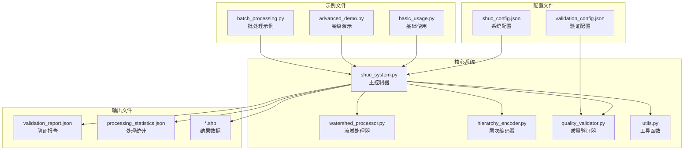
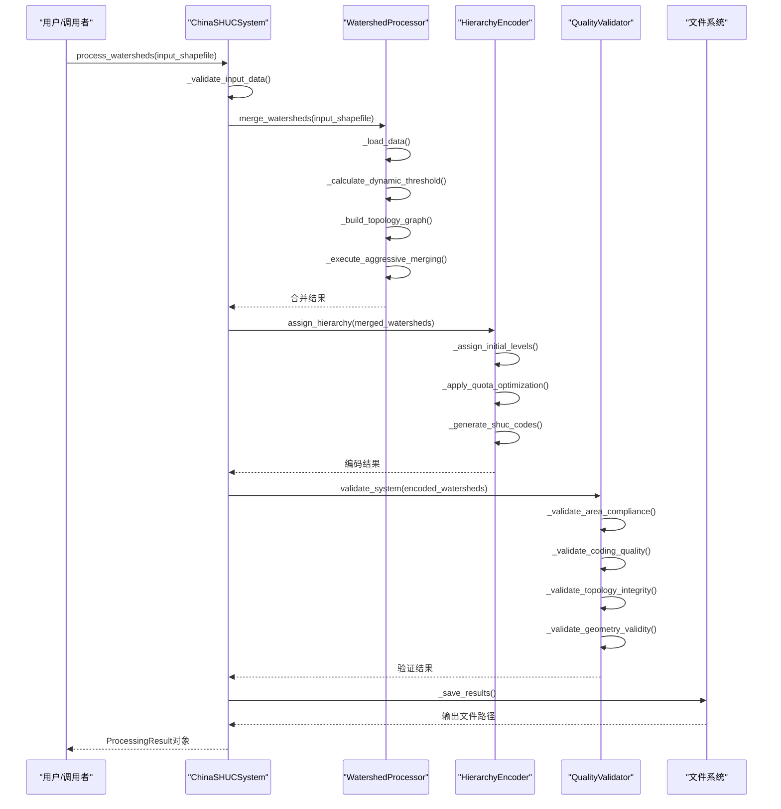
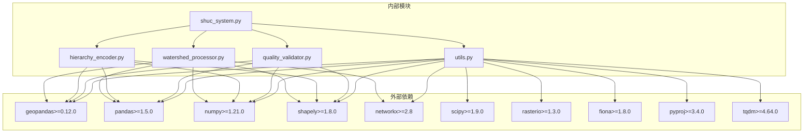

# API参考文档

<cite>
**本文档引用的文件**
- [shuc_system.py](file://01_CORE_SYSTEM/src/shuc_system.py)
- [watershed_processor.py](file://01_CORE_SYSTEM/src/watershed_processor.py)
- [hierarchy_encoder.py](file://01_CORE_SYSTEM/src/hierarchy_encoder.py)
- [quality_validator.py](file://01_CORE_SYSTEM/src/quality_validator.py)
- [utils.py](file://01_CORE_SYSTEM/src/utils.py)
- [shuc_config.json](file://01_CORE_SYSTEM/config/shuc_config.json)
- [validation_config.json](file://01_CORE_SYSTEM/config/validation_config.json)
- [basic_usage.py](file://01_CORE_SYSTEM/examples/basic_usage.py)
- [advanced_demo.py](file://01_CORE_SYSTEM/examples/advanced_demo.py)
- [batch_processing.py](file://01_CORE_SYSTEM/examples/batch_processing.py)
- [requirements.txt](file://01_CORE_SYSTEM/requirements.txt)
</cite>

## 目录
1. [简介](#简介)
2. [项目结构](#项目结构)
3. [核心组件](#核心组件)
4. [架构概览](#架构概览)
5. [详细组件分析](#详细组件分析)
6. [依赖关系分析](#依赖关系分析)
7. [性能考虑](#性能考虑)
8. [故障排除指南](#故障排除指南)
9. [结论](#结论)

## 简介

中国SHUC系统是一个专为中国的地理环境设计的流域层次分级编码系统。该系统实现了基于美国HUC标准的4-6级完整层次编码体系，支持90%面积合规率的智能合并算法，并提供了全面的质量验证系统。

系统采用模块化设计，包含四个核心组件：WatershedProcessor（流域处理器）、HierarchyEncoder（层次编码器）、QualityValidator（质量验证器）和ChinaSHUCSystem（主控制器）。每个组件都有明确的职责分工，通过清晰的接口进行交互。

## 项目结构



**图表来源**
- [shuc_system.py:1-335](file://01_CORE_SYSTEM/src/shuc_system.py#L1-L335)
- [watershed_processor.py:1-377](file://01_CORE_SYSTEM/src/watershed_processor.py#L1-L377)
- [hierarchy_encoder.py:1-219](file://01_CORE_SYSTEM/src/hierarchy_encoder.py#L1-L219)
- [quality_validator.py:1-411](file://01_CORE_SYSTEM/src/quality_validator.py#L1-L411)

**章节来源**
- [shuc_system.py:1-335](file://01_CORE_SYSTEM/src/shuc_system.py#L1-L335)
- [requirements.txt:1-46](file://01_CORE_SYSTEM/requirements.txt#L1-L46)

## 核心组件

### ChinaSHUCSystem主类

ChinaSHUCSystem是整个系统的主控制器，负责协调各个子组件的工作流程。它实现了完整的处理管道，从数据预处理到最终结果输出。

**构造函数参数**
- `config_path` (str, 可选): 配置文件路径，默认使用 `config/shuc_config.json`
- `output_dir` (str, 可选): 输出目录，默认为 `output/`

**核心方法**

#### process_watersheds(input_shapefile, output_name=None)
- **功能**: 处理流域数据的主要方法
- **参数**:
  - `input_shapefile` (str): 输入的流域shapefile路径
  - `output_name` (str, 可选): 输出文件名前缀，默认为'shuc_watersheds'
- **返回值**: ProcessingResult对象，包含处理结果和统计信息
- **异常**: 当输入数据验证失败或处理过程中出现错误时抛出异常

**章节来源**
- [shuc_system.py:51-164](file://01_CORE_SYSTEM/src/shuc_system.py#L51-L164)

### ProcessingResult结果类

ProcessingResult类封装了所有处理结果和统计信息，提供了便捷的属性访问和结果摘要功能。

**属性**
- `watershed_data`: GeoDataFrame类型的流域数据
- `merge_stats`: 合并统计信息字典
- `encoding_stats`: 编码统计信息字典
- `validation_result`: 验证结果字典
- `output_files`: 输出文件路径映射
- `processing_time`: 处理耗时（秒）
- `system_config`: 系统配置

**便捷属性**
- `watershed_count`: 处理后的流域数量
- `compliance_rate`: 面积合规率
- `compression_rate`: 数据压缩率
- `overall_score`: 系统整体评分

**方法**
- `print_summary()`: 打印结果摘要到控制台

**章节来源**
- [shuc_system.py:251-286](file://01_CORE_SYSTEM/src/shuc_system.py#L251-L286)

## 架构概览



**图表来源**
- [shuc_system.py:92-164](file://01_CORE_SYSTEM/src/shuc_system.py#L92-L164)
- [watershed_processor.py:54-82](file://01_CORE_SYSTEM/src/watershed_processor.py#L54-L82)
- [hierarchy_encoder.py:69-95](file://01_CORE_SYSTEM/src/hierarchy_encoder.py#L69-L95)
- [quality_validator.py:61-86](file://01_CORE_SYSTEM/src/quality_validator.py#L61-L86)

## 详细组件分析

### WatershedProcessor类

WatershedProcessor负责流域数据的智能合并处理，实现90%面积合规率的核心算法。

**构造函数参数**
- `config` (dict): 处理配置参数

**核心配置参数**
- `target_compliance_rate`: 目标合规率，默认0.90
- `merge_strategy`: 合并策略，默认"aggressive"
- `max_iterations`: 最大迭代次数，默认50
- `enable_early_stopping`: 是否启用早停机制，默认True

**核心方法**

#### merge_watersheds(input_shapefile)
- **功能**: 执行流域合并的主要方法
- **返回值**: 字典，包含合并后的数据、统计信息和合并历史
- **处理步骤**:
  1. 加载和预处理数据
  2. 计算动态阈值
  3. 构建拓扑图
  4. 执行激进合并

#### _calculate_dynamic_threshold()
- **功能**: 基于数据分布的自适应阈值计算
- **算法**: `threshold = max(50, min(100, Q75 + (Q90-Q75)/2))`
- **返回值**: 动态阈值（平方千米）

#### _execute_aggressive_merging()
- **功能**: 执行激进合并策略
- **早停条件**: 当合规率达到目标阈值时停止
- **返回值**: 合并统计信息字典

**章节来源**
- [watershed_processor.py:35-221](file://01_CORE_SYSTEM/src/watershed_processor.py#L35-L221)

### HierarchyEncoder类

HierarchyEncoder负责流域层次分配和SHUC编码生成，实现4-6级完整的编码体系。

**构造函数参数**
- `config` (dict): 层次配置参数

**核心配置参数**
- `level_4_min_area`: 第4级最小面积，默认1000 km²
- `level_5_min_area`: 第5级最小面积，默认200 km²
- `level_6_min_area`: 第6级最小面积，默认50 km²

**核心配置参数**
- `enable_level_quotas`: 是否启用层级配额，默认True
- `level_quotas`: 各层级配额限制

**核心方法**

#### assign_hierarchy(watershed_data)
- **功能**: 分配流域层次等级并生成SHUC编码
- **处理步骤**:
  1. 基于面积分配初始层次
  2. 应用配额限制和优化
  3. 生成SHUC编码
  4. 计算统计信息

#### _assign_initial_levels(watershed_data)
- **功能**: 基于面积分配初始层次
- **分级标准**:
  - Level 1: ≥ 50000 km² (2位编码)
  - Level 2: ≥ 10000 km² (4位编码)
  - Level 3: ≥ 2000 km² (6位编码)
  - Level 4: ≥ 1000 km² (8位编码)
  - Level 5: ≥ 200 km² (10位编码)
  - Level 6: ≥ 50 km² (12位编码)

#### _generate_shuc_codes(watershed_data)
- **功能**: 生成SHUC编码
- **编码规则**: 按级别分组，按面积排序分配编码
- **溢出处理**: 当编码空间不足时使用特殊标识符

**章节来源**
- [hierarchy_encoder.py:32-219](file://01_CORE_SYSTEM/src/hierarchy_encoder.py#L32-L219)

### QualityValidator类

QualityValidator负责SHUC系统的全面质量验证，实现多维度的质量评估。

**构造函数参数**
- `config` (dict): 验证配置参数

**核心配置参数**
- `area_compliance_threshold`: 面积合规性阈值，默认0.80
- `coding_uniqueness_threshold`: 编码唯一性阈值，默认1.00
- `topology_completeness_threshold`: 拓扑完整性阈值，默认0.95

**质量权重**
- 面积合规性: 40%
- 编码质量: 30%
- 拓扑完整性: 20%
- 几何有效性: 10%

**核心方法**

#### validate_system(watershed_data)
- **功能**: 执行完整的系统验证
- **返回值**: 包含所有验证结果的字典
- **验证维度**:
  1. 面积合规性检查
  2. 编码质量验证
  3. 拓扑完整性检查
  4. 几何有效性验证

#### _validate_area_compliance(watershed_data)
- **功能**: 验证面积合规性
- **算法**: 使用与处理器相同的动态阈值计算
- **返回值**: 包含合规率、阈值和分布信息

#### _validate_topology_integrity(watershed_data)
- **功能**: 验证拓扑完整性
- **检查内容**:
  - 下游引用有效性
  - 循环引用检测
  - 孤立流域识别
- **返回值**: 包含完整性评分和问题识别

**章节来源**
- [quality_validator.py:35-411](file://01_CORE_SYSTEM/src/quality_validator.py#L35-L411)

### utils工具模块

utils模块提供SHUC系统的通用工具函数，包括配置管理、日志设置和数据验证。

**核心函数**

#### setup_logging(log_file_path=None, log_level=logging.INFO)
- **功能**: 设置日志系统
- **参数**:
  - `log_file_path`: 日志文件路径
  - `log_level`: 日志级别
- **返回值**: 配置好的日志器

#### load_config(config_path, default_config=None)
- **功能**: 加载配置文件
- **参数**:
  - `config_path`: 配置文件路径
  - `default_config`: 默认配置
- **返回值**: 合并后的配置字典

#### validate_shapefile(shapefile_path)
- **功能**: 验证shapefile文件
- **返回值**: 包含验证结果的字典

**章节来源**
- [utils.py:24-360](file://01_CORE_SYSTEM/src/utils.py#L24-L360)

## 依赖关系分析



**图表来源**
- [requirements.txt:4-46](file://01_CORE_SYSTEM/requirements.txt#L4-L46)
- [shuc_system.py:38-41](file://01_CORE_SYSTEM/src/shuc_system.py#L38-L41)

**章节来源**
- [requirements.txt:1-46](file://01_CORE_SYSTEM/requirements.txt#L1-L46)

## 性能考虑

### 算法复杂度分析

1. **WatershedProcessor.merge_watersheds()**
   - 时间复杂度: O(n²)，其中n是流域数量
   - 空间复杂度: O(n)
   - 主要瓶颈: 相邻流域搜索和几何合并操作

2. **HierarchyEncoder.assign_hierarchy()**
   - 时间复杂度: O(n log n)，主要由排序操作决定
   - 空间复杂度: O(n)
   - 主要瓶颈: 按面积排序和编码分配

3. **QualityValidator.validate_system()**
   - 时间复杂度: O(n)，线性扫描所有流域
   - 空间复杂度: O(1)
   - 主要瓶颈: 几何有效性检查和拓扑关系分析

### 优化建议

1. **内存优化**
   - 使用分块处理大数据集
   - 及时释放不需要的中间结果
   - 考虑使用更高效的数据结构

2. **并行处理**
   - 利用joblib进行并行计算
   - 实现多进程处理几何操作
   - 考虑使用numba进行数值计算加速

3. **算法优化**
   - 实现空间索引提高邻域搜索效率
   - 使用向量化操作替代循环
   - 缓存计算结果避免重复计算

## 故障排除指南

### 常见错误类型

1. **输入数据错误**
   - 文件不存在或无法读取
   - 缺少必需的几何字段
   - 数据格式不正确

2. **配置错误**
   - 配置文件格式错误
   - 参数值超出合理范围
   - 缺少必要的配置项

3. **处理过程错误**
   - 几何有效性问题
   - 拓扑关系冲突
   - 内存不足

### 错误处理策略

**输入数据验证**
```python
def _validate_input_data(self, input_shapefile):
    """验证输入数据"""
    validation_result = {'valid': True, 'errors': [], 'warnings': []}
    
    # 检查文件存在性
    if not Path(input_shapefile).exists():
        validation_result['valid'] = False
        validation_result['errors'].append(f"输入文件不存在: {input_shapefile}")
        return validation_result
    
    try:
        import geopandas as gpd
        gdf = gpd.read_file(input_shapefile)
        
        # 检查数据基本要求
        if len(gdf) == 0:
            validation_result['valid'] = False
            validation_result['errors'].append("输入数据为空")
        
        # 检查必需字段
        required_fields = ['LINKNO', 'DSLINKNO1', 'USLINKNO2']
        missing_fields = [field for field in required_fields if field not in gdf.columns]
        if missing_fields:
            validation_result['warnings'].append(f"缺少推荐字段: {missing_fields}")
            
    except Exception as e:
        validation_result['valid'] = False
        validation_result['errors'].append(f"数据读取错误: {e}")
    
    return validation_result
```

**异常处理最佳实践**
- 在关键操作前后添加try-catch块
- 记录详细的错误信息和上下文
- 提供有意义的错误消息给用户
- 实现优雅降级和回退机制

**调试信息收集**
- 启用详细日志记录
- 保存中间处理结果
- 记录性能指标
- 提供诊断报告

**章节来源**
- [shuc_system.py:165-196](file://01_CORE_SYSTEM/src/shuc_system.py#L165-L196)

## 结论

中国SHUC系统提供了一个完整、高效的流域层次分级编码解决方案。系统的设计充分考虑了中国地理环境的特点，实现了90%面积合规率的智能合并算法，并提供了全面的质量验证体系。

通过模块化的设计，系统具有良好的可扩展性和可维护性。每个组件都有明确的职责和清晰的接口，便于单独测试和优化。同时，系统提供了丰富的配置选项，可以根据不同的应用场景进行定制。

未来的发展方向包括：
- 实现并行处理以提高大规模数据的处理效率
- 增强机器学习算法以进一步提升合并质量
- 扩展支持更多的地理数据格式和投影系统
- 提供Web服务接口以支持云端部署