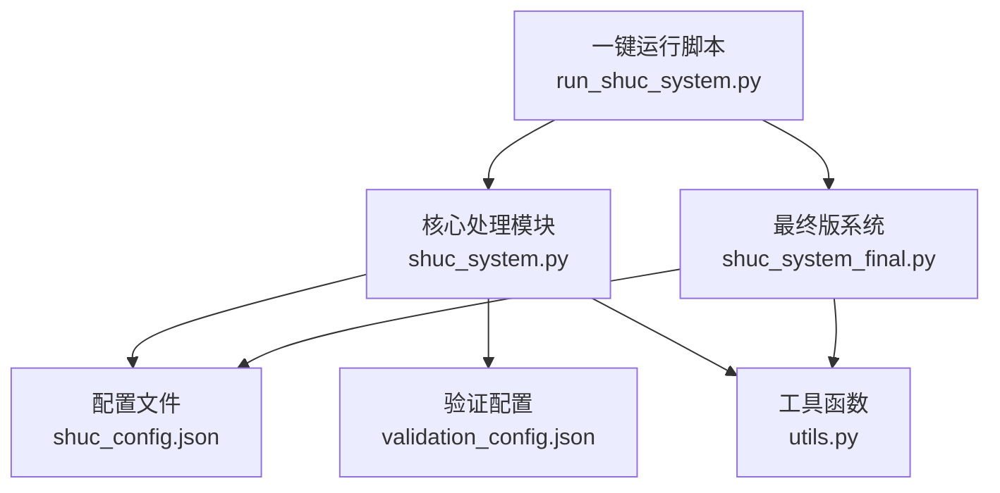
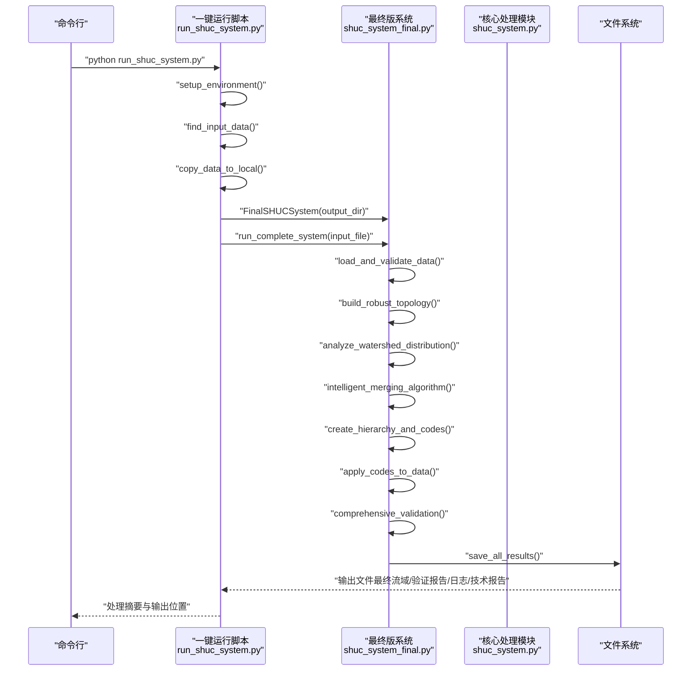
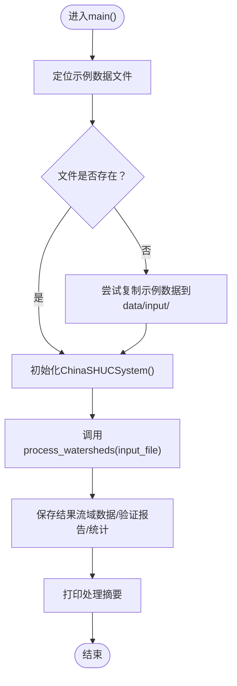
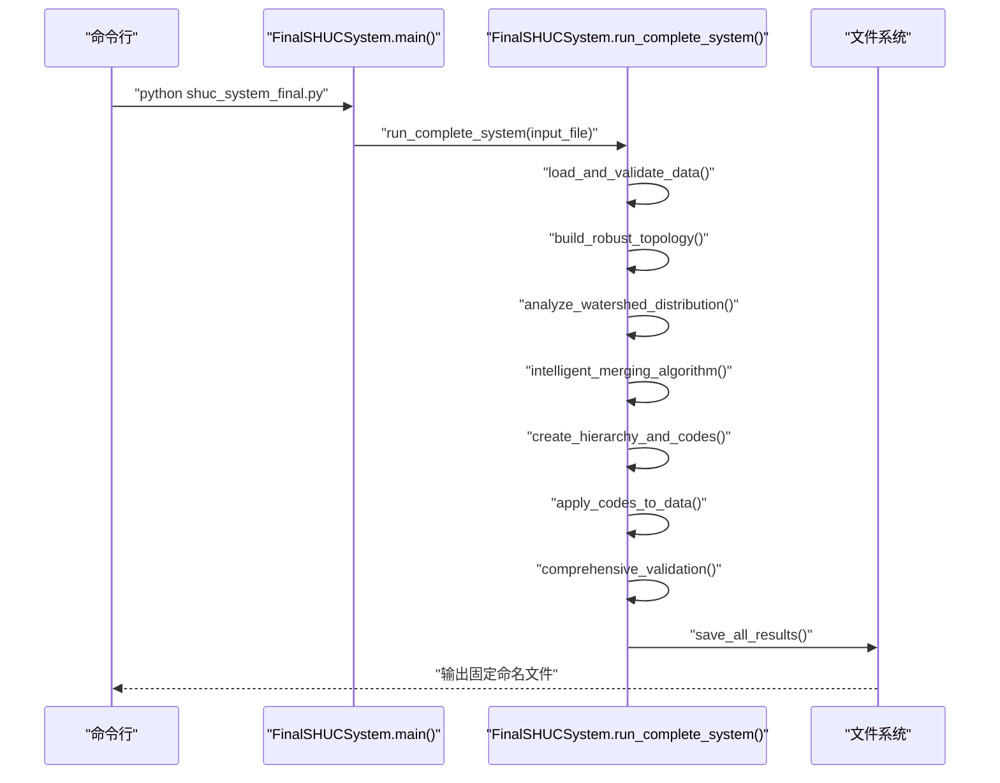
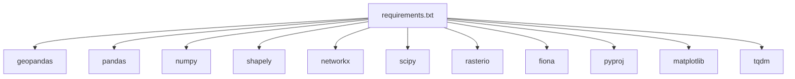

# 命令行接口

<cite>
**本文引用的文件**   
- [README.md](file://README.md)
- [run_shuc_system.py](file://03_EXTENSIONS/run_shuc_system.py)
- [shuc_system.py](file://01_CORE_SYSTEM/src/shuc_system.py)
- [shuc_system_final.py](file://03_EXTENSIONS/shuc_system_final.py)
- [shuc_config.json](file://01_CORE_SYSTEM/config/shuc_config.json)
- [validation_config.json](file://01_CORE_SYSTEM/config/validation_config.json)
- [requirements.txt](file://01_CORE_SYSTEM/requirements.txt)
- [basic_usage.py](file://01_CORE_SYSTEM/examples/basic_usage.py)
- [batch_processing.py](file://01_CORE_SYSTEM/examples/batch_processing.py)
- [utils.py](file://01_CORE_SYSTEM/src/utils.py)
</cite>

## 目录
1. [简介](#简介)
2. [项目结构](#项目结构)
3. [核心组件](#核心组件)
4. [架构总览](#架构总览)
5. [详细组件分析](#详细组件分析)
6. [依赖分析](#依赖分析)
7. [性能考虑](#性能考虑)
8. [故障排查指南](#故障排查指南)
9. [结论](#结论)
10. [附录](#附录)

## 简介
本文件面向SHUC系统的命令行使用，系统提供两种主要的一键运行脚本与核心处理模块：
- 一键运行脚本：自动查找输入数据、准备环境、执行完整处理流程，并输出结构化结果。
- 核心处理模块：提供可编程接口，支持在代码中直接调用处理流程，便于批处理与二次开发。

本文件将详细说明命令行参数选项、执行流程、参数组合、输出文件格式与命名规则、常见错误诊断与解决方法，并给出自动化脚本与批处理最佳实践建议。

## 项目结构
围绕命令行接口的关键文件与职责如下：
- 一键运行脚本：负责环境检查、数据准备、系统运行与结果展示。
- 核心处理模块：封装完整的SHUC处理流程（数据验证、智能合并、层次编码、质量验证、结果保存）。
- 配置文件：定义处理策略、层次标准、验证阈值与输出行为。
- 示例脚本：演示基础使用与批处理场景，便于理解参数与输出。

**图表来源**
- [run_shuc_system.py:167-211](file://03_EXTENSIONS/run_shuc_system.py#L167-L211)
- [shuc_system.py:288-335](file://01_CORE_SYSTEM/src/shuc_system.py#L288-L335)
- [shuc_system_final.py:767-800](file://03_EXTENSIONS/shuc_system_final.py#L767-L800)

**章节来源**
- [README.md:34-46](file://README.md#L34-L46)
- [run_shuc_system.py:167-211](file://03_EXTENSIONS/run_shuc_system.py#L167-L211)
- [shuc_system.py:288-335](file://01_CORE_SYSTEM/src/shuc_system.py#L288-L335)
- [shuc_system_final.py:767-800](file://03_EXTENSIONS/shuc_system_final.py#L767-L800)

## 核心组件
- 一键运行脚本（run_shuc_system.py）
  - 自动环境检查与依赖校验
  - 自动查找与复制输入数据至本地data目录
  - 调用FinalSHUCSystem执行完整流程
  - 输出处理摘要与结果文件清单
- 核心处理模块（shuc_system.py）
  - 提供process_watersheds接口，支持传入输入文件路径与输出文件名前缀
  - 内部集成数据验证、智能合并、层次编码、质量验证与结果保存
  - 默认输出目录为output，可通过构造函数指定
- 最终版系统（shuc_system_final.py）
  - 提供run_complete_system接口，封装从数据加载到结果保存的全流程
  - 输出固定命名的文件集合（最终流域、验证报告、处理日志、技术报告）

**章节来源**
- [run_shuc_system.py:167-211](file://03_EXTENSIONS/run_shuc_system.py#L167-L211)
- [shuc_system.py:92-164](file://01_CORE_SYSTEM/src/shuc_system.py#L92-L164)
- [shuc_system_final.py:732-766](file://03_EXTENSIONS/shuc_system_final.py#L732-L766)

## 架构总览
下面的序列图展示了从命令行到系统内部处理的完整调用链：

**图表来源**
- [run_shuc_system.py:167-211](file://03_EXTENSIONS/run_shuc_system.py#L167-L211)
- [shuc_system_final.py:146-171](file://03_EXTENSIONS/shuc_system_final.py#L146-L171)
- [shuc_system_final.py:289-337](file://03_EXTENSIONS/shuc_system_final.py#L289-L337)
- [shuc_system_final.py:732-766](file://03_EXTENSIONS/shuc_system_final.py#L732-L766)

## 详细组件分析

### 一键运行脚本（run_shuc_system.py）
- 功能要点
  - 环境检查：验证依赖包是否安装，缺失时提示安装命令
  - 输入数据查找：按预设路径搜索流域.shp及其相关文件
  - 数据准备：将所需文件复制到本地data目录，确保后续处理可用
  - 系统运行：创建FinalSHUCSystem并执行完整流程
  - 结果展示：打印处理摘要与输出文件清单，指导用户查看结果
- 命令行参数
  - 该脚本未定义命令行参数解析逻辑；其行为由内置逻辑控制（如输出目录、输入数据路径）
- 输出文件
  - 最终流域数据、验证报告、处理日志、技术报告（见“输出文件格式与命名规则”）

**章节来源**
- [run_shuc_system.py:20-41](file://03_EXTENSIONS/run_shuc_system.py#L20-L41)
- [run_shuc_system.py:43-65](file://03_EXTENSIONS/run_shuc_system.py#L43-L65)
- [run_shuc_system.py:67-102](file://03_EXTENSIONS/run_shuc_system.py#L67-L102)
- [run_shuc_system.py:167-211](file://03_EXTENSIONS/run_shuc_system.py#L167-L211)

### 核心处理模块（shuc_system.py）
- 功能要点
  - 初始化：加载配置、设置输出目录、初始化日志
  - 数据处理：验证输入、智能合并、层次编码、质量验证、保存结果
  - 结果封装：返回ProcessingResult对象，包含统计数据与输出文件路径
- 命令行入口
  - main()函数作为命令行入口，自动定位示例数据并调用process_watersheds
- 参数与行为
  - 输入文件：通过process_watersheds的input_shapefile参数传入
  - 输出文件名前缀：通过output_name参数控制（默认为shuc_watersheds）
  - 输出目录：通过构造函数的output_dir参数控制（默认为项目根目录下的output）

**图表来源**
- [shuc_system.py:288-335](file://01_CORE_SYSTEM/src/shuc_system.py#L288-L335)
- [shuc_system.py:92-164](file://01_CORE_SYSTEM/src/shuc_system.py#L92-L164)
- [shuc_system.py:198-237](file://01_CORE_SYSTEM/src/shuc_system.py#L198-L237)

**章节来源**
- [shuc_system.py:288-335](file://01_CORE_SYSTEM/src/shuc_system.py#L288-L335)
- [shuc_system.py:92-164](file://01_CORE_SYSTEM/src/shuc_system.py#L92-L164)
- [shuc_system.py:198-237](file://01_CORE_SYSTEM/src/shuc_system.py#L198-L237)

### 最终版系统（shuc_system_final.py）
- 功能要点
  - 数据加载与验证：读取shapefile，补全面积字段，修复数据问题
  - 拓扑构建：基于上下游关系构建健壮的拓扑图
  - 智能合并：按面积与拓扑关系进行优先级合并
  - 层次编码：生成6级SHUC编码并应用到数据
  - 质量验证：计算合规率、唯一性、层次分布等指标
  - 结果保存：输出最终流域、验证报告、处理日志、技术报告
- 命令行入口
  - main()函数作为命令行入口，自动定位输入文件并调用run_complete_system
- 输出文件
  - final_shuc_watersheds.shp
  - system_validation.json
  - process_log.txt
  - technical_report.txt

**图表来源**
- [shuc_system_final.py:767-800](file://03_EXTENSIONS/shuc_system_final.py#L767-L800)
- [shuc_system_final.py:732-766](file://03_EXTENSIONS/shuc_system_final.py#L732-L766)
- [shuc_system_final.py:647-686](file://03_EXTENSIONS/shuc_system_final.py#L647-L686)

**章节来源**
- [shuc_system_final.py:767-800](file://03_EXTENSIONS/shuc_system_final.py#L767-L800)
- [shuc_system_final.py:732-766](file://03_EXTENSIONS/shuc_system_final.py#L732-L766)
- [shuc_system_final.py:647-686](file://03_EXTENSIONS/shuc_system_final.py#L647-L686)

## 依赖分析
- 运行时依赖
  - Python版本要求：3.8及以上（建议3.9+）
  - 关键库：geopandas、pandas、numpy、shapely、networkx、scipy、rasterio、fiona、pyproj、matplotlib、tqdm等
- 一键运行脚本的依赖检查
  - 在运行前会检查必需包是否安装，缺失时提示安装命令
- 配置文件
  - shuc_config.json：定义处理策略、层次标准、验证权重与输出行为
  - validation_config.json：定义验证阈值、权重与报告设置

**图表来源**
- [requirements.txt:5-46](file://01_CORE_SYSTEM/requirements.txt#L5-L46)

**章节来源**
- [requirements.txt:5-46](file://01_CORE_SYSTEM/requirements.txt#L5-L46)
- [run_shuc_system.py:24-38](file://03_EXTENSIONS/run_shuc_system.py#L24-L38)
- [shuc_config.json:1-43](file://01_CORE_SYSTEM/config/shuc_config.json#L1-L43)
- [validation_config.json:1-46](file://01_CORE_SYSTEM/config/validation_config.json#L1-L46)

## 性能考虑
- 处理策略
  - 配置文件中提供性能相关开关（如并行处理、内存上限、进度显示），可根据数据规模调整
- 批处理建议
  - 使用examples中的批处理示例，结合不同配置策略进行对比，选择最优参数组合
- I/O与存储
  - 输出目录默认为output，建议在具备充足磁盘空间的环境中运行
  - 大数据集建议启用进度显示与合理的内存上限，避免内存溢出

**章节来源**
- [shuc_config.json:38-42](file://01_CORE_SYSTEM/config/shuc_config.json#L38-L42)
- [batch_processing.py:227-327](file://01_CORE_SYSTEM/examples/batch_processing.py#L227-L327)

## 故障排查指南
- 环境依赖缺失
  - 现象：运行时报错提示缺少依赖包
  - 处理：根据提示安装requirements.txt中列出的依赖
- 输入数据文件不存在
  - 现象：找不到输入数据文件，或复制数据失败
  - 处理：确认数据文件路径正确，或使用一键运行脚本自动准备数据
- 数据读取错误
  - 现象：shapefile读取失败或数据为空
  - 处理：检查数据完整性，确保包含几何字段与有效记录
- 版本不兼容
  - 现象：提示需要Python 3.8或更高版本
  - 处理：升级Python版本至3.8及以上（建议3.9+）

**章节来源**
- [run_shuc_system.py:24-38](file://03_EXTENSIONS/run_shuc_system.py#L24-L38)
- [shuc_system.py:165-196](file://01_CORE_SYSTEM/src/shuc_system.py#L165-L196)
- [utils.py:322-346](file://01_CORE_SYSTEM/src/utils.py#L322-L346)

## 结论
SHUC系统提供了灵活的命令行使用方式：既可通过一键运行脚本快速完成端到端处理，也可通过核心处理模块在代码中定制参数与流程。配合完善的配置文件与验证机制，用户可以高效地完成从输入数据到最终编码结果的全流程处理，并获得结构化的输出文件与质量报告。

## 附录

### 命令行参数与使用方法
- 一键运行脚本（run_shuc_system.py）
  - 无显式命令行参数；行为由内置逻辑控制
  - 常用操作：在01_CORE_SYSTEM目录下执行，自动准备数据并运行
- 核心处理模块（shuc_system.py）
  - 命令行入口：main()函数，自动定位示例数据并处理
  - 编程入口：process_watersheds(input_shapefile, output_name=None)，支持自定义输出文件名前缀
  - 输出目录：默认output，可通过构造函数指定
- 最终版系统（shuc_system_final.py）
  - 命令行入口：main()函数，自动定位输入文件并运行完整流程
  - 输出目录：默认output，可通过构造函数指定

**章节来源**
- [run_shuc_system.py:167-211](file://03_EXTENSIONS/run_shuc_system.py#L167-L211)
- [shuc_system.py:288-335](file://01_CORE_SYSTEM/src/shuc_system.py#L288-L335)
- [shuc_system.py:92-164](file://01_CORE_SYSTEM/src/shuc_system.py#L92-L164)
- [shuc_system_final.py:767-800](file://03_EXTENSIONS/shuc_system_final.py#L767-L800)

### 命令行执行流程与参数组合
- 基本使用
  - 进入01_CORE_SYSTEM目录，安装依赖后运行示例脚本或核心模块
- 参数定制
  - 通过构造函数指定output_dir与config_path，或在调用process_watersheds时指定output_name
- 批量处理
  - 使用examples中的批处理示例，对比不同配置策略，生成对比报告

**章节来源**
- [README.md:34-46](file://README.md#L34-L46)
- [basic_usage.py:25-74](file://01_CORE_SYSTEM/examples/basic_usage.py#L25-L74)
- [batch_processing.py:227-327](file://01_CORE_SYSTEM/examples/batch_processing.py#L227-L327)

### 输出文件格式与命名规则
- 最终版系统（shuc_system_final.py）
  - final_shuc_watersheds.shp：最终编码后的流域数据（矢量文件）
  - system_validation.json：系统验证报告（JSON格式）
  - process_log.txt：处理日志（文本文件）
  - technical_report.txt：技术报告（文本文件）
- 核心处理模块（shuc_system.py）
  - {output_name}.shp：最终流域数据（默认output_name为shuc_watersheds）
  - validation_report.json：验证报告（JSON格式）
  - processing_statistics.json：处理统计（JSON格式）

**章节来源**
- [shuc_system_final.py:647-686](file://03_EXTENSIONS/shuc_system_final.py#L647-L686)
- [shuc_system.py:198-237](file://01_CORE_SYSTEM/src/shuc_system.py#L198-L237)

### 常见命令行错误与解决方法
- 缺少依赖包
  - 现象：导入失败或运行时报错
  - 解决：安装requirements.txt中列出的依赖
- 输入数据路径错误
  - 现象：找不到输入文件
  - 解决：确认数据文件存在，或使用一键运行脚本自动准备数据
- Python版本过低
  - 现象：提示需要Python 3.8+
  - 解决：升级Python版本

**章节来源**
- [requirements.txt:5-46](file://01_CORE_SYSTEM/requirements.txt#L5-L46)
- [run_shuc_system.py:24-38](file://03_EXTENSIONS/run_shuc_system.py#L24-L38)
- [utils.py:322-346](file://01_CORE_SYSTEM/src/utils.py#L322-L346)

### 自动化脚本编写指南与批处理最佳实践
- 自动化脚本
  - 使用examples中的批处理示例作为模板，定义不同配置策略，循环处理多个数据集
  - 通过临时配置文件与输出目录隔离，便于结果对比与归档
- 批处理最佳实践
  - 预先准备数据目录，确保输入文件齐全（.shp/.shx/.dbf/.prj/.cpg）
  - 使用不同的配置策略进行对比，关注合规率、压缩率与处理时间
  - 生成对比报告（CSV/JSON），便于后续分析与决策

**章节来源**
- [batch_processing.py:31-114](file://01_CORE_SYSTEM/examples/batch_processing.py#L31-L114)
- [batch_processing.py:115-226](file://01_CORE_SYSTEM/examples/batch_processing.py#L115-L226)
- [batch_processing.py:227-327](file://01_CORE_SYSTEM/examples/batch_processing.py#L227-L327)