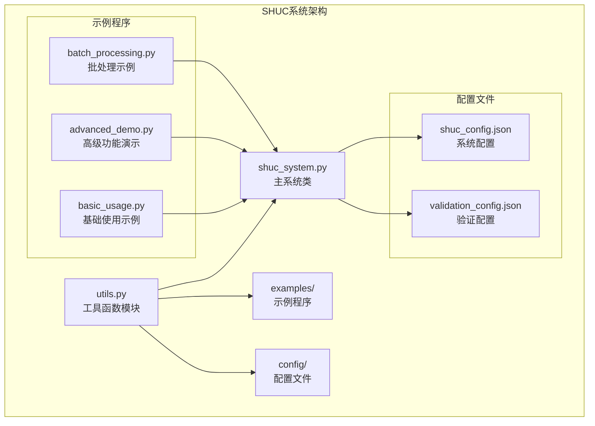
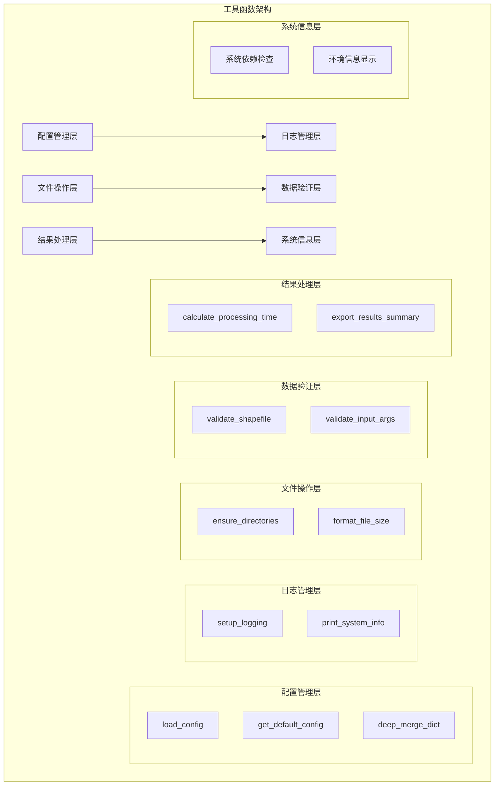
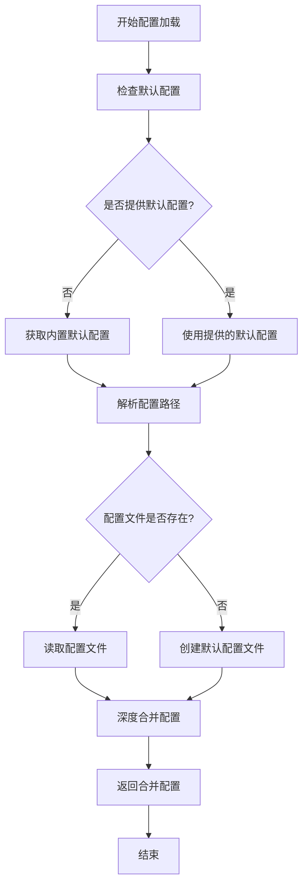
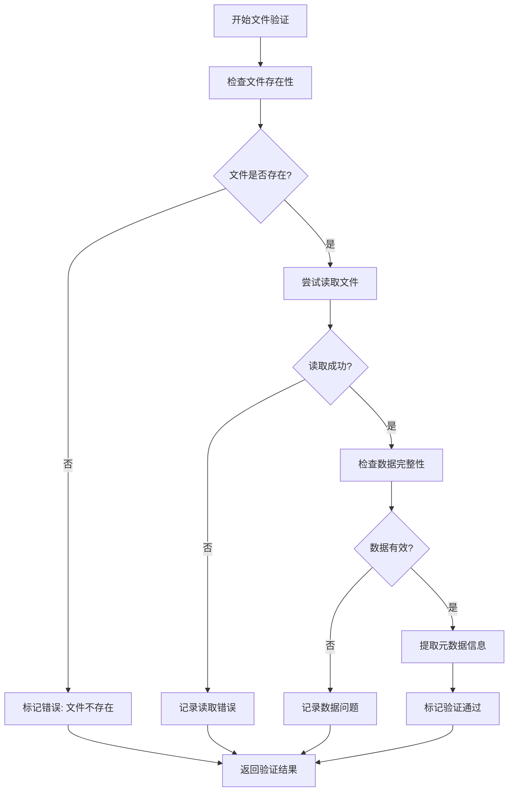
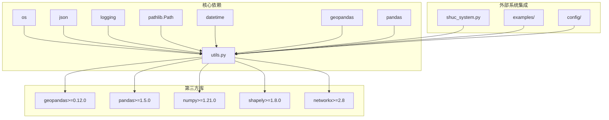

# 工具函数API

<cite>
**本文档引用的文件**
- [utils.py](file://01_CORE_SYSTEM/src/utils.py)
- [shuc_system.py](file://01_CORE_SYSTEM/src/shuc_system.py)
- [basic_usage.py](file://01_CORE_SYSTEM/examples/basic_usage.py)
- [advanced_demo.py](file://01_CORE_SYSTEM/examples/advanced_demo.py)
- [batch_processing.py](file://01_CORE_SYSTEM/examples/batch_processing.py)
- [shuc_config.json](file://01_CORE_SYSTEM/config/shuc_config.json)
- [validation_config.json](file://01_CORE_SYSTEM/config/validation_config.json)
- [requirements.txt](file://01_CORE_SYSTEM/requirements.txt)
</cite>

## 目录
1. [简介](#简介)
2. [项目结构](#项目结构)
3. [核心组件](#核心组件)
4. [架构概览](#架构概览)
5. [详细组件分析](#详细组件分析)
6. [依赖分析](#依赖分析)
7. [性能考虑](#性能考虑)
8. [故障排除指南](#故障排除指南)
9. [结论](#结论)

## 简介

SHUC系统工具函数模块提供了中国流域层次编码系统所需的核心通用功能。该模块包含日志配置、配置管理、文件操作、数据验证等关键工具函数，为整个SHUC系统提供基础设施支持。

SHUC（Spatial Hierarchical Unit Code）系统是中国流域管理的重要组成部分，旨在实现90%面积合规率，支持4-6级完整层次结构。工具函数模块作为系统的基础支撑，确保了配置管理的一致性、日志记录的规范性和数据处理的可靠性。

## 项目结构

SHUC系统采用模块化设计，工具函数位于核心系统src目录下的utils.py文件中，与主系统逻辑分离，便于独立使用和维护。



**图表来源**
- [utils.py:1-360](file://01_CORE_SYSTEM/src/utils.py#L1-L360)
- [shuc_system.py:43-248](file://01_CORE_SYSTEM/src/shuc_system.py#L43-L248)

**章节来源**
- [utils.py:1-360](file://01_CORE_SYSTEM/src/utils.py#L1-L360)
- [shuc_system.py:43-248](file://01_CORE_SYSTEM/src/shuc_system.py#L43-L248)

## 核心组件

工具函数模块包含以下核心功能组件：

### 日志管理系统
- `setup_logging()`: 配置完整的日志系统，支持控制台和文件输出
- `print_system_info()`: 打印系统环境信息和依赖包版本

### 配置管理组件
- `load_config()`: 加载和合并配置文件
- `get_default_config()`: 提供默认配置模板
- `deep_merge_dict()`: 深度合并字典配置

### 文件和数据处理组件
- `ensure_directories()`: 确保目录存在
- `validate_shapefile()`: 验证Shapefile文件完整性
- `format_file_size()`: 格式化文件大小显示

### 时间和结果处理组件
- `calculate_processing_time()`: 计算处理时间
- `export_results_summary()`: 导出结果摘要
- `validate_input_args()`: 验证系统运行条件

**章节来源**
- [utils.py:24-360](file://01_CORE_SYSTEM/src/utils.py#L24-L360)

## 架构概览

工具函数模块采用分层架构设计，为上层业务逻辑提供可靠的基础服务。



**图表来源**
- [utils.py:24-360](file://01_CORE_SYSTEM/src/utils.py#L24-L360)

## 详细组件分析

### setup_logging 日志配置函数

`setup_logging()`函数是SHUC系统的核心日志配置工具，提供灵活的日志记录能力。

#### 函数签名和参数
```python
def setup_logging(log_file_path=None, log_level=logging.INFO):
```

**参数说明:**
- `log_file_path` (可选): 日志文件路径，默认为None
- `log_level` (可选): 日志级别，默认为logging.INFO

**返回值:** `logging.Logger` - 配置好的日志器实例

#### 功能特性
- 支持控制台和文件双重输出
- 自动清理现有处理器，避免重复日志
- 标准化日志格式，包含时间戳、级别和消息
- 智能目录创建，确保日志文件可写

#### 使用场景
- 系统初始化阶段的日志配置
- 批处理任务的进度跟踪
- 错误调试和问题排查
- 性能监控和审计日志

#### 异常处理机制
- 文件处理器创建失败时优雅降级
- 编码错误自动使用UTF-8编码
- 目录权限问题时提供清晰错误信息

**章节来源**
- [utils.py:24-62](file://01_CORE_SYSTEM/src/utils.py#L24-L62)

### load_config 配置加载函数

`load_config()`函数实现了智能配置管理，支持默认配置和用户自定义配置的合并。

#### 函数签名和参数
```python
def load_config(config_path, default_config=None):
```

**参数说明:**
- `config_path` (必需): 配置文件绝对或相对路径
- `default_config` (可选): 默认配置字典，默认为None

**返回值:** `dict` - 合并后的配置字典

#### 配置加载流程



**图表来源**
- [utils.py:64-99](file://01_CORE_SYSTEM/src/utils.py#L64-L99)

#### 配置合并策略
- 深度递归合并字典结构
- 用户配置优先于默认配置
- 支持嵌套配置层级的智能合并

#### 使用场景
- 系统启动时的配置初始化
- 用户自定义配置的动态加载
- 批处理任务的配置管理

#### 错误处理机制
- 配置文件读取失败时使用默认配置
- 文件权限问题时提供降级方案
- JSON解析错误时进行容错处理

**章节来源**
- [utils.py:64-147](file://01_CORE_SYSTEM/src/utils.py#L64-L147)

### ensure_directories 目录管理函数

`ensure_directories()`函数确保指定目录的存在性，支持批量目录创建。

#### 函数签名和参数
```python
def ensure_directories(dir_paths):
```

**参数说明:**
- `dir_paths` (必需): 目录路径列表

**返回值:** `None` - 无返回值

#### 功能特性
- 支持批量目录创建
- 自动创建父级目录
- 使用`exist_ok=True`避免重复创建错误
- 路径标准化处理

#### 使用场景
- 输出目录的预先创建
- 日志文件目录的准备
- 中间结果存储目录的建立

#### 最佳实践
- 在文件写入前调用确保目录存在
- 使用绝对路径避免相对路径问题
- 结合异常处理确保操作可靠性

**章节来源**
- [utils.py:149-158](file://01_CORE_SYSTEM/src/utils.py#L149-L158)

### validate_shapefile 数据验证函数

`validate_shapefile()`函数提供全面的Shapefile文件验证能力。

#### 函数签名和参数
```python
def validate_shapefile(shapefile_path):
```

**参数说明:**
- `shapefile_path` (必需): Shapefile文件路径

**返回值:** `dict` - 验证结果字典

#### 验证结果结构
```python
{
    'valid': False,           # 是否通过验证
    'exists': False,          # 文件是否存在
    'readable': False,        # 文件是否可读
    'record_count': 0,        # 记录数量
    'has_geometry': False,    # 是否包含几何字段
    'crs': None,              # 坐标系信息
    'bounds': None,           # 边界范围
    'columns': [],            # 字段列表
    'errors': []              # 错误列表
}
```

#### 验证流程



**图表来源**
- [utils.py:159-221](file://01_CORE_SYSTEM/src/utils.py#L159-L221)

#### 验证维度
- **存在性验证**: 文件路径正确性和可访问性
- **可读性验证**: 文件格式完整性和编码正确性
- **结构验证**: 几何字段存在性和数据类型正确性
- **内容验证**: 记录数量和字段完整性检查

#### 使用场景
- 输入数据预处理阶段
- 数据质量监控和报告
- 批处理任务的数据准备

**章节来源**
- [utils.py:159-221](file://01_CORE_SYSTEM/src/utils.py#L159-L221)

### 其他重要工具函数

#### deep_merge_dict 深度合并函数
实现字典的深度递归合并，支持嵌套配置的智能合并。

#### format_file_size 文件大小格式化
提供人类可读的文件大小显示格式。

#### calculate_processing_time 时间计算
计算处理时间并提供多种时间单位的格式化输出。

#### export_results_summary 结果导出
将处理结果导出为结构化的JSON格式文件。

#### print_system_info 系统信息显示
打印Python版本、依赖包版本等系统环境信息。

#### validate_input_args 输入参数验证
验证系统运行的基本条件和依赖包完整性。

**章节来源**
- [utils.py:128-360](file://01_CORE_SYSTEM/src/utils.py#L128-L360)

## 依赖分析

工具函数模块的依赖关系体现了其作为基础设施层的特点。



**图表来源**
- [utils.py:16-23](file://01_CORE_SYSTEM/src/utils.py#L16-L23)
- [requirements.txt:4-14](file://01_CORE_SYSTEM/requirements.txt#L4-L14)

### 内部依赖关系

工具函数模块内部具有清晰的依赖层次：

1. **基础依赖**: Python标准库（os, json, logging等）
2. **数据处理依赖**: GeoPandas、Pandas、NumPy
3. **几何计算依赖**: Shapely几何库
4. **图论计算依赖**: NetworkX图算法库

### 外部集成点

- **主系统集成**: ChinaSHUCSystem类直接调用工具函数
- **示例程序集成**: 多个示例脚本使用工具函数功能
- **配置系统集成**: 与shuc_config.json和validation_config.json配合使用

**章节来源**
- [utils.py:16-23](file://01_CORE_SYSTEM/src/utils.py#L16-L23)
- [requirements.txt:4-46](file://01_CORE_SYSTEM/requirements.txt#L4-L46)

## 性能考虑

### 时间复杂度分析

| 函数 | 时间复杂度 | 空间复杂度 | 主要影响因素 |
|------|------------|------------|--------------|
| setup_logging | O(1) | O(1) | 日志处理器数量 |
| load_config | O(n) | O(n) | 配置文件大小 |
| ensure_directories | O(m) | O(1) | 目录层级深度 |
| validate_shapefile | O(k) | O(k) | 数据记录数量 |
| deep_merge_dict | O(n) | O(n) | 字典元素数量 |

### 内存使用优化

1. **延迟加载**: 配置文件仅在需要时读取
2. **增量处理**: Shapefile验证采用流式处理
3. **缓存机制**: 日志器实例复用避免重复创建
4. **内存监控**: 大数据集处理时的内存使用控制

### 并发处理考虑

- 日志系统支持多线程安全
- 文件操作采用原子性写入
- 配置加载支持并发访问的线程安全

## 故障排除指南

### 常见问题和解决方案

#### 配置文件加载失败
**问题**: 配置文件JSON格式错误或权限不足
**解决方案**: 
- 检查JSON语法正确性
- 确认文件读写权限
- 验证配置文件完整性

#### 日志文件写入失败
**问题**: 日志目录权限不足或磁盘空间不足
**解决方案**:
- 检查目录写入权限
- 清理磁盘空间
- 验证路径有效性

#### Shapefile验证失败
**问题**: 文件损坏、编码不兼容或缺少必要字段
**解决方案**:
- 使用GIS软件验证文件完整性
- 检查坐标系和投影设置
- 确认几何字段存在且有效

#### 依赖包版本冲突
**问题**: Python版本过低或依赖包版本不兼容
**解决方案**:
- 升级Python版本至3.8+
- 按requirements.txt安装依赖包
- 使用虚拟环境隔离依赖

### 错误码定义

工具函数模块使用标准的Python异常机制，不定义专门的错误码：

- `ValueError`: 参数验证失败
- `FileNotFoundError`: 文件不存在
- `PermissionError`: 权限不足
- `Exception`: 通用异常处理

### 调试技巧

1. **启用详细日志**: 使用DEBUG级别获取详细执行信息
2. **分步验证**: 逐个验证输入参数和中间结果
3. **单元测试**: 为关键函数编写测试用例
4. **性能监控**: 使用时间测量函数监控执行效率

**章节来源**
- [utils.py:97-99](file://01_CORE_SYSTEM/src/utils.py#L97-L99)
- [utils.py:218](file://01_CORE_SYSTEM/src/utils.py#L218)

## 结论

SHUC系统工具函数模块为整个流域编码系统提供了坚实的基础支撑。通过精心设计的API接口、完善的错误处理机制和高效的性能表现，这些工具函数确保了系统的稳定性和可靠性。

### 主要优势

1. **模块化设计**: 功能明确分离，易于维护和扩展
2. **健壮性**: 完善的错误处理和降级机制
3. **性能优化**: 针对大数据处理的优化策略
4. **易用性**: 简洁直观的API设计和丰富的使用示例

### 应用建议

- 在系统初始化时调用`setup_logging()`配置日志
- 使用`load_config()`管理配置文件，支持用户自定义
- 在数据处理前使用`validate_shapefile()`进行数据验证
- 利用`ensure_directories()`确保输出目录可用
- 通过`calculate_processing_time()`监控处理性能

这些工具函数不仅满足了SHUC系统的技术需求，也为未来的功能扩展和系统优化奠定了良好的基础。