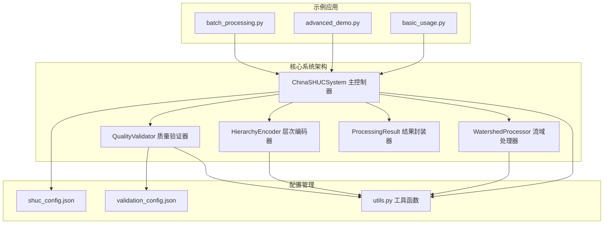
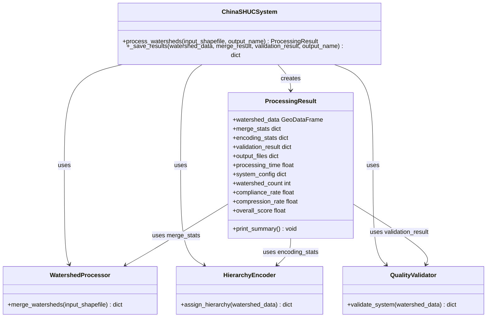
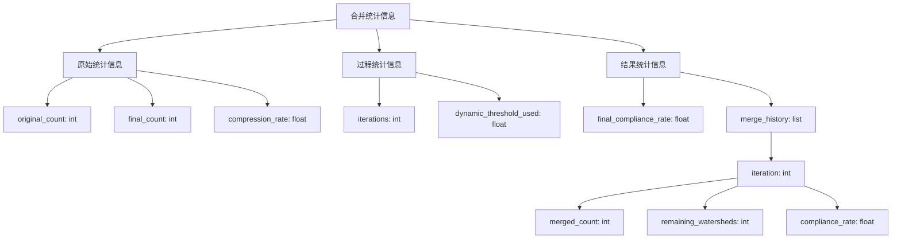
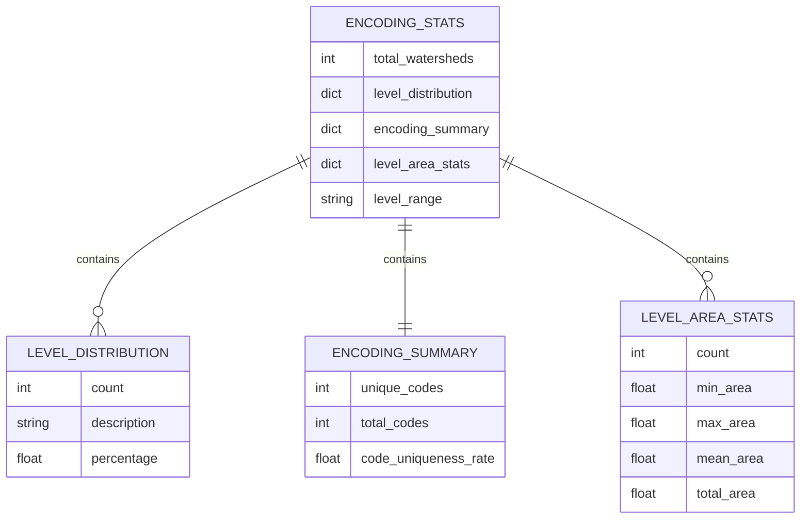
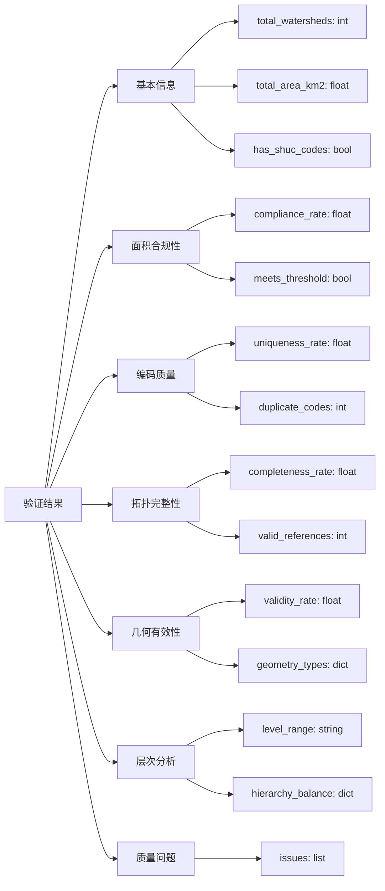
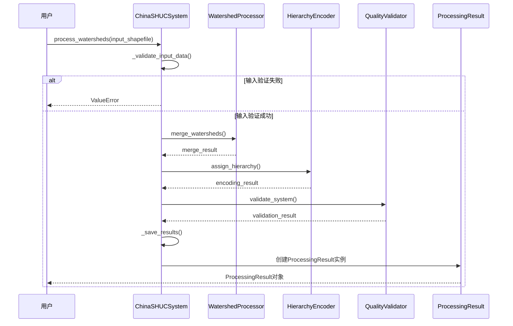
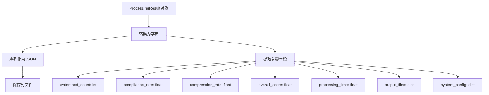
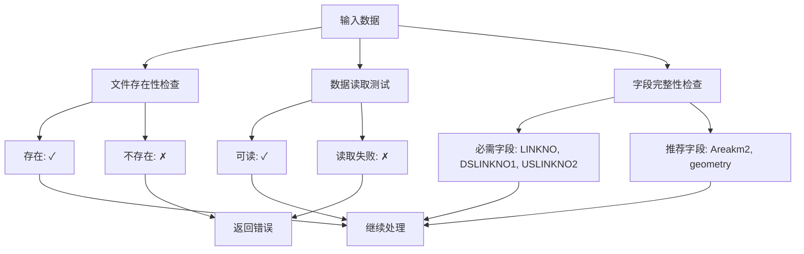

# 数据结构接口

<cite>
**本文档引用的文件**
- [shuc_system.py](file://01_CORE_SYSTEM/src/shuc_system.py)
- [watershed_processor.py](file://01_CORE_SYSTEM/src/watershed_processor.py)
- [hierarchy_encoder.py](file://01_CORE_SYSTEM/src/hierarchy_encoder.py)
- [quality_validator.py](file://01_CORE_SYSTEM/src/quality_validator.py)
- [utils.py](file://01_CORE_SYSTEM/src/utils.py)
- [shuc_config.json](file://01_CORE_SYSTEM/config/shuc_config.json)
- [validation_config.json](file://01_CORE_SYSTEM/config/validation_config.json)
- [basic_usage.py](file://01_CORE_SYSTEM/examples/basic_usage.py)
- [advanced_demo.py](file://01_CORE_SYSTEM/examples/advanced_demo.py)
- [batch_processing.py](file://01_CORE_SYSTEM/examples/batch_processing.py)
</cite>

## 目录
1. [简介](#简介)
2. [项目结构](#项目结构)
3. [核心数据结构](#核心数据结构)
4. [ProcessingResult结果类详解](#processingresult结果类详解)
5. [数据流架构](#数据流架构)
6. [序列化与反序列化](#序列化与反序列化)
7. [验证规则与完整性检查](#验证规则与完整性检查)
8. [性能考虑](#性能考虑)
9. [故障排除指南](#故障排除指南)
10. [结论](#结论)

## 简介

中国SHUC系统是一个专为流域分级编码设计的地理信息系统解决方案。该系统实现了90%面积合规率的智能合并算法，支持完整的4-6级层次编码体系，并具备全面的质量验证系统。本文档详细记录了系统中所有数据结构的API接口，特别是ProcessingResult结果类的完整规范。

## 项目结构

SHUC系统采用模块化架构设计，主要由以下核心组件构成：

**图表来源**
- [shuc_system.py:43-91](file://01_CORE_SYSTEM/src/shuc_system.py#L43-L91)
- [utils.py:64-127](file://01_CORE_SYSTEM/src/utils.py#L64-L127)

**章节来源**
- [shuc_system.py:1-335](file://01_CORE_SYSTEM/src/shuc_system.py#L1-L335)
- [utils.py:1-360](file://01_CORE_SYSTEM/src/utils.py#L1-L360)

## 核心数据结构

### ProcessingResult结果类

ProcessingResult是系统的核心数据结构，用于封装整个处理流程的最终结果。该类提供了统一的结果访问接口，便于用户进行结果分析和后续处理。

#### 类定义与初始化

**图表来源**
- [shuc_system.py:251-286](file://01_CORE_SYSTEM/src/shuc_system.py#L251-L286)
- [shuc_system.py:92-159](file://01_CORE_SYSTEM/src/shuc_system.py#L92-L159)

#### 属性详细说明

| 属性名 | 数据类型 | 描述 | 使用场景 |
|--------|----------|------|----------|
| watershed_data | GeoDataFrame | 编码后的流域数据，包含几何信息和属性字段 | 数据导出、可视化分析 |
| merge_stats | dict | 合并统计信息，包含合并前后的数量变化 | 性能评估、数据压缩率分析 |
| encoding_stats | dict | 编码统计信息，包含层次分布和编码摘要 | 编码质量评估、层次结构分析 |
| validation_result | dict | 质量验证结果，包含多维度验证指标 | 系统质量评估、问题诊断 |
| output_files | dict | 输出文件路径映射，包含各种结果文件 | 结果文件管理和后续处理 |
| processing_time | float | 处理耗时（秒） | 性能监控、资源规划 |
| system_config | dict | 系统配置信息 | 参数回溯、配置审计 |

**章节来源**
- [shuc_system.py:257-271](file://01_CORE_SYSTEM/src/shuc_system.py#L257-L271)

### 合并统计数据结构

合并统计信息是WatershedProcessor模块返回的关键数据结构，用于描述流域合并过程的详细情况。

#### 合并统计字段

**图表来源**
- [watershed_processor.py:213-220](file://01_CORE_SYSTEM/src/watershed_processor.py#L213-L220)
- [watershed_processor.py:190-196](file://01_CORE_SYSTEM/src/watershed_processor.py#L190-L196)

#### 合并历史结构

合并历史记录了每次迭代的详细情况，便于追踪合并过程和调试问题。

| 字段名 | 数据类型 | 描述 |
|--------|----------|------|
| iteration | int | 迭代次数 |
| merged_count | int | 本次迭代合并的流域数量 |
| remaining_watersheds | int | 当前剩余的流域数量 |
| compliance_rate | float | 当前的面积合规率 |

**章节来源**
- [watershed_processor.py:45](file://01_CORE_SYSTEM/src/watershed_processor.py#L45)
- [watershed_processor.py:190-196](file://01_CORE_SYSTEM/src/watershed_processor.py#L190-L196)

### 编码统计数据结构

层次编码统计信息由HierarchyEncoder模块生成，用于描述编码分配和层次结构的详细情况。

#### 编码统计字段

**图表来源**
- [hierarchy_encoder.py:177-219](file://01_CORE_SYSTEM/src/hierarchy_encoder.py#L177-L219)

#### 层次分布统计

| 字段名 | 数据类型 | 描述 |
|--------|----------|------|
| Level_4 | dict | 大流域统计信息 |
| Level_5 | dict | 中流域统计信息 |
| Level_6 | dict | 基本单元统计信息 |

每个级别包含：
- count: 该级别的流域数量
- description: 级别描述（如"大流域"）
- percentage: 占总流域数的百分比

**章节来源**
- [hierarchy_encoder.py:179-194](file://01_CORE_SYSTEM/src/hierarchy_encoder.py#L179-L194)

### 验证结果结构

质量验证结果由QualityValidator模块生成，包含多维度的质量评估指标。

#### 验证结果字段

**图表来源**
- [quality_validator.py:71-86](file://01_CORE_SYSTEM/src/quality_validator.py#L71-L86)

#### 质量评分体系

| 维度 | 权重 | 评分范围 | 质量等级 |
|------|------|----------|----------|
| 面积合规性 | 40% | 0-100分 | 优秀(90-100) |
| 编码质量 | 30% | 0-100分 | 良好(80-89) |
| 拓扑完整性 | 20% | 0-100分 | 可接受(70-79) |
| 几何有效性 | 10% | 0-100分 | 需要改进(0-69) |

**章节来源**
- [quality_validator.py:50-55](file://01_CORE_SYSTEM/src/quality_validator.py#L50-L55)
- [quality_validator.py:402-411](file://01_CORE_SYSTEM/src/quality_validator.py#L402-L411)

## ProcessingResult结果类详解

### 初始化参数

ProcessingResult类的构造函数接收以下参数：

| 参数名 | 类型 | 必需 | 描述 |
|--------|------|------|------|
| watershed_data | GeoDataFrame | 是 | 编码后的流域数据 |
| merge_stats | dict | 是 | 合并统计信息 |
| encoding_stats | dict | 是 | 编码统计信息 |
| validation_result | dict | 是 | 质量验证结果 |
| output_files | dict | 是 | 输出文件路径映射 |
| processing_time | float | 是 | 处理耗时（秒） |
| system_config | dict | 是 | 系统配置信息 |

### 便捷属性

ProcessingResult提供了多个便捷属性，便于快速访问常用结果指标：

| 属性名 | 类型 | 计算方式 | 描述 |
|--------|------|----------|------|
| watershed_count | int | merge_stats['final_count'] | 处理后的流域数量 |
| compliance_rate | float | validation_result['area_compliance']['compliance_rate'] | 面积合规率 |
| compression_rate | float | merge_stats['compression_rate'] | 数据压缩率 |
| overall_score | float | validation_result['overall_score'] | 系统总体评分 |

### 方法说明

#### print_summary()方法

print_summary()方法提供了友好的结果摘要输出，包含以下信息：
- 流域数量
- 面积合规率
- 数据压缩率
- 系统评分
- 处理耗时
- 输出文件列表

**章节来源**
- [shuc_system.py:257-286](file://01_CORE_SYSTEM/src/shuc_system.py#L257-L286)

## 数据流架构

### 处理流程序列图

**图表来源**
- [shuc_system.py:92-159](file://01_CORE_SYSTEM/src/shuc_system.py#L92-L159)
- [shuc_system.py:142-150](file://01_CORE_SYSTEM/src/shuc_system.py#L142-L150)

### 数据流转过程

1. **输入验证阶段**：检查shapefile文件的有效性和基本字段
2. **流域合并阶段**：基于动态阈值进行智能合并
3. **层次编码阶段**：根据面积分配层次并生成编码
4. **质量验证阶段**：执行多维度的质量检查
5. **结果封装阶段**：将所有结果封装到ProcessingResult对象

**章节来源**
- [shuc_system.py:110-139](file://01_CORE_SYSTEM/src/shuc_system.py#L110-L139)

## 序列化与反序列化

### JSON序列化支持

SHUC系统提供了完整的JSON序列化支持，便于结果的持久化和传输：

#### ProcessingResult序列化

**图表来源**
- [utils.py:273-301](file://01_CORE_SYSTEM/src/utils.py#L273-L301)

#### 配置文件序列化

系统使用JSON格式存储配置信息，支持深度合并和默认值处理：

| 配置类别 | 文件名 | 用途 |
|----------|--------|------|
| processing | shuc_config.json | 处理参数配置 |
| validation | validation_config.json | 验证规则配置 |
| output | shuc_config.json | 输出设置配置 |
| performance | shuc_config.json | 性能参数配置 |

**章节来源**
- [utils.py:64-127](file://01_CORE_SYSTEM/src/utils.py#L64-L127)
- [utils.py:128-147](file://01_CORE_SYSTEM/src/utils.py#L128-L147)

### 反序列化机制

系统支持从JSON文件恢复配置和结果数据：

1. **配置文件反序列化**：使用load_config()函数自动处理文件读取和解析
2. **结果数据反序列化**：通过字典重建ProcessingResult对象
3. **数据验证**：反序列化后进行数据完整性检查

**章节来源**
- [utils.py:75-99](file://01_CORE_SYSTEM/src/utils.py#L75-L99)

## 验证规则与完整性检查

### 数据完整性检查机制

SHUC系统实现了多层次的数据完整性检查：

#### 输入数据验证

**图表来源**
- [shuc_system.py:165-196](file://01_CORE_SYSTEM/src/shuc_system.py#L165-L196)

#### 质量验证规则

系统实施以下质量验证规则：

| 验证维度 | 规则描述 | 阈值 | 影响程度 |
|----------|----------|------|----------|
| 面积合规性 | 合规流域数量/总流域数量 | ≥80% | 高 |
| 编码唯一性 | 唯一编码比例 | =100% | 高 |
| 拓扑完整性 | 有效拓扑关系比例 | ≥95% | 中 |
| 几何有效性 | 有效几何比例 | ≥95% | 中 |
| 层次平衡性 | 分布均匀性指数 | ≥70% | 低 |

**章节来源**
- [quality_validator.py:100-122](file://01_CORE_SYSTEM/src/quality_validator.py#L100-L122)
- [quality_validator.py:142-168](file://01_CORE_SYSTEM/src/quality_validator.py#L142-L168)

### 错误处理机制

系统采用分层错误处理策略：

1. **输入验证错误**：立即终止处理并返回详细错误信息
2. **处理过程错误**：记录错误日志并尝试继续处理其他部分
3. **输出保存错误**：保留原始结果并记录保存失败信息

**章节来源**
- [shuc_system.py:161-163](file://01_CORE_SYSTEM/src/shuc_system.py#L161-L163)
- [shuc_system.py:233-235](file://01_CORE_SYSTEM/src/shuc_system.py#L233-L235)

## 性能考虑

### 处理性能指标

SHUC系统在设计时充分考虑了性能优化：

#### 时间复杂度分析

| 组件 | 主要算法 | 时间复杂度 | 空间复杂度 |
|------|----------|------------|------------|
| 流域合并 | 动态阈值合并 | O(n²) | O(n) |
| 层次编码 | 基于面积分配 | O(n log n) | O(n) |
| 质量验证 | 多维度检查 | O(n) | O(1) |
| 整体系统 | 三阶段处理 | O(n²) | O(n) |

#### 内存使用优化

1. **流式处理**：大型数据集采用分块处理策略
2. **内存池管理**：复用中间结果减少内存分配
3. **延迟计算**：按需计算统计信息避免不必要的计算

### 性能监控

系统提供详细的性能监控功能：

| 监控指标 | 采集频率 | 存储位置 |
|----------|----------|----------|
| 处理时间 | 每次处理结束 | processing_time字段 |
| 内存使用 | 实时监控 | 系统日志 |
| CPU利用率 | 实时监控 | 系统日志 |
| I/O操作 | 每次文件操作 | 处理日志 |

**章节来源**
- [shuc_system.py:82-86](file://01_CORE_SYSTEM/src/shuc_system.py#L82-L86)
- [utils.py:244-271](file://01_CORE_SYSTEM/src/utils.py#L244-L271)

## 故障排除指南

### 常见问题及解决方案

#### 输入数据问题

| 问题类型 | 症状 | 解决方案 |
|----------|------|----------|
| 文件不存在 | 抛出FileNotFoundError | 检查文件路径和权限 |
| 数据为空 | 返回空GeoDataFrame | 检查shapefile格式 |
| 字段缺失 | 验证失败 | 补充必需字段或使用数据修复工具 |
| 几何无效 | 几何验证失败 | 使用几何修复工具清理数据 |

#### 处理过程问题

| 问题类型 | 症状 | 解决方案 |
|----------|------|----------|
| 合并失败 | 合并统计异常 | 检查阈值设置和拓扑关系 |
| 编码冲突 | 编码唯一性检查失败 | 调整编码位数或层次分配 |
| 验证失败 | 质量评分过低 | 优化处理参数或数据预处理 |

#### 输出文件问题

| 问题类型 | 症状 | 解决方案 |
|----------|------|----------|
| 文件保存失败 | IO异常 | 检查磁盘空间和写权限 |
| 文件损坏 | 无法读取 | 重新生成结果或检查存储介质 |
| 格式不兼容 | 应用程序无法打开 | 检查文件格式和版本兼容性 |

**章节来源**
- [shuc_system.py:165-196](file://01_CORE_SYSTEM/src/shuc_system.py#L165-L196)
- [utils.py:159-221](file://01_CORE_SYSTEM/src/utils.py#L159-L221)

### 调试工具

系统提供了丰富的调试工具：

1. **日志系统**：详细的处理过程日志
2. **配置验证**：配置文件的语法和语义检查
3. **数据质量报告**：自动化的数据质量分析
4. **性能分析**：处理时间和资源使用监控

**章节来源**
- [utils.py:24-62](file://01_CORE_SYSTEM/src/utils.py#L24-L62)
- [utils.py:322-346](file://01_CORE_SYSTEM/src/utils.py#L322-L346)

## 结论

SHUC系统的数据结构设计体现了现代地理信息系统的核心理念：模块化、可扩展性和易用性。ProcessingResult结果类作为系统的核心数据载体，不仅封装了完整的处理结果，还提供了便捷的访问接口和丰富的统计信息。

通过本文档的详细说明，开发者可以：
- 充分理解各数据结构的用途和相互关系
- 掌握正确的数据使用方法和最佳实践
- 实现自定义的扩展和集成
- 进行有效的故障诊断和性能优化

系统的设计充分考虑了实际应用场景的需求，在保证功能完整性的同时，也注重了性能和可靠性。随着地理信息系统技术的不断发展，SHUC系统将继续演进，为用户提供更加优质的服务。