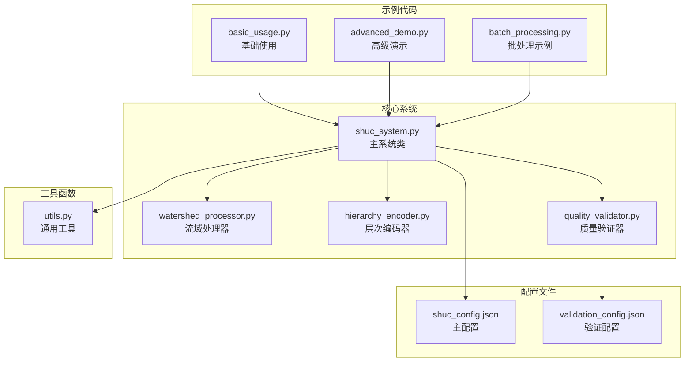
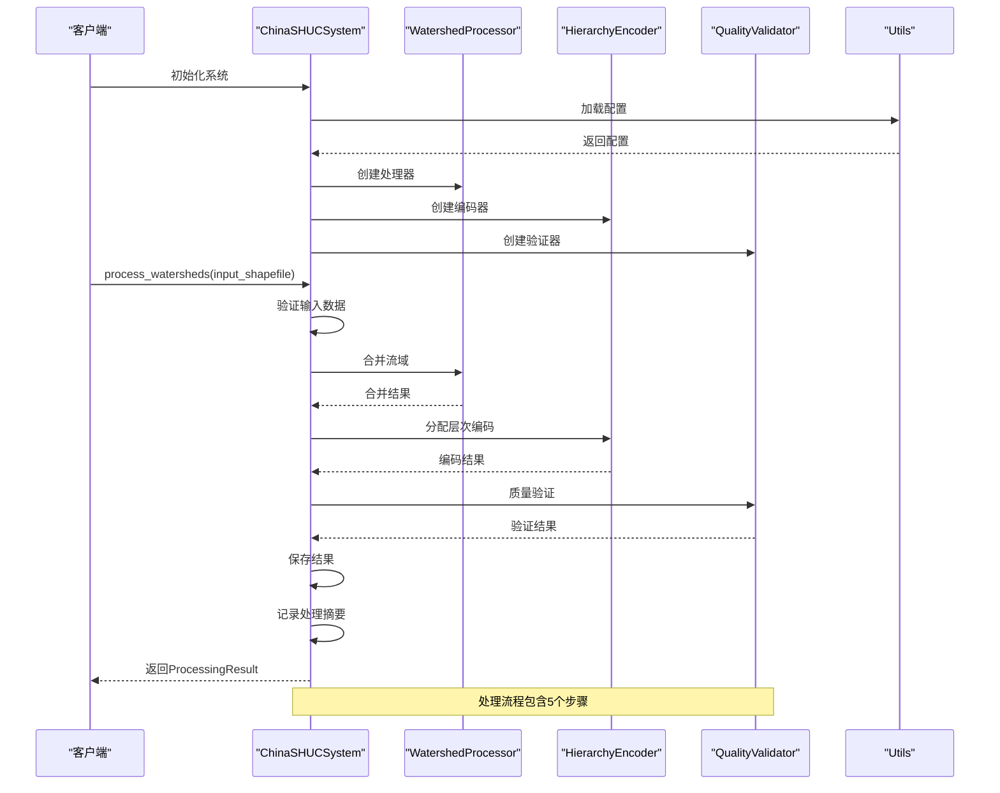
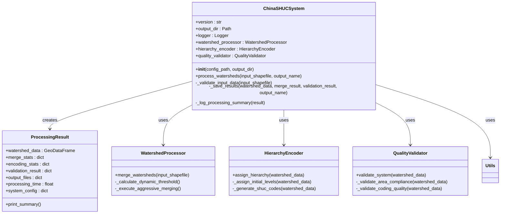

# 主系统类API

<cite>
**本文档引用的文件**
- [shuc_system.py](file://01_CORE_SYSTEM/src/shuc_system.py)
- [basic_usage.py](file://01_CORE_SYSTEM/examples/basic_usage.py)
- [advanced_demo.py](file://01_CORE_SYSTEM/examples/advanced_demo.py)
- [batch_processing.py](file://01_CORE_SYSTEM/examples/batch_processing.py)
- [shuc_config.json](file://01_CORE_SYSTEM/config/shuc_config.json)
- [validation_config.json](file://01_CORE_SYSTEM/config/validation_config.json)
- [utils.py](file://01_CORE_SYSTEM/src/utils.py)
- [watershed_processor.py](file://01_CORE_SYSTEM/src/watershed_processor.py)
- [hierarchy_encoder.py](file://01_CORE_SYSTEM/src/hierarchy_encoder.py)
- [quality_validator.py](file://01_CORE_SYSTEM/src/quality_validator.py)
</cite>

## 目录
1. [简介](#简介)
2. [项目结构](#项目结构)
3. [核心组件](#核心组件)
4. [架构概览](#架构概览)
5. [详细组件分析](#详细组件分析)
6. [依赖关系分析](#依赖关系分析)
7. [性能考虑](#性能考虑)
8. [故障排除指南](#故障排除指南)
9. [结论](#结论)

## 简介

ChinaSHUCSystem是中国流域层次分级编码系统的主类，实现了基于美国HUC标准的中国地理环境适配方案。该系统集成了流域智能合并、层次编码分配和质量验证三大核心功能，支持90%面积合规率，提供完整的4-6级层次编码体系。

## 项目结构



**图表来源**
- [shuc_system.py:43-91](file://01_CORE_SYSTEM/src/shuc_system.py#L43-L91)
- [watershed_processor.py:24-53](file://01_CORE_SYSTEM/src/watershed_processor.py#L24-L53)
- [hierarchy_encoder.py:22-67](file://01_CORE_SYSTEM/src/hierarchy_encoder.py#L22-L67)
- [quality_validator.py:24-60](file://01_CORE_SYSTEM/src/quality_validator.py#L24-L60)

**章节来源**
- [shuc_system.py:1-26](file://01_CORE_SYSTEM/src/shuc_system.py#L1-L26)
- [shuc_system.py:43-91](file://01_CORE_SYSTEM/src/shuc_system.py#L43-L91)

## 核心组件

### ChinaSHUCSystem主类

ChinaSHUCSystem是整个系统的主控制器，负责协调各个子组件的工作流程。该类提供了完整的API接口，包括初始化配置、数据处理和结果输出等功能。

**章节来源**
- [shuc_system.py:43-91](file://01_CORE_SYSTEM/src/shuc_system.py#L43-L91)

### ProcessingResult结果类

ProcessingResult类封装了完整的处理结果和统计信息，为用户提供统一的结果访问接口。

**章节来源**
- [shuc_system.py:251-286](file://01_CORE_SYSTEM/src/shuc_system.py#L251-L286)

## 架构概览



**图表来源**
- [shuc_system.py:92-164](file://01_CORE_SYSTEM/src/shuc_system.py#L92-L164)
- [watershed_processor.py:54-81](file://01_CORE_SYSTEM/src/watershed_processor.py#L54-L81)
- [hierarchy_encoder.py:69-95](file://01_CORE_SYSTEM/src/hierarchy_encoder.py#L69-L95)
- [quality_validator.py:61-86](file://01_CORE_SYSTEM/src/quality_validator.py#L61-L86)

## 详细组件分析

### 构造函数 __init__ API

#### 参数说明

| 参数名 | 类型 | 默认值 | 描述 |
|--------|------|--------|------|
| config_path | str | None | 配置文件路径，默认使用项目根目录下的config/shuc_config.json |
| output_dir | str | None | 输出目录路径，默认使用项目根目录下的output |

#### 行为特性

构造函数执行以下初始化步骤：

1. **版本和时间戳设置**
   - 设置系统版本号为"3.1.0"
   - 记录启动时间

2. **路径配置**
   - 确定项目根目录
   - 解析配置文件路径（优先使用传入参数）
   - 设置输出目录（默认为output）

3. **目录准备**
   - 确保输出目录存在

4. **日志系统**
   - 初始化日志记录器
   - 配置文件和控制台输出

5. **配置加载**
   - 加载shuc_config.json配置文件
   - 初始化三个核心组件

6. **统计信息**
   - 记录处理统计信息

**章节来源**
- [shuc_system.py:51-91](file://01_CORE_SYSTEM/src/shuc_system.py#L51-L91)
- [utils.py:64-99](file://01_CORE_SYSTEM/src/utils.py#L64-L99)

### process_watersheds 方法 API

#### 接口规范

```python
def process_watersheds(self, input_shapefile, output_name=None):
    """
    处理流域数据的主要方法
    
    Args:
        input_shapefile (str): 输入的流域shapefile路径
        output_name (str): 输出文件名前缀，默认为'shuc_watersheds'
        
    Returns:
        ProcessingResult: 包含处理结果和统计信息的对象
        
    Raises:
        ValueError: 当输入数据验证失败时
        Exception: 处理过程中的其他异常
    """
```

#### 输入参数

| 参数名 | 类型 | 必需 | 描述 |
|--------|------|------|------|
| input_shapefile | str | 是 | 输入的shapefile文件路径 |
| output_name | str | 否 | 输出文件名前缀，默认为"shuc_watersheds" |

#### 返回值

**ProcessingResult对象**包含以下属性：

| 属性名 | 类型 | 描述 |
|--------|------|------|
| watershed_data | GeoDataFrame | 处理后的流域数据 |
| merge_stats | dict | 合并统计信息 |
| encoding_stats | dict | 编码统计信息 |
| validation_result | dict | 质量验证结果 |
| output_files | dict | 输出文件路径映射 |
| processing_time | float | 处理耗时（秒） |
| system_config | dict | 系统配置信息 |

#### 处理流程

1. **输入验证** - `_validate_input_data()`
2. **流域合并** - `WatershedProcessor.merge_watersheds()`
3. **层次编码** - `HierarchyEncoder.assign_hierarchy()`
4. **质量验证** - `QualityValidator.validate_system()`
5. **结果保存** - `_save_results()`

**章节来源**
- [shuc_system.py:92-164](file://01_CORE_SYSTEM/src/shuc_system.py#L92-L164)

### 私有方法详解

#### _validate_input_data 方法

验证输入数据的有效性和完整性：

**功能**：
- 检查文件是否存在
- 使用GeoPandas读取shapefile
- 验证数据基本要求
- 检查必需字段

**返回值**：
```python
{
    'valid': bool,      # 验证是否通过
    'errors': list,     # 错误列表
    'warnings': list    # 警告列表
}
```

**章节来源**
- [shuc_system.py:165-196](file://01_CORE_SYSTEM/src/shuc_system.py#L165-L196)

#### _save_results 方法

保存处理结果到指定目录：

**保存文件**：
- 主要流域数据：`{output_name}.shp`
- 验证报告：`validation_report.json`
- 处理统计：`processing_statistics.json`

**返回值**：
```python
{
    'watersheds': str,           # 流域数据文件路径
    'validation_report': str,    # 验证报告路径
    'statistics': str           # 统计文件路径
}
```

**章节来源**
- [shuc_system.py:198-237](file://01_CORE_SYSTEM/src/shuc_system.py#L198-L237)

#### _log_processing_summary 方法

记录处理摘要信息到日志：

**记录指标**：
- 处理前后流域数量对比
- 数据压缩率
- 面积合规率
- 层次结构范围
- 系统评分
- 处理耗时

**章节来源**
- [shuc_system.py:239-248](file://01_CORE_SYSTEM/src/shuc_system.py#L239-L248)

### 配置系统

#### 主配置文件 (shuc_config.json)

系统使用JSON配置文件进行参数管理：

**processing配置**：
- `target_compliance_rate`: 目标合规率 (默认: 0.90)
- `merge_strategy`: 合并策略 (默认: "aggressive")
- `max_iterations`: 最大迭代次数 (默认: 50)
- `enable_early_stopping`: 启用早停机制 (默认: true)

**hierarchy配置**：
- `level_4_min_area`: 第4级最小面积 (默认: 1000)
- `level_5_min_area`: 第5级最小面积 (默认: 200)
- `level_6_min_area`: 第6级最小面积 (默认: 50)

**validation配置**：
- `area_compliance_threshold`: 面积合规阈值 (默认: 0.80)
- `coding_uniqueness_threshold`: 编码唯一性阈值 (默认: 1.00)
- `topology_completeness_threshold`: 拓扑完整性阈值 (默认: 0.95)

**章节来源**
- [shuc_config.json:1-43](file://01_CORE_SYSTEM/config/shuc_config.json#L1-L43)

## 依赖关系分析



**图表来源**
- [shuc_system.py:43-91](file://01_CORE_SYSTEM/src/shuc_system.py#L43-L91)
- [shuc_system.py:251-286](file://01_CORE_SYSTEM/src/shuc_system.py#L251-L286)
- [watershed_processor.py:24-53](file://01_CORE_SYSTEM/src/watershed_processor.py#L24-L53)
- [hierarchy_encoder.py:22-67](file://01_CORE_SYSTEM/src/hierarchy_encoder.py#L22-L67)
- [quality_validator.py:24-60](file://01_CORE_SYSTEM/src/quality_validator.py#L24-L60)

### 核心组件依赖

| 组件 | 依赖组件 | 用途 |
|------|----------|------|
| ChinaSHUCSystem | WatershedProcessor | 流域智能合并 |
| ChinaSHUCSystem | HierarchyEncoder | 层次编码分配 |
| ChinaSHUCSystem | QualityValidator | 质量验证 |
| ChinaSHUCSystem | Utils | 配置管理、日志记录 |
| WatershedProcessor | NetworkX | 拓扑图构建 |
| WatershedProcessor | GeoPandas | 地理数据处理 |
| HierarchyEncoder | Pandas | 数据分析 |
| QualityValidator | NumPy | 数值计算 |

**章节来源**
- [shuc_system.py:38-41](file://01_CORE_SYSTEM/src/shuc_system.py#L38-L41)
- [watershed_processor.py:15-22](file://01_CORE_SYSTEM/src/watershed_processor.py#L15-L22)
- [hierarchy_encoder.py:15-20](file://01_CORE_SYSTEM/src/hierarchy_encoder.py#L15-L20)
- [quality_validator.py:17-22](file://01_CORE_SYSTEM/src/quality_validator.py#L17-L22)

## 性能考虑

### 处理流程优化

1. **动态阈值计算**：基于数据分布自动调整合并阈值
2. **早停机制**：当达到目标合规率时提前结束
3. **内存管理**：使用GeoPandas高效处理大规模地理数据
4. **并行处理**：配置中预留并行处理支持

### 性能指标

- **处理速度**：取决于数据规模和配置参数
- **内存使用**：最大内存使用量可配置
- **扩展性**：支持批处理和分布式处理

## 故障排除指南

### 常见错误及解决方案

#### 输入数据验证失败
**错误信息**：`输入数据验证失败: [错误列表]`
**可能原因**：
- 输入文件不存在
- Shapefile格式不正确
- 缺少必需字段

**解决方案**：
1. 检查文件路径是否正确
2. 使用`validate_shapefile()`函数验证数据
3. 确认必需字段存在

#### 处理异常
**错误信息**：`处理过程中出现错误: [具体错误]`
**排查步骤**：
1. 检查日志文件获取详细错误信息
2. 验证配置文件格式
3. 确认依赖包版本兼容性

#### 内存不足
**症状**：处理过程中内存溢出
**解决方案**：
1. 调整`max_memory_usage_gb`配置
2. 减少单次处理的数据量
3. 优化数据预处理

**章节来源**
- [shuc_system.py:161-163](file://01_CORE_SYSTEM/src/shuc_system.py#L161-L163)
- [utils.py:322-346](file://01_CORE_SYSTEM/src/utils.py#L322-L346)

## 结论

ChinaSHUCSystem主系统类提供了完整的流域分级编码解决方案，具有以下特点：

1. **模块化设计**：清晰的职责分离和组件协作
2. **配置灵活**：支持多种配置策略和参数调优
3. **质量保证**：完整的质量验证和错误处理机制
4. **易于使用**：简洁的API接口和丰富的示例代码

该系统适用于大规模流域数据处理和分析，为中国的水文地理研究提供了强有力的技术支撑。