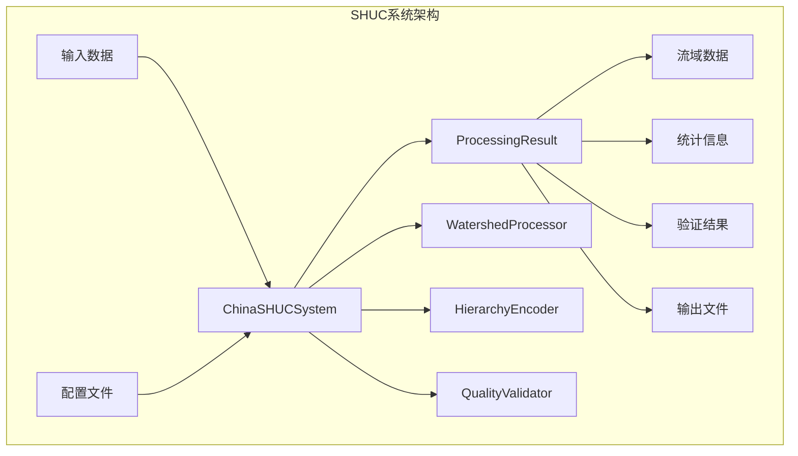
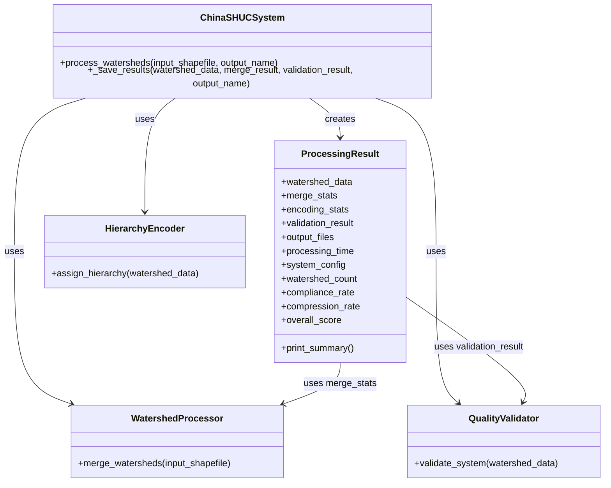
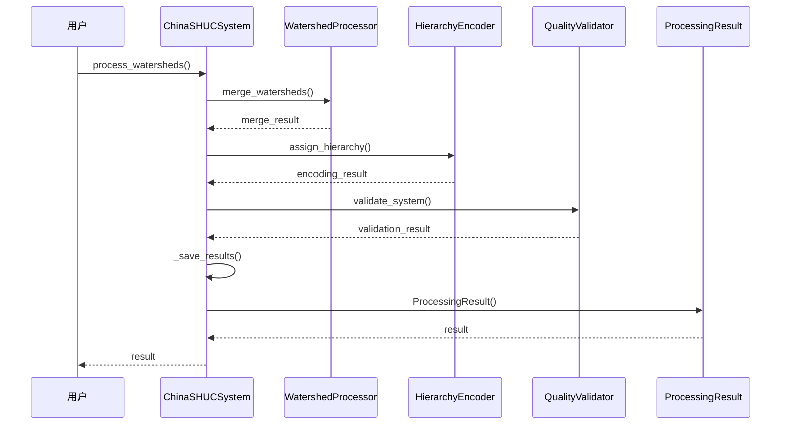

# 处理结果类API

<cite>
**本文档引用的文件**
- [shuc_system.py](file://01_CORE_SYSTEM/src/shuc_system.py)
- [basic_usage.py](file://01_CORE_SYSTEM/examples/basic_usage.py)
- [batch_processing.py](file://01_CORE_SYSTEM/examples/batch_processing.py)
- [shuc_config.json](file://01_CORE_SYSTEM/config/shuc_config.json)
- [watershed_processor.py](file://01_CORE_SYSTEM/src/watershed_processor.py)
- [hierarchy_encoder.py](file://01_CORE_SYSTEM/src/hierarchy_encoder.py)
- [quality_validator.py](file://01_CORE_SYSTEM/src/quality_validator.py)
</cite>

## 目录
1. [简介](#简介)
2. [项目结构](#项目结构)
3. [核心组件](#核心组件)
4. [架构概览](#架构概览)
5. [详细组件分析](#详细组件分析)
6. [依赖关系分析](#依赖关系分析)
7. [性能考虑](#性能考虑)
8. [故障排除指南](#故障排除指南)
9. [结论](#结论)

## 简介

ProcessingResult是SHUC（中国流域层次分级编码）系统中的核心结果封装类，负责存储和管理整个流域处理流程产生的所有数据和统计信息。该类提供了统一的接口来访问处理结果，包括流域数据、统计信息、验证结果和输出文件等关键信息。

## 项目结构

SHUC系统采用模块化设计，ProcessingResult类位于核心系统模块中，与其他核心组件协同工作：



**图表来源**
- [shuc_system.py:43-250](file://01_CORE_SYSTEM/src/shuc_system.py#L43-L250)

**章节来源**
- [shuc_system.py:1-50](file://01_CORE_SYSTEM/src/shuc_system.py#L1-L50)

## 核心组件

ProcessingResult类作为系统的核心结果容器，提供了以下主要功能：

### 类定义概述

ProcessingResult类是一个轻量级的数据容器类，专注于封装处理结果和提供便捷的属性访问。

**章节来源**
- [shuc_system.py:251-286](file://01_CORE_SYSTEM/src/shuc_system.py#L251-L286)

## 架构概览



**图表来源**
- [shuc_system.py:43-286](file://01_CORE_SYSTEM/src/shuc_system.py#L43-L286)

## 详细组件分析

### ProcessingResult类详细分析

#### 构造函数参数详解

ProcessingResult类的构造函数接受七个关键参数，每个参数都有特定的作用和数据类型：

| 参数名称 | 类型 | 必需 | 描述 |
|---------|------|------|------|
| watershed_data | GeoDataFrame | 是 | 编码后的流域数据，包含SHUC编码和层次信息 |
| merge_stats | dict | 是 | 流域合并过程的统计信息 |
| encoding_stats | dict | 是 | 层次编码过程的统计信息 |
| validation_result | dict | 是 | 质量验证的完整结果 |
| output_files | dict | 是 | 处理过程中生成的输出文件路径映射 |
| processing_time | float | 是 | 整个处理过程的耗时（秒） |
| system_config | dict | 是 | 系统配置参数 |

**章节来源**
- [shuc_system.py:257-265](file://01_CORE_SYSTEM/src/shuc_system.py#L257-L265)

#### 公共属性详解

ProcessingResult类提供了四个便捷属性，用于快速访问关键指标：

##### 1. watershed_count（流域数量）

- **类型**: int
- **来源**: `merge_stats['final_count']`
- **含义**: 处理完成后剩余的流域数量
- **计算方式**: 直接从合并统计信息中获取最终流域数量

##### 2. compliance_rate（面积合规率）

- **类型**: float (0-1之间的小数)
- **来源**: `validation_result['area_compliance']['compliance_rate']`
- **含义**: 符合面积阈值要求的流域比例
- **计算方式**: 合规流域数量 ÷ 总流域数量

##### 3. compression_rate（数据压缩率）

- **类型**: float (0-1之间的小数)
- **来源**: `merge_stats['compression_rate']`
- **含义**: 流域合并带来的数据压缩比例
- **计算方式**: (原始流域数量 - 最终流域数量) ÷ 原始流域数量

##### 4. overall_score（系统评分）

- **类型**: float (0-100之间的数值)
- **来源**: `validation_result['overall_score']`
- **含义**: 综合质量评估分数
- **计算方式**: 基于多维度质量指标的加权计算

**章节来源**
- [shuc_system.py:267-271](file://01_CORE_SYSTEM/src/shuc_system.py#L267-L271)

#### print_summary方法

print_summary方法提供了标准化的结果摘要输出格式：

**输出格式**:
```
🎯 中国SHUC系统处理结果摘要
========================================
流域数量: {watershed_count} 个
面积合规率: {compliance_rate:.1%}
数据压缩率: {compression_rate:.1%}
系统评分: {overall_score:.1f}/100
处理耗时: {processing_time:.1f} 秒
========================================
输出文件:
  • {key}: {Path(path).name}
```

**章节来源**
- [shuc_system.py:273-285](file://01_CORE_SYSTEM/src/shuc_system.py#L273-L285)

### 结果数据结构详解

ProcessingResult类封装了以下层次化的数据结构：

#### 1. 原始数据属性

| 属性名称 | 数据类型 | 描述 | 来源模块 |
|---------|----------|------|----------|
| watershed_data | GeoDataFrame | 编码后的流域几何数据 | HierarchyEncoder |
| merge_stats | dict | 合并过程统计信息 | WatershedProcessor |
| encoding_stats | dict | 编码过程统计信息 | HierarchyEncoder |
| validation_result | dict | 质量验证结果 | QualityValidator |
| output_files | dict | 输出文件路径映射 | ChinaSHUCSystem |
| processing_time | float | 处理耗时（秒） | ChinaSHUCSystem |
| system_config | dict | 系统配置参数 | 配置文件 |

#### 2. 合并统计信息结构

合并统计信息包含以下关键字段：
- `original_count`: 原始流域数量
- `final_count`: 最终流域数量
- `compression_rate`: 数据压缩率
- `merge_iterations`: 合并迭代次数
- `threshold_used`: 使用的动态阈值

#### 3. 验证结果结构

验证结果包含以下维度：
- `area_compliance`: 面积合规性分析
- `coding_quality`: 编码质量评估
- `topology_integrity`: 拓扑完整性检查
- `geometry_validity`: 几何有效性验证
- `hierarchy_analysis`: 层次结构分析
- `overall_score`: 综合评分
- `quality_grade`: 质量等级

**章节来源**
- [shuc_system.py:142-150](file://01_CORE_SYSTEM/src/shuc_system.py#L142-L150)

## 依赖关系分析



**图表来源**
- [shuc_system.py:92-159](file://01_CORE_SYSTEM/src/shuc_system.py#L92-L159)

### 组件耦合度分析

ProcessingResult类具有以下依赖特征：

1. **低耦合设计**: 仅依赖于传入的数据结构，不直接依赖具体实现
2. **高内聚性**: 所有属性都围绕处理结果这一核心概念
3. **数据驱动**: 通过字典结构存储数据，便于扩展和修改

**章节来源**
- [shuc_system.py:251-286](file://01_CORE_SYSTEM/src/shuc_system.py#L251-L286)

## 性能考虑

### 内存使用优化

ProcessingResult类采用轻量级设计，避免不必要的内存占用：
- 直接存储引用而非复制数据
- 便捷属性通过简单计算获得，不额外存储
- 支持延迟计算模式

### 计算效率

- 便捷属性的计算复杂度为O(1)
- print_summary方法的时间复杂度为O(n)，其中n为输出文件数量
- 整体内存使用与数据大小线性相关

## 故障排除指南

### 常见问题及解决方案

#### 1. 属性访问异常

**问题**: 访问某些属性时报错
**原因**: 对应的统计信息或验证结果缺失
**解决方案**: 检查上游组件是否正常执行

#### 2. 数据类型不匹配

**问题**: 属性值类型不符合预期
**原因**: 数据流传递过程中的类型转换问题
**解决方案**: 在构造函数中添加类型验证

#### 3. 输出文件路径问题

**问题**: output_files中的路径无法解析
**原因**: 文件保存过程中的路径处理错误
**解决方案**: 检查文件保存逻辑和权限设置

**章节来源**
- [shuc_system.py:198-237](file://01_CORE_SYSTEM/src/shuc_system.py#L198-L237)

## 结论

ProcessingResult类作为SHUC系统的核心结果封装，提供了简洁而强大的接口来访问和分析处理结果。其设计体现了以下特点：

1. **清晰的职责分离**: 专注于结果存储和便捷访问
2. **灵活的数据结构**: 支持多种数据类型的统一管理
3. **易于扩展**: 通过字典结构便于添加新的统计信息
4. **用户友好**: 提供直观的摘要输出和便捷属性访问

该类为上层应用提供了稳定可靠的结果访问接口，是SHUC系统整体架构中的重要组成部分。