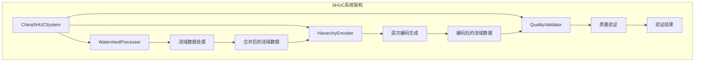
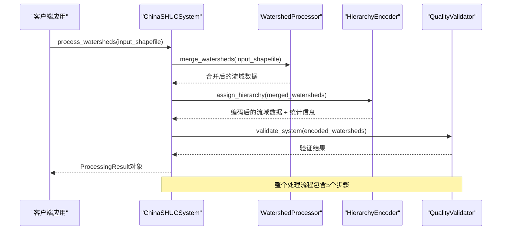
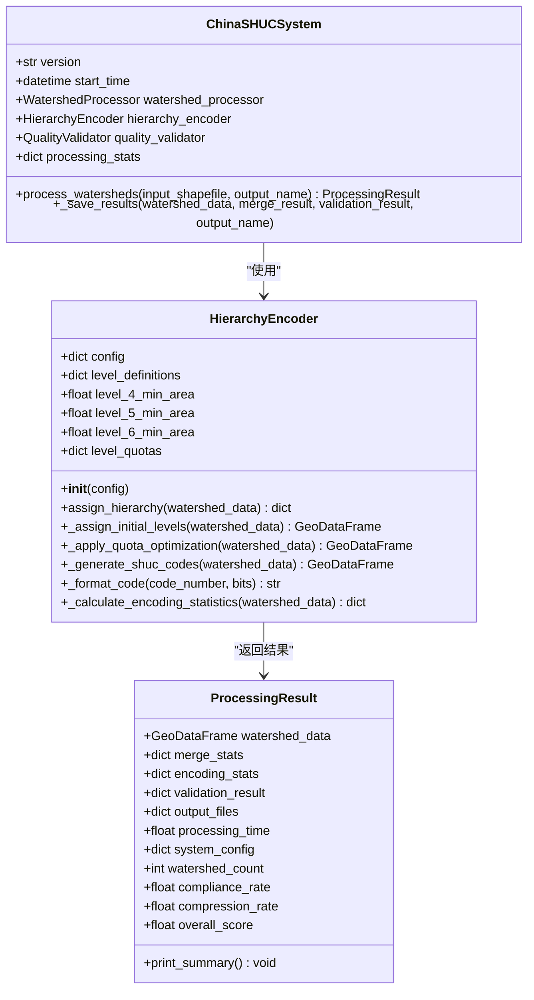
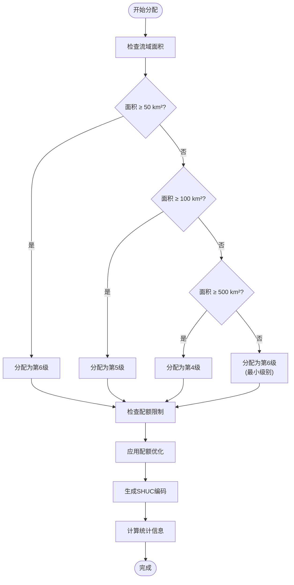
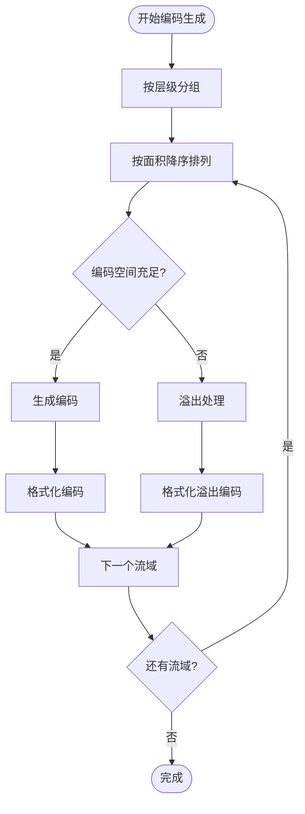
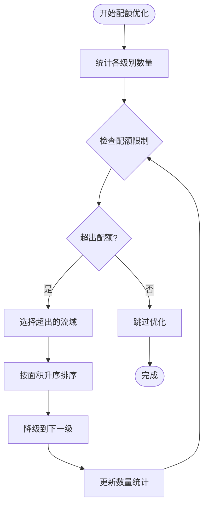
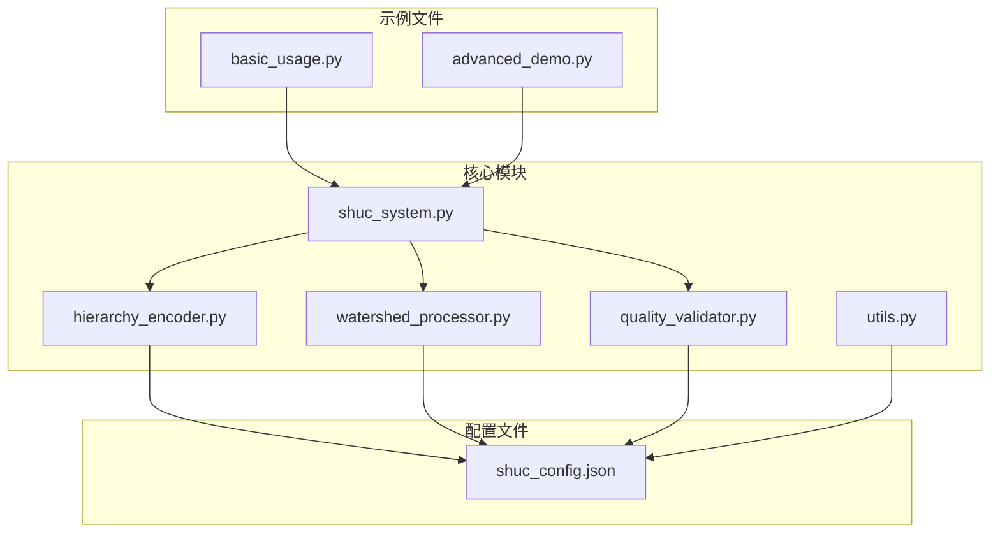

# 层次编码器API

<cite>
**本文档引用的文件**
- [hierarchy_encoder.py](file://01_CORE_SYSTEM/src/hierarchy_encoder.py)
- [shuc_system.py](file://01_CORE_SYSTEM/src/shuc_system.py)
- [utils.py](file://01_CORE_SYSTEM/src/utils.py)
- [watershed_processor.py](file://01_CORE_SYSTEM/src/watershed_processor.py)
- [quality_validator.py](file://01_CORE_SYSTEM/src/quality_validator.py)
- [shuc_config.json](file://01_CORE_SYSTEM/config/shuc_config.json)
- [basic_usage.py](file://01_CORE_SYSTEM/examples/basic_usage.py)
- [advanced_demo.py](file://01_CORE_SYSTEM/examples/advanced_demo.py)
</cite>

## 目录
1. [简介](#简介)
2. [项目结构](#项目结构)
3. [核心组件](#核心组件)
4. [架构概览](#架构概览)
5. [详细组件分析](#详细组件分析)
6. [依赖关系分析](#依赖关系分析)
7. [性能考虑](#性能考虑)
8. [故障排除指南](#故障排除指南)
9. [结论](#结论)

## 简介

HierarchyEncoder层次编码器是SHUC（中国流域层次编码系统）的核心组件之一，负责将经过智能合并的流域数据进行层次分配和SHUC编码生成。该系统实现了基于面积的智能分级算法，支持4-6级完整的层次编码体系，采用2-bit到12-bit的编码位数配置，确保编码的唯一性和层次结构的合理性。

该编码器的核心功能包括：
- 基于面积的智能层次分配
- 动态阈值调整的级别判定
- 层次配额管理和优化
- SHUC编码生成和格式化
- 编码统计信息和质量评估

## 项目结构

SHUC系统采用模块化设计，各个组件职责明确，相互协作完成完整的流域编码任务。



**图表来源**
- [shuc_system.py:43-91](file://01_CORE_SYSTEM/src/shuc_system.py#L43-L91)
- [hierarchy_encoder.py:22-30](file://01_CORE_SYSTEM/src/hierarchy_encoder.py#L22-L30)

**章节来源**
- [shuc_system.py:1-335](file://01_CORE_SYSTEM/src/shuc_system.py#L1-L335)
- [hierarchy_encoder.py:1-219](file://01_CORE_SYSTEM/src/hierarchy_encoder.py#L1-L219)

## 核心组件

### HierarchyEncoder类概述

HierarchyEncoder是SHUC系统中的核心编码组件，实现了完整的层次编码算法。该类提供了以下主要功能：

- **初始化配置管理**：从配置文件读取层次参数和编码设置
- **智能层次分配**：基于流域面积自动分配合适的层次级别
- **配额优化控制**：实施层次配额限制，确保编码系统的合理性
- **编码生成**：为每个流域生成唯一的SHUC编码
- **统计分析**：提供详细的编码统计信息和质量评估

### 初始化参数配置

HierarchyEncoder的初始化接受一个配置字典，包含以下关键参数：

| 参数名称 | 类型 | 默认值 | 描述 |
|---------|------|--------|------|
| level_4_min_area | float | 1000 | 第4级（中流域）的最小面积阈值（km²） |
| level_5_min_area | float | 200 | 第5级（小流域）的最小面积阈值（km²） |
| level_6_min_area | float | 50 | 第6级（基本单元）的最小面积阈值（km²） |

这些参数决定了不同层次级别的划分标准，系统会根据这些阈值自动分配流域的层次级别。

**章节来源**
- [hierarchy_encoder.py:32-67](file://01_CORE_SYSTEM/src/hierarchy_encoder.py#L32-L67)
- [shuc_config.json:9-18](file://01_CORE_SYSTEM/config/shuc_config.json#L9-L18)

## 架构概览

SHUC系统的整体架构采用分层设计，每个组件都有明确的职责分工。



**图表来源**
- [shuc_system.py:92-159](file://01_CORE_SYSTEM/src/shuc_system.py#L92-L159)
- [hierarchy_encoder.py:69-95](file://01_CORE_SYSTEM/src/hierarchy_encoder.py#L69-L95)

**章节来源**
- [shuc_system.py:43-159](file://01_CORE_SYSTEM/src/shuc_system.py#L43-L159)

## 详细组件分析

### HierarchyEncoder类结构



**图表来源**
- [hierarchy_encoder.py:22-219](file://01_CORE_SYSTEM/src/hierarchy_encoder.py#L22-L219)
- [shuc_system.py:43-286](file://01_CORE_SYSTEM/src/shuc_system.py#L43-L286)

### assign_hierarchy方法详解

assign_hierarchy是HierarchyEncoder的核心方法，负责完整的层次编码分配流程。

#### 方法签名和参数

```python
def assign_hierarchy(self, watershed_data):
    """
    分配流域层次等级
    
    Args:
        watershed_data (GeoDataFrame): 合并后的流域数据
        
    Returns:
        dict: 包含编码结果和统计信息
    """
```

#### 输入参数格式

输入的GeoDataFrame必须包含以下关键字段：
- `area_km2`: 流域面积（km²），用于层次分配
- `geometry`: 流域几何形状
- 其他可选字段：如`LINKNO`、`DSLINKNO1`等拓扑关系字段

#### 处理流程

1. **初始层次分配**：基于面积阈值分配初始层次级别
2. **配额优化**：应用层次配额限制，优化层次分布
3. **编码生成**：为每个流域生成唯一的SHUC编码
4. **统计分析**：计算详细的编码统计信息

#### 输出结构

返回的字典包含三个主要部分：

| 键名 | 类型 | 描述 |
|------|------|------|
| encoded_watersheds | GeoDataFrame | 编码后的流域数据，包含shuc_code和shuc_level字段 |
| statistics | dict | 编码统计信息，包括级别分布、编码摘要等 |
| level_definitions | dict | 层级定义信息，包含各层级的位数和描述 |

**章节来源**
- [hierarchy_encoder.py:69-95](file://01_CORE_SYSTEM/src/hierarchy_encoder.py#L69-L95)

### 层级分配算法

系统实现了基于面积的智能层级分配算法，支持4-6级完整层次结构。

#### 层级定义表

| 层级 | 位数 | 最小面积阈值 | 描述 | 编码范围 |
|------|------|-------------|------|----------|
| 1级 | 2位 | 50,000 km² | 大区流域 | 1-4 |
| 2级 | 4位 | 10,000 km² | 区域流域 | 1-16 |
| 3级 | 6位 | 2,000 km² | 大流域 | 1-64 |
| 4级 | 8位 | 500 km² | 中流域 | 1-256 |
| 5级 | 10位 | 100 km² | 小流域 | 1-1024 |
| 6级 | 12位 | 50 km² | 基本单元 | 1-4096 |

#### 分配逻辑



**图表来源**
- [hierarchy_encoder.py:97-138](file://01_CORE_SYSTEM/src/hierarchy_encoder.py#L97-L138)

**章节来源**
- [hierarchy_encoder.py:42-67](file://01_CORE_SYSTEM/src/hierarchy_encoder.py#L42-L67)
- [hierarchy_encoder.py:97-138](file://01_CORE_SYSTEM/src/hierarchy_encoder.py#L97-L138)

### 编码生成规则

SHUC编码采用固定长度的数字编码系统，确保编码的唯一性和层次结构的清晰性。

#### 编码位数分配

| 层级 | 位数 | 编码范围 | 最大编码数量 |
|------|------|----------|-------------|
| 4级 | 8位 | 1-256 | 256 |
| 5级 | 10位 | 1-1024 | 1024 |
| 6级 | 12位 | 1-4096 | 4096 |

#### 编码生成流程



**图表来源**
- [hierarchy_encoder.py:140-169](file://01_CORE_SYSTEM/src/hierarchy_encoder.py#L140-L169)

#### 编码格式化

编码采用零填充格式，确保相同位数的编码具有相同的字符串长度：

- 4级编码：如 "0045"（8位编码）
- 5级编码：如 "00231"（10位编码）  
- 6级编码：如 "0001234"（12位编码）

溢出情况下的编码格式：`{基础编码}_overflow_{序号}`

**章节来源**
- [hierarchy_encoder.py:140-176](file://01_CORE_SYSTEM/src/hierarchy_encoder.py#L140-L176)

### 层次配额管理

为了确保编码系统的合理性和实用性，系统实现了层次配额管理机制。

#### 配额设置

| 层级 | 配额数量 | 说明 |
|------|----------|------|
| 4级 | 3个 | 限制大型流域数量，避免过度集中 |
| 5级 | 8个 | 控制中型流域数量 |
| 6级 | 无限制 | 基本单元可无限扩展 |

#### 配额优化算法



**图表来源**
- [hierarchy_encoder.py:113-138](file://01_CORE_SYSTEM/src/hierarchy_encoder.py#L113-L138)

**章节来源**
- [hierarchy_encoder.py:62-67](file://01_CORE_SYSTEM/src/hierarchy_encoder.py#L62-L67)
- [hierarchy_encoder.py:113-138](file://01_CORE_SYSTEM/src/hierarchy_encoder.py#L113-L138)

### 编码统计信息

系统提供全面的编码统计信息，用于评估编码质量和系统性能。

#### 统计指标

| 指标类别 | 具体指标 | 计算方法 |
|----------|----------|----------|
| 基本统计 | 总流域数量 | len(watershed_data) |
| 层级分布 | 各层级数量 | value_counts() |
| 编码质量 | 唯一编码率 | nunique()/total |
| 面积统计 | 各层级面积范围 | min/max/mean/sum |
| 范围统计 | 最小/最大层级 | min/max |

#### 统计结果结构

```json
{
  "total_watersheds": 1000,
  "level_distribution": {
    "Level_4": {
      "count": 3,
      "description": "中流域",
      "percentage": 0.3
    },
    "Level_5": {
      "count": 8,
      "description": "小流域", 
      "percentage": 0.8
    },
    "Level_6": {
      "count": 989,
      "description": "基本单元",
      "percentage": 98.9
    }
  },
  "encoding_summary": {
    "unique_codes": 1000,
    "total_codes": 1000,
    "code_uniqueness_rate": 1.0
  },
  "level_area_stats": {
    "Level_4": {
      "count": 3,
      "min_area": 500.0,
      "max_area": 800.0,
      "mean_area": 650.0,
      "total_area": 1950.0
    }
  },
  "level_range": "Level 4-6"
}
```

**章节来源**
- [hierarchy_encoder.py:177-219](file://01_CORE_SYSTEM/src/hierarchy_encoder.py#L177-L219)

## 依赖关系分析

### 组件间依赖关系



**图表来源**
- [shuc_system.py:37-41](file://01_CORE_SYSTEM/src/shuc_system.py#L37-L41)
- [hierarchy_encoder.py:32](file://01_CORE_SYSTEM/src/hierarchy_encoder.py#L32)

### 外部依赖

系统依赖以下关键库：

| 库名称 | 版本要求 | 用途 |
|--------|----------|------|
| geopandas | >=0.12.0 | 地理空间数据处理 |
| pandas | >=1.5.0 | 数据分析和处理 |
| numpy | >=1.21.0 | 数值计算 |
| networkx | >=2.8.0 | 图论算法和拓扑分析 |
| shapely | >=2.0.0 | 几何操作 |

**章节来源**
- [utils.py:101-126](file://01_CORE_SYSTEM/src/utils.py#L101-L126)

## 性能考虑

### 时间复杂度分析

- **层次分配**：O(n)，其中n为流域数量
- **配额优化**：O(k log k)，其中k为超配额的流域数量
- **编码生成**：O(n log n)，主要由排序操作决定
- **统计计算**：O(n)，线性扫描所有数据

### 内存使用优化

1. **分批处理**：对于大规模数据集，建议分批处理以控制内存使用
2. **数据类型优化**：使用适当的数据类型减少内存占用
3. **及时释放**：处理完成后及时释放不需要的中间变量

### 并行处理支持

系统目前支持配置化的并行处理开关，可通过配置文件启用：
- `enable_parallel_processing`: 控制是否启用并行处理
- `max_memory_usage_gb`: 设置最大内存使用限制

## 故障排除指南

### 常见问题及解决方案

#### 1. 编码冲突问题

**问题描述**：多个流域分配到相同的编码

**可能原因**：
- 编码空间不足
- 配额优化导致的重复分配

**解决方案**：
- 检查配额设置是否合理
- 调整最小面积阈值
- 增加编码位数（需要修改配置）

#### 2. 层级分布不平衡

**问题描述**：某些层级的流域数量过多或过少

**可能原因**：
- 配额设置不合理
- 数据分布极端

**解决方案**：
- 调整配额限制
- 修改最小面积阈值
- 检查数据质量

#### 3. 性能问题

**问题描述**：处理大量数据时性能下降

**可能原因**：
- 内存不足
- 数据量过大

**解决方案**：
- 启用并行处理
- 分批处理数据
- 优化硬件配置

### 调试和监控

系统提供了详细的日志记录和统计信息：

- **处理日志**：记录每个处理步骤的状态
- **统计信息**：提供实时的处理进度和结果
- **错误报告**：详细的错误信息和解决方案建议

**章节来源**
- [utils.py:24-62](file://01_CORE_SYSTEM/src/utils.py#L24-L62)

## 结论

HierarchyEncoder层次编码器是SHUC系统的核心组件，实现了完整的流域层次编码解决方案。该系统具有以下特点：

1. **智能化程度高**：基于面积的自动层次分配，无需人工干预
2. **灵活性强**：支持自定义配置，适应不同的应用场景
3. **可扩展性好**：模块化设计，便于功能扩展和维护
4. **质量保证**：完善的质量验证和统计分析机制

通过合理的配置和使用，HierarchyEncoder能够为中国的流域管理提供准确、唯一、层次清晰的编码系统，为水资源管理和研究提供强有力的技术支撑。