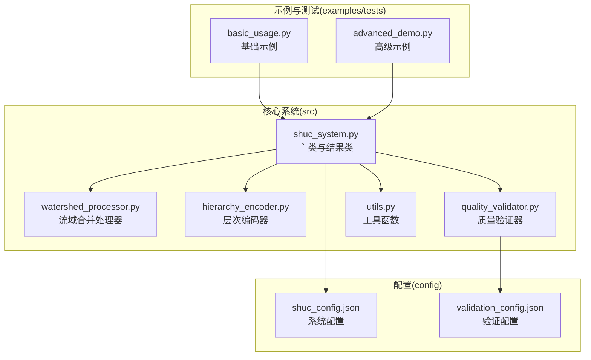
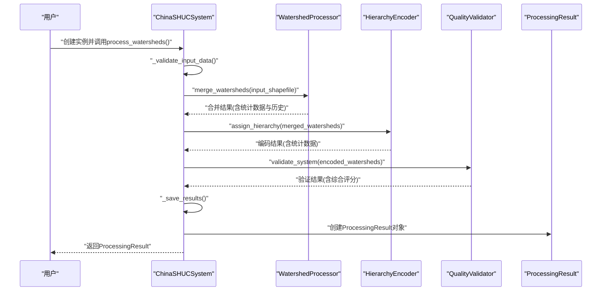
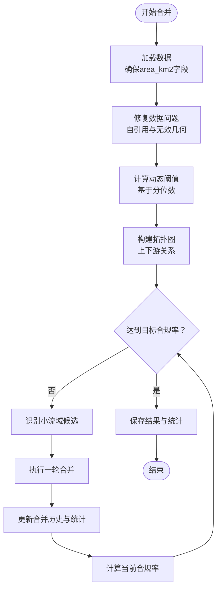
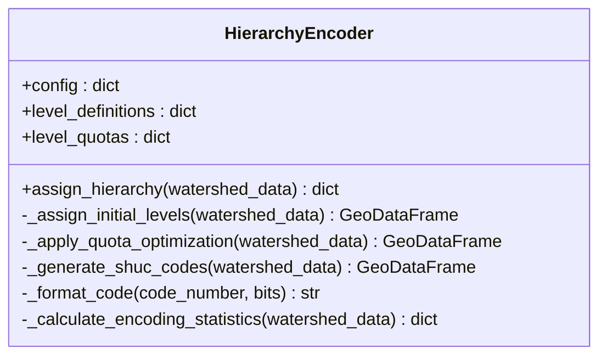
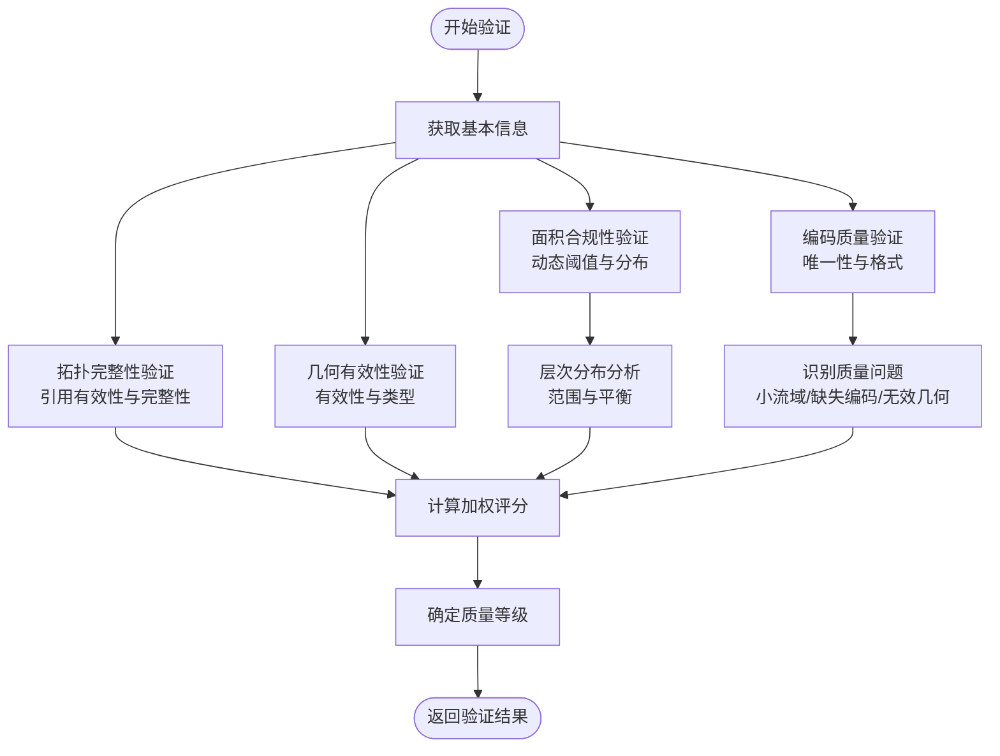
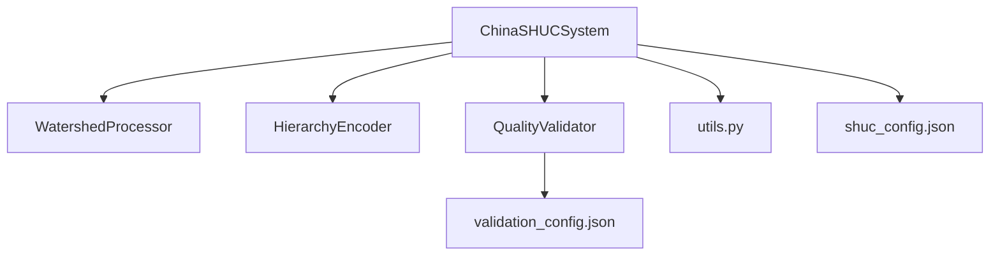

# 核心API接口

<cite>
**本文档引用的文件**
- [shuc_system.py](file://01_CORE_SYSTEM/src/shuc_system.py)
- [watershed_processor.py](file://01_CORE_SYSTEM/src/watershed_processor.py)
- [hierarchy_encoder.py](file://01_CORE_SYSTEM/src/hierarchy_encoder.py)
- [quality_validator.py](file://01_CORE_SYSTEM/src/quality_validator.py)
- [utils.py](file://01_CORE_SYSTEM/src/utils.py)
- [shuc_config.json](file://01_CORE_SYSTEM/config/shuc_config.json)
- [validation_config.json](file://01_CORE_SYSTEM/config/validation_config.json)
- [basic_usage.py](file://01_CORE_SYSTEM/examples/basic_usage.py)
- [advanced_demo.py](file://01_CORE_SYSTEM/examples/advanced_demo.py)
- [README.md](file://README.md)
</cite>

## 目录
1. [简介](#简介)
2. [项目结构](#项目结构)
3. [核心组件](#核心组件)
4. [架构概览](#架构概览)
5. [详细组件分析](#详细组件分析)
6. [依赖分析](#依赖分析)
7. [性能考虑](#性能考虑)
8. [故障排除指南](#故障排除指南)
9. [结论](#结论)
10. [附录](#附录)

## 简介
本文件为SHUC系统核心API接口的详细技术文档，聚焦于ChinaSHUCSystem主类及其三大核心处理器类（WatershedProcessor、HierarchyEncoder、QualityValidator）的完整接口规范。文档涵盖：
- ChinaSHUCSystem主类的构造函数参数、process_watersheds方法的输入输出规范、内部方法的使用方式
- 三大核心处理器类的完整接口（方法签名、参数类型、返回值结构、异常处理）
- ProcessingResult结果类的所有属性与方法
- 参数验证规则与错误处理机制
- 使用示例与最佳实践

## 项目结构
SHUC系统采用模块化设计，核心逻辑集中在src目录，配置文件位于config目录，示例与测试位于examples与tests目录。核心文件职责划分如下：
- shuc_system.py：系统主入口，集成三大处理器，封装ProcessingResult结果类
- watershed_processor.py：实现智能流域合并算法，支持动态阈值与拓扑保持
- hierarchy_encoder.py：实现4-6级层次编码分配与SHUC编码生成
- quality_validator.py：实现多维度质量验证与综合评分
- utils.py：提供日志、配置加载、文件操作等通用工具函数
- config/shuc_config.json：系统配置文件，包含处理、层次、验证、输出、性能等配置项
- examples/basic_usage.py与advanced_demo.py：基础与高级使用示例

**图表来源**
- [shuc_system.py:1-335](file://01_CORE_SYSTEM/src/shuc_system.py#L1-L335)
- [watershed_processor.py:1-377](file://01_CORE_SYSTEM/src/watershed_processor.py#L1-L377)
- [hierarchy_encoder.py:1-219](file://01_CORE_SYSTEM/src/hierarchy_encoder.py#L1-L219)
- [quality_validator.py:1-411](file://01_CORE_SYSTEM/src/quality_validator.py#L1-L411)
- [utils.py:1-360](file://01_CORE_SYSTEM/src/utils.py#L1-L360)
- [shuc_config.json:1-43](file://01_CORE_SYSTEM/config/shuc_config.json#L1-L43)
- [validation_config.json:1-46](file://01_CORE_SYSTEM/config/validation_config.json#L1-L46)

**章节来源**
- [README.md:1-88](file://README.md#L1-L88)
- [shuc_system.py:1-50](file://01_CORE_SYSTEM/src/shuc_system.py#L1-L50)

## 核心组件
本节概述三大核心处理器类的职责与交互关系，以及主类如何协调它们完成完整的流域编码流程。

- ChinaSHUCSystem：系统主类，负责初始化配置、实例化三大处理器、编排处理流程、保存结果、记录日志与统计信息，并封装ProcessingResult结果对象。
- WatershedProcessor：实现智能流域合并，支持动态阈值计算、拓扑图构建、激进合并策略与合并历史追踪。
- HierarchyEncoder：实现基于面积的层次分配与SHUC编码生成，支持配额优化与统计分析。
- QualityValidator：实现多维度质量验证，包括面积合规性、编码质量、拓扑完整性、几何有效性，并计算综合评分与质量等级。

**章节来源**
- [shuc_system.py:43-91](file://01_CORE_SYSTEM/src/shuc_system.py#L43-L91)
- [watershed_processor.py:24-53](file://01_CORE_SYSTEM/src/watershed_processor.py#L24-L53)
- [hierarchy_encoder.py:22-67](file://01_CORE_SYSTEM/src/hierarchy_encoder.py#L22-L67)
- [quality_validator.py:24-60](file://01_CORE_SYSTEM/src/quality_validator.py#L24-L60)

## 架构概览
SHUC系统采用流水线式处理架构，主类ChinaSHUCSystem作为编排器，依次调用三大处理器完成数据预处理、智能合并、层次编码与质量验证，并将结果持久化与统计汇总。

**图表来源**
- [shuc_system.py:92-164](file://01_CORE_SYSTEM/src/shuc_system.py#L92-L164)
- [watershed_processor.py:54-82](file://01_CORE_SYSTEM/src/watershed_processor.py#L54-L82)
- [hierarchy_encoder.py:69-95](file://01_CORE_SYSTEM/src/hierarchy_encoder.py#L69-L95)
- [quality_validator.py:61-86](file://01_CORE_SYSTEM/src/quality_validator.py#L61-L86)

## 详细组件分析

### ChinaSHUCSystem 主类
- 构造函数
  - 参数
    - config_path：配置文件路径，默认使用项目根目录下的config/shuc_config.json
    - output_dir：输出目录，默认为项目根目录下的output
  - 行为
    - 设置项目根目录、配置路径与输出目录
    - 确保输出目录存在
    - 初始化日志系统
    - 加载配置并实例化三大处理器
    - 初始化处理统计信息
- process_watersheds方法
  - 输入
    - input_shapefile：输入的流域shapefile路径
    - output_name：输出文件名前缀，默认为'shuc_watersheds'
  - 返回
    - ProcessingResult：封装处理结果与统计信息的对象
  - 处理步骤
    - 输入数据验证
    - 调用WatershedProcessor.merge_watersheds进行智能合并
    - 调用HierarchyEncoder.assign_hierarchy进行层次编码分配
    - 调用QualityValidator.validate_system进行质量验证
    - 保存结果（流域数据、验证报告、处理统计）
    - 创建并返回ProcessingResult对象
  - 异常处理
    - 捕获并记录处理过程中的异常，向上抛出
- 内部方法
  - _validate_input_data：验证输入数据的存在性、可读性与基本字段
  - _save_results：保存主要结果与统计信息至指定输出目录
  - _log_processing_summary：记录处理摘要信息

**章节来源**
- [shuc_system.py:51-91](file://01_CORE_SYSTEM/src/shuc_system.py#L51-L91)
- [shuc_system.py:92-164](file://01_CORE_SYSTEM/src/shuc_system.py#L92-L164)
- [shuc_system.py:165-196](file://01_CORE_SYSTEM/src/shuc_system.py#L165-L196)
- [shuc_system.py:198-237](file://01_CORE_SYSTEM/src/shuc_system.py#L198-L237)
- [shuc_system.py:239-249](file://01_CORE_SYSTEM/src/shuc_system.py#L239-L249)

### ProcessingResult 结果类
- 属性
  - watershed_data：GeoDataFrame，最终编码后的流域数据
  - merge_stats：字典，合并统计信息
  - encoding_stats：字典，层次编码统计信息
  - validation_result：字典，质量验证结果
  - output_files：字典，输出文件路径映射
  - processing_time：浮点数，处理耗时（秒）
  - system_config：字典，系统配置
  - watershed_count：整数，最终流域数量
  - compliance_rate：浮点数，面积合规率
  - compression_rate：浮点数，数据压缩率
  - overall_score：浮点数，综合评分
- 方法
  - print_summary()：打印结果摘要，包括流域数量、面积合规率、数据压缩率、系统评分、处理耗时与输出文件清单

**章节来源**
- [shuc_system.py:251-286](file://01_CORE_SYSTEM/src/shuc_system.py#L251-L286)

### WatershedProcessor 流域处理器
- 构造函数
  - 参数
    - config：字典，处理配置参数
  - 配置项
    - target_compliance_rate：目标面积合规率，默认0.90
    - merge_strategy：合并策略，默认'aggressive'
    - max_iterations：最大迭代次数，默认50
    - enable_early_stopping：是否启用早停，默认True
- merge_watersheds方法
  - 输入
    - input_shapefile：输入shapefile路径
  - 返回
    - 字典：包含合并后的流域数据、统计信息、合并历史与动态阈值
- 内部方法
  - _load_data：加载数据并确保area_km2字段存在
  - _fix_data_issues：修复自引用与无效几何等问题
  - _calculate_dynamic_threshold：基于分位数计算动态阈值
  - _build_topology_graph：构建拓扑关系图（上下游）
  - _execute_aggressive_merging：执行激进合并策略，支持早停与迭代统计
  - _identify_merge_candidates：识别需要合并的小流域
  - _merge_iteration：执行一轮合并
  - _find_merge_target：按优先级寻找合并目标（下游>上游>相邻>最近）
  - _find_watershed_by_linkno/_find_adjacent_watershed/_find_nearest_watershed：辅助查找方法
  - _merge_watersheds：合并两个流域并更新几何与拓扑
  - _update_topology_after_merge：合并后更新拓扑关系
  - _calculate_compliance_rate：计算面积合规率

**图表来源**
- [watershed_processor.py:54-82](file://01_CORE_SYSTEM/src/watershed_processor.py#L54-L82)
- [watershed_processor.py:164-220](file://01_CORE_SYSTEM/src/watershed_processor.py#L164-L220)
- [watershed_processor.py:326-353](file://01_CORE_SYSTEM/src/watershed_processor.py#L326-L353)

**章节来源**
- [watershed_processor.py:35-53](file://01_CORE_SYSTEM/src/watershed_processor.py#L35-L53)
- [watershed_processor.py:54-82](file://01_CORE_SYSTEM/src/watershed_processor.py#L54-L82)
- [watershed_processor.py:83-115](file://01_CORE_SYSTEM/src/watershed_processor.py#L83-L115)
- [watershed_processor.py:117-141](file://01_CORE_SYSTEM/src/watershed_processor.py#L117-L141)
- [watershed_processor.py:143-163](file://01_CORE_SYSTEM/src/watershed_processor.py#L143-L163)
- [watershed_processor.py:164-220](file://01_CORE_SYSTEM/src/watershed_processor.py#L164-L220)
- [watershed_processor.py:222-247](file://01_CORE_SYSTEM/src/watershed_processor.py#L222-L247)
- [watershed_processor.py:249-280](file://01_CORE_SYSTEM/src/watershed_processor.py#L249-L280)
- [watershed_processor.py:282-324](file://01_CORE_SYSTEM/src/watershed_processor.py#L282-L324)
- [watershed_processor.py:326-366](file://01_CORE_SYSTEM/src/watershed_processor.py#L326-L366)
- [watershed_processor.py:368-377](file://01_CORE_SYSTEM/src/watershed_processor.py#L368-L377)

### HierarchyEncoder 层次编码器
- 构造函数
  - 参数
    - config：字典，层次配置参数
  - 配置项
    - level_4_min_area、level_5_min_area、level_6_min_area：各级别的最小面积阈值
- assign_hierarchy方法
  - 输入
    - watershed_data：合并后的流域数据（GeoDataFrame）
  - 返回
    - 字典：包含编码后的流域数据、统计信息与级别定义
- 内部方法
  - _assign_initial_levels：基于面积分配初始层次（4-6级）
  - _apply_quota_optimization：应用配额限制并优化级别分布
  - _generate_shuc_codes：生成SHUC编码（按级别分配）
  - _format_code：格式化编码（指定位数字符串）
  - _calculate_encoding_statistics：计算编码统计信息（分布、面积统计、级别范围）

**图表来源**
- [hierarchy_encoder.py:22-67](file://01_CORE_SYSTEM/src/hierarchy_encoder.py#L22-L67)
- [hierarchy_encoder.py:69-95](file://01_CORE_SYSTEM/src/hierarchy_encoder.py#L69-L95)
- [hierarchy_encoder.py:97-111](file://01_CORE_SYSTEM/src/hierarchy_encoder.py#L97-L111)
- [hierarchy_encoder.py:113-138](file://01_CORE_SYSTEM/src/hierarchy_encoder.py#L113-L138)
- [hierarchy_encoder.py:140-169](file://01_CORE_SYSTEM/src/hierarchy_encoder.py#L140-L169)
- [hierarchy_encoder.py:177-219](file://01_CORE_SYSTEM/src/hierarchy_encoder.py#L177-L219)

**章节来源**
- [hierarchy_encoder.py:32-59](file://01_CORE_SYSTEM/src/hierarchy_encoder.py#L32-L59)
- [hierarchy_encoder.py:69-95](file://01_CORE_SYSTEM/src/hierarchy_encoder.py#L69-L95)
- [hierarchy_encoder.py:97-138](file://01_CORE_SYSTEM/src/hierarchy_encoder.py#L97-L138)
- [hierarchy_encoder.py:140-169](file://01_CORE_SYSTEM/src/hierarchy_encoder.py#L140-L169)
- [hierarchy_encoder.py:177-219](file://01_CORE_SYSTEM/src/hierarchy_encoder.py#L177-L219)

### QualityValidator 质量验证器
- 构造函数
  - 参数
    - config：字典，验证配置参数
  - 配置项
    - area_compliance_threshold、coding_uniqueness_threshold、topology_completeness_threshold：各维度阈值
    - quality_weights：各维度权重（可从配置更新）
- validate_system方法
  - 输入
    - watershed_data：编码后的流域数据（GeoDataFrame）
  - 返回
    - 字典：包含验证时间戳、基本信息、各维度验证结果、层次分析、质量问题与综合评分与质量等级
- 内部方法
  - _get_basic_info：获取基本信息（总数、面积统计、字段存在性）
  - _validate_area_compliance：验证面积合规性（动态阈值与分布分析）
  - _validate_coding_quality：验证编码质量（唯一性、格式分析）
  - _validate_topology_integrity：验证拓扑完整性（字段存在性、引用有效性、孤儿与环形引用）
  - _validate_geometry_validity：验证几何有效性（有效性、类型统计）
  - _analyze_hierarchy_distribution：分析层次分布与平衡性
  - _calculate_evenness：计算分布均匀性（香农均匀性指数）
  - _identify_quality_issues：识别质量问题（小流域、缺失编码、无效几何）
  - _calculate_overall_score：计算加权综合评分
  - _determine_quality_grade：确定质量等级

**图表来源**
- [quality_validator.py:61-86](file://01_CORE_SYSTEM/src/quality_validator.py#L61-L86)
- [quality_validator.py:88-98](file://01_CORE_SYSTEM/src/quality_validator.py#L88-L98)
- [quality_validator.py:100-122](file://01_CORE_SYSTEM/src/quality_validator.py#L100-L122)
- [quality_validator.py:142-168](file://01_CORE_SYSTEM/src/quality_validator.py#L142-L168)
- [quality_validator.py:191-223](file://01_CORE_SYSTEM/src/quality_validator.py#L191-L223)
- [quality_validator.py:255-284](file://01_CORE_SYSTEM/src/quality_validator.py#L255-L284)
- [quality_validator.py:286-319](file://01_CORE_SYSTEM/src/quality_validator.py#L286-L319)
- [quality_validator.py:334-366](file://01_CORE_SYSTEM/src/quality_validator.py#L334-L366)
- [quality_validator.py:368-400](file://01_CORE_SYSTEM/src/quality_validator.py#L368-L400)
- [quality_validator.py:402-411](file://01_CORE_SYSTEM/src/quality_validator.py#L402-L411)

**章节来源**
- [quality_validator.py:35-59](file://01_CORE_SYSTEM/src/quality_validator.py#L35-L59)
- [quality_validator.py:61-86](file://01_CORE_SYSTEM/src/quality_validator.py#L61-L86)
- [quality_validator.py:88-122](file://01_CORE_SYSTEM/src/quality_validator.py#L88-L122)
- [quality_validator.py:142-168](file://01_CORE_SYSTEM/src/quality_validator.py#L142-L168)
- [quality_validator.py:191-223](file://01_CORE_SYSTEM/src/quality_validator.py#L191-L223)
- [quality_validator.py:255-284](file://01_CORE_SYSTEM/src/quality_validator.py#L255-L284)
- [quality_validator.py:286-319](file://01_CORE_SYSTEM/src/quality_validator.py#L286-L319)
- [quality_validator.py:334-411](file://01_CORE_SYSTEM/src/quality_validator.py#L334-L411)

### 工具函数与配置
- utils.py
  - setup_logging：设置日志系统（控制台与文件处理器）
  - load_config/get_default_config/deep_merge_dict：配置加载与合并
  - ensure_directories：确保目录存在
  - validate_shapefile：验证shapefile文件
  - format_file_size/calculate_processing_time：格式化与时间计算
  - export_results_summary：导出结果摘要
  - print_system_info/validate_input_args：系统信息与输入参数验证
- 配置文件
  - shuc_config.json：处理、层次、验证、输出、性能等配置
  - validation_config.json：验证阈值、权重、规则与质量等级定义

**章节来源**
- [utils.py:24-62](file://01_CORE_SYSTEM/src/utils.py#L24-L62)
- [utils.py:64-99](file://01_CORE_SYSTEM/src/utils.py#L64-L99)
- [utils.py:101-126](file://01_CORE_SYSTEM/src/utils.py#L101-L126)
- [utils.py:128-147](file://01_CORE_SYSTEM/src/utils.py#L128-L147)
- [utils.py:149-157](file://01_CORE_SYSTEM/src/utils.py#L149-L157)
- [utils.py:159-221](file://01_CORE_SYSTEM/src/utils.py#L159-L221)
- [utils.py:223-271](file://01_CORE_SYSTEM/src/utils.py#L223-L271)
- [utils.py:273-301](file://01_CORE_SYSTEM/src/utils.py#L273-L301)
- [utils.py:302-346](file://01_CORE_SYSTEM/src/utils.py#L302-L346)
- [shuc_config.json:1-43](file://01_CORE_SYSTEM/config/shuc_config.json#L1-L43)
- [validation_config.json:1-46](file://01_CORE_SYSTEM/config/validation_config.json#L1-L46)

## 依赖分析
三大核心处理器类之间无直接依赖，均由ChinaSHUCSystem主类实例化并协调工作。主类依赖utils.py提供的配置加载与日志功能；QualityValidator依赖validation_config.json中的验证配置。

**图表来源**
- [shuc_system.py:38-79](file://01_CORE_SYSTEM/src/shuc_system.py#L38-L79)
- [quality_validator.py:42-59](file://01_CORE_SYSTEM/src/quality_validator.py#L42-L59)
- [shuc_config.json:1-43](file://01_CORE_SYSTEM/config/shuc_config.json#L1-L43)
- [validation_config.json:1-46](file://01_CORE_SYSTEM/config/validation_config.json#L1-L46)

**章节来源**
- [shuc_system.py:38-80](file://01_CORE_SYSTEM/src/shuc_system.py#L38-L80)
- [quality_validator.py:42-59](file://01_CORE_SYSTEM/src/quality_validator.py#L42-L59)

## 性能考虑
- 动态阈值计算：基于分位数的自适应阈值，避免固定阈值导致的偏差，提升不同区域数据的适用性。
- 拓扑图构建：使用NetworkX有向图维护上下游关系，便于高效查询与更新。
- 合并策略：激进合并结合早停机制，减少无效迭代，提高处理效率。
- 配额优化：对高层级配额进行限制，避免过度细分，提升编码效率。
- 日志与统计：异步写入与批量统计，减少I/O开销。
- 并行处理：配置项中预留并行处理开关，可根据硬件资源启用以提升吞吐量。

[本节为一般性指导，无需特定文件来源]

## 故障排除指南
- 输入数据验证失败
  - 现象：process_watersheds抛出ValueError
  - 排查：检查输入文件是否存在、可读性与必需字段（如LINKNO、DSLINKNO1、USLINKNO2）
  - 参考：_validate_input_data方法
- 合并过程异常
  - 现象：合并时几何合并失败或拓扑更新异常
  - 排查：检查几何有效性、自引用问题与无效几何
  - 参考：_fix_data_issues、_merge_watersheds、_update_topology_after_merge
- 编码生成异常
  - 现象：编码唯一性不足或格式异常
  - 排查：检查编码位数与溢出处理、格式分析
  - 参考：_generate_shuc_codes、_format_code、_analyze_code_formats
- 验证评分异常
  - 现象：综合评分偏低或质量等级不佳
  - 排查：检查阈值配置、权重设置与各维度指标
  - 参考：_calculate_overall_score、_determine_quality_grade
- 配置加载失败
  - 现象：配置文件读取错误或默认配置创建失败
  - 排查：检查配置文件路径、权限与JSON格式
  - 参考：load_config、get_default_config

**章节来源**
- [shuc_system.py:165-196](file://01_CORE_SYSTEM/src/shuc_system.py#L165-L196)
- [watershed_processor.py:97-115](file://01_CORE_SYSTEM/src/watershed_processor.py#L97-L115)
- [watershed_processor.py:326-353](file://01_CORE_SYSTEM/src/watershed_processor.py#L326-L353)
- [hierarchy_encoder.py:140-169](file://01_CORE_SYSTEM/src/hierarchy_encoder.py#L140-L169)
- [quality_validator.py:368-411](file://01_CORE_SYSTEM/src/quality_validator.py#L368-L411)
- [utils.py:78-99](file://01_CORE_SYSTEM/src/utils.py#L78-L99)

## 结论
SHUC系统通过ChinaSHUCSystem主类将三大核心处理器有机整合，形成从数据预处理、智能合并、层次编码到质量验证的完整流水线。三大处理器分别承担不同的专业职责，配合完善的参数验证与错误处理机制，确保系统在不同区域与规模的数据上都能稳定运行并产出高质量的流域编码结果。建议在实际部署中结合业务需求调整配置参数，并充分利用工具函数与示例脚本进行验证与优化。

[本节为总结性内容，无需特定文件来源]

## 附录

### 使用示例与最佳实践
- 基础使用
  - 参考：basic_usage.py
  - 步骤：创建ChinaSHUCSystem实例、设置输入数据路径、调用process_watersheds、查看结果摘要、检查输出文件
- 高级功能
  - 参考：advanced_demo.py
  - 步骤：自定义配置（保守/激进）、数据质量分析、批量处理策略对比、可视化图表生成
- 最佳实践
  - 在调用process_watersheds前，先使用utils.validate_shapefile进行数据质量预检
  - 根据数据规模与质量选择合适的配置参数（目标合规率、最大迭代次数、配额限制）
  - 关注日志输出，及时发现并处理异常
  - 利用ProcessingResult.print_summary快速评估处理效果

**章节来源**
- [basic_usage.py:25-74](file://01_CORE_SYSTEM/examples/basic_usage.py#L25-L74)
- [advanced_demo.py:31-61](file://01_CORE_SYSTEM/examples/advanced_demo.py#L31-L61)
- [advanced_demo.py:100-168](file://01_CORE_SYSTEM/examples/advanced_demo.py#L100-L168)
- [advanced_demo.py:169-228](file://01_CORE_SYSTEM/examples/advanced_demo.py#L169-L228)
- [advanced_demo.py:229-272](file://01_CORE_SYSTEM/examples/advanced_demo.py#L229-L272)

### 参数验证规则与错误处理
- 输入数据验证
  - 文件存在性检查、空数据检测、必需字段缺失警告
- 合并过程验证
  - 几何有效性修复、自引用修正、拓扑关系更新
- 编码过程验证
  - 编码唯一性、格式合法性、溢出处理
- 验证过程验证
  - 各维度阈值与权重、质量等级判定、问题识别与建议

**章节来源**
- [shuc_system.py:165-196](file://01_CORE_SYSTEM/src/shuc_system.py#L165-L196)
- [watershed_processor.py:97-115](file://01_CORE_SYSTEM/src/watershed_processor.py#L97-L115)
- [hierarchy_encoder.py:140-169](file://01_CORE_SYSTEM/src/hierarchy_encoder.py#L140-L169)
- [quality_validator.py:142-168](file://01_CORE_SYSTEM/src/quality_validator.py#L142-L168)