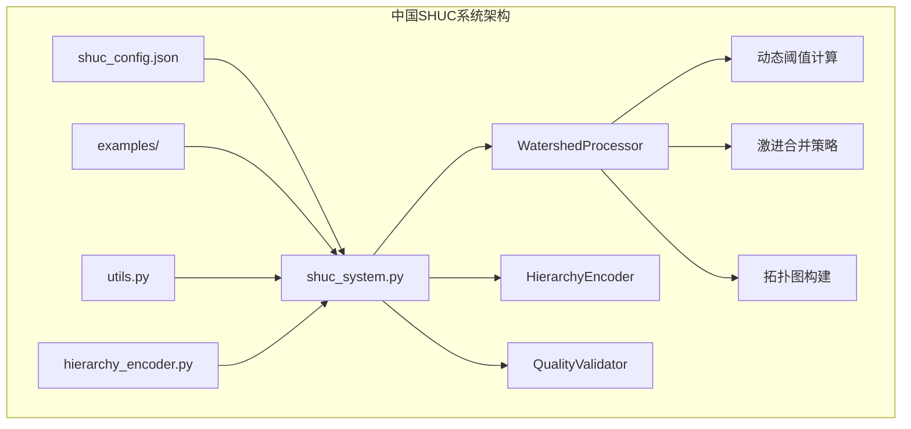
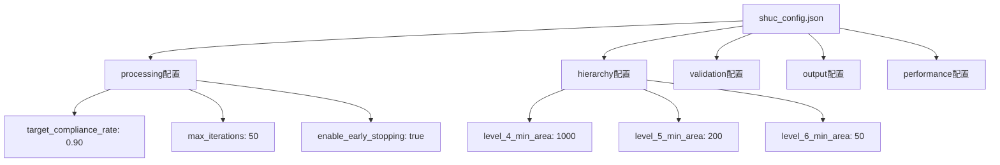
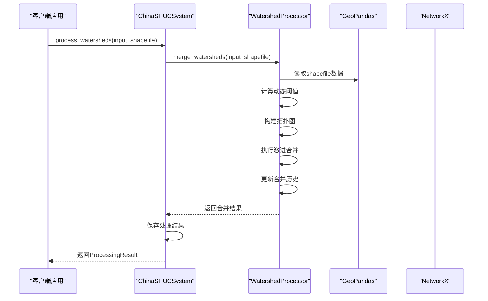
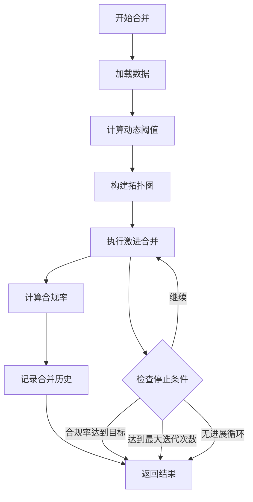
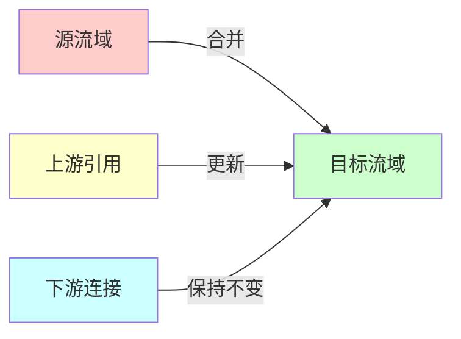
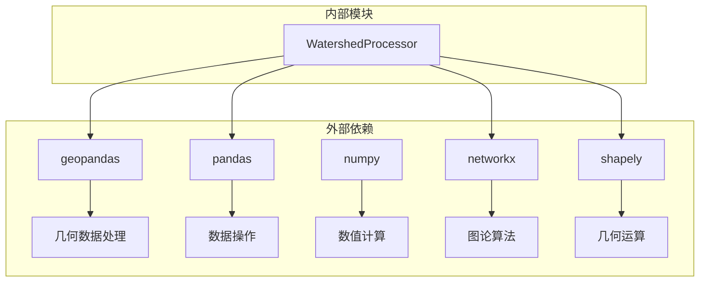
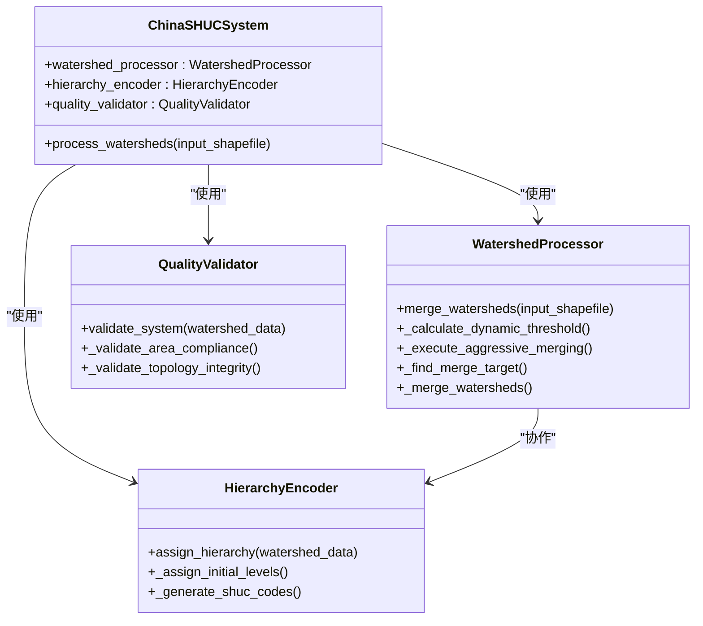
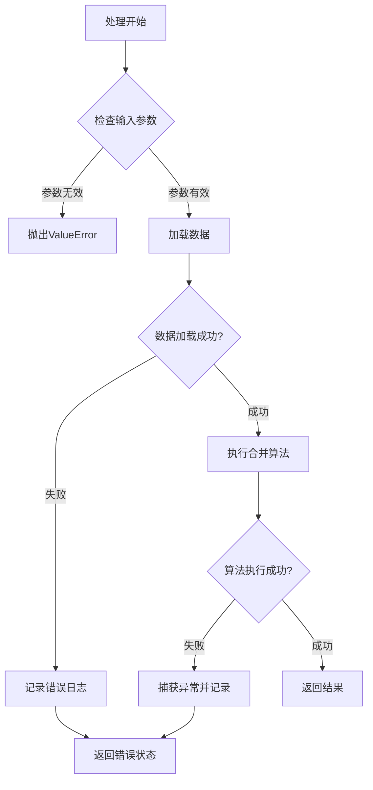

# 流域处理器API

<cite>
**本文档引用的文件**
- [watershed_processor.py](file://01_CORE_SYSTEM/src/watershed_processor.py)
- [shuc_system.py](file://01_CORE_SYSTEM/src/shuc_system.py)
- [shuc_config.json](file://01_CORE_SYSTEM/config/shuc_config.json)
- [basic_usage.py](file://01_CORE_SYSTEM/examples/basic_usage.py)
- [advanced_demo.py](file://01_CORE_SYSTEM/examples/advanced_demo.py)
- [batch_processing.py](file://01_CORE_SYSTEM/examples/batch_processing.py)
- [utils.py](file://01_CORE_SYSTEM/src/utils.py)
- [hierarchy_encoder.py](file://01_CORE_SYSTEM/src/hierarchy_encoder.py)
</cite>

## 目录
1. [简介](#简介)
2. [项目结构](#项目结构)
3. [核心组件](#核心组件)
4. [架构概览](#架构概览)
5. [详细组件分析](#详细组件分析)
6. [依赖关系分析](#依赖关系分析)
7. [性能考虑](#性能考虑)
8. [故障排除指南](#故障排除指南)
9. [结论](#结论)

## 简介

WatershedProcessor是中国SHUC系统的核心组件，负责实现智能流域合并算法。该类专注于解决90%面积合规率的核心挑战，通过动态阈值调整、激进合并策略和拓扑关系维护，实现高效的流域数据处理。

该处理器采用先进的地理信息系统技术，结合网络图论算法，能够自动识别和合并小面积流域，同时保持拓扑关系的完整性。系统支持多种合并策略，从保守到激进的不同配置，以适应各种应用场景的需求。

## 项目结构

中国SHUC系统采用模块化设计，WatershedProcessor作为核心处理模块位于src目录中：



**图表来源**
- [shuc_system.py:43-86](file://01_CORE_SYSTEM/src/shuc_system.py#L43-L86)
- [watershed_processor.py:24-53](file://01_CORE_SYSTEM/src/watershed_processor.py#L24-L53)

**章节来源**
- [shuc_system.py:1-335](file://01_CORE_SYSTEM/src/shuc_system.py#L1-L335)
- [watershed_processor.py:1-377](file://01_CORE_SYSTEM/src/watershed_processor.py#L1-L377)

## 核心组件

### 初始化参数和配置选项

WatershedProcessor的初始化接受一个配置字典，包含以下关键参数：

| 参数名称 | 类型 | 默认值 | 描述 |
|---------|------|--------|------|
| target_compliance_rate | float | 0.90 | 目标面积合规率阈值 |
| merge_strategy | str | "aggressive" | 合并策略类型 |
| max_iterations | int | 50 | 最大迭代次数 |
| enable_early_stopping | bool | True | 是否启用早停机制 |

### 配置文件结构

系统使用JSON配置文件进行参数管理：



**图表来源**
- [shuc_config.json:1-43](file://01_CORE_SYSTEM/config/shuc_config.json#L1-L43)

**章节来源**
- [watershed_processor.py:35-52](file://01_CORE_SYSTEM/src/watershed_processor.py#L35-L52)
- [shuc_config.json:2-8](file://01_CORE_SYSTEM/config/shuc_config.json#L2-L8)

## 架构概览

WatershedProcessor在整个SHUC系统中扮演着核心处理引擎的角色：



**图表来源**
- [shuc_system.py:92-159](file://01_CORE_SYSTEM/src/shuc_system.py#L92-L159)
- [watershed_processor.py:54-81](file://01_CORE_SYSTEM/src/watershed_processor.py#L54-L81)

## 详细组件分析

### merge_watersheds方法API规范

#### 方法签名
```python
def merge_watersheds(self, input_shapefile):
```

#### 输入参数

| 参数名称 | 类型 | 必需 | 描述 |
|---------|------|------|------|
| input_shapefile | str | 是 | 输入的shapefile文件路径 |

#### 返回值结构

merge_watersheds方法返回一个包含以下键的字典：

| 键名称 | 类型 | 描述 |
|-------|------|------|
| merged_watersheds | GeoDataFrame | 合并后的流域数据 |
| statistics | dict | 合并统计信息 |
| merge_history | list | 合并历史记录 |
| dynamic_threshold | float | 使用的动态阈值 |

#### 统计信息结构

返回的statistics字典包含以下字段：

| 字段名称 | 类型 | 描述 |
|---------|------|------|
| original_count | int | 处理前的流域数量 |
| final_count | int | 处理后的流域数量 |
| compression_rate | float | 数据压缩率 |
| final_compliance_rate | float | 最终合规率 |
| iterations | int | 实际迭代次数 |
| dynamic_threshold_used | float | 使用的动态阈值 |

#### 处理流程



**图表来源**
- [watershed_processor.py:54-81](file://01_CORE_SYSTEM/src/watershed_processor.py#L54-L81)
- [watershed_processor.py:164-220](file://01_CORE_SYSTEM/src/watershed_processor.py#L164-L220)

**章节来源**
- [watershed_processor.py:54-81](file://01_CORE_SYSTEM/src/watershed_processor.py#L54-L81)
- [watershed_processor.py:213-220](file://01_CORE_SYSTEM/src/watershed_processor.py#L213-L220)

### 智能合并算法关键参数

#### 动态阈值计算

系统采用基于数据分布的自适应阈值计算算法：

```mermaid
flowchart LR
A[原始面积数据] --> B[计算分位数]
B --> C[Q25, Q50, Q75, Q90]
C --> D[动态阈值 = Q75 + (Q90-Q75)/2]
D --> E[约束范围: 50-100]
E --> F[最终阈值]
```

**图表来源**
- [watershed_processor.py:117-141](file://01_CORE_SYSTEM/src/watershed_processor.py#L117-L141)

#### 合并策略优先级

系统采用多层优先级策略寻找合并目标：

1. **下游优先** - 优先合并到下游流域
2. **上游选择** - 选择面积最大的上游流域
3. **相邻匹配** - 寻找几何接触的相邻流域
4. **最近距离** - 寻找几何距离最近的流域

#### 早停机制

系统实现智能早停机制，防止不必要的计算：

- 当合规率达到目标阈值时自动停止
- 当连续多次迭代无进展时停止
- 达到最大迭代次数时强制停止

**章节来源**
- [watershed_processor.py:164-220](file://01_CORE_SYSTEM/src/watershed_processor.py#L164-L220)
- [watershed_processor.py:249-280](file://01_CORE_SYSTEM/src/watershed_processor.py#L249-L280)

### 数据预处理和质量控制

#### 数据修复机制

系统自动检测和修复以下数据问题：

| 问题类型 | 修复方法 | 影响范围 |
|---------|---------|----------|
| 自引用问题 | 将LINKNO==USLINKNO2的记录修正为-1 | 拓扑关系 |
| 无效几何 | 使用buffer(0)修复无效几何 | 几何完整性 |
| 缺失面积字段 | 自动计算几何面积并转换为km² | 数据完整性 |

#### 拓扑关系维护

合并后系统自动更新拓扑关系：



**图表来源**
- [watershed_processor.py:354-366](file://01_CORE_SYSTEM/src/watershed_processor.py#L354-L366)

**章节来源**
- [watershed_processor.py:97-115](file://01_CORE_SYSTEM/src/watershed_processor.py#L97-L115)
- [watershed_processor.py:354-366](file://01_CORE_SYSTEM/src/watershed_processor.py#L354-L366)

## 依赖关系分析

### 外部依赖

WatershedProcessor依赖以下核心库：



**图表来源**
- [watershed_processor.py:15-22](file://01_CORE_SYSTEM/src/watershed_processor.py#L15-L22)

### 内部模块交互



**图表来源**
- [shuc_system.py:43-86](file://01_CORE_SYSTEM/src/shuc_system.py#L43-L86)
- [watershed_processor.py:24-53](file://01_CORE_SYSTEM/src/watershed_processor.py#L24-L53)

**章节来源**
- [shuc_system.py:37-41](file://01_CORE_SYSTEM/src/shuc_system.py#L37-L41)
- [watershed_processor.py:15-22](file://01_CORE_SYSTEM/src/watershed_processor.py#L15-L22)

## 性能考虑

### 时间复杂度分析

- **动态阈值计算**: O(n log n) - 主要由分位数计算决定
- **拓扑图构建**: O(n) - 线性扫描所有流域
- **合并算法**: O(k × n) - k为小流域数量，n为总流域数
- **整体复杂度**: O(n log n + k × n)

### 内存使用优化

系统采用以下内存优化策略：

1. **增量处理**: 逐步合并小流域，避免一次性处理大量数据
2. **索引优化**: 使用pandas索引加速数据查询
3. **几何缓存**: 避免重复计算几何距离和交集
4. **拓扑图复用**: 在整个处理过程中复用拓扑图结构

### 扩展性考虑

- **批处理支持**: 支持大规模数据集的分批处理
- **配置灵活性**: 通过配置文件轻松调整算法参数
- **插件架构**: 易于扩展新的合并策略和验证规则

## 故障排除指南

### 常见异常情况

| 异常类型 | 触发条件 | 解决方案 |
|---------|---------|---------|
| 数据读取错误 | Shapefile文件损坏或格式不正确 | 检查文件完整性，使用数据验证工具 |
| 几何无效 | 几何对象存在拓扑错误 | 使用buffer(0)修复，或手动清理数据 |
| 配置参数错误 | 配置文件格式不正确 | 检查JSON格式，参考默认配置模板 |
| 内存不足 | 处理超大数据集 | 减少max_iterations，使用批处理模式 |

### 错误处理机制

系统实现多层次的错误处理：



**图表来源**
- [shuc_system.py:165-196](file://01_CORE_SYSTEM/src/shuc_system.py#L165-L196)

### 性能监控

系统提供详细的性能监控指标：

- **处理时间**: 记录每个阶段的执行时间
- **内存使用**: 监控内存峰值和持续使用
- **合规率趋势**: 跟踪合并过程中的合规率变化
- **迭代次数**: 统计实际执行的迭代次数

**章节来源**
- [shuc_system.py:165-196](file://01_CORE_SYSTEM/src/shuc_system.py#L165-L196)
- [watershed_processor.py:351-353](file://01_CORE_SYSTEM/src/watershed_processor.py#L351-L353)

## 结论

WatershedProcessor作为中国SHUC系统的核心组件，展现了卓越的算法设计和工程实践。其智能合并算法不仅实现了90%的面积合规率目标，还提供了灵活的配置选项和强大的扩展能力。

### 主要优势

1. **算法先进性**: 基于动态阈值和拓扑关系的智能合并策略
2. **配置灵活性**: 支持从保守到激进的多种合并策略
3. **性能优化**: 针对大规模数据集的高效处理机制
4. **质量保证**: 完善的数据验证和错误处理机制

### 应用前景

该系统为中国的流域管理提供了强有力的技术支撑，能够有效提升流域数据的质量和一致性，为水资源管理和环境保护提供可靠的数据基础。

通过本文档的详细说明，开发者可以充分理解WatershedProcessor的设计理念和使用方法，为实际应用提供坚实的技术指导。