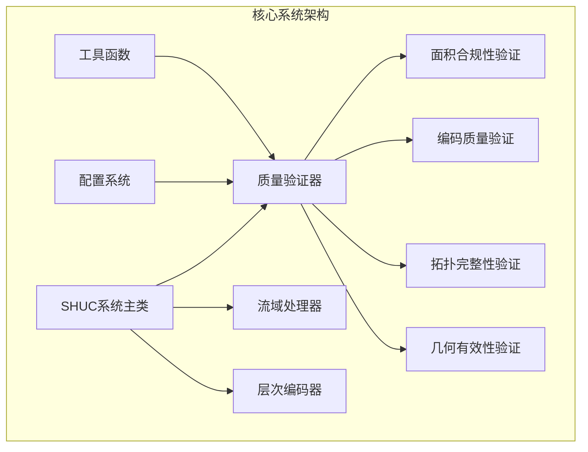
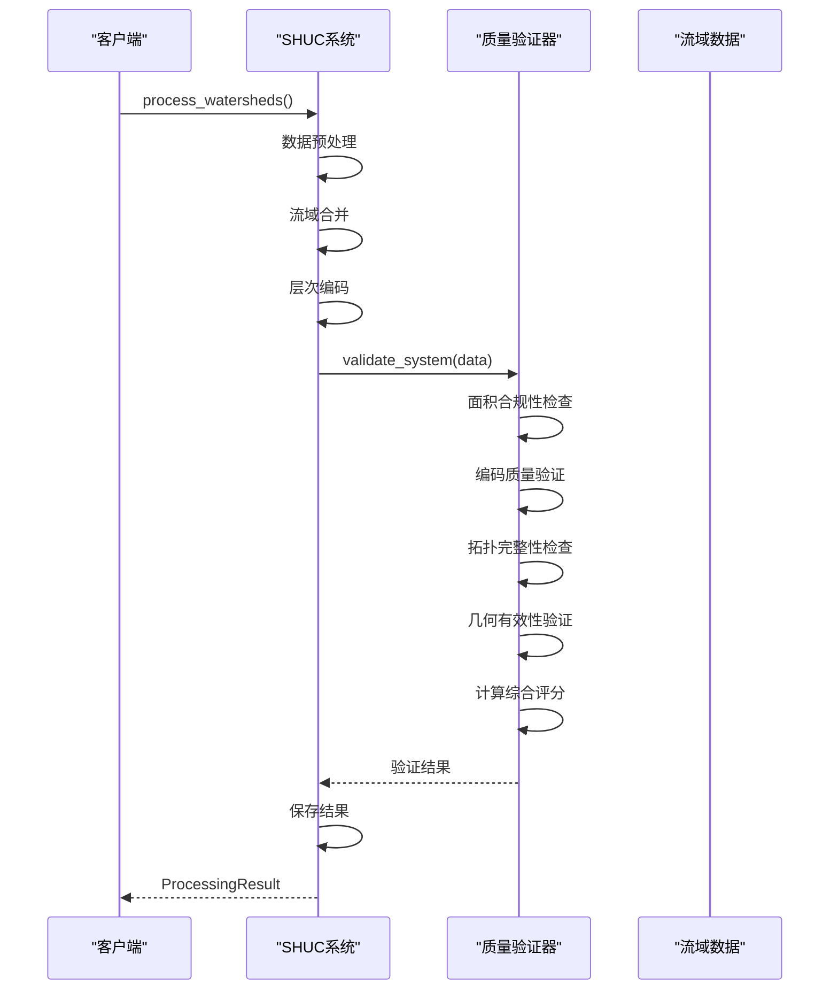
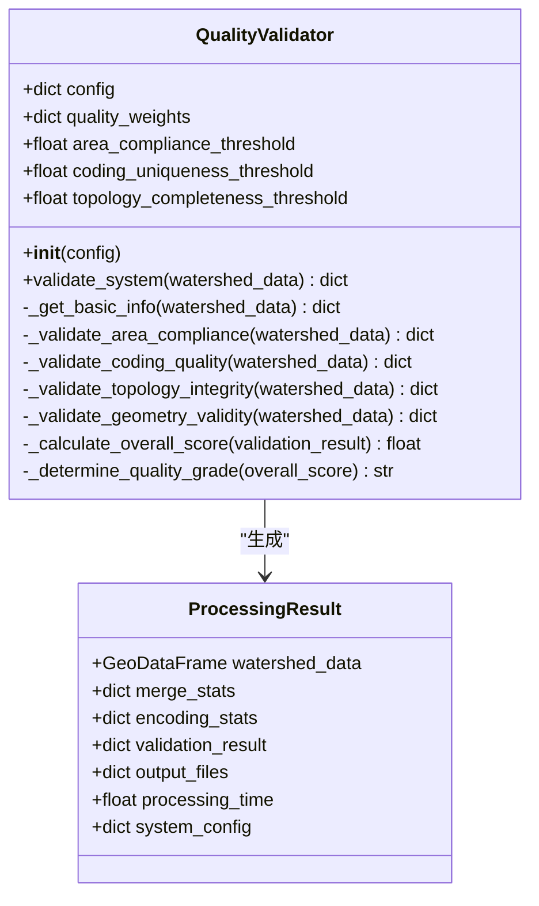
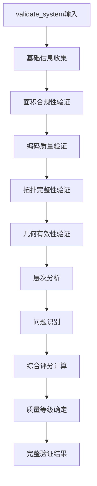
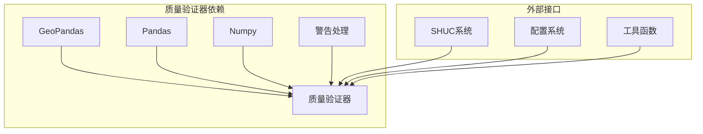

# 质量验证器API

<cite>
**本文档引用的文件**
- [quality_validator.py](file://01_CORE_SYSTEM/src/quality_validator.py)
- [validation_config.json](file://01_CORE_SYSTEM/config/validation_config.json)
- [shuc_system.py](file://01_CORE_SYSTEM/src/shuc_system.py)
- [basic_usage.py](file://01_CORE_SYSTEM/examples/basic_usage.py)
- [advanced_demo.py](file://01_CORE_SYSTEM/examples/advanced_demo.py)
- [batch_processing.py](file://01_CORE_SYSTEM/examples/batch_processing.py)
- [utils.py](file://01_CORE_SYSTEM/src/utils.py)
- [validation_report.json](file://04_EXPERIMENTS/results/prototype_140_watersheds/fixed_system_20250830_233151/validation_report.json)
</cite>

## 目录
1. [简介](#简介)
2. [项目结构](#项目结构)
3. [核心组件](#核心组件)
4. [架构概览](#架构概览)
5. [详细组件分析](#详细组件分析)
6. [依赖关系分析](#依赖关系分析)
7. [性能考虑](#性能考虑)
8. [故障排除指南](#故障排除指南)
9. [结论](#结论)
10. [附录](#附录)

## 简介
质量验证器是SHUC（中国流域层次编码系统）的核心组件，负责对处理后的流域数据进行全面的质量评估。该系统实现了多维度的质量验证，包括面积合规性检查、编码唯一性验证、拓扑完整性检查和几何有效性验证，并提供综合评分系统来量化整体质量水平。

## 项目结构
质量验证器位于核心系统中，与数据处理管道紧密集成：



**图表来源**
- [shuc_system.py:43-89](file://01_CORE_SYSTEM/src/shuc_system.py#L43-L89)
- [quality_validator.py:24-60](file://01_CORE_SYSTEM/src/quality_validator.py#L24-L60)

**章节来源**
- [shuc_system.py:43-89](file://01_CORE_SYSTEM/src/shuc_system.py#L43-L89)
- [quality_validator.py:24-60](file://01_CORE_SYSTEM/src/quality_validator.py#L24-L60)

## 核心组件
质量验证器类提供了完整的质量评估功能，具有以下核心特性：

### 主要功能模块
- **面积合规性验证**：检查流域面积是否符合动态阈值要求
- **编码质量验证**：验证SHUC编码的唯一性和格式正确性
- **拓扑完整性验证**：检查流域间的拓扑关系完整性
- **几何有效性验证**：验证几何数据的有效性和完整性
- **综合评分系统**：基于加权算法计算整体质量评分

### 初始化参数配置
质量验证器通过配置字典接收参数，支持灵活的定制化：

**配置参数结构**：
- `area_compliance_threshold`: 面积合规性阈值（默认0.80）
- `coding_uniqueness_threshold`: 编码唯一性阈值（默认1.00）
- `topology_completeness_threshold`: 拓扑完整性阈值（默认0.95）
- `quality_weights`: 质量权重配置（默认{面积合规: 0.40, 编码质量: 0.30, 拓扑完整性: 0.20, 几何有效性: 0.10}）

**章节来源**
- [quality_validator.py:35-60](file://01_CORE_SYSTEM/src/quality_validator.py#L35-L60)
- [validation_config.json:1-46](file://01_CORE_SYSTEM/config/validation_config.json#L1-L46)

## 架构概览
质量验证器在整个SHUC系统中的位置和作用：



**图表来源**
- [shuc_system.py:92-159](file://01_CORE_SYSTEM/src/shuc_system.py#L92-L159)
- [quality_validator.py:61-86](file://01_CORE_SYSTEM/src/quality_validator.py#L61-L86)

**章节来源**
- [shuc_system.py:92-159](file://01_CORE_SYSTEM/src/shuc_system.py#L92-L159)
- [quality_validator.py:61-86](file://01_CORE_SYSTEM/src/quality_validator.py#L61-L86)

## 详细组件分析

### 类结构设计
质量验证器采用面向对象的设计模式，提供了清晰的接口和内部实现分离：



**图表来源**
- [quality_validator.py:24-411](file://01_CORE_SYSTEM/src/quality_validator.py#L24-L411)
- [shuc_system.py:142-150](file://01_CORE_SYSTEM/src/shuc_system.py#L142-L150)

### validate_system 方法详解

#### 接口规范
validate_system 是质量验证器的核心方法，负责执行完整的系统验证流程：

**输入参数**：
- `watershed_data`: GeoDataFrame类型，包含编码后的流域数据
- 必需列：`area_km2`（面积）、`geometry`（几何数据）
- 可选列：`shuc_code`（SHUC编码）、`shuc_level`（层级）、`LINKNO`、`DSLINKNO1`、`USLINKNO2`

**输出结果结构**：
validate_system 返回包含完整验证信息的字典，结构如下：



**图表来源**
- [quality_validator.py:61-86](file://01_CORE_SYSTEM/src/quality_validator.py#L61-L86)

#### 验证流程详细说明

**1. 基础信息收集**
- 总流域数量统计
- 面积统计信息（最小、最大、平均、总和）
- 编码字段存在性检查

**2. 面积合规性验证**
- 动态阈值计算：基于面积分布的第75和90百分位数
- 合规率计算：满足阈值要求的流域比例
- 面积分布分析：按不同面积区间统计

**3. 编码质量验证**
- 编码唯一性检查
- 编码格式分析（数字格式验证）
- 编码完整性统计

**4. 拓扑完整性验证**
- 拓扑字段存在性检查
- 上游引用有效性分析
- 循环引用检测
- 孤立流域识别

**5. 几何有效性验证**
- 几何数据有效性检查
- 空几何检测
- 几何类型统计

**章节来源**
- [quality_validator.py:61-411](file://01_CORE_SYSTEM/src/quality_validator.py#L61-L411)

### 多维度质量评估指标

#### 面积合规率指标
- **动态阈值计算**：`max(50, min(100, Q75 + (Q90 - Q75) / 2))`
- **合规率计算**：`满足阈值的流域数 / 总流域数`
- **面积分布统计**：小流域(<50km²)、中流域(50-200km²)、大流域(>200km²)

#### 编码唯一性指标
- **唯一性比率**：`唯一编码数 / 总编码数`
- **重复编码检测**：识别重复的SHUC编码
- **编码格式验证**：数字格式检查

#### 拓扑完整性指标
- **完整性评分**：`有效引用数 / 总关系数`
- **上游引用有效性**：检查下游引用的正确性
- **孤立流域识别**：无上游引用的流域
- **循环引用检测**：避免拓扑关系中的循环

#### 几何有效性指标
- **有效性比率**：`有效几何数 / 总几何数`
- **空几何检测**：识别空几何或无效几何
- **几何类型分布**：统计不同几何类型的数量

**章节来源**
- [quality_validator.py:100-284](file://01_CORE_SYSTEM/src/quality_validator.py#L100-L284)

### 质量评分算法

#### 加权评分系统
质量验证器采用加权平均算法计算综合评分：

**权重配置**：
- 面积合规性：40%
- 编码质量：30%
- 拓扑完整性：20%
- 几何有效性：10%

**评分计算公式**：
```
总体评分 = Σ(各维度评分 × 对应权重)
```

**质量等级划分**：
- 优秀：≥90分
- 良好：80-89分
- 可接受：70-79分
- 需要改进：<70分

**章节来源**
- [quality_validator.py:368-411](file://01_CORE_SYSTEM/src/quality_validator.py#L368-L411)

### 验证报告详细说明

#### 报告结构
完整的验证报告包含以下主要部分：

**基本信息**：
- 验证时间戳
- 基础统计信息
- 数据完整性检查

**质量维度分析**：
- 面积合规性详细报告
- 编码质量分析
- 拓扑完整性报告
- 几何有效性检查

**综合评估**：
- 总体评分
- 质量等级
- 层次分布分析
- 质量问题识别

**章节来源**
- [quality_validator.py:71-86](file://01_CORE_SYSTEM/src/quality_validator.py#L71-L86)

### 问题诊断功能

#### 自动问题识别
质量验证器能够自动识别以下类型的问题：

**面积相关问题**：
- 小流域过多（<50km²）
- 面积分布不均衡

**编码相关问题**：
- 缺少SHUC编码
- 编码重复
- 编码格式错误

**几何相关问题**：
- 几何数据无效
- 空几何
- 几何类型异常

**拓扑相关问题**：
- 孤立流域
- 循环引用
- 无效上游引用

**章节来源**
- [quality_validator.py:334-366](file://01_CORE_SYSTEM/src/quality_validator.py#L334-L366)

## 依赖关系分析

### 内部依赖关系
质量验证器与其他系统组件的交互关系：



**图表来源**
- [quality_validator.py:17-22](file://01_CORE_SYSTEM/src/quality_validator.py#L17-L22)
- [shuc_system.py:38-41](file://01_CORE_SYSTEM/src/shuc_system.py#L38-L41)

### 外部依赖分析
质量验证器依赖于以下关键库：

- **GeoPandas**: 空间数据处理和几何验证
- **Pandas**: 数据结构和统计分析
- **NumPy**: 数值计算和统计函数
- **Collections**: 数据结构和计数功能

**章节来源**
- [quality_validator.py:17-22](file://01_CORE_SYSTEM/src/quality_validator.py#L17-L22)
- [shuc_system.py:38-41](file://01_CORE_SYSTEM/src/shuc_system.py#L38-L41)

## 性能考虑
质量验证器在设计时充分考虑了性能优化：

### 时间复杂度分析
- **面积合规性验证**：O(n)，其中n为流域数量
- **编码质量验证**：O(n)，单次遍历统计
- **拓扑完整性验证**：O(n)，涉及上游引用检查
- **几何有效性验证**：O(n)，逐个几何对象验证
- **综合评分计算**：O(k)，k为验证维度数量

### 内存使用优化
- 使用向量化操作减少内存分配
- 避免不必要的数据复制
- 及时释放中间计算结果

### 批处理支持
系统支持批量处理模式，适用于大规模数据集的验证需求。

## 故障排除指南

### 常见问题及解决方案

**问题1：输入数据格式错误**
- **症状**：验证失败或返回错误信息
- **原因**：缺少必需字段或数据类型不正确
- **解决方案**：检查数据字段完整性，确保包含area_km2和geometry字段

**问题2：编码验证失败**
- **症状**：编码唯一性检查失败
- **原因**：存在重复编码或编码格式错误
- **解决方案**：清理重复编码，确保编码格式为纯数字

**问题3：拓扑验证异常**
- **症状**：拓扑完整性评分为0
- **原因**：缺少必要的拓扑字段
- **解决方案**：确保数据包含LINKNO、DSLINKNO1等字段

**问题4：几何验证错误**
- **症状**：几何有效性检查失败
- **原因**：几何数据损坏或格式不正确
- **解决方案**：修复几何数据，确保几何对象有效

**章节来源**
- [quality_validator.py:144-148](file://01_CORE_SYSTEM/src/quality_validator.py#L144-L148)
- [quality_validator.py:205-208](file://01_CORE_SYSTEM/src/quality_validator.py#L205-L208)

### 调试建议
- 使用示例脚本验证基本功能
- 逐步检查每个验证维度的结果
- 对比历史验证报告识别变化趋势
- 利用批处理功能进行大规模验证

## 结论
质量验证器作为SHUC系统的核心组件，提供了全面、准确的质量评估能力。通过多维度验证和加权评分系统，能够有效保证流域数据的质量和一致性。系统的设计考虑了性能优化和扩展性，支持大规模数据处理和定制化配置。

## 附录

### 验证示例

#### 基础使用示例
```python
# 创建质量验证器实例
validator = QualityValidator(config)

# 执行系统验证
result = validator.validate_system(watershed_data)

# 获取验证结果
print(f"总体评分: {result['overall_score']}")
print(f"质量等级: {result['quality_grade']}")
```

#### 高级配置示例
```python
# 自定义验证配置
custom_config = {
    'area_compliance_threshold': 0.85,
    'coding_uniqueness_threshold': 0.95,
    'quality_weights': {
        'area_compliance': 0.35,
        'coding_quality': 0.25,
        'topology_integrity': 0.25,
        'geometry_validity': 0.15
    }
}

validator = QualityValidator(custom_config)
```

### 改进措施建议

#### 短期改进（1-3个月）
- 增强错误处理和异常恢复机制
- 优化大数据集的处理性能
- 添加更多的验证维度和指标

#### 中期改进（3-6个月）
- 实现增量验证功能
- 添加可视化报告生成功能
- 优化内存使用和缓存策略

#### 长期改进（6+个月）
- 实现机器学习驱动的质量预测
- 添加实时监控和告警功能
- 支持分布式验证处理

**章节来源**
- [basic_usage.py:25-106](file://01_CORE_SYSTEM/examples/basic_usage.py#L25-L106)
- [advanced_demo.py:31-60](file://01_CORE_SYSTEM/examples/advanced_demo.py#L31-L60)
- [batch_processing.py:31-104](file://01_CORE_SYSTEM/examples/batch_processing.py#L31-L104)