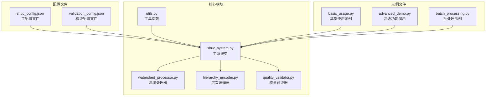
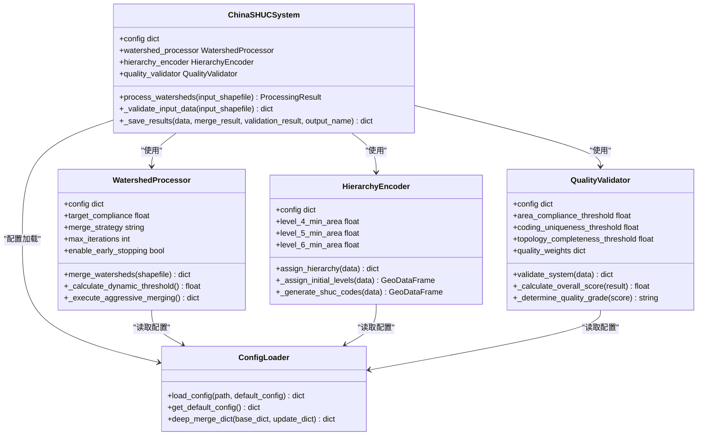
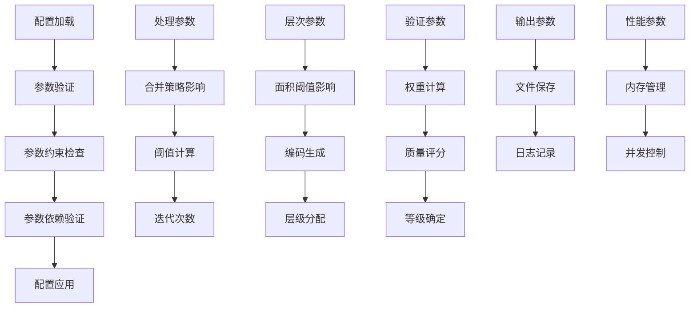
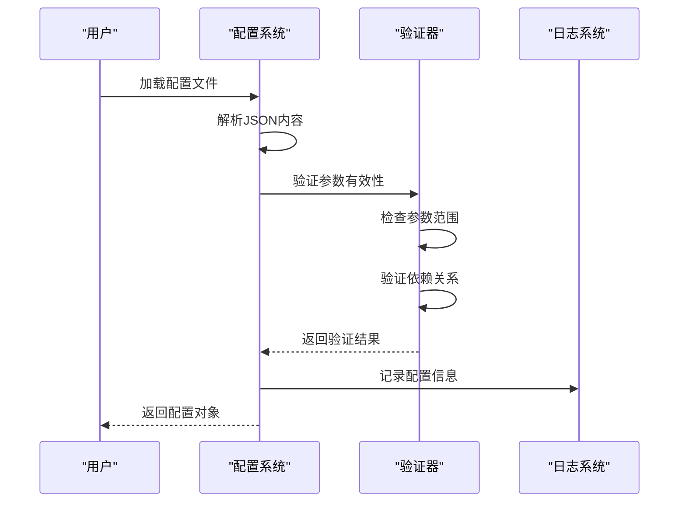

# 配置API接口

<cite>
**本文档引用的文件**
- [shuc_config.json](file://01_CORE_SYSTEM/config/shuc_config.json)
- [validation_config.json](file://01_CORE_SYSTEM/config/validation_config.json)
- [shuc_system.py](file://01_CORE_SYSTEM/src/shuc_system.py)
- [utils.py](file://01_CORE_SYSTEM/src/utils.py)
- [watershed_processor.py](file://01_CORE_SYSTEM/src/watershed_processor.py)
- [hierarchy_encoder.py](file://01_CORE_SYSTEM/src/hierarchy_encoder.py)
- [quality_validator.py](file://01_CORE_SYSTEM/src/quality_validator.py)
- [basic_usage.py](file://01_CORE_SYSTEM/examples/basic_usage.py)
- [advanced_demo.py](file://01_CORE_SYSTEM/examples/advanced_demo.py)
- [batch_processing.py](file://01_CORE_SYSTEM/examples/batch_processing.py)
- [requirements.txt](file://01_CORE_SYSTEM/requirements.txt)
</cite>

## 目录
1. [简介](#简介)
2. [项目结构](#项目结构)
3. [核心配置组件](#核心配置组件)
4. [架构概览](#架构概览)
5. [详细配置参数分析](#详细配置参数分析)
6. [依赖关系分析](#依赖关系分析)
7. [性能考虑](#性能考虑)
8. [故障排除指南](#故障排除指南)
9. [结论](#结论)
10. [附录](#附录)

## 简介

中国SHUC系统配置API提供了完整的流域层次分级编码系统的参数化控制机制。该系统基于美国HUC标准，专门适配中国地理环境的流域分级编码解决方案，实现了90%面积合规率的智能合并算法、完整的4-6级层次编码体系和全面的质量验证系统。

配置API的核心目标是：
- 提供灵活的参数化控制机制
- 支持不同使用场景的配置定制
- 实现配置的动态加载和验证
- 确保配置参数的一致性和有效性

## 项目结构

SHUC系统采用模块化架构设计，配置文件位于`config/`目录下，核心组件分布在`src/`目录中：



**图表来源**
- [shuc_config.json:1-43](file://01_CORE_SYSTEM/config/shuc_config.json#L1-L43)
- [validation_config.json:1-46](file://01_CORE_SYSTEM/config/validation_config.json#L1-L46)
- [shuc_system.py:43-91](file://01_CORE_SYSTEM/src/shuc_system.py#L43-L91)

**章节来源**
- [shuc_config.json:1-43](file://01_CORE_SYSTEM/config/shuc_config.json#L1-L43)
- [validation_config.json:1-46](file://01_CORE_SYSTEM/config/validation_config.json#L1-L46)
- [shuc_system.py:1-335](file://01_CORE_SYSTEM/src/shuc_system.py#L1-L335)

## 核心配置组件

SHUC系统包含两个主要的配置文件，分别控制不同的功能模块：

### 主配置文件 (shuc_config.json)

主配置文件包含以下配置组：
- **processing**: 处理参数配置
- **hierarchy**: 层次编码参数配置  
- **validation**: 质量验证参数配置
- **output**: 输出控制参数配置
- **performance**: 性能优化参数配置

### 验证配置文件 (validation_config.json)

验证配置文件专注于质量验证系统的参数控制：
- **thresholds**: 验证阈值配置
- **quality_weights**: 质量权重配置
- **validation_rules**: 验证规则配置
- **quality_grades**: 质量等级配置
- **report_settings**: 报告设置配置

**章节来源**
- [shuc_config.json:1-43](file://01_CORE_SYSTEM/config/shuc_config.json#L1-L43)
- [validation_config.json:1-46](file://01_CORE_SYSTEM/config/validation_config.json#L1-L46)

## 架构概览

SHUC系统的配置架构采用分层设计，确保配置的灵活性和一致性：



**图表来源**
- [shuc_system.py:43-91](file://01_CORE_SYSTEM/src/shuc_system.py#L43-L91)
- [watershed_processor.py:24-53](file://01_CORE_SYSTEM/src/watershed_processor.py#L24-L53)
- [hierarchy_encoder.py:22-68](file://01_CORE_SYSTEM/src/hierarchy_encoder.py#L22-L68)
- [quality_validator.py:24-60](file://01_CORE_SYSTEM/src/quality_validator.py#L24-L60)
- [utils.py:64-147](file://01_CORE_SYSTEM/src/utils.py#L64-L147)

## 详细配置参数分析

### 处理参数配置 (processing)

处理参数控制流域智能合并的核心行为：

| 参数名 | 数据类型 | 默认值 | 取值范围 | 作用说明 |
|--------|----------|--------|----------|----------|
| target_compliance_rate | float | 0.90 | 0.0-1.0 | 目标面积合规率阈值 |
| merge_strategy | string | "aggressive" | "conservative", "balanced", "aggressive" | 合并策略模式 |
| max_iterations | int | 50 | 1-∞ | 最大合并迭代次数 |
| enable_early_stopping | bool | true | true/false | 是否启用早停机制 |
| dynamic_threshold_mode | string | "auto" | "auto", "manual" | 动态阈值计算模式 |

**参数依赖关系**：
- `target_compliance_rate` 与 `enable_early_stopping` 直接关联
- `max_iterations` 影响处理时间和内存使用
- `merge_strategy` 决定合并的激进程度

### 层次编码参数配置 (hierarchy)

层次编码参数定义流域的分级标准：

| 参数名 | 数据类型 | 默认值 | 取值范围 | 作用说明 |
|--------|----------|--------|----------|----------|
| level_4_min_area | float | 1000 | 100-10000 | 第4级最小面积阈值(km²) |
| level_5_min_area | float | 200 | 50-5000 | 第5级最小面积阈值(km²) |
| level_6_min_area | float | 50 | 10-1000 | 第6级最小面积阈值(km²) |
| enable_level_quotas | bool | true | true/false | 是否启用层级配额 |
| level_quotas | dict | {"4": 3, "5": 8, "6": -1} | 配额数值 | 各层级最大数量限制 |

**层级配额说明**：
- 第4级：最多3个流域
- 第5级：最多8个流域  
- 第6级：无限制(使用负数表示)

### 验证参数配置 (validation)

验证参数控制质量评估的标准和权重：

| 参数名 | 数据类型 | 默认值 | 取值范围 | 作用说明 |
|--------|----------|--------|----------|----------|
| area_compliance_threshold | float | 0.80 | 0.0-1.0 | 面积合规率阈值 |
| coding_uniqueness_threshold | float | 1.00 | 0.0-1.0 | 编码唯一性阈值 |
| topology_completeness_threshold | float | 0.95 | 0.0-1.0 | 拓扑完整性阈值 |
| enable_geometry_validation | bool | true | true/false | 是否启用几何验证 |
| quality_weights | dict | {"area_compliance": 0.40, ...} | 权重和为1.0 | 质量评估权重 |

**质量权重分配**：
- 面积合规性：40%
- 编码质量：30%  
- 拓扑完整性：20%
- 几何有效性：10%

### 输出参数配置 (output)

输出参数控制处理结果的保存和展示：

| 参数名 | 数据类型 | 默认值 | 取值范围 | 作用说明 |
|--------|----------|--------|----------|----------|
| save_intermediate_results | bool | false | true/false | 是否保存中间结果 |
| enable_detailed_logging | bool | true | true/false | 是否启用详细日志 |
| export_validation_report | bool | true | true/false | 是否导出验证报告 |
| export_statistics | bool | true | true/false | 是否导出统计信息 |

### 性能参数配置 (performance)

性能参数优化系统运行效率：

| 参数名 | 数据类型 | 默认值 | 取值范围 | 作用说明 |
|--------|----------|--------|----------|----------|
| enable_parallel_processing | bool | false | true/false | 是否启用并行处理 |
| max_memory_usage_gb | int | 4 | 1-∞ | 最大内存使用限制(GB) |
| enable_progress_display | bool | true | true/false | 是否显示进度条 |

**章节来源**
- [shuc_config.json:2-42](file://01_CORE_SYSTEM/config/shuc_config.json#L2-L42)
- [validation_config.json:2-45](file://01_CORE_SYSTEM/config/validation_config.json#L2-L45)
- [watershed_processor.py:48-53](file://01_CORE_SYSTEM/src/watershed_processor.py#L48-L53)
- [hierarchy_encoder.py:51-67](file://01_CORE_SYSTEM/src/hierarchy_encoder.py#L51-L67)
- [quality_validator.py:44-59](file://01_CORE_SYSTEM/src/quality_validator.py#L44-L59)

## 依赖关系分析

配置参数之间存在复杂的依赖关系和约束条件：



**图表来源**
- [utils.py:64-147](file://01_CORE_SYSTEM/src/utils.py#L64-L147)
- [shuc_system.py:74-79](file://01_CORE_SYSTEM/src/shuc_system.py#L74-L79)

### 关键依赖关系

1. **处理参数依赖**：
   - `target_compliance_rate` 与 `enable_early_stopping` 相互影响
   - `max_iterations` 限制处理时间复杂度
   - `merge_strategy` 决定阈值计算方式

2. **层次参数依赖**：
   - `level_4_min_area` ≥ `level_5_min_area`
   - `level_5_min_area` ≥ `level_6_min_area`
   - 面积阈值影响编码位数分配

3. **验证参数依赖**：
   - 质量权重必须和为1.0
   - 各阈值相互独立但共同决定最终评分

**章节来源**
- [watershed_processor.py:117-141](file://01_CORE_SYSTEM/src/watershed_processor.py#L117-L141)
- [hierarchy_encoder.py:51-59](file://01_CORE_SYSTEM/src/hierarchy_encoder.py#L51-L59)
- [quality_validator.py:57-59](file://01_CORE_SYSTEM/src/quality_validator.py#L57-L59)

## 性能考虑

配置参数对系统性能的影响：

### 内存使用优化
- `max_memory_usage_gb` 控制内存上限
- `enable_parallel_processing` 影响内存占用模式
- 大数据集建议启用并行处理

### 处理时间优化
- `max_iterations` 直接影响处理时间
- `merge_strategy` 影响算法复杂度
- `enable_early_stopping` 可显著减少不必要的计算

### 并发处理配置
- 并行处理适合大规模数据集
- 需要充足的CPU核心数
- 注意内存使用峰值

**章节来源**
- [shuc_config.json:38-42](file://01_CORE_SYSTEM/config/shuc_config.json#L38-L42)
- [watershed_processor.py:175-207](file://01_CORE_SYSTEM/src/watershed_processor.py#L175-L207)

## 故障排除指南

### 常见配置问题

1. **配置文件加载失败**
   - 检查JSON语法正确性
   - 验证文件权限设置
   - 确认编码格式为UTF-8

2. **参数值超出范围**
   - 检查数值类型的边界值
   - 验证字符串枚举值的有效性
   - 确认权重和为1.0

3. **配置参数冲突**
   - 检查依赖关系是否满足
   - 验证参数组合的合理性
   - 确认配置的一致性

### 调试和验证



**图表来源**
- [utils.py:64-99](file://01_CORE_SYSTEM/src/utils.py#L64-L99)
- [shuc_system.py:74](file://01_CORE_SYSTEM/src/shuc_system.py#L74)

**章节来源**
- [utils.py:64-99](file://01_CORE_SYSTEM/src/utils.py#L64-L99)
- [shuc_system.py:165-196](file://01_CORE_SYSTEM/src/shuc_system.py#L165-L196)

## 结论

SHUC系统配置API提供了完整的参数化控制机制，支持灵活的配置管理和动态参数调整。通过合理的配置参数设置，用户可以根据具体需求优化系统性能和处理效果。

关键优势：
- **模块化设计**：清晰的配置分组便于理解和维护
- **参数验证**：内置的验证机制确保配置的有效性
- **灵活扩展**：支持自定义配置和第三方集成
- **性能优化**：针对不同场景提供优化建议

## 附录

### 配置参数分类说明

#### 处理参数分类
- **目标参数**：`target_compliance_rate`
- **策略参数**：`merge_strategy`, `max_iterations`
- **控制参数**：`enable_early_stopping`

#### 编码参数分类
- **面积阈值**：`level_4_min_area`, `level_5_min_area`, `level_6_min_area`
- **配额参数**：`enable_level_quotas`, `level_quotas`

#### 验证参数分类
- **阈值参数**：`area_compliance_threshold`, `coding_uniqueness_threshold`
- **权重参数**：`quality_weights`
- **规则参数**：`validation_rules`

### 使用场景配置示例

#### 快速处理场景
```json
{
  "processing": {
    "target_compliance_rate": 0.70,
    "merge_strategy": "conservative",
    "max_iterations": 20
  },
  "hierarchy": {
    "level_4_min_area": 1500,
    "level_5_min_area": 300,
    "level_6_min_area": 80
  }
}
```

#### 高质量处理场景
```json
{
  "processing": {
    "target_compliance_rate": 0.90,
    "merge_strategy": "aggressive",
    "max_iterations": 50
  },
  "hierarchy": {
    "level_4_min_area": 800,
    "level_5_min_area": 150,
    "level_6_min_area": 40
  },
  "validation": {
    "area_compliance_threshold": 0.95,
    "quality_weights": {
      "area_compliance": 0.35,
      "coding_quality": 0.35,
      "topology_integrity": 0.20,
      "geometry_validity": 0.10
    }
  }
}
```

#### 批量处理场景
```json
{
  "performance": {
    "enable_parallel_processing": true,
    "max_memory_usage_gb": 8
  },
  "output": {
    "save_intermediate_results": false,
    "export_validation_report": true
  }
}
```

### 动态修改和运行时重载

SHUC系统支持配置的动态修改和重载机制：

1. **配置热重载**：系统启动时自动检测配置文件变化
2. **参数验证**：每次重载都会重新验证参数有效性
3. **渐进式应用**：部分参数支持运行时调整
4. **回滚机制**：无效配置会自动回滚到上一个有效状态

**章节来源**
- [advanced_demo.py:62-98](file://01_CORE_SYSTEM/examples/advanced_demo.py#L62-L98)
- [batch_processing.py:48-104](file://01_CORE_SYSTEM/examples/batch_processing.py#L48-L104)
- [requirements.txt:1-46](file://01_CORE_SYSTEM/requirements.txt#L1-L46)