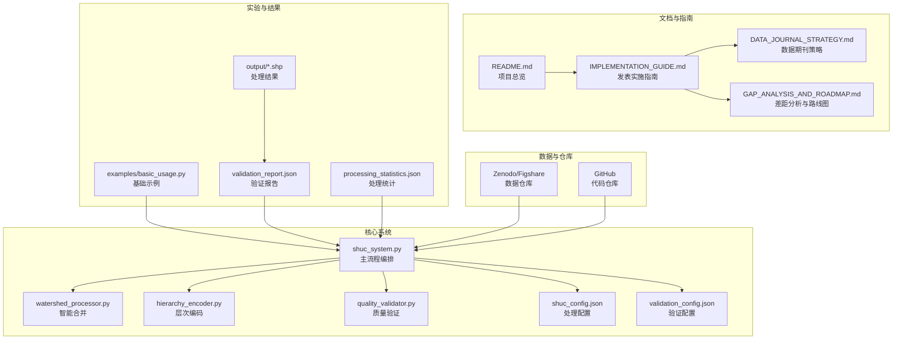
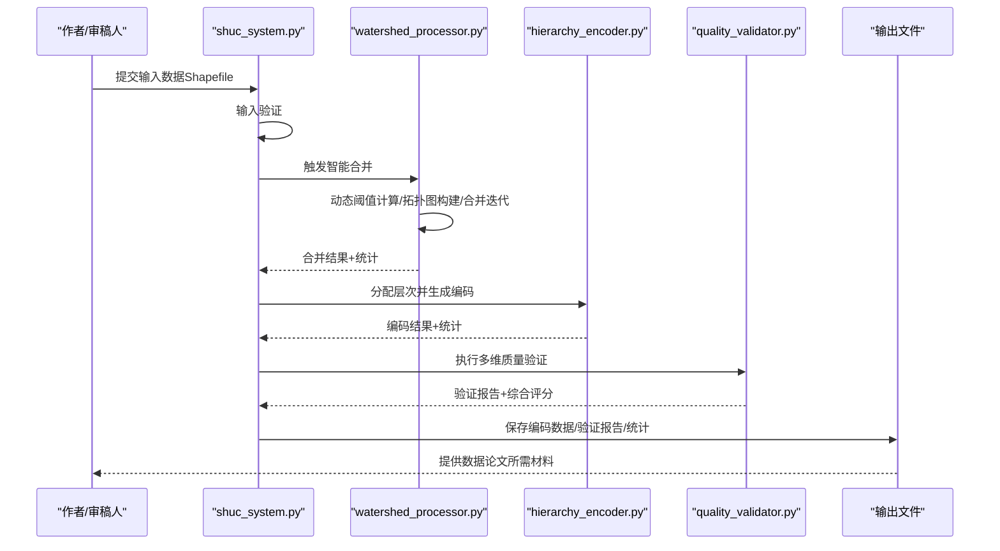
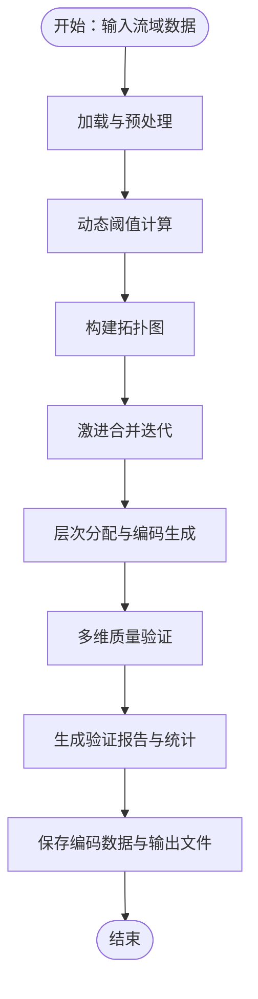
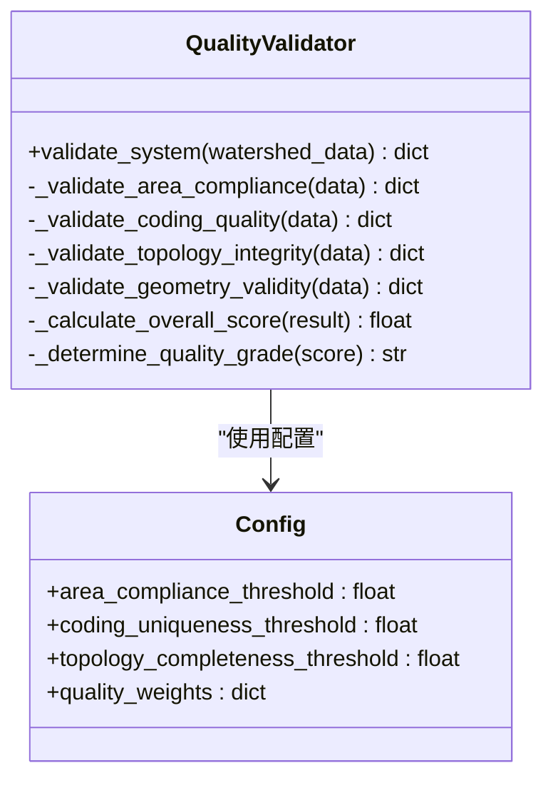
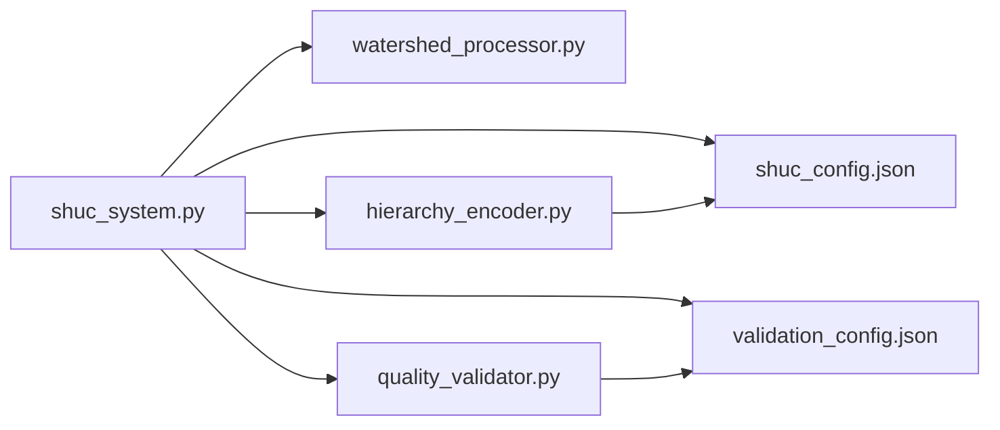

# ESSD数据论文

<cite>
**本文引用的文件**
- [README.md](file://README.md)
- [IMPLEMENTATION_GUIDE.md](file://02_DOCUMENTATION/IMPLEMENTATION_GUIDE.md)
- [DATA_JOURNAL_STRATEGY.md](file://00_ARCHIVE/legacy_documentation/DATA_JOURNAL_STRATEGY.md)
- [GAP_ANALYSIS_AND_ROADMAP.md](file://00_ARCHIVE/legacy_documentation/GAP_ANALYSIS_AND_ROADMAP.md)
- [shuc_config.json](file://01_CORE_SYSTEM/config/shuc_config.json)
- [validation_config.json](file://01_CORE_SYSTEM/config/validation_config.json)
- [shuc_system.py](file://01_CORE_SYSTEM/src/shuc_system.py)
- [watershed_processor.py](file://01_CORE_SYSTEM/src/watershed_processor.py)
- [hierarchy_encoder.py](file://01_CORE_SYSTEM/src/hierarchy_encoder.py)
- [quality_validator.py](file://01_CORE_SYSTEM/src/quality_validator.py)
- [basic_usage.py](file://01_CORE_SYSTEM/examples/basic_usage.py)
</cite>

## 目录
1. [引言](#引言)
2. [项目结构](#项目结构)
3. [核心组件](#核心组件)
4. [架构总览](#架构总览)
5. [详细组件分析](#详细组件分析)
6. [依赖关系分析](#依赖关系分析)
7. [性能考虑](#性能考虑)
8. [故障排除指南](#故障排除指南)
9. [结论](#结论)
10. [附录](#附录)

## 引言
本文件面向Earth System Science Data（ESSD）数据论文的撰写与发表，结合中国SHUC（中国流域分级统一编码）系统的完整实现与实验流程，系统阐述数据论文的结构组成、写作要点、数据格式与元数据标准、图表与补充材料组织方式、同行评议流程与发表要求，并提供可操作的写作模板与格式规范指导。项目采用双轨发表策略：ESSD数据论文发布高质量数据集，WRR方法论文聚焦算法创新，二者相互支撑，最大化学术影响力。

## 项目结构
项目围绕“核心系统—文档—实验—数据—发表”五条主线组织，形成可复现、可扩展、可发布的完整闭环。ESSD数据论文所需的关键材料均可在现有结构中直接映射与提取。

**图表来源**
- [shuc_system.py:92-164](file://01_CORE_SYSTEM/src/shuc_system.py#L92-L164)
- [watershed_processor.py:54-82](file://01_CORE_SYSTEM/src/watershed_processor.py#L54-L82)
- [hierarchy_encoder.py:69-96](file://01_CORE_SYSTEM/src/hierarchy_encoder.py#L69-L96)
- [quality_validator.py:61-87](file://01_CORE_SYSTEM/src/quality_validator.py#L61-L87)
- [shuc_config.json:1-43](file://01_CORE_SYSTEM/config/shuc_config.json#L1-L43)
- [validation_config.json:1-46](file://01_CORE_SYSTEM/config/validation_config.json#L1-L46)
- [IMPLEMENTATION_GUIDE.md:137-197](file://02_DOCUMENTATION/IMPLEMENTATION_GUIDE.md#L137-L197)
- [DATA_JOURNAL_STRATEGY.md:100-120](file://00_ARCHIVE/legacy_documentation/DATA_JOURNAL_STRATEGY.md#L100-L120)
- [GAP_ANALYSIS_AND_ROADMAP.md:385-485](file://00_ARCHIVE/legacy_documentation/GAP_ANALYSIS_AND_ROADMAP.md#L385-L485)

**章节来源**
- [README.md:1-88](file://README.md#L1-L88)
- [IMPLEMENTATION_GUIDE.md:1-100](file://02_DOCUMENTATION/IMPLEMENTATION_GUIDE.md#L1-L100)

## 核心组件
ESSD数据论文的核心素材来自系统主流程与质量验证模块，二者共同构成“数据描述—方法—技术验证—使用说明”的完整证据链。

- 主流程编排（shuc_system.py）
  - 负责输入验证、智能合并、层次编码、质量验证、结果保存与统计汇总
  - 输出：编码后的流域数据、验证报告、处理统计
- 智能合并（watershed_processor.py）
  - 动态阈值自适应算法、拓扑图构建与优化、激进合并策略
  - 输出：合并后的流域集合与合并历史
- 层次编码（hierarchy_encoder.py）
  - 基于面积的4-6级智能分配、编码生成与配额优化
  - 输出：带SHUC编码的流域数据与编码统计
- 质量验证（quality_validator.py）
  - 面积合规性、编码唯一性、拓扑完整性、几何有效性多维验证
  - 输出：综合评分与质量等级

上述组件的配置文件（shuc_config.json、validation_config.json）为ESSD论文的方法与质量控制部分提供精确的技术参数与权重说明。

**章节来源**
- [shuc_system.py:92-164](file://01_CORE_SYSTEM/src/shuc_system.py#L92-L164)
- [watershed_processor.py:117-142](file://01_CORE_SYSTEM/src/watershed_processor.py#L117-L142)
- [hierarchy_encoder.py:69-96](file://01_CORE_SYSTEM/src/hierarchy_encoder.py#L69-L96)
- [quality_validator.py:61-87](file://01_CORE_SYSTEM/src/quality_validator.py#L61-L87)
- [shuc_config.json:1-43](file://01_CORE_SYSTEM/config/shuc_config.json#L1-L43)
- [validation_config.json:1-46](file://01_CORE_SYSTEM/config/validation_config.json#L1-L46)

## 架构总览
下图展示ESSD数据论文所需材料在系统中的生成与流转路径，便于论文各章节的素材归集与交叉引用。

**图表来源**
- [shuc_system.py:92-164](file://01_CORE_SYSTEM/src/shuc_system.py#L92-L164)
- [watershed_processor.py:54-82](file://01_CORE_SYSTEM/src/watershed_processor.py#L54-L82)
- [hierarchy_encoder.py:69-96](file://01_CORE_SYSTEM/src/hierarchy_encoder.py#L69-L96)
- [quality_validator.py:61-87](file://01_CORE_SYSTEM/src/quality_validator.py#L61-L87)

## 详细组件分析

### 数据论文结构与写作要点
ESSD数据论文通常包含以下章节，结合本项目可直接映射到现有材料：

- 背景与摘要（Background & Summary）
  - 全球流域编码现状与挑战、中国区域特殊需求、本数据集的目标与范围
  - 可直接引用项目总览与数据期刊策略中的背景描述
- 方法（Methods）
  - 数据源（DEM、水文数据）、处理流程（合并、编码、验证）、质量控制、数据格式与结构
  - 可直接引用主流程与各模块的实现逻辑与配置参数
- 数据记录（Data Records）
  - 数据文件清单、字段与格式、坐标系、访问链接
  - 可直接引用输出文件与验证报告
- 技术验证（Technical Validation）
  - 精度验证方法、与其他数据集对比、不确定性分析
  - 可直接引用质量验证模块的指标与评分
- 使用说明（Usage Notes）
  - 使用建议、已知限制、版本更新计划
  - 可直接引用实施指南中的使用示例与注意事项
- 代码可用性（Code Availability）
  - 代码仓库链接、运行环境、使用示例
  - 可直接引用项目根README与示例脚本

**章节来源**
- [README.md:4-16](file://README.md#L4-L16)
- [DATA_JOURNAL_STRATEGY.md:208-262](file://00_ARCHIVE/legacy_documentation/DATA_JOURNAL_STRATEGY.md#L208-L262)
- [IMPLEMENTATION_GUIDE.md:531-671](file://02_DOCUMENTATION/IMPLEMENTATION_GUIDE.md#L531-L671)

### 数据描述与方法学
- 数据源与处理流程
  - 基于DEM的自动化处理流程，包含动态阈值自适应、拓扑保持合并、层次编码生成
  - 可在“方法”章节详细描述各模块的算法与参数
- 质量控制
  - 多维度质量指标（面积合规率、编码唯一性、拓扑完整性、几何有效性）
  - 权重与阈值来源于配置文件，确保可复现性

**图表来源**
- [watershed_processor.py:117-142](file://01_CORE_SYSTEM/src/watershed_processor.py#L117-L142)
- [hierarchy_encoder.py:69-96](file://01_CORE_SYSTEM/src/hierarchy_encoder.py#L69-L96)
- [quality_validator.py:61-87](file://01_CORE_SYSTEM/src/quality_validator.py#L61-L87)

**章节来源**
- [shuc_system.py:92-164](file://01_CORE_SYSTEM/src/shuc_system.py#L92-L164)
- [watershed_processor.py:117-142](file://01_CORE_SYSTEM/src/watershed_processor.py#L117-L142)
- [hierarchy_encoder.py:69-96](file://01_CORE_SYSTEM/src/hierarchy_encoder.py#L69-L96)
- [quality_validator.py:61-87](file://01_CORE_SYSTEM/src/quality_validator.py#L61-L87)

### 质量控制与技术验证
- 面积合规率：动态阈值计算与合规统计
- 编码唯一性：编码格式分析与重复检测
- 拓扑完整性：上下游引用有效性与环路检测
- 几何有效性：几何有效性与类型分布
- 综合评分：加权计算与质量等级

**图表来源**
- [quality_validator.py:24-87](file://01_CORE_SYSTEM/src/quality_validator.py#L24-L87)
- [validation_config.json:1-46](file://01_CORE_SYSTEM/config/validation_config.json#L1-L46)

**章节来源**
- [quality_validator.py:61-87](file://01_CORE_SYSTEM/src/quality_validator.py#L61-L87)
- [validation_config.json:1-46](file://01_CORE_SYSTEM/config/validation_config.json#L1-L46)

### 使用案例与应用说明
- 使用示例：基础示例脚本展示了从初始化到结果输出的完整流程
- 应用建议：结合验证报告与统计信息，给出数据使用建议、限制与版本更新计划

**章节来源**
- [basic_usage.py:25-74](file://01_CORE_SYSTEM/examples/basic_usage.py#L25-L74)
- [IMPLEMENTATION_GUIDE.md:608-671](file://02_DOCUMENTATION/IMPLEMENTATION_GUIDE.md#L608-L671)

### 图表制作与补充材料组织
- 图表建议
  - 合并流程图：展示动态阈值、拓扑图与合并迭代
  - 质量分布图：面积分布直方图、编码格式分布、几何类型分布
  - 层次结构图：各级别流域数量与面积统计
- 补充材料
  - 完整验证报告JSON、处理统计CSV、合并历史轨迹
  - 代码示例与API说明文档

**章节来源**
- [IMPLEMENTATION_GUIDE.md:531-671](file://02_DOCUMENTATION/IMPLEMENTATION_GUIDE.md#L531-L671)
- [shuc_system.py:198-237](file://01_CORE_SYSTEM/src/shuc_system.py#L198-L237)

## 依赖关系分析
系统模块之间的依赖关系清晰，主流程编排模块作为中枢，串联合并、编码与验证模块，并读取配置文件进行参数化控制。

**图表来源**
- [shuc_system.py:77-80](file://01_CORE_SYSTEM/src/shuc_system.py#L77-L80)
- [shuc_config.json:1-43](file://01_CORE_SYSTEM/config/shuc_config.json#L1-L43)
- [validation_config.json:1-46](file://01_CORE_SYSTEM/config/validation_config.json#L1-L46)

**章节来源**
- [shuc_system.py:77-80](file://01_CORE_SYSTEM/src/shuc_system.py#L77-L80)

## 性能考虑
- 处理效率：通过动态阈值与拓扑图优化减少无效合并，早停机制避免过度迭代
- 内存使用：配置中包含最大内存限制与进度显示，便于大规模数据处理
- 可扩展性：支持并行处理开关与大规模数据测试，满足未来扩展需求

**章节来源**
- [shuc_config.json:38-42](file://01_CORE_SYSTEM/config/shuc_config.json#L38-L42)
- [GAP_ANALYSIS_AND_ROADMAP.md:349-381](file://00_ARCHIVE/legacy_documentation/GAP_ANALYSIS_AND_ROADMAP.md#L349-L381)

## 故障排除指南
- 输入数据问题
  - 文件不存在或为空：检查输入路径与数据完整性
  - 缺失字段：确保包含必要的拓扑字段（如LINKNO、DSLINKNO1等）
- 合并失败或结果异常
  - 检查动态阈值是否合理，确认拓扑图构建是否成功
  - 查看合并历史与统计信息，定位异常迭代
- 编码冲突或唯一性问题
  - 检查编码生成逻辑与配额限制，确保编码格式正确
- 几何与拓扑验证失败
  - 修复无效几何与环路引用，确保拓扑字段完整

**章节来源**
- [shuc_system.py:165-196](file://01_CORE_SYSTEM/src/shuc_system.py#L165-L196)
- [watershed_processor.py:97-115](file://01_CORE_SYSTEM/src/watershed_processor.py#L97-L115)
- [quality_validator.py:191-223](file://01_CORE_SYSTEM/src/quality_validator.py#L191-L223)

## 结论
ESSD数据论文应以“数据产品为核心”，强调数据的高质量、可复现性与可获取性。依托本项目的完整实现与实验流程，数据论文可在背景、方法、数据记录、技术验证、使用说明与代码可用性六个方面形成完整证据链。配合数据仓库（Zenodo/Figshare）与代码仓库（GitHub），可显著提升论文的可复现性与学术影响力。

## 附录

### 数据论文写作模板与格式规范
- 结构模板（可按ESSD标准调整）
  - 标题：简洁明确，突出数据集名称与应用领域
  - 摘要：背景、方法、数据、技术验证、应用、可获取性
  - 背景与摘要：全球现状、中国需求、数据集目标与范围
  - 方法：数据源、处理流程、质量控制、数据格式
  - 数据记录：文件清单、字段说明、访问链接
  - 技术验证：精度方法、对比分析、不确定性
  - 使用说明：使用建议、限制与更新计划
  - 代码可用性：仓库链接、环境要求、示例
- 格式规范
  - 引用格式：Nature格式
  - 图表命名与标注：清晰、可检索
  - 补充材料：完整验证报告、统计文件、代码示例

**章节来源**
- [DATA_JOURNAL_STRATEGY.md:208-262](file://00_ARCHIVE/legacy_documentation/DATA_JOURNAL_STRATEGY.md#L208-L262)
- [IMPLEMENTATION_GUIDE.md:565-607](file://02_DOCUMENTATION/IMPLEMENTATION_GUIDE.md#L565-L607)

### 发表流程与时间线
- 数据准备：上传数据至Zenodo/Figshare，完善元数据（ISO 19115）
- 对比实验：设计并执行阈值策略、合并策略、敏感性分析
- 论文撰写：按ESSD结构撰写初稿，内部审阅与修改
- 投稿准备：准备图表、补充材料、作者信息、投稿信
- 投稿与审稿：注册ESSD投稿系统，提交材料，响应审稿意见

**章节来源**
- [IMPLEMENTATION_GUIDE.md:137-197](file://02_DOCUMENTATION/IMPLEMENTATION_GUIDE.md#L137-L197)
- [DATA_JOURNAL_STRATEGY.md:329-361](file://00_ARCHIVE/legacy_documentation/DATA_JOURNAL_STRATEGY.md#L329-L361)