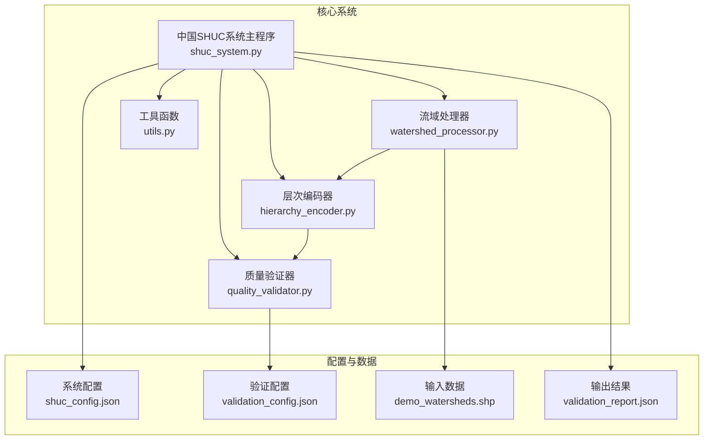
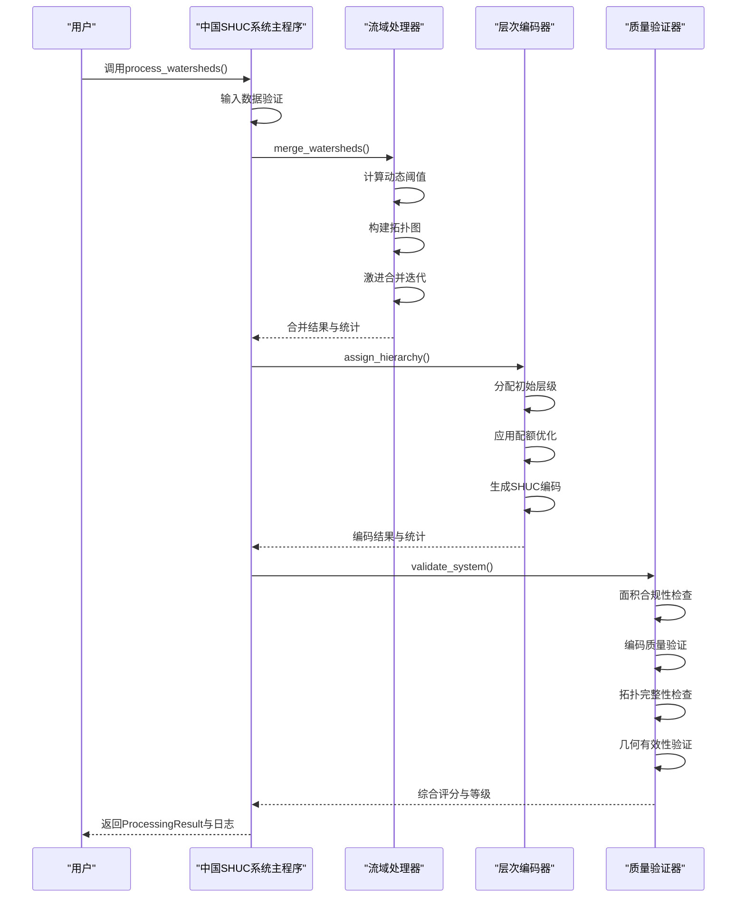
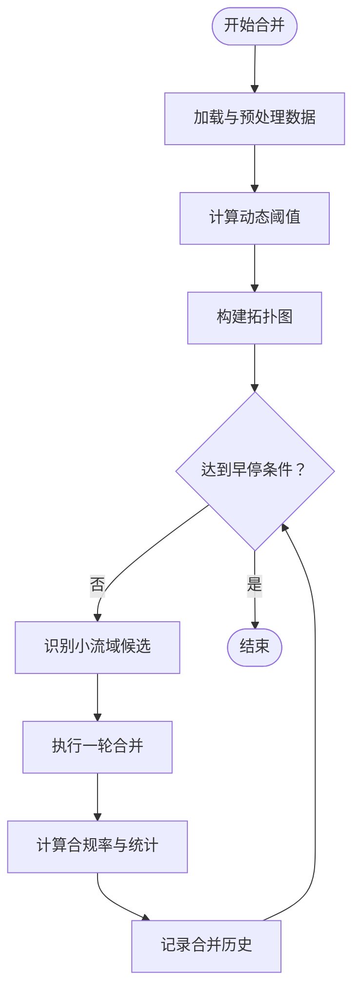
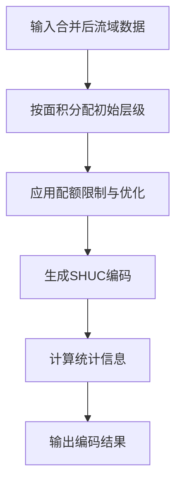
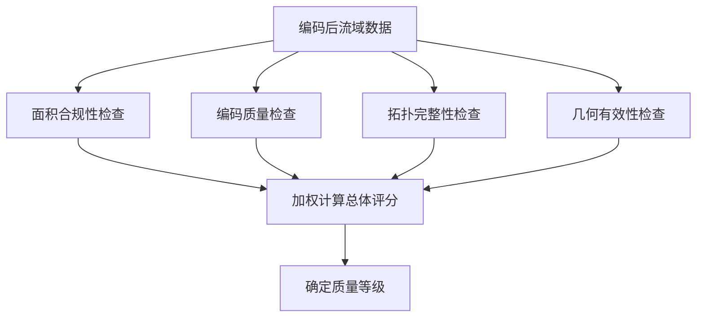
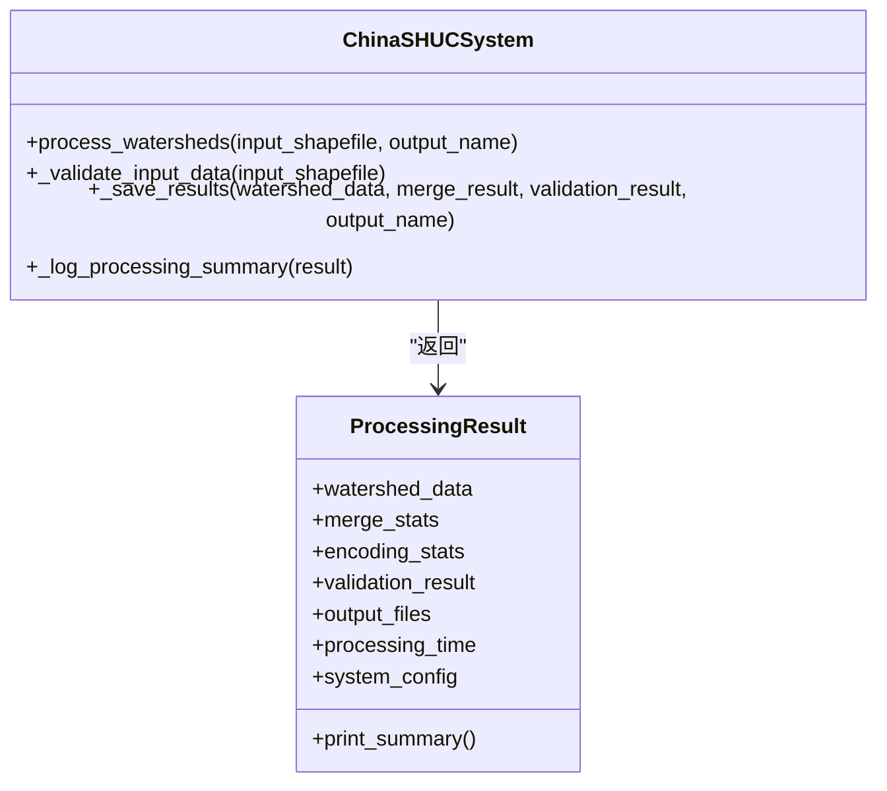
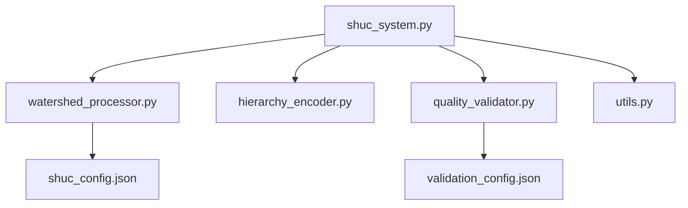

# WRR算法论文

<cite>
**本文引用的文件**
- [README.md](file://README.md)
- [shuc_system.py](file://01_CORE_SYSTEM/src/shuc_system.py)
- [watershed_processor.py](file://01_CORE_SYSTEM/src/watershed_processor.py)
- [hierarchy_encoder.py](file://01_CORE_SYSTEM/src/hierarchy_encoder.py)
- [quality_validator.py](file://01_CORE_SYSTEM/src/quality_validator.py)
- [utils.py](file://01_CORE_SYSTEM/src/utils.py)
- [shuc_config.json](file://01_CORE_SYSTEM/config/shuc_config.json)
- [validation_config.json](file://01_CORE_SYSTEM/config/validation_config.json)
- [system_validation.json](file://04_EXPERIMENTS/results/final_output/system_validation.json)
- [ALGORITHM_PAPER_STRATEGY.md](file://00_ARCHIVE/legacy_documentation/ALGORITHM_PAPER_STRATEGY.md)
- [IMPLEMENTATION_GUIDE.md](file://02_DOCUMENTATION/IMPLEMENTATION_GUIDE.md)
- [distributed_shuc_framework.py](file://03_EXTENSIONS/distributed_shuc_framework.py)
- [optimization_comparison_report.md](file://00_ARCHIVE/legacy_documentation/optimization_comparison_report.md)
</cite>

## 目录
1. [引言](#引言)
2. [项目结构](#项目结构)
3. [核心组件](#核心组件)
4. [架构总览](#架构总览)
5. [详细组件分析](#详细组件分析)
6. [依赖关系分析](#依赖关系分析)
7. [性能考量](#性能考量)
8. [故障排查指南](#故障排查指南)
9. [结论](#结论)
10. [附录](#附录)

## 引言
本文件面向WRR（Water Resources Research）算法论文的撰写与发表，结合中国SHUC（中国流域分级统一编码）系统的完整实现与实验结果，系统阐述算法论文的结构框架、写作规范、图表制作与可视化、同行评议标准与发表流程。项目采用“数据论文（ESSD）+ 算法论文（WRR）”的双轨策略，其中WRR论文聚焦于动态阈值自适应算法、拓扑保持的智能合并框架与大尺度DEM无缝处理等三大创新点，辅以严谨的对比实验、敏感性分析与性能评估。

## 项目结构
项目采用模块化架构，围绕“数据预处理—智能合并—层次编码—质量验证—结果输出”的主流程组织代码与实验。核心模块包括：
- 中国SHUC系统主程序：协调各子模块，封装处理流程与结果输出
- 流域处理器：实现动态阈值计算、拓扑图构建与激进合并策略
- 层次编码器：基于面积的智能分级与SHUC编码生成
- 质量验证器：多维度质量评估与综合评分
- 工具函数：配置管理、日志、文件操作与辅助验证

**图表来源**
- [shuc_system.py:92-164](file://01_CORE_SYSTEM/src/shuc_system.py#L92-L164)
- [watershed_processor.py:54-81](file://01_CORE_SYSTEM/src/watershed_processor.py#L54-L81)
- [hierarchy_encoder.py:69-95](file://01_CORE_SYSTEM/src/hierarchy_encoder.py#L69-L95)
- [quality_validator.py:61-86](file://01_CORE_SYSTEM/src/quality_validator.py#L61-L86)
- [utils.py:64-99](file://01_CORE_SYSTEM/src/utils.py#L64-L99)

**章节来源**
- [README.md:19-30](file://README.md#L19-L30)
- [shuc_system.py:43-91](file://01_CORE_SYSTEM/src/shuc_system.py#L43-L91)

## 核心组件
- 中国SHUC系统主程序：负责整体流程编排、日志记录、结果保存与处理摘要输出，提供统一的处理接口与结果对象。
- 流域处理器：实现动态阈值自适应算法、拓扑图构建与激进合并策略，支持早停条件与合并历史追踪。
- 层次编码器：基于面积阈值的智能分级与SHUC编码生成，支持配额优化与统计分析。
- 质量验证器：多维度质量评估（面积合规、编码唯一性、拓扑完整性、几何有效性），并给出综合评分与等级。
- 工具函数：配置加载与合并、日志设置、文件验证、结果导出与系统信息打印。

**章节来源**
- [shuc_system.py:92-164](file://01_CORE_SYSTEM/src/shuc_system.py#L92-L164)
- [watershed_processor.py:117-141](file://01_CORE_SYSTEM/src/watershed_processor.py#L117-L141)
- [hierarchy_encoder.py:69-95](file://01_CORE_SYSTEM/src/hierarchy_encoder.py#L69-L95)
- [quality_validator.py:61-86](file://01_CORE_SYSTEM/src/quality_validator.py#L61-L86)
- [utils.py:64-99](file://01_CORE_SYSTEM/src/utils.py#L64-L99)

## 架构总览
WRR算法论文应围绕“总体框架—动态阈值自适应—拓扑保持合并—大尺度DEM无缝处理—复杂度分析”展开。系统采用模块化设计，通过配置文件控制处理策略与验证阈值，保证可扩展性与可复现性。

**图表来源**
- [shuc_system.py:92-164](file://01_CORE_SYSTEM/src/shuc_system.py#L92-L164)
- [watershed_processor.py:54-81](file://01_CORE_SYSTEM/src/watershed_processor.py#L54-L81)
- [hierarchy_encoder.py:69-95](file://01_CORE_SYSTEM/src/hierarchy_encoder.py#L69-L95)
- [quality_validator.py:61-86](file://01_CORE_SYSTEM/src/quality_validator.py#L61-L86)

## 详细组件分析

### 流域处理器（动态阈值与智能合并）
- 动态阈值计算：基于面积分布的分位数计算，公式为阈值 = Q75 + (Q90 - Q75)/2，并约束在合理范围，确保对不同区域的自适应性。
- 拓扑图构建：以LINKNO为节点，DSLINKNO1为边，维护上下游关系，保证合并过程中的拓扑一致性。
- 激进合并策略：优先合并面积较小的流域，按下游→上游→相邻→最近的优先级寻找合并目标，支持早停条件与迭代统计。

**图表来源**
- [watershed_processor.py:117-141](file://01_CORE_SYSTEM/src/watershed_processor.py#L117-L141)
- [watershed_processor.py:164-220](file://01_CORE_SYSTEM/src/watershed_processor.py#L164-L220)

**章节来源**
- [watershed_processor.py:54-81](file://01_CORE_SYSTEM/src/watershed_processor.py#L54-L81)
- [watershed_processor.py:117-141](file://01_CORE_SYSTEM/src/watershed_processor.py#L117-L141)
- [watershed_processor.py:164-220](file://01_CORE_SYSTEM/src/watershed_processor.py#L164-L220)

### 层次编码器（智能分级与编码生成）
- 基于面积的初始层级分配：从高级别到低级别逐级判断，确保大流域优先分配到更高级别。
- 配额优化：对4级与5级设定配额上限，超出时将多余流域降级，保证层次结构的合理性与多样性。
- 编码生成：按级别分配编码，确保唯一性与格式规范，并统计各级别的面积分布与占比。

**图表来源**
- [hierarchy_encoder.py:69-95](file://01_CORE_SYSTEM/src/hierarchy_encoder.py#L69-L95)
- [hierarchy_encoder.py:113-138](file://01_CORE_SYSTEM/src/hierarchy_encoder.py#L113-L138)
- [hierarchy_encoder.py:140-169](file://01_CORE_SYSTEM/src/hierarchy_encoder.py#L140-L169)

**章节来源**
- [hierarchy_encoder.py:69-95](file://01_CORE_SYSTEM/src/hierarchy_encoder.py#L69-L95)
- [hierarchy_encoder.py:113-138](file://01_CORE_SYSTEM/src/hierarchy_encoder.py#L113-L138)
- [hierarchy_encoder.py:140-169](file://01_CORE_SYSTEM/src/hierarchy_encoder.py#L140-L169)

### 质量验证器（多维评估与综合评分）
- 面积合规性：计算动态阈值并统计合规率，提供面积分布统计与阈值分析。
- 编码质量：检查编码唯一性、格式正确性与重复情况。
- 拓扑完整性：验证上下游引用的有效性、孤儿节点与环引用，计算完整性比率。
- 几何有效性：统计几何有效性、空几何与几何类型分布。
- 综合评分：按权重计算总体评分并给出质量等级。

**图表来源**
- [quality_validator.py:61-86](file://01_CORE_SYSTEM/src/quality_validator.py#L61-L86)
- [quality_validator.py:100-122](file://01_CORE_SYSTEM/src/quality_validator.py#L100-L122)
- [quality_validator.py:142-168](file://01_CORE_SYSTEM/src/quality_validator.py#L142-L168)
- [quality_validator.py:191-223](file://01_CORE_SYSTEM/src/quality_validator.py#L191-L223)
- [quality_validator.py:255-284](file://01_CORE_SYSTEM/src/quality_validator.py#L255-L284)
- [quality_validator.py:368-400](file://01_CORE_SYSTEM/src/quality_validator.py#L368-L400)

**章节来源**
- [quality_validator.py:61-86](file://01_CORE_SYSTEM/src/quality_validator.py#L61-L86)
- [quality_validator.py:100-122](file://01_CORE_SYSTEM/src/quality_validator.py#L100-L122)
- [quality_validator.py:142-168](file://01_CORE_SYSTEM/src/quality_validator.py#L142-L168)
- [quality_validator.py:191-223](file://01_CORE_SYSTEM/src/quality_validator.py#L191-L223)
- [quality_validator.py:255-284](file://01_CORE_SYSTEM/src/quality_validator.py#L255-L284)
- [quality_validator.py:368-400](file://01_CORE_SYSTEM/src/quality_validator.py#L368-L400)

### 中国SHUC系统主程序（流程编排与结果输出）
- 输入验证：检查文件存在性、数据有效性与必需字段。
- 处理流程：依次执行数据验证、智能合并、层次编码、质量验证与结果保存。
- 结果封装：返回ProcessingResult对象，包含处理结果、统计信息与输出文件路径。
- 日志与统计：记录处理摘要，便于论文撰写与审稿。

**图表来源**
- [shuc_system.py:92-164](file://01_CORE_SYSTEM/src/shuc_system.py#L92-L164)
- [shuc_system.py:251-286](file://01_CORE_SYSTEM/src/shuc_system.py#L251-L286)

**章节来源**
- [shuc_system.py:92-164](file://01_CORE_SYSTEM/src/shuc_system.py#L92-L164)
- [shuc_system.py:165-196](file://01_CORE_SYSTEM/src/shuc_system.py#L165-L196)
- [shuc_system.py:198-237](file://01_CORE_SYSTEM/src/shuc_system.py#L198-L237)
- [shuc_system.py:239-249](file://01_CORE_SYSTEM/src/shuc_system.py#L239-L249)

### 分布式扩展框架（可选）
系统提供分布式处理框架原型，支持大规模数据的并行处理与GPU加速，包含任务调度、节点管理与容错恢复机制，为未来全国范围的百万级流域处理奠定基础。

**章节来源**
- [distributed_shuc_framework.py:1-200](file://03_EXTENSIONS/distributed_shuc_framework.py#L1-L200)

## 依赖关系分析
- 组件耦合：中国SHUC系统主程序聚合各子模块，耦合度适中；各子模块职责清晰，内聚性强。
- 外部依赖：依赖GeoPandas、Shapely、NetworkX、NumPy等空间与图计算库，保证算法实现的稳定性与可移植性。
- 配置驱动：通过JSON配置文件控制处理策略与验证阈值，便于实验对比与参数敏感性分析。

**图表来源**
- [shuc_system.py:77-79](file://01_CORE_SYSTEM/src/shuc_system.py#L77-L79)
- [shuc_config.json:1-43](file://01_CORE_SYSTEM/config/shuc_config.json#L1-L43)
- [validation_config.json:1-46](file://01_CORE_SYSTEM/config/validation_config.json#L1-L46)

**章节来源**
- [shuc_system.py:77-79](file://01_CORE_SYSTEM/src/shuc_system.py#L77-L79)
- [shuc_config.json:1-43](file://01_CORE_SYSTEM/config/shuc_config.json#L1-L43)
- [validation_config.json:1-46](file://01_CORE_SYSTEM/config/validation_config.json#L1-L46)

## 性能考量
- 动态阈值自适应：通过分位数计算实现对数据分布的自适应调整，避免固定阈值导致的低合规率。
- 激进合并策略：优先处理小流域，提升合并效率与合规率达成速度，支持早停条件防止过度合并。
- 拓扑保持：在合并过程中更新上游引用，确保拓扑关系的一致性与完整性。
- 复杂度分析：算法整体复杂度与数据规模、合并轮次与拓扑图操作相关，可通过参数调节与并行化进一步优化。

**章节来源**
- [watershed_processor.py:117-141](file://01_CORE_SYSTEM/src/watershed_processor.py#L117-L141)
- [watershed_processor.py:164-220](file://01_CORE_SYSTEM/src/watershed_processor.py#L164-L220)
- [optimization_comparison_report.md:13-29](file://00_ARCHIVE/legacy_documentation/optimization_comparison_report.md#L13-L29)

## 故障排查指南
- 输入数据问题：检查shapefile是否存在、几何字段是否存在、CRS与范围是否有效。
- 合并异常：关注拓扑更新失败、无效几何修复与合并历史记录，定位问题节点。
- 验证失败：查看面积合规率、编码唯一性、拓扑完整性与几何有效性指标，针对性调整阈值或策略。
- 日志与统计：利用系统日志与处理摘要，快速定位错误环节与性能瓶颈。

**章节来源**
- [utils.py:159-221](file://01_CORE_SYSTEM/src/utils.py#L159-L221)
- [watershed_processor.py:354-366](file://01_CORE_SYSTEM/src/watershed_processor.py#L354-L366)
- [quality_validator.py:334-366](file://01_CORE_SYSTEM/src/quality_validator.py#L334-L366)
- [shuc_system.py:239-249](file://01_CORE_SYSTEM/src/shuc_system.py#L239-L249)

## 结论
WRR算法论文应突出三大创新点：动态阈值自适应算法、拓扑保持的智能合并框架与大尺度DEM无缝处理。通过严谨的对比实验、敏感性分析与性能评估，结合系统化的图表与可视化展示，能够有效支撑算法的创新性与实用性论证。建议采用“数据论文（ESSD）+ 算法论文（WRR）”的双轨策略，先发表数据论文提供高质量数据基础，再以算法论文验证方法的优越性与理论贡献。

## 附录

### 算法论文结构与写作要点
- 引言：阐述流域合并的重要性、现有方法局限与本研究目标。
- 方法论：总体框架、动态阈值自适应算法、拓扑保持合并、大尺度DEM处理、复杂度分析。
- 实验设计：研究区与数据、对比方法、评估指标、实验设计与敏感性分析。
- 结果与讨论：合并效果、对比分析、敏感性分析、参数指导与局限性。
- 结论：总结贡献、对领域的推动作用与未来方向。

**章节来源**
- [ALGORITHM_PAPER_STRATEGY.md:235-330](file://00_ARCHIVE/legacy_documentation/ALGORITHM_PAPER_STRATEGY.md#L235-L330)

### 实验设计与对比分析
- 静态阈值对比：80、100、120 km²阈值实验，评估面积合规率、压缩率与拓扑错误数。
- 动态阈值实验：基于分位数的自适应阈值，记录阈值变化与合并过程。
- 敏感性分析：不同分位数参数、早停条件与最大迭代次数的影响。

**章节来源**
- [IMPLEMENTATION_GUIDE.md:304-353](file://02_DOCUMENTATION/IMPLEMENTATION_GUIDE.md#L304-L353)
- [IMPLEMENTATION_GUIDE.md:514-527](file://02_DOCUMENTATION/IMPLEMENTATION_GUIDE.md#L514-L527)

### 图表制作与可视化最佳实践
- 算法框架图：清晰展示总体流程与三大创新点。
- 动态阈值流程图：可视化阈值计算与响应模型。
- 合并策略示意图：展示下游→上游→相邻→最近的优先级。
- 收敛曲线与性能对比柱状图：直观呈现算法效率与对比结果。
- 敏感性热图：展示参数变化对性能的影响。

**章节来源**
- [ALGORITHM_PAPER_STRATEGY.md:315-329](file://00_ARCHIVE/legacy_documentation/ALGORITHM_PAPER_STRATEGY.md#L315-L329)

### 同行评议标准与发表流程
- 期刊选择：WRR（方法论）、Computers & Geosciences（技术方法）、SoftwareX（软件工具）。
- 引用关系：算法论文引用数据论文作为输入数据基础。
- 发表时间线：数据论文先行（3个月），算法论文随后（5个月），并行推进以缩短总周期。

**章节来源**
- [ALGORITHM_PAPER_STRATEGY.md:97-233](file://00_ARCHIVE/legacy_documentation/ALGORITHM_PAPER_STRATEGY.md#L97-L233)
- [ALGORITHM_PAPER_STRATEGY.md:332-416](file://00_ARCHIVE/legacy_documentation/ALGORITHM_PAPER_STRATEGY.md#L332-L416)

### 写作模板与学术规范
- 结构模板：引言—方法论—实验设计—结果与讨论—结论。
- 图表模板：算法框架图、流程图、对比柱状图、收敛曲线、敏感性热图。
- 引用模板：遵循目标期刊格式，数据论文与算法论文相互引用。
- 配置与参数：在论文中明确列出关键参数与阈值设置，便于复现。

**章节来源**
- [ALGORITHM_PAPER_STRATEGY.md:235-330](file://00_ARCHIVE/legacy_documentation/ALGORITHM_PAPER_STRATEGY.md#L235-L330)
- [shuc_config.json:1-43](file://01_CORE_SYSTEM/config/shuc_config.json#L1-L43)
- [validation_config.json:1-46](file://01_CORE_SYSTEM/config/validation_config.json#L1-L46)