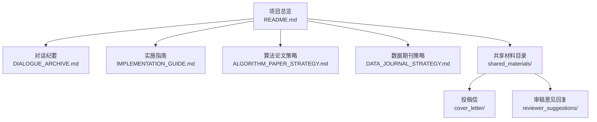
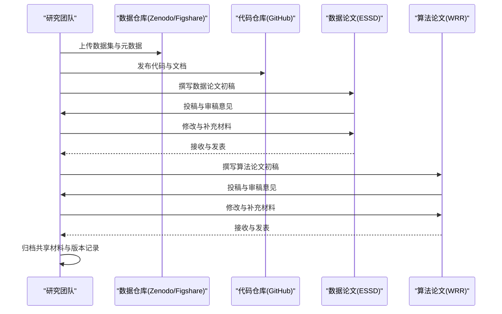
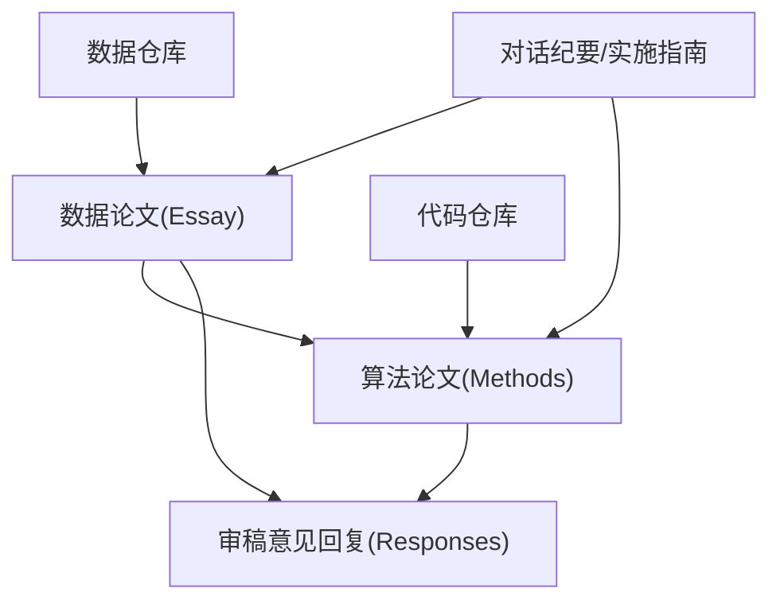

# 共享材料

<cite>
**本文引用的文件**
- [README.md](file://README.md)
- [DIALOGUE_ARCHIVE.md](file://02_DOCUMENTATION/DIALOGUE_ARCHIVE.md)
- [IMPLEMENTATION_GUIDE.md](file://02_DOCUMENTATION/IMPLEMENTATION_GUIDE.md)
- [ALGORITHM_PAPER_STRATEGY.md](file://00_ARCHIVE/legacy_documentation/ALGORITHM_PAPER_STRATEGY.md)
- [DATA_JOURNAL_STRATEGY.md](file://00_ARCHIVE/legacy_documentation/DATA_JOURNAL_STRATEGY.md)
- [shared_materials/cover_letter](file://06_PUBLICATIONS/shared_materials/cover_letter)
- [shared_materials/reviewer_suggestions](file://06_PUBLICATIONS/shared_materials/reviewer_suggestions)
</cite>

## 目录
1. [引言](#引言)
2. [项目结构](#项目结构)
3. [核心组件](#核心组件)
4. [架构总览](#架构总览)
5. [详细组件分析](#详细组件分析)
6. [依赖分析](#依赖分析)
7. [性能考虑](#性能考虑)
8. [故障排除指南](#故障排除指南)
9. [结论](#结论)
10. [附录](#附录)

## 引言
本文件围绕“共享材料”主题，系统梳理中国流域分级统一编码系统（SHUC）在论文发表过程中产生的各类共享材料，包括投稿信、审稿人意见回复、数据论文与算法论文的配套材料、以及版本控制与归档管理方法。文档旨在帮助研究团队高效准备与管理共享材料，规范学术交流中的沟通与礼仪，确保发表流程顺畅、可追溯、可复现。

## 项目结构
项目采用“双轨发表策略”，即数据论文（ESSD）与算法论文（WRR）协同推进，形成“数据—方法—应用”的完整学术链条。共享材料贯穿于数据准备、论文撰写、投稿与审稿全过程，并通过版本控制与归档机制保障可追溯性与可复现性。

**图示来源**
- [README.md:1-88](file://README.md#L1-L88)
- [DIALOGUE_ARCHIVE.md:1-468](file://02_DOCUMENTATION/DIALOGUE_ARCHIVE.md#L1-L468)
- [IMPLEMENTATION_GUIDE.md:1-1054](file://02_DOCUMENTATION/IMPLEMENTATION_GUIDE.md#L1-L1054)
- [ALGORITHM_PAPER_STRATEGY.md:1-654](file://00_ARCHIVE/legacy_documentation/ALGORITHM_PAPER_STRATEGY.md#L1-L654)
- [DATA_JOURNAL_STRATEGY.md:1-452](file://00_ARCHIVE/legacy_documentation/DATA_JOURNAL_STRATEGY.md#L1-L452)

**章节来源**
- [README.md:19-88](file://README.md#L19-L88)
- [DIALOGUE_ARCHIVE.md:64-136](file://02_DOCUMENTATION/DIALOGUE_ARCHIVE.md#L64-L136)

## 核心组件
- 投稿信（Cover Letter）
  - 作用：向编辑部简要介绍研究价值、创新点与数据论文/算法论文的互补关系；声明数据可用性与代码可获取性；推荐/回避审稿人信息。
  - 来源：共享材料目录下的 cover_letter 子目录。
- 审稿人意见回复（Reviewer Suggestions）
  - 作用：逐条回应审稿意见，提供修改说明、补充材料与证据；保持礼貌、清晰、可追踪。
  - 来源：共享材料目录下的 reviewer_suggestions 子目录。
- 数据论文配套材料
  - 包括：数据集描述、方法流程、技术验证、使用说明、代码可用性等。
  - 来源：数据期刊策略文档与实施指南。
- 算法论文配套材料
  - 包括：方法学框架、对比实验、性能分析、图表与补充材料。
  - 来源：算法论文策略文档与实施指南。
- 版本控制与归档
  - 通过 Zenodo/Figshare 数据仓库、GitHub 代码仓库、内部归档目录实现版本化管理与长期保存。
  - 来源：实施指南与数据期刊策略文档。

**章节来源**
- [IMPLEMENTATION_GUIDE.md:641-671](file://02_DOCUMENTATION/IMPLEMENTATION_GUIDE.md#L641-L671)
- [DATA_JOURNAL_STRATEGY.md:291-361](file://00_ARCHIVE/legacy_documentation/DATA_JOURNAL_STRATEGY.md#L291-L361)
- [ALGORITHM_PAPER_STRATEGY.md:373-415](file://00_ARCHIVE/legacy_documentation/ALGORITHM_PAPER_STRATEGY.md#L373-L415)

## 架构总览
共享材料的生命周期由“准备—撰写—提交—审稿—修改—归档”构成，各阶段材料相互关联、互为支撑。

**图示来源**
- [IMPLEMENTATION_GUIDE.md:531-800](file://02_DOCUMENTATION/IMPLEMENTATION_GUIDE.md#L531-L800)
- [DATA_JOURNAL_STRATEGY.md:331-361](file://00_ARCHIVE/legacy_documentation/DATA_JOURNAL_STRATEGY.md#L331-L361)
- [ALGORITHM_PAPER_STRATEGY.md:373-415](file://00_ARCHIVE/legacy_documentation/ALGORITHM_PAPER_STRATEGY.md#L373-L415)

## 详细组件分析

### 投稿信（Cover Letter）
- 内容要点
  - 研究背景与创新性：强调 SHUC 数据集的高质量与标准化价值，以及与算法论文的互补关系。
  - 数据可用性：提供数据仓库链接与 DOI，说明数据格式、元数据与使用许可。
  - 代码可获取性：提供代码仓库链接与安装说明。
  - 推荐/回避审稿人：列出建议与回避名单及理由。
- 格式与提交
  - PDF 格式随主文档与补充材料一并提交。
  - 提交系统：根据目标期刊要求登录相应投稿系统。
- 示例路径
  - [共享材料目录：cover_letter](file://06_PUBLICATIONS/shared_materials/cover_letter)

**章节来源**
- [IMPLEMENTATION_GUIDE.md:641-671](file://02_DOCUMENTATION/IMPLEMENTATION_GUIDE.md#L641-L671)
- [DATA_JOURNAL_STRATEGY.md:331-361](file://00_ARCHIVE/legacy_documentation/DATA_JOURNAL_STRATEGY.md#L331-L361)

### 审稿人意见回复（Reviewer Suggestions）
- 回复流程
  - 逐条编号回应每一条审稿意见，明确修改位置与依据。
  - 提供补充图表、数据或文字说明，必要时附上修订前后对比。
  - 保持礼貌与专业，避免争辩，聚焦事实与证据。
- 材料组织
  - 建议按审稿人编号与意见序号建立目录，便于交叉引用与审计。
  - 与修改稿同步提交，确保可追溯。
- 示例路径
  - [共享材料目录：reviewer_suggestions](file://06_PUBLICATIONS/shared_materials/reviewer_suggestions)

**章节来源**
- [IMPLEMENTATION_GUIDE.md:608-637](file://02_DOCUMENTATION/IMPLEMENTATION_GUIDE.md#L608-L637)
- [ALGORITHM_PAPER_STRATEGY.md:373-415](file://00_ARCHIVE/legacy_documentation/ALGORITHM_PAPER_STRATEGY.md#L373-L415)

### 数据论文配套材料
- 数据集描述
  - 数据来源、处理流程、质量控制、文件格式与字段说明。
  - 参考数据期刊（如 ESSD）的论文结构与模板。
- 技术验证
  - 与现有数据集（如 HydroSHEDS、MERIT Hydro）的对比分析。
  - 不确定性分析与误差来源说明。
- 使用说明与代码可用性
  - 使用示例、API 文档、依赖与安装说明。
  - 代码仓库链接与版本标签。
- 示例路径
  - [数据期刊策略文档:206-272](file://00_ARCHIVE/legacy_documentation/DATA_JOURNAL_STRATEGY.md#L206-L272)
  - [实施指南：数据准备与上传:137-302](file://02_DOCUMENTATION/IMPLEMENTATION_GUIDE.md#L137-L302)

**章节来源**
- [DATA_JOURNAL_STRATEGY.md:206-272](file://00_ARCHIVE/legacy_documentation/DATA_JOURNAL_STRATEGY.md#L206-L272)
- [IMPLEMENTATION_GUIDE.md:137-302](file://02_DOCUMENTATION/IMPLEMENTATION_GUIDE.md#L137-L302)

### 算法论文配套材料
- 方法学框架
  - 动态阈值自适应算法、拓扑保持的智能合并、大尺度 DEM 处理。
- 对比实验与性能分析
  - 静态阈值 vs 动态阈值、贪婪合并 vs 智能合并、敏感性分析。
- 图表与补充材料
  - 算法流程图、收敛曲线、性能对比图、参数热图等。
- 示例路径
  - [算法论文策略文档:235-330](file://00_ARCHIVE/legacy_documentation/ALGORITHM_PAPER_STRATEGY.md#L235-L330)
  - [实施指南：算法论文撰写与实验:675-800](file://02_DOCUMENTATION/IMPLEMENTATION_GUIDE.md#L675-800)

**章节来源**
- [ALGORITHM_PAPER_STRATEGY.md:235-330](file://00_ARCHIVE/legacy_documentation/ALGORITHM_PAPER_STRATEGY.md#L235-L330)
- [IMPLEMENTATION_GUIDE.md:675-800](file://02_DOCUMENTATION/IMPLEMENTATION_GUIDE.md#L675-L800)

### 版本控制与归档管理
- 数据仓库
  - Zenodo/Figshare：上传数据集、生成 DOI、维护元数据。
  - GitHub：发布代码、版本标签、发布说明。
- 内部归档
  - 00_ARCHIVE：历史版本、旧代码、参考资料与对话纪要。
  - 06_PUBLICATIONS/shared_materials：共享材料（cover_letter、reviewer_suggestions）。
- 版本命名与标签
  - 数据集：china_shuc_dataset_vX.Y.Z
  - 代码：vX.Y.Z
- 示例路径
  - [实施指南：数据准备与上传:137-302](file://02_DOCUMENTATION/IMPLEMENTATION_GUIDE.md#L137-302)
  - [项目总览：目录结构:19-30](file://README.md#L19-L30)

**章节来源**
- [IMPLEMENTATION_GUIDE.md:137-302](file://02_DOCUMENTATION/IMPLEMENTATION_GUIDE.md#L137-L302)
- [README.md:19-30](file://README.md#L19-L30)

## 依赖分析
- 内容依赖
  - 算法论文依赖数据论文提供的数据集与引用关系。
  - 审稿意见回复依赖论文初稿与修改记录。
- 工具依赖
  - 数据仓库（Zenodo/Figshare）、代码仓库（GitHub）、期刊投稿系统。
- 人员依赖
  - 用户负责技术准确性与学术规范审阅，AI负责内容撰写与图表生成。

**图示来源**
- [ALGORITHM_PAPER_STRATEGY.md:332-360](file://00_ARCHIVE/legacy_documentation/ALGORITHM_PAPER_STRATEGY.md#L332-L360)
- [IMPLEMENTATION_GUIDE.md:531-800](file://02_DOCUMENTATION/IMPLEMENTATION_GUIDE.md#L531-L800)

**章节来源**
- [ALGORITHM_PAPER_STRATEGY.md:332-360](file://00_ARCHIVE/legacy_documentation/ALGORITHM_PAPER_STRATEGY.md#L332-L360)
- [IMPLEMENTATION_GUIDE.md:531-800](file://02_DOCUMENTATION/IMPLEMENTATION_GUIDE.md#L531-L800)

## 性能考虑
- 时间管理
  - 数据论文与算法论文并行推进，缩短总周期。
  - 明确里程碑与检查清单，避免返工。
- 资源分配
  - AI 负责撰写与图表生成，用户负责技术审阅与最终决策。
- 质量控制
  - 内部审阅清单与交叉检查，确保逻辑一致与表述准确。

**章节来源**
- [IMPLEMENTATION_GUIDE.md:73-134](file://02_DOCUMENTATION/IMPLEMENTATION_GUIDE.md#L73-L134)
- [ALGORITHM_PAPER_STRATEGY.md:548-590](file://00_ARCHIVE/legacy_documentation/ALGORITHM_PAPER_STRATEGY.md#L548-L590)

## 故障排除指南
- 常见问题
  - 审稿意见未逐条回应：导致编辑部退回或延迟决定。
  - 数据仓库链接失效：检查 DOI 与访问权限。
  - 代码版本与数据版本不一致：统一标签与发布说明。
- 处理建议
  - 建立“审稿意见—修改说明—证据材料”的三段式回复模板。
  - 在共享材料目录中维护版本日志与变更摘要。
  - 定期备份与交叉验证（本地+云+归档）。

**章节来源**
- [IMPLEMENTATION_GUIDE.md:608-637](file://02_DOCUMENTATION/IMPLEMENTATION_GUIDE.md#L608-L637)
- [DATA_JOURNAL_STRATEGY.md:331-361](file://00_ARCHIVE/legacy_documentation/DATA_JOURNAL_STRATEGY.md#L331-L361)

## 结论
共享材料是学术发表的“桥梁”，连接数据、方法与应用。通过规范化的材料准备、严格的版本控制与归档管理、以及高效的审稿意见回复流程，研究团队可以在保证质量的前提下，显著提升发表效率与影响力。建议以数据论文与算法论文的“组合拳”为核心路径，辅以严谨的沟通礼仪与版本管理，确保学术交流的透明、可复现与可持续。

## 附录
- 术语
  - 数据论文：以数据集为核心的产品描述论文。
  - 算法论文：以方法创新为核心的学术论文。
  - 审稿意见回复：针对审稿人意见的逐条回应与修改说明。
- 参考路径
  - [项目总览:1-88](file://README.md#L1-L88)
  - [对话纪要:1-468](file://02_DOCUMENTATION/DIALOGUE_ARCHIVE.md#L1-L468)
  - [实施指南:1-1054](file://02_DOCUMENTATION/IMPLEMENTATION_GUIDE.md#L1-L1054)
  - [算法论文策略:1-654](file://00_ARCHIVE/legacy_documentation/ALGORITHM_PAPER_STRATEGY.md#L1-L654)
  - [数据期刊策略:1-452](file://00_ARCHIVE/legacy_documentation/DATA_JOURNAL_STRATEGY.md#L1-L452)