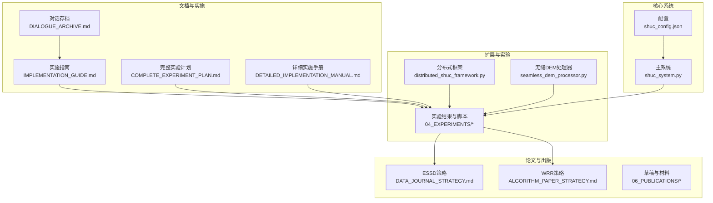
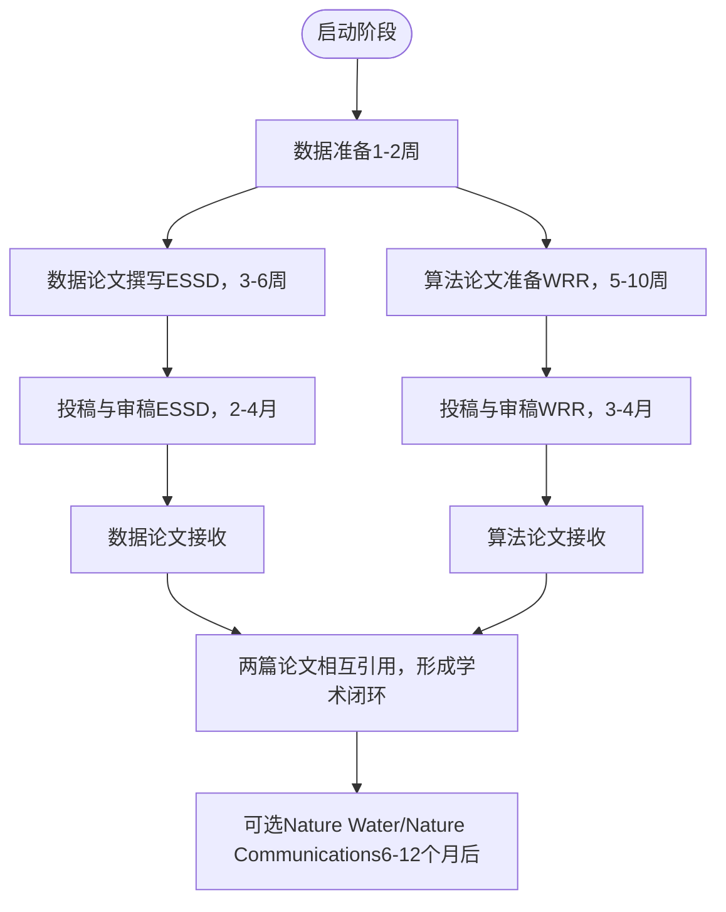
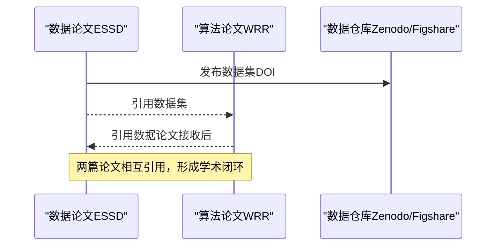
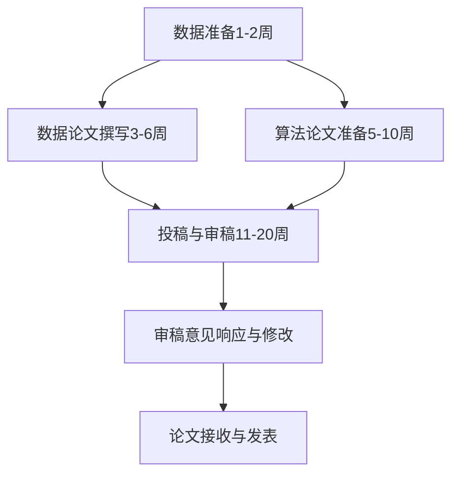
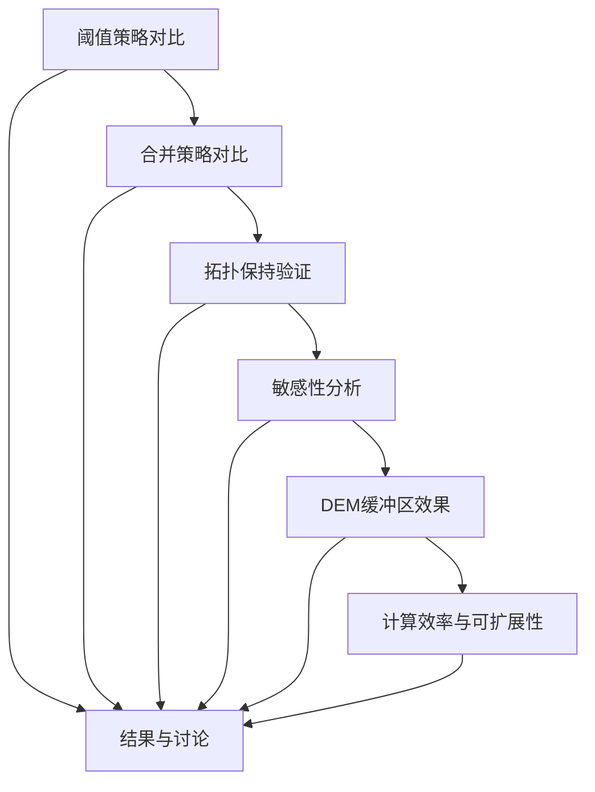
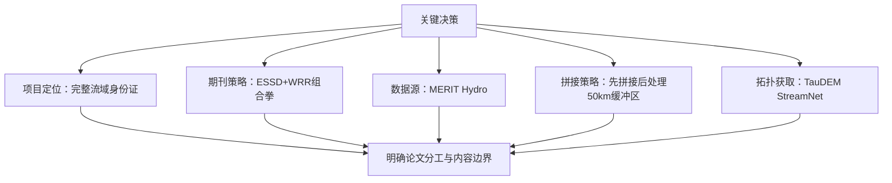
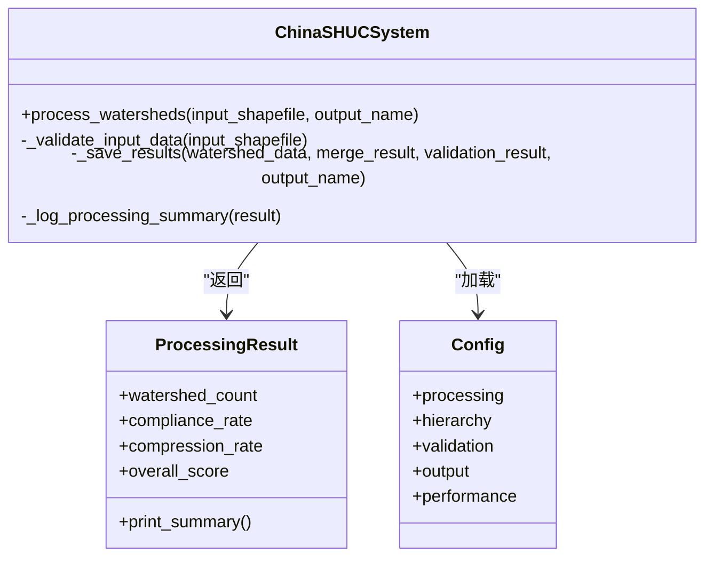
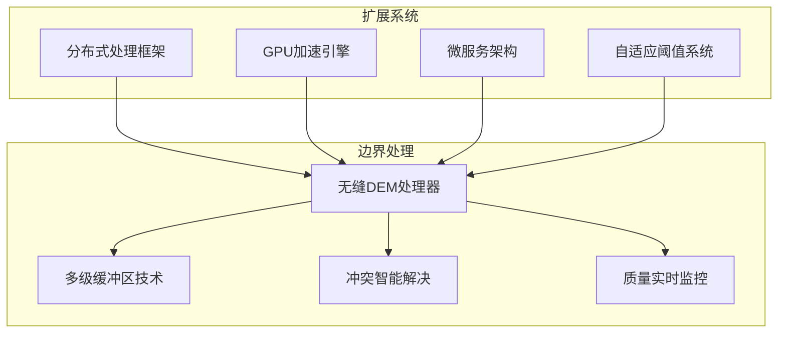
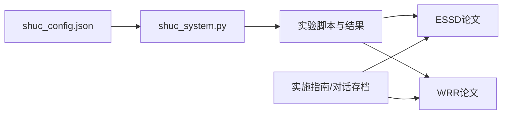

# 学术论文与发表

<cite>
**本文引用的文件**   
- [README.md](file://README.md)
- [DIALOGUE_ARCHIVE.md](file://02_DOCUMENTATION/DIALOGUE_ARCHIVE.md)
- [IMPLEMENTATION_GUIDE.md](file://02_DOCUMENTATION/IMPLEMENTATION_GUIDE.md)
- [DATA_JOURNAL_STRATEGY.md](file://00_ARCHIVE/legacy_documentation/DATA_JOURNAL_STRATEGY.md)
- [ALGORITHM_PAPER_STRATEGY.md](file://00_ARCHIVE/legacy_documentation/ALGORITHM_PAPER_STRATEGY.md)
- [COMPLETE_EXPERIMENT_PLAN.md](file://02_DOCUMENTATION/ARCHIVED_DOCS/COMPLETE_EXPERIMENT_PLAN.md)
- [DETAILED_IMPLEMENTATION_MANUAL.md](file://02_DOCUMENTATION/ARCHIVED_DOCS/DETAILED_IMPLEMENTATION_MANUAL.md)
- [shuc_config.json](file://01_CORE_SYSTEM/config/shuc_config.json)
- [shuc_system.py](file://01_CORE_SYSTEM/src/shuc_system.py)
- [FINAL_SUMMARY.md](file://00_ARCHIVE/legacy_versions/SHUC_FINAL_VERSION/FINAL_SUMMARY.md)
- [comprehensive_project_framework.md](file://00_ARCHIVE/legacy_versions/SHUC_FINAL_VERSION/comprehensive_project_framework.md)
</cite>

## 目录
1. [引言](#引言)
2. [项目结构](#项目结构)
3. [核心组件](#核心组件)
4. [架构总览](#架构总览)
5. [详细组件分析](#详细组件分析)
6. [依赖分析](#依赖分析)
7. [性能考量](#性能考量)
8. [故障排查指南](#故障排查指南)
9. [结论](#结论)
10. [附录](#附录)

## 引言
本文件面向SHUC项目学术论文与发表的综合实践，围绕“双轨发表策略”（ESSD数据论文 + WRR算法论文）给出可落地的实施路径、内容组织、质量控制与时间安排，并结合项目对话存档梳理关键技术决策过程，提供参考文献管理、图表制作与格式规范指引，以及学术交流与同行评议注意事项和知识产权与版权相关信息。

## 项目结构
项目采用模块化与阶段化组织，核心目录与职责如下：
- 01_CORE_SYSTEM：核心算法与系统实现（配置、处理、编码、验证、工具）
- 02_DOCUMENTATION：实施指南、对话存档、归档文档
- 03_EXTENSIONS：扩展功能（分布式处理、无缝DEM处理等）
- 04_EXPERIMENTS：实验设计、脚本与结果
- 05_DATA：数据输入、处理产物与参考数据
- 06_PUBLICATIONS：论文草稿、图表与补充材料

**图表来源**
- [shuc_config.json](file://01_CORE_SYSTEM/config/shuc_config.json)
- [shuc_system.py](file://01_CORE_SYSTEM/src/shuc_system.py)
- [IMPLEMENTATION_GUIDE.md](file://02_DOCUMENTATION/IMPLEMENTATION_GUIDE.md)
- [DIALOGUE_ARCHIVE.md](file://02_DOCUMENTATION/DIALOGUE_ARCHIVE.md)
- [COMPLETE_EXPERIMENT_PLAN.md](file://02_DOCUMENTATION/ARCHIVED_DOCS/COMPLETE_EXPERIMENT_PLAN.md)
- [DETAILED_IMPLEMENTATION_MANUAL.md](file://02_DOCUMENTATION/ARCHIVED_DOCS/DETAILED_IMPLEMENTATION_MANUAL.md)
- [DATA_JOURNAL_STRATEGY.md](file://00_ARCHIVE/legacy_documentation/DATA_JOURNAL_STRATEGY.md)
- [ALGORITHM_PAPER_STRATEGY.md](file://00_ARCHIVE/legacy_documentation/ALGORITHM_PAPER_STRATEGY.md)

**章节来源**
- [README.md:19-30](file://README.md#L19-L30)
- [README.md:49-57](file://README.md#L49-L57)

## 核心组件
- 配置系统：集中管理处理目标、层次结构、验证权重与输出策略
- 主系统：封装数据预处理、智能合并、层次编码与质量验证的完整流程
- 实施指南：按阶段给出数据准备、数据论文撰写、算法论文准备与投稿审稿的可执行清单
- 对话存档：记录项目定位、期刊策略、数据源选择、技术方案与重组决策
- 实验框架：系统化实验设计与IMRaD论文框架，支撑对比实验与结果呈现
- 扩展能力：分布式处理与无缝DEM处理，支撑规模化与边界处理

**章节来源**
- [shuc_config.json:1-43](file://01_CORE_SYSTEM/config/shuc_config.json#L1-L43)
- [shuc_system.py:43-164](file://01_CORE_SYSTEM/src/shuc_system.py#L43-L164)
- [IMPLEMENTATION_GUIDE.md:10-18](file://02_DOCUMENTATION/IMPLEMENTATION_GUIDE.md#L10-L18)
- [DIALOGUE_ARCHIVE.md:10-16](file://02_DOCUMENTATION/DIALOGUE_ARCHIVE.md#L10-L16)
- [COMPLETE_EXPERIMENT_PLAN.md:18-70](file://02_DOCUMENTATION/ARCHIVED_DOCS/COMPLETE_EXPERIMENT_PLAN.md#L18-L70)

## 架构总览
双轨发表策略的系统化实施路径如下：

**图表来源**
- [IMPLEMENTATION_GUIDE.md:137-138](file://02_DOCUMENTATION/IMPLEMENTATION_GUIDE.md#L137-L138)
- [DATA_JOURNAL_STRATEGY.md:291-327](file://00_ARCHIVE/legacy_documentation/DATA_JOURNAL_STRATEGY.md#L291-L327)
- [ALGORITHM_PAPER_STRATEGY.md:373-415](file://00_ARCHIVE/legacy_documentation/ALGORITHM_PAPER_STRATEGY.md#L373-L415)

## 详细组件分析

### 组件A：双轨发表策略与论文定位
- ESSD数据论文：发布China SHUC数据集，强调数据描述、质量指标与文件格式；方法细节在WRR论文详述
- WRR算法论文：聚焦动态阈值自适应算法、拓扑保持智能合并与大尺度DEM处理；引用ESSD数据集
- 组合拳优势：数据论文为算法论文提供数据基础，算法论文验证数据论文实用价值，相互引用提升影响力

**图表来源**
- [DATA_JOURNAL_STRATEGY.md:294-327](file://00_ARCHIVE/legacy_documentation/DATA_JOURNAL_STRATEGY.md#L294-L327)
- [ALGORITHM_PAPER_STRATEGY.md:334-360](file://00_ARCHIVE/legacy_documentation/ALGORITHM_PAPER_STRATEGY.md#L334-L360)

**章节来源**
- [README.md:49-57](file://README.md#L49-L57)
- [DATA_JOURNAL_STRATEGY.md:19-53](file://00_ARCHIVE/legacy_documentation/DATA_JOURNAL_STRATEGY.md#L19-L53)
- [ALGORITHM_PAPER_STRATEGY.md:19-31](file://00_ARCHIVE/legacy_documentation/ALGORITHM_PAPER_STRATEGY.md#L19-L31)

### 组件B：论文实现指南与时间安排
- 阶段划分：数据准备（1-2周）、数据论文撰写（3-6周）、算法论文准备（5-10周）、投稿与审稿（11-20周）
- AI协作工作流：数据论文撰写专家、算法论文撰写专家、应用案例分析专家、实验执行专家协同
- 检查清单与里程碑：明确任务完成度、优先级与预计时间，确保按时交付

**图表来源**
- [IMPLEMENTATION_GUIDE.md:137-138](file://02_DOCUMENTATION/IMPLEMENTATION_GUIDE.md#L137-L138)
- [IMPLEMENTATION_GUIDE.md:531-532](file://02_DOCUMENTATION/IMPLEMENTATION_GUIDE.md#L531-L532)
- [IMPLEMENTATION_GUIDE.md:675-676](file://02_DOCUMENTATION/IMPLEMENTATION_GUIDE.md#L675-L676)

**章节来源**
- [IMPLEMENTATION_GUIDE.md:10-18](file://02_DOCUMENTATION/IMPLEMENTATION_GUIDE.md#L10-L18)
- [IMPLEMENTATION_GUIDE.md:137-138](file://02_DOCUMENTATION/IMPLEMENTATION_GUIDE.md#L137-L138)
- [IMPLEMENTATION_GUIDE.md:531-532](file://02_DOCUMENTATION/IMPLEMENTATION_GUIDE.md#L531-L532)
- [IMPLEMENTATION_GUIDE.md:675-676](file://02_DOCUMENTATION/IMPLEMENTATION_GUIDE.md#L675-L676)

### 组件C：实验设计与IMRaD论文框架
- 实验模块：阈值策略对比、合并策略对比、拓扑保持验证、敏感性分析、DEM缓冲区效果、计算效率与可扩展性
- IMRaD结构：摘要、引言、方法、结果、讨论、结论；WRR论文方法章节为核心（2000-2500词）
- 图表与表格：算法流程图、帕累托前沿、收敛曲线、性能对比柱状图、敏感性热图、拓扑质量指标表

**图表来源**
- [COMPLETE_EXPERIMENT_PLAN.md:22-50](file://02_DOCUMENTATION/ARCHIVED_DOCS/COMPLETE_EXPERIMENT_PLAN.md#L22-L50)
- [COMPLETE_EXPERIMENT_PLAN.md:461-479](file://02_DOCUMENTATION/ARCHIVED_DOCS/COMPLETE_EXPERIMENT_PLAN.md#L461-L479)

**章节来源**
- [COMPLETE_EXPERIMENT_PLAN.md:18-70](file://02_DOCUMENTATION/ARCHIVED_DOCS/COMPLETE_EXPERIMENT_PLAN.md#L18-L70)
- [COMPLETE_EXPERIMENT_PLAN.md:461-479](file://02_DOCUMENTATION/ARCHIVED_DOCS/COMPLETE_EXPERIMENT_PLAN.md#L461-L479)

### 组件D：对话存档与关键技术决策
- 项目定位：从“山地方法”到“流域身份证”，覆盖完整水系与6级12位编码体系
- 期刊策略：ESSD（数据论文）+ WRR（算法论文）组合拳，成功率与影响力兼顾
- 数据源选择：MERIT Hydro + TauDEM StreamNet + Python优化，平衡时间与质量
- 拼接策略：先拼接后处理（50km缓冲区），简化流程、减少边界问题
- 拓扑关系：使用TauDEM StreamNet自动生成USLINKNO/DSLINKNO，准确可靠

**图表来源**
- [DIALOGUE_ARCHIVE.md:19-42](file://02_DOCUMENTATION/DIALOGUE_ARCHIVE.md#L19-L42)
- [DIALOGUE_ARCHIVE.md:64-116](file://02_DOCUMENTATION/DIALOGUE_ARCHIVE.md#L64-L116)
- [DIALOGUE_ARCHIVE.md:139-185](file://02_DOCUMENTATION/DIALOGUE_ARCHIVE.md#L139-L185)
- [DIALOGUE_ARCHIVE.md:210-273](file://02_DOCUMENTATION/DIALOGUE_ARCHIVE.md#L210-L273)

**章节来源**
- [DIALOGUE_ARCHIVE.md:19-42](file://02_DOCUMENTATION/DIALOGUE_ARCHIVE.md#L19-L42)
- [DIALOGUE_ARCHIVE.md:64-116](file://02_DOCUMENTATION/DIALOGUE_ARCHIVE.md#L64-L116)
- [DIALOGUE_ARCHIVE.md:139-185](file://02_DOCUMENTATION/DIALOGUE_ARCHIVE.md#L139-L185)
- [DIALOGUE_ARCHIVE.md:210-273](file://02_DOCUMENTATION/DIALOGUE_ARCHIVE.md#L210-L273)

### 组件E：核心系统与配置
- 配置要点：目标合规率、合并策略、最大迭代、动态阈值模式、层次最小面积、验证权重、输出选项、性能参数
- 主系统流程：输入验证 → 智能合并 → 层次编码 → 质量验证 → 结果保存 → 日志记录
- 输出文件：Shapefile、JSON验证报告、处理统计、日志文件

**图表来源**
- [shuc_system.py:43-164](file://01_CORE_SYSTEM/src/shuc_system.py#L43-L164)
- [shuc_system.py:251-286](file://01_CORE_SYSTEM/src/shuc_system.py#L251-L286)
- [shuc_config.json:1-43](file://01_CORE_SYSTEM/config/shuc_config.json#L1-L43)

**章节来源**
- [shuc_system.py:43-164](file://01_CORE_SYSTEM/src/shuc_system.py#L43-L164)
- [shuc_system.py:251-286](file://01_CORE_SYSTEM/src/shuc_system.py#L251-L286)
- [shuc_config.json:1-43](file://01_CORE_SYSTEM/config/shuc_config.json#L1-L43)

### 组件F：扩展能力与规模化处理
- 分布式处理框架：异步任务调度、多进程并行、GPU加速、微服务架构
- 无缝DEM处理：50km处理缓冲区、多级缓冲区架构、冲突检测与解决、质量实时监控
- 技术突破：解决40+景边界伪影问题，实现全国尺度处理

**图表来源**
- [comprehensive_project_framework.md:71-96](file://00_ARCHIVE/legacy_versions/SHUC_FINAL_VERSION/comprehensive_project_framework.md#L71-L96)
- [comprehensive_project_framework.md:109-107](file://00_ARCHIVE/legacy_versions/SHUC_FINAL_VERSION/comprehensive_project_framework.md#L109-L107)

**章节来源**
- [comprehensive_project_framework.md:71-96](file://00_ARCHIVE/legacy_versions/SHUC_FINAL_VERSION/comprehensive_project_framework.md#L71-L96)
- [comprehensive_project_framework.md:109-107](file://00_ARCHIVE/legacy_versions/SHUC_FINAL_VERSION/comprehensive_project_framework.md#L109-L107)

## 依赖分析
- 组件耦合：主系统依赖配置模块；实验模块依赖核心系统；论文撰写依赖实验结果与文档
- 外部依赖：GeoPandas/Shapely（空间数据处理）、NetworkX（拓扑分析）、Matplotlib/Seaborn（图表）、TauDEM（水文拓扑）
- 依赖关系可视化：

**图表来源**
- [shuc_config.json:1-43](file://01_CORE_SYSTEM/config/shuc_config.json#L1-L43)
- [shuc_system.py:43-164](file://01_CORE_SYSTEM/src/shuc_system.py#L43-L164)
- [IMPLEMENTATION_GUIDE.md:10-18](file://02_DOCUMENTATION/IMPLEMENTATION_GUIDE.md#L10-L18)
- [DIALOGUE_ARCHIVE.md:10-16](file://02_DOCUMENTATION/DIALOGUE_ARCHIVE.md#L10-L16)

**章节来源**
- [shuc_config.json:1-43](file://01_CORE_SYSTEM/config/shuc_config.json#L1-L43)
- [shuc_system.py:43-164](file://01_CORE_SYSTEM/src/shuc_system.py#L43-L164)
- [IMPLEMENTATION_GUIDE.md:10-18](file://02_DOCUMENTATION/IMPLEMENTATION_GUIDE.md#L10-L18)
- [DIALOGUE_ARCHIVE.md:10-16](file://02_DOCUMENTATION/DIALOGUE_ARCHIVE.md#L10-L16)

## 性能考量
- 算法效率：动态阈值自适应、激进合并策略、拓扑保持约束，显著提升合规率与处理效率
- 规模扩展：分布式处理框架支持百万级流域，GPU加速与并行处理缩短全国处理时间
- 质量控制：多维度验证体系（面积合规、编码唯一性、空间完整性、拓扑连通性）

**章节来源**
- [comprehensive_project_framework.md:111-131](file://00_ARCHIVE/legacy_versions/SHUC_FINAL_VERSION/comprehensive_project_framework.md#L111-L131)
- [comprehensive_project_framework.md:176-182](file://00_ARCHIVE/legacy_versions/SHUC_FINAL_VERSION/comprehensive_project_framework.md#L176-L182)
- [FINAL_SUMMARY.md:77-89](file://00_ARCHIVE/legacy_versions/SHUC_FINAL_VERSION/FINAL_SUMMARY.md#L77-L89)

## 故障排查指南
- 输入数据验证：检查Shapefile是否存在、字段是否齐全、几何是否有效
- 处理流程日志：查看processing_log.txt定位异常环节
- 配置参数调整：根据数据分布调整动态阈值、合并策略与迭代次数
- 实验结果核对：对比静态阈值与动态阈值实验结果，确认统计显著性与图表质量

**章节来源**
- [shuc_system.py:165-196](file://01_CORE_SYSTEM/src/shuc_system.py#L165-L196)
- [shuc_system.py:198-237](file://01_CORE_SYSTEM/src/shuc_system.py#L198-L237)
- [shuc_config.json:1-43](file://01_CORE_SYSTEM/config/shuc_config.json#L1-L43)

## 结论
通过双轨发表策略（ESSD数据论文 + WRR算法论文），SHUC项目在6-7个月内可完成两篇高质量论文的撰写与发表，形成数据产品与方法创新的学术闭环。结合系统化的实施指南、实验设计与质量控制，项目可在保证技术质量的同时高效推进学术产出与影响力提升。

## 附录
- 参考文献管理：采用统一引用格式（如Nature格式），在ESSD与WRR论文中分别列出数据集与方法论文引用条目
- 图表制作：遵循期刊图表规范，确保清晰度与可读性；使用一致的颜色与标注风格
- 格式规范：严格遵循目标期刊（ESSD/WRR）的格式要求，包括字数、图表位置、参考文献格式与补充材料
- 学术交流：在学术会议与社交媒体中推广数据集与方法，收集反馈以完善论文与系统
- 知识产权与版权：数据仓库（Zenodo/Figshare）与代码仓库（GitHub）需明确许可证（建议CC BY 4.0与MIT），论文发表需遵守期刊版权政策

**章节来源**
- [DATA_JOURNAL_STRATEGY.md:208-272](file://00_ARCHIVE/legacy_documentation/DATA_JOURNAL_STRATEGY.md#L208-L272)
- [ALGORITHM_PAPER_STRATEGY.md:235-330](file://00_ARCHIVE/legacy_documentation/ALGORITHM_PAPER_STRATEGY.md#L235-L330)
- [README.md:69-72](file://README.md#L69-L72)