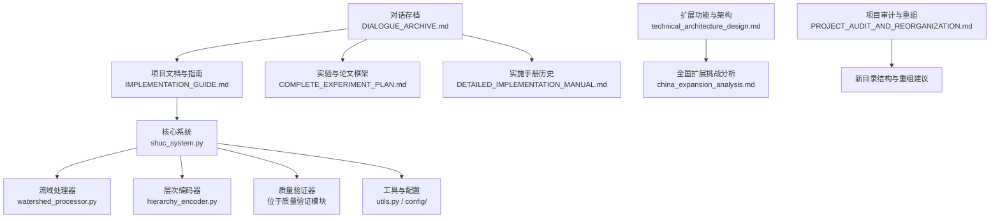
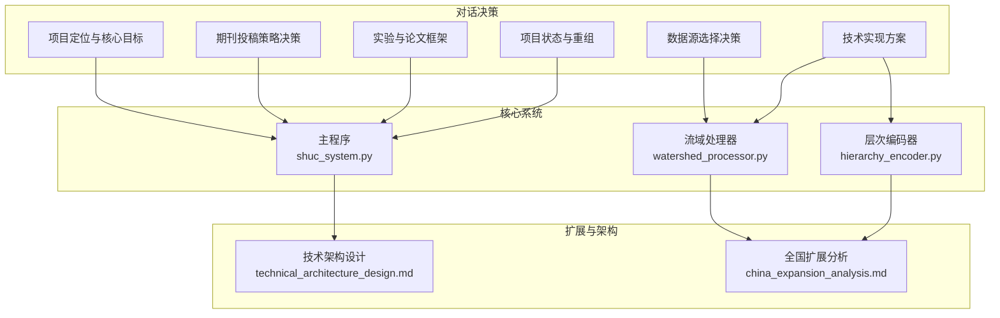
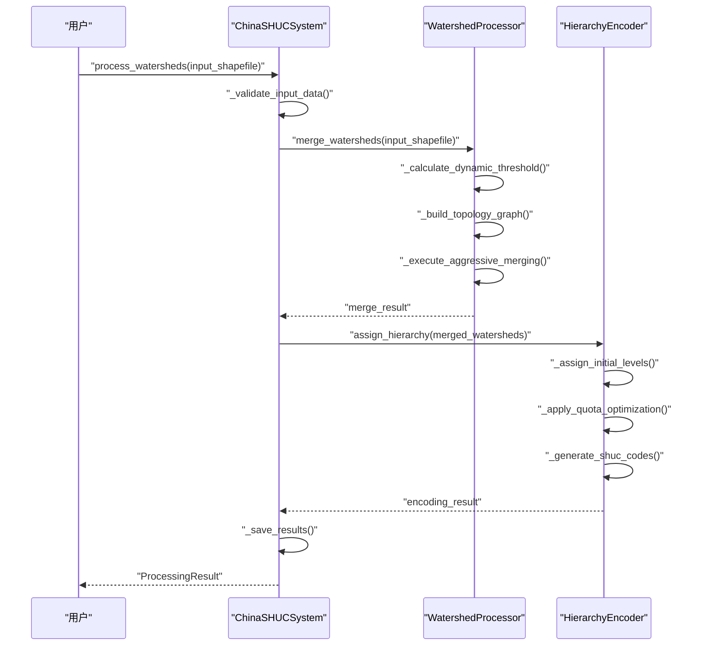
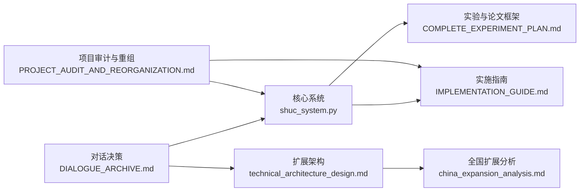

# 对话存档

<cite>
**本文档引用的文件**
- [DIALOGUE_ARCHIVE.md](file://02_DOCUMENTATION/DIALOGUE_ARCHIVE.md)
- [README.md](file://README.md)
- [PROJECT_AUDIT_AND_REORGANIZATION.md](file://00_ARCHIVE/legacy_documentation/PROJECT_AUDIT_AND_REORGANIZATION.md)
- [IMPLEMENTATION_GUIDE.md](file://02_DOCUMENTATION/IMPLEMENTATION_GUIDE.md)
- [COMPLETE_EXPERIMENT_PLAN.md](file://02_DOCUMENTATION/ARCHIVED_DOCS/COMPLETE_EXPERIMENT_PLAN.md)
- [DETAILED_IMPLEMENTATION_MANUAL.md](file://02_DOCUMENTATION/ARCHIVED_DOCS/DETAILED_IMPLEMENTATION_MANUAL.md)
- [china_expansion_analysis.md](file://03_EXTENSIONS/docs/china_expansion_analysis.md)
- [technical_architecture_design.md](file://03_EXTENSIONS/docs/technical_architecture_design.md)
- [shuc_system.py](file://01_CORE_SYSTEM/src/shuc_system.py)
- [watershed_processor.py](file://01_CORE_SYSTEM/src/watershed_processor.py)
- [hierarchy_encoder.py](file://01_CORE_SYSTEM/src/hierarchy_encoder.py)
</cite>

## 目录
1. [引言](#引言)
2. [项目结构](#项目结构)
3. [核心组件](#核心组件)
4. [架构总览](#架构总览)
5. [详细组件分析](#详细组件分析)
6. [依赖关系分析](#依赖关系分析)
7. [性能考量](#性能考量)
8. [故障排查指南](#故障排查指南)
9. [结论](#结论)
10. [附录](#附录)

## 引言
本对话存档文档系统性整理了中国SHUC（中国流域分级统一编码系统）项目在关键阶段的发展历程、技术决策与策略选择，旨在为后续研究、论文撰写与系统维护提供可追溯、可复用的决策依据与经验总结。通过对对话纪要、项目审计与重组方案、实施指南、实验计划、技术架构设计以及核心代码的综合分析，本文件将帮助读者快速把握项目脉络、理解关键对话与决策的背景与影响，并提供分类索引、分析方法与维护策略。

## 项目结构
项目采用模块化与分层结构组织，围绕“对话存档—核心系统—扩展功能—实验与结果—数据—论文”的主线展开，便于在不同阶段聚焦相应职责与产出。

**图表来源**
- [DIALOGUE_ARCHIVE.md:1-468](file://02_DOCUMENTATION/DIALOGUE_ARCHIVE.md#L1-L468)
- [IMPLEMENTATION_GUIDE.md:1-1054](file://02_DOCUMENTATION/IMPLEMENTATION_GUIDE.md#L1-L1054)
- [COMPLETE_EXPERIMENT_PLAN.md:1-1209](file://02_DOCUMENTATION/ARCHIVED_DOCS/COMPLETE_EXPERIMENT_PLAN.md#L1-L1209)
- [DETAILED_IMPLEMENTATION_MANUAL.md:1-969](file://02_DOCUMENTATION/ARCHIVED_DOCS/DETAILED_IMPLEMENTATION_MANUAL.md#L1-L969)
- [PROJECT_AUDIT_AND_REORGANIZATION.md:1-610](file://00_ARCHIVE/legacy_documentation/PROJECT_AUDIT_AND_REORGANIZATION.md#L1-L610)
- [technical_architecture_design.md:1-564](file://03_EXTENSIONS/docs/technical_architecture_design.md#L1-L564)
- [china_expansion_analysis.md:1-386](file://03_EXTENSIONS/docs/china_expansion_analysis.md#L1-L386)
- [shuc_system.py:1-335](file://01_CORE_SYSTEM/src/shuc_system.py#L1-L335)
- [watershed_processor.py:1-377](file://01_CORE_SYSTEM/src/watershed_processor.py#L1-L377)
- [hierarchy_encoder.py:1-219](file://01_CORE_SYSTEM/src/hierarchy_encoder.py#L1-L219)

**章节来源**
- [README.md:1-88](file://README.md#L1-L88)

## 核心组件
- 对话存档（DIALOGUE_ARCHIVE.md）：系统记录项目关键决策、技术方案与策略分析，涵盖项目定位、期刊投稿策略、数据源选择、技术实现方案、实验与论文框架、项目状态与重组等主题，是理解项目演进与决策背景的核心资料。
- 核心系统（shuc_system.py、watershed_processor.py、hierarchy_encoder.py）：实现从输入流域数据到编码结果的完整处理流水线，包含智能合并、层次编码与质量验证等关键模块。
- 实施指南（IMPLEMENTATION_GUIDE.md）：提供从当前状态到论文投稿的详细步骤，包括数据准备、对比实验、论文撰写与投稿流程。
- 实验与论文框架（COMPLETE_EXPERIMENT_PLAN.md）：定义实验体系、IMRaD论文结构与大规模生产准备，支撑算法论文与数据论文的撰写。
- 技术架构与扩展（technical_architecture_design.md、china_expansion_analysis.md）：面向全国扩展的分布式架构、自适应阈值与边界无缝拼接等关键技术方案。
- 项目审计与重组（PROJECT_AUDIT_AND_REORGANIZATION.md）：对文件价值进行判定，提出目录重组与文档整合建议，确保项目结构清晰、可维护性强。

**章节来源**
- [DIALOGUE_ARCHIVE.md:1-468](file://02_DOCUMENTATION/DIALOGUE_ARCHIVE.md#L1-L468)
- [shuc_system.py:1-335](file://01_CORE_SYSTEM/src/shuc_system.py#L1-L335)
- [watershed_processor.py:1-377](file://01_CORE_SYSTEM/src/watershed_processor.py#L1-L377)
- [hierarchy_encoder.py:1-219](file://01_CORE_SYSTEM/src/hierarchy_encoder.py#L1-L219)
- [IMPLEMENTATION_GUIDE.md:1-1054](file://02_DOCUMENTATION/IMPLEMENTATION_GUIDE.md#L1-L1054)
- [COMPLETE_EXPERIMENT_PLAN.md:1-1209](file://02_DOCUMENTATION/ARCHIVED_DOCS/COMPLETE_EXPERIMENT_PLAN.md#L1-L1209)
- [technical_architecture_design.md:1-564](file://03_EXTENSIONS/docs/technical_architecture_design.md#L1-L564)
- [china_expansion_analysis.md:1-386](file://03_EXTENSIONS/docs/china_expansion_analysis.md#L1-L386)
- [PROJECT_AUDIT_AND_REORGANIZATION.md:1-610](file://00_ARCHIVE/legacy_documentation/PROJECT_AUDIT_AND_REORGANIZATION.md#L1-L610)

## 架构总览
对话存档所承载的决策与技术方案，最终映射到核心系统与扩展架构中：

**图表来源**
- [DIALOGUE_ARCHIVE.md:1-468](file://02_DOCUMENTATION/DIALOGUE_ARCHIVE.md#L1-L468)
- [shuc_system.py:1-335](file://01_CORE_SYSTEM/src/shuc_system.py#L1-L335)
- [watershed_processor.py:1-377](file://01_CORE_SYSTEM/src/watershed_processor.py#L1-L377)
- [hierarchy_encoder.py:1-219](file://01_CORE_SYSTEM/src/hierarchy_encoder.py#L1-L219)
- [technical_architecture_design.md:1-564](file://03_EXTENSIONS/docs/technical_architecture_design.md#L1-L564)
- [china_expansion_analysis.md:1-386](file://03_EXTENSIONS/docs/china_expansion_analysis.md#L1-L386)

## 详细组件分析

### 对话存档（DIALOGUE_ARCHIVE.md）
- 价值与用途
  - 记录关键决策与技术方案，便于追溯项目演进与决策依据。
  - 作为论文撰写与实验设计的背景材料，支撑数据论文与算法论文的结构与内容。
  - 为项目重组与目录规范化提供决策基础。
- 内容结构
  - 项目定位与核心目标：明确从“山地方法”到“流域身份证”的转变，强调唯一编码、面积合理性、空间上下文与边界清晰。
  - 期刊投稿策略：推荐ESSD（数据论文）+ WRR（算法论文）组合拳，明确分工与相互引用关系。
  - 数据源选择：采用MERIT Hydro + TauDEM StreamNet + Python优化，兼顾时间与质量。
  - 技术实现方案：拼接策略、拼接工具、拓扑关系获取、简化流程等关键决策。
  - 实验与论文框架：11个实验设计、数据规模要求、IMRaD论文结构。
  - 项目状态与重组：健康度评估、文件价值判定、重组方案与下一步行动。
- 分类与索引
  - 按主题分类：项目定位、投稿策略、数据源、技术方案、实验框架、重组决策。
  - 按时间线索引：对话产生日期（如2025-04-02）与后续行动节点。
  - 按角色索引：决策者、实施者、评审者等角色对应的讨论要点。
- 分析方法与工具
  - 决策矩阵：对比不同方案的优劣与适用场景。
  - 关键路径分析：识别影响全局的决策点（如数据源、拼接策略、拓扑获取）。
  - 文档整合：将分散的规划文档整合为精炼版本，减少冗余。
- 维护与更新策略
  - 定期回顾：结合实验进展与论文状态，更新对话存档。
  - 版本控制：为重大决策建立版本号，便于溯源。
  - 交叉引用：在实施指南与实验计划中引用对话存档的关键决策。

**章节来源**
- [DIALOGUE_ARCHIVE.md:1-468](file://02_DOCUMENTATION/DIALOGUE_ARCHIVE.md#L1-L468)

### 核心系统（shuc_system.py、watershed_processor.py、hierarchy_encoder.py）
- 处理流程
  - 数据预处理与验证 → 智能合并（动态阈值、拓扑保持）→ 层次编码（4-6级）→ 质量验证 → 结果保存。
- 关键算法
  - 动态阈值自适应：基于分位数的阈值计算，约束在合理范围内。
  - 激进合并策略：优先合并小流域，遵循下游优先、邻接优先等规则。
  - 层次编码：基于面积的智能分级与配额优化，生成SHUC编码。
- 错误处理与日志
  - 输入数据验证、几何修复、拓扑更新失败容错、处理统计与日志记录。
- 复杂度与性能
  - 合并轮次受阈值与数据分布影响；编码生成按级别分组排序，复杂度与数据规模相关。

**图表来源**
- [shuc_system.py:92-164](file://01_CORE_SYSTEM/src/shuc_system.py#L92-L164)
- [watershed_processor.py:54-82](file://01_CORE_SYSTEM/src/watershed_processor.py#L54-L82)
- [hierarchy_encoder.py:69-96](file://01_CORE_SYSTEM/src/hierarchy_encoder.py#L69-L96)

**章节来源**
- [shuc_system.py:1-335](file://01_CORE_SYSTEM/src/shuc_system.py#L1-L335)
- [watershed_processor.py:1-377](file://01_CORE_SYSTEM/src/watershed_processor.py#L1-L377)
- [hierarchy_encoder.py:1-219](file://01_CORE_SYSTEM/src/hierarchy_encoder.py#L1-L219)

### 实施指南与实验框架（IMPLEMENTATION_GUIDE.md、COMPLETE_EXPERIMENT_PLAN.md）
- 实施路径
  - 数据准备（数据仓库、元数据、GitHub代码库）、对比实验设计、数据论文撰写、算法论文准备与投稿。
- 实验设计
  - 11个实验模块：阈值策略对比、合并策略对比、拓扑保持验证、敏感性分析、DEM缓冲区效果、计算效率与可扩展性等。
- 论文框架
  - IMRaD结构：摘要、引言、方法、结果、讨论、结论；算法论文突出三个核心创新点。
- 工具与方法
  - 实验脚本模板、统计分析、图表生成、报告输出。
- 维护与更新
  - 按周/月里程碑推进，定期更新实验结果与论文草稿，确保与对话存档的决策保持一致。

**章节来源**
- [IMPLEMENTATION_GUIDE.md:1-1054](file://02_DOCUMENTATION/IMPLEMENTATION_GUIDE.md#L1-L1054)
- [COMPLETE_EXPERIMENT_PLAN.md:1-1209](file://02_DOCUMENTATION/ARCHIVED_DOCS/COMPLETE_EXPERIMENT_PLAN.md#L1-L1209)

### 技术架构与扩展（technical_architecture_design.md、china_expansion_analysis.md）
- 关键挑战
  - DEM边界伪影、地理差异巨大、数据量级跳跃（140→100万）、分布式处理与云原生架构。
- 解决方案
  - 50km缓冲区无缝拼接、自适应阈值系统（按气候区参数化）、分布式GPU并行处理、微服务与云原生架构。
- 全国扩展路线图
  - 当前系统优化（已完成）、区域扩展（3-6个月）、全国部署（6-12个月）、国际拓展（1-2年）。
- 维护与更新
  - 分阶段实施，持续优化边界处理、阈值参数与并行策略，确保系统可扩展与高可用。

**章节来源**
- [technical_architecture_design.md:1-564](file://03_EXTENSIONS/docs/technical_architecture_design.md#L1-L564)
- [china_expansion_analysis.md:1-386](file://03_EXTENSIONS/docs/china_expansion_analysis.md#L1-L386)

### 项目审计与重组（PROJECT_AUDIT_AND_REORGANIZATION.md）
- 文件价值判定
  - 核心保留：生产就绪代码与总结文档；需要整合：规划与实施文档；可删除：重复/过期文件。
- 重组建议
  - 新目录结构：00_ARCHIVE、01_CORE_SYSTEM、02_DOCUMENTATION、03_EXTENSIONS、04_EXPERIMENTS、05_DATA、06_PUBLICATIONS。
  - 立即执行：归档旧代码、确定核心系统版本、整合文档、移动扩展功能、整理实验与数据目录。
- 维护与更新
  - 通过重组提升文件组织度与可维护性，为论文与后续开发奠定基础。

**章节来源**
- [PROJECT_AUDIT_AND_REORGANIZATION.md:1-610](file://00_ARCHIVE/legacy_documentation/PROJECT_AUDIT_AND_REORGANIZATION.md#L1-L610)

## 依赖关系分析
对话存档中的关键决策直接影响核心系统与扩展架构的设计与实现，形成“决策—系统—架构”的闭环依赖关系。

**图表来源**
- [DIALOGUE_ARCHIVE.md:1-468](file://02_DOCUMENTATION/DIALOGUE_ARCHIVE.md#L1-L468)
- [shuc_system.py:1-335](file://01_CORE_SYSTEM/src/shuc_system.py#L1-L335)
- [technical_architecture_design.md:1-564](file://03_EXTENSIONS/docs/technical_architecture_design.md#L1-L564)
- [COMPLETE_EXPERIMENT_PLAN.md:1-1209](file://02_DOCUMENTATION/ARCHIVED_DOCS/COMPLETE_EXPERIMENT_PLAN.md#L1-L1209)
- [IMPLEMENTATION_GUIDE.md:1-1054](file://02_DOCUMENTATION/IMPLEMENTATION_GUIDE.md#L1-L1054)
- [china_expansion_analysis.md:1-386](file://03_EXTENSIONS/docs/china_expansion_analysis.md#L1-L386)
- [PROJECT_AUDIT_AND_REORGANIZATION.md:1-610](file://00_ARCHIVE/legacy_documentation/PROJECT_AUDIT_AND_REORGANIZATION.md#L1-L610)

**章节来源**
- [DIALOGUE_ARCHIVE.md:1-468](file://02_DOCUMENTATION/DIALOGUE_ARCHIVE.md#L1-L468)
- [shuc_system.py:1-335](file://01_CORE_SYSTEM/src/shuc_system.py#L1-L335)
- [technical_architecture_design.md:1-564](file://03_EXTENSIONS/docs/technical_architecture_design.md#L1-L564)
- [COMPLETE_EXPERIMENT_PLAN.md:1-1209](file://02_DOCUMENTATION/ARCHIVED_DOCS/COMPLETE_EXPERIMENT_PLAN.md#L1-L1209)
- [IMPLEMENTATION_GUIDE.md:1-1054](file://02_DOCUMENTATION/IMPLEMENTATION_GUIDE.md#L1-L1054)
- [china_expansion_analysis.md:1-386](file://03_EXTENSIONS/docs/china_expansion_analysis.md#L1-L386)
- [PROJECT_AUDIT_AND_REORGANIZATION.md:1-610](file://00_ARCHIVE/legacy_documentation/PROJECT_AUDIT_AND_REORGANIZATION.md#L1-L610)

## 性能考量
- 合并算法性能
  - 动态阈值计算与拓扑图构建决定合并轮次与收敛速度；早停机制（合规率达到目标）可显著缩短处理时间。
  - 合并策略（下游优先、邻接优先）减少拓扑破坏，提高合并效率。
- 编码生成性能
  - 按级别分组排序编码，复杂度与数据规模线性相关；配额优化避免超配导致的额外处理。
- 扩展性与可扩展性
  - 分布式处理框架与GPU加速是支撑百万级流域处理的关键；云原生架构提供弹性与高可用。
- 实验与论文阶段的性能
  - 对比实验（阈值策略、合并策略、敏感性分析）为性能优化提供数据支撑；IMRaD结构确保结果与讨论的严谨性。

[本节为通用性能讨论，无需特定文件分析]

## 故障排查指南
- 输入数据问题
  - 自我引用、无效几何等问题可通过数据修复函数处理；建议在预处理阶段进行严格验证。
- 合并失败与拓扑异常
  - 合并后拓扑更新失败不影响几何合并，可在日志中定位并修复；检查上游引用与下游关系。
- 输出与统计
  - 结果保存失败时检查输出目录权限与磁盘空间；处理统计与验证报告有助于定位问题。
- 实施与实验
  - 实验脚本模板提供对比分析与图表生成，便于快速定位异常；按周/月里程碑推进，及时更新结果。

**章节来源**
- [shuc_system.py:165-237](file://01_CORE_SYSTEM/src/shuc_system.py#L165-L237)
- [watershed_processor.py:97-115](file://01_CORE_SYSTEM/src/watershed_processor.py#L97-L115)
- [watershed_processor.py:354-366](file://01_CORE_SYSTEM/src/watershed_processor.py#L354-L366)

## 结论
对话存档系统性记录了中国SHUC项目的关键决策与技术路径，为论文撰写、实验设计与系统实现提供了坚实的背景与依据。通过核心系统与扩展架构的协同，项目实现了从140个流域到高质量编码的跨越，并为全国扩展与国际推广奠定了基础。建议持续维护对话存档，确保其与实施进展同步更新，以最大化知识资产的复用价值。

[本节为总结性内容，无需特定文件分析]

## 附录
- 对话内容分类与索引方法
  - 主题分类：项目定位、投稿策略、数据源、技术方案、实验框架、重组决策。
  - 时间线索引：对话日期与后续行动节点。
  - 角色索引：决策者、实施者、评审者等。
- 从对话存档提取有价值信息与经验教训
  - 决策矩阵：对比不同方案的优劣与适用场景。
  - 关键路径分析：识别影响全局的决策点。
  - 文档整合：减少冗余，提升可读性与可维护性。
- 对话分析方法与工具推荐
  - 决策矩阵、流程图、序列图、依赖关系图。
  - 工具：Mermaid（流程与架构图）、Python（实验脚本与统计分析）、Matplotlib/Seaborn（图表生成）。
- 对话存档维护与更新策略
  - 定期回顾、版本控制、交叉引用、目录重组与文档整合。
- 对话内容的保密性与分享原则
  - 项目公开资料遵循开源许可（如MIT、CC BY 4.0），涉及数据与代码的分享应遵守相应许可证条款与数据保护规定。

[本节为概念性内容，无需特定文件分析]