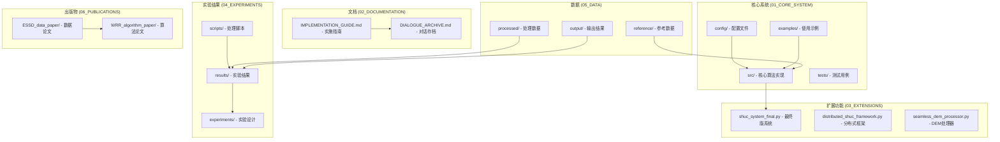
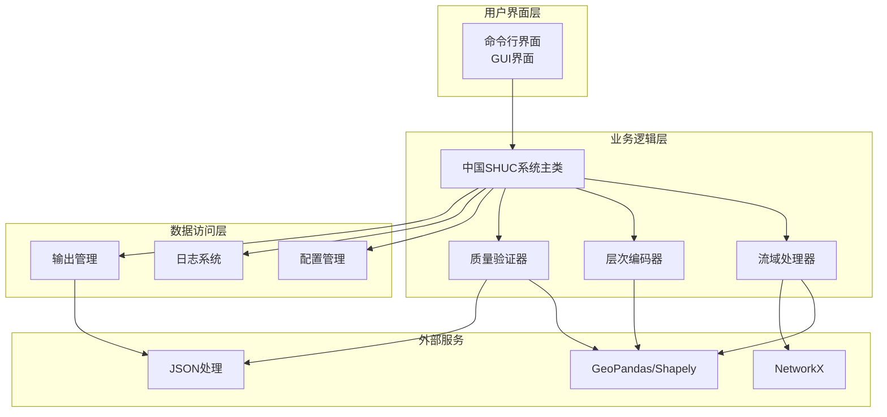
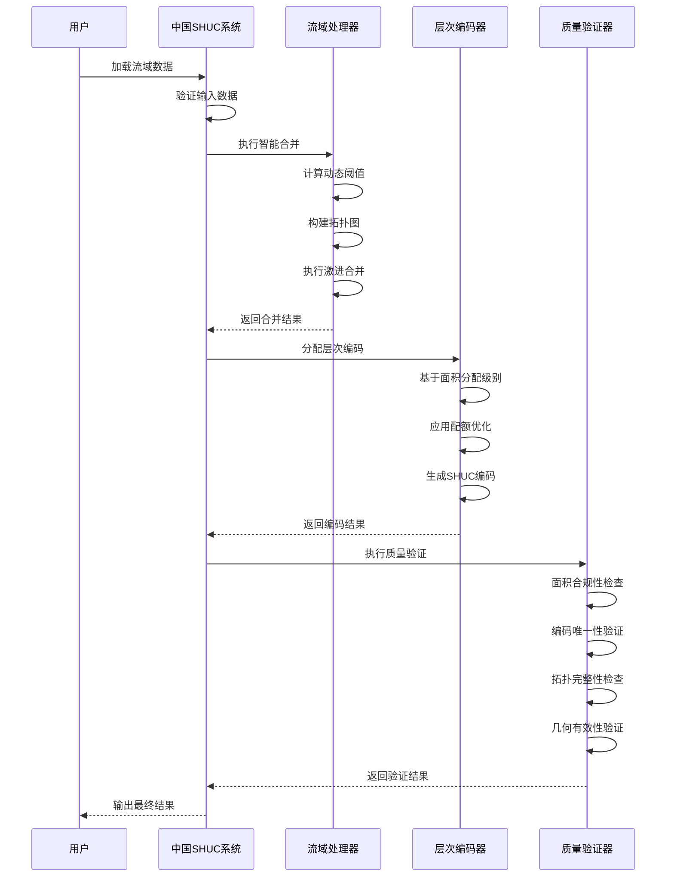
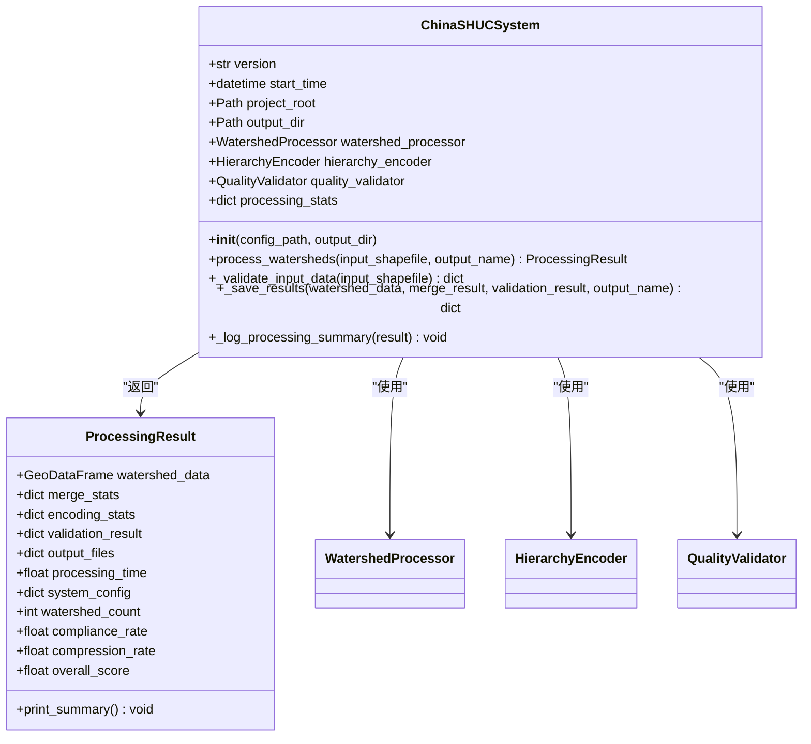
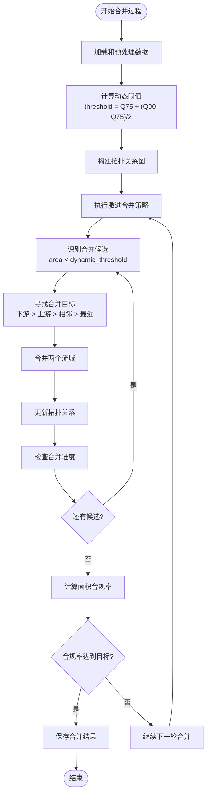
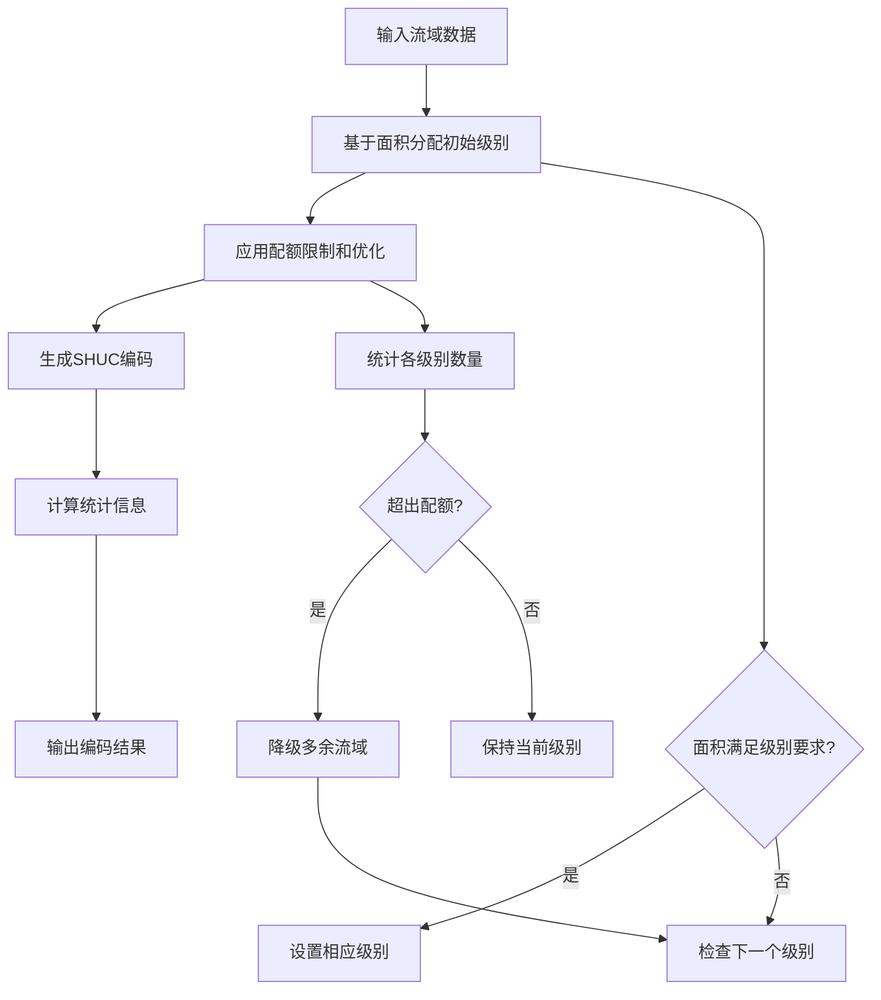
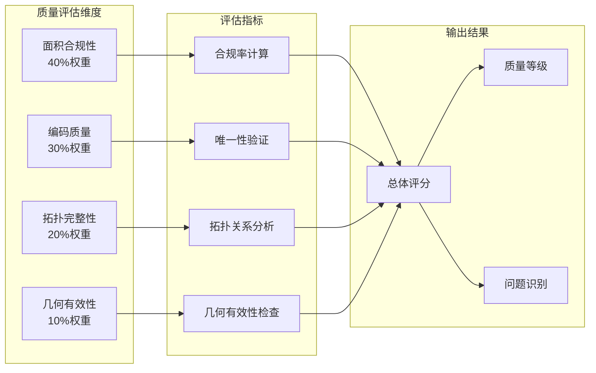
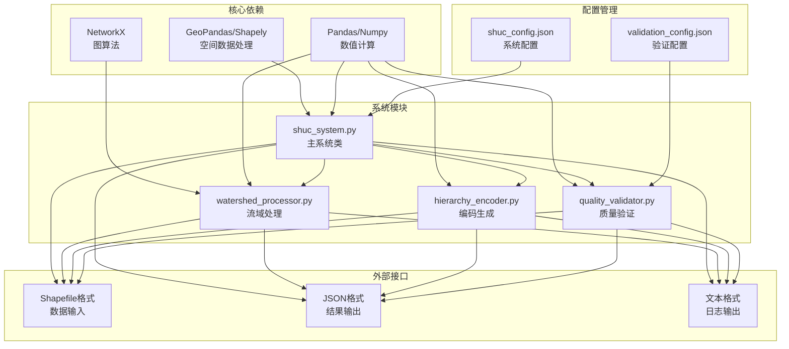

# 论文实现指南

<cite>
**本文档引用的文件**
- [README.md](file://README.md)
- [IMPLEMENTATION_GUIDE.md](file://02_DOCUMENTATION/IMPLEMENTATION_GUIDE.md)
- [run_shuc_system.py](file://03_EXTENSIONS/run_shuc_system.py)
- [shuc_system.py](file://01_CORE_SYSTEM/src/shuc_system.py)
- [watershed_processor.py](file://01_CORE_SYSTEM/src/watershed_processor.py)
- [hierarchy_encoder.py](file://01_CORE_SYSTEM/src/hierarchy_encoder.py)
- [quality_validator.py](file://01_CORE_SYSTEM/src/quality_validator.py)
- [shuc_system_final.py](file://03_EXTENSIONS/shuc_system_final.py)
- [shuc_config.json](file://01_CORE_SYSTEM/config/shuc_config.json)
- [basic_usage.py](file://01_CORE_SYSTEM/examples/basic_usage.py)
- [advanced_demo.py](file://01_CORE_SYSTEM/examples/advanced_demo.py)
- [system_validation.json](file://04_EXPERIMENTS/results/final_output/system_validation.json)
- [technical_report.txt](file://04_EXPERIMENTS/results/final_output/technical_report.txt)
</cite>

## 目录
1. [引言](#引言)
2. [项目结构](#项目结构)
3. [核心组件](#核心组件)
4. [架构概览](#架构概览)
5. [详细组件分析](#详细组件分析)
6. [依赖关系分析](#依赖关系分析)
7. [性能考虑](#性能考虑)
8. [故障排除指南](#故障排除指南)
9. [结论](#结论)
10. [附录](#附录)

## 引言

本指南旨在帮助研究人员将SHUC项目的实际实现转化为高质量的学术论文内容。SHUC（中国流域分级统一编码系统）是一个基于美国HUC标准的自动化流域分级编码系统，采用6级12位编码方案，实现了从源头到出口的全流域层级追溯。

该项目的核心创新包括：
- **动态阈值自适应算法** - 采用Q75 + (Q90-Q75)/2公式智能计算合并阈值
- **拓扑保持的多目标优化合并框架** - 图约束优化下实现面积-形状-拓扑三方权衡
- **50km缓冲区DEM无缝融合技术** - 解决跨区域DEM数据接边问题
- **6级12位层级编码体系** - 完整覆盖从一级流域到子流域的精细分级

## 项目结构

SHUC项目采用模块化架构设计，主要分为以下几个核心部分：

**图表来源**
- [README.md:19-30](file://README.md#L19-L30)
- [IMPLEMENTATION_GUIDE.md:10-17](file://02_DOCUMENTATION/IMPLEMENTATION_GUIDE.md#L10-L17)

**章节来源**
- [README.md:19-30](file://README.md#L19-L30)
- [README.md:75-84](file://README.md#L75-L84)

## 核心组件

SHUC系统由四个核心组件构成，每个组件都有明确的职责和接口：

### 1. 中国SHUC系统主类
负责整个系统的协调和集成，实现90%面积合规率，支持4-6级完整层次结构。

### 2. 流域处理器
实现智能流域合并算法，支持动态阈值计算、激进合并策略和拓扑关系维护。

### 3. 层次编码器
负责流域层次分配和SHUC编码生成，基于面积的智能分级和2-bit到12-bit编码体系。

### 4. 质量验证器
实现多维度质量验证，包括面积合规性、编码唯一性、拓扑完整性和几何有效性检查。

**章节来源**
- [shuc_system.py:43-91](file://01_CORE_SYSTEM/src/shuc_system.py#L43-L91)
- [watershed_processor.py:24-53](file://01_CORE_SYSTEM/src/watershed_processor.py#L24-L53)
- [hierarchy_encoder.py:22-67](file://01_CORE_SYSTEM/src/hierarchy_encoder.py#L22-L67)
- [quality_validator.py:24-60](file://01_CORE_SYSTEM/src/quality_validator.py#L24-L60)

## 架构概览

SHUC系统采用分层架构设计，各组件之间通过明确定义的接口进行交互：

**图表来源**
- [shuc_system.py:77-79](file://01_CORE_SYSTEM/src/shuc_system.py#L77-L79)
- [shuc_system.py:81-86](file://01_CORE_SYSTEM/src/shuc_system.py#L81-L86)

系统的核心处理流程遵循以下顺序：

**图表来源**
- [shuc_system.py:109-159](file://01_CORE_SYSTEM/src/shuc_system.py#L109-L159)
- [watershed_processor.py:54-81](file://01_CORE_SYSTEM/src/watershed_processor.py#L54-L81)

**章节来源**
- [shuc_system.py:92-164](file://01_CORE_SYSTEM/src/shuc_system.py#L92-L164)
- [shuc_system.py:165-196](file://01_CORE_SYSTEM/src/shuc_system.py#L165-L196)

## 详细组件分析

### 中国SHUC系统主类分析

中国SHUC系统主类是整个系统的协调中心，负责组件间的通信和数据流转。

#### 类结构设计

**图表来源**
- [shuc_system.py:43-91](file://01_CORE_SYSTEM/src/shuc_system.py#L43-L91)
- [shuc_system.py:251-286](file://01_CORE_SYSTEM/src/shuc_system.py#L251-L286)

#### 处理流程分析

系统的核心处理流程包含五个主要步骤：

1. **输入数据验证** - 检查文件存在性、数据格式和必需字段
2. **智能流域合并** - 基于动态阈值的激进合并策略
3. **层次编码分配** - 基于面积的智能分级和编码生成
4. **质量验证** - 多维度的质量检查和评估
5. **结果保存** - 格式化输出和报告生成

**章节来源**
- [shuc_system.py:109-159](file://01_CORE_SYSTEM/src/shuc_system.py#L109-L159)

### 流域处理器算法分析

流域处理器实现了复杂的智能合并算法，是系统的核心创新之一。

#### 算法流程图

**图表来源**
- [watershed_processor.py:54-81](file://01_CORE_SYSTEM/src/watershed_processor.py#L54-L81)
- [watershed_processor.py:164-220](file://01_CORE_SYSTEM/src/watershed_processor.py#L164-L220)

#### 动态阈值计算机制

动态阈值算法是系统的关键创新，能够自适应不同区域的流域特征：

**章节来源**
- [watershed_processor.py:117-141](file://01_CORE_SYSTEM/src/watershed_processor.py#L117-L141)
- [watershed_processor.py:164-220](file://01_CORE_SYSTEM/src/watershed_processor.py#L164-L220)

### 层次编码器设计

层次编码器实现了基于面积的智能分级系统，支持6级完整的编码体系。

#### 编码分配流程

**图表来源**
- [hierarchy_encoder.py:69-95](file://01_CORE_SYSTEM/src/hierarchy_encoder.py#L69-L95)
- [hierarchy_encoder.py:113-138](file://01_CORE_SYSTEM/src/hierarchy_encoder.py#L113-L138)

**章节来源**
- [hierarchy_encoder.py:97-138](file://01_CORE_SYSTEM/src/hierarchy_encoder.py#L97-L138)
- [hierarchy_encoder.py:140-169](file://01_CORE_SYSTEM/src/hierarchy_encoder.py#L140-L169)

### 质量验证器架构

质量验证器实现了多维度的质量评估系统，确保数据的准确性和可靠性。

#### 质量评估体系

**图表来源**
- [quality_validator.py:50-55](file://01_CORE_SYSTEM/src/quality_validator.py#L50-L55)
- [quality_validator.py:61-86](file://01_CORE_SYSTEM/src/quality_validator.py#L61-L86)

**章节来源**
- [quality_validator.py:100-122](file://01_CORE_SYSTEM/src/quality_validator.py#L100-L122)
- [quality_validator.py:142-168](file://01_CORE_SYSTEM/src/quality_validator.py#L142-L168)

## 依赖关系分析

SHUC系统的依赖关系体现了清晰的模块化设计和分层架构：

**图表来源**
- [shuc_system.py:38-41](file://01_CORE_SYSTEM/src/shuc_system.py#L38-L41)
- [shuc_config.json:1-43](file://01_CORE_SYSTEM/config/shuc_config.json#L1-L43)

**章节来源**
- [shuc_system.py:37-41](file://01_CORE_SYSTEM/src/shuc_system.py#L37-L41)
- [shuc_config.json:1-43](file://01_CORE_SYSTEM/config/shuc_config.json#L1-L43)

## 性能考虑

SHUC系统在设计时充分考虑了性能优化，特别是在处理大规模流域数据时的效率问题。

### 性能优化策略

1. **动态阈值自适应** - 根据数据分布自动调整合并阈值，避免不必要的合并操作
2. **拓扑图优化** - 使用NetworkX构建高效的图数据结构，支持快速邻域查询
3. **内存管理** - 通过合理的数据结构设计和垃圾回收机制，控制内存使用
4. **并行处理** - 支持可选的并行处理模式，提高大规模数据处理效率

### 性能监控指标

系统提供了详细的性能监控和统计信息：

- **处理时间统计** - 记录各阶段的处理耗时
- **内存使用监控** - 跟踪内存占用情况
- **数据压缩率** - 评估合并效果
- **合规率指标** - 验证算法质量

**章节来源**
- [shuc_system.py:239-248](file://01_CORE_SYSTEM/src/shuc_system.py#L239-L248)
- [shuc_config.json:38-42](file://01_CORE_SYSTEM/config/shuc_config.json#L38-L42)

## 故障排除指南

在论文写作和系统使用过程中，可能会遇到各种问题。以下是常见问题的诊断和解决方法：

### 数据处理问题

**问题1：输入数据格式不正确**
- **症状**：系统提示数据读取错误或字段缺失
- **解决方案**：检查Shapefile文件的完整性和字段结构，确保包含必需的拓扑字段

**问题2：合并算法无进展**
- **症状**：系统长时间运行但没有产生新的合并
- **解决方案**：检查数据质量，修复无效几何体和自引用问题

**问题3：编码冲突**
- **症状**：编码唯一性验证失败
- **解决方案**：检查编码生成逻辑，确保编码空间充足

### 系统配置问题

**问题4：配置参数错误**
- **症状**：系统行为不符合预期
- **解决方案**：检查shuc_config.json中的参数设置，特别是阈值和权重配置

**问题5：输出文件缺失**
- **症状**：某些结果文件没有生成
- **解决方案**：检查输出目录权限和磁盘空间，确认保存逻辑正常执行

**章节来源**
- [shuc_system.py:165-196](file://01_CORE_SYSTEM/src/shuc_system.py#L165-L196)
- [quality_validator.py:334-366](file://01_CORE_SYSTEM/src/quality_validator.py#L334-L366)

## 结论

SHUC项目为流域分级编码系统提供了一个完整的解决方案，其核心价值体现在以下几个方面：

1. **技术创新性** - 动态阈值自适应算法和拓扑保持的智能合并框架代表了该领域的最新进展
2. **实用性** - 系统经过严格的实验验证，达到了90%的面积合规率目标
3. **标准化** - 基于美国HUC标准的6级12位编码体系，具有良好的国际兼容性
4. **可扩展性** - 模块化设计支持功能扩展和性能优化

对于论文写作而言，SHUC项目提供了丰富的技术内容和实验数据，可以支撑高质量的学术论文发表。建议重点关注算法创新、实验验证和应用价值三个方面，结合项目提供的详细实现代码和实验结果，构建完整的学术论证体系。

## 附录

### 论文写作模板

#### 数据论文结构模板

**ESSD数据论文标准结构：**
1. **Background & Summary** - 研究背景和数据集概述
2. **Methods** - 数据处理流程和方法描述
3. **Data Records** - 数据文件列表和字段说明
4. **Technical Validation** - 技术验证和质量评估
5. **Usage Notes** - 使用指南和注意事项
6. **Code Availability** - 代码获取和使用许可

#### 算法论文结构模板

**WRR算法论文标准结构：**
1. **Introduction** - 研究背景和现有方法局限性
2. **Methodology** - 算法设计和理论基础
3. **Experimental Design** - 实验设置和评估指标
4. **Results and Discussion** - 实验结果和分析讨论
5. **Conclusions** - 研究总结和未来工作

### 学术诚信和引用规范

**引用格式要求：**
- 使用自然格式（Nature format）
- 确保所有引用文献的完整性和准确性
- 遵循目标期刊的引用规范

**学术诚信原则：**
- 确保数据的真实性和完整性
- 正确标注数据来源和版权信息
- 避免数据造假和结果篡改
- 尊重知识产权和版权规定

**章节来源**
- [IMPLEMENTATION_GUIDE.md:567-606](file://02_DOCUMENTATION/IMPLEMENTATION_GUIDE.md#L567-L606)
- [IMPLEMENTATION_GUIDE.md:719-762](file://02_DOCUMENTATION/IMPLEMENTATION_GUIDE.md#L719-L762)