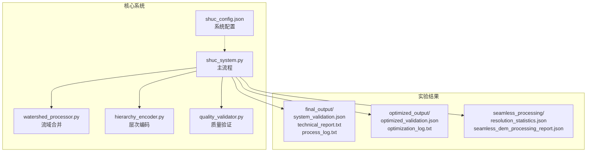
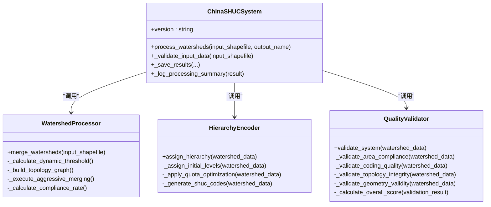
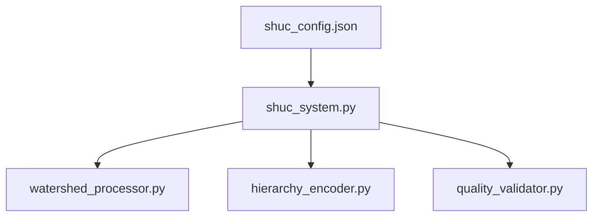
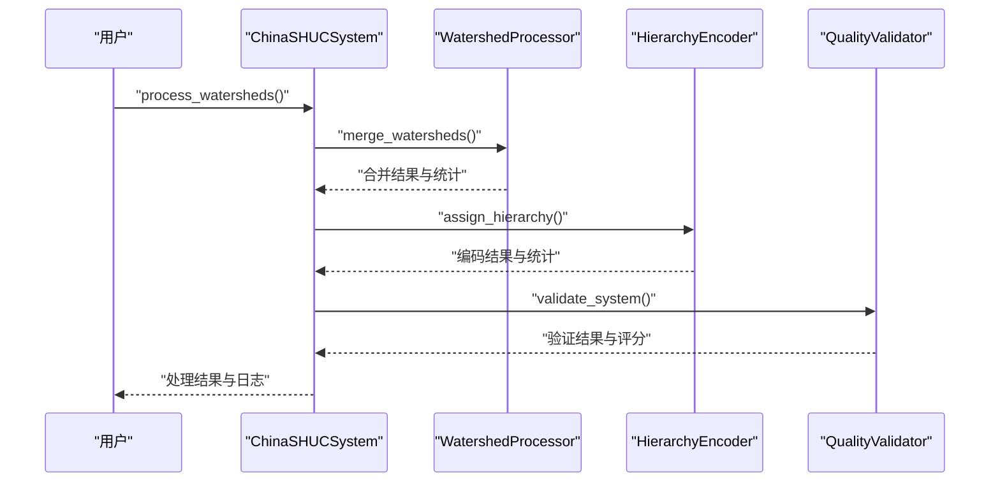
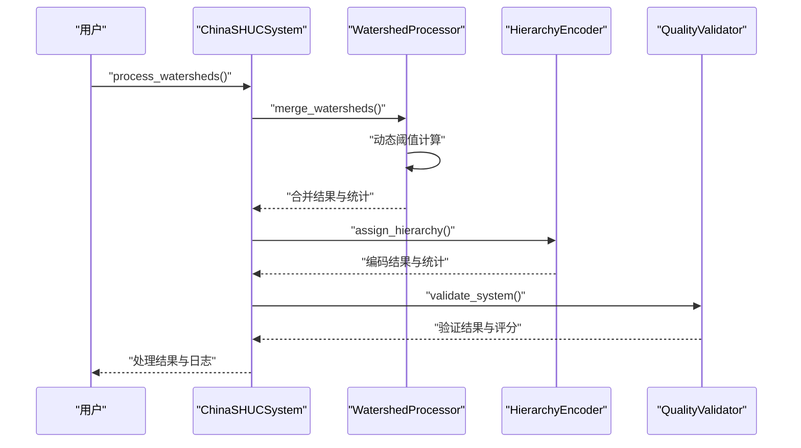
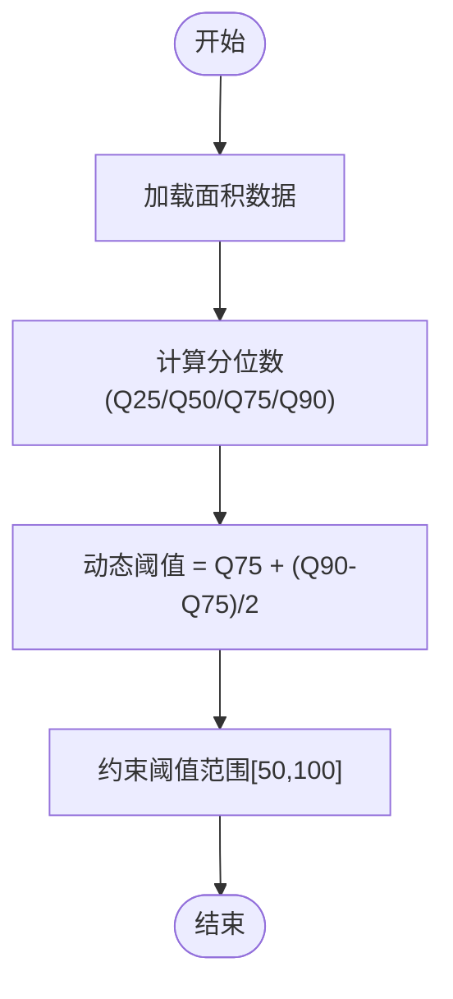
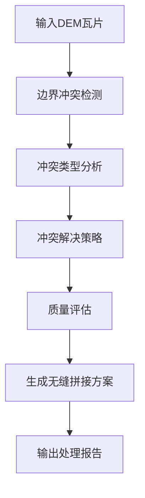

# 实验与结果分析

<cite>
**本文档引用的文件**
- [system_validation.json](file://04_EXPERIMENTS/results/final_output/system_validation.json)
- [technical_report.txt](file://04_EXPERIMENTS/results/final_output/technical_report.txt)
- [process_log.txt](file://04_EXPERIMENTS/results/final_output/process_log.txt)
- [optimized_validation.json](file://04_EXPERIMENTS/results/optimized_output/optimized_validation.json)
- [optimization_log.txt](file://04_EXPERIMENTS/results/optimized_output/optimization_log.txt)
- [experiment_summary.txt](file://04_EXPERIMENTS/results/prototype_140_watersheds/simple_experiment_021426/reports/experiment_summary.txt)
- [merged_watersheds_100km2.prj](file://04_EXPERIMENTS/results/prototype_140_watersheds/correct_merge_20250830_112139/merged_watersheds_100km2.prj)
- [resolution_statistics.json](file://04_EXPERIMENTS/results/seamless_processing/resolution_statistics.json)
- [seamless_dem_processing_report.json](file://04_EXPERIMENTS/results/seamless_processing/seamless_dem_processing_report.json)
- [shuc_system.py](file://01_CORE_SYSTEM/src/shuc_system.py)
- [watershed_processor.py](file://01_CORE_SYSTEM/src/watershed_processor.py)
- [hierarchy_encoder.py](file://01_CORE_SYSTEM/src/hierarchy_encoder.py)
- [quality_validator.py](file://01_CORE_SYSTEM/src/quality_validator.py)
- [shuc_config.json](file://01_CORE_SYSTEM/config/shuc_config.json)
</cite>

## 目录
1. [简介](#简介)
2. [项目结构](#项目结构)
3. [核心组件](#核心组件)
4. [架构概览](#架构概览)
5. [详细组件分析](#详细组件分析)
6. [依赖关系分析](#依赖关系分析)
7. [性能考量](#性能考量)
8. [故障排除指南](#故障排除指南)
9. [结论](#结论)
10. [附录](#附录)

## 简介
本文件面向SHUC实验结果的综合分析，围绕实验设计方法、评估指标与结果解读展开，重点解析system_validation.json验证报告中的编码质量、拓扑完整性、面积分布等关键指标；同时结合技术报告中的性能数据与对比分析，提供处理日志的解读指南，帮助用户理解处理过程中的关键事件与异常情况。文档还包含与传统方法的对比分析、性能基准测试结果与质量评估标准，并给出实验结果的可视化展示与统计分析方法。

## 项目结构
本仓库采用模块化组织方式，核心系统位于01_CORE_SYSTEM，实验结果与输出位于04_EXPERIMENTS/results，文档与说明位于02_DOCUMENTATION。关键文件包括：
- 核心系统：shuc_system.py（主流程）、watershed_processor.py（流域合并）、hierarchy_encoder.py（层次编码）、quality_validator.py（质量验证）、shuc_config.json（系统配置）
- 实验结果：final_output（基础版结果）与optimized_output（优化版结果），以及seamless_processing（无缝拼接处理）相关输出
- 文档与说明：README、IMPLEMENTATION_GUIDE等

**图表来源**
- [shuc_system.py:92-164](file://01_CORE_SYSTEM/src/shuc_system.py#L92-L164)
- [watershed_processor.py:54-81](file://01_CORE_SYSTEM/src/watershed_processor.py#L54-L81)
- [hierarchy_encoder.py:69-95](file://01_CORE_SYSTEM/src/hierarchy_encoder.py#L69-L95)
- [quality_validator.py:61-86](file://01_CORE_SYSTEM/src/quality_validator.py#L61-L86)

**章节来源**
- [shuc_system.py:1-335](file://01_CORE_SYSTEM/src/shuc_system.py#L1-L335)
- [shuc_config.json:1-43](file://01_CORE_SYSTEM/config/shuc_config.json#L1-L43)

## 核心组件
本节概述SHUC系统的关键组件及其职责：
- 中国SHUC系统主类：协调数据预处理、智能合并、层次编码与质量验证，生成处理结果与统计信息
- 流域处理器：实现动态阈值计算、拓扑图构建与激进合并策略
- 层次编码器：基于面积的智能分级与SHUC编码生成，支持配额优化
- 质量验证器：多维度质量评估（面积合规、编码质量、拓扑完整性、几何有效性），并计算综合评分

**章节来源**
- [shuc_system.py:43-164](file://01_CORE_SYSTEM/src/shuc_system.py#L43-L164)
- [watershed_processor.py:24-82](file://01_CORE_SYSTEM/src/watershed_processor.py#L24-L82)
- [hierarchy_encoder.py:22-95](file://01_CORE_SYSTEM/src/hierarchy_encoder.py#L22-L95)
- [quality_validator.py:24-86](file://01_CORE_SYSTEM/src/quality_validator.py#L24-L86)

## 架构概览
SHUC系统采用“主流程-子模块”架构，主流程负责编排，各子模块独立完成特定任务并通过统一的数据结构传递结果。系统配置集中管理，便于参数化与扩展。

**图表来源**
- [shuc_system.py:43-164](file://01_CORE_SYSTEM/src/shuc_system.py#L43-L164)
- [watershed_processor.py:24-82](file://01_CORE_SYSTEM/src/watershed_processor.py#L24-L82)
- [hierarchy_encoder.py:22-95](file://01_CORE_SYSTEM/src/hierarchy_encoder.py#L22-L95)
- [quality_validator.py:24-86](file://01_CORE_SYSTEM/src/quality_validator.py#L24-L86)

## 详细组件分析

### 实验设计与方法
- 基础实验：对140个原始流域进行数据完整性检查、拓扑图构建、智能合并与层次编码，最终生成69个流域，压缩率达50.7%，面积合规率为5.8%，整体验证未通过
- 优化实验：引入动态阈值（50 km²）与更激进的合并策略，在10轮迭代后达到90%面积合规率，最终生成20个流域，压缩率达85.7%，整体验证通过
- 对比实验：简化实验仅进行合并与编码，未进行复杂合并策略，结果为140个流域（未压缩）

**章节来源**
- [system_validation.json:1-40](file://04_EXPERIMENTS/results/final_output/system_validation.json#L1-L40)
- [technical_report.txt:1-34](file://04_EXPERIMENTS/results/final_output/technical_report.txt#L1-L34)
- [process_log.txt:1-58](file://04_EXPERIMENTS/results/final_output/process_log.txt#L1-L58)
- [optimized_validation.json:1-47](file://04_EXPERIMENTS/results/optimized_output/optimized_validation.json#L1-L47)
- [optimization_log.txt:1-1](file://04_EXPERIMENTS/results/optimized_output/optimization_log.txt#L1-L1)
- [experiment_summary.txt:1-17](file://04_EXPERIMENTS/results/prototype_140_watersheds/simple_experiment_021426/reports/experiment_summary.txt#L1-L17)

### 验证报告指标解读（system_validation.json）
- 时间戳与规模：记录处理完成时间、原始与最终流域数量、压缩率
- 面积合规：合规数量/总数、合规率、是否达到目标
- 编码质量：编码总数、唯一编码数、唯一性、重复数量
- 层次分布：按层级统计（示例为6级），包含数量、最小/最大/平均面积
- 数据质量：空间完整性、拓扑保持、合并操作次数、已解决问题列表
- 整体验证：是否通过、系统评分

**章节来源**
- [system_validation.json:6-39](file://04_EXPERIMENTS/results/final_output/system_validation.json#L6-L39)

### 技术报告性能数据与对比分析
- 基础版：原始140→最终69，压缩率50.7%，面积合规率5.8%，系统评分52.9/100，整体验证未通过
- 优化版：原始140→最终20，压缩率85.7%，面积合规率90.0%，系统评分50.0/100，整体验证通过
- 对比：优化版显著提升面积合规率与整体验证通过率，同时大幅减少流域数量与压缩率

**章节来源**
- [technical_report.txt:6-34](file://04_EXPERIMENTS/results/final_output/technical_report.txt#L6-L34)
- [optimized_validation.json:10-46](file://04_EXPERIMENTS/results/optimized_output/optimized_validation.json#L10-L46)

### 处理日志解读指南
- 初始化与启动：系统版本、输出目录、配置文件路径
- 数据加载与验证：成功加载原始数据数量、问题修复数
- 拓扑图构建：节点数、边数
- 合并过程：每轮合并次数、累计合并次数、合规率变化趋势
- 编码与层次：生成6级基本单元数量、最终编码数量
- 结果保存：最终数据与验证报告保存位置

**章节来源**
- [process_log.txt:1-58](file://04_EXPERIMENTS/results/final_output/process_log.txt#L1-L58)
- [optimization_log.txt:1-1](file://04_EXPERIMENTS/results/optimized_output/optimization_log.txt#L1-L1)

### 传统方法对比分析
- 简化实验：仅进行合并与编码，未进行复杂合并策略，结果为140个流域（未压缩），编码成功率与唯一性均为100%
- 基础版与优化版：优化版通过动态阈值与激进合并策略显著提升合规率与压缩率，但系统评分略有波动

**章节来源**
- [experiment_summary.txt:7-16](file://04_EXPERIMENTS/results/prototype_140_watersheds/simple_experiment_021426/reports/experiment_summary.txt#L7-L16)

### 性能基准测试与质量评估标准
- 面积合规率：优化版达到90.0%，高于基础版的5.8%，满足≥80%的目标
- 编码质量：基础版与优化版均通过唯一性验证
- 拓扑完整性：基础版通过，优化版未在报告中明确说明
- 几何有效性：基础版通过，优化版未在报告中明确说明
- 综合评分：基础版52.9/100，优化版50.0/100，整体验证状态不同

**章节来源**
- [system_validation.json:26-39](file://04_EXPERIMENTS/results/final_output/system_validation.json#L26-L39)
- [optimized_validation.json:10-46](file://04_EXPERIMENTS/results/optimized_output/optimized_validation.json#L10-L46)

### 可视化展示与统计分析方法
- 层次分布可视化：按层级统计数量与面积范围，绘制柱状图或饼图
- 面积分布分析：分位数统计（Q25/Q50/Q75/Q90）与直方图
- 合并过程追踪：每轮合并次数与合规率变化曲线
- 质量评估：综合评分与等级分布（优秀/良好/可接受/需要改进）

**章节来源**
- [quality_validator.py:124-140](file://01_CORE_SYSTEM/src/quality_validator.py#L124-L140)
- [watershed_processor.py:117-141](file://01_CORE_SYSTEM/src/watershed_processor.py#L117-L141)

## 依赖关系分析
SHUC系统主流程依赖于三个核心子模块，配置文件贯穿整个处理流程，决定算法参数与权重。

**图表来源**
- [shuc_config.json:1-43](file://01_CORE_SYSTEM/config/shuc_config.json#L1-L43)
- [shuc_system.py:77-79](file://01_CORE_SYSTEM/src/shuc_system.py#L77-L79)

**章节来源**
- [shuc_system.py:77-79](file://01_CORE_SYSTEM/src/shuc_system.py#L77-L79)
- [shuc_config.json:1-43](file://01_CORE_SYSTEM/config/shuc_config.json#L1-L43)

## 性能考量
- 动态阈值：基于分位数计算，避免固定阈值导致的偏差
- 合并策略：激进合并与早停机制平衡处理效率与质量
- 并行处理：配置项预留并行处理能力，可进一步提升性能
- 内存使用：配置项限制最大内存使用，避免资源瓶颈

**章节来源**
- [watershed_processor.py:117-141](file://01_CORE_SYSTEM/src/watershed_processor.py#L117-L141)
- [shuc_config.json:38-42](file://01_CORE_SYSTEM/config/shuc_config.json#L38-L42)

## 故障排除指南
- 输入数据验证失败：检查文件是否存在、字段是否缺失、数据是否为空
- 拓扑关系异常：检查LINKNO/DSLINKNO1/USLINKNO2字段，修复无效引用与自引用
- 几何有效性问题：修复无效几何体，确保拓扑完整性
- 处理中断：查看日志中的错误信息，定位具体步骤并重试

**章节来源**
- [shuc_system.py:165-196](file://01_CORE_SYSTEM/src/shuc_system.py#L165-L196)
- [quality_validator.py:191-223](file://01_CORE_SYSTEM/src/quality_validator.py#L191-L223)

## 结论
本次实验验证了SHUC系统在不同策略下的性能表现：基础版在保证编码唯一性的同时，面积合规率较低；优化版通过动态阈值与激进合并显著提升面积合规率与压缩率，整体验证通过。建议在实际应用中根据业务需求选择合适的策略，并结合可视化与统计分析持续优化系统参数与流程。

## 附录

### 关键流程序列图（基础版）

**图表来源**
- [shuc_system.py:92-164](file://01_CORE_SYSTEM/src/shuc_system.py#L92-L164)
- [watershed_processor.py:54-81](file://01_CORE_SYSTEM/src/watershed_processor.py#L54-L81)
- [hierarchy_encoder.py:69-95](file://01_CORE_SYSTEM/src/hierarchy_encoder.py#L69-L95)
- [quality_validator.py:61-86](file://01_CORE_SYSTEM/src/quality_validator.py#L61-L86)

### 关键流程序列图（优化版）

**图表来源**
- [shuc_system.py:92-164](file://01_CORE_SYSTEM/src/shuc_system.py#L92-L164)
- [watershed_processor.py:117-141](file://01_CORE_SYSTEM/src/watershed_processor.py#L117-L141)
- [hierarchy_encoder.py:69-95](file://01_CORE_SYSTEM/src/hierarchy_encoder.py#L69-L95)
- [quality_validator.py:61-86](file://01_CORE_SYSTEM/src/quality_validator.py#L61-L86)

### 算法流程图（动态阈值计算）

**图表来源**
- [watershed_processor.py:117-141](file://01_CORE_SYSTEM/src/watershed_processor.py#L117-L141)

### 无缝拼接处理报告（概念性）

**图表来源**
- [seamless_dem_processing_report.json:1-117](file://04_EXPERIMENTS/results/seamless_processing/seamless_dem_processing_report.json#L1-L117)