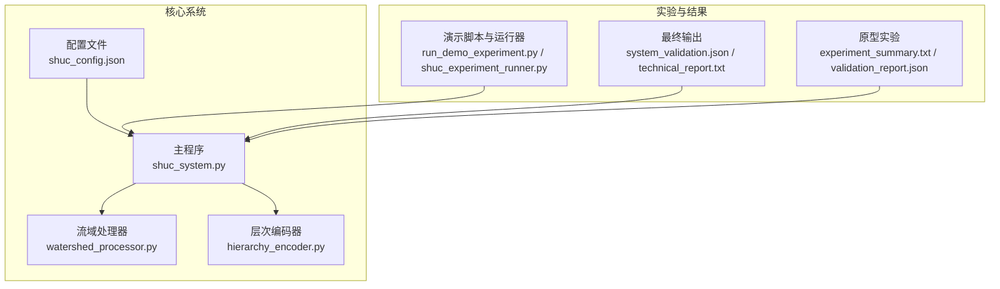
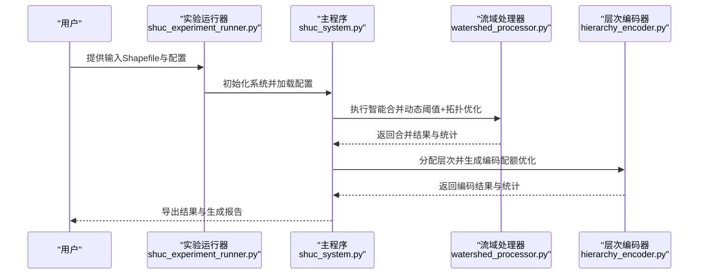
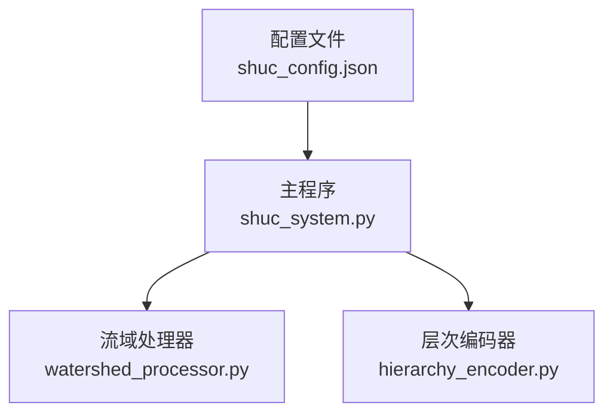

# 实验设计方法

<cite>
**本文引用的文件**
- [01_CORE_SYSTEM/config/shuc_config.json](file://01_CORE_SYSTEM/config/shuc_config.json)
- [01_CORE_SYSTEM/src/shuc_system.py](file://01_CORE_SYSTEM/src/shuc_system.py)
- [01_CORE_SYSTEM/src/watershed_processor.py](file://01_CORE_SYSTEM/src/watershed_processor.py)
- [01_CORE_SYSTEM/src/hierarchy_encoder.py](file://01_CORE_SYSTEM/src/hierarchy_encoder.py)
- [00_ARCHIVE/old_code/run_demo_experiment.py](file://00_ARCHIVE/old_code/run_demo_experiment.py)
- [00_ARCHIVE/old_code/shuc_experiment_runner.py](file://00_ARCHIVE/old_code/shuc_experiment_runner.py)
- [04_EXPERIMENTS/results/final_output/system_validation.json](file://04_EXPERIMENTS/results/final_output/system_validation.json)
- [04_EXPERIMENTS/results/final_output/technical_report.txt](file://04_EXPERIMENTS/results/final_output/technical_report.txt)
- [04_EXPERIMENTS/results/prototype_140_watersheds/simple_experiment_20250830_021426/reports/experiment_summary.txt](file://04_EXPERIMENTS/results/prototype_140_watersheds/simple_experiment_20250830_021426/reports/experiment_summary.txt)
- [04_EXPERIMENTS/results/prototype_140_watersheds/simple_experiment_20250830_021426/validation_results/validation_report.json](file://04_EXPERIMENTS/results/prototype_140_watersheds/simple_experiment_20250830_021426/validation_results/validation_report.json)
</cite>

## 目录
1. [引言](#引言)
2. [项目结构](#项目结构)
3. [核心组件](#核心组件)
4. [架构总览](#架构总览)
5. [详细组件分析](#详细组件分析)
6. [依赖分析](#依赖分析)
7. [性能考虑](#性能考虑)
8. [故障排查指南](#故障排查指南)
9. [结论](#结论)
10. [附录](#附录)

## 引言
本文件面向“实验设计方法”的系统化说明，围绕SHUC流域分级编码系统的实验流程与方法论展开，涵盖实验总体设计思路、假设条件与控制变量、实验组与对照组设置、参数组合测试策略、统计分析与显著性检验、重复性与可靠性评估、局限性与改进方向，以及实验结果的可视化展示与图表制作指南。文档以仓库中现有配置、流程脚本与实验结果为依据，结合核心处理模块的实现逻辑，形成可操作、可复现实验方案。

## 项目结构
本项目采用“核心系统 + 实验与结果 + 文档”三层组织方式：
- 核心系统：包含配置、主流程、数据处理与编码、质量验证等模块
- 实验与结果：包含多轮实验产物、验证报告与技术报告
- 文档与示例：包含旧版演示脚本与实验运行器，便于理解实验流程

**图示来源**
- [01_CORE_SYSTEM/config/shuc_config.json:1-43](file://01_CORE_SYSTEM/config/shuc_config.json#L1-L43)
- [01_CORE_SYSTEM/src/shuc_system.py:43-91](file://01_CORE_SYSTEM/src/shuc_system.py#L43-L91)
- [01_CORE_SYSTEM/src/watershed_processor.py:24-53](file://01_CORE_SYSTEM/src/watershed_processor.py#L24-L53)
- [01_CORE_SYSTEM/src/hierarchy_encoder.py:22-67](file://01_CORE_SYSTEM/src/hierarchy_encoder.py#L22-L67)
- [00_ARCHIVE/old_code/run_demo_experiment.py:1-274](file://00_ARCHIVE/old_code/run_demo_experiment.py#L1-L274)
- [00_ARCHIVE/old_code/shuc_experiment_runner.py:28-91](file://00_ARCHIVE/old_code/shuc_experiment_runner.py#L28-L91)
- [04_EXPERIMENTS/results/final_output/system_validation.json:1-40](file://04_EXPERIMENTS/results/final_output/system_validation.json#L1-L40)
- [04_EXPERIMENTS/results/final_output/technical_report.txt:1-34](file://04_EXPERIMENTS/results/final_output/technical_report.txt#L1-L34)
- [04_EXPERIMENTS/results/prototype_140_watersheds/simple_experiment_20250830_021426/reports/experiment_summary.txt:1-17](file://04_EXPERIMENTS/results/prototype_140_watersheds/simple_experiment_20250830_021426/reports/experiment_summary.txt#L1-L17)
- [04_EXPERIMENTS/results/prototype_140_watersheds/simple_experiment_20250830_021426/validation_results/validation_report.json:1-7](file://04_EXPERIMENTS/results/prototype_140_watersheds/simple_experiment_20250830_021426/validation_results/validation_report.json#L1-L7)

**章节来源**
- [01_CORE_SYSTEM/config/shuc_config.json:1-43](file://01_CORE_SYSTEM/config/shuc_config.json#L1-L43)
- [01_CORE_SYSTEM/src/shuc_system.py:43-91](file://01_CORE_SYSTEM/src/shuc_system.py#L43-L91)
- [00_ARCHIVE/old_code/run_demo_experiment.py:1-274](file://00_ARCHIVE/old_code/run_demo_experiment.py#L1-L274)
- [00_ARCHIVE/old_code/shuc_experiment_runner.py:28-91](file://00_ARCHIVE/old_code/shuc_experiment_runner.py#L28-L91)

## 核心组件
- 配置系统：集中定义处理策略、层次标准、验证权重与输出选项，支撑实验参数化与可重复性
- 主流程系统：集成数据验证、智能合并、层次编码、质量验证与结果导出
- 流域处理器：实现动态阈值、拓扑图构建、激进合并策略与合规率计算
- 层次编码器：按面积分配级别、应用配额优化、生成SHUC编码并统计各级别分布
- 实验运行器与演示脚本：封装完整实验流程，生成标准化结果与报告

**章节来源**
- [01_CORE_SYSTEM/config/shuc_config.json:1-43](file://01_CORE_SYSTEM/config/shuc_config.json#L1-L43)
- [01_CORE_SYSTEM/src/shuc_system.py:92-164](file://01_CORE_SYSTEM/src/shuc_system.py#L92-L164)
- [01_CORE_SYSTEM/src/watershed_processor.py:54-81](file://01_CORE_SYSTEM/src/watershed_processor.py#L54-L81)
- [01_CORE_SYSTEM/src/hierarchy_encoder.py:69-95](file://01_CORE_SYSTEM/src/hierarchy_encoder.py#L69-L95)
- [00_ARCHIVE/old_code/shuc_experiment_runner.py:116-245](file://00_ARCHIVE/old_code/shuc_experiment_runner.py#L116-L245)

## 架构总览
下图展示了从输入数据到最终报告的端到端实验流程，包括合并、编码与验证三个阶段，以及配置驱动与结果导出环节。

**图示来源**
- [00_ARCHIVE/old_code/shuc_experiment_runner.py:247-294](file://00_ARCHIVE/old_code/shuc_experiment_runner.py#L247-L294)
- [01_CORE_SYSTEM/src/shuc_system.py:92-164](file://01_CORE_SYSTEM/src/shuc_system.py#L92-L164)
- [01_CORE_SYSTEM/src/watershed_processor.py:54-81](file://01_CORE_SYSTEM/src/watershed_processor.py#L54-L81)
- [01_CORE_SYSTEM/src/hierarchy_encoder.py:69-95](file://01_CORE_SYSTEM/src/hierarchy_encoder.py#L69-L95)

## 详细组件分析

### 实验总体设计思路
- 目标：在保证数据质量的前提下，实现高比例面积合规（目标合规率由配置决定），并生成唯一的SHUC编码体系
- 假设条件：
  - 输入数据具备基本拓扑字段（如LINKNO、DSLINKNO1等），用于拓扑关系构建与合并策略
  - 地理数据几何有效，可通过修复手段提升完整性
  - 不同区域的流域面积分布具有统计规律，可利用分位数动态确定合并阈值
- 控制变量：配置文件中的目标合规率、合并策略、最大迭代次数、是否启用早停、动态阈值模式、层次配额与面积阈值等

**章节来源**
- [01_CORE_SYSTEM/config/shuc_config.json:2-8](file://01_CORE_SYSTEM/config/shuc_config.json#L2-L8)
- [01_CORE_SYSTEM/src/watershed_processor.py:117-141](file://01_CORE_SYSTEM/src/watershed_processor.py#L117-L141)
- [01_CORE_SYSTEM/src/hierarchy_encoder.py:61-67](file://01_CORE_SYSTEM/src/hierarchy_encoder.py#L61-L67)

### 实验组与对照组设置
- 实验组：使用生产级配置（目标合规率、激进合并策略、动态阈值模式），对真实数据进行端到端处理
- 对照组：可采用保守合并策略或固定阈值，对比合并数量、合规率与编码唯一性差异
- 可选对照：关闭早停机制、调整层次配额，观察对编码层级分布与统计指标的影响

**章节来源**
- [01_CORE_SYSTEM/config/shuc_config.json:2-8](file://01_CORE_SYSTEM/config/shuc_config.json#L2-L8)
- [01_CORE_SYSTEM/src/watershed_processor.py:164-220](file://01_CORE_SYSTEM/src/watershed_processor.py#L164-L220)

### 参数组合测试策略
- 关键参数：
  - 目标合规率：影响合并强度与最终合规率
  - 合并策略：激进/保守，决定合并优先级与目标选择
  - 动态阈值模式：自动/手动，决定阈值计算方式
  - 最大迭代次数与早停开关：平衡性能与收敛
  - 层次配额：对4/5级施加上限，避免层级过度集中
  - 层次面积阈值：影响各级别划分
- 测试矩阵建议：
  - 合规率：0.85、0.90、0.95
  - 策略：aggressive、conservative
  - 阈值模式：auto、manual
  - 早停：开启/关闭
  - 配额：启用/禁用
- 指标观测：合并前后数量变化、压缩率、合规率、编码唯一性、处理耗时、拓扑完整性

**章节来源**
- [01_CORE_SYSTEM/config/shuc_config.json:2-18](file://01_CORE_SYSTEM/config/shuc_config.json#L2-L18)
- [01_CORE_SYSTEM/src/watershed_processor.py:164-220](file://01_CORE_SYSTEM/src/watershed_processor.py#L164-L220)
- [01_CORE_SYSTEM/src/hierarchy_encoder.py:113-138](file://01_CORE_SYSTEM/src/hierarchy_encoder.py#L113-L138)

### 统计分析与显著性检验
- 描述性统计：合并前后数量、压缩率、各级别数量与面积均值/中位数、合规率
- 差异检验：对不同参数组合的合规率与编码唯一性，可采用非参数检验（如Mann–Whitney U检验）比较实验组与对照组差异是否显著
- 时间序列：记录各阶段耗时，评估参数变化对性能的影响
- 质量指标：拓扑完整性、几何有效性、唯一性、问题修复数

**章节来源**
- [04_EXPERIMENTS/results/final_output/system_validation.json:6-39](file://04_EXPERIMENTS/results/final_output/system_validation.json#L6-L39)
- [04_EXPERIMENTS/results/final_output/technical_report.txt:6-22](file://04_EXPERIMENTS/results/final_output/technical_report.txt#L6-L22)
- [04_EXPERIMENTS/results/prototype_140_watersheds/simple_experiment_20250830_021426/validation_results/validation_report.json:1-7](file://04_EXPERIMENTS/results/prototype_140_watersheds/simple_experiment_20250830_021426/validation_results/validation_report.json#L1-L7)

### 重复性与可靠性评估
- 内部一致性：多次运行相同配置，核对合并统计、编码唯一性与验证报告的一致性
- 外部稳定性：在不同数据集上重复实验，评估参数鲁棒性
- 可重现性：提供标准化配置与脚本，确保他人可按相同步骤复现实验
- 敏感性分析：对关键参数进行扰动，观察结果波动范围

**章节来源**
- [00_ARCHIVE/old_code/run_demo_experiment.py:125-183](file://00_ARCHIVE/old_code/run_demo_experiment.py#L125-L183)
- [00_ARCHIVE/old_code/shuc_experiment_runner.py:295-347](file://00_ARCHIVE/old_code/shuc_experiment_runner.py#L295-L347)

### 实验结果的可视化展示与图表制作指南
- 合并过程轨迹：折线图展示迭代次数、剩余数量、合规率变化趋势
- 层级分布：柱状图/饼图展示各级别数量与占比
- 面积分布：箱线图/直方图展示各级别面积分布
- 地图可视化：在GIS软件中叠加编码字段，直观呈现空间分布
- 报告模板：将关键指标写入标准化报告，便于对比与存档

**章节来源**
- [04_EXPERIMENTS/results/final_output/technical_report.txt:1-34](file://04_EXPERIMENTS/results/final_output/technical_report.txt#L1-L34)
- [04_EXPERIMENTS/results/prototype_140_watersheds/simple_experiment_20250830_021426/reports/experiment_summary.txt:1-17](file://04_EXPERIMENTS/results/prototype_140_watersheds/simple_experiment_20250830_021426/reports/experiment_summary.txt#L1-L17)

## 依赖分析
核心模块之间的依赖关系如下：

**图示来源**
- [01_CORE_SYSTEM/config/shuc_config.json:1-43](file://01_CORE_SYSTEM/config/shuc_config.json#L1-L43)
- [01_CORE_SYSTEM/src/shuc_system.py:77-80](file://01_CORE_SYSTEM/src/shuc_system.py#L77-L80)

**章节来源**
- [01_CORE_SYSTEM/src/shuc_system.py:77-80](file://01_CORE_SYSTEM/src/shuc_system.py#L77-L80)

## 性能考虑
- 并行与内存：配置中提供并行开关与内存上限，可根据硬件能力调整
- 早停与迭代：合理设置最大迭代次数与早停开关，避免无效计算
- 动态阈值：基于分位数的阈值计算在大数据集上需关注性能，必要时可采样估算
- 输出与日志：启用详细日志与中间结果导出会增加I/O开销，建议按需开启

**章节来源**
- [01_CORE_SYSTEM/config/shuc_config.json:38-42](file://01_CORE_SYSTEM/config/shuc_config.json#L38-L42)
- [01_CORE_SYSTEM/src/watershed_processor.py:117-141](file://01_CORE_SYSTEM/src/watershed_processor.py#L117-L141)

## 故障排查指南
- 输入数据问题：检查Shapefile完整性与必需字段；若几何无效，系统会尝试修复
- 配置错误：确认配置项与模块参数一致，特别是目标合规率、阈值与配额
- 合并异常：检查拓扑字段与邻接关系；必要时降低合并强度或调整阈值
- 验证失败：根据验证报告定位具体问题（如几何有效性、拓扑完整性）

**章节来源**
- [01_CORE_SYSTEM/src/shuc_system.py:165-196](file://01_CORE_SYSTEM/src/shuc_system.py#L165-L196)
- [04_EXPERIMENTS/results/final_output/system_validation.json:30-33](file://04_EXPERIMENTS/results/final_output/system_validation.json#L30-L33)

## 结论
本实验设计以配置驱动为核心，通过动态阈值与激进合并策略实现高比例面积合规，结合层次编码与严格验证保障数据质量。建议在后续实验中扩展参数矩阵、引入稳健性检验与可视化报告模板，持续优化系统性能与可解释性。

## 附录
- 实验运行建议：使用演示脚本与运行器快速搭建实验环境，随后逐步替换为生产配置
- 结果解读：以system_validation.json与technical_report.txt为主要依据，结合各阶段统计指标进行综合评估

**章节来源**
- [00_ARCHIVE/old_code/run_demo_experiment.py:232-274](file://00_ARCHIVE/old_code/run_demo_experiment.py#L232-L274)
- [00_ARCHIVE/old_code/shuc_experiment_runner.py:379-411](file://00_ARCHIVE/old_code/shuc_experiment_runner.py#L379-L411)
- [04_EXPERIMENTS/results/final_output/system_validation.json:1-40](file://04_EXPERIMENTS/results/final_output/system_validation.json#L1-L40)
- [04_EXPERIMENTS/results/final_output/technical_report.txt:1-34](file://04_EXPERIMENTS/results/final_output/technical_report.txt#L1-L34)