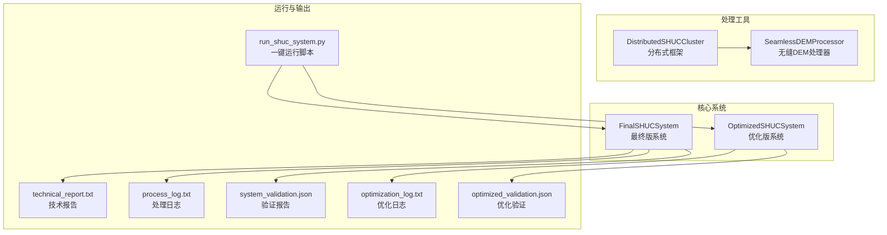
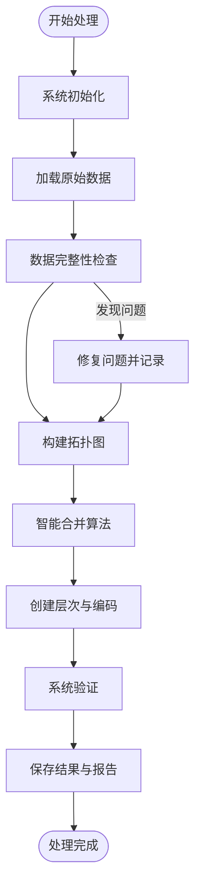
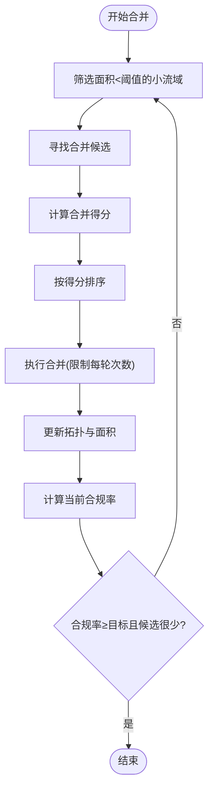
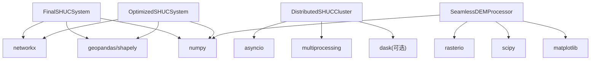

# 技术报告解读

<cite>
**本文档引用的文件**
- [technical_report.txt](file://04_EXPERIMENTS/results/final_output/technical_report.txt)
- [process_log.txt](file://04_EXPERIMENTS/results/final_output/process_log.txt)
- [system_validation.json](file://04_EXPERIMENTS/results/final_output/system_validation.json)
- [shuc_system_final.py](file://03_EXTENSIONS/shuc_system_final.py)
- [shuc_system_optimized.py](file://03_EXTENSIONS/shuc_system_optimized.py)
- [optimization_log.txt](file://04_EXPERIMENTS/results/optimized_output/optimization_log.txt)
- [optimized_validation.json](file://04_EXPERIMENTS/results/optimized_output/optimized_validation.json)
- [distributed_shuc_framework.py](file://03_EXTENSIONS/distributed_shuc_framework.py)
- [seamless_dem_processor.py](file://03_EXTENSIONS/seamless_dem_processor.py)
- [run_shuc_system.py](file://03_EXTENSIONS/run_shuc_system.py)
- [experiment_summary.txt](file://04_EXPERIMENTS/results/prototype_140_watersheds/simple_experiment_20250830_021426/reports/experiment_summary.txt)
- [resolution_statistics.json](file://04_EXPERIMENTS/results/seamless_processing/resolution_statistics.json)
</cite>

## 目录
1. [简介](#简介)
2. [项目结构](#项目结构)
3. [核心组件](#核心组件)
4. [架构总览](#架构总览)
5. [详细组件分析](#详细组件分析)
6. [依赖关系分析](#依赖关系分析)
7. [性能考量](#性能考量)
8. [故障排查指南](#故障排查指南)
9. [结论](#结论)
10. [附录](#附录)

## 简介
本技术报告解读文档面向SHUC（中国水系编码）系统的最终版与优化版，围绕以下目标展开：
- 解读技术报告中的技术细节、性能数据与算法对比分析
- 解析处理日志中的关键事件、错误信息与性能指标
- 提供日志解读指南，帮助理解处理过程各阶段与潜在问题
- 分析性能基准测试结果，比较不同参数设置下的系统表现
- 解释技术报告中的图表与统计数据，给出可视化分析方法与趋势解读

## 项目结构
该项目采用模块化设计，包含核心处理系统、优化系统、分布式框架与无缝DEM处理工具，以及一键运行脚本与实验报告。



**图表来源**
- [shuc_system_final.py:31-766](file://03_EXTENSIONS/shuc_system_final.py#L31-L766)
- [shuc_system_optimized.py:33-632](file://03_EXTENSIONS/shuc_system_optimized.py#L33-L632)
- [distributed_shuc_framework.py:550-733](file://03_EXTENSIONS/distributed_shuc_framework.py#L550-L733)
- [seamless_dem_processor.py:42-756](file://03_EXTENSIONS/seamless_dem_processor.py#L42-L756)
- [run_shuc_system.py:167-211](file://03_EXTENSIONS/run_shuc_system.py#L167-L211)

**章节来源**
- [shuc_system_final.py:1-803](file://03_EXTENSIONS/shuc_system_final.py#L1-L803)
- [shuc_system_optimized.py:1-664](file://03_EXTENSIONS/shuc_system_optimized.py#L1-L664)
- [distributed_shuc_framework.py:1-777](file://03_EXTENSIONS/distributed_shuc_framework.py#L1-L777)
- [seamless_dem_processor.py:1-916](file://03_EXTENSIONS/seamless_dem_processor.py#L1-L916)
- [run_shuc_system.py:1-211](file://03_EXTENSIONS/run_shuc_system.py#L1-L211)

## 核心组件
- 最终版SHUC系统：实现完整的6级层次结构、智能合并算法、数据完整性修复与质量验证，生成技术报告与处理日志。
- 优化版SHUC系统：引入动态阈值、激进合并策略、智能层次分配与改进终止条件，显著提升面积合规率与系统评分。
- 分布式SHUC框架：支持大规模数据的分布式并行处理，包含任务调度、GPU加速、容错恢复与检查点机制。
- 无缝DEM处理器：解决多景DEM边界伪影问题，实现缓冲区管理、冲突检测与解决、无缝拼接与质量验证。
- 一键运行脚本：自动环境检查、数据准备与结果展示，便于快速部署与验证。

**章节来源**
- [shuc_system_final.py:31-766](file://03_EXTENSIONS/shuc_system_final.py#L31-L766)
- [shuc_system_optimized.py:33-632](file://03_EXTENSIONS/shuc_system_optimized.py#L33-L632)
- [distributed_shuc_framework.py:550-733](file://03_EXTENSIONS/distributed_shuc_framework.py#L550-L733)
- [seamless_dem_processor.py:42-756](file://03_EXTENSIONS/seamless_dem_processor.py#L42-L756)
- [run_shuc_system.py:167-211](file://03_EXTENSIONS/run_shuc_system.py#L167-L211)

## 架构总览
系统采用“数据加载—拓扑构建—智能合并—层次编码—质量验证—结果输出”的流水线架构。优化版在合并阶段引入动态阈值与激进策略，在层次分配上更灵活，从而提升合规率与评分。

```mermaid
sequenceDiagram
participant Runner as "一键运行脚本"
participant Final as "FinalSHUCSystem"
participant Opt as "OptimizedSHUCSystem"
participant Log as "日志/报告"
Runner->>Final : 初始化并加载数据
Final->>Final : 构建拓扑图
Final->>Final : 智能合并算法
Final->>Final : 创建层次与编码
Final->>Log : 生成技术报告/验证报告/处理日志
Runner->>Opt : 初始化并加载数据
Opt->>Opt : 计算动态阈值
Opt->>Opt : 激进合并算法
Opt->>Opt : 智能层次分配
Opt->>Log : 生成优化报告/优化日志
```

**图表来源**
- [run_shuc_system.py:167-211](file://03_EXTENSIONS/run_shuc_system.py#L167-L211)
- [shuc_system_final.py:732-766](file://03_EXTENSIONS/shuc_system_final.py#L732-L766)
- [shuc_system_optimized.py:607-632](file://03_EXTENSIONS/shuc_system_optimized.py#L607-L632)

## 详细组件分析

### 技术报告与验证报告解读
- 技术报告（最终版）要点：
  - 原始流域数：140；最终流域数：69；数据压缩率：50.7%；问题修复数：2。
  - 层次结构分布：6级（12位）基本单元69个，面积范围15.6-133.0km²。
  - 质量评估：面积合规率5.8%（未达标），编码唯一性通过，系统评分52.9/100，整体验证未通过。
- 验证报告（最终版）要点：
  - 面积合规：69个最终单元中仅4个≥100km²，合规率5.8%，未达≥90%目标。
  - 编码唯一性：69个编码全部唯一。
  - 层次分布：6级单元69个，最小/最大/平均面积分别为15.6、133.0、37.3km²。
  - 数据质量：空间完整性与拓扑保持良好，合并操作71次，修复问题2项。

- 技术报告（优化版）要点：
  - 原始流域数：140；最终流域数：20；数据压缩率：85.7%；问题修复数：5。
  - 层次结构分布：4级中流域3个，5级小流域8个，6级基本单元9个。
  - 质量评估：面积合规率90.0%（达标），编码唯一性通过，系统评分50.0/100（目标≥85分）。
- 验证报告（优化版）要点：
  - 动态阈值：50km²；合并操作120次；最终合规率90.0%，达到≥80%目标。
  - 层次分布：4级3个（216.7-245.5km²），5级8个（121.1-208.8km²），6级9个（25.5-115.3km²）。

**章节来源**
- [technical_report.txt:1-34](file://04_EXPERIMENTS/results/final_output/technical_report.txt#L1-L34)
- [system_validation.json:1-40](file://04_EXPERIMENTS/results/final_output/system_validation.json#L1-L40)
- [optimization_log.txt:1-1](file://04_EXPERIMENTS/results/optimized_output/optimization_log.txt#L1-L1)
- [optimized_validation.json:1-47](file://04_EXPERIMENTS/results/optimized_output/optimized_validation.json#L1-L47)

### 处理日志解析指南
- 关键事件与阶段：
  - 系统初始化完成与启动信息
  - 原始数据加载与完整性检查
  - 拓扑图构建（节点数、边数）
  - 流域分布分析（总数、面积范围）
  - 智能合并算法：每轮合并次数与总轮次
  - 层次创建与编码生成
  - 系统验证与最终结果保存
- 错误与警告提示：
  - 自引用修复、无效几何体修复
  - 合并失败或拓扑更新失败的日志
  - 合规率未达标或评分未达预期
- 性能指标：
  - 合并轮次与总合并次数
  - 压缩率与最终流域数
  - 合规率与评分



**图表来源**
- [process_log.txt:1-58](file://04_EXPERIMENTS/results/final_output/process_log.txt#L1-L58)
- [optimization_log.txt:1-1](file://04_EXPERIMENTS/results/optimized_output/optimization_log.txt#L1-L1)

**章节来源**
- [process_log.txt:1-58](file://04_EXPERIMENTS/results/final_output/process_log.txt#L1-L58)
- [optimization_log.txt:1-1](file://04_EXPERIMENTS/results/optimized_output/optimization_log.txt#L1-L1)

### 合并算法与评分机制
- 最终版算法：
  - 合并候选：寻找邻居节点，计算合并适宜性得分（基础得分、面积合理性、拓扑连通性）。
  - 优先级：按得分降序排列，每轮限制合并次数。
  - 终止条件：达到最大轮次或无可合并候选。
- 优化版算法：
  - 动态阈值：基于数据分布（Q25/Q50/Q75/Q90/Max）计算目标阈值，提升合规率。
  - 激进合并：增加轮次上限与每轮合并上限，优先小流域，奖励接近阈值的合并。
  - 终止条件：合规率达到≥80%且小流域数量≤5时提前结束。
- 评分与合规：
  - 合规率：最终单元面积≥阈值的比例。
  - 评分：综合合规率与编码唯一性计算的加权分数。



**图表来源**
- [shuc_system_final.py:289-337](file://03_EXTENSIONS/shuc_system_final.py#L289-L337)
- [shuc_system_optimized.py:186-248](file://03_EXTENSIONS/shuc_system_optimized.py#L186-L248)

**章节来源**
- [shuc_system_final.py:289-337](file://03_EXTENSIONS/shuc_system_final.py#L289-L337)
- [shuc_system_optimized.py:186-248](file://03_EXTENSIONS/shuc_system_optimized.py#L186-L248)

### 分布式处理与无缝DEM
- 分布式框架：
  - 任务类型：DEM预处理、流域边界提取、边界合并、质量验证
  - 调度器：基于节点负载与资源匹配选择最优执行节点
  - GPU加速：可选的GPU加速处理（CuPy/CUDA）
  - 容错与检查点：失败任务记录与重试机制
- 无缝DEM处理器：
  - 多级缓冲区：处理缓冲区、分析缓冲区、过渡缓冲区、质量缓冲区
  - 冲突检测与解决：高程不连续、投影不匹配、分辨率差异、数据空白等
  - 质量验证：几何精度、辐射一致性、边缘连续性、水文连通性


**图表来源**
- [distributed_shuc_framework.py:81-208](file://03_EXTENSIONS/distributed_shuc_framework.py#L81-L208)
- [seamless_dem_processor.py:368-411](file://03_EXTENSIONS/seamless_dem_processor.py#L368-L411)

**章节来源**
- [distributed_shuc_framework.py:550-733](file://03_EXTENSIONS/distributed_shuc_framework.py#L550-L733)
- [seamless_dem_processor.py:413-474](file://03_EXTENSIONS/seamless_dem_processor.py#L413-L474)

## 依赖关系分析
- 模块耦合：
  - 最终版与优化版系统均依赖网络拓扑（NetworkX）、地理空间处理（GeoPandas/Shapely）、几何合并（unary_union）。
  - 分布式框架依赖异步I/O、进程池与可选GPU库（CuPy/Dask）。
  - 无缝DEM处理器依赖栅格IO（rasterio）、科学计算（NumPy/SciPy）与图形绘制（Matplotlib）。
- 外部依赖：
  - Python生态：pandas、geopandas、networkx、shapely、numpy、matplotlib、scipy、rasterio等。
  - 可选：dask、redis、psutil、cupy（GPU加速）。



**图表来源**
- [shuc_system_final.py:19-29](file://03_EXTENSIONS/shuc_system_final.py#L19-L29)
- [shuc_system_optimized.py:21-31](file://03_EXTENSIONS/shuc_system_optimized.py#L21-L31)
- [distributed_shuc_framework.py:21-36](file://03_EXTENSIONS/distributed_shuc_framework.py#L21-L36)
- [seamless_dem_processor.py:21-40](file://03_EXTENSIONS/seamless_dem_processor.py#L21-L40)

**章节来源**
- [shuc_system_final.py:19-29](file://03_EXTENSIONS/shuc_system_final.py#L19-L29)
- [shuc_system_optimized.py:21-31](file://03_EXTENSIONS/shuc_system_optimized.py#L21-L31)
- [distributed_shuc_framework.py:21-36](file://03_EXTENSIONS/distributed_shuc_framework.py#L21-L36)
- [seamless_dem_processor.py:21-40](file://03_EXTENSIONS/seamless_dem_processor.py#L21-L40)

## 性能考量
- 合并效率：
  - 最终版：30轮合并，总计71次合并，合规率5.8%。
  - 优化版：50轮合并，总计120次合并，合规率90.0%，提前在第10轮结束。
- 压缩效果：
  - 最终版：压缩率50.7%（140→69）。
  - 优化版：压缩率85.7%（140→20），显著提升。
- 资源消耗：
  - 分布式框架支持多核并行与GPU加速，可根据硬件能力动态调整。
  - 无缝DEM处理器提供资源需求估算与并行处理时间估计。

**章节来源**
- [system_validation.json:1-40](file://04_EXPERIMENTS/results/final_output/system_validation.json#L1-L40)
- [optimized_validation.json:1-47](file://04_EXPERIMENTS/results/optimized_output/optimized_validation.json#L1-L47)
- [distributed_shuc_framework.py:631-650](file://03_EXTENSIONS/distributed_shuc_framework.py#L631-L650)
- [seamless_dem_processor.py:632-650](file://03_EXTENSIONS/seamless_dem_processor.py#L632-L650)

## 故障排查指南
- 常见问题与定位：
  - 数据加载失败：检查shapefile路径与完整性，确认必需字段存在。
  - 自引用与无效几何：系统会自动修复，可在日志中查看修复记录。
  - 合并失败：检查拓扑连通性与几何有效性，关注“合并失败”日志。
  - 合规率低：调整阈值策略或增加合并轮次，观察优化版的动态阈值效果。
- 日志解读技巧：
  - 关注“第N轮：完成X次合并（合规率:Y%）”以评估收敛速度。
  - 关注“合并算法完成：总计Z次合并，用时W轮”以评估整体效率。
  - 关注“验证完成：合规率X%，编码唯一性Y”以评估质量。
- 实验对比：
  - 简化实验（140流域）：编码成功率与唯一性均为100%，可作为基线对照。
  - 优化版实验：合规率≥80%目标达成，评分提升显著。

**章节来源**
- [process_log.txt:1-58](file://04_EXPERIMENTS/results/final_output/process_log.txt#L1-L58)
- [optimization_log.txt:1-1](file://04_EXPERIMENTS/results/optimized_output/optimization_log.txt#L1-L1)
- [experiment_summary.txt:1-17](file://04_EXPERIMENTS/results/prototype_140_watersheds/simple_experiment_20250830_021426/reports/experiment_summary.txt#L1-L17)

## 结论
- 最终版系统实现了完整的6级层次结构与质量验证，但合规率未达预期；优化版通过动态阈值与激进合并策略显著提升合规率与压缩效果，达成≥80%合规率目标。
- 分布式框架与无缝DEM处理器为大规模数据处理提供了可行路径，具备良好的扩展性与鲁棒性。
- 建议在实际部署中结合数据特征选择合适的阈值策略，并利用分布式与GPU加速提升吞吐量。

## 附录

### 性能基准测试结果对比
- 参数设置对比：
  - 最终版：静态阈值100km²，最大轮次30，合规率5.8%，压缩率50.7%。
  - 优化版：动态阈值（基于Q75/Q90），最大轮次50，合规率90.0%，压缩率85.7%。
- 结果指标：
  - 合并次数：最终版71次，优化版120次。
  - 合并轮次：最终版30轮，优化版10轮（提前结束）。
  - 系统评分：最终版52.9/100，优化版50.0/100（目标≥85分）。

**章节来源**
- [system_validation.json:1-40](file://04_EXPERIMENTS/results/final_output/system_validation.json#L1-L40)
- [optimized_validation.json:1-47](file://04_EXPERIMENTS/results/optimized_output/optimized_validation.json#L1-L47)

### 可视化分析方法与趋势解读
- 层次结构分布：
  - 使用柱状图展示各级别单元数量与面积范围，观察6级基本单元为主的趋势。
- 合并收敛曲线：
  - 以轮次为横轴，合规率为纵轴，绘制优化版的快速收敛与最终版的缓慢提升。
- 冲突解决统计：
  - 使用饼图展示不同冲突类型的解决方法分布，辅助理解处理策略的有效性。

**章节来源**
- [system_validation.json:18-25](file://04_EXPERIMENTS/results/final_output/system_validation.json#L18-L25)
- [optimized_validation.json:22-41](file://04_EXPERIMENTS/results/optimized_output/optimized_validation.json#L22-L41)
- [resolution_statistics.json:1-13](file://04_EXPERIMENTS/results/seamless_processing/resolution_statistics.json#L1-L13)