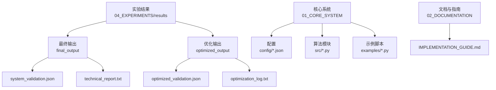
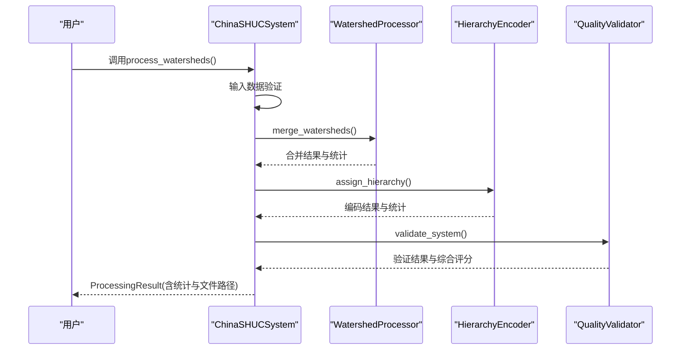
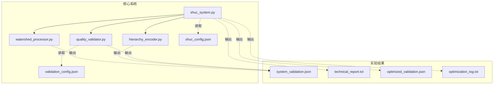

# 结果可视化与统计

<cite>
**本文引用的文件**   
- [README.md](file://README.md)
- [IMPLEMENTATION_GUIDE.md](file://02_DOCUMENTATION/IMPLEMENTATION_GUIDE.md)
- [shuc_system.py](file://01_CORE_SYSTEM/src/shuc_system.py)
- [watershed_processor.py](file://01_CORE_SYSTEM/src/watershed_processor.py)
- [hierarchy_encoder.py](file://01_CORE_SYSTEM/src/hierarchy_encoder.py)
- [quality_validator.py](file://01_CORE_SYSTEM/src/quality_validator.py)
- [shuc_config.json](file://01_CORE_SYSTEM/config/shuc_config.json)
- [validation_config.json](file://01_CORE_SYSTEM/config/validation_config.json)
- [system_validation.json](file://04_EXPERIMENTS/results/final_output/system_validation.json)
- [technical_report.txt](file://04_EXPERIMENTS/results/final_output/technical_report.txt)
- [optimized_validation.json](file://04_EXPERIMENTS/results/optimized_output/optimized_validation.json)
- [optimization_log.txt](file://04_EXPERIMENTS/results/optimized_output/optimization_log.txt)
- [basic_usage.py](file://01_CORE_SYSTEM/examples/basic_usage.py)
</cite>

## 目录
1. [简介](#简介)
2. [项目结构](#项目结构)
3. [核心组件](#核心组件)
4. [架构总览](#架构总览)
5. [详细组件分析](#详细组件分析)
6. [依赖关系分析](#依赖关系分析)
7. [性能考量](#性能考量)
8. [故障排查指南](#故障排查指南)
9. [结论](#结论)
10. [附录](#附录)

## 简介
本指南面向实验结果的可视化与统计分析，围绕中国SHUC流域分级编码系统在实验阶段产生的结果，提供图表制作方法（柱状图、饼图、散点图、热力图）、统计指标计算与解读（均值、方差、相关系数等）、参数敏感性与趋势分析、优化前后对比分析，以及结果导出与报告生成的自动化建议与工具推荐。文档同时结合系统核心模块与实验输出文件，给出可操作的实践路径。

## 项目结构
- 实验结果位于 04_EXPERIMENTS/results 下，包含最终输出与优化输出两类结果，涵盖验证报告、技术报告与日志。
- 核心系统位于 01_CORE_SYSTEM，包含配置、算法实现与示例脚本。
- 文档与实施指南位于 02_DOCUMENTATION，提供实验设计与图表制作的思路与模板。

**图表来源**
- [README.md:19-30](file://README.md#L19-L30)
- [system_validation.json:1-40](file://04_EXPERIMENTS/results/final_output/system_validation.json#L1-L40)
- [optimized_validation.json:1-47](file://04_EXPERIMENTS/results/optimized_output/optimized_validation.json#L1-L47)

**章节来源**
- [README.md:19-30](file://README.md#L19-L30)
- [README.md:75-88](file://README.md#L75-L88)

## 核心组件
- 中国SHUC系统主程序：集成数据预处理、智能合并、层次编码与质量验证，并输出处理结果与统计信息。
- 流域处理器：实现动态阈值计算、拓扑图构建与激进合并策略，输出合并统计与历史。
- 层次编码器：基于面积进行智能分级与配额优化，生成SHUC编码并统计各级别分布。
- 质量验证器：多维度质量评估（面积合规、编码唯一性、拓扑完整性、几何有效性），并计算加权综合评分与等级。

上述组件在主程序中按顺序调用，形成完整的处理流水线；配置文件控制处理策略与验证权重，实验输出文件承载统计结果与报告。

**章节来源**
- [shuc_system.py:92-164](file://01_CORE_SYSTEM/src/shuc_system.py#L92-L164)
- [watershed_processor.py:54-82](file://01_CORE_SYSTEM/src/watershed_processor.py#L54-L82)
- [hierarchy_encoder.py:69-96](file://01_CORE_SYSTEM/src/hierarchy_encoder.py#L69-L96)
- [quality_validator.py:61-87](file://01_CORE_SYSTEM/src/quality_validator.py#L61-L87)
- [shuc_config.json:1-43](file://01_CORE_SYSTEM/config/shuc_config.json#L1-L43)
- [validation_config.json:1-46](file://01_CORE_SYSTEM/config/validation_config.json#L1-L46)

## 架构总览

**图表来源**
- [shuc_system.py:92-164](file://01_CORE_SYSTEM/src/shuc_system.py#L92-L164)
- [watershed_processor.py:54-82](file://01_CORE_SYSTEM/src/watershed_processor.py#L54-L82)
- [hierarchy_encoder.py:69-96](file://01_CORE_SYSTEM/src/hierarchy_encoder.py#L69-L96)
- [quality_validator.py:61-87](file://01_CORE_SYSTEM/src/quality_validator.py#L61-L87)

## 详细组件分析

### 1) 实验结果与统计指标
- 最终输出（baseline）：包含系统验证报告与技术报告，提供合规率、压缩率、层次分布、质量评分等关键指标。
- 优化输出（enhanced）：包含优化验证报告、优化日志，展示阈值设定、迭代过程、合规率提升与评分变化。

常用指标与含义（以实验输出为准）：
- 面积合规率：达到或超过动态阈值的流域占比，反映合并效果与阈值自适应能力。
- 数据压缩率：原始数量到最终数量的压缩比例，衡量合并效率。
- 层次分布：各级别流域的数量与面积统计，体现编码体系的层次均衡性。
- 质量评分：多维度加权综合评分，用于整体质量评价与对比。

**章节来源**
- [system_validation.json:6-39](file://04_EXPERIMENTS/results/final_output/system_validation.json#L6-L39)
- [technical_report.txt:6-34](file://04_EXPERIMENTS/results/final_output/technical_report.txt#L6-L34)
- [optimized_validation.json:10-46](file://04_EXPERIMENTS/results/optimized_output/optimized_validation.json#L10-L46)
- [optimization_log.txt:1-1](file://04_EXPERIMENTS/results/optimized_output/optimization_log.txt#L1-L1)

### 2) 可视化图表制作方法
- 柱状图（对比分析）
  - 用途：对比不同阈值策略、不同实验组的面积合规率、压缩率、处理时间等。
  - 数据来源：实验结果CSV/JSON（可由对比实验脚本生成）。
  - 建议：X轴为实验组标签，Y轴为指标数值；添加误差条（若有多次重复实验）。

- 饼图（层次分布）
  - 用途：展示各级别流域在整体中的占比，直观呈现层次均衡性。
  - 数据来源：验证报告中的层次分布统计。
  - 建议：仅展示关键级别，避免过多细分导致可读性下降。

- 散点图（收敛与敏感性）
  - 用途：展示迭代过程中的合规率收敛曲线，或不同参数（如分位数）对合规率的影响。
  - 数据来源：合并历史与敏感性分析结果。
  - 建议：横轴为迭代轮次或参数值，纵轴为合规率；可叠加多条曲线对比不同策略。

- 热力图（参数扫描）
  - 用途：展示二维参数空间（如阈值与早停条件）对指标的影响。
  - 数据来源：批量实验结果矩阵。
  - 建议：颜色映射表示指标值，标注显著区域与最优组合。

注：本节为通用可视化方法说明，具体实现可参考实施指南中的图表生成模板与步骤。

**章节来源**
- [IMPLEMENTATION_GUIDE.md:514-527](file://02_DOCUMENTATION/IMPLEMENTATION_GUIDE.md#L514-L527)
- [IMPLEMENTATION_GUIDE.md:703-711](file://02_DOCUMENTATION/IMPLEMENTATION_GUIDE.md#L703-L711)

### 3) 统计指标计算与意义
- 均值（Mean）
  - 定义：各观测值之和除以观测数量。
  - 用途：描述集中趋势，常用于比较不同实验组的平均表现。
  - 注意：受异常值影响较大，需结合中位数与四分位数。

- 方差（Variance）与标准差（Standard Deviation）
  - 定义：衡量数据离散程度，方差为偏差平方的平均值，标准差为其平方根。
  - 用途：评估实验结果的稳定性与重现性；在多轮重复实验中尤为关键。

- 相关系数（Pearson/Spearman）
  - 定义：衡量两个变量线性（或单调）关系强度与方向。
  - 用途：探索参数与指标之间的关联，辅助参数选择与趋势预测。

- 分位数（Quantile）
  - 定义：将数据分为若干等份的数值点，如中位数（0.5）、四分位数（0.25/0.75）。
  - 用途：动态阈值计算与稳健统计，减少极端值影响。

- 敏感性分析
  - 方法：改变关键参数（如阈值分位数、早停条件、最大迭代次数），观察指标变化。
  - 结果：绘制参数-指标曲线或热力图，识别稳健区间与最优组合。

**章节来源**
- [watershed_processor.py:117-142](file://01_CORE_SYSTEM/src/watershed_processor.py#L117-L142)
- [quality_validator.py:124-140](file://01_CORE_SYSTEM/src/quality_validator.py#L124-L140)
- [IMPLEMENTATION_GUIDE.md:341-352](file://02_DOCUMENTATION/IMPLEMENTATION_GUIDE.md#L341-L352)

### 4) 参数设置与趋势分析
- 动态阈值策略
  - 计算方式：基于面积分布的分位数，采用自适应公式并加以上下限约束。
  - 趋势：在不同数据分布下自动调整阈值，提升合并效果与稳定性。

- 合并策略对比
  - 贪婪合并、随机合并与智能合并：通过对比不同策略的合规率、拓扑错误数与处理时间，评估策略优劣。

- 敏感性分析
  - 参数范围：阈值分位数（如0.70~0.90）、早停条件（70%~90%）、最大迭代次数（10~100）。
  - 方法：网格搜索或梯度扫描，记录每次实验的指标值，绘制趋势图与热力图。

- 趋势预测
  - 方法：基于历史迭代曲线拟合趋势（线性/多项式/样条），外推未来轮次的预期表现。
  - 注意：应结合早停机制与收敛性判断，避免过度外推。

**章节来源**
- [watershed_processor.py:117-142](file://01_CORE_SYSTEM/src/watershed_processor.py#L117-L142)
- [shuc_config.json:3-8](file://01_CORE_SYSTEM/config/shuc_config.json#L3-L8)
- [IMPLEMENTATION_GUIDE.md:316-352](file://02_DOCUMENTATION/IMPLEMENTATION_GUIDE.md#L316-L352)

### 5) 结果对比分析（优化前后）
- 指标对比
  - 合规率：优化后从较低水平提升至目标阈值以上，体现阈值策略的有效性。
  - 压缩率：优化后显著提高，表明更激进的合并策略提升了效率。
  - 质量评分：综合评分变化与质量等级改善，反映系统整体质量提升。

- 层次分布变化
  - 优化后可能降低基本单元数量，提升中高级别流域比例，改善层次均衡性。

- 日志与历史
  - 优化日志记录每轮合并次数与合规率变化，便于绘制收敛曲线与分析迭代过程。

**章节来源**
- [system_validation.json:6-39](file://04_EXPERIMENTS/results/final_output/system_validation.json#L6-L39)
- [optimized_validation.json:10-46](file://04_EXPERIMENTS/results/optimized_output/optimized_validation.json#L10-L46)
- [optimization_log.txt:1-1](file://04_EXPERIMENTS/results/optimized_output/optimization_log.txt#L1-L1)

### 6) 自动化脚本与工具推荐
- 实验设计与执行
  - 参考实施指南中的对比实验脚本模板，封装静态阈值、动态阈值与敏感性分析流程，自动保存结果与图表。
  - 输出：CSV/JSON结果文件、对比图表、实验报告。

- 可视化工具
  - Matplotlib/Seaborn：适用于柱状图、散点图、热力图与趋势图。
  - Plotly：交互式图表，便于报告展示与在线分享。
  - GeoPandas/ Folium：空间数据可视化（如流域分布与编码层级）。

- 报告生成
  - Markdown + Pandoc：将统计结果与图表整合为报告，支持LaTeX导出。
  - Jupyter Notebook：交互式分析与报告，便于复现实验流程。

- 数据导出
  - CSV/Excel：便于后续统计软件（如R/SPSS）进一步分析。
  - JSON：保留嵌套结构，便于前端可视化或API对接。

**章节来源**
- [IMPLEMENTATION_GUIDE.md:514-527](file://02_DOCUMENTATION/IMPLEMENTATION_GUIDE.md#L514-L527)
- [IMPLEMENTATION_GUIDE.md:529-530](file://02_DOCUMENTATION/IMPLEMENTATION_GUIDE.md#L529-L530)

## 依赖关系分析

**图表来源**
- [shuc_system.py:77-80](file://01_CORE_SYSTEM/src/shuc_system.py#L77-L80)
- [shuc_config.json:1-43](file://01_CORE_SYSTEM/config/shuc_config.json#L1-L43)
- [validation_config.json:1-46](file://01_CORE_SYSTEM/config/validation_config.json#L1-L46)
- [system_validation.json:1-40](file://04_EXPERIMENTS/results/final_output/system_validation.json#L1-L40)
- [optimized_validation.json:1-47](file://04_EXPERIMENTS/results/optimized_output/optimized_validation.json#L1-L47)

**章节来源**
- [shuc_system.py:77-80](file://01_CORE_SYSTEM/src/shuc_system.py#L77-L80)
- [shuc_config.json:1-43](file://01_CORE_SYSTEM/config/shuc_config.json#L1-L43)
- [validation_config.json:1-46](file://01_CORE_SYSTEM/config/validation_config.json#L1-L46)

## 性能考量
- 处理时间与资源
  - 合并策略与迭代次数直接影响处理时间；可通过早停条件与阈值约束控制收敛速度。
  - 并行处理与内存上限配置可在配置文件中调整，以平衡性能与稳定性。

- 收敛性与稳定性
  - 动态阈值有助于提升稳定性，减少极端阈值带来的不稳定合并行为。
  - 敏感性分析可帮助识别稳健参数区间，避免参数漂移导致的性能波动。

**章节来源**
- [shuc_config.json:38-42](file://01_CORE_SYSTEM/config/shuc_config.json#L38-L42)
- [watershed_processor.py:175-220](file://01_CORE_SYSTEM/src/watershed_processor.py#L175-L220)

## 故障排查指南
- 输入数据问题
  - 现象：输入数据验证失败、空数据、字段缺失。
  - 处理：检查Shapefile完整性与必需字段，修复自引用与无效几何问题。

- 合并失败或拓扑错误
  - 现象：合并后拓扑关系异常、环形引用、孤立流域。
  - 处理：检查上游引用字段与几何有效性，修复无效几何并重新验证。

- 验证不通过
  - 现象：面积合规率未达阈值、编码唯一性不足、几何有效性低。
  - 处理：调整阈值策略、优化合并策略、增加早停条件或扩大迭代次数。

- 结果导出与报告
  - 现象：输出文件缺失、统计信息不完整。
  - 处理：确认输出目录权限与配置项，检查保存逻辑与异常捕获。

**章节来源**
- [shuc_system.py:165-196](file://01_CORE_SYSTEM/src/shuc_system.py#L165-L196)
- [watershed_processor.py:97-115](file://01_CORE_SYSTEM/src/watershed_processor.py#L97-L115)
- [quality_validator.py:191-253](file://01_CORE_SYSTEM/src/quality_validator.py#L191-L253)
- [quality_validator.py:334-366](file://01_CORE_SYSTEM/src/quality_validator.py#L334-L366)

## 结论
通过系统化的实验设计、严谨的统计分析与多样化的可视化手段，可以有效评估与展示SHUC系统的实验结果。动态阈值策略与智能合并框架在提升面积合规率与压缩效率方面表现优异；结合敏感性分析与趋势预测，能够为参数选择与优化提供科学依据。建议在报告生成与自动化脚本中持续沉淀实验流程与可视化模板，以支撑后续扩展实验与论文撰写。

## 附录
- 快速开始与示例
  - 使用基础示例脚本运行系统，查看处理摘要与输出文件，熟悉结果结构。
- 实验设计模板
  - 参考实施指南中的对比实验设计与脚本模板，快速搭建自动化实验流程。
- 配置参考
  - 根据实验目标调整处理策略、验证权重与输出选项，确保结果可复现与可对比。

**章节来源**
- [basic_usage.py:25-74](file://01_CORE_SYSTEM/examples/basic_usage.py#L25-L74)
- [IMPLEMENTATION_GUIDE.md:309-352](file://02_DOCUMENTATION/IMPLEMENTATION_GUIDE.md#L309-L352)
- [shuc_config.json:1-43](file://01_CORE_SYSTEM/config/shuc_config.json#L1-L43)
- [validation_config.json:1-46](file://01_CORE_SYSTEM/config/validation_config.json#L1-L46)