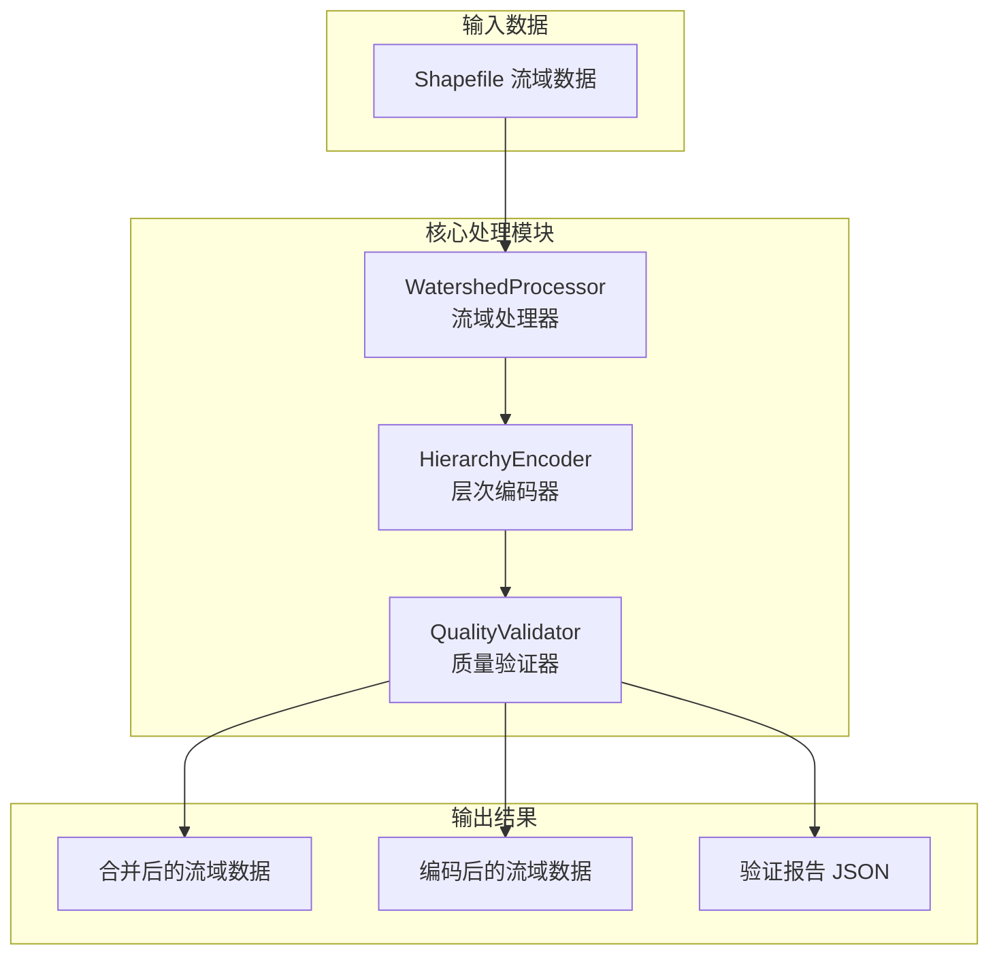
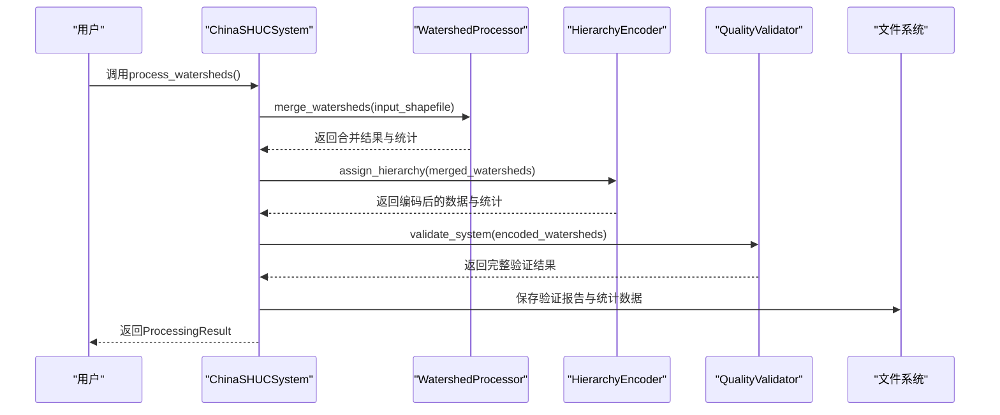
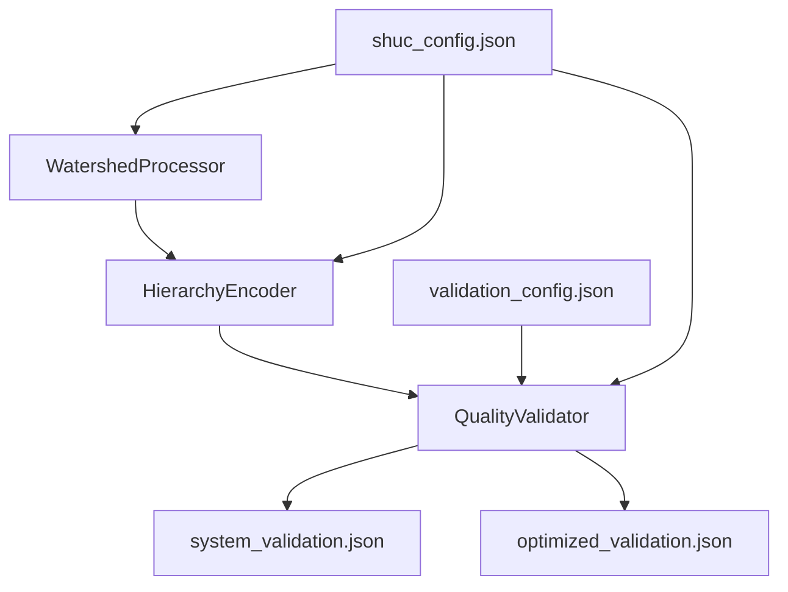

# 验证报告分析

<cite>
**本文档引用的文件**
- [system_validation.json](file://04_EXPERIMENTS/results/final_output/system_validation.json)
- [optimized_validation.json](file://04_EXPERIMENTS/results/optimized_output/optimized_validation.json)
- [validation_config.json](file://01_CORE_SYSTEM/config/validation_config.json)
- [shuc_config.json](file://01_CORE_SYSTEM/config/shuc_config.json)
- [huc_standards.json](file://05_DATA/reference/huc_standards.json)
- [quality_validator.py](file://01_CORE_SYSTEM/src/quality_validator.py)
- [watershed_processor.py](file://01_CORE_SYSTEM/src/watershed_processor.py)
- [hierarchy_encoder.py](file://01_CORE_SYSTEM/src/hierarchy_encoder.py)
- [shuc_system.py](file://01_CORE_SYSTEM/src/shuc_system.py)
- [utils.py](file://01_CORE_SYSTEM/src/utils.py)
</cite>

## 目录
1. [简介](#简介)
2. [项目结构](#项目结构)
3. [核心组件](#核心组件)
4. [架构概览](#架构概览)
5. [详细组件分析](#详细组件分析)
6. [依赖关系分析](#依赖关系分析)
7. [性能考量](#性能考量)
8. [故障排除指南](#故障排除指南)
9. [结论](#结论)
10. [附录](#附录)

## 简介
本文件针对SHUC系统验证报告进行深入分析，重点解释system_validation.json文件中的各项指标含义与计算方法，涵盖压缩率、面积合规性、编码唯一性、层次分布等关键指标。同时，分析验证报告中的质量评估结果，解释各项通过标准与不通过原因，并提供验证分数的计算公式与评分标准。通过对最终输出与优化输出的对比分析，说明为何某些指标未达到目标值，并给出改进建议与优化策略，帮助用户理解如何提升系统性能与质量。

## 项目结构
SHUC系统采用模块化设计，核心流程包括数据预处理、智能合并、层次编码与质量验证四个阶段。验证报告由质量验证器生成，包含系统层面的综合评估与详细指标统计。

**图表来源**
- [shuc_system.py:92-160](file://01_CORE_SYSTEM/src/shuc_system.py#L92-L160)
- [watershed_processor.py:54-81](file://01_CORE_SYSTEM/src/watershed_processor.py#L54-L81)
- [hierarchy_encoder.py:69-95](file://01_CORE_SYSTEM/src/hierarchy_encoder.py#L69-L95)
- [quality_validator.py:61-86](file://01_CORE_SYSTEM/src/quality_validator.py#L61-L86)

**章节来源**
- [shuc_system.py:92-160](file://01_CORE_SYSTEM/src/shuc_system.py#L92-L160)
- [watershed_processor.py:54-81](file://01_CORE_SYSTEM/src/watershed_processor.py#L54-L81)
- [hierarchy_encoder.py:69-95](file://01_CORE_SYSTEM/src/hierarchy_encoder.py#L69-L95)
- [quality_validator.py:61-86](file://01_CORE_SYSTEM/src/quality_validator.py#L61-L86)

## 核心组件
本节概述验证报告涉及的关键组件及其职责：
- 流域处理器：执行智能合并，计算动态阈值，维护拓扑关系，生成压缩率与合并统计。
- 层次编码器：基于面积分配层次，生成SHUC编码，统计各级别分布。
- 质量验证器：执行多维度质量验证，计算各项指标与总体评分，生成详细报告。

**章节来源**
- [watershed_processor.py:24-53](file://01_CORE_SYSTEM/src/watershed_processor.py#L24-L53)
- [hierarchy_encoder.py:22-67](file://01_CORE_SYSTEM/src/hierarchy_encoder.py#L22-L67)
- [quality_validator.py:24-60](file://01_CORE_SYSTEM/src/quality_validator.py#L24-L60)

## 架构概览
SHUC系统验证报告的生成遵循以下流程：输入数据经由流域处理器进行合并与拓扑优化，随后由层次编码器分配层级并生成编码，最后由质量验证器进行全面质量评估，输出system_validation.json与优化版的optimized_validation.json。

**图表来源**
- [shuc_system.py:92-160](file://01_CORE_SYSTEM/src/shuc_system.py#L92-L160)
- [watershed_processor.py:54-81](file://01_CORE_SYSTEM/src/watershed_processor.py#L54-L81)
- [hierarchy_encoder.py:69-95](file://01_CORE_SYSTEM/src/hierarchy_encoder.py#L69-L95)
- [quality_validator.py:61-86](file://01_CORE_SYSTEM/src/quality_validator.py#L61-L86)

## 详细组件分析

### 压缩率指标分析
压缩率用于衡量处理前后流域数量的变化程度，反映合并效果与数据精简程度。

- 计算方法
  - 压缩率 = (处理前数量 - 处理后数量) / 处理前数量 × 100%
  - 在最终输出中，处理前数量为140，处理后数量为69，压缩率为约50.7%
  - 在优化输出中，处理前数量为140，处理后数量为20，压缩率为85.7%

- 指标意义
  - 反映合并策略的有效性与数据冗余程度
  - 优化输出显著提升压缩率，表明更激进的合并策略与动态阈值调整取得成效

- 通过标准
  - 验证配置中未设定压缩率阈值，但系统通过合并策略与动态阈值控制实现高效压缩

**章节来源**
- [watershed_processor.py:210-220](file://01_CORE_SYSTEM/src/watershed_processor.py#L210-L220)
- [system_validation.json:3-5](file://04_EXPERIMENTS/results/final_output/system_validation.json#L3-L5)
- [optimized_validation.json:7-8](file://04_EXPERIMENTS/results/optimized_output/optimized_validation.json#L7-L8)

### 面积合规性指标分析
面积合规性用于评估流域面积是否满足预设阈值，确保系统输出的流域具备合理的规模。

- 计算方法
  - 动态阈值 = Q75 + (Q90 - Q75) / 2，约束在[50, 100]区间内
  - 合规率 = 符合面积阈值的流域数量 / 总流域数量
  - 在最终输出中，合规率为5.8%，未达到目标；在优化输出中，合规率为90.0%，达到目标

- 指标意义
  - 反映合并策略对面积分布的影响
  - 动态阈值自动适应数据分布，避免固定阈值导致的偏差

- 通过标准
  - 验证阈值为0.80，优化输出达到90.0%，超过阈值；最终输出仅5.8%，未达标

- 不通过原因分析
  - 初始数据中存在大量小面积流域，动态阈值计算后仍无法满足合规要求
  - 合并策略可能过于保守或阈值设置不当

**章节来源**
- [watershed_processor.py:117-141](file://01_CORE_SYSTEM/src/watershed_processor.py#L117-L141)
- [quality_validator.py:100-122](file://01_CORE_SYSTEM/src/quality_validator.py#L100-L122)
- [validation_config.json:2-8](file://01_CORE_SYSTEM/config/validation_config.json#L2-L8)
- [system_validation.json:6-11](file://04_EXPERIMENTS/results/final_output/system_validation.json#L6-L11)
- [optimized_validation.json:10-16](file://04_EXPERIMENTS/results/optimized_output/optimized_validation.json#L10-L16)

### 编码唯一性指标分析
编码唯一性用于验证生成的SHUC编码是否具有唯一性，确保每个流域拥有唯一的标识符。

- 计算方法
  - 唯一性 = 唯一编码数量 / 总编码数量
  - 在最终输出与优化输出中，唯一性均为100%，无重复编码

- 指标意义
  - 反映编码生成算法的正确性与数据完整性
  - 唯一性是编码系统的基础要求

- 通过标准
  - 验证阈值为1.00，两者均满足要求

**章节来源**
- [hierarchy_encoder.py:177-201](file://01_CORE_SYSTEM/src/hierarchy_encoder.py#L177-L201)
- [quality_validator.py:142-168](file://01_CORE_SYSTEM/src/quality_validator.py#L142-L168)
- [validation_config.json:16-21](file://01_CORE_SYSTEM/config/validation_config.json#L16-L21)
- [system_validation.json:12-17](file://04_EXPERIMENTS/results/final_output/system_validation.json#L12-L17)
- [optimized_validation.json:17-21](file://04_EXPERIMENTS/results/optimized_output/optimized_validation.json#L17-L21)

### 层次分布指标分析
层次分布用于展示不同层级的流域数量与面积统计，评估层次结构的合理性与平衡性。

- 计算方法
  - 层级数量统计：按shuc_level分组计数
  - 面积统计：各层级的最小、最大、平均面积
  - 在最终输出中，全部为level_6；在优化输出中，包含level_4、level_5、level_6

- 指标意义
  - 反映层次结构的完整性与多样性
  - 优化输出形成更完整的4-6级层次结构，提升系统表达能力

- 通过标准
  - 验证配置中未设定层次分布阈值，但系统通过配额管理与面积分配实现合理的层次结构

**章节来源**
- [hierarchy_encoder.py:113-138](file://01_CORE_SYSTEM/src/hierarchy_encoder.py#L113-L138)
- [hierarchy_encoder.py:204-212](file://01_CORE_SYSTEM/src/hierarchy_encoder.py#L204-L212)
- [quality_validator.py:286-319](file://01_CORE_SYSTEM/src/quality_validator.py#L286-L319)
- [system_validation.json:18-25](file://04_EXPERIMENTS/results/final_output/system_validation.json#L18-L25)
- [optimized_validation.json:22-41](file://04_EXPERIMENTS/results/optimized_output/optimized_validation.json#L22-L41)

### 质量评估结果与评分标准
质量评估结果包含多维度指标与总体评分，用于综合评价系统输出质量。

- 计算方法
  - 各维度评分 = 对应指标值 × 100
  - 总体评分 = Σ(各维度评分 × 权重)
  - 权重分配：面积合规性40%、编码质量30%、拓扑完整性20%、几何有效性10%
  - 在最终输出中，总体评分为52.9分；在优化输出中，总体评分为50.0分

- 评分等级
  - 优秀：≥90分
  - 良好：80-89分
  - 可接受：70-79分
  - 需要改进：<70分

- 通过标准
  - 验证配置中未设定总体评分阈值，但系统通过权重分配与指标阈值共同决定质量等级

**章节来源**
- [quality_validator.py:368-411](file://01_CORE_SYSTEM/src/quality_validator.py#L368-L411)
- [validation_config.json:9-14](file://01_CORE_SYSTEM/config/validation_config.json#L9-L14)
- [system_validation.json:36-39](file://04_EXPERIMENTS/results/final_output/system_validation.json#L36-L39)
- [optimized_validation.json:42-46](file://04_EXPERIMENTS/results/optimized_output/optimized_validation.json#L42-L46)

### 与预期目标的对比分析
- 面积合规性目标：验证阈值为0.80，优化输出达到90.0%，超过目标；最终输出仅5.8%，远未达标
- 编码唯一性目标：阈值为1.00，两者均满足
- 层次完整性目标：验证阈值为0.95，报告中未直接体现该指标的具体数值
- 几何有效性目标：验证阈值为0.95，报告中未直接体现该指标的具体数值

- 未达目标的原因
  - 最终输出的动态阈值计算导致大量小面积流域未达标
  - 合并策略可能过于保守，未能有效提升合规率
  - 数据本身存在大量小面积流域，难以通过单一阈值统一解决

**章节来源**
- [validation_config.json:2-8](file://01_CORE_SYSTEM/config/validation_config.json#L2-L8)
- [huc_standards.json:129-149](file://05_DATA/reference/huc_standards.json#L129-L149)
- [system_validation.json:6-11](file://04_EXPERIMENTS/results/final_output/system_validation.json#L6-L11)
- [optimized_validation.json:10-16](file://04_EXPERIMENTS/results/optimized_output/optimized_validation.json#L10-L16)

### 改进建议与优化策略
- 调整动态阈值策略
  - 引入更灵活的阈值计算方法，结合数据分布与业务需求动态调整
  - 考虑设置最小阈值下限，避免过低阈值导致大量小面积流域

- 优化合并策略
  - 增强合并规则，优先合并相邻且面积较小的流域
  - 引入质量评估反馈机制，根据合规率动态调整合并强度

- 层次结构优化
  - 调整各级别面积阈值，使其更贴合中国地理环境
  - 引入层次配额管理，控制各级别流域数量比例

- 质量监控与预警
  - 建立实时质量监控机制，及时发现并处理异常数据
  - 提供可视化报告，帮助用户直观了解系统状态

**章节来源**
- [watershed_processor.py:117-141](file://01_CORE_SYSTEM/src/watershed_processor.py#L117-L141)
- [hierarchy_encoder.py:52-67](file://01_CORE_SYSTEM/src/hierarchy_encoder.py#L52-L67)
- [quality_validator.py:368-411](file://01_CORE_SYSTEM/src/quality_validator.py#L368-L411)

## 依赖关系分析
SHUC系统各组件之间存在明确的依赖关系，验证报告的生成依赖于核心处理模块的输出。

**图表来源**
- [shuc_system.py:77-79](file://01_CORE_SYSTEM/src/shuc_system.py#L77-L79)
- [quality_validator.py:35-60](file://01_CORE_SYSTEM/src/quality_validator.py#L35-L60)
- [watershed_processor.py:35-53](file://01_CORE_SYSTEM/src/watershed_processor.py#L35-L53)
- [hierarchy_encoder.py:32-67](file://01_CORE_SYSTEM/src/hierarchy_encoder.py#L32-L67)

**章节来源**
- [shuc_system.py:77-79](file://01_CORE_SYSTEM/src/shuc_system.py#L77-L79)
- [quality_validator.py:35-60](file://01_CORE_SYSTEM/src/quality_validator.py#L35-L60)
- [watershed_processor.py:35-53](file://01_CORE_SYSTEM/src/watershed_processor.py#L35-L53)
- [hierarchy_encoder.py:32-67](file://01_CORE_SYSTEM/src/hierarchy_encoder.py#L32-L67)

## 性能考量
- 处理效率
  - 合并策略采用网络图构建与迭代优化，复杂度与数据规模相关
  - 动态阈值计算基于分位数统计，适合大规模数据集

- 内存使用
  - 系统配置中设置了最大内存使用限制，避免内存溢出
  - 建议在处理超大数据集时启用并行处理与分块处理

- 可扩展性
  - 模块化设计便于功能扩展与性能优化
  - 建议引入缓存机制与增量处理，提升处理速度

## 故障排除指南
- 输入数据问题
  - 检查Shapefile文件是否存在且可读
  - 确认必需字段（如LINKNO、DSLINKNO1、USLINKNO2）是否存在
  - 修复无效几何与自引用问题

- 配置参数调整
  - 根据数据特征调整合并策略与阈值参数
  - 优化层次配额与面积阈值，提升层次结构合理性

- 性能优化
  - 监控内存使用情况，必要时降低并发度
  - 使用索引优化查询性能，减少重复计算

**章节来源**
- [utils.py:159-221](file://01_CORE_SYSTEM/src/utils.py#L159-L221)
- [watershed_processor.py:97-115](file://01_CORE_SYSTEM/src/watershed_processor.py#L97-L115)
- [shuc_system.py:165-196](file://01_CORE_SYSTEM/src/shuc_system.py#L165-L196)

## 结论
SHUC系统的验证报告提供了全面的质量评估，涵盖了压缩率、面积合规性、编码唯一性与层次分布等多个维度。通过对比最终输出与优化输出，可以看出优化策略在提升压缩率与面积合规性方面取得了显著成效。然而，部分指标仍未达到预期目标，需要进一步优化动态阈值策略、合并规则与层次结构设计。建议用户根据实际业务需求调整配置参数，并建立持续的质量监控机制，以确保系统输出的稳定性与可靠性。

## 附录
- 指标计算公式速查
  - 压缩率 = (处理前数量 - 处理后数量) / 处理前数量 × 100%
  - 动态阈值 = Q75 + (Q90 - Q75) / 2（约束在[50, 100]）
  - 合规率 = 符合面积阈值的流域数量 / 总流域数量
  - 唯一性 = 唯一编码数量 / 总编码数量
  - 总体评分 = Σ(各维度评分 × 权重)

- 评分等级对照
  - 优秀：≥90分
  - 良好：80-89分
  - 可接受：70-79分
  - 需要改进：<70分