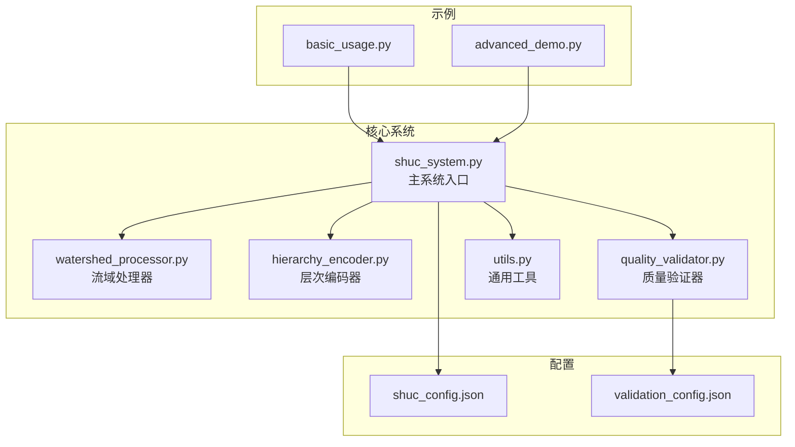
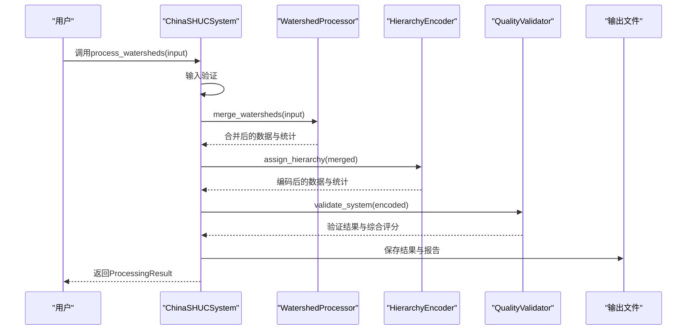
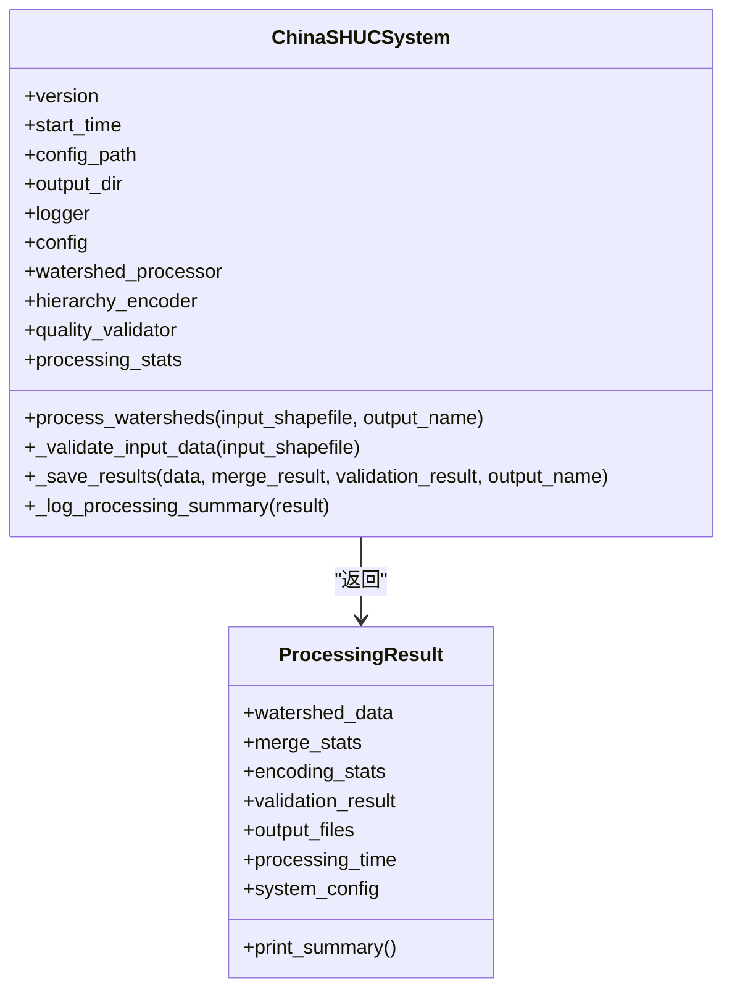
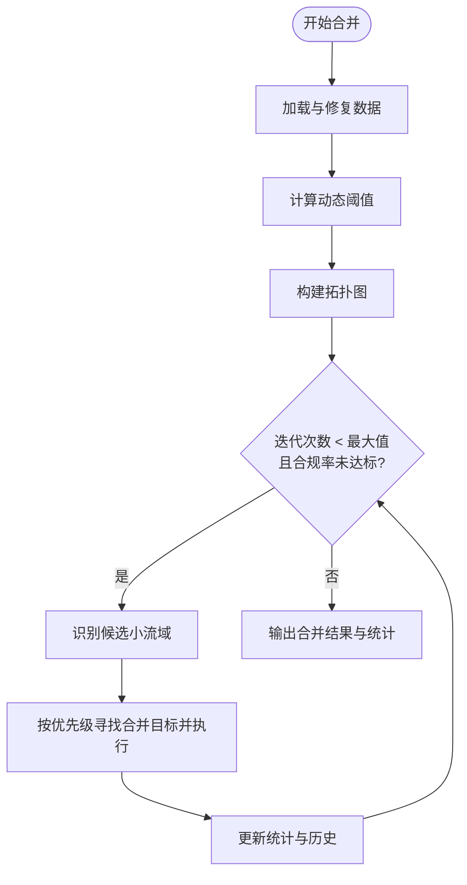
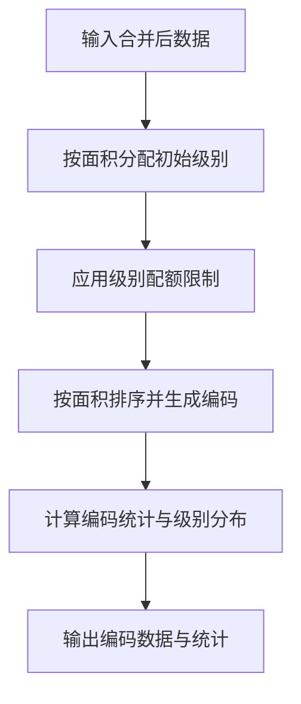
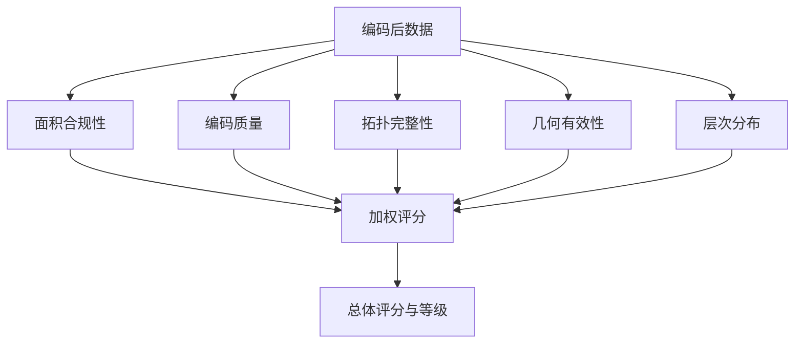
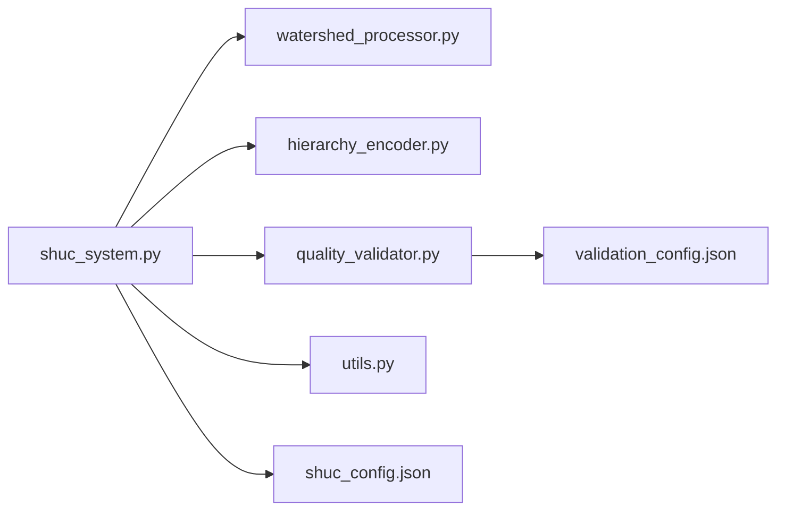

# 代码结构与模块职责

<cite>
**本文引用的文件**
- [shuc_system.py](file://01_CORE_SYSTEM/src/shuc_system.py)
- [watershed_processor.py](file://01_CORE_SYSTEM/src/watershed_processor.py)
- [hierarchy_encoder.py](file://01_CORE_SYSTEM/src/hierarchy_encoder.py)
- [quality_validator.py](file://01_CORE_SYSTEM/src/quality_validator.py)
- [utils.py](file://01_CORE_SYSTEM/src/utils.py)
- [shuc_config.json](file://01_CORE_SYSTEM/config/shuc_config.json)
- [validation_config.json](file://01_CORE_SYSTEM/config/validation_config.json)
- [basic_usage.py](file://01_CORE_SYSTEM/examples/basic_usage.py)
- [advanced_demo.py](file://01_CORE_SYSTEM/examples/advanced_demo.py)
- [README.md](file://README.md)
- [requirements.txt](file://01_CORE_SYSTEM/requirements.txt)
</cite>

## 目录
1. [简介](#简介)
2. [项目结构](#项目结构)
3. [核心组件](#核心组件)
4. [架构总览](#架构总览)
5. [详细组件分析](#详细组件分析)
6. [依赖关系分析](#依赖关系分析)
7. [性能考量](#性能考量)
8. [故障排查指南](#故障排查指南)
9. [结论](#结论)
10. [附录](#附录)

## 简介
本文件面向SHUC（中国流域分级统一编码）系统的开发者与使用者，系统性梳理核心模块的职责边界、交互关系与数据流，解释主系统类ChinaSHUCSystem的设计模式与模块化优势，并给出类图、组件图与流程图，帮助读者快速理解与扩展该系统。

## 项目结构
系统采用“核心模块 + 配置 + 示例 + 文档”的清晰分层：
- 核心模块位于01_CORE_SYSTEM/src，包含主系统、流域处理器、层次编码器、质量验证器与通用工具。
- 配置位于01_CORE_SYSTEM/config，分别定义处理、层次与验证的参数。
- 示例位于01_CORE_SYSTEM/examples，提供基础与高级使用范例。
- README与requirements.txt提供项目背景与依赖说明。

**图表来源**
- [shuc_system.py:1-335](file://01_CORE_SYSTEM/src/shuc_system.py#L1-L335)
- [watershed_processor.py:1-377](file://01_CORE_SYSTEM/src/watershed_processor.py#L1-L377)
- [hierarchy_encoder.py:1-219](file://01_CORE_SYSTEM/src/hierarchy_encoder.py#L1-L219)
- [quality_validator.py:1-411](file://01_CORE_SYSTEM/src/quality_validator.py#L1-L411)
- [utils.py:1-360](file://01_CORE_SYSTEM/src/utils.py#L1-L360)
- [shuc_config.json:1-43](file://01_CORE_SYSTEM/config/shuc_config.json#L1-L43)
- [validation_config.json:1-46](file://01_CORE_SYSTEM/config/validation_config.json#L1-L46)
- [basic_usage.py:1-106](file://01_CORE_SYSTEM/examples/basic_usage.py#L1-L106)
- [advanced_demo.py:1-272](file://01_CORE_SYSTEM/examples/advanced_demo.py#L1-L272)

**章节来源**
- [README.md:1-88](file://README.md#L1-L88)
- [requirements.txt:1-46](file://01_CORE_SYSTEM/requirements.txt#L1-L46)

## 核心组件
- ChinaSHUCSystem：主控制器，协调数据预处理、智能合并、层次编码与质量验证，并负责结果持久化与统计汇总。
- WatershedProcessor：实现动态阈值计算、拓扑图构建与激进合并策略，保障面积合规率与拓扑一致性。
- HierarchyEncoder：基于面积的智能分级与配额优化，生成4-6级SHUC编码，统计各级别分布。
- QualityValidator：多维质量评估（面积合规、编码唯一性、拓扑完整性、几何有效性），综合评分与等级判定。
- Utils：日志、配置加载、文件与数据校验、时间计算等通用能力。

**章节来源**
- [shuc_system.py:43-91](file://01_CORE_SYSTEM/src/shuc_system.py#L43-L91)
- [watershed_processor.py:24-53](file://01_CORE_SYSTEM/src/watershed_processor.py#L24-L53)
- [hierarchy_encoder.py:22-67](file://01_CORE_SYSTEM/src/hierarchy_encoder.py#L22-L67)
- [quality_validator.py:24-60](file://01_CORE_SYSTEM/src/quality_validator.py#L24-L60)
- [utils.py:24-147](file://01_CORE_SYSTEM/src/utils.py#L24-L147)

## 架构总览
系统采用“流水线式”模块化设计，主系统按步骤调用各子模块，形成清晰的数据流与控制流。

**图表来源**
- [shuc_system.py:92-164](file://01_CORE_SYSTEM/src/shuc_system.py#L92-L164)
- [watershed_processor.py:54-81](file://01_CORE_SYSTEM/src/watershed_processor.py#L54-L81)
- [hierarchy_encoder.py:69-95](file://01_CORE_SYSTEM/src/hierarchy_encoder.py#L69-L95)
- [quality_validator.py:61-86](file://01_CORE_SYSTEM/src/quality_validator.py#L61-L86)

## 详细组件分析

### ChinaSHUCSystem 设计与职责
- 设计模式：组合/装配模式 + 流水线控制流
- 职责边界：
  - 生命周期管理：初始化、日志、配置加载、输出目录准备。
  - 控制流编排：按步骤调用各子模块，组装ProcessingResult。
  - 结果持久化：保存编码后的流域、验证报告与统计信息。
  - 统计与摘要：记录处理时间、合规率、压缩率、系统评分等。
- 关键接口：
  - process_watersheds：主处理入口。
  - _validate_input_data：输入数据校验。
  - _save_results：结果落盘。
  - _log_processing_summary：处理摘要日志。

**图表来源**
- [shuc_system.py:43-286](file://01_CORE_SYSTEM/src/shuc_system.py#L43-L286)

**章节来源**
- [shuc_system.py:43-286](file://01_CORE_SYSTEM/src/shuc_system.py#L43-L286)

### WatershedProcessor 模块
- 职责边界：
  - 数据加载与修复：读取shapefile、补全面积字段、修复自引用与无效几何。
  - 动态阈值计算：基于分位数的自适应阈值，保证不同区域的适用性。
  - 拓扑图构建：基于上下游字段构建有向图，维护拓扑关系。
  - 激进合并策略：迭代合并小流域，早停条件与合并历史追踪。
  - 合规率统计：计算最终面积合规率与压缩率。
- 关键算法：
  - 动态阈值：Q75 + (Q90-Q75)/2，约束在合理区间。
  - 合并优先级：下游 > 上游 > 相邻 > 最近。
- 复杂度分析：
  - 阈值计算与合规率：O(n)。
  - 合并迭代：最坏O(n^2)，实际受拓扑与阈值约束显著降低。
  - 图构建：O(n + e)，e为边数。

**图表来源**
- [watershed_processor.py:54-220](file://01_CORE_SYSTEM/src/watershed_processor.py#L54-L220)

**章节来源**
- [watershed_processor.py:24-377](file://01_CORE_SYSTEM/src/watershed_processor.py#L24-L377)

### HierarchyEncoder 模块
- 职责边界：
  - 初始层次分配：基于面积阈值分配4-6级。
  - 配额优化：根据级别配额限制，将超配额小流域降级。
  - 编码生成：按级别分配唯一编码，支持溢出标识。
  - 统计分析：各级别数量、面积统计、编码唯一性率、级别范围。
- 关键机制：
  - 分级标准：2/4/6/8/10/12位编码对应不同最小面积阈值。
  - 配额策略：4级3个、5级8个、6级无限制，优先保留大流域。
- 复杂度分析：
  - 分配与优化：O(n)。
  - 编码生成：O(n log n)（排序）。
  - 统计：O(n)。

**图表来源**
- [hierarchy_encoder.py:69-219](file://01_CORE_SYSTEM/src/hierarchy_encoder.py#L69-L219)

**章节来源**
- [hierarchy_encoder.py:22-219](file://01_CORE_SYSTEM/src/hierarchy_encoder.py#L22-L219)

### QualityValidator 模块
- 职责边界：
  - 面积合规性：动态阈值计算与合规率统计，面积分布分析。
  - 编码质量：唯一性、格式合法性、重复编码统计。
  - 拓扑完整性：上游/下游字段存在性、有效/无效引用、孤立点、循环引用。
  - 几何有效性：空几何、无效几何、几何类型统计。
  - 层次分析：各级别分布、范围、均匀性。
  - 综合评分：加权计算总体得分与等级。
- 关键指标：
  - 权重：面积合规40%、编码质量30%、拓扑完整性20%、几何有效性10%。
  - 阈值：面积合规≥80%，编码唯一性100%，拓扑完整性≥95%。
- 复杂度分析：
  - 各项验证：O(n)。
  - 综合评分：O(1)。

**图表来源**
- [quality_validator.py:61-411](file://01_CORE_SYSTEM/src/quality_validator.py#L61-L411)

**章节来源**
- [quality_validator.py:24-411](file://01_CORE_SYSTEM/src/quality_validator.py#L24-L411)

### Utils 工具模块
- 职责边界：
  - 日志：控制台与文件双重输出，格式化时间戳与级别。
  - 配置：默认配置、深度合并、缺失时自动创建默认配置。
  - 文件与数据：shapefile验证、目录确保、文件大小格式化、处理时间计算。
  - 结果导出：处理摘要JSON导出。
  - 环境检查：Python版本与依赖包检查。
- 设计要点：
  - 配置优先级：用户配置覆盖默认配置。
  - 异常安全：配置加载失败回退默认配置并提示。

**章节来源**
- [utils.py:24-360](file://01_CORE_SYSTEM/src/utils.py#L24-L360)

## 依赖关系分析
- 模块内聚与耦合：
  - ChinaSHUCSystem对三个核心模块进行组合装配，耦合度低，职责清晰。
  - 各核心模块内部高度内聚，算法与数据结构分离明确。
- 外部依赖：
  - GeoPandas/NetworkX/Shapely/Numpy/Pandas/SciPy等科学计算与空间处理库。
  - 可选依赖：Matplotlib、Seaborn、Numba、Joblib等用于可视化与性能优化。
- 配置驱动：
  - 通过shuc_config.json与validation_config.json控制行为，便于扩展与定制。

**图表来源**
- [shuc_system.py:38-80](file://01_CORE_SYSTEM/src/shuc_system.py#L38-L80)
- [shuc_config.json:1-43](file://01_CORE_SYSTEM/config/shuc_config.json#L1-L43)
- [validation_config.json:1-46](file://01_CORE_SYSTEM/config/validation_config.json#L1-L46)

**章节来源**
- [requirements.txt:1-46](file://01_CORE_SYSTEM/requirements.txt#L1-L46)

## 性能考量
- 时间复杂度：
  - 合并阶段：O(n^2)最坏，受阈值与拓扑约束显著降低。
  - 编码阶段：O(n log n)（排序）。
  - 验证阶段：O(n)。
- 空间复杂度：
  - 主要由GeoDataFrame与拓扑图占用，通常与n线性相关。
- 优化建议：
  - 合理设置最大迭代次数与早停阈值，避免无进展循环。
  - 使用更高效的几何合并与拓扑查询（如R-tree）可进一步提升性能。
  - 在大规模数据上启用并行处理（可选依赖）。

[本节为通用性能讨论，无需特定文件引用]

## 故障排查指南
- 常见问题与定位：
  - 输入数据缺失或不可读：检查shapefile是否存在、字段是否完整、坐标系是否正确。
  - 合并后合规率偏低：调整目标合规率、合并策略或阈值参数；检查拓扑字段是否有效。
  - 编码冲突或唯一性不足：检查编码位数与级别配额，必要时扩大位数或放宽配额。
  - 几何无效：修复无效几何、自相交或空几何；确保投影一致。
- 排查步骤：
  - 使用utils.validate_shapefile进行快速验证。
  - 查看processing_log.txt与validation_report.json。
  - 检查配置文件是否正确加载与合并。
- 相关实现参考：
  - 输入验证与日志：[shuc_system.py:165-196](file://01_CORE_SYSTEM/src/shuc_system.py#L165-L196)、[utils.py:159-221](file://01_CORE_SYSTEM/src/utils.py#L159-L221)
  - 配置加载与默认值：[utils.py:64-99](file://01_CORE_SYSTEM/src/utils.py#L64-L99)、[utils.py:101-126](file://01_CORE_SYSTEM/src/utils.py#L101-L126)
  - 验证器异常与评分：[quality_validator.py:368-411](file://01_CORE_SYSTEM/src/quality_validator.py#L368-L411)

**章节来源**
- [shuc_system.py:165-237](file://01_CORE_SYSTEM/src/shuc_system.py#L165-L237)
- [utils.py:64-221](file://01_CORE_SYSTEM/src/utils.py#L64-L221)
- [quality_validator.py:368-411](file://01_CORE_SYSTEM/src/quality_validator.py#L368-L411)

## 结论
SHUC系统通过模块化设计实现了清晰的职责分离与可扩展的流水线处理。主系统类ChinaSHUCSystem以组合模式协调三大核心模块，配合配置驱动与工具模块，既保证了算法的稳定性，也为后续扩展（如分布式处理、性能优化）提供了良好基础。建议在生产环境中结合配置文件与验证报告持续优化参数，确保在不同区域与尺度下的稳健表现。

[本节为总结性内容，无需特定文件引用]

## 附录

### 使用示例与入口
- 基础使用：examples/basic_usage.py展示了从初始化到结果摘要的完整流程。
- 高级演示：examples/advanced_demo.py演示了自定义配置、数据质量分析与策略对比。

**章节来源**
- [basic_usage.py:25-74](file://01_CORE_SYSTEM/examples/basic_usage.py#L25-L74)
- [advanced_demo.py:31-61](file://01_CORE_SYSTEM/examples/advanced_demo.py#L31-L61)

### 配置说明
- shuc_config.json：控制处理、层次与验证的参数，支持动态阈值、级别配额与输出选项。
- validation_config.json：定义验证阈值、权重与质量等级映射。

**章节来源**
- [shuc_config.json:1-43](file://01_CORE_SYSTEM/config/shuc_config.json#L1-L43)
- [validation_config.json:1-46](file://01_CORE_SYSTEM/config/validation_config.json#L1-L46)

### 代码注释与命名规范
- 类与方法注释：采用三重引号docstring，描述职责、参数与返回值。
- 变量命名：采用snake_case，清晰表达语义（如merge_strategy、target_compliance_rate）。
- 日志格式：统一的时间戳与级别格式，便于审计与问题定位。
- 配置键命名：采用小写加下划线，与JSON键保持一致。

**章节来源**
- [shuc_system.py:3-26](file://01_CORE_SYSTEM/src/shuc_system.py#L3-L26)
- [watershed_processor.py:3-13](file://01_CORE_SYSTEM/src/watershed_processor.py#L3-L13)
- [hierarchy_encoder.py:3-13](file://01_CORE_SYSTEM/src/hierarchy_encoder.py#L3-L13)
- [quality_validator.py:3-15](file://01_CORE_SYSTEM/src/quality_validator.py#L3-L15)
- [utils.py:3-14](file://01_CORE_SYSTEM/src/utils.py#L3-L14)