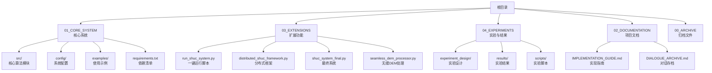
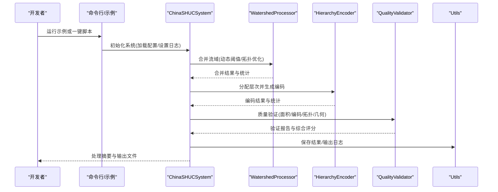
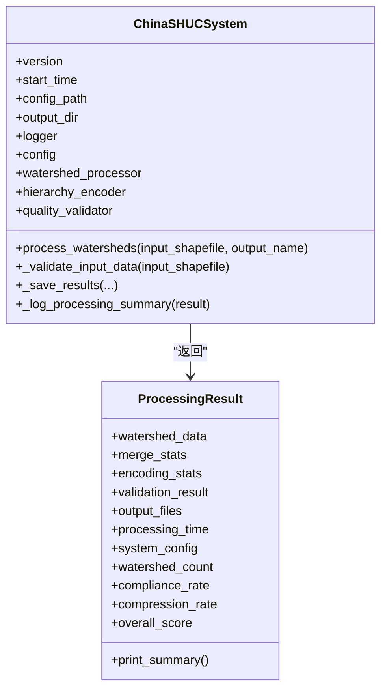
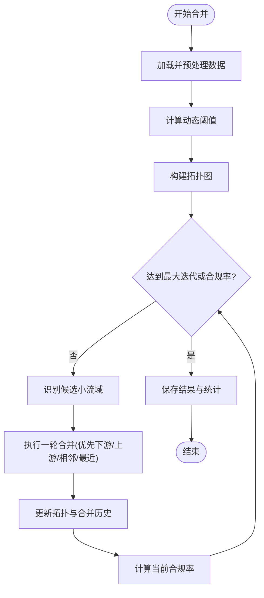
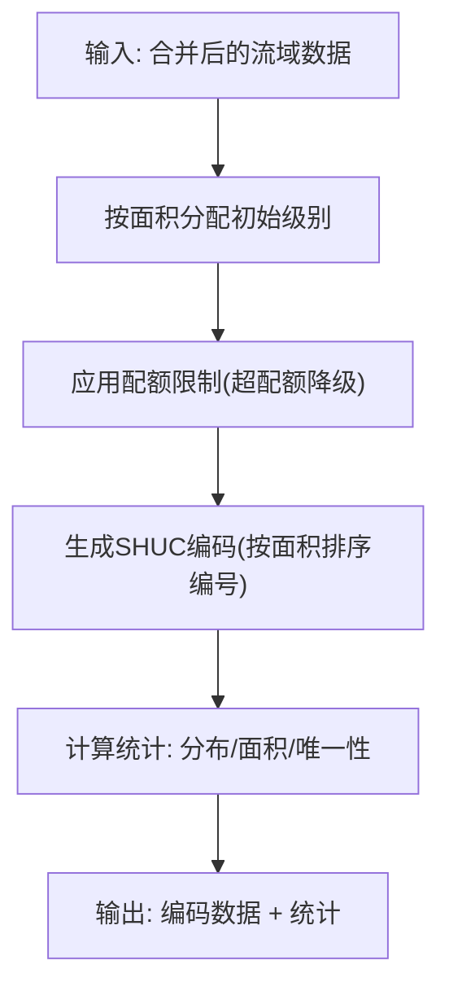
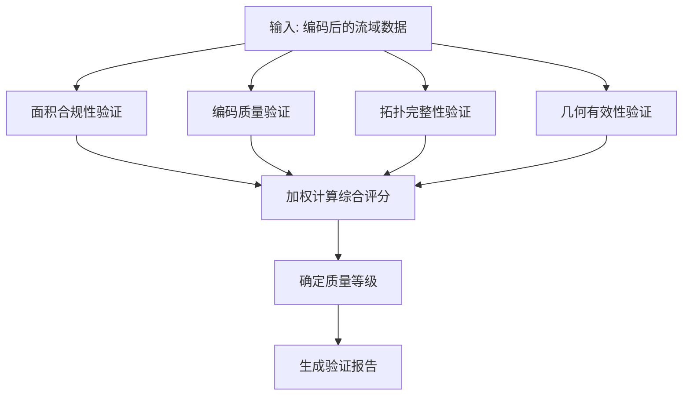

# 开发环境搭建

<cite>
**本文档引用的文件**
- [README.md](file://README.md)
- [requirements.txt](file://01_CORE_SYSTEM/requirements.txt)
- [shuc_config.json](file://01_CORE_SYSTEM/config/shuc_config.json)
- [shuc_system.py](file://01_CORE_SYSTEM/src/shuc_system.py)
- [watershed_processor.py](file://01_CORE_SYSTEM/src/watershed_processor.py)
- [hierarchy_encoder.py](file://01_CORE_SYSTEM/src/hierarchy_encoder.py)
- [quality_validator.py](file://01_CORE_SYSTEM/src/quality_validator.py)
- [utils.py](file://01_CORE_SYSTEM/src/utils.py)
- [basic_usage.py](file://01_CORE_SYSTEM/examples/basic_usage.py)
- [run_shuc_system.py](file://03_EXTENSIONS/run_shuc_system.py)
- [IMPLEMENTATION_GUIDE.md](file://02_DOCUMENTATION/IMPLEMENTATION_GUIDE.md)
- [03_EXT_README.md](file://00_ARCHIVE/legacy_documentation/03_EXT_README.md)
</cite>

## 目录
1. [简介](#简介)
2. [项目结构](#项目结构)
3. [核心组件](#核心组件)
4. [架构总览](#架构总览)
5. [详细组件分析](#详细组件分析)
6. [依赖分析](#依赖分析)
7. [性能考虑](#性能考虑)
8. [故障排除指南](#故障排除指南)
9. [结论](#结论)
10. [附录](#附录)

## 简介
本指南面向参与中国SHUC（中国流域分级统一编码）系统的开发者，提供从零开始的完整开发环境搭建流程，涵盖：
- Python版本要求与虚拟环境创建
- 依赖包安装与版本兼容性
- GIS相关库的作用与版本要求
- IDE配置建议（VS Code、PyCharm等）
- 调试工具、代码格式化与静态分析配置
- Git工作流程与分支管理策略
- 环境验证步骤与常见问题解决方案

## 项目结构
项目采用模块化组织，核心系统位于01_CORE_SYSTEM，扩展功能位于03_EXTENSIONS，实验与结果位于04_EXPERIMENTS，文档位于02_DOCUMENTATION。

**图表来源**
- [README.md:19-30](file://README.md#L19-L30)
- [03_EXT_README.md:26-43](file://00_ARCHIVE/legacy_documentation/03_EXT_README.md#L26-L43)

**章节来源**
- [README.md:19-30](file://README.md#L19-L30)
- [03_EXT_README.md:26-43](file://00_ARCHIVE/legacy_documentation/03_EXT_README.md#L26-L43)

## 核心组件
- 中国SHUC系统主程序：负责整合数据预处理、智能合并、层次编码与质量验证，并输出标准化结果。
- 流域处理器：实现动态阈值自适应算法与拓扑保持的智能合并。
- 层次编码器：基于面积的6级编码体系（2-12位），支持配额优化。
- 质量验证器：多维度质量评估（面积合规、编码唯一性、拓扑完整性、几何有效性）。
- 工具函数模块：日志、配置管理、文件操作与输入验证。
- 示例与一键运行脚本：提供基础使用与快速验证路径。

**章节来源**
- [shuc_system.py:43-91](file://01_CORE_SYSTEM/src/shuc_system.py#L43-L91)
- [watershed_processor.py:24-53](file://01_CORE_SYSTEM/src/watershed_processor.py#L24-L53)
- [hierarchy_encoder.py:22-67](file://01_CORE_SYSTEM/src/hierarchy_encoder.py#L22-L67)
- [quality_validator.py:24-60](file://01_CORE_SYSTEM/src/quality_validator.py#L24-L60)
- [utils.py:24-100](file://01_CORE_SYSTEM/src/utils.py#L24-L100)
- [basic_usage.py:23-52](file://01_CORE_SYSTEM/examples/basic_usage.py#L23-L52)
- [run_shuc_system.py:167-211](file://03_EXTENSIONS/run_shuc_system.py#L167-L211)

## 架构总览
系统采用“模块化分层”架构，核心流程如下：

**图表来源**
- [shuc_system.py:92-164](file://01_CORE_SYSTEM/src/shuc_system.py#L92-L164)
- [watershed_processor.py:54-81](file://01_CORE_SYSTEM/src/watershed_processor.py#L54-L81)
- [hierarchy_encoder.py:69-95](file://01_CORE_SYSTEM/src/hierarchy_encoder.py#L69-L95)
- [quality_validator.py:61-86](file://01_CORE_SYSTEM/src/quality_validator.py#L61-L86)
- [utils.py:198-237](file://01_CORE_SYSTEM/src/utils.py#L198-L237)

## 详细组件分析

### 中国SHUC系统主程序
- 职责：初始化配置与日志、协调各模块、保存结果、生成处理摘要。
- 关键流程：输入数据验证、智能合并、层次编码、质量验证、结果保存。
- 输出：编码后的流域数据、验证报告、处理统计、日志文件。

**图表来源**
- [shuc_system.py:43-91](file://01_CORE_SYSTEM/src/shuc_system.py#L43-L91)
- [shuc_system.py:251-286](file://01_CORE_SYSTEM/src/shuc_system.py#L251-L286)

**章节来源**
- [shuc_system.py:92-164](file://01_CORE_SYSTEM/src/shuc_system.py#L92-L164)
- [shuc_system.py:198-237](file://01_CORE_SYSTEM/src/shuc_system.py#L198-L237)
- [shuc_system.py:239-248](file://01_CORE_SYSTEM/src/shuc_system.py#L239-L248)

### 流域处理器（动态阈值与拓扑合并）
- 动态阈值：基于面积分位数计算自适应阈值，范围约束在合理区间。
- 合并策略：优先下游、其次上游、再相邻、最后最近，维持拓扑关系。
- 统计输出：原始/最终数量、压缩率、合规率、迭代次数与历史。

**图表来源**
- [watershed_processor.py:54-81](file://01_CORE_SYSTEM/src/watershed_processor.py#L54-L81)
- [watershed_processor.py:164-220](file://01_CORE_SYSTEM/src/watershed_processor.py#L164-L220)
- [watershed_processor.py:117-141](file://01_CORE_SYSTEM/src/watershed_processor.py#L117-L141)

**章节来源**
- [watershed_processor.py:117-141](file://01_CORE_SYSTEM/src/watershed_processor.py#L117-L141)
- [watershed_processor.py:164-220](file://01_CORE_SYSTEM/src/watershed_processor.py#L164-L220)
- [watershed_processor.py:222-324](file://01_CORE_SYSTEM/src/watershed_processor.py#L222-L324)

### 层次编码器（6级编码体系）
- 基于面积的初始分配，随后应用配额限制进行优化，确保各级别数量合理。
- 编码格式：按级别分配固定位数，按面积降序编号，保证唯一性与可追溯性。

**图表来源**
- [hierarchy_encoder.py:69-95](file://01_CORE_SYSTEM/src/hierarchy_encoder.py#L69-L95)
- [hierarchy_encoder.py:113-138](file://01_CORE_SYSTEM/src/hierarchy_encoder.py#L113-L138)
- [hierarchy_encoder.py:140-169](file://01_CORE_SYSTEM/src/hierarchy_encoder.py#L140-L169)
- [hierarchy_encoder.py:177-219](file://01_CORE_SYSTEM/src/hierarchy_encoder.py#L177-L219)

**章节来源**
- [hierarchy_encoder.py:69-95](file://01_CORE_SYSTEM/src/hierarchy_encoder.py#L69-L95)
- [hierarchy_encoder.py:177-219](file://01_CORE_SYSTEM/src/hierarchy_encoder.py#L177-L219)

### 质量验证器（多维评分）
- 面积合规：动态阈值计算与合规率统计。
- 编码质量：唯一性、格式分析与重复编码识别。
- 拓扑完整性：字段完整性、引用有效性、孤立与循环引用检测。
- 几何有效性：空几何、无效几何与类型分布。
- 综合评分：加权计算整体质量等级。

**图表来源**
- [quality_validator.py:61-86](file://01_CORE_SYSTEM/src/quality_validator.py#L61-L86)
- [quality_validator.py:100-122](file://01_CORE_SYSTEM/src/quality_validator.py#L100-L122)
- [quality_validator.py:142-168](file://01_CORE_SYSTEM/src/quality_validator.py#L142-L168)
- [quality_validator.py:191-223](file://01_CORE_SYSTEM/src/quality_validator.py#L191-L223)
- [quality_validator.py:255-284](file://01_CORE_SYSTEM/src/quality_validator.py#L255-L284)
- [quality_validator.py:368-411](file://01_CORE_SYSTEM/src/quality_validator.py#L368-L411)

**章节来源**
- [quality_validator.py:61-86](file://01_CORE_SYSTEM/src/quality_validator.py#L61-L86)
- [quality_validator.py:368-411](file://01_CORE_SYSTEM/src/quality_validator.py#L368-L411)

### 工具函数模块（日志、配置、验证）
- 日志：控制台与文件双重输出，统一格式化。
- 配置：默认配置与用户配置深度合并，缺失时自动创建。
- 输入验证：Shapefile存在性、可读性、几何字段与CRS检查。
- 其他：文件大小格式化、处理时间计算、结果导出摘要、系统信息打印、参数校验。

**章节来源**
- [utils.py:24-100](file://01_CORE_SYSTEM/src/utils.py#L24-L100)
- [utils.py:159-221](file://01_CORE_SYSTEM/src/utils.py#L159-L221)
- [utils.py:273-301](file://01_CORE_SYSTEM/src/utils.py#L273-L301)
- [utils.py:302-346](file://01_CORE_SYSTEM/src/utils.py#L302-L346)

### 示例与一键运行脚本
- 基础示例：展示如何初始化系统、处理数据、查看结果与输出文件。
- 一键运行：环境检查、数据准备、执行完整系统并输出结果摘要与输出指南。

**章节来源**
- [basic_usage.py:25-73](file://01_CORE_SYSTEM/examples/basic_usage.py#L25-L73)
- [run_shuc_system.py:167-211](file://03_EXTENSIONS/run_shuc_system.py#L167-L211)

## 依赖分析
- Python版本：建议3.9+，最低3.8。
- 核心数据处理：GeoPandas、Shapely、NumPy、Pandas。
- 图论与网络：NetworkX。
- 科学计算：SciPy。
- 可视化：Matplotlib、Seaborn（可选）。
- 文件I/O与格式：RasterIO、Fiona、PyProj。
- 配置与日志：PyYAML（可选）。
- 性能优化：Numba（可选）。
- 测试：PyTest、PyTest-Cov（可选）。
- 进度条：TQDM。
- 内存优化：PsUtil（可选）。
- 并发：JobLib（可选）。

**章节来源**
- [requirements.txt:4-46](file://01_CORE_SYSTEM/requirements.txt#L4-L46)
- [README.md:62-66](file://README.md#L62-L66)

## 性能考虑
- 动态阈值自适应：减少静态阈值带来的偏差，提升合并效率与质量。
- 拓扑保持：通过图约束优化，避免拓扑破坏导致的回溯与重算。
- 并行与内存：可选JobLib与Numba加速；建议启用进度条与内存监控。
- 大数据处理：建议使用合理的阈值与配额，避免过度合并造成内存压力。

[本节为通用性能建议，无需特定文件引用]

## 故障排除指南
- Python版本不满足：确保Python≥3.8，建议3.9+。
- 缺少依赖包：使用依赖清单安装，确认关键包（GeoPandas、Shapely、NetworkX、Pandas）可用。
- Shapefile读取失败：检查文件存在性、几何字段与CRS；使用工具函数进行验证。
- 合并后拓扑异常：检查上游/下游字段与自引用问题，修复无效几何。
- 输出文件缺失：确认输出目录存在与权限，查看日志文件定位错误。

**章节来源**
- [utils.py:322-346](file://01_CORE_SYSTEM/src/utils.py#L322-L346)
- [utils.py:159-221](file://01_CORE_SYSTEM/src/utils.py#L159-L221)
- [shuc_system.py:165-196](file://01_CORE_SYSTEM/src/shuc_system.py#L165-L196)
- [watershed_processor.py:97-115](file://01_CORE_SYSTEM/src/watershed_processor.py#L97-L115)

## 结论
通过本指南，您可以在本地快速搭建中国SHUC系统的开发环境，理解核心模块职责与交互关系，并掌握调试、验证与问题排查的方法。建议结合示例与一键运行脚本进行端到端验证，逐步扩展到分布式与优化模块。

[本节为总结性内容，无需特定文件引用]

## 附录

### A. Python版本与虚拟环境
- 版本要求：Python 3.9+（建议），最低3.8。
- 建议使用虚拟环境隔离依赖，避免系统Python污染。

**章节来源**
- [README.md:62](file://README.md#L62)
- [utils.py:327-329](file://01_CORE_SYSTEM/src/utils.py#L327-L329)

### B. 依赖安装步骤
- 进入核心系统目录，安装依赖清单中的包。
- 如需扩展功能，可按需安装可选依赖（如Numba、JobLib、PyTest等）。

**章节来源**
- [README.md:36-45](file://README.md#L36-L45)
- [requirements.txt:44-46](file://01_CORE_SYSTEM/requirements.txt#L44-L46)

### C. IDE配置建议

- VS Code
  - 推荐插件：Python、Pylance、Black、Flake8、GitLens、Jupyter。
  - 设置：使用虚拟环境中的Python解释器；启用格式化与静态检查。
  - 调试：为示例脚本与一键脚本配置launch.json，便于断点调试。

- PyCharm
  - 设置：在项目解释器中选择虚拟环境；启用Code Inspection与PythonDoc。
  - 调试：使用内置调试器运行示例与一键脚本，查看变量与调用栈。

[本节为通用IDE配置建议，无需特定文件引用]

### D. 调试工具、代码格式化与静态分析
- 调试：使用IDE内置调试器或命令行断点；关注日志输出与异常堆栈。
- 格式化：Black或autopep8；与Pylance配合确保风格一致。
- 静态分析：Flake8、Pylint或Mypy；在CI中集成以保证质量。

[本节为通用开发工具建议，无需特定文件引用]

### E. Git工作流程与分支管理策略
- 分支策略：采用Git Flow或GitHub Flow，主分支保护，功能分支从develop切出，合并后回并到develop。
- 提交规范：语义化提交信息，关联Issue与PR；每次提交聚焦单一功能或修复。
- 合并与审查：PR审查通过后合并，合并后清理分支；定期同步远程主干。

**章节来源**
- [IMPLEMENTATION_GUIDE.md:73-133](file://02_DOCUMENTATION/IMPLEMENTATION_GUIDE.md#L73-L133)

### F. 环境验证步骤
- 运行基础示例：确认数据路径与依赖可用。
- 一键运行脚本：验证环境检查、数据准备与结果输出。
- 配置验证：检查系统配置文件是否存在与默认配置是否生效。
- 日志检查：查看处理日志与验证报告，确认无异常。

**章节来源**
- [basic_usage.py:30-73](file://01_CORE_SYSTEM/examples/basic_usage.py#L30-L73)
- [run_shuc_system.py:167-211](file://03_EXTENSIONS/run_shuc_system.py#L167-L211)
- [utils.py:64-99](file://01_CORE_SYSTEM/src/utils.py#L64-L99)