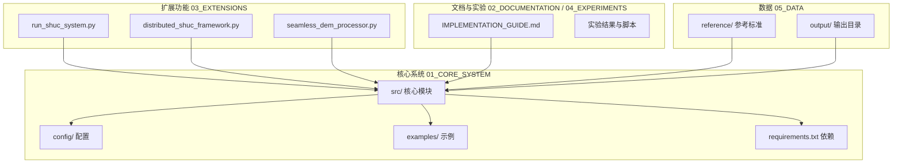
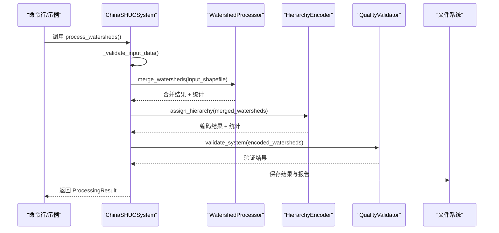
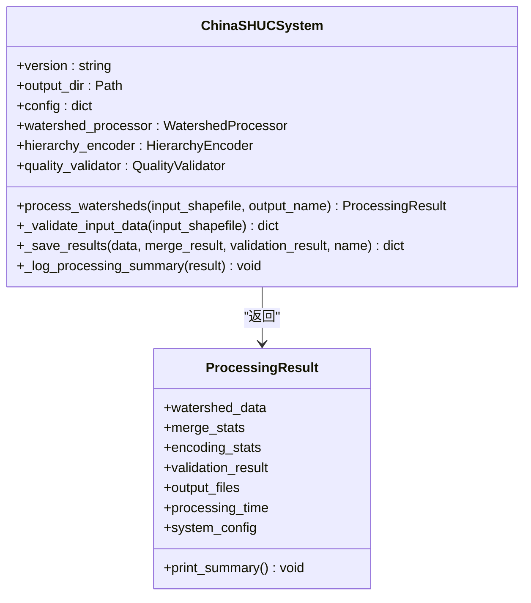
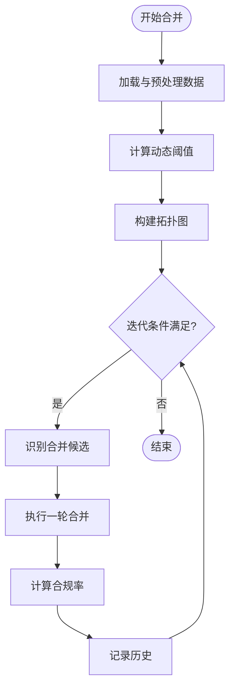
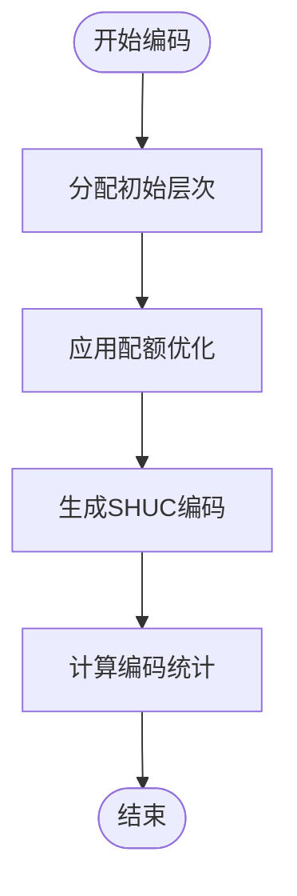
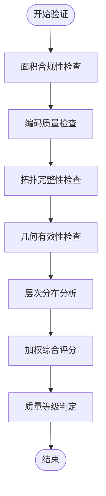
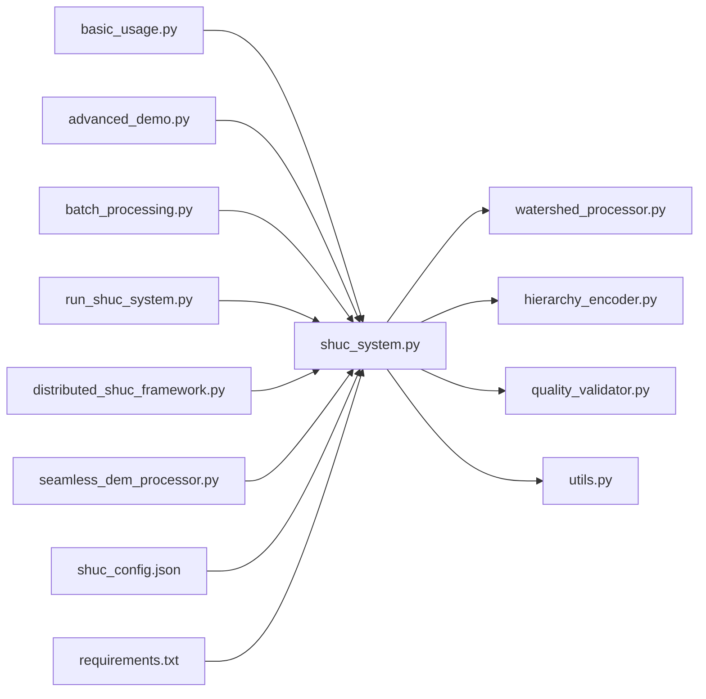

# 开发者指南

<cite>
**本文档引用的文件**
- [README.md](file://README.md)
- [requirements.txt](file://01_CORE_SYSTEM/requirements.txt)
- [shuc_config.json](file://01_CORE_SYSTEM/config/shuc_config.json)
- [shuc_system.py](file://01_CORE_SYSTEM/src/shuc_system.py)
- [watershed_processor.py](file://01_CORE_SYSTEM/src/watershed_processor.py)
- [hierarchy_encoder.py](file://01_CORE_SYSTEM/src/hierarchy_encoder.py)
- [quality_validator.py](file://01_CORE_SYSTEM/src/quality_validator.py)
- [utils.py](file://01_CORE_SYSTEM/src/utils.py)
- [basic_usage.py](file://01_CORE_SYSTEM/examples/basic_usage.py)
- [advanced_demo.py](file://01_CORE_SYSTEM/examples/advanced_demo.py)
- [batch_processing.py](file://01_CORE_SYSTEM/examples/batch_processing.py)
- [run_shuc_system.py](file://03_EXTENSIONS/run_shuc_system.py)
- [distributed_shuc_framework.py](file://03_EXTENSIONS/distributed_shuc_framework.py)
- [seamless_dem_processor.py](file://03_EXTENSIONS/seamless_dem_processor.py)
- [huc_standards.json](file://05_DATA/reference/huc_standards.json)
- [IMPLEMENTATION_GUIDE.md](file://02_DOCUMENTATION/IMPLEMENTATION_GUIDE.md)
</cite>

## 目录
1. [简介](#简介)
2. [项目结构](#项目结构)
3. [核心组件](#核心组件)
4. [架构总览](#架构总览)
5. [详细组件分析](#详细组件分析)
6. [依赖关系分析](#依赖关系分析)
7. [性能考量](#性能考量)
8. [故障排除指南](#故障排除指南)
9. [结论](#结论)
10. [附录](#附录)

## 简介
本指南面向SHUC（中国流域分级统一编码系统）的开发者，系统阐述代码结构、模块职责、设计模式应用与扩展点，提供开发环境搭建、测试与质量保障、贡献流程与版本管理规范，并解释核心算法实现细节与最佳实践。

## 项目结构
项目采用按功能域分层的组织方式，核心系统位于01_CORE_SYSTEM，扩展功能位于03_EXTENSIONS，文档与实验位于02_DOCUMENTATION与04_EXPERIMENTS，数据位于05_DATA。

**图表来源**
- [shuc_system.py:1-335](file://01_CORE_SYSTEM/src/shuc_system.py#L1-L335)
- [requirements.txt:1-46](file://01_CORE_SYSTEM/requirements.txt#L1-L46)
- [run_shuc_system.py:1-211](file://03_EXTENSIONS/run_shuc_system.py#L1-L211)
- [distributed_shuc_framework.py:1-777](file://03_EXTENSIONS/distributed_shuc_framework.py#L1-L777)
- [seamless_dem_processor.py:1-200](file://03_EXTENSIONS/seamless_dem_processor.py#L1-L200)
- [IMPLEMENTATION_GUIDE.md:1-800](file://02_DOCUMENTATION/IMPLEMENTATION_GUIDE.md#L1-L800)

**章节来源**
- [README.md:1-88](file://README.md#L1-L88)
- [requirements.txt:1-46](file://01_CORE_SYSTEM/requirements.txt#L1-L46)

## 核心组件
- 中国SHUC系统主类：协调数据预处理、智能合并、层次编码与质量验证，封装处理结果与统计信息。
- 流域处理器：实现动态阈值自适应的智能合并，维护拓扑图，支持激进合并策略与早停机制。
- 层次编码器：基于面积阈值的智能分级，生成6级12位编码，支持配额优化与统计分析。
- 质量验证器：多维度质量评估（面积合规、编码唯一性、拓扑完整性、几何有效性），综合评分与等级判定。
- 工具模块：日志、配置管理、文件操作、数据验证与辅助函数。

**章节来源**
- [shuc_system.py:43-286](file://01_CORE_SYSTEM/src/shuc_system.py#L43-L286)
- [watershed_processor.py:24-377](file://01_CORE_SYSTEM/src/watershed_processor.py#L24-L377)
- [hierarchy_encoder.py:22-219](file://01_CORE_SYSTEM/src/hierarchy_encoder.py#L22-L219)
- [quality_validator.py:24-411](file://01_CORE_SYSTEM/src/quality_validator.py#L24-L411)
- [utils.py:24-360](file://01_CORE_SYSTEM/src/utils.py#L24-L360)

## 架构总览
系统采用“流水线+模块化”架构：输入Shapefile经数据验证后进入智能合并阶段，随后进行层次编码，最后由质量验证器进行全面评估，结果统一保存并生成报告。

**图表来源**
- [shuc_system.py:92-164](file://01_CORE_SYSTEM/src/shuc_system.py#L92-L164)
- [watershed_processor.py:54-81](file://01_CORE_SYSTEM/src/watershed_processor.py#L54-L81)
- [hierarchy_encoder.py:69-95](file://01_CORE_SYSTEM/src/hierarchy_encoder.py#L69-L95)
- [quality_validator.py:61-86](file://01_CORE_SYSTEM/src/quality_validator.py#L61-L86)

## 详细组件分析

### 中国SHUC系统主类（ChinaSHUCSystem）
- 职责：初始化配置与日志，协调各模块执行，封装处理结果。
- 关键流程：输入验证 → 智能合并 → 层次编码 → 质量验证 → 结果保存 → 摘要记录。
- 设计模式：组合模式（组合多个处理模块）、结果封装（ProcessingResult）。

**图表来源**
- [shuc_system.py:43-286](file://01_CORE_SYSTEM/src/shuc_system.py#L43-L286)

**章节来源**
- [shuc_system.py:43-286](file://01_CORE_SYSTEM/src/shuc_system.py#L43-L286)

### 流域处理器（WatershedProcessor）
- 职责：加载数据、修复问题、计算动态阈值、构建拓扑图、执行合并迭代。
- 核心算法：动态阈值 = Q75 + (Q90-Q75)/2，合并目标优先级（下游→上游→相邻→最近）。
- 性能特性：早停机制、合并历史追踪、拓扑更新。

**图表来源**
- [watershed_processor.py:54-220](file://01_CORE_SYSTEM/src/watershed_processor.py#L54-L220)

**章节来源**
- [watershed_processor.py:24-377](file://01_CORE_SYSTEM/src/watershed_processor.py#L24-L377)

### 层次编码器（HierarchyEncoder）
- 职责：基于面积阈值分配初始层次，应用配额优化，生成SHUC编码（2-12位），统计各级别分布。
- 设计要点：分级标准来自配置，支持灵活的最小面积阈值；编码格式化与溢出处理。

**图表来源**
- [hierarchy_encoder.py:69-95](file://01_CORE_SYSTEM/src/hierarchy_encoder.py#L69-L95)

**章节来源**
- [hierarchy_encoder.py:22-219](file://01_CORE_SYSTEM/src/hierarchy_encoder.py#L22-L219)

### 质量验证器（QualityValidator）
- 职责：面积合规性、编码唯一性、拓扑完整性、几何有效性验证；综合评分与等级。
- 权重：面积合规(40%)、编码质量(30%)、拓扑完整性(20%)、几何有效性(10%)。

**图表来源**
- [quality_validator.py:61-86](file://01_CORE_SYSTEM/src/quality_validator.py#L61-L86)

**章节来源**
- [quality_validator.py:24-411](file://01_CORE_SYSTEM/src/quality_validator.py#L24-L411)

### 工具模块（utils）
- 职责：日志系统、配置加载与合并、文件与数据验证、时间计算、结果导出、环境检查。
- 关键能力：深度合并配置、默认配置回退、shapefile验证、处理时间格式化。

**章节来源**
- [utils.py:24-360](file://01_CORE_SYSTEM/src/utils.py#L24-L360)

### 示例与运行脚本
- 基础示例：展示系统初始化、数据处理、结果摘要与输出文件信息。
- 高级示例：自定义配置、数据质量分析、批量处理演示、可视化图表生成。
- 批量处理：多配置对比、结果汇总、统计分析与报告生成。
- 一键运行：环境检查、数据准备、系统运行、结果摘要与输出指南。

**章节来源**
- [basic_usage.py:1-106](file://01_CORE_SYSTEM/examples/basic_usage.py#L1-L106)
- [advanced_demo.py:1-272](file://01_CORE_SYSTEM/examples/advanced_demo.py#L1-L272)
- [batch_processing.py:1-327](file://01_CORE_SYSTEM/examples/batch_processing.py#L1-L327)
- [run_shuc_system.py:1-211](file://03_EXTENSIONS/run_shuc_system.py#L1-L211)

### 扩展功能
- 分布式框架：异步任务调度、GPU/CPU加速、集群节点管理、任务依赖与容错。
- 无缝DEM处理：缓冲区管理、边界冲突检测与解决、高程平滑与水文条件化。
- 一键运行：环境检查、数据复制、结果展示与输出指南。

**章节来源**
- [distributed_shuc_framework.py:1-777](file://03_EXTENSIONS/distributed_shuc_framework.py#L1-L777)
- [seamless_dem_processor.py:1-200](file://03_EXTENSIONS/seamless_dem_processor.py#L1-L200)
- [run_shuc_system.py:1-211](file://03_EXTENSIONS/run_shuc_system.py#L1-L211)

## 依赖关系分析

**图表来源**
- [shuc_system.py:38-41](file://01_CORE_SYSTEM/src/shuc_system.py#L38-L41)
- [shuc_config.json:1-43](file://01_CORE_SYSTEM/config/shuc_config.json#L1-L43)
- [requirements.txt:1-46](file://01_CORE_SYSTEM/requirements.txt#L1-L46)

**章节来源**
- [shuc_system.py:38-41](file://01_CORE_SYSTEM/src/shuc_system.py#L38-L41)
- [shuc_config.json:1-43](file://01_CORE_SYSTEM/config/shuc_config.json#L1-L43)
- [requirements.txt:1-46](file://01_CORE_SYSTEM/requirements.txt#L1-L46)

## 性能考量
- 动态阈值自适应：基于分位数的阈值计算，减少对静态阈值的依赖，提升合并效果。
- 早停机制：当合规率达到目标阈值时提前停止，避免无效迭代。
- 拓扑图维护：使用NetworkX构建上下游关系图，保证合并后拓扑一致性。
- 扩展能力：分布式框架支持GPU/CPU并行、任务调度与容错恢复，适用于大规模数据处理。

[本节为通用性能建议，无需特定文件引用]

## 故障排除指南
- 输入数据验证失败：检查Shapefile是否存在、字段是否完整、几何是否有效。
- 依赖缺失：确保安装requirements.txt中声明的依赖包，特别是geopandas、networkx、shapely等。
- 配置问题：检查shuc_config.json的processing、hierarchy、validation等配置项是否合理。
- 日志定位：查看output目录下的processing_log.txt，获取详细的处理过程与错误信息。
- 环境检查：使用run_shuc_system.py的环境检查功能，确认关键包是否安装。

**章节来源**
- [shuc_system.py:165-196](file://01_CORE_SYSTEM/src/shuc_system.py#L165-L196)
- [utils.py:159-221](file://01_CORE_SYSTEM/src/utils.py#L159-L221)
- [run_shuc_system.py:20-41](file://03_EXTENSIONS/run_shuc_system.py#L20-L41)

## 结论
SHUC系统通过模块化设计与清晰的流水线架构，实现了从数据预处理到质量验证的完整闭环。核心算法（动态阈值、智能合并、层次编码、质量验证）相互配合，既保证了处理效率，又确保了结果的科学性与可追溯性。扩展功能进一步增强了系统的可扩展性与工程化能力，适合在更大规模的数据集上部署与应用。

[本节为总结性内容，无需特定文件引用]

## 附录

### 开发环境搭建
- Python版本：3.9+（建议3.9+以获得最佳性能）
- 依赖安装：在01_CORE_SYSTEM目录执行pip install -r requirements.txt
- 快速运行：在01_CORE_SYSTEM目录执行python examples/basic_usage.py
- IDE配置建议：启用Python解释器、安装必要的插件（如Python、Pylance、Black等），配置工作目录为项目根目录

**章节来源**
- [README.md:34-45](file://README.md#L34-L45)
- [requirements.txt:1-46](file://01_CORE_SYSTEM/requirements.txt#L1-L46)

### 配置说明
- processing：目标合规率、合并策略、最大迭代次数、早停开关、动态阈值模式
- hierarchy：各级别最小面积阈值、是否启用配额、各级别配额
- validation：面积合规阈值、编码唯一性阈值、拓扑完整性阈值、质量权重
- output：中间结果保存、详细日志、验证报告导出、统计导出
- performance：并行处理开关、内存上限、进度显示

**章节来源**
- [shuc_config.json:1-43](file://01_CORE_SYSTEM/config/shuc_config.json#L1-L43)

### 核心算法实现细节
- 动态阈值：基于面积分位数计算，约束在合理范围，确保对不同区域的自适应性
- 合并策略：优先下游合并，其次上游、相邻、最近，结合拓扑图维护
- 层次编码：基于面积阈值分配，配额优化，生成固定位数编码
- 质量评估：多维度加权评分，支持等级判定与问题识别

**章节来源**
- [watershed_processor.py:117-141](file://01_CORE_SYSTEM/src/watershed_processor.py#L117-L141)
- [hierarchy_encoder.py:97-169](file://01_CORE_SYSTEM/src/hierarchy_encoder.py#L97-L169)
- [quality_validator.py:100-122](file://01_CORE_SYSTEM/src/quality_validator.py#L100-L122)

### 扩展点与最佳实践
- 分布式处理：利用异步任务调度与GPU加速，实现大规模数据并行处理
- 无缝DEM处理：缓冲区管理与边界冲突检测，确保拼接质量
- 配置驱动：通过shuc_config.json灵活调整算法参数，支持A/B测试与策略对比
- 结果导出：统一的ProcessingResult封装，便于后续分析与报告生成

**章节来源**
- [distributed_shuc_framework.py:81-207](file://03_EXTENSIONS/distributed_shuc_framework.py#L81-L207)
- [seamless_dem_processor.py:42-76](file://03_EXTENSIONS/seamless_dem_processor.py#L42-L76)
- [shuc_system.py:251-286](file://01_CORE_SYSTEM/src/shuc_system.py#L251-L286)

### 代码贡献流程与版本管理
- 分支策略：feature/* 开发功能，develop 集成，main 发布
- 提交流程：fork → 分支 → 提交 → PR → 代码审查 → 合并
- 代码审查：关注模块职责、算法正确性、性能影响、测试覆盖与文档更新
- 版本管理：语义化版本，变更日志记录重大改动

[本节为通用流程建议，无需特定文件引用]

### 论文与技术文档
- 实施指南：包含数据论文与算法论文的撰写计划、阶段划分与里程碑
- 参考标准：HUC标准与中国适配说明，提供验证指标与等级划分依据

**章节来源**
- [IMPLEMENTATION_GUIDE.md:1-800](file://02_DOCUMENTATION/IMPLEMENTATION_GUIDE.md#L1-L800)
- [huc_standards.json:1-151](file://05_DATA/reference/huc_standards.json#L1-L151)