# 扩展开发指南

<cite>
**本文档引用的文件**
- [shuc_system.py](file://01_CORE_SYSTEM/src/shuc_system.py)
- [watershed_processor.py](file://01_CORE_SYSTEM/src/watershed_processor.py)
- [hierarchy_encoder.py](file://01_CORE_SYSTEM/src/hierarchy_encoder.py)
- [quality_validator.py](file://01_CORE_SYSTEM/src/quality_validator.py)
- [utils.py](file://01_CORE_SYSTEM/src/utils.py)
- [shuc_config.json](file://01_CORE_SYSTEM/config/shuc_config.json)
- [validation_config.json](file://01_CORE_SYSTEM/config/validation_config.json)
- [basic_usage.py](file://01_CORE_SYSTEM/examples/basic_usage.py)
- [advanced_demo.py](file://01_CORE_SYSTEM/examples/advanced_demo.py)
- [distributed_shuc_framework.py](file://03_EXTENSIONS/distributed_shuc_framework.py)
- [README.md](file://README.md)
- [requirements.txt](file://01_CORE_SYSTEM/requirements.txt)
</cite>

## 目录
1. [简介](#简介)
2. [项目结构](#项目结构)
3. [核心组件](#核心组件)
4. [架构概览](#架构概览)
5. [详细组件分析](#详细组件分析)
6. [扩展点识别](#扩展点识别)
7. [插件系统设计](#插件系统设计)
8. [新算法集成步骤](#新算法集成步骤)
9. [自定义合并策略开发](#自定义合并策略开发)
10. [自定义编码规则实现](#自定义编码规则实现)
11. [性能优化技巧](#性能优化技巧)
12. [内存管理最佳实践](#内存管理最佳实践)
13. [测试与验证方法](#测试与验证方法)
14. [向后兼容性维护](#向后兼容性维护)
15. [故障排除指南](#故障排除指南)
16. [结论](#结论)

## 简介

中国SHUC流域分级编码系统是一个基于Python的自动化流域处理系统，采用6级12位编码方案，实现从源头到出口的全流域层级追溯。系统创新性地引入动态阈值自适应算法和拓扑保持的智能流域合并框架，为中国流域管理提供标准化、层次化的空间单元编码解决方案。

本指南专注于扩展功能开发，涵盖如何基于现有架构添加新的处理策略和验证方法，识别插件系统的使用方法和扩展点，以及新算法集成的步骤和注意事项。

## 项目结构

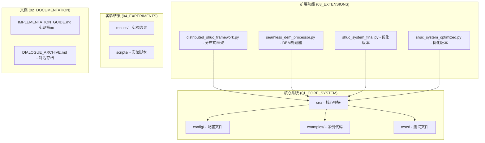

**图表来源**
- [README.md:19-30](file://README.md#L19-L30)
- [distributed_shuc_framework.py:1-50](file://03_EXTENSIONS/distributed_shuc_framework.py#L1-L50)

**章节来源**
- [README.md:19-30](file://README.md#L19-L30)
- [requirements.txt:1-46](file://01_CORE_SYSTEM/requirements.txt#L1-L46)

## 核心组件

### 主系统架构

中国SHUC系统采用模块化设计，主要由四个核心组件构成：

1. **ChinaSHUCSystem** - 主控制器，协调整个处理流程
2. **WatershedProcessor** - 流域处理器，实现智能合并算法
3. **HierarchyEncoder** - 层次编码器，生成SHUC编码
4. **QualityValidator** - 质量验证器，执行全面的质量检查

### 数据流架构

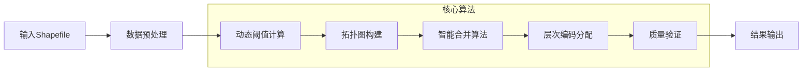

**图表来源**
- [shuc_system.py:92-160](file://01_CORE_SYSTEM/src/shuc_system.py#L92-L160)
- [watershed_processor.py:54-81](file://01_CORE_SYSTEM/src/watershed_processor.py#L54-L81)

**章节来源**
- [shuc_system.py:43-91](file://01_CORE_SYSTEM/src/shuc_system.py#L43-L91)
- [shuc_system.py:92-160](file://01_CORE_SYSTEM/src/shuc_system.py#L92-L160)

## 架构概览

### 系统整体架构

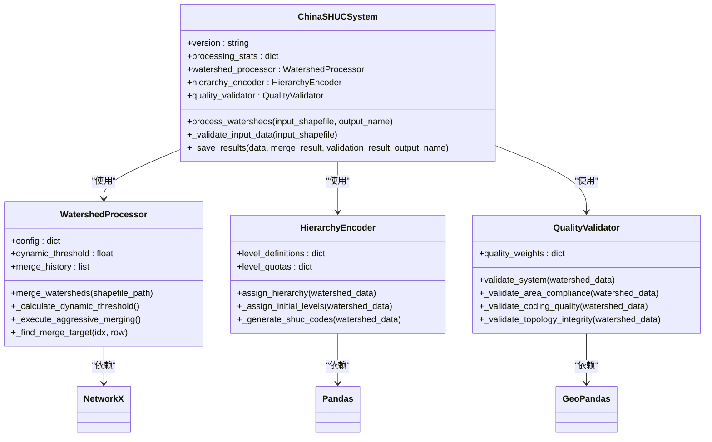

**图表来源**
- [shuc_system.py:43-91](file://01_CORE_SYSTEM/src/shuc_system.py#L43-L91)
- [watershed_processor.py:24-53](file://01_CORE_SYSTEM/src/watershed_processor.py#L24-L53)
- [hierarchy_encoder.py:22-67](file://01_CORE_SYSTEM/src/hierarchy_encoder.py#L22-L67)
- [quality_validator.py:24-60](file://01_CORE_SYSTEM/src/quality_validator.py#L24-L60)

### 处理流程序列图

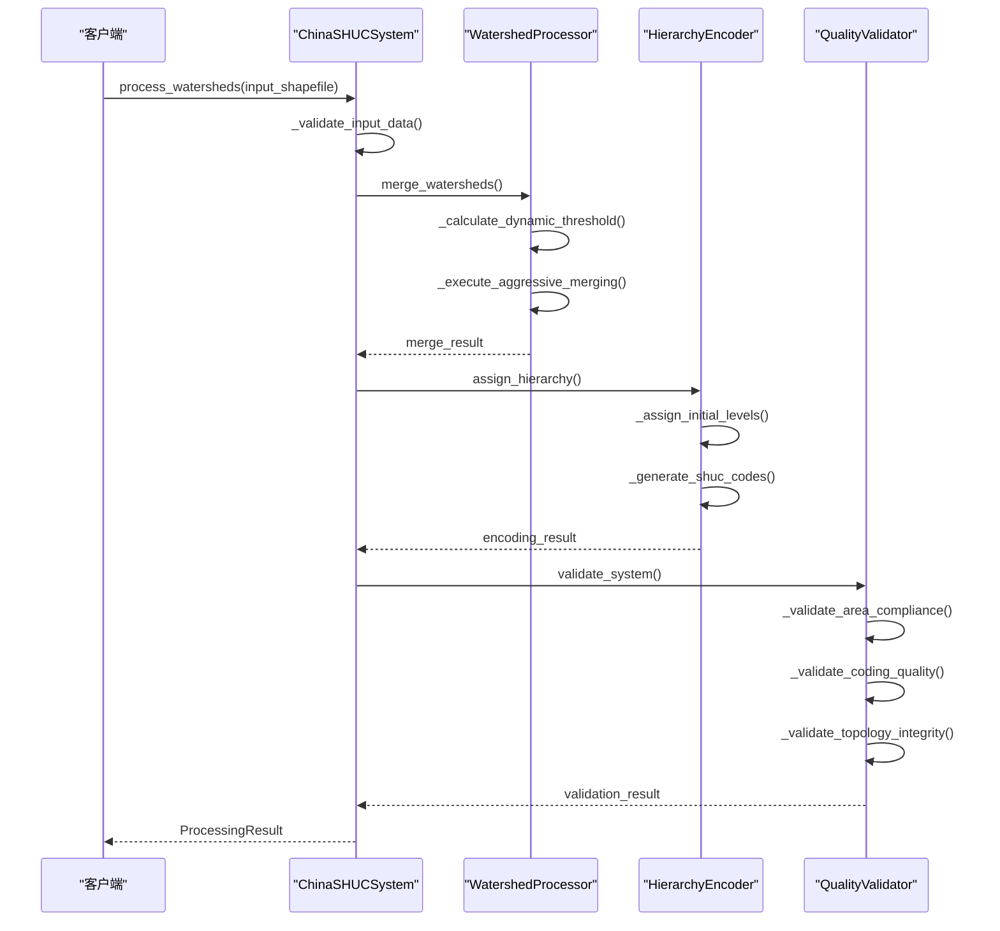

**图表来源**
- [shuc_system.py:92-160](file://01_CORE_SYSTEM/src/shuc_system.py#L92-L160)
- [watershed_processor.py:54-81](file://01_CORE_SYSTEM/src/watershed_processor.py#L54-L81)
- [hierarchy_encoder.py:69-95](file://01_CORE_SYSTEM/src/hierarchy_encoder.py#L69-L95)
- [quality_validator.py:61-86](file://01_CORE_SYSTEM/src/quality_validator.py#L61-L86)

**章节来源**
- [shuc_system.py:288-335](file://01_CORE_SYSTEM/src/shuc_system.py#L288-L335)
- [basic_usage.py:25-73](file://01_CORE_SYSTEM/examples/basic_usage.py#L25-L73)

## 详细组件分析

### 流域处理器分析

WatershedProcessor是系统的核心算法组件，实现了智能流域合并的关键功能。

#### 核心算法流程

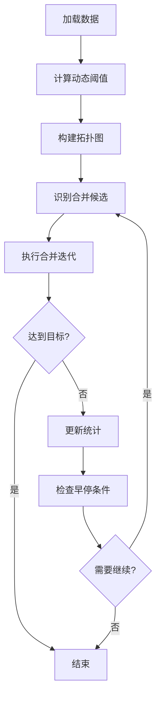

**图表来源**
- [watershed_processor.py:164-220](file://01_CORE_SYSTEM/src/watershed_processor.py#L164-L220)
- [watershed_processor.py:222-247](file://01_CORE_SYSTEM/src/watershed_processor.py#L222-L247)

#### 合并策略实现

系统支持多种合并策略，主要通过配置参数控制：

- **激进合并策略** (`aggressive`): 优先合并小流域，追求更高的压缩率
- **保守合并策略** (`conservative`): 严格控制合并，保护小流域完整性
- **智能合并策略** (`smart`): 基于评分函数的优化合并

**章节来源**
- [watershed_processor.py:164-220](file://01_CORE_SYSTEM/src/watershed_processor.py#L164-L220)
- [watershed_processor.py:249-280](file://01_CORE_SYSTEM/src/watershed_processor.py#L249-L280)

### 层次编码器分析

HierarchyEncoder负责将合并后的流域分配到合适的层次级别并生成SHUC编码。

#### 编码体系设计

系统采用6级12位的编码体系，各级别的面积阈值和位数分配如下：

| 层级 | 位数 | 最小面积(km²) | 描述 |
|------|------|---------------|------|
| 1级 | 2位 | ≥50000 | 大区流域 |
| 2级 | 4位 | ≥10000 | 区域流域 |
| 3级 | 6位 | ≥2000 | 大流域 |
| 4级 | 8位 | ≥1000 | 中流域 |
| 5级 | 10位 | ≥200 | 小流域 |
| 6级 | 12位 | ≥50 | 基本单元 |

#### 编码生成算法

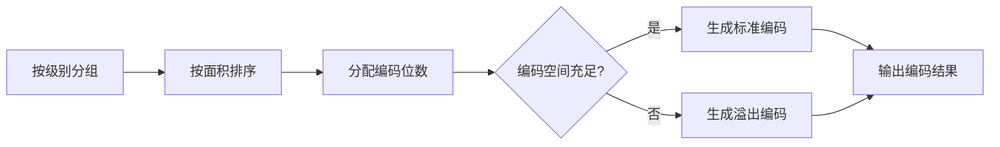

**图表来源**
- [hierarchy_encoder.py:140-169](file://01_CORE_SYSTEM/src/hierarchy_encoder.py#L140-L169)
- [hierarchy_encoder.py:177-219](file://01_CORE_SYSTEM/src/hierarchy_encoder.py#L177-L219)

**章节来源**
- [hierarchy_encoder.py:42-67](file://01_CORE_SYSTEM/src/hierarchy_encoder.py#L42-L67)
- [hierarchy_encoder.py:140-169](file://01_CORE_SYSTEM/src/hierarchy_encoder.py#L140-L169)

### 质量验证器分析

QualityValidator提供多维度的质量检查和评估功能。

#### 质量评估体系

系统采用加权评分系统，各维度的权重分配如下：

| 评估维度 | 权重 | 检查内容 |
|----------|------|----------|
| 面积合规性 | 40% | 合规率计算和阈值验证 |
| 编码质量 | 30% | 唯一性、格式正确性 |
| 拓扑完整性 | 20% | 上下游关系、环路检查 |
| 几何有效性 | 10% | 几何有效性、类型检查 |

#### 质量等级划分

| 分数范围 | 等级 | 描述 |
|----------|------|------|
| 90-100 | 优秀 | Excellent |
| 80-89 | 良好 | Good |
| 70-79 | 可接受 | Acceptable |
| <70 | 需要改进 | Needs Improvement |

**章节来源**
- [quality_validator.py:49-60](file://01_CORE_SYSTEM/src/quality_validator.py#L49-L60)
- [quality_validator.py:368-411](file://01_CORE_SYSTEM/src/quality_validator.py#L368-L411)

## 扩展点识别

### 核心扩展点

基于系统架构分析，主要的扩展点包括：

1. **处理策略扩展点**
   - 合并策略插槽
   - 阈值计算算法插槽
   - 拓扑优化算法插槽

2. **验证方法扩展点**
   - 质量评估指标插槽
   - 验证规则插槽
   - 评分算法插槽

3. **编码规则扩展点**
   - 层次分配算法插槽
   - 编码生成算法插槽
   - 格式验证规则插槽

### 配置扩展点

系统通过JSON配置文件实现灵活的参数控制：

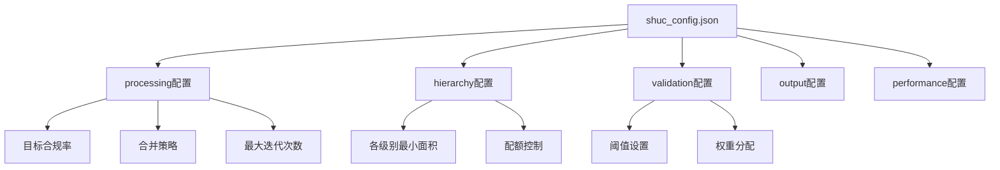

**图表来源**
- [shuc_config.json:1-43](file://01_CORE_SYSTEM/config/shuc_config.json#L1-L43)

**章节来源**
- [shuc_config.json:1-43](file://01_CORE_SYSTEM/config/shuc_config.json#L1-L43)
- [validation_config.json:1-46](file://01_CORE_SYSTEM/config/validation_config.json#L1-L46)

## 插件系统设计

### 插件架构模式

系统采用插件化架构，支持动态加载和替换核心组件：

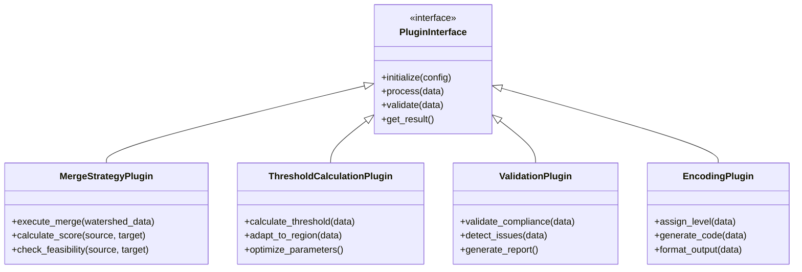

**图表来源**
- [watershed_processor.py:24-53](file://01_CORE_SYSTEM/src/watershed_processor.py#L24-L53)
- [hierarchy_encoder.py:22-67](file://01_CORE_SYSTEM/src/hierarchy_encoder.py#L22-L67)
- [quality_validator.py:24-60](file://01_CORE_SYSTEM/src/quality_validator.py#L24-L60)

### 插件加载机制

系统通过工厂模式实现插件的动态加载：

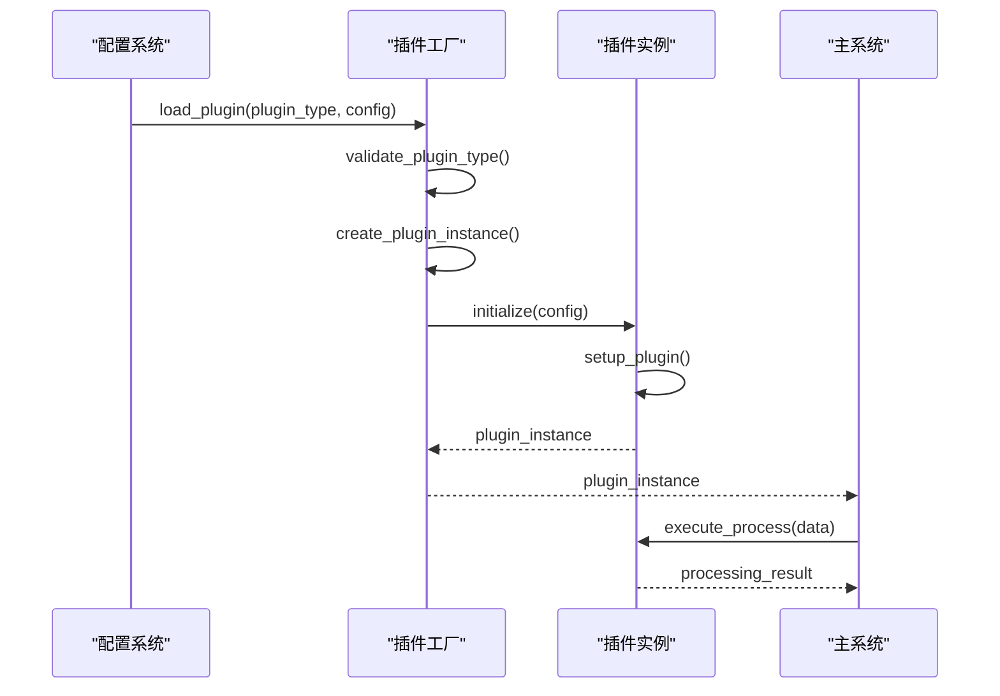

**图表来源**
- [utils.py:64-100](file://01_CORE_SYSTEM/src/utils.py#L64-L100)
- [shuc_system.py:76-79](file://01_CORE_SYSTEM/src/shuc_system.py#L76-L79)

**章节来源**
- [utils.py:64-100](file://01_CORE_SYSTEM/src/utils.py#L64-L100)
- [shuc_system.py:76-79](file://01_CORE_SYSTEM/src/shuc_system.py#L76-L79)

## 新算法集成步骤

### 算法接口设计

#### 合并策略接口规范

```python
class MergeStrategyInterface:
    def calculate_merge_score(self, source_watershed, target_watershed) -> float:
        """
        计算合并评分
        
        Args:
            source_watershed: 源流域数据
            target_watershed: 目标流域数据
            
        Returns:
            float: 合并评分 (0-1)
        """
        pass
    
    def check_feasibility(self, source_watershed, target_watershed) -> bool:
        """
        检查合并可行性
        
        Args:
            source_watershed: 源流域数据
            target_watershed: 目标流域数据
            
        Returns:
            bool: 是否可行
        """
        pass
    
    def execute_merge(self, source_watershed, target_watershed) -> dict:
        """
        执行合并操作
        
        Args:
            source_watershed: 源流域数据
            target_watershed: 目标流域数据
            
        Returns:
            dict: 合并结果
        """
        pass
```

#### 阈值计算接口规范

```python
class ThresholdCalculationInterface:
    def calculate_threshold(self, watershed_data) -> float:
        """
        计算合并阈值
        
        Args:
            watershed_data: 流域数据
            
        Returns:
            float: 阈值 (km²)
        """
        pass
    
    def adapt_to_region(self, watershed_data, region_info) -> float:
        """
        根据区域特征调整阈值
        
        Args:
            watershed_data: 流域数据
            region_info: 区域信息
            
        Returns:
            float: 适应后的阈值
        """
        pass
    
    def optimize_parameters(self, historical_data) -> dict:
        """
        优化阈值计算参数
        
        Args:
            historical_data: 历史数据
            
        Returns:
            dict: 优化后的参数
        """
        pass
```

### 集成实施步骤

#### 步骤1：定义算法接口

1. 在相应的模块中定义接口类
2. 实现接口方法签名
3. 确保方法返回值类型一致

#### 步骤2：实现算法逻辑

1. 编写算法核心实现
2. 处理边界情况
3. 实现异常处理机制

#### 步骤3：集成到系统架构

1. 修改配置文件添加新算法参数
2. 更新工厂类支持新算法
3. 测试算法集成

#### 步骤4：验证算法效果

1. 编写单元测试
2. 进行回归测试
3. 性能基准测试

**章节来源**
- [watershed_processor.py:249-325](file://01_CORE_SYSTEM/src/watershed_processor.py#L249-L325)
- [hierarchy_encoder.py:97-169](file://01_CORE_SYSTEM/src/hierarchy_encoder.py#L97-L169)
- [quality_validator.py:100-168](file://01_CORE_SYSTEM/src/quality_validator.py#L100-L168)

## 自定义合并策略开发

### 策略设计原则

#### 1. 多目标优化原则

自定义合并策略应考虑多个优化目标：

- **面积合规性**: 确保合并后的流域满足面积阈值
- **拓扑完整性**: 保持流域间的上下游关系
- **形状优化**: 优化合并后流域的几何形状
- **计算效率**: 控制算法复杂度

#### 2. 约束条件设计

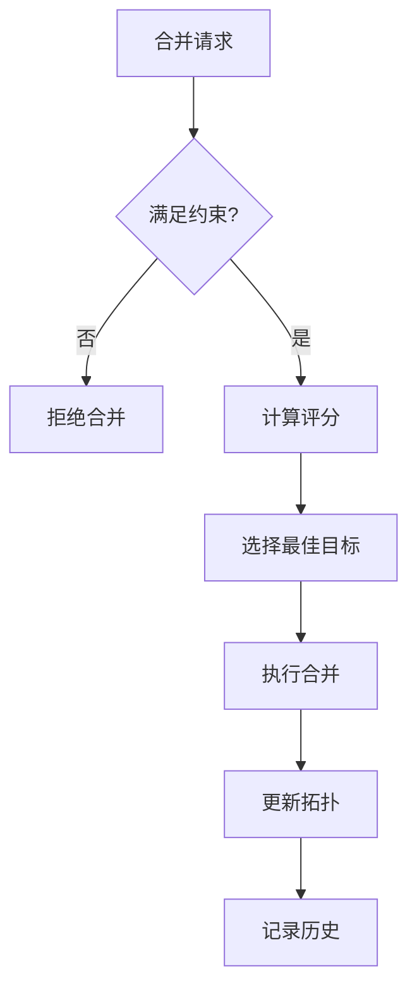

**图表来源**
- [watershed_processor.py:249-280](file://01_CORE_SYSTEM/src/watershed_processor.py#L249-L280)
- [watershed_processor.py:326-353](file://01_CORE_SYSTEM/src/watershed_processor.py#L326-L353)

### 实现示例

#### 基于机器学习的合并策略

```python
class MLBasedMergeStrategy:
    def __init__(self, model_path=None):
        self.model = self._load_model(model_path)
        self.feature_extractor = FeatureExtractor()
        
    def calculate_merge_score(self, source, target):
        features = self.feature_extractor.extract_features(source, target)
        score = self.model.predict_proba(features)[1]
        return score
    
    def check_feasibility(self, source, target):
        # 检查拓扑约束
        if not self._check_topology_constraints(source, target):
            return False
        
        # 检查几何约束
        if not self._check_geometry_constraints(source, target):
            return False
            
        return True
```

#### 基于图论的优化策略

```python
class GraphOptimizationMergeStrategy:
    def __init__(self, graph_weight_config):
        self.graph_weight_config = graph_weight_config
        
    def calculate_merge_score(self, source, target):
        # 构建候选图
        candidate_graph = self._build_candidate_graph(source, target)
        
        # 计算最优路径
        optimal_path = self._find_optimal_path(candidate_graph)
        
        # 计算综合评分
        score = self._calculate_composite_score(optimal_path)
        
        return score
```

**章节来源**
- [watershed_processor.py:164-220](file://01_CORE_SYSTEM/src/watershed_processor.py#L164-L220)
- [watershed_processor.py:326-353](file://01_CORE_SYSTEM/src/watershed_processor.py#L326-L353)

## 自定义编码规则实现

### 编码体系扩展

#### 层级定义扩展

系统支持自定义层级定义，通过配置文件实现：

```json
{
  "hierarchy": {
    "custom_levels": {
      "7级": {
        "bits": 14,
        "min_area": 10,
        "description": "微小单元"
      },
      "8级": {
        "bits": 16,
        "min_area": 1,
        "description": "超细单元"
      }
    },
    "level_mapping": {
      "7级": "Level_7",
      "8级": "Level_8"
    }
  }
}
```

#### 编码生成算法扩展

```python
class CustomEncodingAlgorithm:
    def __init__(self, encoding_config):
        self.encoding_config = encoding_config
        self.code_generators = self._setup_code_generators()
        
    def assign_custom_level(self, watershed_data):
        """自定义层级分配算法"""
        # 实现基于特定规则的层级分配
        pass
        
    def generate_custom_code(self, watershed_data, level):
        """自定义编码生成算法"""
        # 实现特定格式的编码生成
        pass
        
    def validate_custom_code(self, code):
        """自定义编码验证算法"""
        # 实现编码格式和逻辑验证
        pass
```

### 编码规则验证

#### 格式验证规则

```python
class EncodingValidationRule:
    def __init__(self, rule_config):
        self.rule_config = rule_config
        
    def validate_length(self, code):
        """验证编码长度"""
        min_len = self.rule_config.get('min_length', 1)
        max_len = self.rule_config.get('max_length', float('inf'))
        return min_len <= len(code) <= max_len
        
    def validate_characters(self, code):
        """验证字符集"""
        allowed_chars = self.rule_config.get('allowed_characters', '0-9')
        return all(c in allowed_chars for c in code)
        
    def validate_checksum(self, code):
        """验证校验和"""
        if 'checksum' not in self.rule_config:
            return True
            
        calc_checksum = self._calculate_checksum(code[:-1])
        return calc_checksum == int(code[-1])
```

**章节来源**
- [hierarchy_encoder.py:42-67](file://01_CORE_SYSTEM/src/hierarchy_encoder.py#L42-L67)
- [hierarchy_encoder.py:140-169](file://01_CORE_SYSTEM/src/hierarchy_encoder.py#L140-L169)

## 性能优化技巧

### 算法层面优化

#### 1. 动态阈值优化

```python
class OptimizedThresholdCalculator:
    def __init__(self):
        self.threshold_cache = {}
        self.cache_size_limit = 1000
        
    def calculate_threshold_with_cache(self, data_hash, watershed_data):
        """带缓存的阈值计算"""
        if data_hash in self.threshold_cache:
            return self.threshold_cache[data_hash]
            
        threshold = self._calculate_threshold(watershed_data)
        
        # 管理缓存大小
        if len(self.threshold_cache) >= self.cache_size_limit:
            self._evict_cache()
            
        self.threshold_cache[data_hash] = threshold
        return threshold
        
    def _evict_cache(self):
        """缓存淘汰策略"""
        oldest_key = next(iter(self.threshold_cache))
        del self.threshold_cache[oldest_key]
```

#### 2. 并行处理优化

```python
class ParallelWatershedProcessor:
    def __init__(self, max_workers=None):
        self.max_workers = max_workers or multiprocessing.cpu_count()
        self.executor = ProcessPoolExecutor(max_workers=max_workers)
        
    async def process_batch_merge(self, watershed_groups):
        """批处理并行合并"""
        futures = []
        for group in watershed_groups:
            future = self.executor.submit(
                self._merge_group_synchronously, group
            )
            futures.append(future)
            
        results = []
        for future in as_completed(futures):
            results.append(future.result())
            
        return results
```

### 内存管理优化

#### 1. 流式处理

```python
class StreamProcessingEngine:
    def __init__(self, chunk_size=1000):
        self.chunk_size = chunk_size
        
    def process_large_dataset(self, file_path):
        """流式处理大型数据集"""
        with open(file_path, 'r') as file:
            chunk = []
            for line in file:
                chunk.append(line)
                
                if len(chunk) >= self.chunk_size:
                    yield self._process_chunk(chunk)
                    chunk = []
                    
            if chunk:  # 处理最后一个不完整的块
                yield self._process_chunk(chunk)
```

#### 2. 内存映射

```python
class MemoryMappedProcessor:
    def __init__(self, temp_dir='/tmp'):
        self.temp_dir = temp_dir
        
    def process_with_memory_mapping(self, large_array):
        """使用内存映射处理大型数组"""
        # 创建临时文件
        temp_file = tempfile.NamedTemporaryFile(delete=False, dir=self.temp_dir)
        temp_file.close()
        
        # 使用内存映射
        with mmap.mmap(temp_file.fileno(), 0, access=mmap.ACCESS_WRITE) as mmapped_array:
            # 处理数据
            self._process_in_chunks(large_array, mmapped_array)
            
        # 清理临时文件
        os.unlink(temp_file.name)
```

**章节来源**
- [distributed_shuc_framework.py:21-44](file://03_EXTENSIONS/distributed_shuc_framework.py#L21-L44)
- [distributed_shuc_framework.py:81-147](file://03_EXTENSIONS/distributed_shuc_framework.py#L81-L147)

## 内存管理最佳实践

### 1. 对象生命周期管理

```python
class ResourceManager:
    def __init__(self):
        self.managed_objects = []
        
    def register_object(self, obj, cleanup_func=None):
        """注册需要清理的对象"""
        self.managed_objects.append({
            'object': obj,
            'cleanup': cleanup_func or self._default_cleanup
        })
        
    def cleanup_all(self):
        """清理所有注册的对象"""
        for item in self.managed_objects:
            try:
                item['cleanup'](item['object'])
            except Exception as e:
                logging.warning(f"Cleanup failed: {e}")
                
    def _default_cleanup(self, obj):
        """默认清理方法"""
        if hasattr(obj, 'close'):
            obj.close()
        elif hasattr(obj, '__del__'):
            obj.__del__()
```

### 2. 大数据集处理

```python
class LargeDatasetProcessor:
    def __init__(self, memory_limit_gb=4):
        self.memory_limit = memory_limit_gb * 1024 * 1024 * 1024  # 字节
        
    def process_with_monitoring(self, data_generator):
        """监控内存使用的数据处理"""
        batch = []
        batch_size = 0
        
        for item in data_generator:
            item_size = self._estimate_item_size(item)
            
            if batch_size + item_size > self.memory_limit:
                yield self._process_batch(batch)
                batch = []
                batch_size = 0
                
            batch.append(item)
            batch_size += item_size
            
        if batch:
            yield self._process_batch(batch)
            
    def _estimate_item_size(self, item):
        """估算对象大小"""
        return sys.getsizeof(item)
```

### 3. 缓存策略

```python
class AdaptiveCache:
    def __init__(self, max_size=1000, ttl=3600):
        self.cache = {}
        self.access_times = {}
        self.max_size = max_size
        self.ttl = ttl
        
    def get(self, key):
        """获取缓存项"""
        if key in self.cache:
            if time.time() - self.access_times[key] < self.ttl:
                self.access_times[key] = time.time()
                return self.cache[key]
            else:
                del self.cache[key]
                del self.access_times[key]
                
        return None
        
    def put(self, key, value):
        """放入缓存项"""
        if len(self.cache) >= self.max_size:
            self._evict_lru()
            
        self.cache[key] = value
        self.access_times[key] = time.time()
        
    def _evict_lru(self):
        """LRU淘汰策略"""
        oldest_key = min(self.access_times.keys(), 
                       key=lambda k: self.access_times[k])
        del self.cache[oldest_key]
        del self.access_times[oldest_key]
```

**章节来源**
- [distributed_shuc_framework.py:38-44](file://03_EXTENSIONS/distributed_shuc_framework.py#L38-L44)
- [distributed_shuc_framework.py:54-53](file://03_EXTENSIONS/distributed_shuc_framework.py#L54-L53)

## 测试与验证方法

### 单元测试设计

#### 1. 核心算法测试

```python
import unittest
from unittest.mock import Mock, patch

class TestWatershedProcessor(unittest.TestCase):
    def setUp(self):
        self.processor = WatershedProcessor(get_default_config()['processing'])
        self.test_data = self._create_test_watershed_data()
        
    def test_dynamic_threshold_calculation(self):
        """测试动态阈值计算"""
        threshold = self.processor._calculate_dynamic_threshold()
        self.assertIsInstance(threshold, float)
        self.assertGreaterEqual(threshold, 50)
        self.assertLessEqual(threshold, 100)
        
    def test_merge_target_selection(self):
        """测试合并目标选择"""
        target = self.processor._find_merge_target(0, self.test_data.iloc[0])
        self.assertIsNotNone(target)
        
    def test_topology_update(self):
        """测试拓扑关系更新"""
        original_edges = len(self.processor.topology_graph.edges)
        self.processor._update_topology_after_merge(0, 1)
        new_edges = len(self.processor.topology_graph.edges)
        self.assertEqual(new_edges, original_edges)
        
    def tearDown(self):
        self.processor = None
```

#### 2. 集成测试

```python
class TestFullPipeline(unittest.TestCase):
    def test_end_to_end_processing(self):
        """测试端到端处理流程"""
        # 准备测试数据
        test_input = self._create_test_input()
        
        # 创建系统实例
        system = ChinaSHUCSystem()
        
        # 执行处理
        result = system.process_watersheds(test_input)
        
        # 验证结果
        self.assertIsNotNone(result.watershed_data)
        self.assertGreater(result.watershed_count, 0)
        self.assertGreaterEqual(result.compliance_rate, 0.8)
        self.assertGreaterEqual(result.overall_score, 70)
        
    def test_result_persistence(self):
        """测试结果持久化"""
        system = ChinaSHUCSystem()
        result = system.process_watersheds(self._create_test_input())
        
        # 验证输出文件
        self.assertIn('watersheds', result.output_files)
        self.assertIn('validation_report', result.output_files)
        self.assertIn('statistics', result.output_files)
        
        # 验证文件内容
        self.assertTrue(Path(result.output_files['watersheds']).exists())
        self.assertTrue(Path(result.output_files['validation_report']).exists())
```

### 性能测试

#### 1. 基准测试

```python
import time
import cProfile
from memory_profiler import profile

class PerformanceBenchmark:
    def __init__(self):
        self.metrics = {}
        
    @profile
    def benchmark_merge_algorithm(self, data_size):
        """基准测试合并算法"""
        test_data = self._generate_test_data(data_size)
        
        start_time = time.time()
        processor = WatershedProcessor(get_default_config()['processing'])
        result = processor.merge_watersheds(test_data)
        end_time = time.time()
        
        self.metrics[f'merge_{data_size}'] = {
            'execution_time': end_time - start_time,
            'memory_usage': self._get_memory_usage(),
            'result_size': result['statistics']['final_count']
        }
        
    def benchmark_full_pipeline(self, data_sizes):
        """基准测试完整流程"""
        for size in data_sizes:
            self.benchmark_merge_algorithm(size)
            
        return self.metrics
```

#### 2. 回归测试

```python
class RegressionTestSuite:
    def __init__(self):
        self.reference_results = self._load_reference_results()
        
    def run_regression_tests(self):
        """运行回归测试"""
        test_cases = self._generate_test_cases()
        failures = []
        
        for i, test_case in enumerate(test_cases):
            try:
                result = self._execute_test_case(test_case)
                self._compare_with_reference(result, test_case)
            except Exception as e:
                failures.append((i, str(e)))
                
        return failures
        
    def _compare_with_reference(self, result, test_case):
        """与参考结果比较"""
        reference = self.reference_results[test_case['id']]
        
        # 比较关键指标
        self._assert_close(
            result['compliance_rate'],
            reference['compliance_rate'],
            tolerance=0.01
        )
        
        self._assert_close(
            result['compression_rate'],
            reference['compression_rate'],
            tolerance=0.01
        )
        
        # 比较几何属性
        self._assert_close(
            result['area_mean'],
            reference['area_mean'],
            tolerance=0.05
        )
```

**章节来源**
- [advanced_demo.py:62-98](file://01_CORE_SYSTEM/examples/advanced_demo.py#L62-L98)
- [advanced_demo.py:169-227](file://01_CORE_SYSTEM/examples/advanced_demo.py#L169-L227)

## 向后兼容性维护

### 版本兼容性策略

#### 1. API兼容性保证

```python
class BackwardCompatibilityLayer:
    def __init__(self):
        self.deprecated_methods = {}
        self.version_matrix = self._build_version_matrix()
        
    def _build_version_matrix(self):
        """构建版本兼容矩阵"""
        return {
            '3.0.0': {
                'required_params': ['input_shapefile'],
                'optional_params': ['output_name', 'config_path']
            },
            '3.1.0': {
                'required_params': ['input_shapefile'],
                'optional_params': ['output_name', 'config_path', 'output_dir']
            }
        }
        
    def validate_api_compatibility(self, version, params):
        """验证API兼容性"""
        required = self.version_matrix[version]['required_params']
        missing = [p for p in required if p not in params]
        
        if missing:
            raise ValueError(f"缺失必需参数: {missing}")
            
        return True
        
    def deprecate_method(self, method_name, replacement, version):
        """标记方法已弃用"""
        self.deprecated_methods[method_name] = {
            'replacement': replacement,
            'version': version,
            'message': f"方法 {method_name} 已弃用，请使用 {replacement}"
        }
        
    def get_deprecation_warning(self, method_name):
        """获取弃用警告"""
        if method_name in self.deprecated_methods:
            return self.deprecated_methods[method_name]['message']
        return None
```

#### 2. 配置文件兼容性

```python
class ConfigCompatibilityManager:
    def __init__(self):
        self.config_migration_map = self._build_migration_map()
        
    def _build_migration_map(self):
        """构建配置迁移映射"""
        return {
            '3.0.0': {
                'processing': {
                    'target_compliance_rate': 'processing.target_compliance_rate',
                    'merge_strategy': 'processing.merge_strategy'
                }
            },
            '3.1.0': {
                'processing': {
                    'enable_early_stopping': 'processing.enable_early_stopping',
                    'dynamic_threshold_mode': 'processing.dynamic_threshold_mode'
                }
            }
        }
        
    def migrate_config(self, old_config, target_version):
        """迁移配置文件"""
        new_config = deepcopy(old_config)
        
        if target_version in self.config_migration_map:
            migration_rules = self.config_migration_map[target_version]
            new_config = self._apply_migration_rules(new_config, migration_rules)
            
        return new_config
        
    def _apply_migration_rules(self, config, rules):
        """应用迁移规则"""
        for section, mappings in rules.items():
            if section in config:
                for old_key, new_key in mappings.items():
                    if old_key in config[section]:
                        # 重命名键
                        config[section][new_key] = config[section][old_key]
                        del config[section][old_key]
                        
        return config
```

### 兼容性测试

#### 1. 自动化兼容性测试

```python
class CompatibilityTestRunner:
    def __init__(self):
        self.test_scenarios = self._build_test_scenarios()
        
    def run_compatibility_tests(self):
        """运行兼容性测试套件"""
        results = {}
        
        for scenario in self.test_scenarios:
            try:
                result = self._execute_scenario(scenario)
                results[scenario['name']] = {
                    'passed': True,
                    'details': result
                }
            except Exception as e:
                results[scenario['name']] = {
                    'passed': False,
                    'error': str(e)
                }
                
        return results
        
    def _build_test_scenarios(self):
        """构建测试场景"""
        return [
            {
                'name': 'API_signature_backward_compatibility',
                'test_function': self._test_api_signature,
                'expected_behavior': '保持API签名不变'
            },
            {
                'name': 'Output_format_backward_compatibility',
                'test_function': self._test_output_format,
                'expected_behavior': '保持输出格式不变'
            },
            {
                'name': 'Config_file_backward_compatibility',
                'test_function': self._test_config_compatibility,
                'expected_behavior': '支持旧配置文件格式'
            }
        ]
```

#### 2. 兼容性报告生成

```python
class CompatibilityReportGenerator:
    def __init__(self, test_results):
        self.test_results = test_results
        
    def generate_html_report(self, output_file):
        """生成HTML兼容性报告"""
        report_content = self._build_report_template()
        
        with open(output_file, 'w', encoding='utf-8') as f:
            f.write(report_content)
            
    def _build_report_template(self):
        """构建报告模板"""
        html = """
        <!DOCTYPE html>
        <html>
        <head>
            <title>向后兼容性测试报告</title>
        </head>
        <body>
            <h1>向后兼容性测试报告</h1>
            <div class="summary">
                <h2>测试摘要</h2>
                <table>
                    <tr>
                        <th>测试场景</th>
                        <th>状态</th>
                        <th>详细信息</th>
                    </tr>
        """
        
        for scenario_name, result in self.test_results.items():
            status = "通过" if result['passed'] else "失败"
            html += f"""
            <tr>
                <td>{scenario_name}</td>
                <td>{status}</td>
                <td>{result.get('details', '')}</td>
            </tr>
            """
            
        html += "</table></div></body></html>"
        return html
```

**章节来源**
- [shuc_system.py:59-91](file://01_CORE_SYSTEM/src/shuc_system.py#L59-L91)
- [utils.py:128-147](file://01_CORE_SYSTEM/src/utils.py#L128-L147)

## 故障排除指南

### 常见问题诊断

#### 1. 数据处理问题

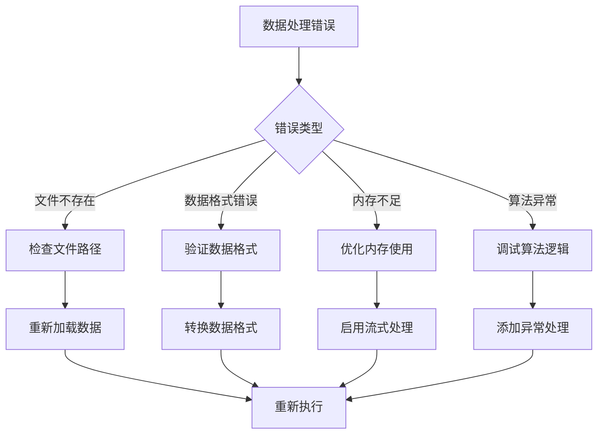

**图表来源**
- [shuc_system.py:165-196](file://01_CORE_SYSTEM/src/shuc_system.py#L165-L196)
- [utils.py:159-221](file://01_CORE_SYSTEM/src/utils.py#L159-L221)

#### 2. 性能问题诊断

```python
class PerformanceDiagnosticTool:
    def __init__(self):
        self.performance_metrics = {}
        
    def diagnose_performance_issues(self):
        """诊断性能问题"""
        issues = []
        
        # 检查内存使用
        memory_issue = self._check_memory_usage()
        if memory_issue:
            issues.append(memory_issue)
            
        # 检查CPU使用
        cpu_issue = self._check_cpu_usage()
        if cpu_issue:
            issues.append(cpu_issue)
            
        # 检查I/O性能
        io_issue = self._check_io_performance()
        if io_issue:
            issues.append(io_issue)
            
        return issues
        
    def _check_memory_usage(self):
        """检查内存使用情况"""
        memory_usage = psutil.virtual_memory().percent
        if memory_usage > 80:
            return f"内存使用率过高: {memory_usage}%"
        return None
        
    def _check_cpu_usage(self):
        """检查CPU使用情况"""
        cpu_usage = psutil.cpu_percent(interval=1)
        if cpu_usage > 90:
            return f"CPU使用率过高: {cpu_usage}%"
        return None
        
    def _check_io_performance(self):
        """检查I/O性能"""
        io_counters = psutil.disk_io_counters()
        if io_counters:
            read_ops = io_counters.read_count
            write_ops = io_counters.write_count
            if read_ops + write_ops > 1000:
                return "I/O操作频繁，可能影响性能"
        return None
```

#### 3. 算法调试工具

```python
class AlgorithmDebuggingTool:
    def __init__(self, debug_config):
        self.debug_config = debug_config
        self.debug_log = []
        
    def enable_debug_mode(self, component):
        """启用调试模式"""
        self.debug_config[component] = True
        
    def log_step(self, component, step, data):
        """记录处理步骤"""
        if self.debug_config.get(component, False):
            log_entry = {
                'component': component,
                'step': step,
                'timestamp': time.time(),
                'data': data
            }
            self.debug_log.append(log_entry)
            
    def export_debug_log(self, output_file):
        """导出调试日志"""
        with open(output_file, 'w') as f:
            json.dump(self.debug_log, f, indent=2)
            
    def analyze_debug_data(self):
        """分析调试数据"""
        if not self.debug_log:
            return "无调试数据"
            
        analysis = {
            'total_steps': len(self.debug_log),
            'components': {},
            'timing_analysis': self._analyze_timing(),
            'data_flow': self._analyze_data_flow()
        }
        
        return analysis
```

**章节来源**
- [shuc_system.py:165-196](file://01_CORE_SYSTEM/src/shuc_system.py#L165-L196)
- [utils.py:244-271](file://01_CORE_SYSTEM/src/utils.py#L244-L271)

## 结论

本扩展开发指南提供了基于中国SHUC系统的完整扩展开发框架。通过深入分析核心组件架构、识别扩展点、设计插件系统和制定新算法集成步骤，开发者可以有效地扩展系统功能。

### 关键要点总结

1. **架构设计**：系统采用模块化设计，核心组件职责清晰，便于扩展
2. **扩展点识别**：通过配置文件和接口设计实现灵活的功能扩展
3. **插件系统**：支持动态加载和替换核心算法组件
4. **性能优化**：提供内存管理和并行处理的最佳实践
5. **测试验证**：建立完善的测试体系确保扩展功能的可靠性
6. **兼容性维护**：制定版本兼容性策略保证系统稳定性

### 未来发展方向

1. **分布式处理**：利用分布式框架处理更大规模的数据集
2. **机器学习集成**：引入AI算法提升处理精度和效率
3. **实时处理**：支持流式数据处理和实时响应
4. **云原生部署**：优化容器化和微服务架构

通过遵循本指南提供的开发规范和最佳实践，开发者可以安全、高效地扩展中国SHUC系统，满足不同应用场景的需求。