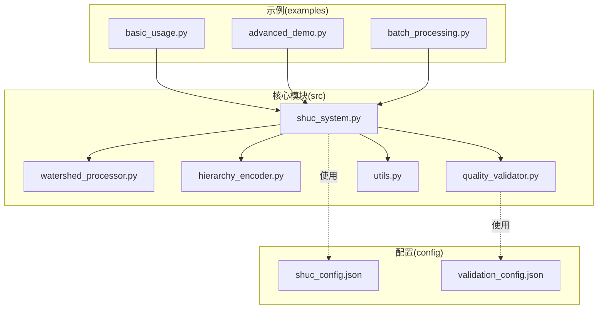
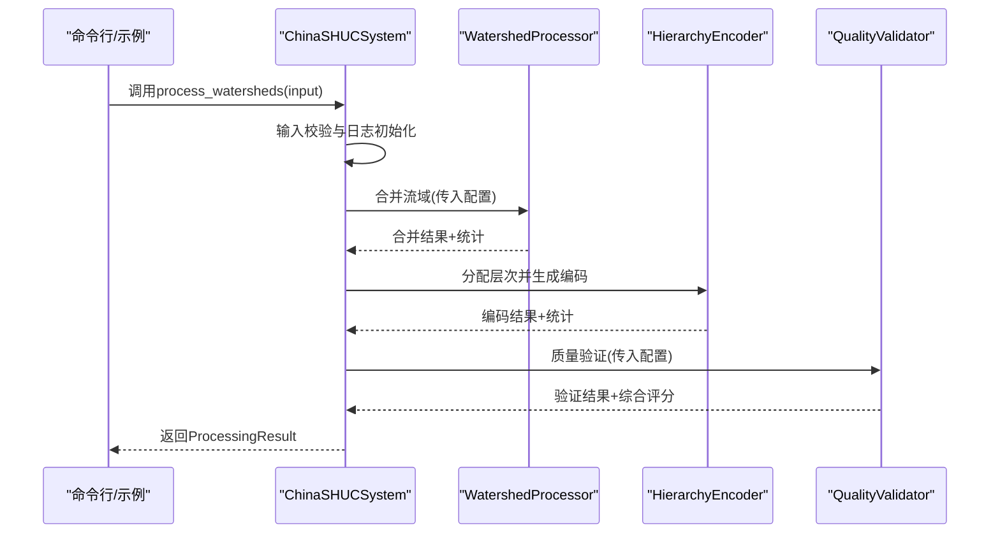
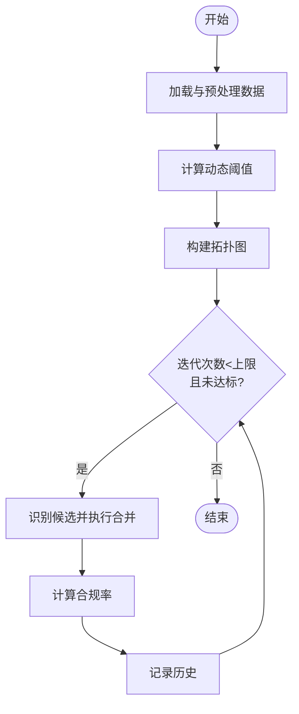
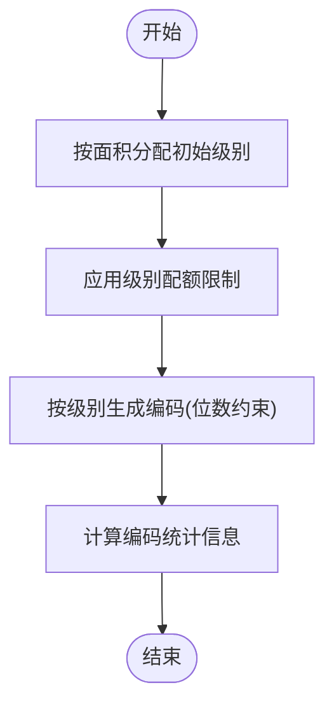
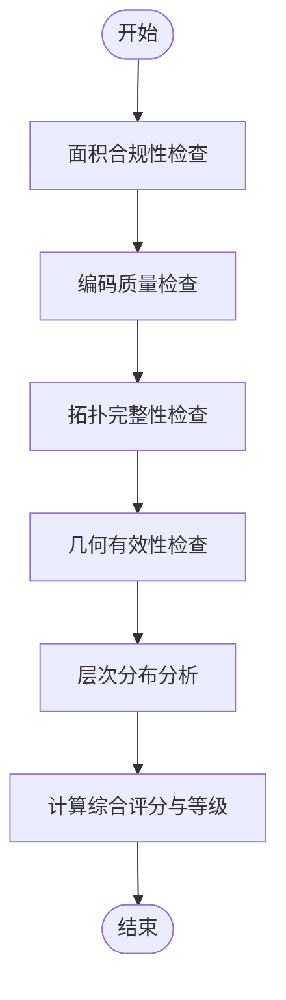
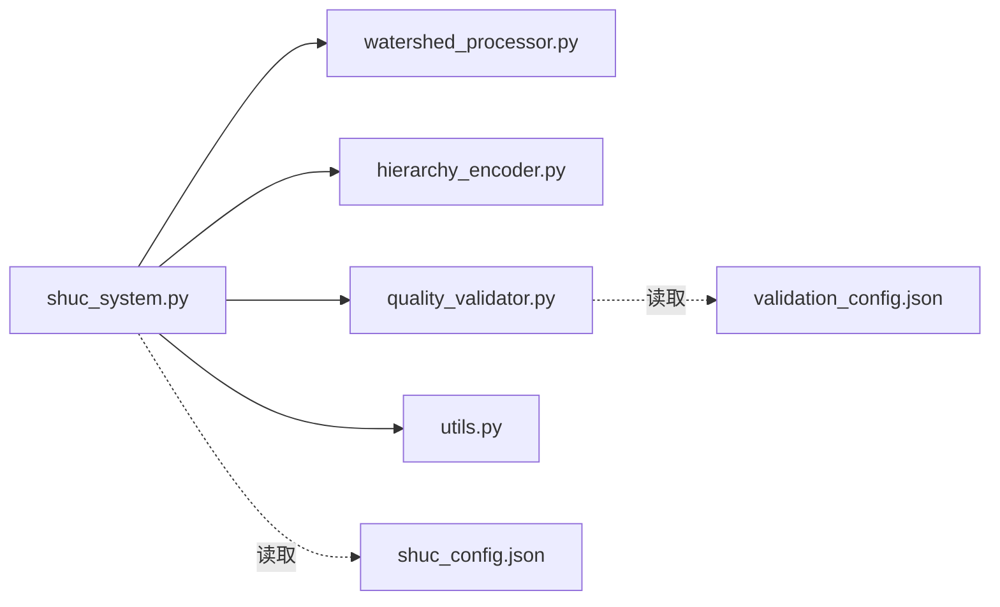

# 测试指南

<cite>
**本文档引用的文件**
- [shuc_system.py](file://01_CORE_SYSTEM/src/shuc_system.py)
- [watershed_processor.py](file://01_CORE_SYSTEM/src/watershed_processor.py)
- [hierarchy_encoder.py](file://01_CORE_SYSTEM/src/hierarchy_encoder.py)
- [quality_validator.py](file://01_CORE_SYSTEM/src/quality_validator.py)
- [utils.py](file://01_CORE_SYSTEM/src/utils.py)
- [shuc_config.json](file://01_CORE_SYSTEM/config/shuc_config.json)
- [validation_config.json](file://01_CORE_SYSTEM/config/validation_config.json)
- [basic_usage.py](file://01_CORE_SYSTEM/examples/basic_usage.py)
- [advanced_demo.py](file://01_CORE_SYSTEM/examples/advanced_demo.py)
- [batch_processing.py](file://01_CORE_SYSTEM/examples/batch_processing.py)
</cite>

## 目录
1. [简介](#简介)
2. [项目结构](#项目结构)
3. [核心组件](#核心组件)
4. [架构总览](#架构总览)
5. [详细组件分析](#详细组件分析)
6. [依赖分析](#依赖分析)
7. [性能考虑](#性能考虑)
8. [故障排查指南](#故障排查指南)
9. [结论](#结论)
10. [附录](#附录)

## 简介
本测试指南面向中国SHUC流域分级编码系统，提供从单元测试、集成测试到端到端测试的完整实施方法。内容覆盖测试框架选择与配置（以pytest为核心）、测试用例设计原则（正常流程、边界条件、异常情况）、核心算法正确性与性能测试、测试数据准备与模拟对象使用、测试覆盖率要求，以及测试自动化与持续集成配置建议。文档同时结合系统源码与配置文件，给出可直接落地的测试策略与步骤。

## 项目结构
系统采用“核心模块 + 配置 + 示例 + 测试”的组织方式，核心逻辑集中在src目录，配置位于config目录，examples提供使用示例，tests目录目前为空，是后续补充测试的重点区域。

**图表来源**
- [shuc_system.py:1-335](file://01_CORE_SYSTEM/src/shuc_system.py#L1-L335)
- [watershed_processor.py:1-377](file://01_CORE_SYSTEM/src/watershed_processor.py#L1-L377)
- [hierarchy_encoder.py:1-219](file://01_CORE_SYSTEM/src/hierarchy_encoder.py#L1-L219)
- [quality_validator.py:1-411](file://01_CORE_SYSTEM/src/quality_validator.py#L1-L411)
- [utils.py:1-360](file://01_CORE_SYSTEM/src/utils.py#L1-L360)
- [shuc_config.json:1-43](file://01_CORE_SYSTEM/config/shuc_config.json#L1-L43)
- [validation_config.json:1-46](file://01_CORE_SYSTEM/config/validation_config.json#L1-L46)
- [basic_usage.py:1-106](file://01_CORE_SYSTEM/examples/basic_usage.py#L1-L106)
- [advanced_demo.py:1-272](file://01_CORE_SYSTEM/examples/advanced_demo.py#L1-L272)
- [batch_processing.py:1-327](file://01_CORE_SYSTEM/examples/batch_processing.py#L1-L327)

**章节来源**
- [shuc_system.py:1-335](file://01_CORE_SYSTEM/src/shuc_system.py#L1-L335)
- [shuc_config.json:1-43](file://01_CORE_SYSTEM/config/shuc_config.json#L1-L43)
- [validation_config.json:1-46](file://01_CORE_SYSTEM/config/validation_config.json#L1-L46)
- [basic_usage.py:1-106](file://01_CORE_SYSTEM/examples/basic_usage.py#L1-L106)
- [advanced_demo.py:1-272](file://01_CORE_SYSTEM/examples/advanced_demo.py#L1-L272)
- [batch_processing.py:1-327](file://01_CORE_SYSTEM/examples/batch_processing.py#L1-L327)

## 核心组件
- 中国SHUC系统主程序：协调数据预处理、智能合并、层次编码与质量验证，封装处理结果。
- 流域处理器：实现动态阈值计算、拓扑图构建与激进合并策略，保障90%面积合规率。
- 层次编码器：基于面积的智能分级与配额控制，生成2-12位编码。
- 质量验证器：多维质量评估（面积合规、编码唯一性、拓扑完整性、几何有效性）与综合评分。
- 工具函数：日志、配置加载、文件校验、结果导出等通用能力。

**章节来源**
- [shuc_system.py:43-286](file://01_CORE_SYSTEM/src/shuc_system.py#L43-L286)
- [watershed_processor.py:24-377](file://01_CORE_SYSTEM/src/watershed_processor.py#L24-L377)
- [hierarchy_encoder.py:22-219](file://01_CORE_SYSTEM/src/hierarchy_encoder.py#L22-L219)
- [quality_validator.py:24-411](file://01_CORE_SYSTEM/src/quality_validator.py#L24-L411)
- [utils.py:24-360](file://01_CORE_SYSTEM/src/utils.py#L24-L360)

## 架构总览
系统采用模块化架构，主程序作为编排器，调用各子模块完成端到端处理；配置文件驱动行为；示例脚本演示典型用法。

**图表来源**
- [shuc_system.py:92-164](file://01_CORE_SYSTEM/src/shuc_system.py#L92-L164)
- [watershed_processor.py:54-81](file://01_CORE_SYSTEM/src/watershed_processor.py#L54-L81)
- [hierarchy_encoder.py:69-95](file://01_CORE_SYSTEM/src/hierarchy_encoder.py#L69-L95)
- [quality_validator.py:61-86](file://01_CORE_SYSTEM/src/quality_validator.py#L61-L86)

## 详细组件分析

### 单元测试设计与实现要点
- 测试框架：推荐使用pytest，具备强大的夹具、参数化、覆盖率与插件生态。
- 测试组织：按模块划分测试文件（如test_watershed_processor.py），每个模块对应一个或多个测试类。
- 断言策略：对返回值、副作用（文件写入）、异常抛出进行断言；对内部状态（如拓扑图节点/边）进行验证。
- 模拟与夹具：使用unittest.mock或pytest-mock模拟外部依赖（如文件系统、网络、第三方库）；使用pytest fixtures提供共享的测试数据与配置。

**章节来源**
- [watershed_processor.py:54-81](file://01_CORE_SYSTEM/src/watershed_processor.py#L54-L81)
- [hierarchy_encoder.py:69-95](file://01_CORE_SYSTEM/src/hierarchy_encoder.py#L69-L95)
- [quality_validator.py:61-86](file://01_CORE_SYSTEM/src/quality_validator.py#L61-L86)
- [utils.py:64-126](file://01_CORE_SYSTEM/src/utils.py#L64-L126)

### 集成测试设计与实现要点
- 接口契约：围绕ChinaSHUCSystem的process_watersheds方法，验证各子模块协作是否满足预期。
- 配置注入：通过临时配置文件或字典注入，验证不同配置组合下的行为一致性。
- 中间产物：验证合并历史、动态阈值、编码统计等中间结果的正确性与稳定性。
- 异常传播：验证输入校验失败、文件读取异常、保存失败等场景的异常传播与日志记录。

**章节来源**
- [shuc_system.py:92-164](file://01_CORE_SYSTEM/src/shuc_system.py#L92-L164)
- [shuc_system.py:198-237](file://01_CORE_SYSTEM/src/shuc_system.py#L198-L237)
- [shuc_config.json:1-43](file://01_CORE_SYSTEM/config/shuc_config.json#L1-L43)

### 端到端测试设计与实现要点
- 场景覆盖：包含基础流程（输入数据存在、处理完成、输出文件生成）、边界条件（空数据、极小/极大面积、拓扑缺失）、异常情况（文件损坏、权限不足、依赖缺失）。
- 数据准备：使用示例数据或合成数据，确保字段齐全（如LINKNO、DSLINKNO1、USLINKNO2、geometry等）。
- 结果验证：验证输出Shapefile、验证报告、统计文件的完整性与内容正确性；对面积合规率、层次分布、编码唯一性进行核对。
- 回归保障：将示例脚本作为回归用例，确保主流程稳定。

**章节来源**
- [basic_usage.py:25-73](file://01_CORE_SYSTEM/examples/basic_usage.py#L25-L73)
- [advanced_demo.py:31-60](file://01_CORE_SYSTEM/examples/advanced_demo.py#L31-L60)
- [batch_processing.py:227-323](file://01_CORE_SYSTEM/examples/batch_processing.py#L227-L323)

### 核心算法正确性与性能测试

#### 流域合并算法（动态阈值与拓扑合并）
- 正确性测试
  - 动态阈值计算：构造不同面积分布的数据集，验证阈值落在合理区间且随分位数变化。
  - 合并策略：验证下游优先、上游次之、相邻再次、最近最后的合并顺序；验证拓扑引用更新。
  - 合规率收敛：在不同迭代次数与早期停止策略下，验证合规率达到目标阈值。
- 性能测试
  - 时间复杂度：对不同规模数据集测量处理时间，绘制吞吐曲线。
  - 内存占用：监控峰值内存，结合配置中的最大内存限制进行压力测试。
  - 并行化：若启用并行，验证线程/进程安全与结果一致性。

**图表来源**
- [watershed_processor.py:117-141](file://01_CORE_SYSTEM/src/watershed_processor.py#L117-L141)
- [watershed_processor.py:164-220](file://01_CORE_SYSTEM/src/watershed_processor.py#L164-L220)

**章节来源**
- [watershed_processor.py:117-220](file://01_CORE_SYSTEM/src/watershed_processor.py#L117-L220)

#### 层次编码算法（分级与配额）
- 正确性测试
  - 初始分级：按面积阈值分配级别，验证各级别覆盖范围。
  - 配额优化：验证超出配额的流域按面积降级规则执行。
  - 编码生成：验证编码位数与唯一性，溢出编码的格式与命名。
- 性能测试
  - 编码生成时间：对大规模数据集测量编码生成耗时。
  - 统计计算：验证统计指标（分布、范围、面积统计）的准确性与性能。

**图表来源**
- [hierarchy_encoder.py:97-138](file://01_CORE_SYSTEM/src/hierarchy_encoder.py#L97-L138)
- [hierarchy_encoder.py:140-169](file://01_CORE_SYSTEM/src/hierarchy_encoder.py#L140-L169)
- [hierarchy_encoder.py:177-219](file://01_CORE_SYSTEM/src/hierarchy_encoder.py#L177-L219)

**章节来源**
- [hierarchy_encoder.py:97-169](file://01_CORE_SYSTEM/src/hierarchy_encoder.py#L97-L169)
- [hierarchy_encoder.py:177-219](file://01_CORE_SYSTEM/src/hierarchy_encoder.py#L177-L219)

#### 质量验证算法（多维评分）
- 正确性测试
  - 面积合规：验证动态阈值与合规率计算一致。
  - 编码质量：验证唯一性、格式分析与重复编码计数。
  - 拓扑完整性：验证上游引用、孤儿流域、循环引用检测。
  - 几何有效性：验证几何类型统计与有效性比率。
  - 综合评分：验证加权求和与等级判定。
- 性能测试
  - 大规模几何验证：对复杂几何集合进行有效性与类型统计的性能评估。

**图表来源**
- [quality_validator.py:100-122](file://01_CORE_SYSTEM/src/quality_validator.py#L100-L122)
- [quality_validator.py:142-168](file://01_CORE_SYSTEM/src/quality_validator.py#L142-L168)
- [quality_validator.py:191-223](file://01_CORE_SYSTEM/src/quality_validator.py#L191-L223)
- [quality_validator.py:255-284](file://01_CORE_SYSTEM/src/quality_validator.py#L255-L284)
- [quality_validator.py:286-332](file://01_CORE_SYSTEM/src/quality_validator.py#L286-L332)
- [quality_validator.py:368-411](file://01_CORE_SYSTEM/src/quality_validator.py#L368-L411)

**章节来源**
- [quality_validator.py:100-332](file://01_CORE_SYSTEM/src/quality_validator.py#L100-L332)
- [quality_validator.py:368-411](file://01_CORE_SYSTEM/src/quality_validator.py#L368-L411)

### 测试数据准备与模拟对象
- 测试数据
  - 使用示例数据作为基准数据集，确保字段齐全（LINKNO、DSLINKNO1、USLINKNO2、geometry等）。
  - 构造边界数据：极小/极大面积、拓扑缺失、无效几何、重复编码等。
- 模拟对象
  - 使用pytest-mock模拟文件系统（如读写Shapefile）、网络请求、第三方库行为。
  - 使用unittest.mock.patch装饰器或with上下文替换配置加载、日志输出等外部依赖。

**章节来源**
- [basic_usage.py:36-48](file://01_CORE_SYSTEM/examples/basic_usage.py#L36-L48)
- [utils.py:64-126](file://01_CORE_SYSTEM/src/utils.py#L64-L126)

### 测试用例设计原则与最佳实践
- 正常流程
  - 输入数据合法、字段齐全、几何有效。
  - 合并后合规率达到目标阈值，编码唯一且符合位数规范。
  - 质量验证通过，综合评分达标。
- 边界条件
  - 空数据集、单条记录、极端面积分布。
  - 阈值边界（刚好达标/刚好不达标）、配额边界（刚好超限/刚好未超限）。
  - 拓扑边界（无下游、循环引用、孤立点）。
- 异常情况
  - 输入文件不存在、读取失败、字段缺失、几何无效。
  - 保存失败、权限不足、磁盘空间不足。
  - 配置解析失败、参数越界、并发冲突。

**章节来源**
- [shuc_system.py:165-196](file://01_CORE_SYSTEM/src/shuc_system.py#L165-L196)
- [shuc_system.py:198-237](file://01_CORE_SYSTEM/src/shuc_system.py#L198-L237)
- [watershed_processor.py:222-280](file://01_CORE_SYSTEM/src/watershed_processor.py#L222-L280)
- [quality_validator.py:191-223](file://01_CORE_SYSTEM/src/quality_validator.py#L191-L223)

### 测试覆盖率要求
- 行覆盖率：核心模块（合并、编码、验证）行覆盖率≥80%，关键分支≥90%。
- 分支覆盖率：确保动态阈值、合并策略、编码生成、验证规则的关键分支均被覆盖。
- 覆盖率工具：使用pytest-cov或coverage.py，结合CI配置自动报告覆盖率。

**章节来源**
- [watershed_processor.py:117-220](file://01_CORE_SYSTEM/src/watershed_processor.py#L117-L220)
- [hierarchy_encoder.py:97-169](file://01_CORE_SYSTEM/src/hierarchy_encoder.py#L97-L169)
- [quality_validator.py:100-332](file://01_CORE_SYSTEM/src/quality_validator.py#L100-L332)

### 测试自动化与持续集成
- CI流水线建议
  - 触发条件：push到主分支、创建PR、定时任务。
  - 步骤：安装依赖、运行pytest（带覆盖率）、上传覆盖率报告、生成测试报告。
  - 并行化：将测试拆分为单元测试、集成测试、端到端测试三类作业并行执行。
- 测试报告
  - pytest-html生成HTML报告；pytest-json-report生成机器可读报告。
  - 覆盖率阈值门禁：低于阈值则失败。
- 部署与回滚
  - 成功的测试才允许发布；失败时保留测试日志与报告以便追溯。

**章节来源**
- [basic_usage.py:25-73](file://01_CORE_SYSTEM/examples/basic_usage.py#L25-L73)
- [advanced_demo.py:31-60](file://01_CORE_SYSTEM/examples/advanced_demo.py#L31-L60)
- [batch_processing.py:227-323](file://01_CORE_SYSTEM/examples/batch_processing.py#L227-L323)

## 依赖分析
系统模块间依赖清晰，主程序聚合各子模块；配置文件驱动行为；示例脚本演示用法。

**图表来源**
- [shuc_system.py:38-41](file://01_CORE_SYSTEM/src/shuc_system.py#L38-L41)
- [shuc_system.py:74-79](file://01_CORE_SYSTEM/src/shuc_system.py#L74-L79)
- [shuc_config.json:1-43](file://01_CORE_SYSTEM/config/shuc_config.json#L1-L43)
- [validation_config.json:1-46](file://01_CORE_SYSTEM/config/validation_config.json#L1-L46)

**章节来源**
- [shuc_system.py:38-41](file://01_CORE_SYSTEM/src/shuc_system.py#L38-L41)
- [shuc_system.py:74-79](file://01_CORE_SYSTEM/src/shuc_system.py#L74-L79)

## 性能考虑
- 合并阶段
  - 动态阈值计算与拓扑图构建的时间复杂度较高，建议对大数据集进行分块处理或启用并行。
  - 早期停止策略可显著减少迭代次数，需结合目标合规率与性能目标调优。
- 编码阶段
  - 编码生成按级别排序，注意大数据集下的排序与格式化开销。
- 验证阶段
  - 几何有效性与拓扑完整性检查可能成为瓶颈，建议缓存中间结果或增量验证。
- 配置与资源
  - 合理设置最大迭代次数、阈值范围与内存上限，避免OOM与长时间阻塞。

**章节来源**
- [watershed_processor.py:117-220](file://01_CORE_SYSTEM/src/watershed_processor.py#L117-L220)
- [hierarchy_encoder.py:140-169](file://01_CORE_SYSTEM/src/hierarchy_encoder.py#L140-L169)
- [quality_validator.py:255-284](file://01_CORE_SYSTEM/src/quality_validator.py#L255-L284)
- [shuc_config.json:38-42](file://01_CORE_SYSTEM/config/shuc_config.json#L38-L42)

## 故障排查指南
- 输入数据问题
  - 文件不存在或不可读：检查路径与权限；使用工具函数validate_shapefile进行诊断。
  - 字段缺失：确保包含LINKNO、DSLINKNO1、USLINKNO2、geometry等字段。
- 处理过程异常
  - 合并失败：检查拓扑引用、几何有效性；确认阈值与配额设置合理。
  - 编码冲突：检查配额与溢出编码策略；验证编码位数与唯一性。
- 输出与日志
  - 结果未生成：检查输出目录权限与磁盘空间；查看processing_log.txt。
  - 报告不完整：确认validation_config.json中的导出开关已启用。

**章节来源**
- [utils.py:159-221](file://01_CORE_SYSTEM/src/utils.py#L159-L221)
- [shuc_system.py:165-196](file://01_CORE_SYSTEM/src/shuc_system.py#L165-L196)
- [shuc_system.py:198-237](file://01_CORE_SYSTEM/src/shuc_system.py#L198-L237)
- [validation_config.json:40-45](file://01_CORE_SYSTEM/config/validation_config.json#L40-L45)

## 结论
通过pytest驱动的单元、集成与端到端测试体系，结合合理的测试数据准备、模拟对象与覆盖率要求，能够有效保障中国SHUC系统的正确性与稳定性。配合CI流水线与性能基准测试，可实现持续交付与质量门禁，确保系统在不同配置与数据规模下可靠运行。

## 附录
- 快速开始（pytest）
  - 安装：pip install pytest pytest-mock pytest-cov
  - 运行：pytest --cov=src --cov-report=html
  - 示例：针对watershed_processor.py编写最小测试用例，逐步扩展到集成与端到端。
- 参考示例
  - 基础用法：basic_usage.py
  - 高级演示：advanced_demo.py
  - 批处理：batch_processing.py

**章节来源**
- [basic_usage.py:25-73](file://01_CORE_SYSTEM/examples/basic_usage.py#L25-L73)
- [advanced_demo.py:31-60](file://01_CORE_SYSTEM/examples/advanced_demo.py#L31-L60)
- [batch_processing.py:227-323](file://01_CORE_SYSTEM/examples/batch_processing.py#L227-L323)