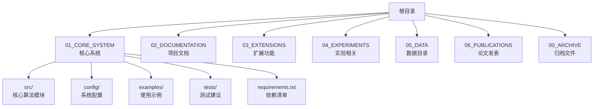
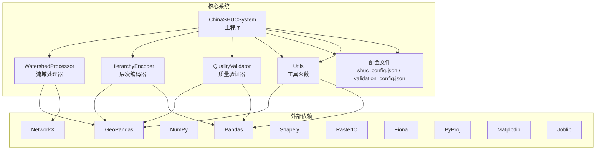
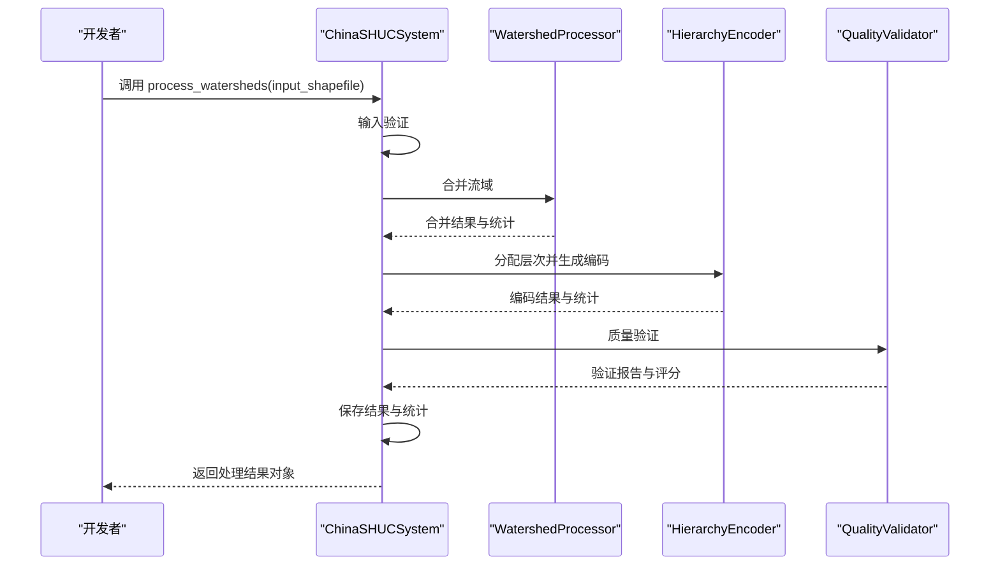
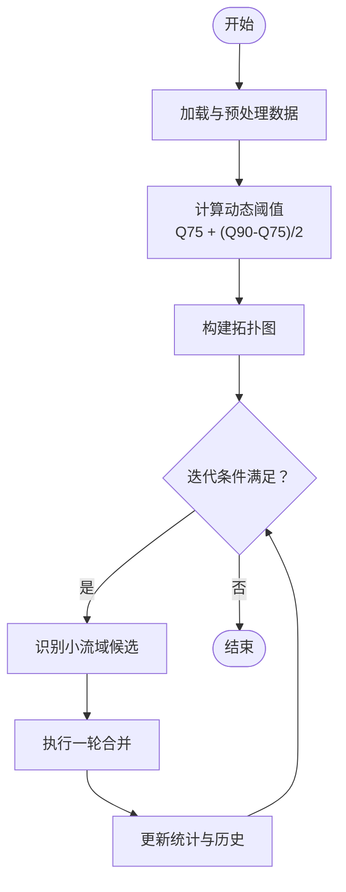
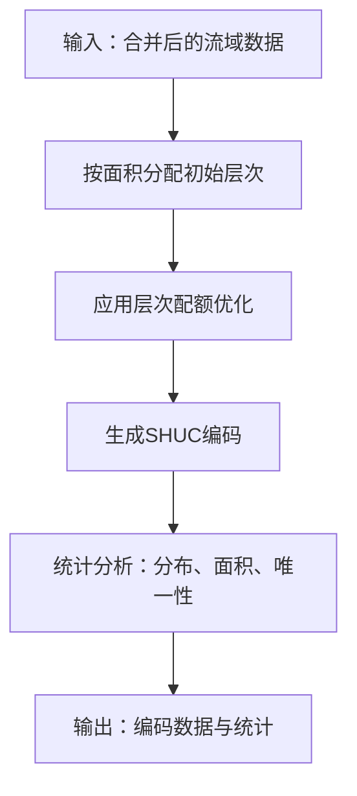
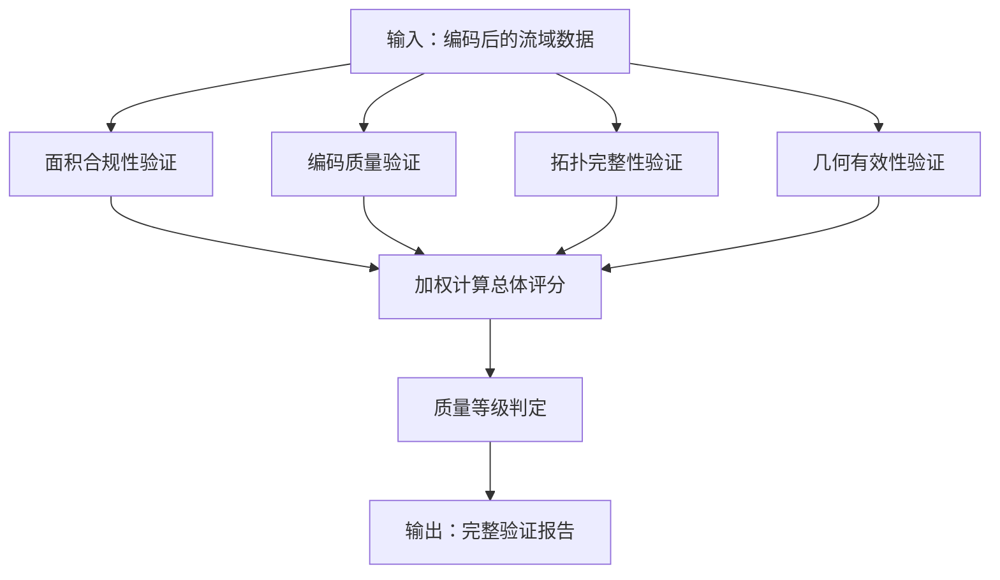
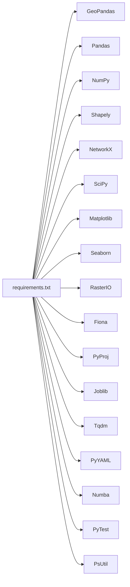

# 贡献流程

<cite>
**本文引用的文件**
- [README.md](file://README.md)
- [IMPLEMENTATION_GUIDE.md](file://02_DOCUMENTATION/IMPLEMENTATION_GUIDE.md)
- [DIALOGUE_ARCHIVE.md](file://02_DOCUMENTATION/DIALOGUE_ARCHIVE.md)
- [shuc_system.py](file://01_CORE_SYSTEM/src/shuc_system.py)
- [watershed_processor.py](file://01_CORE_SYSTEM/src/watershed_processor.py)
- [hierarchy_encoder.py](file://01_CORE_SYSTEM/src/hierarchy_encoder.py)
- [quality_validator.py](file://01_CORE_SYSTEM/src/quality_validator.py)
- [utils.py](file://01_CORE_SYSTEM/src/utils.py)
- [shuc_config.json](file://01_CORE_SYSTEM/config/shuc_config.json)
- [validation_config.json](file://01_CORE_SYSTEM/config/validation_config.json)
- [requirements.txt](file://01_CORE_SYSTEM/requirements.txt)
- [basic_usage.py](file://01_CORE_SYSTEM/examples/basic_usage.py)
</cite>

## 目录
1. [简介](#简介)
2. [项目结构](#项目结构)
3. [核心组件](#核心组件)
4. [架构总览](#架构总览)
5. [详细组件分析](#详细组件分析)
6. [依赖分析](#依赖分析)
7. [性能考虑](#性能考虑)
8. [故障排查指南](#故障排查指南)
9. [结论](#结论)
10. [附录](#附录)

## 简介
本文件面向希望参与“中国SHUC流域分级统一编码系统”项目的开发者与研究者，提供一套可落地的贡献流程与规范，涵盖从 Fork-Branch-Pull Request 的协作流程、分支命名与提交信息格式、代码审查标准与流程、代码质量要求、Issue 报告与 Bug 修复流程、版本发布与变更日志维护，以及社区参与与沟通渠道说明。项目当前处于核心代码完成、进入实验执行与论文撰写阶段，文档与代码组织正在逐步规范化与工程化。

## 项目结构
项目采用按功能域划分的目录结构，便于贡献者快速定位核心模块与文档：
- 01_CORE_SYSTEM：核心系统（算法实现、配置、测试、示例）
- 02_DOCUMENTATION：项目文档（实现指南、对话存档）
- 03_EXTENSIONS：扩展功能（分布式处理、优化模块）
- 04_EXPERIMENTS：实验相关（设计、脚本、结果）
- 05_DATA：数据目录（原始数据、处理结果、参考数据）
- 06_PUBLICATIONS：论文发表（ESSD/WRR论文草稿、图表、补充材料）
- 00_ARCHIVE：归档文件（历史版本、旧代码、参考资料）

**图表来源**
- [README.md:19-30](file://README.md#L19-L30)

**Section sources**
- [README.md:19-30](file://README.md#L19-L30)

## 核心组件
- 中国SHUC系统主程序：集成处理流程、日志与配置管理，协调各子模块。
- 流域处理器：实现动态阈值自适应算法与拓扑保持的智能合并。
- 层次编码器：基于面积的智能分级与SHUC编码生成。
- 质量验证器：多维度质量评估与综合评分。
- 工具函数模块：日志、配置、文件与数据校验等通用能力。
- 配置文件：处理策略、层次标准、验证阈值与权重等参数化配置。

**Section sources**
- [shuc_system.py:43-91](file://01_CORE_SYSTEM/src/shuc_system.py#L43-L91)
- [watershed_processor.py:24-53](file://01_CORE_SYSTEM/src/watershed_processor.py#L24-L53)
- [hierarchy_encoder.py:22-67](file://01_CORE_SYSTEM/src/hierarchy_encoder.py#L22-L67)
- [quality_validator.py:24-60](file://01_CORE_SYSTEM/src/quality_validator.py#L24-L60)
- [utils.py:24-62](file://01_CORE_SYSTEM/src/utils.py#L24-L62)
- [shuc_config.json:1-43](file://01_CORE_SYSTEM/config/shuc_config.json#L1-L43)
- [validation_config.json:1-46](file://01_CORE_SYSTEM/config/validation_config.json#L1-L46)

## 架构总览
系统采用“主程序调度 + 子模块解耦”的架构，主程序负责流程编排与结果输出，子模块各自承担特定职责并通过配置驱动行为。

**图表来源**
- [shuc_system.py:38-41](file://01_CORE_SYSTEM/src/shuc_system.py#L38-L41)
- [requirements.txt:5-42](file://01_CORE_SYSTEM/requirements.txt#L5-L42)

**Section sources**
- [shuc_system.py:38-91](file://01_CORE_SYSTEM/src/shuc_system.py#L38-L91)
- [requirements.txt:1-46](file://01_CORE_SYSTEM/requirements.txt#L1-L46)

## 详细组件分析

### 中国SHUC系统主程序（ChinaSHUCSystem）
- 职责：初始化系统、加载配置、编排处理流程、保存结果与日志。
- 关键流程：输入验证 → 智能合并 → 层次编码 → 质量验证 → 结果导出。
- 输出：编码后的流域数据、验证报告、处理统计与日志文件。

**图表来源**
- [shuc_system.py:92-164](file://01_CORE_SYSTEM/src/shuc_system.py#L92-L164)

**Section sources**
- [shuc_system.py:92-164](file://01_CORE_SYSTEM/src/shuc_system.py#L92-L164)

### 流域处理器（WatershedProcessor）
- 职责：动态阈值计算、拓扑图构建、激进合并策略、合并历史追踪。
- 算法要点：基于分位数的动态阈值、优先下游合并、邻近与最近目标选择、拓扑更新。

**图表来源**
- [watershed_processor.py:54-81](file://01_CORE_SYSTEM/src/watershed_processor.py#L54-L81)
- [watershed_processor.py:164-220](file://01_CORE_SYSTEM/src/watershed_processor.py#L164-L220)

**Section sources**
- [watershed_processor.py:117-141](file://01_CORE_SYSTEM/src/watershed_processor.py#L117-L141)
- [watershed_processor.py:164-220](file://01_CORE_SYSTEM/src/watershed_processor.py#L164-L220)

### 层次编码器（HierarchyEncoder）
- 职责：基于面积的智能分级、层次配额优化、SHUC编码生成与统计。
- 特点：按级别分配编码位数，超配额时降级，保证编码唯一性与层级平衡。

**图表来源**
- [hierarchy_encoder.py:69-95](file://01_CORE_SYSTEM/src/hierarchy_encoder.py#L69-L95)
- [hierarchy_encoder.py:140-169](file://01_CORE_SYSTEM/src/hierarchy_encoder.py#L140-L169)

**Section sources**
- [hierarchy_encoder.py:69-95](file://01_CORE_SYSTEM/src/hierarchy_encoder.py#L69-L95)
- [hierarchy_encoder.py:177-219](file://01_CORE_SYSTEM/src/hierarchy_encoder.py#L177-L219)

### 质量验证器（QualityValidator）
- 职责：面积合规性、编码唯一性、拓扑完整性、几何有效性验证；综合评分与等级判定。
- 权重：面积合规（40%）、编码质量（30%）、拓扑完整性（20%）、几何有效性（10%）。

**图表来源**
- [quality_validator.py:61-86](file://01_CORE_SYSTEM/src/quality_validator.py#L61-L86)
- [quality_validator.py:368-411](file://01_CORE_SYSTEM/src/quality_validator.py#L368-L411)

**Section sources**
- [quality_validator.py:61-86](file://01_CORE_SYSTEM/src/quality_validator.py#L61-L86)
- [validation_config.json:9-14](file://01_CORE_SYSTEM/config/validation_config.json#L9-L14)

### 工具函数模块（Utils）
- 职责：日志设置、配置加载与合并、文件与数据校验、结果导出、系统信息打印、输入参数校验。
- 作用：为系统提供通用能力，保障工程化与可维护性。

**Section sources**
- [utils.py:24-62](file://01_CORE_SYSTEM/src/utils.py#L24-L62)
- [utils.py:64-147](file://01_CORE_SYSTEM/src/utils.py#L64-L147)
- [utils.py:159-221](file://01_CORE_SYSTEM/src/utils.py#L159-L221)
- [utils.py:273-301](file://01_CORE_SYSTEM/src/utils.py#L273-L301)
- [utils.py:302-346](file://01_CORE_SYSTEM/src/utils.py#L302-L346)

## 依赖分析
- 核心依赖：GeoPandas、Pandas、NumPy、Shapely、NetworkX、SciPy、Matplotlib、Seaborn、RasterIO、Fiona、PyProj、Joblib、Tqdm、PyYAML、Numba、PyTest、PsUtil。
- 版本要求：Python >= 3.8，建议 3.9+；依赖清单见 requirements.txt。

**图表来源**
- [requirements.txt:5-42](file://01_CORE_SYSTEM/requirements.txt#L5-L42)

**Section sources**
- [requirements.txt:1-46](file://01_CORE_SYSTEM/requirements.txt#L1-L46)

## 性能考虑
- 动态阈值：基于分位数的自适应阈值，兼顾不同区域特征，提高合并效率与合规率。
- 拓扑保持：通过图约束优化与拓扑完整性检查，降低错误传播风险。
- 并行与内存：配置项支持并行处理与内存上限控制，建议在大规模数据场景启用并调优。
- 可视化与日志：提供进度条与详细日志，便于性能分析与问题定位。

**Section sources**
- [watershed_processor.py:117-141](file://01_CORE_SYSTEM/src/watershed_processor.py#L117-L141)
- [shuc_config.json:38-42](file://01_CORE_SYSTEM/config/shuc_config.json#L38-L42)
- [utils.py:244-271](file://01_CORE_SYSTEM/src/utils.py#L244-L271)

## 故障排查指南
- 输入数据校验：检查 Shapefile 是否存在、几何字段是否存在、坐标系与范围是否合理。
- 配置加载：若配置文件缺失，系统会自动生成默认配置；建议核对关键参数（阈值、权重、配额）。
- 合并失败：关注合并历史与拓扑更新，检查是否存在无效几何或循环引用。
- 日志定位：主程序与工具函数均提供日志输出，结合 processing_log.txt 与 validation_report.json 定位问题。

**Section sources**
- [utils.py:159-221](file://01_CORE_SYSTEM/src/utils.py#L159-L221)
- [utils.py:24-62](file://01_CORE_SYSTEM/src/utils.py#L24-L62)
- [shuc_system.py:165-196](file://01_CORE_SYSTEM/src/shuc_system.py#L165-L196)

## 结论
本贡献流程文档基于项目当前状态与核心代码实现，明确了协作流程、代码质量要求与发布维护规范。建议贡献者在提交前阅读相关模块文档与配置说明，遵循分支与提交规范，并在 PR 中附带必要的测试与验证报告，以确保高质量交付与可持续演进。

## 附录

### 代码贡献流程与规范

- Fork-Branch-Pull Request 工作流程
  - Fork 仓库到个人账号，创建特性分支，提交更改并发起 Pull Request。
  - 分支命名规范：feature/功能名称、bugfix/问题描述、docs/文档主题、chore/维护任务。
  - 提交信息格式：类型(范围): 概述；正文说明动机与影响；关联 Issue 编号。

- 代码审查标准与流程
  - 审查清单：功能正确性、边界条件、性能影响、日志与错误处理、配置与参数化、测试覆盖、文档更新。
  - 审查流程：PR 描述清晰、变更范围明确、CI 通过、至少一名维护者批准、合并前更新变更日志。

- 代码质量要求
  - 代码风格：遵循 Python 基本风格约定，保持简洁与可读性。
  - Docstring 标准：模块、类、方法应包含中文说明，参数与返回值清晰描述。
  - 注释规范：关键算法与复杂逻辑添加注释，避免显而易懂的注释。
  - 配置与参数：通过配置文件集中管理参数，避免硬编码。

- Issue 报告与 Bug 修复流程
  - 报告模板：标题、环境信息、复现步骤、期望结果、实际结果、日志与截图。
  - Bug 修复：关联 Issue，提供最小复现示例，补充测试用例，更新相关文档。

- 版本发布与变更日志维护
  - 版本号：语义化版本（主.次.补丁），发布前更新版本号与变更日志。
  - 变更日志：记录新增、修改、修复与废弃项，标注影响范围与迁移指引。
  - 发布流程：通过 CI 构建产物，创建 Release 标签，上传制品与发布说明。

- 社区参与与沟通
  - 沟通渠道：通过 Issue 讨论需求与问题，PR 进行代码评审，文档与对话纪要沉淀知识。
  - 行为准则：尊重与包容，聚焦建设性反馈，避免人身攻击与无效争论。

**Section sources**
- [IMPLEMENTATION_GUIDE.md:531-800](file://02_DOCUMENTATION/IMPLEMENTATION_GUIDE.md#L531-L800)
- [DIALOGUE_ARCHIVE.md:1-468](file://02_DOCUMENTATION/DIALOGUE_ARCHIVE.md#L1-L468)
- [README.md:75-88](file://README.md#L75-L88)