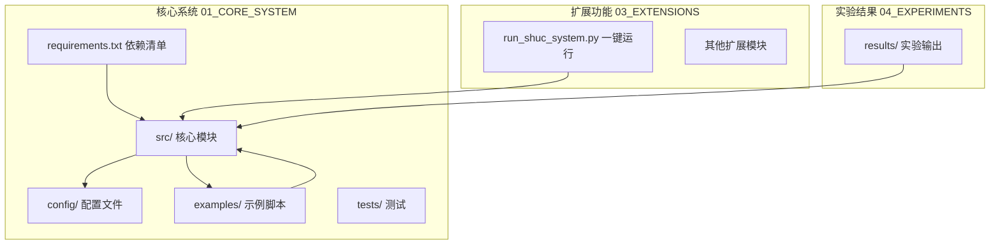
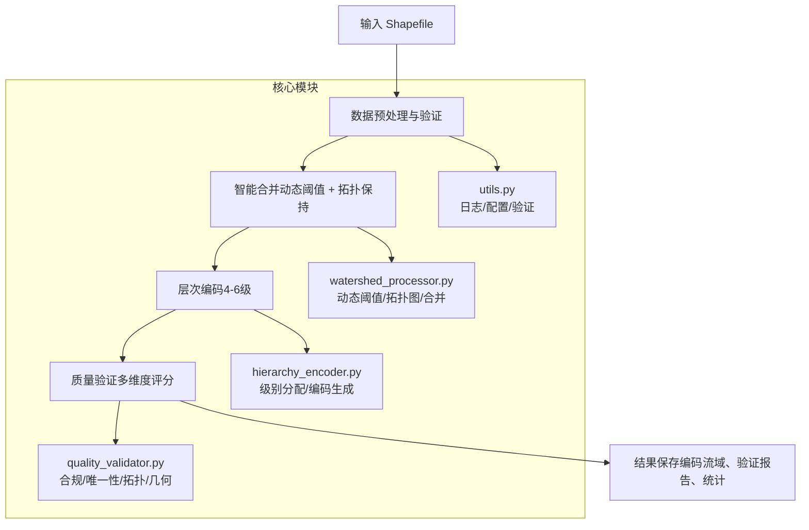
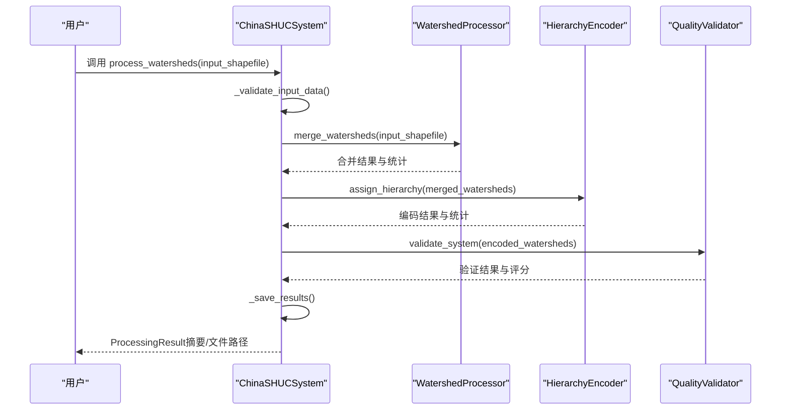
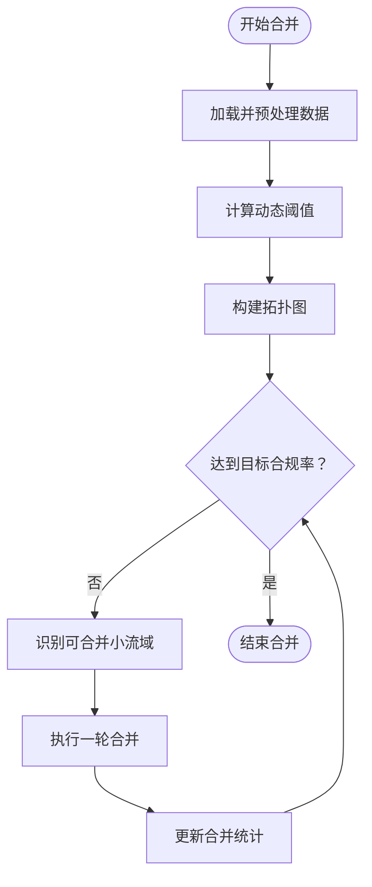
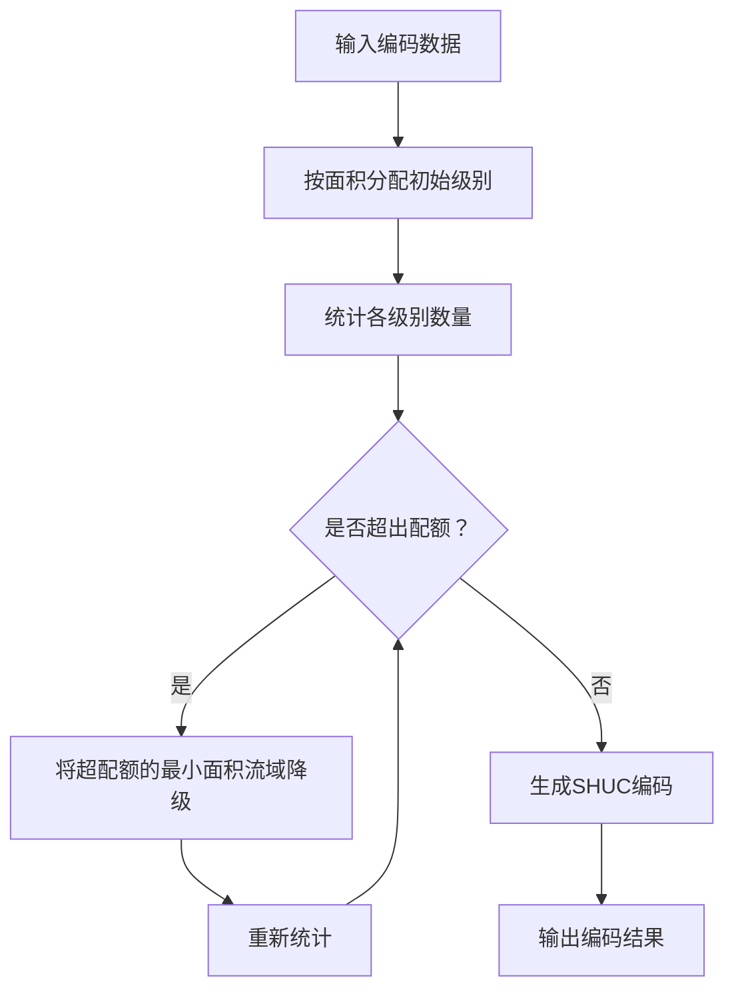
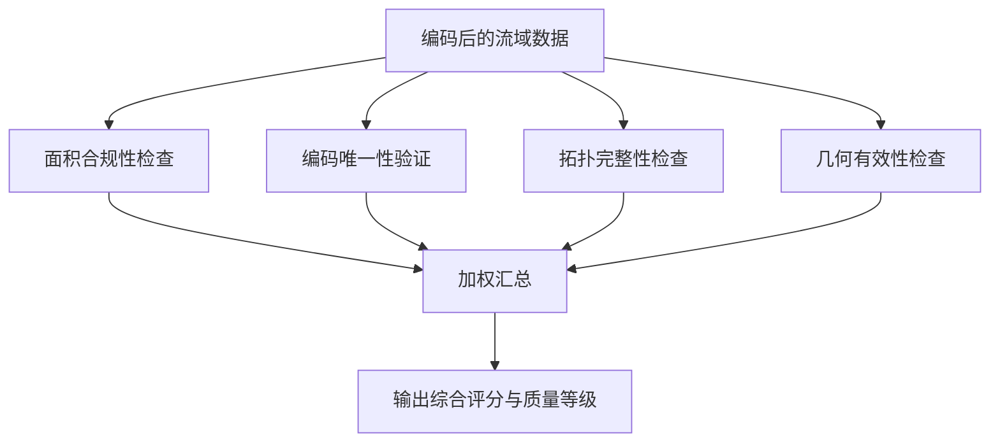
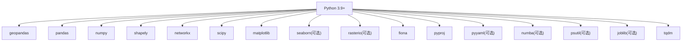

# 快速开始

<cite>
**本文引用的文件**
- [README.md](file://README.md)
- [requirements.txt](file://01_CORE_SYSTEM/requirements.txt)
- [shuc_config.json](file://01_CORE_SYSTEM/config/shuc_config.json)
- [basic_usage.py](file://01_CORE_SYSTEM/examples/basic_usage.py)
- [run_shuc_system.py](file://03_EXTENSIONS/run_shuc_system.py)
- [shuc_system.py](file://01_CORE_SYSTEM/src/shuc_system.py)
- [watershed_processor.py](file://01_CORE_SYSTEM/src/watershed_processor.py)
- [hierarchy_encoder.py](file://01_CORE_SYSTEM/src/hierarchy_encoder.py)
- [quality_validator.py](file://01_CORE_SYSTEM/src/quality_validator.py)
- [utils.py](file://01_CORE_SYSTEM/src/utils.py)
- [system_validation.json](file://04_EXPERIMENTS/results/final_output/system_validation.json)
- [process_log.txt](file://04_EXPERIMENTS/results/final_output/process_log.txt)
</cite>

## 目录
1. [简介](#简介)
2. [项目结构](#项目结构)
3. [核心组件](#核心组件)
4. [架构总览](#架构总览)
5. [详细组件分析](#详细组件分析)
6. [依赖分析](#依赖分析)
7. [性能考虑](#性能考虑)
8. [故障排除指南](#故障排除指南)
9. [结论](#结论)
10. [附录](#附录)

## 简介
中国SHUC（Standardized Hydrological Unit Code）流域分级统一编码系统旨在为中国的完整流域建立“身份证”式的6级12位编码体系，实现从源头到出口的全流域层级追溯。系统采用动态阈值自适应算法与拓扑保持的智能合并框架，结合50km缓冲区DEM无缝融合技术，提供标准化、层次化、可验证的空间单元编码解决方案。

本快速开始指南将帮助你在30分钟内完成环境搭建、依赖安装、基础配置与首次运行，涵盖：
- Python环境准备与依赖安装
- 基础配置与输入数据准备
- 运行第一个处理流程
- 解读输出结果与验证报告
- 常见问题排查与解决方案

## 项目结构
核心系统位于 01_CORE_SYSTEM，包含：
- src：核心算法模块（流域处理、层次编码、质量验证、工具函数）
- config：系统配置文件（shuc_config.json）
- examples：示例脚本（基础使用、高级演示、批量处理）
- requirements.txt：依赖包清单
- tests：测试文件（可选）

扩展功能位于 03_EXTENSIONS，包含一键运行脚本与优化版本系统。

**图表来源**
- [shuc_system.py:1-335](file://01_CORE_SYSTEM/src/shuc_system.py#L1-L335)
- [run_shuc_system.py:1-211](file://03_EXTENSIONS/run_shuc_system.py#L1-L211)

**章节来源**
- [README.md:19-30](file://README.md#L19-L30)
- [requirements.txt:1-46](file://01_CORE_SYSTEM/requirements.txt#L1-L46)

## 核心组件
- 中国SHUC系统主类：集成数据预处理、智能合并、层次编码与质量验证的完整工作流
- 流域处理器：实现动态阈值计算、拓扑图构建与激进合并策略
- 层次编码器：基于面积的4-6级智能分配与SHUC编码生成
- 质量验证器：多维度质量评估（面积合规、编码唯一性、拓扑完整性、几何有效性）
- 工具函数：日志、配置加载、文件操作、数据验证与结果导出

**章节来源**
- [shuc_system.py:43-91](file://01_CORE_SYSTEM/src/shuc_system.py#L43-L91)
- [watershed_processor.py:24-53](file://01_CORE_SYSTEM/src/watershed_processor.py#L24-L53)
- [hierarchy_encoder.py:22-67](file://01_CORE_SYSTEM/src/hierarchy_encoder.py#L22-L67)
- [quality_validator.py:24-60](file://01_CORE_SYSTEM/src/quality_validator.py#L24-L60)
- [utils.py:64-100](file://01_CORE_SYSTEM/src/utils.py#L64-L100)

## 架构总览
系统采用模块化架构，主流程由 ChinaSHUCSystem 调用各子模块协同完成。数据从输入 Shapefile 开始，经过预处理与验证，进入智能合并阶段，随后进行层次编码分配，最后执行质量验证并输出结果。

**图表来源**
- [shuc_system.py:92-164](file://01_CORE_SYSTEM/src/shuc_system.py#L92-L164)
- [watershed_processor.py:54-82](file://01_CORE_SYSTEM/src/watershed_processor.py#L54-L82)
- [hierarchy_encoder.py:69-95](file://01_CORE_SYSTEM/src/hierarchy_encoder.py#L69-L95)
- [quality_validator.py:61-86](file://01_CORE_SYSTEM/src/quality_validator.py#L61-L86)

## 详细组件分析

### 中国SHUC系统主流程
- 初始化：加载配置、设置日志、创建输出目录
- 数据验证：检查输入文件存在性与基本字段
- 智能合并：动态阈值计算、拓扑图构建、迭代合并
- 层次编码：按面积分配级别、应用配额优化、生成SHUC编码
- 质量验证：面积合规、编码唯一性、拓扑完整性、几何有效性
- 结果保存：编码流域数据、验证报告、处理统计

**图表来源**
- [shuc_system.py:92-164](file://01_CORE_SYSTEM/src/shuc_system.py#L92-L164)
- [watershed_processor.py:54-82](file://01_CORE_SYSTEM/src/watershed_processor.py#L54-L82)
- [hierarchy_encoder.py:69-95](file://01_CORE_SYSTEM/src/hierarchy_encoder.py#L69-L95)
- [quality_validator.py:61-86](file://01_CORE_SYSTEM/src/quality_validator.py#L61-L86)

**章节来源**
- [shuc_system.py:92-164](file://01_CORE_SYSTEM/src/shuc_system.py#L92-L164)

### 流域智能合并（动态阈值与拓扑保持）
- 动态阈值：基于面积分布的分位数计算，约束在合理范围
- 拓扑图：基于 LINKNO/DSLINKNO1 构建上下游关系图
- 合并策略：激进合并，按合规率目标与早停条件迭代执行

**图表来源**
- [watershed_processor.py:117-141](file://01_CORE_SYSTEM/src/watershed_processor.py#L117-L141)
- [watershed_processor.py:164-200](file://01_CORE_SYSTEM/src/watershed_processor.py#L164-L200)

**章节来源**
- [watershed_processor.py:54-82](file://01_CORE_SYSTEM/src/watershed_processor.py#L54-L82)

### 层次编码与配额优化
- 初始分配：按面积阈值分配4-6级
- 配额优化：对超配额的低面积流域降级，保证结构合理性
- 编码生成：按级别分配唯一编码，支持12位精细编码

**图表来源**
- [hierarchy_encoder.py:97-111](file://01_CORE_SYSTEM/src/hierarchy_encoder.py#L97-L111)
- [hierarchy_encoder.py:113-138](file://01_CORE_SYSTEM/src/hierarchy_encoder.py#L113-L138)
- [hierarchy_encoder.py:140-169](file://01_CORE_SYSTEM/src/hierarchy_encoder.py#L140-L169)

**章节来源**
- [hierarchy_encoder.py:69-95](file://01_CORE_SYSTEM/src/hierarchy_encoder.py#L69-L95)

### 质量验证与综合评分
- 面积合规：动态阈值驱动的合规率计算
- 编码唯一性：检查重复编码与格式
- 拓扑完整性：上游引用有效性与孤立流域检测
- 几何有效性：几何有效性与边界完整性
- 综合评分：加权计算整体质量等级

**图表来源**
- [quality_validator.py:61-86](file://01_CORE_SYSTEM/src/quality_validator.py#L61-L86)
- [quality_validator.py:100-122](file://01_CORE_SYSTEM/src/quality_validator.py#L100-L122)
- [quality_validator.py:142-168](file://01_CORE_SYSTEM/src/quality_validator.py#L142-L168)
- [quality_validator.py:191-200](file://01_CORE_SYSTEM/src/quality_validator.py#L191-L200)

**章节来源**
- [quality_validator.py:61-86](file://01_CORE_SYSTEM/src/quality_validator.py#L61-L86)

## 依赖分析
系统依赖包括核心数据处理库、图论与网络分析、科学计算、可视化、文件I/O与格式支持、配置与日志、性能优化与并发处理等。建议使用 Python 3.9+ 以获得最佳性能。

**图表来源**
- [requirements.txt:4-46](file://01_CORE_SYSTEM/requirements.txt#L4-L46)

**章节来源**
- [requirements.txt:1-46](file://01_CORE_SYSTEM/requirements.txt#L1-L46)

## 性能考虑
- 动态阈值自适应：根据数据分布自动调整合并阈值，提升合并效率与质量
- 拓扑保持：在图约束下进行优化合并，避免拓扑破坏
- 并行处理：可选 joblib 支持并行处理（扩展功能）
- 内存优化：可选 psutil 监控系统资源（扩展功能）
- 进度显示：tqdm 提供处理进度反馈

[本节为通用性能建议，无需特定文件引用]

## 故障排除指南
常见问题与解决方案：
- 缺少依赖包：确保已安装 requirements.txt 中列出的所有依赖
  - 参考：[requirements.txt:4-46](file://01_CORE_SYSTEM/requirements.txt#L4-L46)
- 输入数据缺失：确认示例数据文件存在或手动提供输入 Shapefile
  - 参考：[basic_usage.py:36-44](file://01_CORE_SYSTEM/examples/basic_usage.py#L36-L44)
- Python 版本过低：系统需要 Python 3.8+，建议使用 3.9+
  - 参考：[utils.py:327-329](file://01_CORE_SYSTEM/src/utils.py#L327-L329)
- 配置文件加载失败：系统会自动生成默认配置文件
  - 参考：[utils.py:78-99](file://01_CORE_SYSTEM/src/utils.py#L78-L99)
- 输出结果解读：查看 system_validation.json 与 process_log.txt
  - 参考：[system_validation.json:1-40](file://04_EXPERIMENTS/results/final_output/system_validation.json#L1-L40)
  - 参考：[process_log.txt:1-58](file://04_EXPERIMENTS/results/final_output/process_log.txt#L1-L58)

**章节来源**
- [requirements.txt:4-46](file://01_CORE_SYSTEM/requirements.txt#L4-L46)
- [basic_usage.py:36-44](file://01_CORE_SYSTEM/examples/basic_usage.py#L36-L44)
- [utils.py:327-346](file://01_CORE_SYSTEM/src/utils.py#L327-L346)
- [utils.py:78-99](file://01_CORE_SYSTEM/src/utils.py#L78-L99)
- [system_validation.json:1-40](file://04_EXPERIMENTS/results/final_output/system_validation.json#L1-L40)
- [process_log.txt:1-58](file://04_EXPERIMENTS/results/final_output/process_log.txt#L1-L58)

## 结论
通过本快速开始指南，你已完成：
- Python 环境准备与依赖安装
- 基础配置与输入数据准备
- 运行第一个处理流程并解读输出结果
- 掌握常见问题的排查与解决方法

建议进一步阅读扩展功能与高级示例，以探索分布式处理、优化模块与更复杂的实验设计。

[本节为总结性内容，无需特定文件引用]

## 附录

### 安装与运行步骤（30分钟指南）
1. 环境准备
   - 确保 Python 3.9+ 已安装
   - 参考：[README.md:62-66](file://README.md#L62-L66)

2. 进入核心系统目录并安装依赖
   - 参考：[README.md:36-45](file://README.md#L36-L45)
   - 参考：[requirements.txt:4-46](file://01_CORE_SYSTEM/requirements.txt#L4-L46)

3. 准备输入数据
   - 使用示例数据：data/input/demo_watersheds.shp
   - 参考：[basic_usage.py:36-44](file://01_CORE_SYSTEM/examples/basic_usage.py#L36-L44)

4. 运行基础示例
   - 参考：[README.md:36-45](file://README.md#L36-L45)
   - 参考：[basic_usage.py:25-74](file://01_CORE_SYSTEM/examples/basic_usage.py#L25-L74)

5. 查看输出与验证报告
   - 输出文件：output/*.shp、validation_report.json、processing_statistics.json
   - 参考：[shuc_system.py:198-237](file://01_CORE_SYSTEM/src/shuc_system.py#L198-L237)

6. 一键运行（可选）
   - 参考：[run_shuc_system.py:167-211](file://03_EXTENSIONS/run_shuc_system.py#L167-L211)

**章节来源**
- [README.md:34-45](file://README.md#L34-L45)
- [requirements.txt:4-46](file://01_CORE_SYSTEM/requirements.txt#L4-L46)
- [basic_usage.py:25-74](file://01_CORE_SYSTEM/examples/basic_usage.py#L25-L74)
- [shuc_system.py:198-237](file://01_CORE_SYSTEM/src/shuc_system.py#L198-L237)
- [run_shuc_system.py:167-211](file://03_EXTENSIONS/run_shuc_system.py#L167-L211)

### 基础使用示例（运行流程）
- 初始化系统与数据路径
- 处理流域数据并打印摘要
- 详细结果分析（动态阈值、层次分布、质量等级）
- 输出文件清单与大小

**章节来源**
- [basic_usage.py:25-106](file://01_CORE_SYSTEM/examples/basic_usage.py#L25-L106)

### 配置文件说明
- processing：目标合规率、合并策略、最大迭代次数、早停开关、动态阈值模式
- hierarchy：各级别最小面积、启用配额、各级配额
- validation：面积合规阈值、编码唯一性阈值、拓扑完整性阈值、启用几何验证、质量权重
- output：保存中间结果、启用详细日志、导出验证报告、导出统计
- performance：启用并行处理、最大内存使用、启用进度显示

**章节来源**
- [shuc_config.json:1-43](file://01_CORE_SYSTEM/config/shuc_config.json#L1-L43)