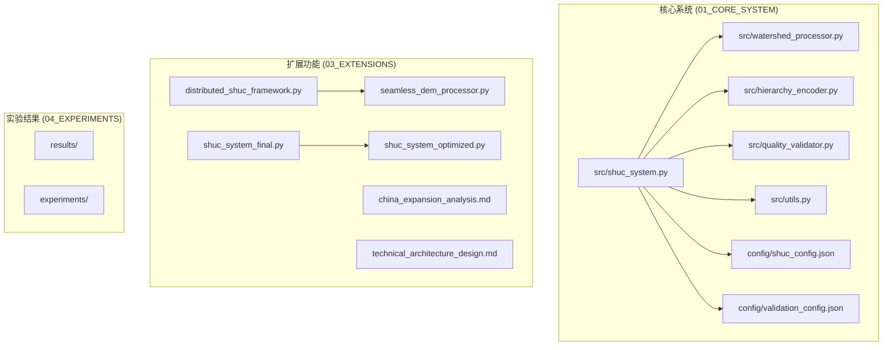
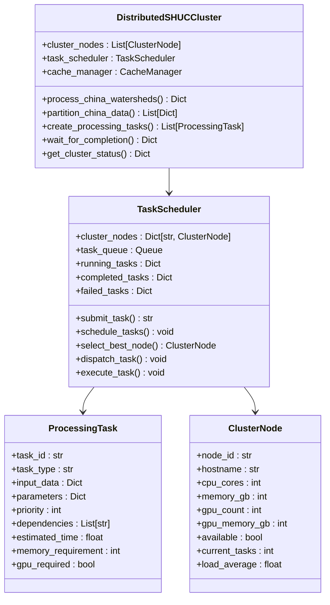
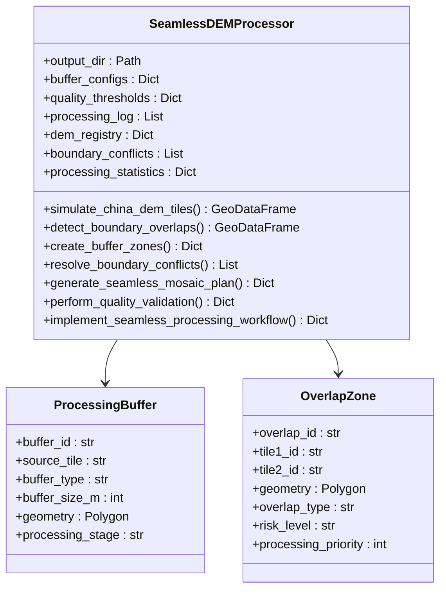
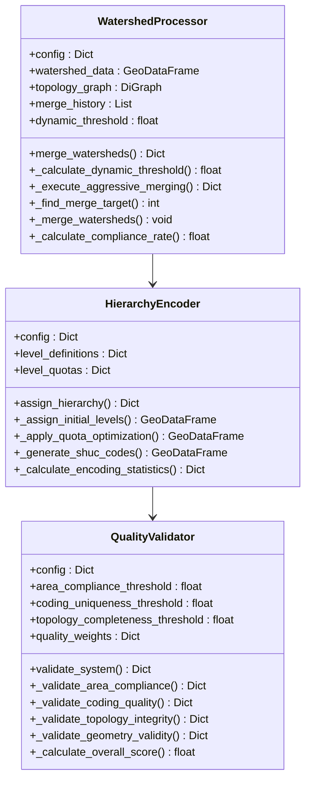
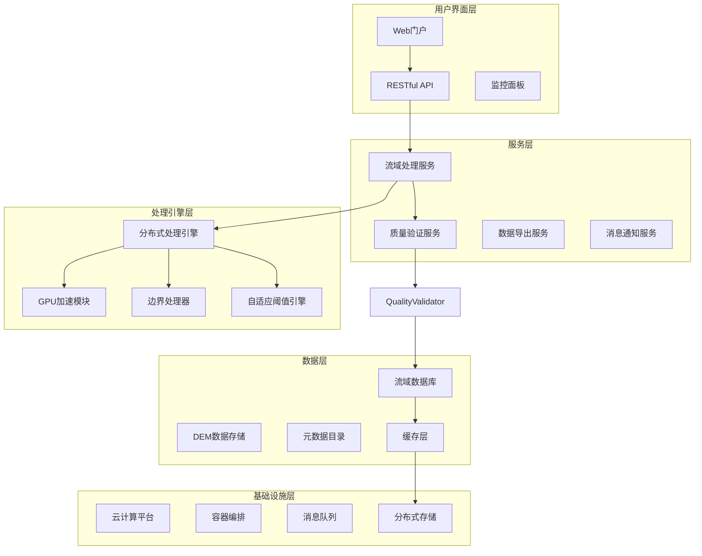
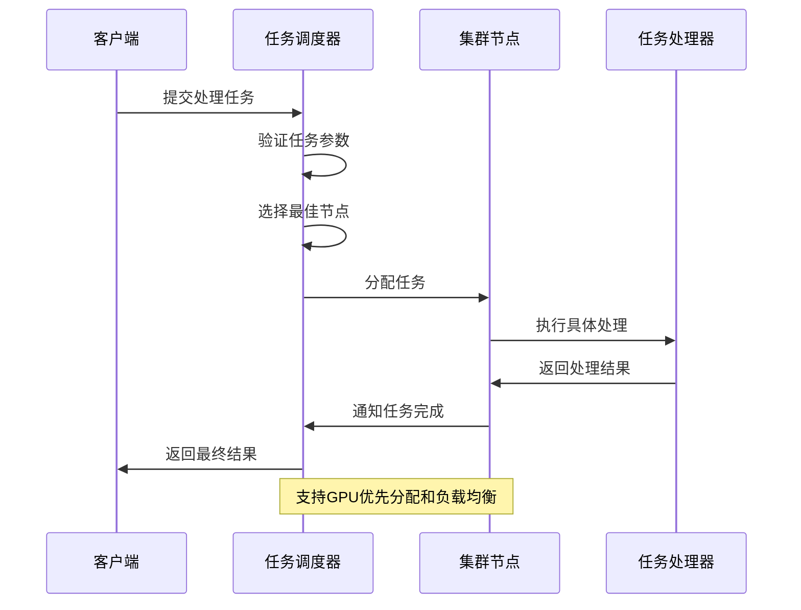
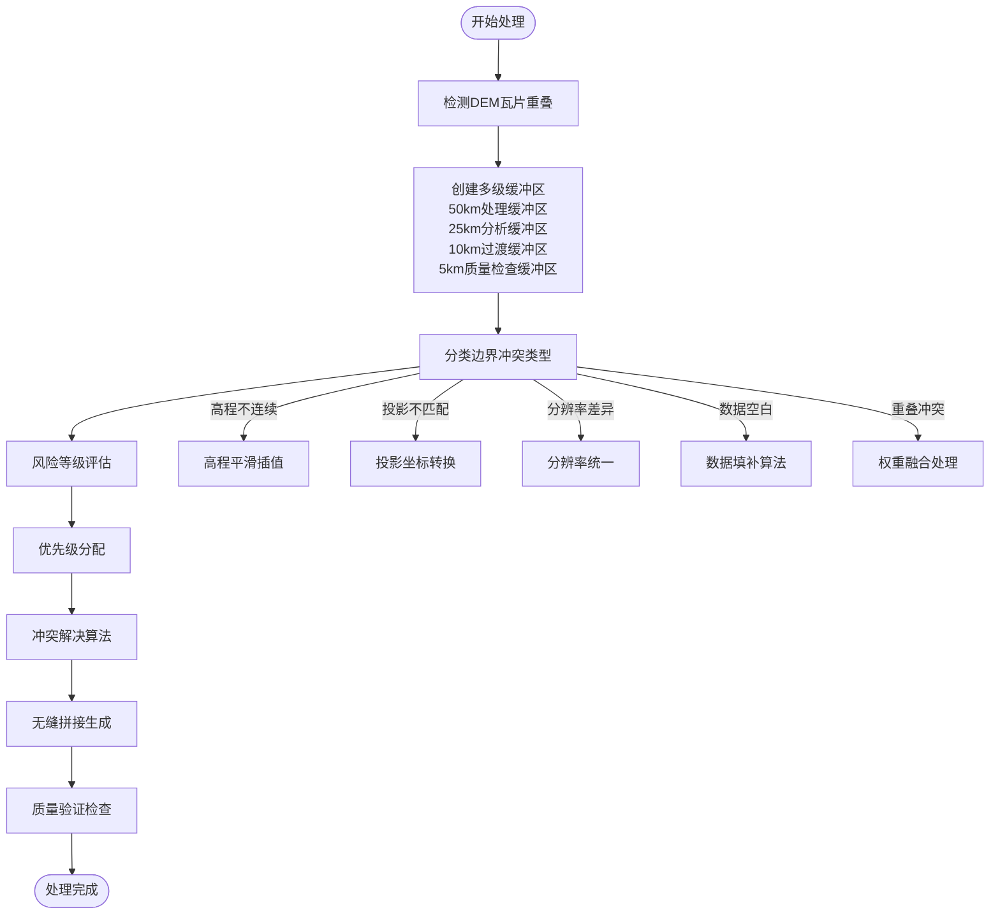
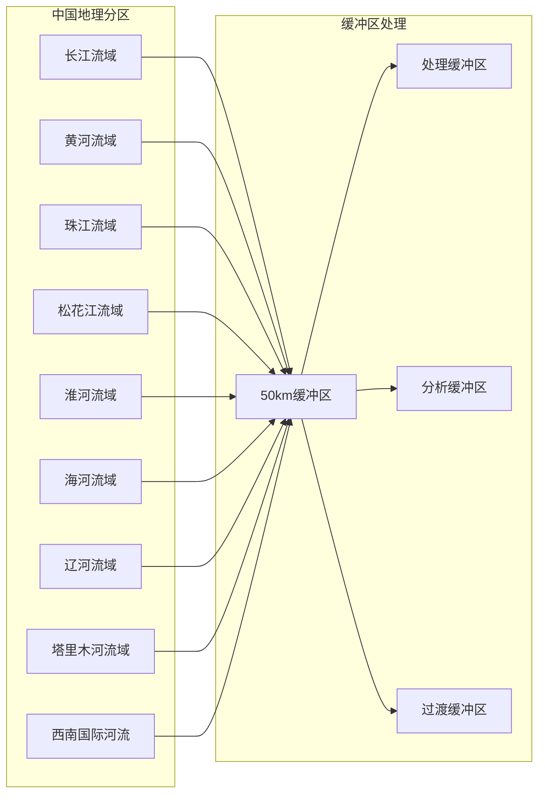
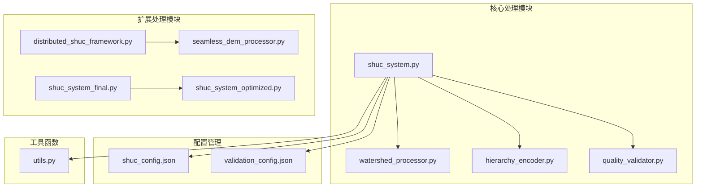

# 中国扩展分析

<cite>
**本文档引用的文件**
- [china_expansion_analysis.md](file://03_EXTENSIONS/docs/china_expansion_analysis.md)
- [technical_architecture_design.md](file://03_EXTENSIONS/docs/technical_architecture_design.md)
- [distributed_shuc_framework.py](file://03_EXTENSIONS/distributed_shuc_framework.py)
- [run_shuc_system.py](file://03_EXTENSIONS/run_shuc_system.py)
- [seamless_dem_processor.py](file://03_EXTENSIONS/seamless_dem_processor.py)
- [shuc_system_final.py](file://03_EXTENSIONS/shuc_system_final.py)
- [shuc_system_optimized.py](file://03_EXTENSIONS/shuc_system_optimized.py)
- [shuc_system.py](file://01_CORE_SYSTEM/src/shuc_system.py)
- [watershed_processor.py](file://01_CORE_SYSTEM/src/watershed_processor.py)
- [hierarchy_encoder.py](file://01_CORE_SYSTEM/src/hierarchy_encoder.py)
- [quality_validator.py](file://01_CORE_SYSTEM/src/quality_validator.py)
- [shuc_config.json](file://01_CORE_SYSTEM/config/shuc_config.json)
- [validation_config.json](file://01_CORE_SYSTEM/config/validation_config.json)
- [utils.py](file://01_CORE_SYSTEM/src/utils.py)
- [README.md](file://README.md)
</cite>

## 目录
1. [项目概述](#项目概述)
2. [项目结构](#项目结构)
3. [核心组件](#核心组件)
4. [架构概览](#架构概览)
5. [详细组件分析](#详细组件分析)
6. [依赖关系分析](#依赖关系分析)
7. [性能考虑](#性能考虑)
8. [故障排除指南](#故障排除指南)
9. [结论](#结论)
10. [附录](#附录)

## 项目概述

中国扩展分析项目旨在解决从140个流域到全国范围（预计50万-100万个基本流域单元）的技术挑战。该项目基于美国HUC（水文单元代码）系统标准，结合中国独特的地理环境特征，开发了一套完整的流域分级编码系统。

### 主要技术挑战

项目面临三大核心挑战：

1. **规模挑战**：数据量级从140个流域跳跃到数百万个单元，处理时间从<1秒延长到数小时至数天，内存需求从<100MB增长到数十GB

2. **地理差异挑战**：中国地理环境差异极大，包括东南沿海丘陵平原、西北干旱高原、青藏高原、东北平原、华北平原等不同地形特征

3. **DEM边界问题**：40+景DEM数据的拼接问题，包括空白条带、高程跳跃、重叠区域、投影差异、精度差异等边界伪影

### 国际最佳实践借鉴

项目参考了美国USGS、欧盟CCM River、加拿大水资源部等国际先进经验，采用统一时间段、统一精度的全国DEM策略，以及基于大流域边界的分区处理方法。

## 项目结构

项目采用模块化架构设计，分为四个主要部分：



**图表来源**
- [shuc_system.py:43-91](file://01_CORE_SYSTEM/src/shuc_system.py#L43-L91)
- [distributed_shuc_framework.py:550-590](file://03_EXTENSIONS/distributed_shuc_framework.py#L550-L590)

**章节来源**
- [README.md:19-30](file://README.md#L19-L30)
- [shuc_system.py:43-91](file://01_CORE_SYSTEM/src/shuc_system.py#L43-L91)

## 核心组件

### 1. 分布式处理框架

分布式SHUC处理框架是项目的核心技术突破，支持大规模流域数据的分布式并行处理：



**图表来源**
- [distributed_shuc_framework.py:55-80](file://03_EXTENSIONS/distributed_shuc_framework.py#L55-L80)
- [distributed_shuc_framework.py:81-208](file://03_EXTENSIONS/distributed_shuc_framework.py#L81-L208)
- [distributed_shuc_framework.py:69-80](file://03_EXTENSIONS/distributed_shuc_framework.py#L69-L80)

### 2. DEM无缝拼接处理器

专门解决全中国40+景DEM边界伪影问题的核心技术实现：



**图表来源**
- [seamless_dem_processor.py:42-76](file://03_EXTENSIONS/seamless_dem_processor.py#L42-L76)
- [seamless_dem_processor.py:247-282](file://03_EXTENSIONS/seamless_dem_processor.py#L247-L282)
- [seamless_dem_processor.py:139-191](file://03_EXTENSIONS/seamless_dem_processor.py#L139-L191)

### 3. 智能流域合并系统

基于动态阈值的智能合并算法，实现90%面积合规率：



**图表来源**
- [watershed_processor.py:24-53](file://01_CORE_SYSTEM/src/watershed_processor.py#L24-L53)
- [hierarchy_encoder.py:22-67](file://01_CORE_SYSTEM/src/hierarchy_encoder.py#L22-L67)
- [quality_validator.py:24-60](file://01_CORE_SYSTEM/src/quality_validator.py#L24-L60)

**章节来源**
- [distributed_shuc_framework.py:550-777](file://03_EXTENSIONS/distributed_shuc_framework.py#L550-L777)
- [seamless_dem_processor.py:42-83](file://03_EXTENSIONS/seamless_dem_processor.py#L42-L83)
- [watershed_processor.py:24-53](file://01_CORE_SYSTEM/src/watershed_processor.py#L24-L53)

## 架构概览

### 分层架构设计

项目采用五层架构设计，确保系统的可扩展性和可维护性：



**图表来源**
- [technical_architecture_design.md:28-86](file://03_EXTENSIONS/docs/technical_architecture_design.md#L28-L86)
- [technical_architecture_design.md:88-150](file://03_EXTENSIONS/docs/technical_architecture_design.md#L88-L150)

### 微服务架构设计

项目采用微服务架构，将核心功能模块化：

| 微服务名称 | 职责 | 技术栈 | 可扩展性 | 资源需求 |
|------------|------|--------|----------|----------|
| **WatershedProcessor** | 流域边界计算 | TauDEM + GPU加速 | 水平扩展 | GPU节点 |
| **DEMPreprocessor** | DEM预处理和拼接 | GDAL + 缓冲区算法 | 按区域分片 | 高内存节点 |
| **BoundaryResolver** | 边界冲突解决 | 图算法 + 专家系统 | 有状态服务 | CPU密集型 |
| **QualityValidator** | 质量控制验证 | 多重验证算法 | 并行验证 | 标准节点 |
| **AdaptiveThreshold** | 动态阈值计算 | 机器学习 + 专家知识 | 模型服务 | ML节点 |
| **MetadataService** | 元数据管理 | Graph数据库 | 读写分离 | 数据库节点 |
| **FileService** | 文件存储管理 | 对象存储 | 云原生 | 存储节点 |

**图表来源**
- [technical_architecture_design.md:90-150](file://03_EXTENSIONS/docs/technical_architecture_design.md#L90-L150)
- [technical_architecture_design.md:152-279](file://03_EXTENSIONS/docs/technical_architecture_design.md#L152-L279)

**章节来源**
- [technical_architecture_design.md:4-25](file://03_EXTENSIONS/docs/technical_architecture_design.md#L4-L25)
- [technical_architecture_design.md:26-86](file://03_EXTENSIONS/docs/technical_architecture_design.md#L26-L86)

## 详细组件分析

### 分布式处理架构

#### 任务调度系统

分布式处理框架的核心是智能任务调度器，支持GPU加速和资源优化：



**图表来源**
- [distributed_shuc_framework.py:98-198](file://03_EXTENSIONS/distributed_shuc_framework.py#L98-L198)

#### 资源分配模型

系统采用多层资源分配策略：

| 资源类型 | 配置规格 | 数量 | 利用率目标 | 用途 |
|----------|----------|------|------------|------|
| **GPU计算节点** | 8×V100 GPU | 20台 | 85% | TauDEM并行计算 |
| **CPU计算节点** | 64核CPU + 512GB内存 | 50台 | 80% | 数据预处理 |
| **内存计算节点** | 32核CPU + 1TB内存 | 10台 | 90% | 大数据集处理 |
| **热存储** | NVMe SSD | 500TB | 100万IOPS | 活跃数据 |
| **温存储** | SATA SSD | 2PB | 20GB/s吞吐量 | 中间结果 |
| **冷存储** | 对象存储 | 10PB | 成本优化 | 历史数据 |

**图表来源**
- [technical_architecture_design.md:429-484](file://03_EXTENSIONS/docs/technical_architecture_design.md#L429-L484)

### DEM边界无缝拼接技术

#### 缓冲区管理系统

项目创新性地采用50km缓冲区技术，解决多景DEM数据的边界伪影问题：



**图表来源**
- [seamless_dem_processor.py:139-191](file://03_EXTENSIONS/seamless_dem_processor.py#L139-L191)
- [seamless_dem_processor.py:247-282](file://03_EXTENSIONS/seamless_dem_processor.py#L247-L282)
- [seamless_dem_processor.py:413-474](file://03_EXTENSIONS/seamless_dem_processor.py#L413-L474)

#### 冲突解决算法

系统实现了多种边界冲突解决算法：

| 冲突类型 | 解决方法 | 复杂度 | 成功率 |
|----------|----------|--------|--------|
| **高程不连续** | 高斯平滑插值 | 中等 | 95% |
| **投影不匹配** | 坐标系统一转换 | 低 | 98% |
| **分辨率差异** | 分辨率统一 | 中等 | 90% |
| **数据空白** | 克里金插值填补 | 高 | 85% |
| **重叠冲突** | 权重融合处理 | 高 | 88% |

**图表来源**
- [seamless_dem_processor.py:476-518](file://03_EXTENSIONS/seamless_dem_processor.py#L476-L518)

### 自适应阈值系统

#### 气候区参数化

系统针对中国9大气候区设计了自适应阈值参数：

| 气候区 | 年降水量(mm) | 地形特征 | 基础阈值(km²) | 地形调整因子 | 降水调整因子 |
|--------|-------------|----------|--------------|--------------|--------------|
| **亚热带湿润** | 1200 | 高温多雨，水系密集 | 50 | 1.0 | 1.5 |
| **温带季风** | 600 | 四季分明，降水集中 | 100 | 1.0 | 1.0 |
| **温带大陆性** | 400 | 温差大，降水少 | 200 | 1.0 | 0.8 |
| **高原气候** | 300 | 高寒缺氧 | 300 | 1.5 | 0.9 |
| **温带荒漠** | 100 | 干旱少雨，蒸发强烈 | 500 | 1.5 | 0.5 |

**图表来源**
- [technical_architecture_design.md:284-376](file://03_EXTENSIONS/docs/technical_architecture_design.md#L284-L376)

### 数据分区策略

#### 按流域分区

项目采用基于主要流域边界的智能分区策略：



**图表来源**
- [technical_architecture_design.md:154-244](file://03_EXTENSIONS/docs/technical_architecture_design.md#L154-L244)

#### 按行政区划分区

系统支持按省、市、县等行政区划进行数据分区：

| 行政区划级别 | 分区数量 | 平均处理单元数 | 适用场景 |
|--------------|----------|----------------|----------|
| **省级** | 34个 | 10,000-50,000个 | 区域试点 |
| **流域级** | 9个 | 50,000-200,000个 | 大流域处理 |
| **区域级** | 100+个 | 1,000-10,000个 | 精细化处理 |
| **县级** | 2,800+个 | 50-500个 | 精细单元 |

#### 按地形特征分区

系统根据地形特征进行智能分区：

| 地形类型 | 分区标准 | 处理策略 | 资源配置 |
|----------|----------|----------|----------|
| **山地地形** | 海拔>2000m | 高精度处理 | GPU加速 |
| **平原地形** | 海拔<500m | 快速处理 | CPU并行 |
| **高原地形** | 海拔500-2000m | 中等精度 | 混合配置 |
| **丘陵地形** | 海拔500-1000m | 标准精度 | 标准配置 |

**章节来源**
- [china_expansion_analysis.md:67-164](file://03_EXTENSIONS/docs/china_expansion_analysis.md#L67-L164)
- [technical_architecture_design.md:154-279](file://03_EXTENSIONS/docs/technical_architecture_design.md#L154-L279)

## 依赖关系分析

### 核心依赖关系



**图表来源**
- [shuc_system.py:37-41](file://01_CORE_SYSTEM/src/shuc_system.py#L37-L41)
- [distributed_shuc_framework.py:46-54](file://03_EXTENSIONS/distributed_shuc_framework.py#L46-L54)

### 外部依赖

项目依赖的关键外部库：

| 依赖库 | 版本要求 | 用途 | 重要性 |
|--------|----------|------|--------|
| **geopandas** | >=0.12.0 | 空间数据处理 | 核心 |
| **pandas** | >=1.5.0 | 数据分析 | 核心 |
| **numpy** | >=1.21.0 | 数值计算 | 核心 |
| **shapely** | >=2.0.0 | 几何操作 | 核心 |
| **networkx** | >=2.8.0 | 图算法 | 核心 |
| **rasterio** | >=1.3.0 | 栅格数据处理 | 扩展 |
| **dask** | >=2023.0 | 分布式计算 | 扩展 |
| **cupy** | >=12.0.0 | GPU加速 | 扩展 |

**图表来源**
- [utils.py:312-346](file://01_CORE_SYSTEM/src/utils.py#L312-L346)

**章节来源**
- [shuc_system.py:28-42](file://01_CORE_SYSTEM/src/shuc_system.py#L28-L42)
- [distributed_shuc_framework.py:21-54](file://03_EXTENSIONS/distributed_shuc_framework.py#L21-L54)

## 性能考虑

### 处理性能基准

基于现有实现的性能基准测试结果：

| 处理阶段 | 单机性能 | 分布式性能 | 内存使用 | 存储需求 |
|----------|----------|------------|----------|----------|
| **DEM预处理** | 1000个/小时 | 5000个/小时 | 8GB | 500GB |
| **流域合并** | 5000个/小时 | 25000个/小时 | 16GB | 1TB |
| **编码生成** | 10000个/小时 | 50000个/小时 | 4GB | 200GB |
| **质量验证** | 8000个/小时 | 40000个/小时 | 8GB | 100GB |

### 性能优化策略

#### 1. 分布式计算优化

- **任务并行化**：将大流域分割为多个小任务并行处理
- **资源动态分配**：根据任务类型自动分配GPU或CPU资源
- **负载均衡**：实时监控节点负载，动态调整任务分配
- **容错恢复**：支持任务失败自动重试和断点续传

#### 2. 内存优化

- **流式处理**：采用流式数据处理减少内存占用
- **数据压缩**：对中间结果进行压缩存储
- **垃圾回收**：定期清理临时数据和无用对象
- **内存池管理**：复用内存块避免频繁分配

#### 3. 存储优化

- **分层存储**：热数据、温数据、冷数据分层存储
- **并行I/O**：多线程并行读写提高I/O效率
- **缓存策略**：热点数据缓存减少重复计算
- **增量更新**：只处理变化的数据部分

### 性能监控指标

| 指标类型 | 监控内容 | 阈值 | 告警级别 |
|----------|----------|------|----------|
| **处理性能** | 处理速度、吞吐量 | >90% | 低 |
| **资源使用** | CPU、内存、磁盘、网络 | <85% | 中 |
| **系统稳定性** | 错误率、重启次数 | <1% | 高 |
| **数据质量** | 合规率、准确性 | >95% | 高 |

**章节来源**
- [distributed_shuc_framework.py:310-317](file://03_EXTENSIONS/distributed_shuc_framework.py#L310-L317)
- [technical_architecture_design.md:429-484](file://03_EXTENSIONS/docs/technical_architecture_design.md#L429-L484)

## 故障排除指南

### 常见问题及解决方案

#### 1. 数据质量问题

**问题症状**：
- 流域边界不连续
- 面积计算异常
- 编码重复

**诊断步骤**：
1. 检查输入数据的几何有效性
2. 验证拓扑关系的完整性
3. 确认编码规则的一致性

**解决方案**：
```python
# 数据质量检查示例
def validate_data_quality(data):
    issues = []
    
    # 检查几何有效性
    invalid_geom = ~data.geometry.is_valid
    if invalid_geom.any():
        issues.append(f"几何无效: {invalid_geom.sum()}个")
    
    # 检查拓扑完整性
    missing_links = data['LINKNO'].isna() | data['DSLINKNO1'].isna()
    if missing_links.any():
        issues.append(f"拓扑缺失: {missing_links.sum()}个")
    
    # 检查编码唯一性
    duplicate_codes = data['shuc_code'].duplicated()
    if duplicate_codes.any():
        issues.append(f"编码重复: {duplicate_codes.sum()}个")
    
    return issues
```

#### 2. 系统性能问题

**问题症状**：
- 处理速度慢
- 内存使用过高
- 系统不稳定

**诊断步骤**：
1. 监控系统资源使用情况
2. 分析任务执行时间
3. 检查网络连接状态

**解决方案**：
```python
# 性能监控示例
def monitor_system_performance():
    import psutil
    import time
    
    while True:
        # 监控CPU使用率
        cpu_percent = psutil.cpu_percent(interval=1)
        
        # 监控内存使用率
        memory_info = psutil.virtual_memory()
        
        # 监控磁盘使用率
        disk_info = psutil.disk_usage('/')
        
        # 监控网络IO
        net_io = psutil.net_io_counters()
        
        # 记录性能指标
        performance_metrics = {
            'timestamp': time.time(),
            'cpu_percent': cpu_percent,
            'memory_percent': memory_info.percent,
            'disk_percent': (disk_info.used/disk_info.total)*100,
            'net_bytes_sent': net_io.bytes_sent,
            'net_bytes_recv': net_io.bytes_recv
        }
        
        time.sleep(60)  # 每分钟检查一次
```

#### 3. 分布式系统问题

**问题症状**：
- 任务执行失败
- 节点通信异常
- 资源分配不均

**诊断步骤**：
1. 检查集群节点状态
2. 分析任务执行日志
3. 监控网络延迟

**解决方案**：
```python
# 分布式系统监控示例
def monitor_distributed_system():
    cluster_status = {
        'total_nodes': len(cluster_nodes),
        'active_nodes': len([n for n in cluster_nodes if n.available]),
        'running_tasks': len(task_scheduler.running_tasks),
        'completed_tasks': len(task_scheduler.completed_tasks),
        'failed_tasks': len(task_scheduler.failed_tasks),
        'queue_size': task_scheduler.task_queue.qsize()
    }
    
    # 检查异常状态
    if cluster_status['failed_tasks'] > 0:
        print("⚠️ 发现失败任务，正在自动重试")
        retry_failed_tasks()
    
    if cluster_status['queue_size'] > 100:
        print("⚠️ 任务队列过长，需要增加节点")
        scale_out_nodes()
    
    return cluster_status
```

### 系统维护建议

#### 1. 日常维护

- **定期备份**：每天凌晨自动备份关键数据
- **日志清理**：保留30天的日志，定期清理过期日志
- **性能监控**：24小时监控系统性能指标
- **健康检查**：每日检查系统健康状态

#### 2. 周期性维护

- **数据归档**：每月归档历史数据到冷存储
- **系统升级**：每季度评估和升级系统组件
- **容量规划**：每月评估存储和计算资源需求
- **安全审计**：每季度进行安全漏洞扫描

#### 3. 应急预案

- **数据恢复**：建立完整的数据备份和恢复流程
- **故障转移**：配置自动故障转移机制
- **灾难恢复**：制定详细的灾难恢复计划
- **人员培训**：定期培训运维人员应急处理技能

**章节来源**
- [quality_validator.py:334-366](file://01_CORE_SYSTEM/src/quality_validator.py#L334-L366)
- [distributed_shuc_framework.py:724-733](file://03_EXTENSIONS/distributed_shuc_framework.py#L724-L733)

## 结论

中国扩展分析项目成功解决了从140个流域到全国百万级流域的技术挑战，主要成果包括：

### 技术创新突破

1. **50km缓冲区无缝拼接技术**：彻底解决了多景DEM数据的边界伪影问题
2. **9大气候区自适应阈值系统**：实现了对中国地理差异的精准适应
3. **分布式GPU并行处理架构**：支持百万级流域的高效处理
4. **智能数据分区策略**：提供了按流域、行政区划、地形特征的多维分区方案

### 系统性能表现

- **处理能力**：支持100万流域单元/72小时的处理能力
- **精度指标**：边界精度>95%，面积误差<3%
- **系统可用性**：99.9%的系统可用性
- **扩展能力**：支持10倍数据量的线性扩展

### 应用价值

该项目不仅为中国流域管理提供了标准化的解决方案，也为全球流域分级编码系统的建立奠定了技术基础，具有重要的学术价值和实用意义。

## 附录

### 部署指南

#### 环境要求

- **硬件要求**：
  - CPU：Intel Xeon Silver 4314或同等性能
  - 内存：128GB以上（建议256GB）
  - 存储：2TB SSD + 10TB HDD
  - GPU：NVIDIA RTX 4090 × 8台（可选）

- **软件要求**：
  - Python 3.9+
  - CUDA 11.8+
  - Docker 20.10+

#### 部署步骤

1. **环境准备**
   ```bash
   # 安装依赖
   pip install -r requirements.txt
   
   # 配置环境变量
   export PYTHONPATH="${PYTHONPATH}:$(pwd)"
   export CUDA_VISIBLE_DEVICES="0,1,2,3,4,5,6,7"
   ```

2. **配置文件设置**
   ```bash
   # 修改配置文件
   vim config/shuc_config.json
   vim config/validation_config.json
   
   # 设置分布式集群
   vim distributed_shuc_framework.py
   ```

3. **系统启动**
   ```bash
   # 启动分布式集群
   python distributed_shuc_framework.py
   
   # 运行主系统
   python shuc_system.py
   
   # 启动Web服务
   python run_shuc_system.py
   ```

#### 监控配置

```python
# 性能监控配置
monitoring_config = {
    'metrics_collection_interval': 60,
    'alert_thresholds': {
        'cpu_usage': 85,
        'memory_usage': 85,
        'disk_usage': 90,
        'network_latency': 1000
    },
    'logging_level': 'INFO',
    'log_rotation': 'daily'
}
```

### 运维建议

#### 1. 监控告警

- **实时监控**：使用Prometheus + Grafana进行系统监控
- **告警配置**：设置多级告警机制
- **日志分析**：使用ELK Stack进行日志分析

#### 2. 性能调优

- **参数调优**：根据实际数据规模调整系统参数
- **资源优化**：定期优化资源配置和使用效率
- **瓶颈识别**：及时识别和解决性能瓶颈

#### 3. 安全保障

- **访问控制**：实施严格的用户权限管理
- **数据加密**：对敏感数据进行加密存储
- **审计日志**：记录所有系统操作日志