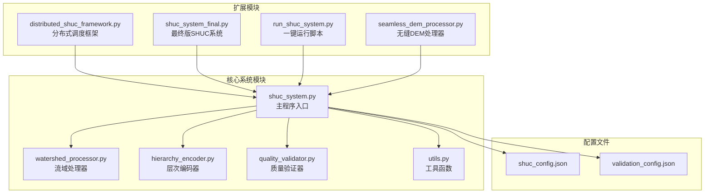
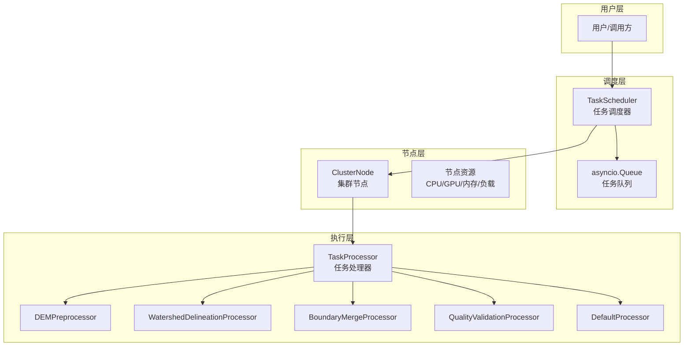
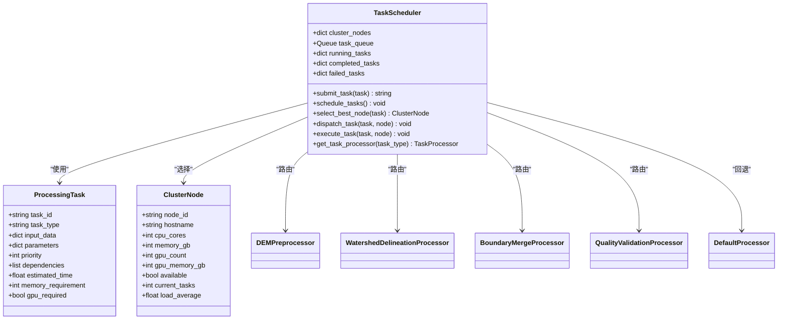
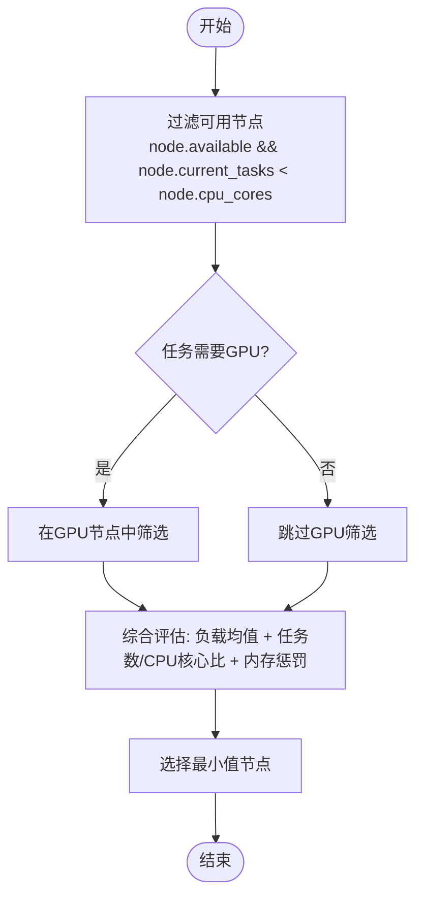
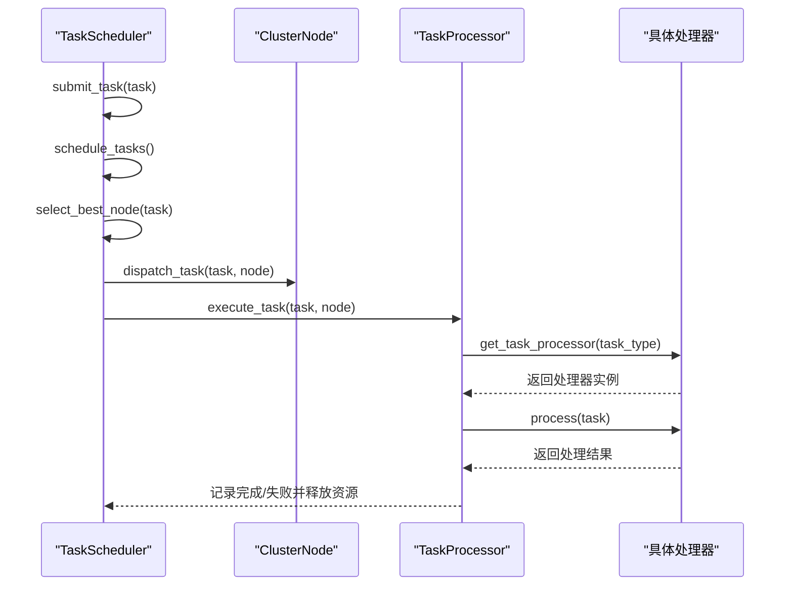
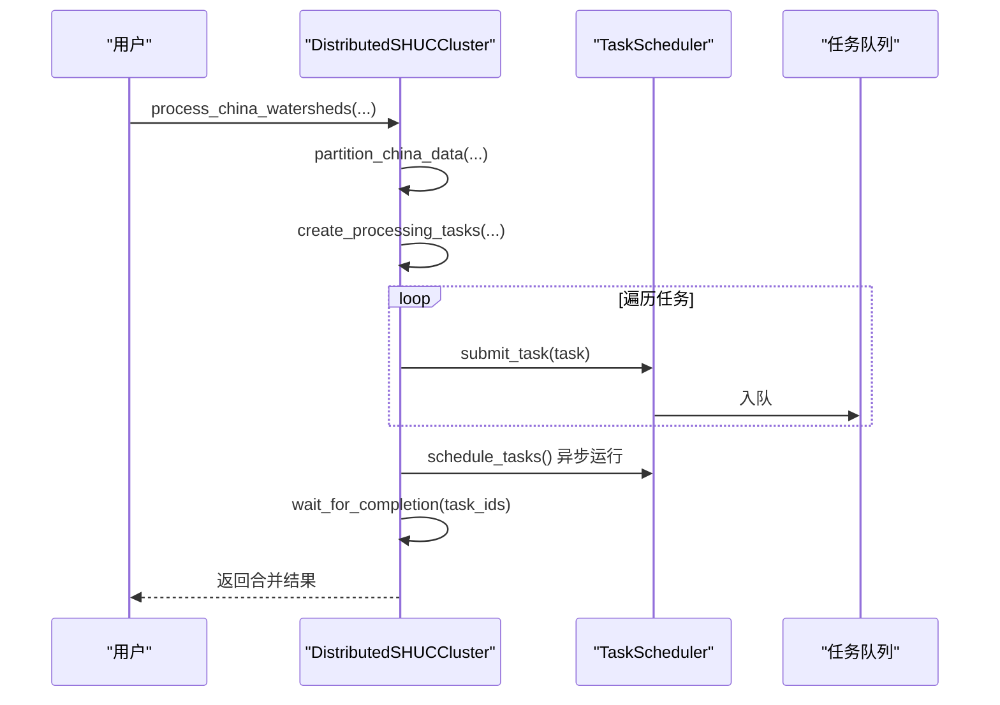
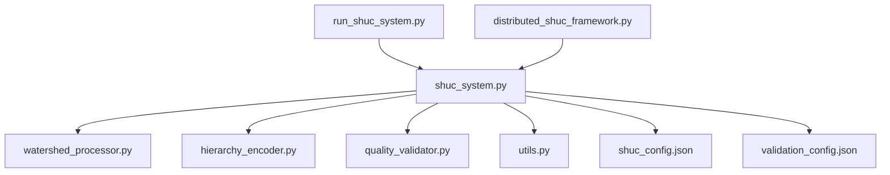

# 任务调度系统

<cite>
**本文档引用的文件**
- [distributed_shuc_framework.py](file://03_EXTENSIONS/distributed_shuc_framework.py)
- [shuc_system_final.py](file://03_EXTENSIONS/shuc_system_final.py)
- [run_shuc_system.py](file://03_EXTENSIONS/run_shuc_system.py)
- [seamless_dem_processor.py](file://03_EXTENSIONS/seamless_dem_processor.py)
- [shuc_system.py](file://01_CORE_SYSTEM/src/shuc_system.py)
- [watershed_processor.py](file://01_CORE_SYSTEM/src/watershed_processor.py)
- [hierarchy_encoder.py](file://01_CORE_SYSTEM/src/hierarchy_encoder.py)
- [quality_validator.py](file://01_CORE_SYSTEM/src/quality_validator.py)
- [utils.py](file://01_CORE_SYSTEM/src/utils.py)
- [shuc_config.json](file://01_CORE_SYSTEM/config/shuc_config.json)
- [validation_config.json](file://01_CORE_SYSTEM/config/validation_config.json)
</cite>

## 目录
1. [简介](#简介)
2. [项目结构](#项目结构)
3. [核心组件](#核心组件)
4. [架构总览](#架构总览)
5. [详细组件分析](#详细组件分析)
6. [依赖关系分析](#依赖关系分析)
7. [性能考虑](#性能考虑)
8. [故障排查指南](#故障排查指南)
9. [结论](#结论)
10. [附录](#附录)

## 简介
本项目是一个面向大规模流域数据处理的分布式任务调度系统，结合了智能调度器、GPU加速处理、无缝拼接与质量验证等能力。系统围绕“分布式SHUC处理框架”展开，提供任务队列管理、负载均衡与节点选择策略，并通过统一的API对外暴露任务提交、调度循环与节点选择等核心能力。同时，系统还包含完整的流域编码、拓扑构建、智能合并与质量验证模块，形成从数据到编码再到验证的完整流水线。

## 项目结构
项目采用模块化组织方式，核心调度框架位于扩展模块，核心业务逻辑位于核心系统模块，配置文件位于config目录，示例与运行脚本位于examples与根目录。

图表来源
- [distributed_shuc_framework.py:1-777](file://03_EXTENSIONS/distributed_shuc_framework.py#L1-L777)
- [shuc_system.py:1-335](file://01_CORE_SYSTEM/src/shuc_system.py#L1-L335)
- [shuc_config.json:1-43](file://01_CORE_SYSTEM/config/shuc_config.json#L1-L43)
- [validation_config.json:1-46](file://01_CORE_SYSTEM/config/validation_config.json#L1-L46)

章节来源
- [distributed_shuc_framework.py:1-777](file://03_EXTENSIONS/distributed_shuc_framework.py#L1-L777)
- [shuc_system.py:1-335](file://01_CORE_SYSTEM/src/shuc_system.py#L1-L335)

## 核心组件
本节聚焦分布式任务调度系统的核心组件，包括任务数据结构、调度器、处理器与集群管理器。

- ProcessingTask：任务定义数据结构，包含任务ID、类型、输入数据、参数、优先级、依赖关系、估算时间、内存需求与GPU需求等字段。
- TaskScheduler：智能任务调度器，负责任务队列管理、节点选择与任务分发，支持异步调度与错误处理。
- ClusterNode：集群节点信息，包含节点ID、主机名、CPU核心数、内存、GPU数量与内存、可用状态、当前任务数与负载均值等。
- 处理器族：针对不同任务类型的处理器，如DEM预处理、流域边界提取、边界合并、质量验证等。
- DistributedSHUCCluster：分布式集群管理器，负责节点配置、任务分区、任务创建与结果聚合。

章节来源
- [distributed_shuc_framework.py:55-80](file://03_EXTENSIONS/distributed_shuc_framework.py#L55-L80)
- [distributed_shuc_framework.py:81-208](file://03_EXTENSIONS/distributed_shuc_framework.py#L81-L208)
- [distributed_shuc_framework.py:550-734](file://03_EXTENSIONS/distributed_shuc_framework.py#L550-L734)

## 架构总览
系统采用“调度器 + 处理器 + 集群管理器”的三层架构。调度器负责任务队列与节点选择；处理器负责具体业务逻辑；集群管理器负责任务分区与结果聚合。

图表来源
- [distributed_shuc_framework.py:81-208](file://03_EXTENSIONS/distributed_shuc_framework.py#L81-L208)
- [distributed_shuc_framework.py:209-548](file://03_EXTENSIONS/distributed_shuc_framework.py#L209-L548)
- [distributed_shuc_framework.py:550-734](file://03_EXTENSIONS/distributed_shuc_framework.py#L550-L734)

## 详细组件分析

### ProcessingTask 任务定义
ProcessingTask是系统中任务的统一数据载体，包含以下关键字段：
- 任务标识：task_id
- 任务类型：task_type（如dem_preprocess、watershed_delineation、boundary_merge、quality_validation）
- 输入数据：input_data（包含dem_files、output_path、conditioned_dem等）
- 参数：parameters（如buffer_size_km、threshold_area_km2、algorithm等）
- 优先级：priority（数值越小优先级越高）
- 依赖关系：dependencies（任务间依赖链）
- 估算时间：estimated_time（秒）
- 内存需求：memory_requirement（MB）
- GPU需求：gpu_required（布尔）

该结构为调度器的节点选择与任务分发提供了基础数据支撑。

章节来源
- [distributed_shuc_framework.py:55-67](file://03_EXTENSIONS/distributed_shuc_framework.py#L55-L67)

### TaskScheduler 调度器
TaskScheduler是系统的核心调度组件，职责包括：
- submit_task：将任务加入异步队列
- schedule_tasks：主调度循环，定时检查队列与节点状态
- select_best_node：基于负载与资源匹配选择最优节点
- dispatch_task：将任务分发给选定节点并异步执行
- execute_task：根据任务类型路由到对应处理器并记录结果或错误
- get_task_processor：按任务类型返回处理器实例

节点选择策略（select_best_node）综合考虑：
- 可用性与并发度：节点必须可用且当前任务数小于CPU核心数
- GPU优先：若任务需要GPU，则优先选择GPU节点
- 负载均衡：综合负载均值、当前任务数与CPU核心比、内存需求满足度

图表来源
- [distributed_shuc_framework.py:55-80](file://03_EXTENSIONS/distributed_shuc_framework.py#L55-L80)
- [distributed_shuc_framework.py:81-208](file://03_EXTENSIONS/distributed_shuc_framework.py#L81-L208)
- [distributed_shuc_framework.py:209-548](file://03_EXTENSIONS/distributed_shuc_framework.py#L209-L548)

章节来源
- [distributed_shuc_framework.py:81-208](file://03_EXTENSIONS/distributed_shuc_framework.py#L81-L208)

### 节点选择算法（select_best_node）
节点选择算法通过以下步骤实现：
1. 过滤可用节点：节点必须可用且当前任务数小于CPU核心数
2. GPU优先：若任务需要GPU，则仅在GPU节点中选择
3. 综合评估：以负载均值、任务数/CPU核心比、内存满足度为权重进行排序，选择最小值作为最优节点

图表来源
- [distributed_shuc_framework.py:124-147](file://03_EXTENSIONS/distributed_shuc_framework.py#L124-L147)

章节来源
- [distributed_shuc_framework.py:124-147](file://03_EXTENSIONS/distributed_shuc_framework.py#L124-L147)

### 处理器族
系统提供多种处理器以处理不同任务类型：
- DEMPreprocessor：DEM数据质量检查、坐标统一、缓冲区处理、无缝拼接、水文条件化
- WatershedDelineationProcessor：CPU/GPU两种模式的流域边界提取
- BoundaryMergeProcessor：边界冲突检测与解决、无缝合并
- QualityValidationProcessor：几何、拓扑、属性与SHUC标准的综合质量验证
- DefaultProcessor：默认处理逻辑

图表来源
- [distributed_shuc_framework.py:98-198](file://03_EXTENSIONS/distributed_shuc_framework.py#L98-L198)
- [distributed_shuc_framework.py:199-208](file://03_EXTENSIONS/distributed_shuc_framework.py#L199-L208)
- [distributed_shuc_framework.py:209-548](file://03_EXTENSIONS/distributed_shuc_framework.py#L209-L548)

章节来源
- [distributed_shuc_framework.py:209-548](file://03_EXTENSIONS/distributed_shuc_framework.py#L209-L548)

### DistributedSHUCCluster 集群管理器
DistributedSHUCCluster负责：
- 节点配置加载或本地节点初始化
- 数据分区（按流域分区）
- 任务创建（预处理与流域提取）
- 任务提交与等待完成
- 结果合并与状态查询

图表来源
- [distributed_shuc_framework.py:611-733](file://03_EXTENSIONS/distributed_shuc_framework.py#L611-L733)

章节来源
- [distributed_shuc_framework.py:550-734](file://03_EXTENSIONS/distributed_shuc_framework.py#L550-L734)

## 依赖关系分析
系统模块间的依赖关系如下：
- distributed_shuc_framework.py 为核心调度框架，被 run_shuc_system.py 与 shuc_system.py 引用
- shuc_system.py 作为主程序入口，依赖 watershed_processor.py、hierarchy_encoder.py、quality_validator.py、utils.py 与配置文件
- 核心系统模块之间通过数据结构与配置文件耦合，形成清晰的职责分离

图表来源
- [distributed_shuc_framework.py:1-777](file://03_EXTENSIONS/distributed_shuc_framework.py#L1-L777)
- [shuc_system.py:1-335](file://01_CORE_SYSTEM/src/shuc_system.py#L1-L335)
- [shuc_config.json:1-43](file://01_CORE_SYSTEM/config/shuc_config.json#L1-L43)
- [validation_config.json:1-46](file://01_CORE_SYSTEM/config/validation_config.json#L1-L46)

章节来源
- [shuc_system.py:1-335](file://01_CORE_SYSTEM/src/shuc_system.py#L1-L335)

## 性能考虑
- 调度策略：select_best_node通过负载均值与任务数/CPU核心比进行综合评估，避免热点节点与资源浪费
- GPU利用：WatershedDelineationProcessor在GPU可用时优先使用GPU加速，显著降低处理时间
- 异步执行：TaskScheduler使用异步队列与异步任务执行，提升吞吐量
- 资源预留：ProcessingTask的memory_requirement与gpu_required字段帮助调度器进行资源匹配
- 并行化：DistributedSHUCCluster支持多任务并行提交与等待完成，适合大规模数据处理

## 故障排查指南
- 调度器错误：TaskScheduler在调度循环中捕获异常并记录日志，可通过日志定位问题
- 节点不可用：检查ClusterNode的available标志与current_tasks是否超过cpu_cores
- GPU不可用：若GPU不可用，WatershedDelineationProcessor会自动回退到CPU模式
- 任务失败：TaskScheduler记录failed_tasks，包含错误信息与失败时间，便于诊断
- 集群状态：DistributedSHUCCluster提供get_cluster_status，可查看运行中、已完成与失败任务数量以及队列长度

章节来源
- [distributed_shuc_framework.py:116-122](file://03_EXTENSIONS/distributed_shuc_framework.py#L116-L122)
- [distributed_shuc_framework.py:182-191](file://03_EXTENSIONS/distributed_shuc_framework.py#L182-L191)
- [distributed_shuc_framework.py:724-733](file://03_EXTENSIONS/distributed_shuc_framework.py#L724-L733)

## 结论
本分布式任务调度系统通过明确的任务数据结构、智能的节点选择策略与完善的处理器体系，实现了对大规模流域数据的高效处理。系统具备良好的扩展性与容错能力，适合在多节点环境中部署，满足从数据预处理到编码验证的全流程需求。

## 附录

### API 参考
- submit_task(task: ProcessingTask) -> str
  - 提交任务到调度队列，返回任务ID
- schedule_tasks() -> None
  - 启动调度主循环，持续从队列取出任务并选择节点执行
- select_best_node(task: ProcessingTask) -> Optional[ClusterNode]
  - 基于负载与资源匹配选择最优节点
- dispatch_task(task: ProcessingTask, node: ClusterNode) -> None
  - 将任务分发给节点并异步执行
- execute_task(task: ProcessingTask, node: ClusterNode) -> None
  - 根据任务类型路由到对应处理器并记录结果或错误
- get_task_processor(task_type: str) -> TaskProcessor
  - 按任务类型返回处理器实例

章节来源
- [distributed_shuc_framework.py:92-208](file://03_EXTENSIONS/distributed_shuc_framework.py#L92-L208)

### 实际使用示例
- 分布式处理演示：demo_distributed_processing
  - 创建DistributedSHUCCluster
  - 配置processing_config
  - 调用process_china_watersheds
  - 输出处理结果与集群状态

章节来源
- [distributed_shuc_framework.py:736-777](file://03_EXTENSIONS/distributed_shuc_framework.py#L736-L777)

### 最佳实践
- 合理设置ProcessingTask的memory_requirement与gpu_required，确保资源匹配
- 在GPU可用环境下启用gpu_required，以获得更好的性能
- 使用dependencies建立任务依赖链，保证处理顺序正确
- 监控集群状态，及时发现节点异常与任务堆积
- 通过配置文件调整阈值与权重，以适配不同场景