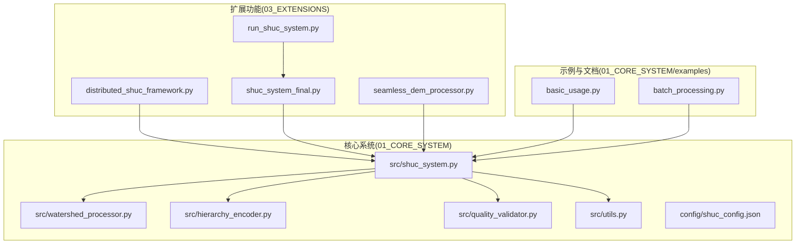
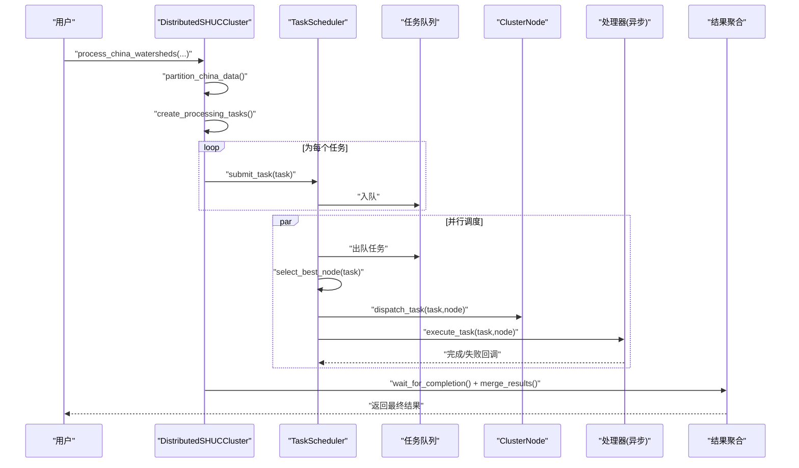
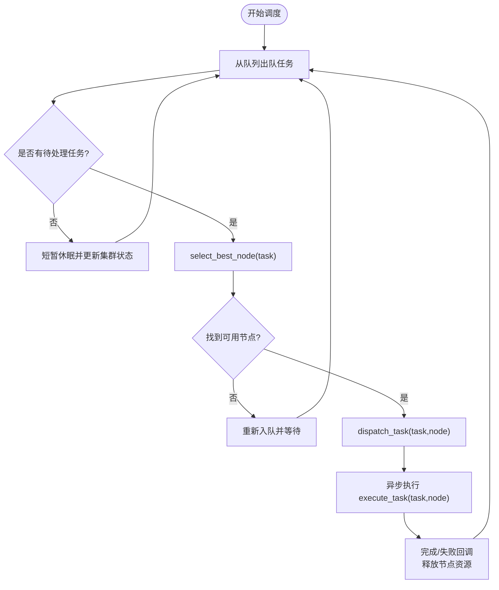
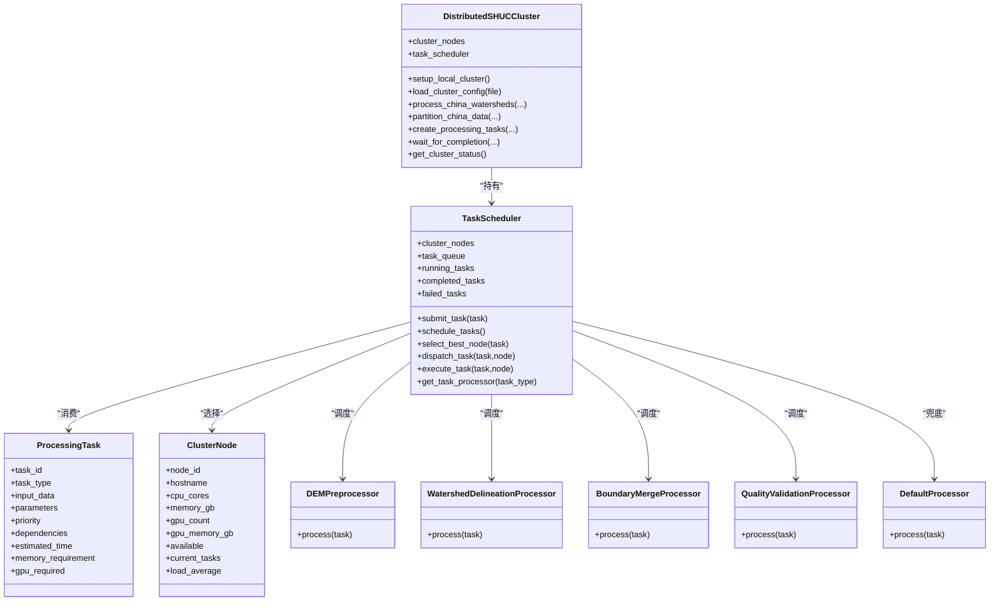
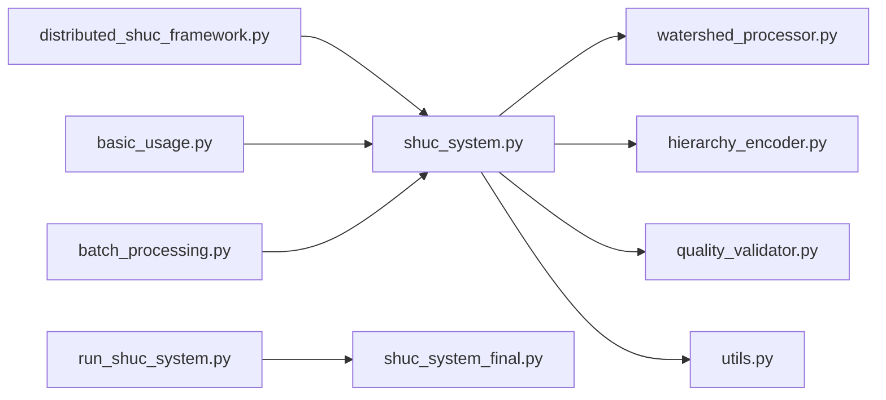

# 分布式处理框架

<cite>
**本文引用的文件**
- [distributed_shuc_framework.py](file://03_EXTENSIONS/distributed_shuc_framework.py)
- [shuc_system_final.py](file://03_EXTENSIONS/shuc_system_final.py)
- [shuc_system.py](file://01_CORE_SYSTEM/src/shuc_system.py)
- [watershed_processor.py](file://01_CORE_SYSTEM/src/watershed_processor.py)
- [hierarchy_encoder.py](file://01_CORE_SYSTEM/src/hierarchy_encoder.py)
- [quality_validator.py](file://01_CORE_SYSTEM/src/quality_validator.py)
- [utils.py](file://01_CORE_SYSTEM/src/utils.py)
- [shuc_config.json](file://01_CORE_SYSTEM/config/shuc_config.json)
- [run_shuc_system.py](file://03_EXTENSIONS/run_shuc_system.py)
- [seamless_dem_processor.py](file://03_EXTENSIONS/seamless_dem_processor.py)
- [basic_usage.py](file://01_CORE_SYSTEM/examples/basic_usage.py)
- [batch_processing.py](file://01_CORE_SYSTEM/examples/batch_processing.py)
- [README.md](file://README.md)
</cite>

## 目录
1. [简介](#简介)
2. [项目结构](#项目结构)
3. [核心组件](#核心组件)
4. [架构总览](#架构总览)
5. [详细组件分析](#详细组件分析)
6. [依赖关系分析](#依赖关系分析)
7. [性能考量](#性能考量)
8. [故障排查指南](#故障排查指南)
9. [结论](#结论)
10. [附录](#附录)

## 简介
本技术文档面向“分布式SHUC处理框架”，系统阐述从140个流域扩展到全国百万流域的分布式任务调度与执行体系。框架以ProcessingTask任务定义为核心，结合TaskScheduler智能调度器实现任务队列管理与负载均衡；通过ClusterNode节点信息结构实现集群节点资源监控与健康检查；以异步执行模型支撑GPU/TauDEM加速的DEM预处理、流域边界提取、边界合并与质量验证等关键流程；并通过DistributedSHUCCluster集群管理器提供统一的配置、扩展与运维能力。同时，文档给出性能优化建议、故障处理策略与监控告警机制，并提供部署与最佳实践指南。

## 项目结构
项目采用模块化分层组织：
- 01_CORE_SYSTEM：核心算法与处理流水线（合并、编码、验证、工具）
- 03_EXTENSIONS：扩展功能（分布式框架、无缝DEM处理、一键运行脚本）
- 04_EXPERIMENTS：实验设计与结果
- 05_DATA：数据与参考材料

图表来源
- [shuc_system.py:43-250](file://01_CORE_SYSTEM/src/shuc_system.py#L43-L250)
- [watershed_processor.py:24-377](file://01_CORE_SYSTEM/src/watershed_processor.py#L24-L377)
- [hierarchy_encoder.py:22-219](file://01_CORE_SYSTEM/src/hierarchy_encoder.py#L22-L219)
- [quality_validator.py:24-411](file://01_CORE_SYSTEM/src/quality_validator.py#L24-L411)
- [utils.py:24-360](file://01_CORE_SYSTEM/src/utils.py#L24-L360)
- [distributed_shuc_framework.py:550-777](file://03_EXTENSIONS/distributed_shuc_framework.py#L550-L777)
- [shuc_system_final.py:31-803](file://03_EXTENSIONS/shuc_system_final.py#L31-L803)
- [run_shuc_system.py:16-211](file://03_EXTENSIONS/run_shuc_system.py#L16-L211)
- [seamless_dem_processor.py:42-916](file://03_EXTENSIONS/seamless_dem_processor.py#L42-L916)
- [basic_usage.py:25-106](file://01_CORE_SYSTEM/examples/basic_usage.py#L25-L106)
- [batch_processing.py:31-327](file://01_CORE_SYSTEM/examples/batch_processing.py#L31-L327)

章节来源
- [README.md:19-30](file://README.md#L19-L30)

## 核心组件
- ProcessingTask：分布式任务定义，包含任务类型、输入参数、依赖关系、内存/GPU需求与估算耗时。
- ClusterNode：集群节点信息，包含CPU/内存/GPU资源、当前任务数、负载均值与可用性。
- TaskScheduler：智能调度器，负责任务入队、最佳节点选择、任务派发与异步执行。
- 处理器族：DEMPreprocessor、WatershedDelineationProcessor、BoundaryMergeProcessor、QualityValidationProcessor、DefaultProcessor。
- DistributedSHUCCluster：分布式集群管理器，封装任务分区、任务创建、调度器生命周期与集群状态查询。

章节来源
- [distributed_shuc_framework.py:55-208](file://03_EXTENSIONS/distributed_shuc_framework.py#L55-L208)
- [distributed_shuc_framework.py:550-777](file://03_EXTENSIONS/distributed_shuc_framework.py#L550-L777)

## 架构总览
分布式SHUC处理框架采用“任务驱动 + 资源感知 + 异步执行”的架构模式。核心流程如下：
- 数据分区：按地理区域（如9大流域）切分为多个处理分区。
- 任务创建：为每个分区生成预处理与边界提取任务，并建立依赖关系。
- 调度执行：TaskScheduler从队列中取出任务，基于节点资源与负载选择最佳节点，异步执行对应处理器。
- 结果聚合：等待所有任务完成后，合并各分区结果并输出最终产品。

图表来源
- [distributed_shuc_framework.py:611-723](file://03_EXTENSIONS/distributed_shuc_framework.py#L611-L723)
- [distributed_shuc_framework.py:81-208](file://03_EXTENSIONS/distributed_shuc_framework.py#L81-L208)

## 详细组件分析

### TaskScheduler 智能调度器
- 任务队列管理：基于异步队列，支持超时与重试回退。
- 负载均衡策略：综合考虑节点负载均值、当前任务数、CPU核数与内存余量，优先GPU节点处理GPU任务。
- 任务派发与异步执行：派发后创建异步任务，执行完成后释放资源并记录状态。

图表来源
- [distributed_shuc_framework.py:98-198](file://03_EXTENSIONS/distributed_shuc_framework.py#L98-L198)

章节来源
- [distributed_shuc_framework.py:81-198](file://03_EXTENSIONS/distributed_shuc_framework.py#L81-L198)

### ClusterNode 节点信息结构
- 资源字段：CPU核心数、内存GB、GPU数量与显存、当前任务数、负载均值。
- 可用性：节点可用标志，用于过滤不可用节点。
- 调度参与：作为select_best_node的候选集合，影响任务分配决策。

章节来源
- [distributed_shuc_framework.py:69-80](file://03_EXTENSIONS/distributed_shuc_framework.py#L69-L80)

### ProcessingTask 任务定义
- 任务类型：dem_preprocess、watershed_delineation、boundary_merge、quality_validation等。
- 依赖关系：支持前置任务ID，保证处理顺序。
- 资源需求：内存需求（MB）、GPU需求标志。
- 估算指标：估算耗时（秒），辅助调度器进行资源匹配。

章节来源
- [distributed_shuc_framework.py:55-67](file://03_EXTENSIONS/distributed_shuc_framework.py#L55-L67)

### 处理器族与异步执行模型
- DEMPreprocessor：质量检查、坐标统一、缓冲区处理、无缝拼接、水文条件化。
- WatershedDelineationProcessor：CPU/GPU双路径，自动选择GPU加速。
- BoundaryMergeProcessor：冲突检测、冲突解决、无缝合并。
- QualityValidationProcessor：几何、拓扑、属性与SHUC标准验证，生成综合质量报告。
- DefaultProcessor：兜底处理逻辑。

图表来源
- [distributed_shuc_framework.py:55-208](file://03_EXTENSIONS/distributed_shuc_framework.py#L55-L208)
- [distributed_shuc_framework.py:550-777](file://03_EXTENSIONS/distributed_shuc_framework.py#L550-L777)

章节来源
- [distributed_shuc_framework.py:209-549](file://03_EXTENSIONS/distributed_shuc_framework.py#L209-L549)

### 异步任务执行模型与并发控制
- 异步队列：基于asyncio.Queue，支持超时与非阻塞轮询。
- 并发控制：节点当前任务数不超过CPU核心数，避免过载。
- 资源回收：任务完成后减少当前任务计数并清理运行状态。
- GPU优先：GPU任务优先分配给具备GPU的节点。

章节来源
- [distributed_shuc_framework.py:81-198](file://03_EXTENSIONS/distributed_shuc_framework.py#L81-L198)

### 集群节点管理与健康检查
- 节点可用性：通过available标志与当前任务数、负载均值共同决定。
- 健康检查：定期更新集群状态，调度器在空闲时刷新节点健康状况。
- 资源监控：CPU/内存/GPU资源与负载均值用于负载均衡决策。

章节来源
- [distributed_shuc_framework.py:69-80](file://03_EXTENSIONS/distributed_shuc_framework.py#L69-L80)
- [distributed_shuc_framework.py:116-123](file://03_EXTENSIONS/distributed_shuc_framework.py#L116-L123)

### 分布式集群管理器 DistributedSHUCCluster
- 初始化：支持本地单机或加载外部集群配置。
- 数据分区：按地理区域划分处理分区，估算工作量。
- 任务创建：为每个分区生成预处理与边界提取任务，并设置依赖关系。
- 生命周期管理：启动调度器协程，等待任务完成，最后停止调度器。
- 状态查询：提供集群运行状态、队列长度与任务统计。

章节来源
- [distributed_shuc_framework.py:550-777](file://03_EXTENSIONS/distributed_shuc_framework.py#L550-L777)

### 与核心系统集成
- 核心流水线：核心系统提供合并、编码、验证与工具模块，分布式框架可调用其处理器或独立运行。
- 配置驱动：通过shuc_config.json控制合并策略、层次分配与验证权重。
- 批处理与示例：examples展示基础与批量处理用法，run_shuc_system.py提供一键运行。

章节来源
- [shuc_system.py:43-250](file://01_CORE_SYSTEM/src/shuc_system.py#L43-L250)
- [watershed_processor.py:24-377](file://01_CORE_SYSTEM/src/watershed_processor.py#L24-L377)
- [hierarchy_encoder.py:22-219](file://01_CORE_SYSTEM/src/hierarchy_encoder.py#L22-L219)
- [quality_validator.py:24-411](file://01_CORE_SYSTEM/src/quality_validator.py#L24-L411)
- [utils.py:64-127](file://01_CORE_SYSTEM/src/utils.py#L64-L127)
- [shuc_config.json:1-43](file://01_CORE_SYSTEM/config/shuc_config.json#L1-L43)
- [basic_usage.py:25-106](file://01_CORE_SYSTEM/examples/basic_usage.py#L25-L106)
- [batch_processing.py:31-327](file://01_CORE_SYSTEM/examples/batch_processing.py#L31-L327)
- [run_shuc_system.py:16-211](file://03_EXTENSIONS/run_shuc_system.py#L16-L211)

## 依赖关系分析
- 模块耦合：
  - shuc_system.py 作为主入口，依赖 watershed_processor、hierarchy_encoder、quality_validator、utils。
  - distributed_shuc_framework.py 与核心系统解耦，通过处理器接口与TaskScheduler协作。
  - run_shuc_system.py 与 shuc_system_final.py 解耦，提供最终版系统的一键运行。
- 外部依赖：
  - GeoPandas/Shapely：空间数据处理。
  - NumPy/Pandas：数值与表格处理。
  - NetworkX：拓扑图构建。
  - 可选：CuPy（GPU加速）、Dask（分布式计算）。

图表来源
- [shuc_system.py:38-41](file://01_CORE_SYSTEM/src/shuc_system.py#L38-L41)
- [distributed_shuc_framework.py:550-777](file://03_EXTENSIONS/distributed_shuc_framework.py#L550-L777)
- [run_shuc_system.py:18-211](file://03_EXTENSIONS/run_shuc_system.py#L18-L211)
- [basic_usage.py:23-24](file://01_CORE_SYSTEM/examples/basic_usage.py#L23-L24)
- [batch_processing.py:28-29](file://01_CORE_SYSTEM/examples/batch_processing.py#L28-L29)

## 性能考量
- 调度策略优化
  - 节点选择：综合负载均值、当前任务数、CPU核数与内存余量，优先GPU节点处理GPU任务。
  - 任务粒度：按地理区域分区，减少跨节点通信与数据传输。
- 并发与资源控制
  - 节点当前任务数上限为CPU核心数，避免过载。
  - 任务估算耗时与内存需求用于更精准的资源匹配。
- GPU加速
  - 自动检测GPU可用性，优先选择GPU节点执行加速任务。
- I/O与中间结果
  - 建议在分区内部缓存处理中间结果，减少重复I/O。
- 批处理与并行
  - 在单机多核环境下，可启用并行处理（核心系统配置项）提升吞吐。

[本节为通用指导，无需特定文件引用]

## 故障排查指南
- 调度器异常
  - 现象：任务长时间未被调度或频繁重入队。
  - 排查：检查节点可用性、负载均值与内存余量；确认任务依赖是否满足。
- 处理器执行失败
  - 现象：任务失败记录与错误堆栈。
  - 排查：查看处理器日志、输入数据质量与参数配置；确认GPU/CUDA环境。
- 资源不足
  - 现象：任务无法分配或执行缓慢。
  - 排查：增加节点资源、降低任务内存/GPU需求或调整分区粒度。
- 集群状态异常
  - 现象：队列积压或节点长期空闲。
  - 排查：检查节点健康检查与负载更新频率；核对任务估算耗时与资源需求。

章节来源
- [distributed_shuc_framework.py:116-123](file://03_EXTENSIONS/distributed_shuc_framework.py#L116-L123)
- [distributed_shuc_framework.py:182-192](file://03_EXTENSIONS/distributed_shuc_framework.py#L182-L192)

## 结论
分布式SHUC处理框架通过任务驱动与资源感知的调度策略，结合异步执行与GPU加速，实现了从140个流域到全国百万流域的可扩展处理能力。核心系统提供稳健的合并、编码与验证流水线，分布式框架则提供了灵活的集群管理与任务编排能力。配合完善的配置、示例与一键运行脚本，开发者可以快速部署并扩展该框架以满足更大规模的流域处理需求。

[本节为总结性内容，无需特定文件引用]

## 附录

### API参考：DistributedSHUCCluster
- 初始化
  - 参数：cluster_config_file（可选，集群配置文件路径）
  - 行为：若提供配置文件则加载集群节点，否则设置本地单机节点
- 方法
  - setup_local_cluster()：设置本地单机节点
  - load_cluster_config(config_file)：加载外部集群配置
  - process_china_watersheds(dem_data_path, output_path, processing_config)：处理全中国流域数据
  - partition_china_data(dem_data_path, config)：按地理区域分区
  - create_processing_tasks(partitions, config)：创建处理任务（含依赖关系）
  - wait_for_completion(task_ids)：等待任务完成并收集结果
  - get_cluster_status()：获取集群状态（节点数、运行/完成/失败任务数、队列长度）

章节来源
- [distributed_shuc_framework.py:550-777](file://03_EXTENSIONS/distributed_shuc_framework.py#L550-L777)

### 配置选项与扩展接口
- 配置文件：shuc_config.json
  - processing：目标合规率、合并策略、最大迭代次数、早停开关、动态阈值模式
  - hierarchy：各级别最小面积、是否启用配额、各级别配额
  - validation：面积合规阈值、编码唯一性阈值、拓扑完整性阈值、质量权重
  - output：是否保存中间结果、是否启用详细日志、是否导出验证报告与统计
  - performance：是否启用并行处理、最大内存使用、是否显示进度
- 扩展接口
  - 自定义处理器：实现process(task)异步方法，注册到TaskScheduler的处理器映射
  - 自定义节点：扩展ClusterNode字段以支持更多资源指标
  - 自定义调度策略：重写select_best_node逻辑以适配特定硬件或网络拓扑

章节来源
- [shuc_config.json:1-43](file://01_CORE_SYSTEM/config/shuc_config.json#L1-L43)
- [distributed_shuc_framework.py:199-208](file://03_EXTENSIONS/distributed_shuc_framework.py#L199-L208)

### 部署与最佳实践
- 环境准备
  - 安装依赖：pip install -r requirements.txt
  - 准备输入数据：确保shapefile存在且包含必要字段
- 快速开始
  - 基础示例：python examples/basic_usage.py
  - 批量处理：python examples/batch_processing.py
  - 一键运行：python run_shuc_system.py
- 最佳实践
  - 合理分区：按地理区域与数据量划分分区，避免单分区过大
  - 资源规划：为GPU任务预留GPU节点，确保内存与CPU核数充足
  - 监控告警：定期检查队列长度与节点负载，及时扩容或调整任务粒度
  - 质量验证：启用验证报告与统计，持续跟踪合规率与评分变化

章节来源
- [README.md:34-46](file://README.md#L34-L46)
- [basic_usage.py:25-106](file://01_CORE_SYSTEM/examples/basic_usage.py#L25-L106)
- [batch_processing.py:227-327](file://01_CORE_SYSTEM/examples/batch_processing.py#L227-L327)
- [run_shuc_system.py:16-211](file://03_EXTENSIONS/run_shuc_system.py#L16-L211)