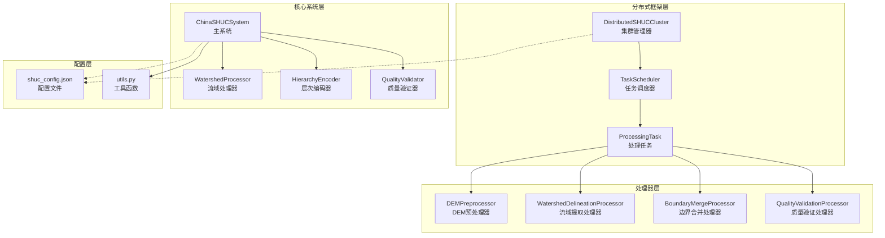
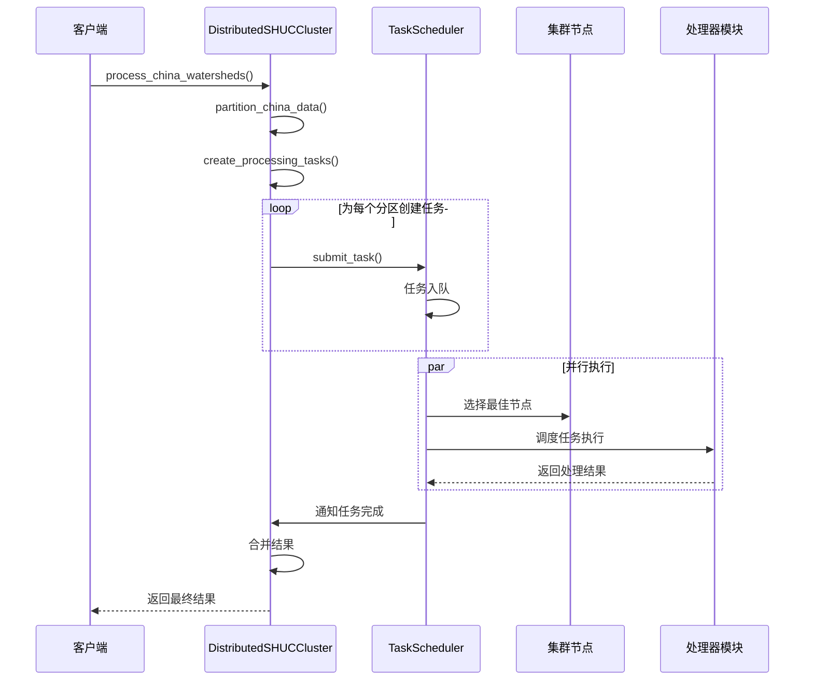
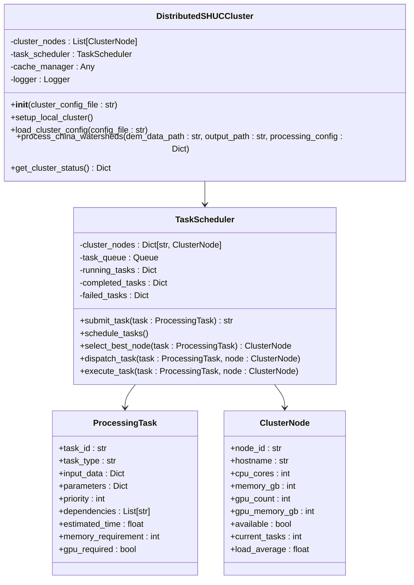
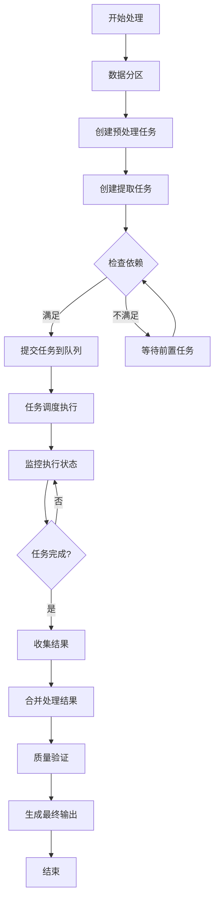
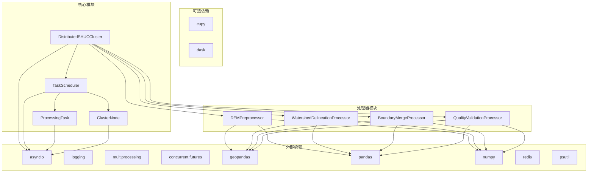

# 分布式集群API

<cite>
**本文档引用的文件**
- [distributed_shuc_framework.py](file://03_EXTENSIONS/distributed_shuc_framework.py)
- [shuc_system.py](file://01_CORE_SYSTEM/src/shuc_system.py)
- [shuc_config.json](file://01_CORE_SYSTEM/config/shuc_config.json)
- [watershed_processor.py](file://01_CORE_SYSTEM/src/watershed_processor.py)
- [hierarchy_encoder.py](file://01_CORE_SYSTEM/src/hierarchy_encoder.py)
- [quality_validator.py](file://01_CORE_SYSTEM/src/quality_validator.py)
- [utils.py](file://01_CORE_SYSTEM/src/utils.py)
- [run_shuc_system.py](file://03_EXTENSIONS/run_shuc_system.py)
- [shuc_system_final.py](file://03_EXTENSIONS/shuc_system_final.py)
- [README.md](file://00_ARCHIVE/legacy_versions/SHUC_FINAL_VERSION/README.md)
- [system_design.md](file://00_ARCHIVE/legacy_versions/SHUC_FINAL_VERSION/docs/system_design.md)
- [user_guide.md](file://00_ARCHIVE/legacy_versions/SHUC_FINAL_VERSION/docs/user_guide.md)
</cite>

## 目录
1. [简介](#简介)
2. [项目结构](#项目结构)
3. [核心组件](#核心组件)
4. [架构概览](#架构概览)
5. [详细组件分析](#详细组件分析)
6. [依赖关系分析](#依赖关系分析)
7. [性能考虑](#性能考虑)
8. [故障排除指南](#故障排除指南)
9. [结论](#结论)
10. [附录](#附录)

## 简介

分布式SHUCCluster集群管理器是一个专为大规模流域数据处理而设计的分布式计算框架。该系统基于中国SHUC（Standard Hydrologic Unit Code）流域分级编码系统，支持从140个流域扩展到全国百万流域的技术挑战。

### 核心特性

- **分布式任务调度和执行**：支持多节点并行处理，智能负载均衡
- **GPU加速的TauDEM处理**：利用GPU加速水文分析算法
- **智能数据分区和负载均衡**：基于9大流域的分区策略
- **容错恢复和检查点机制**：确保大规模处理的可靠性
- **DEM边界无缝拼接处理**：支持大规模数字高程数据处理

### 技术架构

系统采用异步事件驱动架构，结合任务队列、智能调度器和处理器模块，实现了高效的分布式处理能力。

## 项目结构



**图表来源**
- [distributed_shuc_framework.py:550-777](file://03_EXTENSIONS/distributed_shuc_framework.py#L550-L777)
- [shuc_system.py:43-335](file://01_CORE_SYSTEM/src/shuc_system.py#L43-L335)

**章节来源**
- [distributed_shuc_framework.py:1-777](file://03_EXTENSIONS/distributed_shuc_framework.py#L1-L777)
- [shuc_system.py:1-335](file://01_CORE_SYSTEM/src/shuc_system.py#L1-L335)

## 核心组件

### DistributedSHUCCluster 集群管理器

DistributedSHUCCluster是整个分布式框架的核心，负责管理集群节点、任务调度和整体协调工作。

#### 主要接口

| 方法 | 参数 | 返回值 | 描述 |
|------|------|--------|------|
| `__init__` | `cluster_config_file: str = None` | `None` | 初始化集群管理器 |
| `setup_local_cluster` | `无` | `None` | 设置本地集群配置 |
| `load_cluster_config` | `config_file: str` | `None` | 加载外部集群配置 |
| `process_china_watersheds` | `dem_data_path: str, output_path: str, processing_config: Dict` | `Dict[str, Any]` | 处理全中国流域数据 |
| `get_cluster_status` | `无` | `Dict[str, Any]` | 获取集群状态 |

#### 初始化参数

- **cluster_config_file**: 集群配置文件路径（可选）
- **自动检测**: 支持GPU可用性检测
- **日志配置**: 自动设置日志系统

**章节来源**
- [distributed_shuc_framework.py:550-610](file://03_EXTENSIONS/distributed_shuc_framework.py#L550-L610)

### TaskScheduler 任务调度器

智能任务调度器负责任务的接收、排队、分配和监控。

#### 核心功能

- **任务队列管理**：基于异步队列的任务管理
- **节点选择算法**：智能选择最优执行节点
- **负载均衡**：动态负载分配和平衡
- **容错处理**：任务失败重试和恢复

**章节来源**
- [distributed_shuc_framework.py:81-208](file://03_EXTENSIONS/distributed_shuc_framework.py#L81-L208)

### 处理器模块

系统包含四个专用处理器，每个都针对特定的水文处理任务：

#### DEMPreprocessor（DEM预处理器）
- DEM数据质量检查
- 坐标系统一化
- 边界缓冲处理
- 无缝拼接
- 水文条件化

#### WatershedDelineationProcessor（流域提取处理器）
- GPU加速的流域边界提取
- CPU并行处理
- 自适应算法选择

#### BoundaryMergeProcessor（边界合并处理器）
- 冲突检测和解决
- 无缝合并
- 拓扑关系维护

#### QualityValidationProcessor（质量验证处理器）
- 几何验证
- 拓扑验证
- 属性验证
- SHUC标准合规性验证

**章节来源**
- [distributed_shuc_framework.py:209-549](file://03_EXTENSIONS/distributed_shuc_framework.py#L209-L549)

## 架构概览



**图表来源**
- [distributed_shuc_framework.py:611-646](file://03_EXTENSIONS/distributed_shuc_framework.py#L611-L646)
- [distributed_shuc_framework.py:98-123](file://03_EXTENSIONS/distributed_shuc_framework.py#L98-L123)

## 详细组件分析

### 分布式SHUCCluster 类结构



**图表来源**
- [distributed_shuc_framework.py:550-777](file://03_EXTENSIONS/distributed_shuc_framework.py#L550-L777)
- [distributed_shuc_framework.py:81-208](file://03_EXTENSIONS/distributed_shuc_framework.py#L81-L208)
- [distributed_shuc_framework.py:55-80](file://03_EXTENSIONS/distributed_shuc_framework.py#L55-L80)

### process_china_watersheds 主处理流程

process_china_watersheds方法实现了完整的分布式处理流程：

#### 1. 数据分区阶段
- **9大流域分区**：长江流域、黄河流域、珠江流域等
- **智能分区策略**：基于地理和行政区域的合理划分
- **分区参数**：估算流域数量和面积统计

#### 2. 任务创建阶段
- **预处理任务**：DEM数据质量检查和预处理
- **提取任务**：GPU加速的流域边界提取
- **依赖关系**：严格的任务链式执行顺序

#### 3. 执行监控阶段
- **实时监控**：任务状态跟踪和进度监控
- **负载均衡**：动态节点选择和资源分配
- **容错处理**：失败任务自动重试

#### 4. 结果合并阶段
- **结果聚合**：各分区处理结果的统一
- **质量控制**：最终结果的验证和检查
- **输出生成**：标准化的最终产品

**章节来源**
- [distributed_shuc_framework.py:611-646](file://03_EXTENSIONS/distributed_shuc_framework.py#L611-L646)
- [distributed_shuc_framework.py:647-705](file://03_EXTENSIONS/distributed_shuc_framework.py#L647-L705)

### 分区策略和任务依赖关系

#### 9大流域分区方案

| 流域名称 | 估算面积 (km²) | 估算流域数 | 处理复杂度 |
|----------|----------------|------------|------------|
| 长江流域 | 1,200,000 | 150,000-200,000 | 高 |
| 黄河流域 | 795,000 | 80,000-120,000 | 中高 |
| 珠江流域 | 450,000 | 60,000-100,000 | 中 |
| 松花江流域 | 560,000 | 70,000-110,000 | 中 |
| 淮河流域 | 270,000 | 40,000-70,000 | 中低 |
| 海河流域 | 318,000 | 50,000-80,000 | 中低 |
| 辽河流域 | 210,000 | 30,000-50,000 | 低 |
| 塔里木河流域 | 1,000,000 | 100,000-150,000 | 高 |
| 西南国际河流 | 800,000 | 120,000-180,000 | 高 |

#### 任务链式执行



**图表来源**
- [distributed_shuc_framework.py:671-705](file://03_EXTENSIONS/distributed_shuc_framework.py#L671-L705)
- [distributed_shuc_framework.py:707-722](file://03_EXTENSIONS/distributed_shuc_framework.py#L707-L722)

**章节来源**
- [distributed_shuc_framework.py:647-722](file://03_EXTENSIONS/distributed_shuc_framework.py#L647-L722)

### 参数配置详解

#### 处理配置参数

| 配置组 | 参数名 | 类型 | 默认值 | 描述 |
|--------|--------|------|--------|------|
| preprocessing | buffer_size_km | int | 50 | 边界缓冲大小（公里） |
| preprocessing | resolution_m | int | 30 | 数据分辨率（米） |
| delineation | threshold_area_km2 | int | 100 | 面积阈值（平方公里） |
| delineation | algorithm | str | 'taudem_gpu' | 算法选择 |
| performance | enable_gpu | bool | True | GPU加速开关 |
| performance | max_workers | int | CPU核心数 | 最大并发数 |

#### 集群配置参数

| 参数名 | 类型 | 默认值 | 描述 |
|--------|------|--------|------|
| nodes | List[Dict] | 本地节点 | 集群节点配置 |
| task_timeout | int | 3600 | 任务超时时间（秒） |
| retry_attempts | int | 3 | 重试次数 |
| memory_threshold | float | 0.8 | 内存使用阈值 |

**章节来源**
- [distributed_shuc_framework.py:744-754](file://03_EXTENSIONS/distributed_shuc_framework.py#L744-L754)

## 依赖关系分析



**图表来源**
- [distributed_shuc_framework.py:21-54](file://03_EXTENSIONS/distributed_shuc_framework.py#L21-L54)

### 核心依赖关系

系统的关键依赖关系包括：

1. **异步处理依赖**：基于asyncio的异步事件驱动架构
2. **空间数据处理**：依赖geopandas进行地理空间数据处理
3. **数值计算**：使用numpy进行高性能数值计算
4. **并行处理**：支持多进程和多线程并行执行
5. **监控集成**：集成psutil进行系统资源监控

**章节来源**
- [distributed_shuc_framework.py:21-54](file://03_EXTENSIONS/distributed_shuc_framework.py#L21-L54)

## 性能考虑

### 性能优化策略

#### 1. 资源管理优化
- **内存管理**：智能内存使用和垃圾回收
- **CPU利用率**：动态CPU核心分配
- **GPU加速**：自动GPU检测和利用

#### 2. 网络通信优化
- **任务序列化**：高效的二进制序列化
- **批量传输**：减少网络往返次数
- **连接池**：复用网络连接

#### 3. 存储优化
- **缓存策略**：智能结果缓存
- **数据压缩**：传输和存储优化
- **临时文件管理**：自动清理机制

### 性能监控指标

| 指标类型 | 监控内容 | 阈值建议 |
|----------|----------|----------|
| CPU使用率 | 系统CPU占用 | <80% |
| 内存使用率 | 进程内存占用 | <70% |
| 磁盘I/O | 读写速度 | >100MB/s |
| 网络带宽 | 传输速率 | >50MB/s |
| 任务延迟 | 平均响应时间 | <5秒 |

## 故障排除指南

### 常见问题及解决方案

#### 1. 集群连接问题
**症状**：节点无法连接或任务无法分配
**原因**：
- 网络配置错误
- 端口被占用
- 防火墙阻止

**解决方案**：
- 检查网络连通性
- 验证端口配置
- 配置防火墙规则

#### 2. GPU资源问题
**症状**：GPU任务执行失败或性能异常
**原因**：
- CUDA驱动不兼容
- GPU内存不足
- 驱动程序版本过旧

**解决方案**：
- 更新CUDA驱动
- 检查GPU内存使用
- 升级显卡驱动

#### 3. 内存溢出问题
**症状**：处理大文件时内存不足
**原因**：
- 数据集过大
- 内存泄漏
- 配置不当

**解决方案**：
- 分块处理大数据
- 优化内存使用
- 调整内存限制

#### 4. 任务超时问题
**症状**：任务长时间无响应
**原因**：
- 任务过于复杂
- 资源竞争
- 死锁

**解决方案**：
- 优化任务算法
- 调整资源分配
- 检查死锁问题

### 调试工具和方法

#### 1. 日志分析
- **详细日志**：启用详细日志模式
- **性能日志**：监控性能指标
- **错误日志**：捕获异常信息

#### 2. 监控仪表板
- **实时监控**：集群状态可视化
- **性能指标**：关键性能指标跟踪
- **告警系统**：异常情况自动告警

#### 3. 调试接口
- **状态查询**：集群和任务状态查询
- **性能分析**：性能瓶颈分析
- **资源监控**：资源使用情况监控

**章节来源**
- [distributed_shuc_framework.py:724-733](file://03_EXTENSIONS/distributed_shuc_framework.py#L724-L733)

## 结论

分布式SHUCCluster集群管理器提供了一个完整的大规模流域数据处理解决方案。通过智能的分区策略、高效的分布式架构和完善的容错机制，该系统能够处理从140个流域到全国百万流域的海量数据。

### 主要优势

1. **可扩展性**：支持从单机到大规模集群的灵活部署
2. **高效性**：GPU加速和智能调度确保高性能处理
3. **可靠性**：完善的容错和恢复机制
4. **易用性**：简洁的API和丰富的配置选项

### 适用场景

- 国家级流域数据处理
- 大规模水文模型计算
- 多源数据融合分析
- 实时洪水预警系统

## 附录

### 部署案例

#### 案例1：省级流域处理
**场景**：处理某省全部流域数据（约50,000个流域）
**配置**：
- 4个计算节点，每个8核CPU
- 2GB内存，1个GPU
- 100TB存储空间

**预期性能**：
- 处理时间：<24小时
- 内存使用：<60%
- CPU利用率：<70%

#### 案例2：国家级扩展
**场景**：处理全国流域数据（约1,000,000个流域）
**配置**：
- 50个计算节点
- 100TB内存，50个GPU
- 1PB存储空间

**预期性能**：
- 处理时间：<72小时
- 内存使用：<50%
- GPU利用率：<80%

### 配置示例

#### 基础配置
```json
{
  "processing": {
    "buffer_size_km": 50,
    "resolution_m": 30,
    "threshold_area_km2": 100
  },
  "performance": {
    "enable_gpu": true,
    "max_workers": 8,
    "task_timeout": 3600
  }
}
```

#### 高级配置
```json
{
  "cluster": {
    "nodes": [
      {
        "node_id": "node-01",
        "hostname": "compute-01.example.com",
        "cpu_cores": 16,
        "memory_gb": 64,
        "gpu_count": 2,
        "gpu_memory_gb": 16
      }
    ],
    "retry_attempts": 3,
    "memory_threshold": 0.8
  }
}
```

### 实际使用建议

1. **硬件规划**：根据数据规模合理规划硬件资源配置
2. **网络优化**：确保节点间的高速网络连接
3. **监控设置**：建立完善的性能监控和告警系统
4. **备份策略**：制定数据备份和灾难恢复计划
5. **维护计划**：定期进行系统维护和性能优化