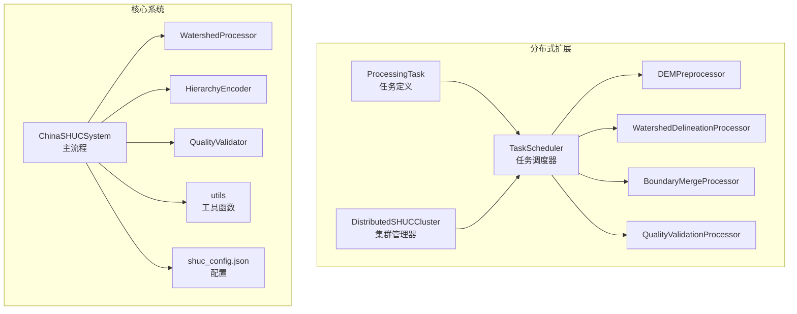
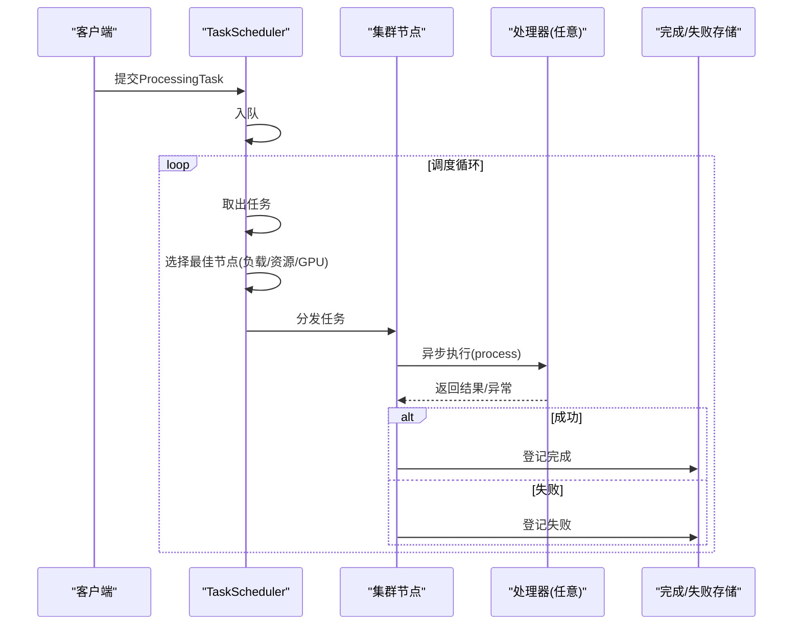
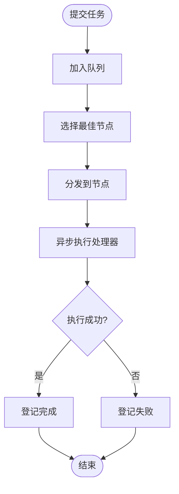
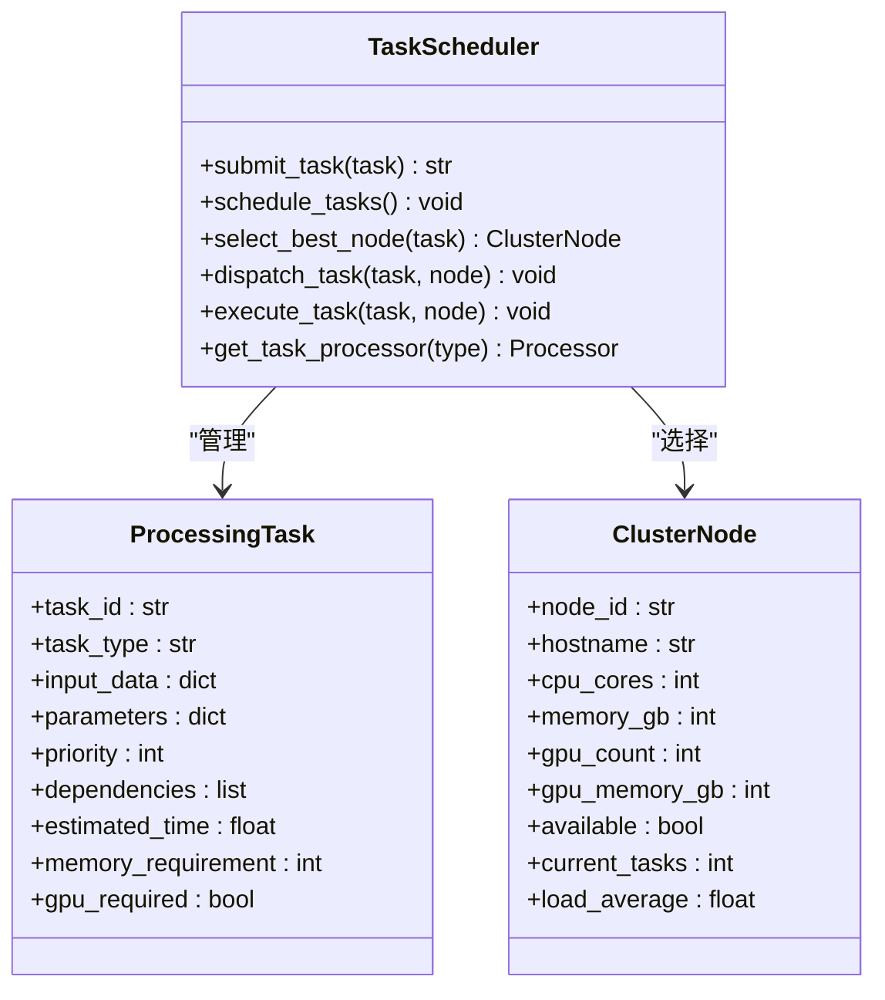
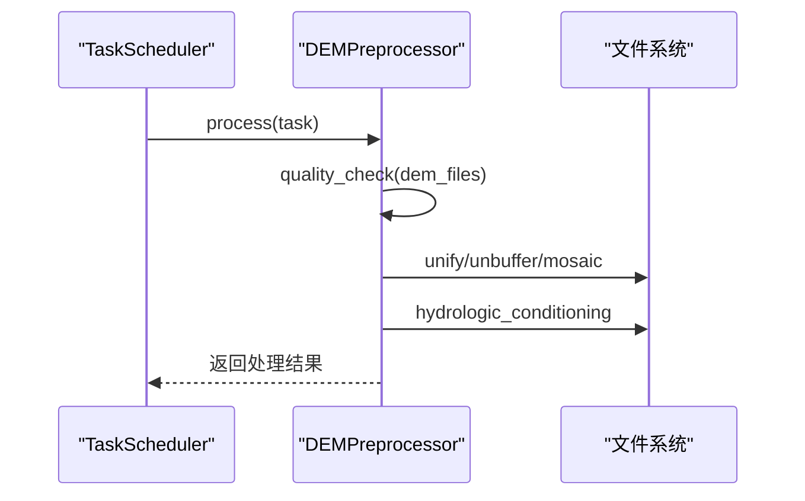
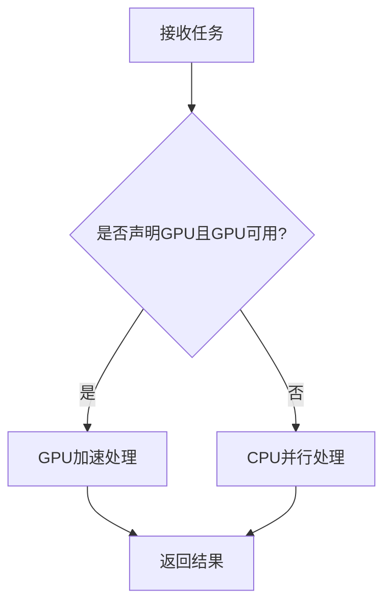
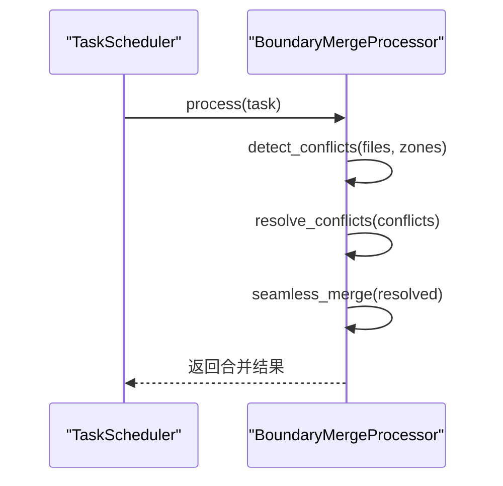
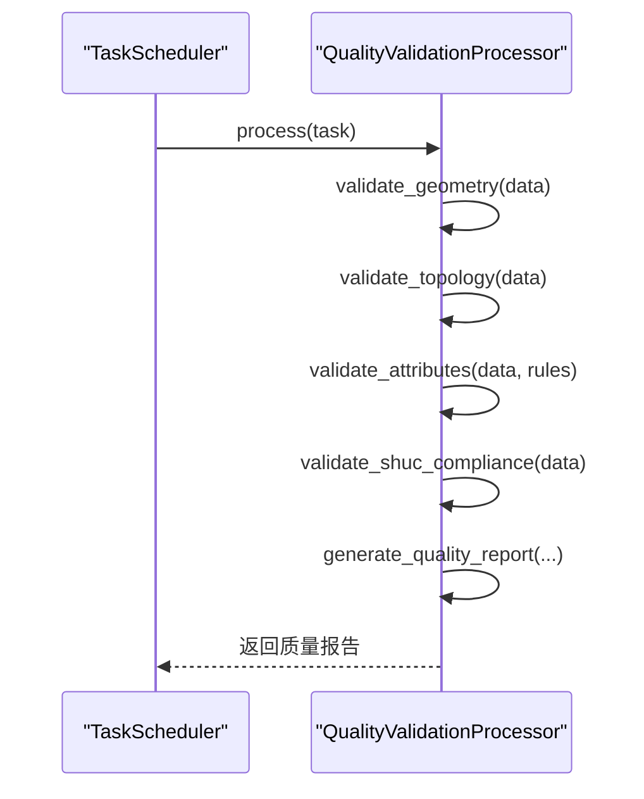
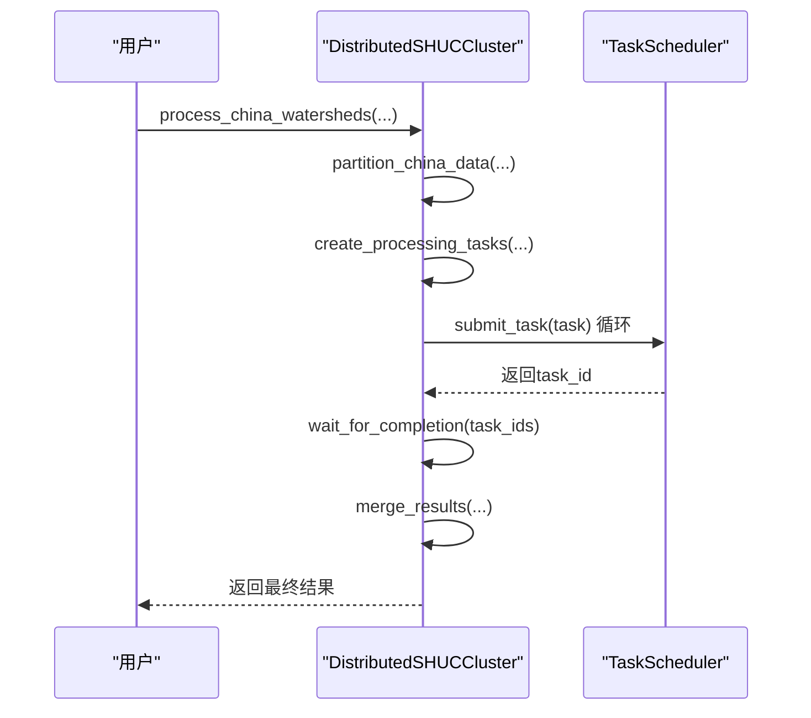
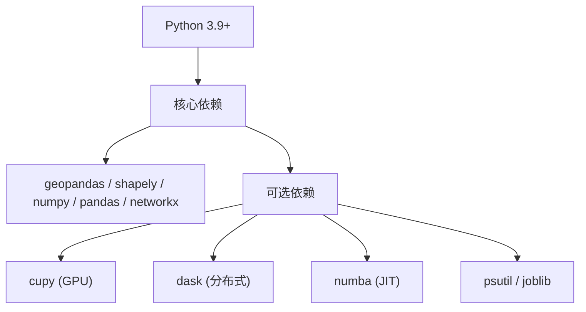

# 异步任务执行

<cite>
**本文引用的文件**
- [shuc_system.py](file://01_CORE_SYSTEM/src/shuc_system.py)
- [watershed_processor.py](file://01_CORE_SYSTEM/src/watershed_processor.py)
- [hierarchy_encoder.py](file://01_CORE_SYSTEM/src/hierarchy_encoder.py)
- [quality_validator.py](file://01_CORE_SYSTEM/src/quality_validator.py)
- [utils.py](file://01_CORE_SYSTEM/src/utils.py)
- [shuc_config.json](file://01_CORE_SYSTEM/config/shuc_config.json)
- [basic_usage.py](file://01_CORE_SYSTEM/examples/basic_usage.py)
- [batch_processing.py](file://01_CORE_SYSTEM/examples/batch_processing.py)
- [distributed_shuc_framework.py](file://03_EXTENSIONS/distributed_shuc_framework.py)
- [shuc_system_optimized.py](file://03_EXTENSIONS/shuc_system_optimized.py)
- [requirements.txt](file://01_CORE_SYSTEM/requirements.txt)
- [README.md](file://README.md)
</cite>

## 目录
1. [简介](#简介)
2. [项目结构](#项目结构)
3. [核心组件](#核心组件)
4. [架构总览](#架构总览)
5. [详细组件分析](#详细组件分析)
6. [依赖分析](#依赖分析)
7. [性能考虑](#性能考虑)
8. [故障排查指南](#故障排查指南)
9. [结论](#结论)
10. [附录](#附录)

## 简介
本文件面向“异步任务执行”主题，聚焦于分布式扩展模块中的异步任务执行模型，系统性阐述以下内容：
- ProcessingTask任务的异步执行机制：生命周期、并发控制、错误处理
- 四类处理器实现：DEMPreprocessor、WatershedDelineationProcessor、BoundaryMergeProcessor、QualityValidationProcessor
- GPU加速与CPU并行的切换机制：硬件检测、资源分配、性能优化
- 完整API参考：任务提交、执行流程、结果返回、状态查询
- 异步编程最佳实践、性能监控与调试技巧
- 实际应用场景与性能对比分析

## 项目结构
围绕异步任务执行，核心文件与职责如下：
- 分布式框架：ProcessingTask、TaskScheduler、各处理器类、集群管理器
- 核心系统：主流程、处理器、编码器、验证器、工具函数与配置
- 示例与扩展：批处理示例、优化版系统、依赖清单

图表来源
- [distributed_shuc_framework.py:55-208](file://03_EXTENSIONS/distributed_shuc_framework.py#L55-L208)
- [shuc_system.py:43-91](file://01_CORE_SYSTEM/src/shuc_system.py#L43-L91)
- [watershed_processor.py:24-53](file://01_CORE_SYSTEM/src/watershed_processor.py#L24-L53)
- [hierarchy_encoder.py:22-68](file://01_CORE_SYSTEM/src/hierarchy_encoder.py#L22-L68)
- [quality_validator.py:24-60](file://01_CORE_SYSTEM/src/quality_validator.py#L24-L60)
- [utils.py:24-100](file://01_CORE_SYSTEM/src/utils.py#L24-L100)
- [shuc_config.json:1-43](file://01_CORE_SYSTEM/config/shuc_config.json#L1-L43)

章节来源
- [README.md:19-30](file://README.md#L19-L30)
- [distributed_shuc_framework.py:55-208](file://03_EXTENSIONS/distributed_shuc_framework.py#L55-L208)
- [shuc_system.py:43-91](file://01_CORE_SYSTEM/src/shuc_system.py#L43-L91)

## 核心组件
- ProcessingTask：封装任务标识、类型、输入、参数、优先级、依赖、内存/GPU需求等
- TaskScheduler：异步队列调度、节点选择、任务分发与执行、完成/失败登记
- 处理器族：四类处理器分别对应不同阶段的数据处理与验证
- 集群管理器：节点配置、任务分区、结果合并、状态查询

章节来源
- [distributed_shuc_framework.py:55-208](file://03_EXTENSIONS/distributed_shuc_framework.py#L55-L208)
- [distributed_shuc_framework.py:209-549](file://03_EXTENSIONS/distributed_shuc_framework.py#L209-L549)
- [distributed_shuc_framework.py:550-734](file://03_EXTENSIONS/distributed_shuc_framework.py#L550-L734)

## 架构总览
异步执行链路从任务提交到完成，涉及队列、节点选择、执行、结果登记与状态查询。

图表来源
- [distributed_shuc_framework.py:98-198](file://03_EXTENSIONS/distributed_shuc_framework.py#L98-L198)

章节来源
- [distributed_shuc_framework.py:81-198](file://03_EXTENSIONS/distributed_shuc_framework.py#L81-L198)

## 详细组件分析

### ProcessingTask 任务定义与生命周期
- 任务标识与类型：task_id、task_type（如 dem_preprocess、watershed_delineation、boundary_merge、quality_validation）
- 输入与参数：input_data、parameters
- 资源与能力：priority、dependencies、estimated_time、memory_requirement、gpu_required
- 生命周期：提交 -> 调度 -> 分发 -> 执行 -> 完成/失败登记 -> 状态查询

图表来源
- [distributed_shuc_framework.py:92-198](file://03_EXTENSIONS/distributed_shuc_framework.py#L92-L198)

章节来源
- [distributed_shuc_framework.py:55-67](file://03_EXTENSIONS/distributed_shuc_framework.py#L55-L67)

### TaskScheduler 调度与并发控制
- 队列与循环：基于 asyncio.Queue 的异步队列；超时等待与周期性状态更新
- 节点选择：优先GPU节点（若任务声明gpu_required），按负载、任务数、内存余量综合打分
- 并发控制：节点current_tasks上限由cpu_cores决定；任务完成后释放
- 错误处理：捕获异常并登记失败，不影响调度循环

图表来源
- [distributed_shuc_framework.py:81-148](file://03_EXTENSIONS/distributed_shuc_framework.py#L81-L148)

章节来源
- [distributed_shuc_framework.py:81-198](file://03_EXTENSIONS/distributed_shuc_framework.py#L81-L198)

### DEMPreprocessor（DEM预处理）
- 质量检查：文件统计、无数据比例、高程范围等
- 坐标统一与缓冲：坐标系统一、边界缓冲
- 无缝拼接：多DEM无缝镶嵌
- 水文条件化：基于TauDEM的水文处理（注释说明）

图表来源
- [distributed_shuc_framework.py:215-245](file://03_EXTENSIONS/distributed_shuc_framework.py#L215-L245)

章节来源
- [distributed_shuc_framework.py:209-317](file://03_EXTENSIONS/distributed_shuc_framework.py#L209-L317)

### WatershedDelineationProcessor（流域边界提取）
- GPU/CPU自动切换：依据task.gpu_required与GPU可用性
- GPU路径：使用CuPy（若可用）进行加速
- CPU路径：多进程/线程并行（注释说明）

图表来源
- [distributed_shuc_framework.py:325-379](file://03_EXTENSIONS/distributed_shuc_framework.py#L325-L379)

章节来源
- [distributed_shuc_framework.py:318-379](file://03_EXTENSIONS/distributed_shuc_framework.py#L318-L379)

### BoundaryMergeProcessor（边界合并）
- 冲突检测：空隙、重叠、拓扑错误
- 冲突解决：插值、优先级合并、拓扑修正
- 无缝合并：生成最终边界

图表来源
- [distributed_shuc_framework.py:387-411](file://03_EXTENSIONS/distributed_shuc_framework.py#L387-L411)

章节来源
- [distributed_shuc_framework.py:381-462](file://03_EXTENSIONS/distributed_shuc_framework.py#L381-L462)

### QualityValidationProcessor（质量验证）
- 几何、拓扑、属性、SHUC标准四项验证
- 生成综合评分与质量等级

图表来源
- [distributed_shuc_framework.py:469-499](file://03_EXTENSIONS/distributed_shuc_framework.py#L469-L499)

章节来源
- [distributed_shuc_framework.py:463-541](file://03_EXTENSIONS/distributed_shuc_framework.py#L463-L541)

### 集群管理器 DistributedSHUCCluster
- 本地/远程节点配置加载
- 数据分区（示例：按流域分区）
- 任务创建与提交、等待完成、结果合并
- 集群状态查询

图表来源
- [distributed_shuc_framework.py:611-723](file://03_EXTENSIONS/distributed_shuc_framework.py#L611-L723)

章节来源
- [distributed_shuc_framework.py:550-734](file://03_EXTENSIONS/distributed_shuc_framework.py#L550-L734)

## 依赖分析
- Python版本与依赖：建议Python 3.9+，核心依赖GeoPandas、Shapely、NetworkX、NumPy、Pandas等
- 可选依赖：CuPy（GPU）、Dask（分布式）、Numba（JIT）、psutil（资源监控）、joblib（并行）
- 依赖安装：requirements.txt

图表来源
- [requirements.txt:4-46](file://01_CORE_SYSTEM/requirements.txt#L4-L46)

章节来源
- [requirements.txt:1-46](file://01_CORE_SYSTEM/requirements.txt#L1-L46)

## 性能考虑
- GPU加速与CPU并行切换
  - 硬件检测：尝试导入CuPy，不可用则回退CPU
  - 任务声明：通过task.gpu_required驱动调度器选择GPU节点
  - 性能差异：GPU路径通常显著缩短大规模水文处理时间
- 资源分配
  - 节点选择：综合负载、任务数、内存余量
  - 任务内存：memory_requirement用于节点筛选
- 并发控制
  - 节点并发上限：current_tasks ≤ cpu_cores
  - 任务队列：异步队列避免阻塞
- 监控与日志
  - 进度与日志：处理器内部日志记录处理阶段
  - 系统资源：psutil用于内存/CPU使用情况统计

章节来源
- [distributed_shuc_framework.py:38-54](file://03_EXTENSIONS/distributed_shuc_framework.py#L38-L54)
- [distributed_shuc_framework.py:124-147](file://03_EXTENSIONS/distributed_shuc_framework.py#L124-L147)
- [distributed_shuc_framework.py:335-379](file://03_EXTENSIONS/distributed_shuc_framework.py#L335-L379)
- [distributed_shuc_framework.py:310-316](file://03_EXTENSIONS/distributed_shuc_framework.py#L310-L316)

## 故障排查指南
- 任务失败
  - 检查TaskScheduler.failed_tasks，定位失败任务与错误信息
  - 确认节点资源是否满足memory_requirement与GPU需求
- GPU不可用
  - 若未安装CuPy，系统会自动回退CPU；可通过task.gpu_required显式声明
- 调度停滞
  - 检查队列是否为空、节点是否全部繁忙、是否存在依赖未满足
- 结果缺失
  - 确认completed_tasks中是否包含目标task_id，必要时检查处理器返回结构

章节来源
- [distributed_shuc_framework.py:88-198](file://03_EXTENSIONS/distributed_shuc_framework.py#L88-L198)

## 结论
该异步任务执行模型通过清晰的任务定义、智能的节点选择与并发控制、以及可选的GPU加速，为大规模流域处理提供了可扩展、可观测、可恢复的执行框架。结合核心系统的主流程与验证器，可在保证质量的同时高效完成从DEM预处理到边界合并与质量验证的全流程。

## 附录

### API参考（分布式扩展）
- 任务提交
  - 方法：TaskScheduler.submit_task(task)
  - 返回：task_id
- 任务查询
  - 已完成：TaskScheduler.completed_tasks
  - 已失败：TaskScheduler.failed_tasks
  - 队列长度：TaskScheduler.task_queue.qsize()
- 节点状态
  - DistributedSHUCCluster.get_cluster_status()

章节来源
- [distributed_shuc_framework.py:92-198](file://03_EXTENSIONS/distributed_shuc_framework.py#L92-L198)
- [distributed_shuc_framework.py:724-733](file://03_EXTENSIONS/distributed_shuc_framework.py#L724-L733)

### 实际应用场景与性能对比
- 场景：全中国尺度流域处理（示例：按流域分区）
- 流程：预处理 -> 流域提取（GPU/CPU可选）-> 边界合并 -> 质量验证
- 性能对比要点（概念性说明）
  - GPU路径：适合大规模栅格计算（如水文算法），吞吐量高、延迟低
  - CPU路径：适合中小规模或无GPU环境，稳定性好
  - 并发：多节点并行可显著缩短总处理时间
- 可视化与报告
  - 批处理示例支持多配置对比、统计报表导出

章节来源
- [distributed_shuc_framework.py:611-723](file://03_EXTENSIONS/distributed_shuc_framework.py#L611-L723)
- [batch_processing.py:48-104](file://01_CORE_SYSTEM/examples/batch_processing.py#L48-L104)