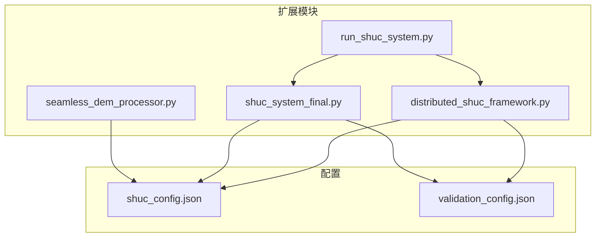
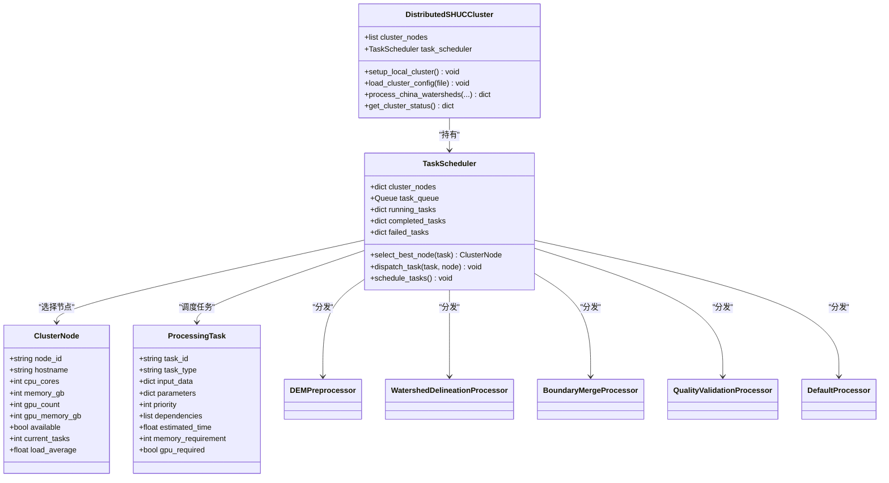
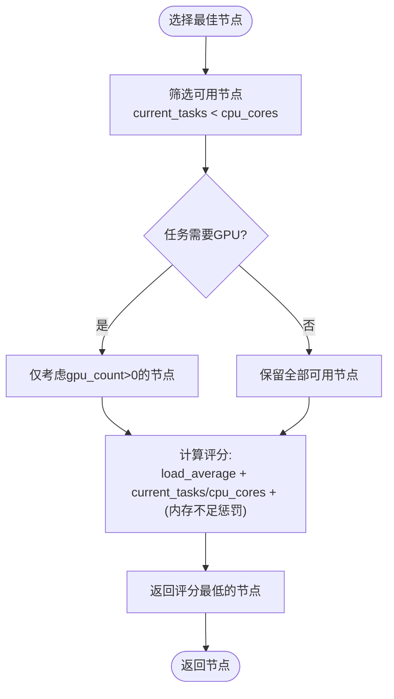
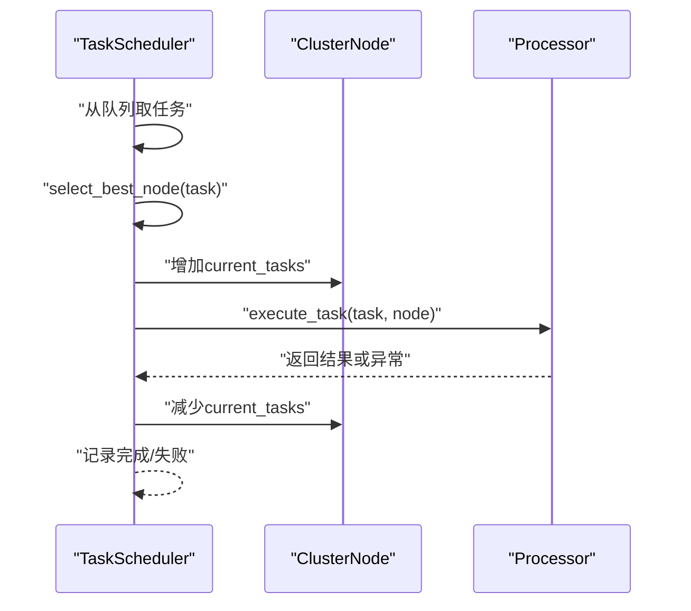
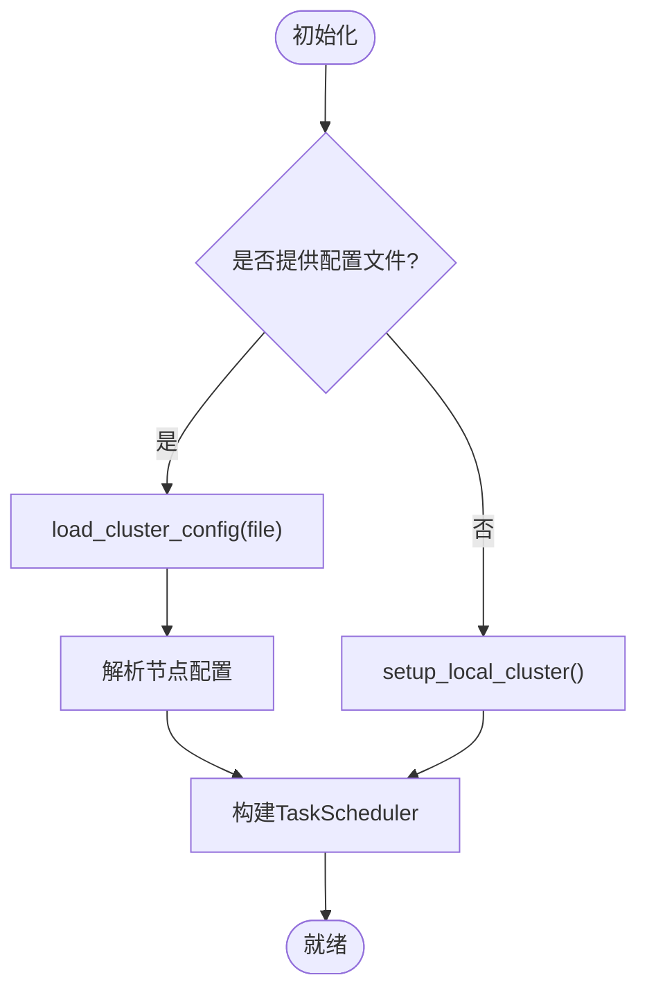
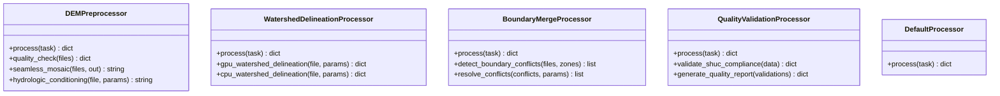
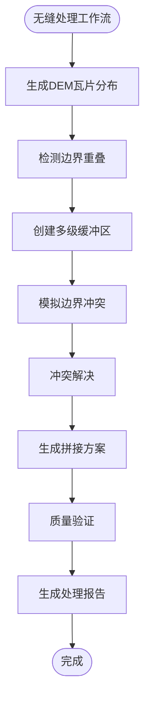
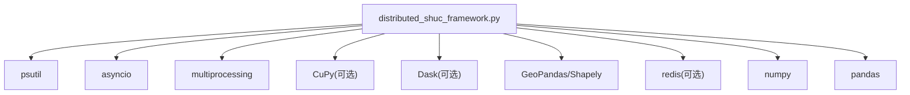

# 集群节点管理

<cite>
**本文引用的文件列表**
- [README.md](file://README.md)
- [distributed_shuc_framework.py](file://03_EXTENSIONS/distributed_shuc_framework.py)
- [shuc_system_final.py](file://03_EXTENSIONS/shuc_system_final.py)
- [run_shuc_system.py](file://03_EXTENSIONS/run_shuc_system.py)
- [shuc_config.json](file://01_CORE_SYSTEM/config/shuc_config.json)
- [validation_config.json](file://01_CORE_SYSTEM/config/validation_config.json)
- [seamless_dem_processor.py](file://03_EXTENSIONS/seamless_dem_processor.py)
- [IMPLEMENTATION_GUIDE.md](file://02_DOCUMENTATION/IMPLEMENTATION_GUIDE.md)
</cite>

## 目录
1. [引言](#引言)
2. [项目结构](#项目结构)
3. [核心组件](#核心组件)
4. [架构总览](#架构总览)
5. [详细组件分析](#详细组件分析)
6. [依赖关系分析](#依赖关系分析)
7. [性能考量](#性能考量)
8. [故障排查指南](#故障排查指南)
9. [结论](#结论)
10. [附录](#附录)

## 引言
本技术文档围绕“集群节点管理系统”展开，聚焦于分布式SHUC处理框架中的节点信息结构、健康检查与负载均衡、配置管理与外部配置加载、以及面向大规模流域数据处理的API参考与运维策略。系统以数据类与异步调度为核心，结合GPU加速与多级缓冲区无缝拼接能力，支撑从140个流域扩展到全国百万流域的处理挑战。

## 项目结构
- 核心扩展模块位于 03_EXTENSIONS，包含分布式框架、最终版SHUC系统、无缝DEM处理器与一键运行脚本。
- 配置文件位于 01_CORE_SYSTEM/config，涵盖处理策略、层次结构、验证规则与性能参数。
- 文档位于 02_DOCUMENTATION，包含实施指南与实现细节。

**图表来源**
- [distributed_shuc_framework.py:55-120](file://03_EXTENSIONS/distributed_shuc_framework.py#L55-L120)
- [shuc_system_final.py:31-105](file://03_EXTENSIONS/shuc_system_final.py#L31-L105)
- [run_shuc_system.py:16-42](file://03_EXTENSIONS/run_shuc_system.py#L16-L42)
- [shuc_config.json:1-43](file://01_CORE_SYSTEM/config/shuc_config.json#L1-L43)
- [validation_config.json:1-46](file://01_CORE_SYSTEM/config/validation_config.json#L1-L46)

**章节来源**
- [README.md:19-30](file://README.md#L19-L30)
- [distributed_shuc_framework.py:55-120](file://03_EXTENSIONS/distributed_shuc_framework.py#L55-L120)
- [shuc_system_final.py:31-105](file://03_EXTENSIONS/shuc_system_final.py#L31-L105)
- [run_shuc_system.py:16-42](file://03_EXTENSIONS/run_shuc_system.py#L16-L42)
- [shuc_config.json:1-43](file://01_CORE_SYSTEM/config/shuc_config.json#L1-L43)
- [validation_config.json:1-46](file://01_CORE_SYSTEM/config/validation_config.json#L1-L46)

## 核心组件
- 集群节点信息结构：包含节点标识、主机名、CPU核心数、内存容量、GPU数量与显存、可用性、当前任务数、负载平均值等关键属性，用于任务调度与资源匹配。
- 任务调度器：基于异步队列与负载均衡策略，选择最佳节点执行任务，并维护运行、完成与失败任务集合。
- 处理器族：针对DEM预处理、流域边界提取、边界合并、质量验证等任务类型提供专用处理器。
- 集群管理器：负责本地集群初始化、外部配置加载、任务编排与状态查询。
- 一键运行脚本：封装环境检查、数据准备与系统运行流程，便于快速部署。

**章节来源**
- [distributed_shuc_framework.py:55-120](file://03_EXTENSIONS/distributed_shuc_framework.py#L55-L120)
- [distributed_shuc_framework.py:124-147](file://03_EXTENSIONS/distributed_shuc_framework.py#L124-L147)
- [distributed_shuc_framework.py:550-610](file://03_EXTENSIONS/distributed_shuc_framework.py#L550-L610)
- [run_shuc_system.py:167-211](file://03_EXTENSIONS/run_shuc_system.py#L167-L211)

## 架构总览
系统采用“节点-任务-处理器”的三层架构：
- 节点层：ClusterNode抽象物理或虚拟计算资源，承载任务执行。
- 任务层：ProcessingTask定义任务类型、输入、参数、依赖与资源需求。
- 调度层：TaskScheduler根据节点负载与资源匹配选择最佳节点；处理器按任务类型执行具体算法。

**图表来源**
- [distributed_shuc_framework.py:55-120](file://03_EXTENSIONS/distributed_shuc_framework.py#L55-L120)
- [distributed_shuc_framework.py:199-208](file://03_EXTENSIONS/distributed_shuc_framework.py#L199-L208)
- [distributed_shuc_framework.py:550-610](file://03_EXTENSIONS/distributed_shuc_framework.py#L550-L610)

## 详细组件分析

### 集群节点信息结构设计
- 设计要点
  - 资源维度：CPU核心数、内存容量、GPU数量与显存，用于任务资源匹配与容量规划。
  - 运行状态：可用性、当前任务数、负载平均值，用于健康检查与负载均衡。
  - 可扩展性：支持本地自动配置与外部配置文件加载，适配多节点部署场景。
- 负载与资源匹配
  - 选择策略综合考虑：节点负载平均值、当前任务数与CPU核心比、内存需求满足度，优先选择资源富余且负载较低的节点。
  - GPU任务优先分配到具备GPU的节点，提升吞吐与性能。

**图表来源**
- [distributed_shuc_framework.py:124-147](file://03_EXTENSIONS/distributed_shuc_framework.py#L124-L147)

**章节来源**
- [distributed_shuc_framework.py:69-80](file://03_EXTENSIONS/distributed_shuc_framework.py#L69-L80)
- [distributed_shuc_framework.py:124-147](file://03_EXTENSIONS/distributed_shuc_framework.py#L124-L147)

### 健康检查与负载均衡
- 健康检查机制
  - 节点可用性：通过标志位与任务并发上限（current_tasks < cpu_cores）进行粗粒度可用性判定。
  - 负载平均值：load_average作为节点负载指标参与评分，避免过度拥塞节点被选中。
- 调度策略
  - 优先选择资源富余且负载较低的节点；GPU任务优先GPU节点。
  - 超时回退：调度器定期检查集群状态，保证系统自检与自愈能力。

**图表来源**
- [distributed_shuc_framework.py:98-123](file://03_EXTENSIONS/distributed_shuc_framework.py#L98-L123)
- [distributed_shuc_framework.py:163-198](file://03_EXTENSIONS/distributed_shuc_framework.py#L163-L198)

**章节来源**
- [distributed_shuc_framework.py:98-123](file://03_EXTENSIONS/distributed_shuc_framework.py#L98-L123)
- [distributed_shuc_framework.py:163-198](file://03_EXTENSIONS/distributed_shuc_framework.py#L163-L198)

### 配置管理与外部配置加载
- 本地集群自动配置
  - 自动探测CPU核心数与内存总量，按需启用GPU节点（若CuPy可用），并初始化本地节点。
- 外部配置文件加载
  - 支持从JSON配置文件加载节点列表，若加载失败则回退到本地集群。
- 配置项与用途
  - 处理策略：目标合规率、合并策略、最大迭代次数、动态阈值模式等。
  - 层级结构：各级别最小面积阈值与配额控制。
  - 验证规则：面积合规阈值、编码唯一性、拓扑完整性、几何有效性等。
  - 输出与性能：中间结果保存、详细日志、并行处理开关、最大内存使用等。

**图表来源**
- [distributed_shuc_framework.py:553-610](file://03_EXTENSIONS/distributed_shuc_framework.py#L553-L610)

**章节来源**
- [distributed_shuc_framework.py:553-610](file://03_EXTENSIONS/distributed_shuc_framework.py#L553-L610)
- [shuc_config.json:1-43](file://01_CORE_SYSTEM/config/shuc_config.json#L1-L43)
- [validation_config.json:1-46](file://01_CORE_SYSTEM/config/validation_config.json#L1-L46)

### 处理器族与任务类型
- DEM预处理：质量检查、坐标统一、缓冲区处理、无缝拼接、水文条件化。
- 流域边界提取：支持GPU加速与CPU并行两种路径，依据任务需求自动切换。
- 边界合并：冲突检测与解决、无缝合并。
- 质量验证：几何、拓扑、属性与SHUC标准合规性验证，生成质量报告。
- 默认处理器：兜底处理逻辑。

**图表来源**
- [distributed_shuc_framework.py:209-317](file://03_EXTENSIONS/distributed_shuc_framework.py#L209-L317)
- [distributed_shuc_framework.py:318-380](file://03_EXTENSIONS/distributed_shuc_framework.py#L318-L380)
- [distributed_shuc_framework.py:381-462](file://03_EXTENSIONS/distributed_shuc_framework.py#L381-L462)
- [distributed_shuc_framework.py:463-549](file://03_EXTENSIONS/distributed_shuc_framework.py#L463-L549)

**章节来源**
- [distributed_shuc_framework.py:209-317](file://03_EXTENSIONS/distributed_shuc_framework.py#L209-L317)
- [distributed_shuc_framework.py:318-380](file://03_EXTENSIONS/distributed_shuc_framework.py#L318-L380)
- [distributed_shuc_framework.py:381-462](file://03_EXTENSIONS/distributed_shuc_framework.py#L381-L462)
- [distributed_shuc_framework.py:463-549](file://03_EXTENSIONS/distributed_shuc_framework.py#L463-L549)

### 无缝DEM处理与缓冲区系统
- 缓冲区设计：处理缓冲区、分析缓冲区、过渡缓冲区、质量缓冲区，分别用于数据预处理、冲突分析、过渡处理与质量验证。
- 冲突检测与解决：基于风险等级与地理重要性确定优先级，采用多种算法（高程平滑、坐标转换、分辨率统一、数据填补、权重融合）解决边界冲突。
- 拼接方案与质量验证：生成拼接顺序、融合策略与质量控制计划，输出处理报告与建议。

**图表来源**
- [seamless_dem_processor.py:368-412](file://03_EXTENSIONS/seamless_dem_processor.py#L368-L412)

**章节来源**
- [seamless_dem_processor.py:42-76](file://03_EXTENSIONS/seamless_dem_processor.py#L42-L76)
- [seamless_dem_processor.py:139-192](file://03_EXTENSIONS/seamless_dem_processor.py#L139-L192)
- [seamless_dem_processor.py:247-282](file://03_EXTENSIONS/seamless_dem_processor.py#L247-L282)
- [seamless_dem_processor.py:294-342](file://03_EXTENSIONS/seamless_dem_processor.py#L294-L342)
- [seamless_dem_processor.py:368-412](file://03_EXTENSIONS/seamless_dem_processor.py#L368-L412)

### 一键运行与系统集成
- 环境检查：验证所需包是否存在，提示缺失依赖。
- 数据准备：查找输入数据文件，必要时复制到本地data目录。
- 系统运行：创建FinalSHUCSystem实例并执行完整流程，输出结果与报告。
- 结果展示：汇总压缩率、合规率、编码唯一性与系统评分，并指引后续查看输出文件。

**章节来源**
- [run_shuc_system.py:20-42](file://03_EXTENSIONS/run_shuc_system.py#L20-L42)
- [run_shuc_system.py:43-103](file://03_EXTENSIONS/run_shuc_system.py#L43-L103)
- [run_shuc_system.py:167-211](file://03_EXTENSIONS/run_shuc_system.py#L167-L211)
- [shuc_system_final.py:732-766](file://03_EXTENSIONS/shuc_system_final.py#L732-L766)

## 依赖关系分析
- 外部依赖
  - 异步与并发：asyncio、concurrent.futures、multiprocessing。
  - GPU支持：CuPy（可选）、Dask（可选）。
  - 空间数据：GeoPandas、Shapely、Rasterio。
  - 网络与系统：psutil、redis（可选）。
- 内部耦合
  - TaskScheduler与ClusterNode强耦合，通过节点属性进行资源匹配。
  - 处理器族与TaskScheduler弱耦合，通过任务类型映射选择处理器。
  - 集群管理器与调度器组合，负责生命周期管理与状态查询。

**图表来源**
- [distributed_shuc_framework.py:21-54](file://03_EXTENSIONS/distributed_shuc_framework.py#L21-L54)

**章节来源**
- [distributed_shuc_framework.py:21-54](file://03_EXTENSIONS/distributed_shuc_framework.py#L21-L54)

## 性能考量
- 资源匹配与负载均衡
  - 通过负载平均值与任务数/CPU核心比进行评分，避免热点节点。
  - GPU任务优先GPU节点，提高吞吐与能耗效率。
- 并行与异步
  - 异步队列与并发执行提升任务调度效率；进程池与线程池用于CPU密集型与I/O密集型任务分离。
- 缓冲区与拼接策略
  - 50km处理缓冲区降低边界伪影影响；羽化融合与直方图匹配提升拼接质量。
- 配置优化
  - 合理设置最大内存使用、启用并行处理、动态阈值模式与早停策略，平衡质量与性能。

[本节为通用性能建议，无需特定文件引用]

## 故障排查指南
- 调度器错误
  - 现象：调度循环报错或超时。
  - 排查：检查节点可用性、任务资源需求与内存阈值；确认GPU可用性与Dask可用性。
- 处理器异常
  - 现象：任务执行失败并记录失败任务。
  - 排查：查看处理器日志与异常堆栈；确认输入数据格式与参数配置。
- 配置加载失败
  - 现象：外部配置加载失败回退到本地集群。
  - 排查：检查配置文件格式与字段完整性；确认节点列表与资源字段正确。
- 环境依赖缺失
  - 现象：一键运行脚本提示缺少依赖包。
  - 排查：安装缺失包并重新运行环境检查。

**章节来源**
- [distributed_shuc_framework.py:116-122](file://03_EXTENSIONS/distributed_shuc_framework.py#L116-L122)
- [distributed_shuc_framework.py:182-192](file://03_EXTENSIONS/distributed_shuc_framework.py#L182-L192)
- [distributed_shuc_framework.py:592-610](file://03_EXTENSIONS/distributed_shuc_framework.py#L592-L610)
- [run_shuc_system.py:20-42](file://03_EXTENSIONS/run_shuc_system.py#L20-L42)

## 结论
集群节点管理系统以ClusterNode为核心，结合TaskScheduler的智能调度与处理器族的专业化处理，实现了从资源感知、任务分配到执行与验证的完整闭环。通过外部配置加载与本地自动配置，系统既支持单机快速部署，也支持多节点弹性扩展。配合无缝DEM处理与质量验证流程，系统能够高效稳定地支撑大规模流域数据处理任务。

[本节为总结性内容，无需特定文件引用]

## 附录

### API参考（基于现有实现的调用路径）
- 集群管理
  - 初始化本地集群：[setup_local_cluster:576-590](file://03_EXTENSIONS/distributed_shuc_framework.py#L576-L590)
  - 加载外部配置：[load_cluster_config:592-610](file://03_EXTENSIONS/distributed_shuc_framework.py#L592-L610)
  - 获取集群状态：[get_cluster_status:724-733](file://03_EXTENSIONS/distributed_shuc_framework.py#L724-L733)
- 任务提交与调度
  - 提交任务：[submit_task:92-96](file://03_EXTENSIONS/distributed_shuc_framework.py#L92-L96)
  - 调度主循环：[schedule_tasks:98-123](file://03_EXTENSIONS/distributed_shuc_framework.py#L98-L123)
  - 选择最佳节点：[select_best_node:124-147](file://03_EXTENSIONS/distributed_shuc_framework.py#L124-L147)
  - 分发任务：[dispatch_task:149-162](file://03_EXTENSIONS/distributed_shuc_framework.py#L149-L162)
- 处理器接口
  - DEM预处理：[DEMPreprocessor.process:215-245](file://03_EXTENSIONS/distributed_shuc_framework.py#L215-L245)
  - 流域边界提取：[WatershedDelineationProcessor.process:325-340](file://03_EXTENSIONS/distributed_shuc_framework.py#L325-L340)
  - 边界合并：[BoundaryMergeProcessor.process:387-411](file://03_EXTENSIONS/distributed_shuc_framework.py#L387-L411)
  - 质量验证：[QualityValidationProcessor.process:469-499](file://03_EXTENSIONS/distributed_shuc_framework.py#L469-L499)
- 一键运行
  - 环境检查：[setup_environment:20-42](file://03_EXTENSIONS/run_shuc_system.py#L20-L42)
  - 数据准备：[copy_data_to_local:67-103](file://03_EXTENSIONS/run_shuc_system.py#L67-L103)
  - 运行系统：[FinalSHUCSystem.run_complete_system:732-766](file://03_EXTENSIONS/shuc_system_final.py#L732-L766)

**章节来源**
- [distributed_shuc_framework.py:576-590](file://03_EXTENSIONS/distributed_shuc_framework.py#L576-L590)
- [distributed_shuc_framework.py:592-610](file://03_EXTENSIONS/distributed_shuc_framework.py#L592-L610)
- [distributed_shuc_framework.py:724-733](file://03_EXTENSIONS/distributed_shuc_framework.py#L724-L733)
- [distributed_shuc_framework.py:92-96](file://03_EXTENSIONS/distributed_shuc_framework.py#L92-L96)
- [distributed_shuc_framework.py:98-123](file://03_EXTENSIONS/distributed_shuc_framework.py#L98-L123)
- [distributed_shuc_framework.py:124-147](file://03_EXTENSIONS/distributed_shuc_framework.py#L124-L147)
- [distributed_shuc_framework.py:149-162](file://03_EXTENSIONS/distributed_shuc_framework.py#L149-L162)
- [distributed_shuc_framework.py:215-245](file://03_EXTENSIONS/distributed_shuc_framework.py#L215-L245)
- [distributed_shuc_framework.py:325-340](file://03_EXTENSIONS/distributed_shuc_framework.py#L325-L340)
- [distributed_shuc_framework.py:387-411](file://03_EXTENSIONS/distributed_shuc_framework.py#L387-L411)
- [distributed_shuc_framework.py:469-499](file://03_EXTENSIONS/distributed_shuc_framework.py#L469-L499)
- [run_shuc_system.py:20-42](file://03_EXTENSIONS/run_shuc_system.py#L20-L42)
- [run_shuc_system.py:67-103](file://03_EXTENSIONS/run_shuc_system.py#L67-L103)
- [shuc_system_final.py:732-766](file://03_EXTENSIONS/shuc_system_final.py#L732-L766)

### 集群部署示例与最佳实践
- 部署示例
  - 单机快速启动：使用一键运行脚本，自动检查环境与数据，执行完整流程。
  - 多节点集群：准备外部配置文件，包含多个节点的资源信息，由集群管理器加载并初始化。
- 最佳实践
  - 合理设置GPU任务比例与内存阈值，避免节点过载。
  - 在高并发场景启用异步与进程池，区分CPU与I/O密集型任务。
  - 使用缓冲区系统与质量验证流程，确保拼接与处理结果的稳定性与一致性。

**章节来源**
- [run_shuc_system.py:167-211](file://03_EXTENSIONS/run_shuc_system.py#L167-L211)
- [distributed_shuc_framework.py:592-610](file://03_EXTENSIONS/distributed_shuc_framework.py#L592-L610)
- [seamless_dem_processor.py:247-282](file://03_EXTENSIONS/seamless_dem_processor.py#L247-L282)
- [seamless_dem_processor.py:652-697](file://03_EXTENSIONS/seamless_dem_processor.py#L652-L697)