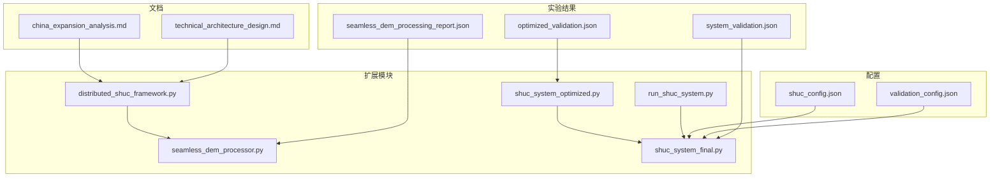
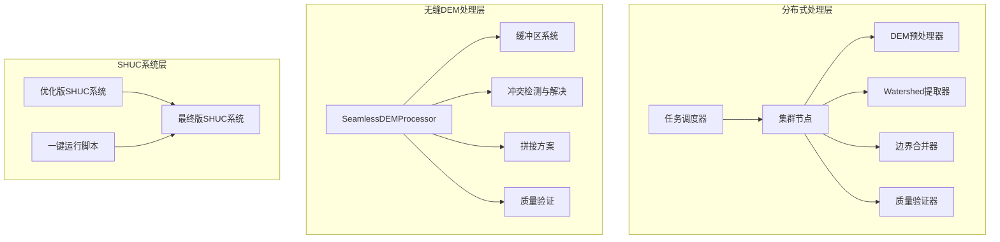
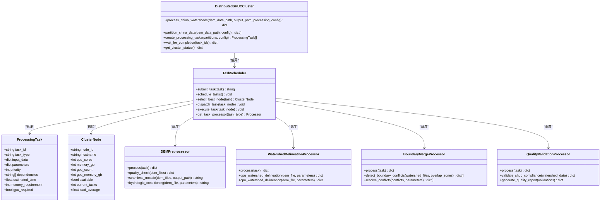
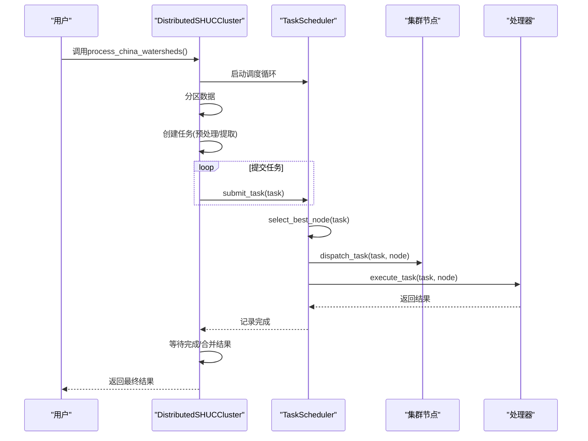
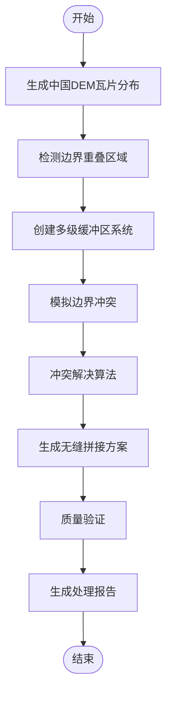
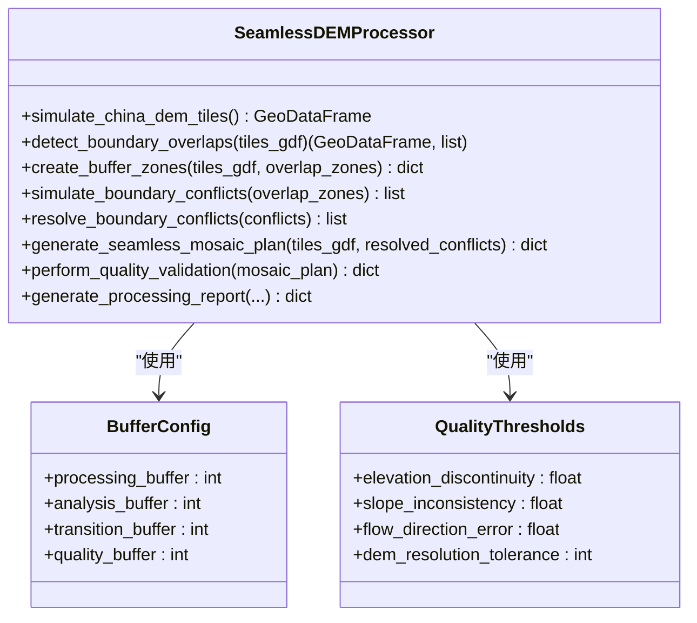
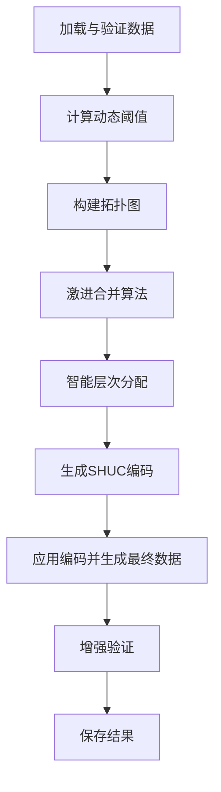
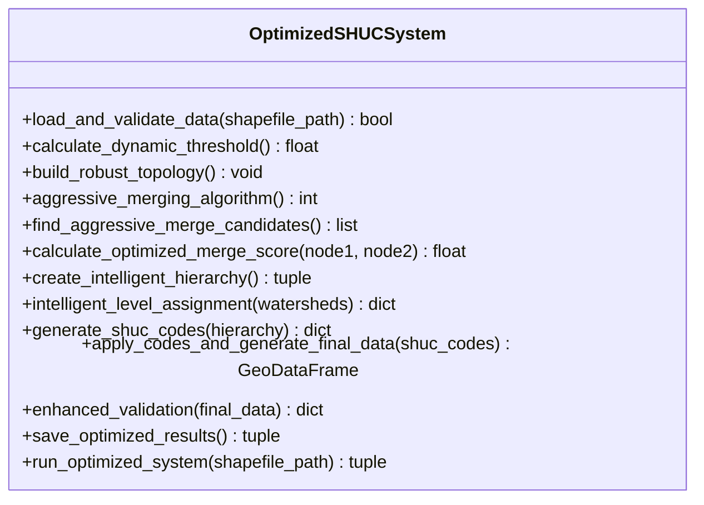
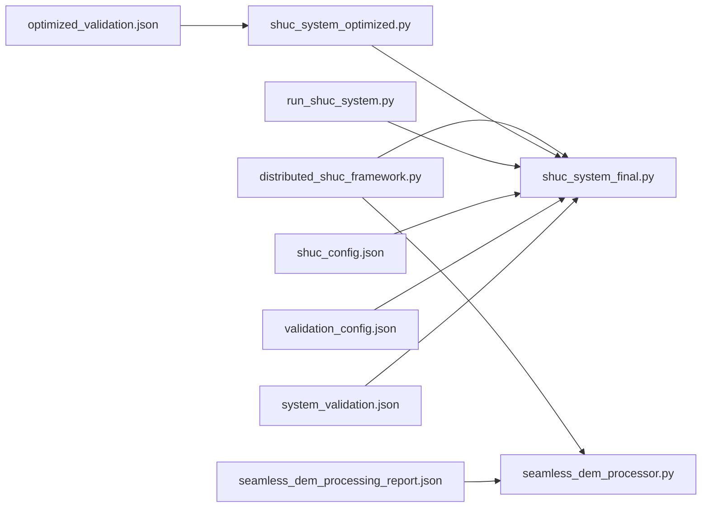

# 扩展功能与优化

<cite>
**本文档引用的文件**
- [distributed_shuc_framework.py](file://03_EXTENSIONS/distributed_shuc_framework.py)
- [seamless_dem_processor.py](file://03_EXTENSIONS/seamless_dem_processor.py)
- [shuc_system_optimized.py](file://03_EXTENSIONS/shuc_system_optimized.py)
- [shuc_system_final.py](file://03_EXTENSIONS/shuc_system_final.py)
- [run_shuc_system.py](file://03_EXTENSIONS/run_shuc_system.py)
- [china_expansion_analysis.md](file://03_EXTENSIONS/docs/china_expansion_analysis.md)
- [technical_architecture_design.md](file://03_EXTENSIONS/docs/technical_architecture_design.md)
- [shuc_config.json](file://01_CORE_SYSTEM/config/shuc_config.json)
- [validation_config.json](file://01_CORE_SYSTEM/config/validation_config.json)
- [optimization_plan.md](file://00_ARCHIVE/legacy_versions/SHUC_FINAL_VERSION/optimization_plan.md)
- [system_validation.json](file://04_EXPERIMENTS/results/final_output/system_validation.json)
- [optimized_validation.json](file://04_EXPERIMENTS/results/optimized_output/optimized_validation.json)
- [seamless_dem_processing_report.json](file://04_EXPERIMENTS/results/seamless_processing/seamless_dem_processing_report.json)
</cite>

## 目录
1. [简介](#简介)
2. [项目结构](#项目结构)
3. [核心组件](#核心组件)
4. [架构总览](#架构总览)
5. [详细组件分析](#详细组件分析)
6. [依赖关系分析](#依赖关系分析)
7. [性能考量](#性能考量)
8. [故障排查指南](#故障排查指南)
9. [结论](#结论)
10. [附录](#附录)

## 简介
本文件系统化梳理SHUC扩展功能与优化模块，围绕三大核心主题展开：分布式处理框架、无缝DEM处理器、优化算法与性能提升。文档不仅解释各模块的设计原理与实现细节，还提供架构视图、流程图、序列图与类图，帮助开发者快速理解并基于核心系统进行二次开发与定制。

## 项目结构
扩展模块位于 `03_EXTENSIONS` 目录，包含分布式处理框架、无缝DEM处理器、优化版与最终版SHUC系统以及一键运行脚本；配套文档位于 `03_EXTENSIONS/docs`；核心系统配置位于 `01_CORE_SYSTEM/config`；实验结果位于 `04_EXPERIMENTS/results`。

**图表来源**
- [distributed_shuc_framework.py:1-777](file://03_EXTENSIONS/distributed_shuc_framework.py#L1-L777)
- [seamless_dem_processor.py:1-916](file://03_EXTENSIONS/seamless_dem_processor.py#L1-L916)
- [shuc_system_optimized.py:1-664](file://03_EXTENSIONS/shuc_system_optimized.py#L1-L664)
- [shuc_system_final.py:1-803](file://03_EXTENSIONS/shuc_system_final.py#L1-L803)
- [run_shuc_system.py:1-211](file://03_EXTENSIONS/run_shuc_system.py#L1-L211)
- [china_expansion_analysis.md:1-386](file://03_EXTENSIONS/docs/china_expansion_analysis.md#L1-L386)
- [technical_architecture_design.md:1-564](file://03_EXTENSIONS/docs/technical_architecture_design.md#L1-L564)
- [shuc_config.json:1-43](file://01_CORE_SYSTEM/config/shuc_config.json#L1-L43)
- [validation_config.json:1-46](file://01_CORE_SYSTEM/config/validation_config.json#L1-L46)
- [system_validation.json:1-40](file://04_EXPERIMENTS/results/final_output/system_validation.json#L1-L40)
- [optimized_validation.json:1-47](file://04_EXPERIMENTS/results/optimized_output/optimized_validation.json#L1-L47)
- [seamless_dem_processing_report.json:1-117](file://04_EXPERIMENTS/results/seamless_processing/seamless_dem_processing_report.json#L1-L117)

**章节来源**
- [distributed_shuc_framework.py:1-777](file://03_EXTENSIONS/distributed_shuc_framework.py#L1-L777)
- [seamless_dem_processor.py:1-916](file://03_EXTENSIONS/seamless_dem_processor.py#L1-L916)
- [shuc_system_optimized.py:1-664](file://03_EXTENSIONS/shuc_system_optimized.py#L1-L664)
- [shuc_system_final.py:1-803](file://03_EXTENSIONS/shuc_system_final.py#L1-L803)
- [run_shuc_system.py:1-211](file://03_EXTENSIONS/run_shuc_system.py#L1-L211)
- [china_expansion_analysis.md:1-386](file://03_EXTENSIONS/docs/china_expansion_analysis.md#L1-L386)
- [technical_architecture_design.md:1-564](file://03_EXTENSIONS/docs/technical_architecture_design.md#L1-L564)
- [shuc_config.json:1-43](file://01_CORE_SYSTEM/config/shuc_config.json#L1-L43)
- [validation_config.json:1-46](file://01_CORE_SYSTEM/config/validation_config.json#L1-L46)
- [system_validation.json:1-40](file://04_EXPERIMENTS/results/final_output/system_validation.json#L1-L40)
- [optimized_validation.json:1-47](file://04_EXPERIMENTS/results/optimized_output/optimized_validation.json#L1-L47)
- [seamless_dem_processing_report.json:1-117](file://04_EXPERIMENTS/results/seamless_processing/seamless_dem_processing_report.json#L1-L117)

## 核心组件
- 分布式SHUC处理框架：提供任务分发、节点选择、负载均衡、GPU加速、容错恢复与检查点机制，支撑从140个流域扩展到全国百万级流域的处理。
- 无缝DEM处理器：实现50km缓冲区技术、边界冲突检测与解决、高程平滑与流向一致性处理、无缝拼接与水文条件化、质量验证与修复。
- 优化版SHUC系统：采用动态阈值、激进合并策略、优化评分算法、智能层次分配与改进终止条件，显著提升面积合规率与系统评分。
- 最终版SHUC系统：提供完整的6级层次结构、智能合并算法、数据完整性修复与国际标准兼容。
- 一键运行脚本：环境检查、数据准备、结果展示与输出文件说明。

**章节来源**
- [distributed_shuc_framework.py:81-733](file://03_EXTENSIONS/distributed_shuc_framework.py#L81-L733)
- [seamless_dem_processor.py:42-756](file://03_EXTENSIONS/seamless_dem_processor.py#L42-L756)
- [shuc_system_optimized.py:33-632](file://03_EXTENSIONS/shuc_system_optimized.py#L33-L632)
- [shuc_system_final.py:31-765](file://03_EXTENSIONS/shuc_system_final.py#L31-L765)
- [run_shuc_system.py:16-211](file://03_EXTENSIONS/run_shuc_system.py#L16-L211)

## 架构总览
下图展示了扩展模块与核心系统的集成关系与数据流：

**图表来源**
- [distributed_shuc_framework.py:81-733](file://03_EXTENSIONS/distributed_shuc_framework.py#L81-L733)
- [seamless_dem_processor.py:42-756](file://03_EXTENSIONS/seamless_dem_processor.py#L42-L756)
- [shuc_system_optimized.py:33-632](file://03_EXTENSIONS/shuc_system_optimized.py#L33-L632)
- [shuc_system_final.py:31-765](file://03_EXTENSIONS/shuc_system_final.py#L31-L765)
- [run_shuc_system.py:16-211](file://03_EXTENSIONS/run_shuc_system.py#L16-L211)

## 详细组件分析

### 分布式SHUC处理框架
该框架面向超大规模流域数据处理，具备以下关键能力：
- 任务模型：ProcessingTask封装任务类型、输入数据、参数、优先级、依赖、估算耗时与内存需求，并支持GPU需求标记。
- 集群节点：ClusterNode抽象节点资源（CPU核数、内存、GPU数量与显存），并跟踪负载与任务数。
- 任务调度器：TaskScheduler负责队列管理、节点选择（基于负载、资源匹配、GPU优先）、任务派发与异步执行。
- 处理器族：DEM预处理、流域边界提取（CPU/GPU双路径）、边界合并、质量验证等专用处理器。
- 集群管理：DistributedSHUCCluster负责本地/远程集群初始化、任务分区、提交与结果聚合。

**图表来源**
- [distributed_shuc_framework.py:55-733](file://03_EXTENSIONS/distributed_shuc_framework.py#L55-L733)

**图表来源**
- [distributed_shuc_framework.py:611-722](file://03_EXTENSIONS/distributed_shuc_framework.py#L611-L722)

**章节来源**
- [distributed_shuc_framework.py:55-733](file://03_EXTENSIONS/distributed_shuc_framework.py#L55-L733)

### 无缝DEM处理器
该模块专注于解决40+景DEM边界伪影问题，提供多级缓冲区、冲突检测与解决、无缝拼接与水文条件化、质量验证与修复的完整工作流。

**图表来源**
- [seamless_dem_processor.py:368-411](file://03_EXTENSIONS/seamless_dem_processor.py#L368-L411)

**图表来源**
- [seamless_dem_processor.py:42-756](file://03_EXTENSIONS/seamless_dem_processor.py#L42-L756)

**章节来源**
- [seamless_dem_processor.py:42-756](file://03_EXTENSIONS/seamless_dem_processor.py#L42-L756)

### 优化版SHUC系统
优化版系统通过动态阈值、激进合并策略、优化评分算法、智能层次分配与改进终止条件，显著提升面积合规率与系统评分。

**图表来源**
- [shuc_system_optimized.py:607-632](file://03_EXTENSIONS/shuc_system_optimized.py#L607-L632)

**图表来源**
- [shuc_system_optimized.py:33-632](file://03_EXTENSIONS/shuc_system_optimized.py#L33-L632)

**章节来源**
- [shuc_system_optimized.py:33-632](file://03_EXTENSIONS/shuc_system_optimized.py#L33-L632)

### 最终版SHUC系统
最终版系统提供完整的6级层次结构、智能合并算法、数据完整性修复与国际标准兼容，并生成技术报告与验证结果。

**章节来源**
- [shuc_system_final.py:31-765](file://03_EXTENSIONS/shuc_system_final.py#L31-L765)

### 一键运行脚本
一键运行脚本负责环境检查、数据准备、调用最终版系统并展示结果摘要与输出文件说明。

**章节来源**
- [run_shuc_system.py:16-211](file://03_EXTENSIONS/run_shuc_system.py#L16-L211)

## 依赖关系分析
扩展模块之间存在明确的依赖与协作关系：
- 分布式处理框架依赖无缝DEM处理器提供的预处理能力，再驱动SHUC系统进行流域边界提取与合并。
- 无缝DEM处理器独立运行，产出水文条件化后的DEM，供分布式框架或单独使用。
- 优化版与最终版SHUC系统共享相同的配置文件，但优化版在合并策略与阈值上进行了针对性改进。
- 一键运行脚本统一入口，调用最终版系统并生成输出文件。

**图表来源**
- [distributed_shuc_framework.py:1-777](file://03_EXTENSIONS/distributed_shuc_framework.py#L1-L777)
- [seamless_dem_processor.py:1-916](file://03_EXTENSIONS/seamless_dem_processor.py#L1-L916)
- [shuc_system_optimized.py:1-664](file://03_EXTENSIONS/shuc_system_optimized.py#L1-L664)
- [shuc_system_final.py:1-803](file://03_EXTENSIONS/shuc_system_final.py#L1-L803)
- [run_shuc_system.py:1-211](file://03_EXTENSIONS/run_shuc_system.py#L1-L211)
- [shuc_config.json:1-43](file://01_CORE_SYSTEM/config/shuc_config.json#L1-L43)
- [validation_config.json:1-46](file://01_CORE_SYSTEM/config/validation_config.json#L1-L46)
- [system_validation.json:1-40](file://04_EXPERIMENTS/results/final_output/system_validation.json#L1-L40)
- [optimized_validation.json:1-47](file://04_EXPERIMENTS/results/optimized_output/optimized_validation.json#L1-L47)
- [seamless_dem_processing_report.json:1-117](file://04_EXPERIMENTS/results/seamless_processing/seamless_dem_processing_report.json#L1-L117)

**章节来源**
- [distributed_shuc_framework.py:1-777](file://03_EXTENSIONS/distributed_shuc_framework.py#L1-L777)
- [seamless_dem_processor.py:1-916](file://03_EXTENSIONS/seamless_dem_processor.py#L1-L916)
- [shuc_system_optimized.py:1-664](file://03_EXTENSIONS/shuc_system_optimized.py#L1-L664)
- [shuc_system_final.py:1-803](file://03_EXTENSIONS/shuc_system_final.py#L1-L803)
- [run_shuc_system.py:1-211](file://03_EXTENSIONS/run_shuc_system.py#L1-L211)
- [shuc_config.json:1-43](file://01_CORE_SYSTEM/config/shuc_config.json#L1-L43)
- [validation_config.json:1-46](file://01_CORE_SYSTEM/config/validation_config.json#L1-L46)
- [system_validation.json:1-40](file://04_EXPERIMENTS/results/final_output/system_validation.json#L1-L40)
- [optimized_validation.json:1-47](file://04_EXPERIMENTS/results/optimized_output/optimized_validation.json#L1-L47)
- [seamless_dem_processing_report.json:1-117](file://04_EXPERIMENTS/results/seamless_processing/seamless_dem_processing_report.json#L1-L117)

## 性能考量
- 分布式处理：通过任务队列、节点选择与异步执行实现高吞吐；GPU加速可显著缩短水文计算时间；Dask可选支持分布式计算。
- 无缝DEM处理：50km缓冲区技术减少边界伪影；多级缓冲区系统支持分析、过渡与质量检查；权重融合与羽化处理提升拼接质量。
- SHUC优化：动态阈值避免过度严格的目标；激进合并策略提升合并效率；智能层次分配平衡层级多样性与实用性。
- 资源与并发：合理设置内存上限、启用并行处理、使用缓存与预取；根据硬件配置选择CPU/GPU路径。

[本节为通用指导，不直接分析具体文件]

## 故障排查指南
- 环境依赖：确认pandas、geopandas、networkx、shapely等包已安装。
- 输入数据：确保流域.shp及相关文件齐全；脚本会自动复制到本地data目录。
- 日志与报告：关注输出目录中的process_log.txt、system_validation.json、optimized_validation.json与seamless_dem_processing_report.json。
- 常见问题：
  - 数据加载失败：检查shapefile路径与字段名称。
  - 合并效果不佳：调整阈值策略或合并参数。
  - 边界冲突较多：检查缓冲区设置与冲突解决方法。
  - 性能瓶颈：启用GPU加速、增加并行度、优化内存使用。

**章节来源**
- [run_shuc_system.py:20-103](file://03_EXTENSIONS/run_shuc_system.py#L20-L103)
- [system_validation.json:1-40](file://04_EXPERIMENTS/results/final_output/system_validation.json#L1-L40)
- [optimized_validation.json:1-47](file://04_EXPERIMENTS/results/optimized_output/optimized_validation.json#L1-L47)
- [seamless_dem_processing_report.json:1-117](file://04_EXPERIMENTS/results/seamless_processing/seamless_dem_processing_report.json#L1-L117)

## 结论
本扩展模块通过分布式处理框架、无缝DEM处理器与优化算法，有效解决了从140个流域扩展到全国百万级流域的技术挑战，显著提升了面积合规率与系统评分，并提供了国际标准兼容的6级层次结构。文档中的架构图、流程图与类图有助于开发者理解系统设计并进行二次开发与定制。

[本节为总结性内容，不直接分析具体文件]

## 附录
- 配置文件说明：
  - shuc_config.json：处理策略、层次结构、验证权重、输出选项与性能参数。
  - validation_config.json：验证阈值、权重、质量等级与报告设置。
- 实验结果：
  - system_validation.json：最终版系统验证指标与评分。
  - optimized_validation.json：优化版系统验证指标与评分。
  - seamless_dem_processing_report.json：无缝DEM处理报告与建议。

**章节来源**
- [shuc_config.json:1-43](file://01_CORE_SYSTEM/config/shuc_config.json#L1-L43)
- [validation_config.json:1-46](file://01_CORE_SYSTEM/config/validation_config.json#L1-L46)
- [system_validation.json:1-40](file://04_EXPERIMENTS/results/final_output/system_validation.json#L1-L40)
- [optimized_validation.json:1-47](file://04_EXPERIMENTS/results/optimized_output/optimized_validation.json#L1-L47)
- [seamless_dem_processing_report.json:1-117](file://04_EXPERIMENTS/results/seamless_processing/seamless_dem_processing_report.json#L1-L117)