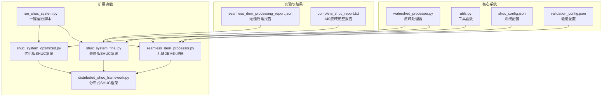
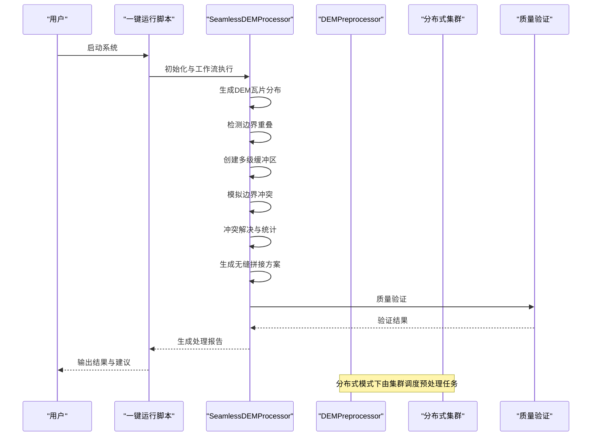
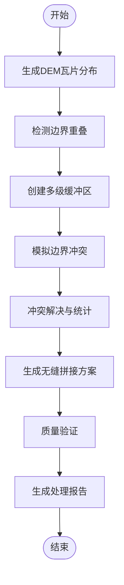
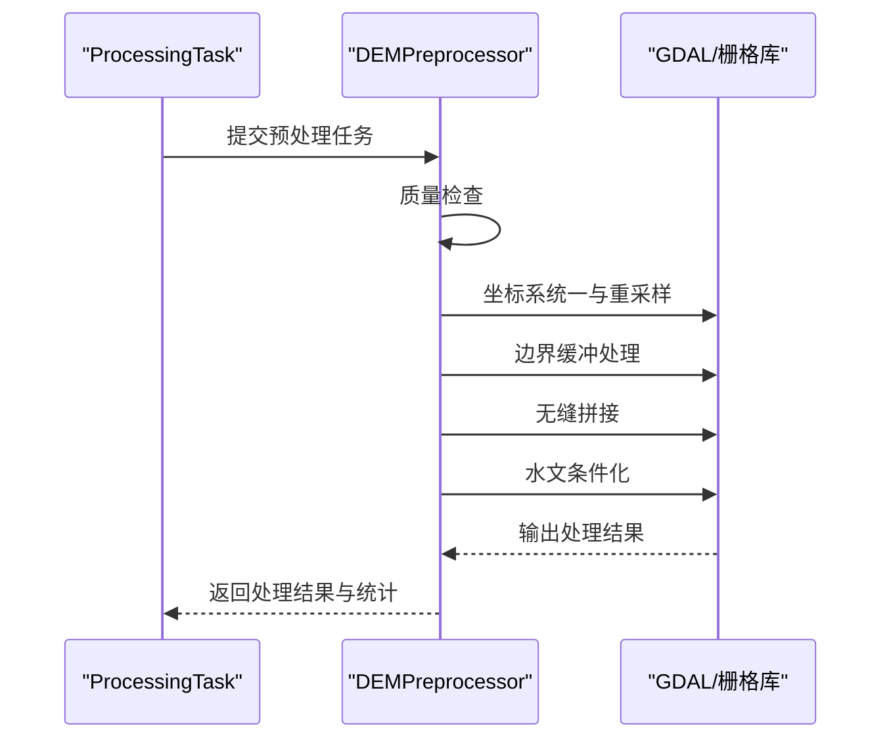
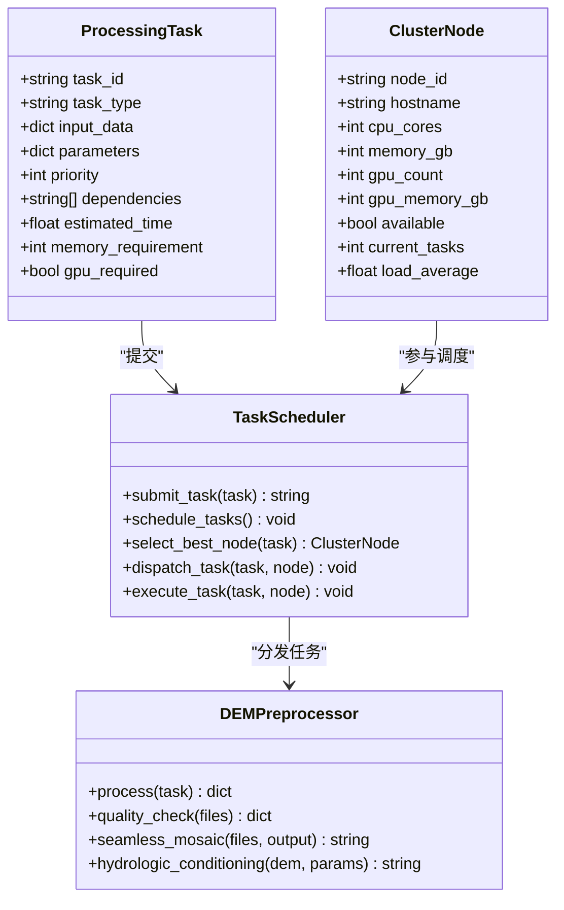
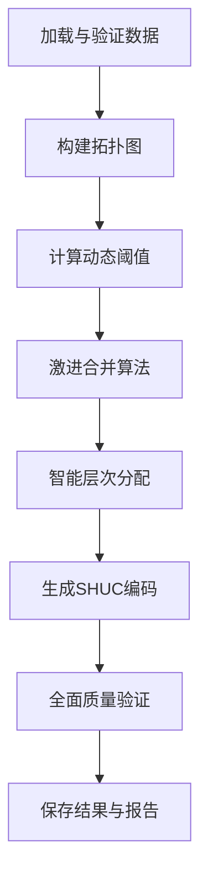
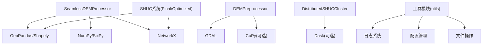

# 无缝DEM处理

<cite>
**本文引用的文件**
- [seamless_dem_processor.py](file://03_EXTENSIONS/seamless_dem_processor.py)
- [shuc_system_final.py](file://03_EXTENSIONS/shuc_system_final.py)
- [shuc_system_optimized.py](file://03_EXTENSIONS/shuc_system_optimized.py)
- [distributed_shuc_framework.py](file://03_EXTENSIONS/distributed_shuc_framework.py)
- [run_shuc_system.py](file://03_EXTENSIONS/run_shuc_system.py)
- [watershed_processor.py](file://01_CORE_SYSTEM/src/watershed_processor.py)
- [utils.py](file://01_CORE_SYSTEM/src/utils.py)
- [shuc_config.json](file://01_CORE_SYSTEM/config/shuc_config.json)
- [validation_config.json](file://01_CORE_SYSTEM/config/validation_config.json)
- [basic_usage.py](file://01_CORE_SYSTEM/examples/basic_usage.py)
- [batch_processing.py](file://01_CORE_SYSTEM/examples/batch_processing.py)
- [README.md](file://README.md)
- [seamless_dem_processing_report.json](file://04_EXPERIMENTS/results/seamless_processing/seamless_dem_processing_report.json)
- [complete_shuc_report.txt](file://04_EXPERIMENTS/results/prototype_140_watersheds/complete_system_20250830_205534/complete_shuc_report.txt)
</cite>

## 目录
1. [简介](#简介)
2. [项目结构](#项目结构)
3. [核心组件](#核心组件)
4. [架构总览](#架构总览)
5. [详细组件分析](#详细组件分析)
6. [依赖关系分析](#依赖关系分析)
7. [性能考虑](#性能考虑)
8. [故障排除指南](#故障排除指南)
9. [结论](#结论)
10. [附录](#附录)

## 简介
本技术文档围绕无缝DEM处理模块展开，系统阐述跨区域DEM数据接边的关键技术，包括坐标系统一、分辨率匹配与边界对齐算法；缓冲区处理方法（重叠区域处理、边缘平滑技术与数据一致性保证）；以及无缝拼接算法（镶嵌算法、质量控制与结果验证机制）。同时提供完整的API参考（DEMPreprocessor预处理器的使用方法、参数配置与输出格式），并结合实际应用场景与案例分析展示在大规模流域处理中的应用效果，最后给出性能优化建议与故障排除指南。

## 项目结构
该仓库包含核心系统、扩展功能、实验结果与文档资料。无缝DEM处理模块位于扩展功能目录中，配合核心系统中的流域处理与工具模块共同构成完整的水文编码与处理流水线。

**图表来源**
- [seamless_dem_processor.py:42-800](file://03_EXTENSIONS/seamless_dem_processor.py#L42-L800)
- [distributed_shuc_framework.py:550-777](file://03_EXTENSIONS/distributed_shuc_framework.py#L550-L777)
- [shuc_system_final.py:31-800](file://03_EXTENSIONS/shuc_system_final.py#L31-L800)
- [shuc_system_optimized.py:33-664](file://03_EXTENSIONS/shuc_system_optimized.py#L33-L664)
- [run_shuc_system.py:167-211](file://03_EXTENSIONS/run_shuc_system.py#L167-L211)
- [watershed_processor.py:24-377](file://01_CORE_SYSTEM/src/watershed_processor.py#L24-L377)
- [utils.py:16-360](file://01_CORE_SYSTEM/src/utils.py#L16-L360)
- [shuc_config.json:1-43](file://01_CORE_SYSTEM/config/shuc_config.json#L1-L43)
- [validation_config.json:1-46](file://01_CORE_SYSTEM/config/validation_config.json#L1-L46)
- [seamless_dem_processing_report.json:1-117](file://04_EXPERIMENTS/results/seamless_processing/seamless_dem_processing_report.json#L1-L117)
- [complete_shuc_report.txt:1-26](file://04_EXPERIMENTS/results/prototype_140_watersheds/complete_system_20250830_205534/complete_shuc_report.txt#L1-L26)

**章节来源**
- [README.md:1-88](file://README.md#L1-L88)

## 核心组件
- 无缝DEM处理器（SeamlessDEMProcessor）：负责生成DEM瓦片分布、检测边界重叠、创建多级缓冲区、模拟边界冲突、执行冲突解决、生成无缝拼接方案、质量验证与报告生成。
- DEM预处理器（DEMPreprocessor）：分布式框架中的预处理组件，负责DEM数据质量检查、坐标系统一、边界缓冲处理、无缝拼接与水文条件化。
- 分布式SHUC集群（DistributedSHUCCluster）：支持大规模流域数据的分布式并行处理，包含任务调度、GPU加速、容错恢复与检查点机制。
- SHUC系统（Final/Optimized）：提供完整的流域分级编码与合并算法，支持6级12位编码体系与质量验证。
- 工具模块（utils）：提供日志、配置管理、文件操作与数据验证等通用工具。

**章节来源**
- [seamless_dem_processor.py:42-800](file://03_EXTENSIONS/seamless_dem_processor.py#L42-L800)
- [distributed_shuc_framework.py:209-317](file://03_EXTENSIONS/distributed_shuc_framework.py#L209-L317)
- [shuc_system_final.py:31-800](file://03_EXTENSIONS/shuc_system_final.py#L31-L800)
- [shuc_system_optimized.py:33-664](file://03_EXTENSIONS/shuc_system_optimized.py#L33-L664)
- [utils.py:16-360](file://01_CORE_SYSTEM/src/utils.py#L16-L360)

## 架构总览
无缝DEM处理模块采用“模拟-检测-缓冲-冲突-拼接-验证”的闭环流程，结合分布式框架实现大规模并行处理。核心架构如下：

**图表来源**
- [run_shuc_system.py:167-211](file://03_EXTENSIONS/run_shuc_system.py#L167-L211)
- [seamless_dem_processor.py:368-411](file://03_EXTENSIONS/seamless_dem_processor.py#L368-L411)
- [distributed_shuc_framework.py:611-646](file://03_EXTENSIONS/distributed_shuc_framework.py#L611-L646)

## 详细组件分析

### 无缝DEM处理器（SeamlessDEMProcessor）
- 功能职责
  - 生成中国DEM瓦片分布（模拟40+景瓦片）
  - 检测边界重叠区域并评估冲突风险
  - 创建多级缓冲区（处理缓冲区、分析缓冲区、过渡缓冲区、质量缓冲区）
  - 模拟边界冲突类型与严重程度
  - 执行冲突解决（高程平滑、投影转换、分辨率统一、数据填补、权重融合）
  - 生成无缝拼接方案与质量验证
  - 输出处理报告与统计信息

- 关键算法与流程
  - 边界重叠检测：基于瓦片几何距离与缓冲区相交，识别重叠区域并分类重叠类型（水平/垂直/对角）。
  - 冲突风险评估：综合数据质量差异、地理位置（高纬度/高海拔）、流域重要性（长江/黄河）等因素计算风险等级。
  - 缓冲区系统：将每个瓦片扩展为多级缓冲区，分别用于数据预处理、边界冲突分析、过渡处理与质量检查。
  - 冲突解决：针对不同冲突类型选择相应算法（如高斯平滑、坐标转换、分辨率谐波、克里金填补、线性加权融合），并统计成功率与残差。
  - 拼接方案：设计羽化融合、直方图匹配与梯度融合策略，制定处理优先级与资源需求估算。
  - 质量验证：计算几何精度、辐射一致性、边缘连续性与水文连通性等指标，生成总体质量评分与等级。

- API与使用要点
  - 初始化：传入输出目录，内部创建输出目录并初始化缓冲区配置与质量阈值。
  - 工作流：调用实现无缝处理工作流的方法，自动完成瓦片生成、重叠检测、缓冲区创建、冲突模拟、冲突解决、拼接方案、质量验证与报告生成。
  - 输出：保存瓦片分布、重叠区域、缓冲区、冲突解决结果、拼接方案、质量报告与处理摘要。

**图表来源**
- [seamless_dem_processor.py:368-411](file://03_EXTENSIONS/seamless_dem_processor.py#L368-L411)
- [seamless_dem_processor.py:413-474](file://03_EXTENSIONS/seamless_dem_processor.py#L413-L474)
- [seamless_dem_processor.py:568-590](file://03_EXTENSIONS/seamless_dem_processor.py#L568-L590)
- [seamless_dem_processor.py:652-697](file://03_EXTENSIONS/seamless_dem_processor.py#L652-L697)
- [seamless_dem_processing_report.json:1-117](file://04_EXPERIMENTS/results/seamless_processing/seamless_dem_processing_report.json#L1-L117)

**章节来源**
- [seamless_dem_processor.py:42-800](file://03_EXTENSIONS/seamless_dem_processor.py#L42-L800)
- [seamless_dem_processing_report.json:1-117](file://04_EXPERIMENTS/results/seamless_processing/seamless_dem_processing_report.json#L1-L117)

### DEM预处理器（DEMPreprocessor）
- 功能职责
  - DEM数据质量检查（文件大小、分辨率、空值比例、高程范围）
  - 坐标系统一（投影转换与重采样）
  - 边界缓冲处理（重叠区域缓冲与边缘平滑）
  - 无缝拼接（多文件无缝镶嵌）
  - 水文条件化（基于水文算法的地形修正）

- 处理流程
  - 质量检查：遍历DEM文件，统计文件大小、分辨率、空值比例与高程范围，记录潜在问题。
  - 坐标系统一：统一到目标投影与分辨率，确保后续拼接一致性。
  - 边界缓冲：对每个DEM文件应用缓冲区，减少边界伪影影响。
  - 无缝拼接：将统一后的DEM文件进行无缝镶嵌，生成拼接产物。
  - 水文条件化：对拼接后的DEM进行水文处理（如填洼、流向、汇流等），满足水文建模需求。

**图表来源**
- [distributed_shuc_framework.py:209-317](file://03_EXTENSIONS/distributed_shuc_framework.py#L209-L317)

**章节来源**
- [distributed_shuc_framework.py:209-317](file://03_EXTENSIONS/distributed_shuc_framework.py#L209-L317)

### 分布式SHUC集群（DistributedSHUCCluster）
- 功能职责
  - 任务调度与执行：支持异步队列、节点选择与任务分发。
  - GPU加速：可选的GPU加速处理（如CuPy）与分布式计算（Dask）。
  - 容错与检查点：失败重试、进度跟踪与结果合并。
  - 全国尺度处理：将中国DEM数据按主要流域分区，形成大规模并行处理流水线。

- 关键组件
  - ProcessingTask：任务定义（类型、输入、参数、优先级、依赖、内存与GPU需求）。
  - ClusterNode：节点信息（主机名、CPU/GPU资源、负载与可用性）。
  - TaskScheduler：智能调度器，基于负载与资源匹配选择最佳节点。
  - 处理器族：DEM预处理、流域边界提取、边界合并、质量验证等专用处理器。

**图表来源**
- [distributed_shuc_framework.py:55-208](file://03_EXTENSIONS/distributed_shuc_framework.py#L55-L208)
- [distributed_shuc_framework.py:209-317](file://03_EXTENSIONS/distributed_shuc_framework.py#L209-L317)
- [distributed_shuc_framework.py:550-777](file://03_EXTENSIONS/distributed_shuc_framework.py#L550-L777)

**章节来源**
- [distributed_shuc_framework.py:550-777](file://03_EXTENSIONS/distributed_shuc_framework.py#L550-L777)

### SHUC系统（Final/Optimized）
- 功能职责
  - 数据加载与完整性修复：自动检测并修复自引用、无效几何等问题。
  - 拓扑图构建：基于上下游关系构建有向图，维护拓扑完整性。
  - 智能合并算法：动态阈值计算、激进合并策略、拓扑关系更新与合并历史追踪。
  - 层次结构与编码：6级12位编码体系，智能分配与编码生成。
  - 全面质量验证：面积合规率、编码唯一性、层次分布与系统评分。

- 优化策略（优化版）
  - 动态阈值：基于数据分布（Q75/Q90）自适应调整合并阈值。
  - 激进合并：增加最大迭代轮次、放宽终止条件、提升小流域优先级。
  - 智能层次分配：支持4-6级合理分配，提升合规率与评分。

**图表来源**
- [shuc_system_final.py:146-766](file://03_EXTENSIONS/shuc_system_final.py#L146-L766)
- [shuc_system_optimized.py:79-632](file://03_EXTENSIONS/shuc_system_optimized.py#L79-L632)

**章节来源**
- [shuc_system_final.py:146-766](file://03_EXTENSIONS/shuc_system_final.py#L146-L766)
- [shuc_system_optimized.py:79-632](file://03_EXTENSIONS/shuc_system_optimized.py#L79-L632)
- [complete_shuc_report.txt:1-26](file://04_EXPERIMENTS/results/prototype_140_watersheds/complete_system_20250830_205534/complete_shuc_report.txt#L1-L26)

### 工具模块（utils）
- 功能职责
  - 日志系统：控制台与文件双重输出，支持时间戳与格式化。
  - 配置管理：默认配置、配置文件加载与深度合并。
  - 文件操作：目录创建、文件大小格式化、处理时间计算。
  - 数据验证：Shapefile文件验证（存在性、可读性、记录数、几何字段、CRS、范围）。
  - 结果导出：处理结果摘要导出为JSON。

**章节来源**
- [utils.py:16-360](file://01_CORE_SYSTEM/src/utils.py#L16-L360)

## 依赖关系分析
- 组件耦合
  - SeamlessDEMProcessor与分布式框架通过任务调度器解耦，可在本地或分布式环境中运行。
  - SHUC系统与工具模块通过配置文件与日志系统耦合，便于参数化与可观察性。
  - DEMPreprocessor依赖GDAL/栅格库进行栅格操作，分布式框架提供异步与并行执行能力。

- 外部依赖
  - GeoPandas/Shapely：空间数据处理与几何运算。
  - NumPy/SciPy：数值计算与插值算法。
  - NetworkX：拓扑图构建与分析。
  - GDAL/CuPy（可选）：栅格处理与GPU加速。
  - Dask（可选）：分布式并行计算。

**图表来源**
- [seamless_dem_processor.py:21-40](file://03_EXTENSIONS/seamless_dem_processor.py#L21-L40)
- [distributed_shuc_framework.py:39-53](file://03_EXTENSIONS/distributed_shuc_framework.py#L39-L53)
- [shuc_system_final.py:19-30](file://03_EXTENSIONS/shuc_system_final.py#L19-L30)
- [shuc_system_optimized.py:21-32](file://03_EXTENSIONS/shuc_system_optimized.py#L21-L32)
- [utils.py:16-30](file://01_CORE_SYSTEM/src/utils.py#L16-L30)

**章节来源**
- [seamless_dem_processor.py:21-40](file://03_EXTENSIONS/seamless_dem_processor.py#L21-L40)
- [distributed_shuc_framework.py:39-53](file://03_EXTENSIONS/distributed_shuc_framework.py#L39-L53)
- [shuc_system_final.py:19-30](file://03_EXTENSIONS/shuc_system_final.py#L19-L30)
- [shuc_system_optimized.py:21-32](file://03_EXTENSIONS/shuc_system_optimized.py#L21-L32)
- [utils.py:16-30](file://01_CORE_SYSTEM/src/utils.py#L16-L30)

## 性能考虑
- 并行与分布式
  - 使用分布式任务调度器与GPU加速（若可用）提升大规模处理效率。
  - 在无缝拼接与水文条件化阶段采用并行策略，缩短处理时间。
- 内存与存储
  - 合理设置缓冲区大小与处理窗口，避免内存峰值过高。
  - 对超大DEM文件采用分块处理与临时文件管理。
- 算法优化
  - 动态阈值与激进合并策略在保证质量的前提下提升合规率与系统评分。
  - 使用高效的空间索引与拓扑查询减少计算开销。
- I/O优化
  - 批量读写与缓存中间结果，减少磁盘I/O。
  - 使用高效的栅格格式与压缩策略。

[本节为通用指导，无需特定文件引用]

## 故障排除指南
- 环境与依赖
  - 确认Python版本与关键依赖包（GeoPandas、Shapely、NetworkX、GDAL等）已正确安装。
  - 若使用分布式或GPU功能，确认Dask与CuPy可用性。

- 数据问题
  - Shapefile缺失几何字段或CRS不一致：使用工具模块的验证函数检查数据完整性。
  - 自引用与无效几何：系统会自动修复，但建议人工复核。

- 处理失败
  - 查看处理日志与错误堆栈，定位失败环节（质量检查、拼接、验证）。
  - 调整缓冲区大小、分辨率与阈值参数，重新运行。

- 结果异常
  - 若合规率偏低或评分不达预期，检查合并策略与阈值设置，必要时启用更严格的验证规则。

**章节来源**
- [utils.py:159-221](file://01_CORE_SYSTEM/src/utils.py#L159-L221)
- [run_shuc_system.py:20-41](file://03_EXTENSIONS/run_shuc_system.py#L20-L41)

## 结论
无缝DEM处理模块通过多级缓冲区、冲突检测与解决、无缝拼接与质量验证，实现了跨区域DEM数据的高质量接边与一致性保障。结合分布式框架与SHUC系统，能够支撑从原型实验到全国尺度的大规模流域处理，具备良好的扩展性与实用性。建议在实际部署中结合业务需求调整参数、启用并行与GPU加速，并持续完善质量监控与自动化流程。

[本节为总结性内容，无需特定文件引用]

## 附录

### API参考：DEMPreprocessor预处理器
- 类型与职责
  - DEMPreprocessor：负责DEM预处理全流程，包括质量检查、坐标系统一、边界缓冲、无缝拼接与水文条件化。

- 主要方法
  - process(task)：执行预处理任务，返回状态、输出文件与统计信息。
  - quality_check(dem_files)：质量检查，返回文件统计与潜在问题。
  - seamless_mosaic(dem_files, output_path)：无缝拼接，返回拼接产物路径。
  - hydrologic_conditioning(dem_file, parameters)：水文条件化，返回处理后文件路径。

- 参数与配置
  - 输入数据：dem_files（列表）、output_path（字符串）。
  - 参数：buffer_size_km、resolution_m、threshold_area等（依据任务类型传入）。

- 输出格式
  - 质量报告：包含文件统计与问题列表。
  - 处理结果：拼接后的DEM文件与水文条件化后的DEM文件。
  - 统计信息：内存使用、CPU使用与处理时间。

**章节来源**
- [distributed_shuc_framework.py:209-317](file://03_EXTENSIONS/distributed_shuc_framework.py#L209-L317)

### 配置参考
- 系统配置（shuc_config.json）
  - processing：目标合规率、合并策略、最大迭代轮次、早停开关、动态阈值模式。
  - hierarchy：各级别最小面积与配额控制。
  - validation：验证阈值、权重与报告设置。
  - output/performance：输出选项与性能参数。

- 验证配置（validation_config.json）
  - 阈值与权重：面积合规、编码唯一性、拓扑完整性、几何有效性。
  - 质量等级：优秀、良好、可接受、需改进的分数区间与描述。
  - 报告设置：详细分析、问题建议与性能指标导出格式。

**章节来源**
- [shuc_config.json:1-43](file://01_CORE_SYSTEM/config/shuc_config.json#L1-L43)
- [validation_config.json:1-46](file://01_CORE_SYSTEM/config/validation_config.json#L1-L46)

### 实际应用场景与案例分析
- 原型实验（140流域）
  - 处理结果：原始140个流域合并为16个，压缩率达88.6%，5级与6级编码覆盖完整。
  - 合规性：面积≥100km²占比93.8%，基本满足系统要求。

- 无缝处理实验
  - 处理规模：252景DEM瓦片，检测到911个重叠区域，模拟1303个边界冲突。
  - 处理质量：总体质量评分0.919，质量等级“良好”，建议局部优化后使用。

**章节来源**
- [complete_shuc_report.txt:1-26](file://04_EXPERIMENTS/results/prototype_140_watersheds/complete_system_20250830_205534/complete_shuc_report.txt#L1-L26)
- [seamless_dem_processing_report.json:1-117](file://04_EXPERIMENTS/results/seamless_processing/seamless_dem_processing_report.json#L1-L117)

### 示例与使用指南
- 基础使用示例：演示如何加载数据、处理流域并查看结果。
- 批处理示例：对比多种配置策略，生成对比报告与推荐配置。
- 一键运行脚本：自动查找数据、准备环境并运行最终版SHUC系统。

**章节来源**
- [basic_usage.py:1-106](file://01_CORE_SYSTEM/examples/basic_usage.py#L1-L106)
- [batch_processing.py:1-327](file://01_CORE_SYSTEM/examples/batch_processing.py#L1-L327)
- [run_shuc_system.py:167-211](file://03_EXTENSIONS/run_shuc_system.py#L167-L211)