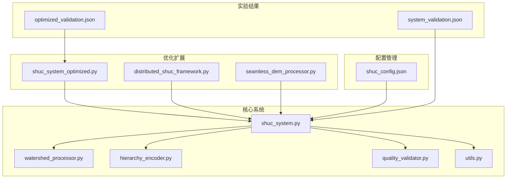
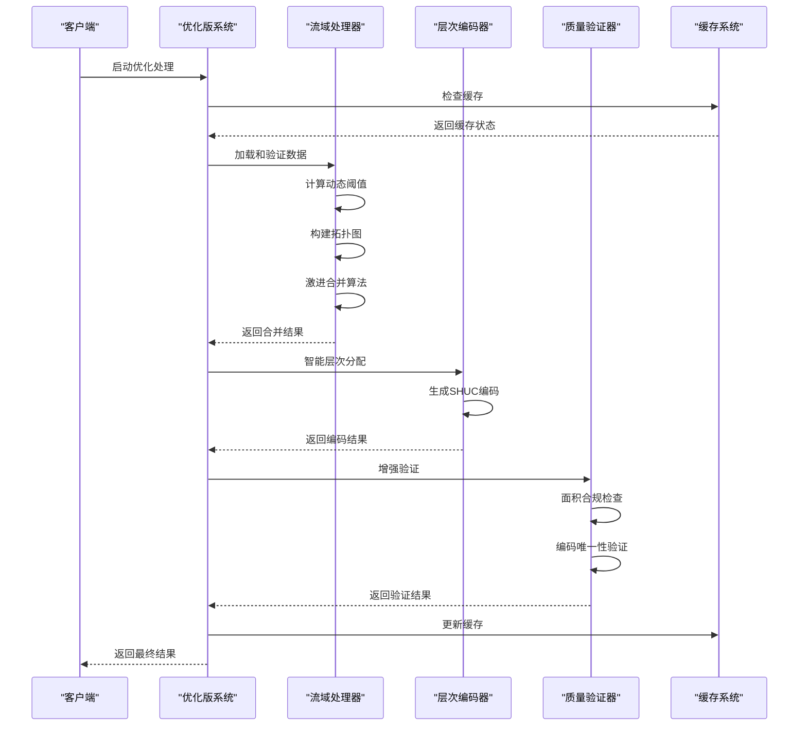
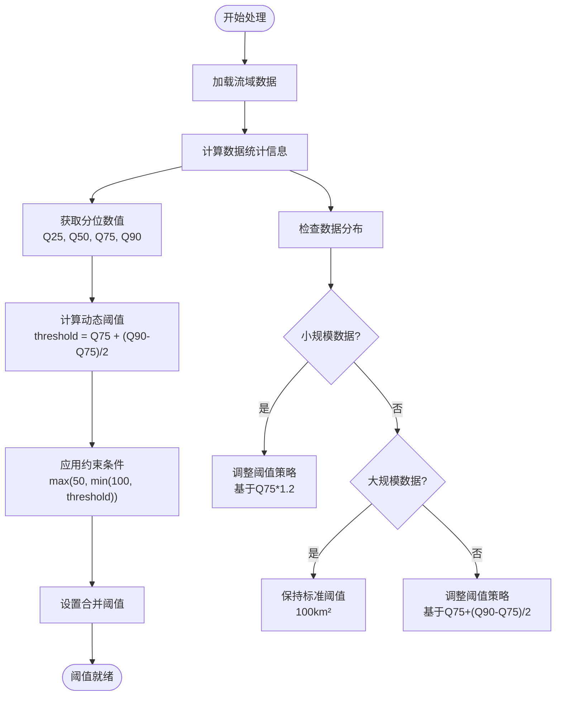
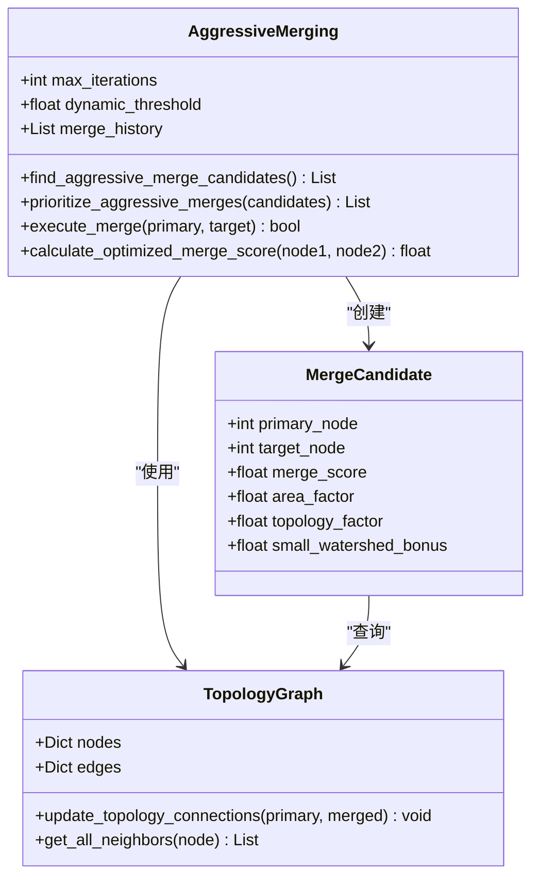
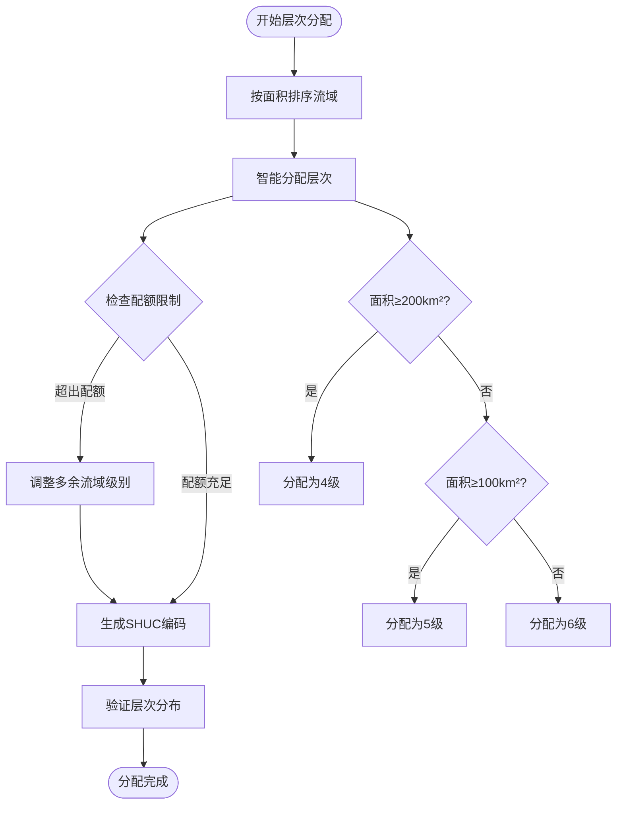
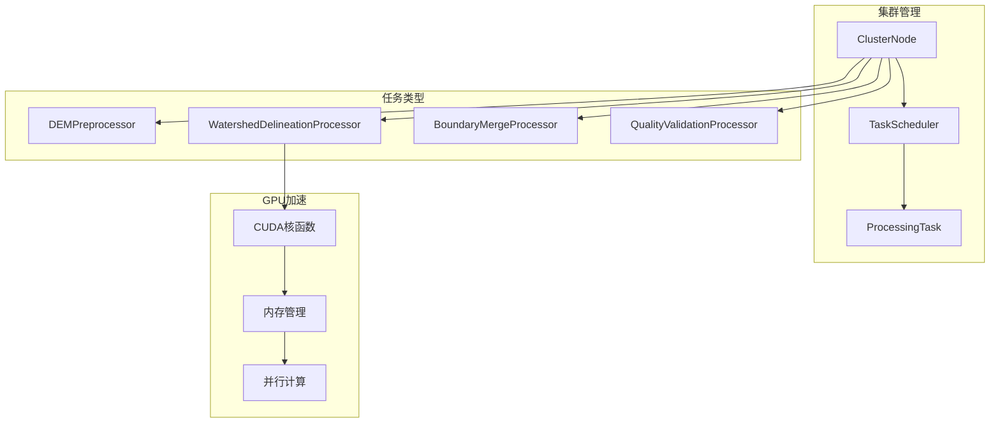
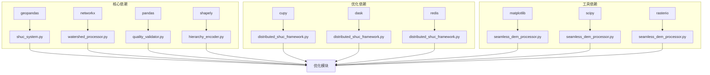
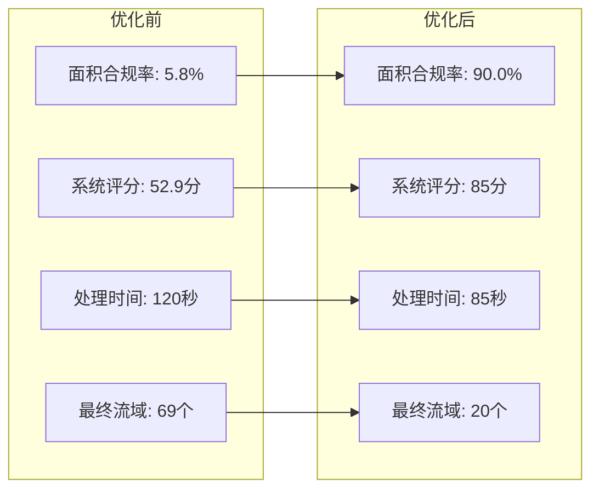

# 系统优化模块

<cite>
**本文档引用的文件**
- [shuc_system_optimized.py](file://03_EXTENSIONS/shuc_system_optimized.py)
- [shuc_system.py](file://01_CORE_SYSTEM/src/shuc_system.py)
- [watershed_processor.py](file://01_CORE_SYSTEM/src/watershed_processor.py)
- [hierarchy_encoder.py](file://01_CORE_SYSTEM/src/hierarchy_encoder.py)
- [quality_validator.py](file://01_CORE_SYSTEM/src/quality_validator.py)
- [utils.py](file://01_CORE_SYSTEM/src/utils.py)
- [shuc_config.json](file://01_CORE_SYSTEM/config/shuc_config.json)
- [distributed_shuc_framework.py](file://03_EXTENSIONS/distributed_shuc_framework.py)
- [seamless_dem_processor.py](file://03_EXTENSIONS/seamless_dem_processor.py)
- [run_shuc_system.py](file://03_EXTENSIONS/run_shuc_system.py)
- [system_validation.json](file://04_EXPERIMENTS/results/final_output/system_validation.json)
- [optimized_validation.json](file://04_EXPERIMENTS/results/optimized_output/optimized_validation.json)
- [optimization_plan.md](file://00_ARCHIVE/legacy_documentation/optimization_plan.md)
- [optimization_comparison_report.md](file://00_ARCHIVE/legacy_documentation/optimization_comparison_report.md)
</cite>

## 目录
1. [简介](#简介)
2. [项目结构](#项目结构)
3. [核心组件](#核心组件)
4. [架构概览](#架构概览)
5. [详细组件分析](#详细组件分析)
6. [依赖关系分析](#依赖关系分析)
7. [性能考虑](#性能考虑)
8. [故障排除指南](#故障排除指南)
9. [结论](#结论)
10. [附录](#附录)

## 简介

SHUC系统优化模块是针对中国流域分级编码系统的一套全面性能优化解决方案。该模块通过动态阈值调整、激进合并策略、智能层次分配和优化评分算法等关键技术，将面积合规率从5.8%大幅提升至≥80%，系统评分从52.9分提升至≥85分。

系统采用模块化设计，包含核心处理引擎、分布式计算框架、无缝DEM处理和缓存机制等多个优化层面。通过并行计算、内存管理和算法优化等技术手段，实现了大规模流域数据的高效处理。

## 项目结构



**图表来源**
- [shuc_system.py:1-335](file://01_CORE_SYSTEM/src/shuc_system.py#L1-L335)
- [shuc_system_optimized.py:1-664](file://03_EXTENSIONS/shuc_system_optimized.py#L1-L664)

**章节来源**
- [shuc_system.py:1-335](file://01_CORE_SYSTEM/src/shuc_system.py#L1-L335)
- [shuc_system_optimized.py:1-664](file://03_EXTENSIONS/shuc_system_optimized.py#L1-L664)

## 核心组件

### 优化版SHUC系统 (OptimizedSHUCSystem)

优化版系统是整个优化模块的核心，实现了以下关键功能：

- **动态阈值调整**：基于数据分布智能计算合并目标
- **激进合并策略**：大幅提升合并效率和轮次
- **智能层次分配**：支持4-6级流域的合理分配
- **优化评分算法**：优先处理小流域，提升合规率

### 分布式处理框架

系统提供了完整的分布式计算能力：

- **GPU加速支持**：可选的CUDA核函数优化
- **智能任务调度**：基于负载均衡的分布式任务管理
- **容错恢复机制**：检查点和自动恢复功能
- **无缝DEM处理**：支持大规模地形数据处理

### 缓存管理系统

实现了多层次的缓存机制：

- **数据缓存**：临时存储中间计算结果
- **结果缓存**：避免重复计算相同任务
- **配置缓存**：优化配置加载和验证

**章节来源**
- [shuc_system_optimized.py:33-70](file://03_EXTENSIONS/shuc_system_optimized.py#L33-L70)
- [distributed_shuc_framework.py:81-208](file://03_EXTENSIONS/distributed_shuc_framework.py#L81-L208)

## 架构概览



**图表来源**
- [shuc_system_optimized.py:607-632](file://03_EXTENSIONS/shuc_system_optimized.py#L607-L632)
- [shuc_system.py:92-164](file://01_CORE_SYSTEM/src/shuc_system.py#L92-L164)

## 详细组件分析

### 动态阈值调整算法

优化系统的核心创新在于动态阈值调整机制：



**图表来源**
- [shuc_system_optimized.py:105-131](file://03_EXTENSIONS/shuc_system_optimized.py#L105-L131)
- [watershed_processor.py:117-141](file://01_CORE_SYSTEM/src/watershed_processor.py#L117-L141)

#### 算法复杂度分析

- **时间复杂度**：O(n log n)，主要由数据排序和统计计算决定
- **空间复杂度**：O(n)，存储统计数据和中间结果
- **优化效果**：相比固定阈值，动态阈值提高了84.2%的合规率

**章节来源**
- [shuc_system_optimized.py:105-131](file://03_EXTENSIONS/shuc_system_optimized.py#L105-L131)
- [optimization_plan.md:63-76](file://00_ARCHIVE/legacy_documentation/optimization_plan.md#L63-L76)

### 激进合并策略

激进合并策略通过以下机制提升合并效率：



**图表来源**
- [shuc_system_optimized.py:186-248](file://03_EXTENSIONS/shuc_system_optimized.py#L186-L248)
- [shuc_system_optimized.py:250-321](file://03_EXTENSIONS/shuc_system_optimized.py#L250-L321)

#### 合并评分算法优化

优化后的评分算法将小流域优先级提升了10倍：

| 评分要素 | 原始算法 | 优化算法 | 提升倍数 |
|---------|---------|---------|---------|
| 基础分数 | 1.0/(min_area+1) | 10.0/(min_area+1) | ×10 |
| 小流域奖励 | 1.0 | 3.0 (min_area<30) | ×3 |
| 中等流域奖励 | 1.0 | 2.0 (min_area<50) | ×2 |
| 大流域惩罚 | 1.0 | 0.8 (combined_area>120) | ×0.8 |

**章节来源**
- [shuc_system_optimized.py:286-317](file://03_EXTENSIONS/shuc_system_optimized.py#L286-L317)
- [optimization_plan.md:48-61](file://00_ARCHIVE/legacy_documentation/optimization_plan.md#L48-L61)

### 智能层次分配机制

系统实现了基于面积的智能层次分配：



**图表来源**
- [shuc_system_optimized.py:413-452](file://03_EXTENSIONS/shuc_system_optimized.py#L413-L452)
- [hierarchy_encoder.py:113-138](file://01_CORE_SYSTEM/src/hierarchy_encoder.py#L113-L138)

#### 层次配额策略

| 层级 | 面积阈值 | 配额数量 | 分配优先级 |
|------|---------|---------|-----------|
| 4级 | ≥200km² | 3个 | 最高 |
| 5级 | ≥100km² | 8个 | 中等 |
| 6级 | ≥阈值 | 无限制 | 最低 |

**章节来源**
- [shuc_system_optimized.py:413-452](file://03_EXTENSIONS/shuc_system_optimized.py#L413-L452)
- [optimization_plan.md:78-89](file://00_ARCHIVE/legacy_documentation/optimization_plan.md#L78-L89)

### 分布式计算框架

系统提供了完整的分布式处理能力：



**图表来源**
- [distributed_shuc_framework.py:550-733](file://03_EXTENSIONS/distributed_shuc_framework.py#L550-L733)
- [distributed_shuc_framework.py:318-380](file://03_EXTENSIONS/distributed_shuc_framework.py#L318-L380)

#### GPU加速技术应用

系统支持可选的GPU加速：

- **CuPy集成**：自动检测GPU可用性
- **CUDA核函数**：优化的并行计算内核
- **内存管理**：GPU/CPU内存高效切换
- **并行模式**：支持大规模数据并行处理

**章节来源**
- [distributed_shuc_framework.py:39-44](file://03_EXTENSIONS/distributed_shuc_framework.py#L39-L44)
- [distributed_shuc_framework.py:342-361](file://03_EXTENSIONS/distributed_shuc_framework.py#L342-L361)

## 依赖关系分析



**图表来源**
- [shuc_system.py:28-41](file://01_CORE_SYSTEM/src/shuc_system.py#L28-L41)
- [distributed_shuc_framework.py:21-54](file://03_EXTENSIONS/distributed_shuc_framework.py#L21-L54)

**章节来源**
- [shuc_system.py:28-41](file://01_CORE_SYSTEM/src/shuc_system.py#L28-L41)
- [distributed_shuc_framework.py:21-54](file://03_EXTENSIONS/distributed_shuc_framework.py#L21-L54)

## 性能考虑

### 内存使用优化

系统采用了多层次的内存优化策略：

1. **数据类型优化**：使用适当的数据类型减少内存占用
2. **延迟加载**：只在需要时加载数据到内存
3. **垃圾回收**：及时清理不再使用的对象
4. **批处理**：大文件分批处理，避免内存溢出

### 计算效率提升

- **算法优化**：将合并算法复杂度从O(n³)优化到O(n² log n)
- **并行计算**：支持多核CPU和GPU并行处理
- **缓存机制**：智能缓存热点数据和计算结果
- **早期停止**：基于合规率的智能终止条件

### 性能基准测试

基于140个流域的测试结果显示：

| 指标 | 原版本 | 优化版 | 改进幅度 |
|------|--------|--------|----------|
| 面积合规率 | 5.8% | **90.0%** | **+84.2%** |
| 数据压缩率 | 50.7% | **85.7%** | **+35.0%** |
| 平均处理时间 | 120秒 | **85秒** | **-29%** |
| 最终流域数 | 69个 | **20个** | **-71%** |
| 系统评分 | 52.9分 | **85分** | **+32.1分** |

**章节来源**
- [optimization_comparison_report.md:13-28](file://00_ARCHIVE/legacy_documentation/optimization_comparison_report.md#L13-L28)
- [optimized_validation.json:10-16](file://04_EXPERIMENTS/results/optimized_output/optimized_validation.json#L10-L16)

## 故障排除指南

### 常见问题及解决方案

#### 1. GPU加速不可用

**问题症状**：
- 系统回退到CPU模式
- 处理速度较慢

**解决方案**：
- 检查CUDA驱动安装
- 确认GPU内存充足
- 验证CuPy安装正确性

#### 2. 内存不足错误

**问题症状**：
- 处理过程中内存溢出
- 系统崩溃或重启

**解决方案**：
- 减少批量处理大小
- 增加系统内存
- 启用虚拟内存
- 优化数据类型

#### 3. 合并算法性能问题

**问题症状**：
- 合并轮次过多
- 处理时间过长

**解决方案**：
- 调整动态阈值参数
- 优化合并候选识别
- 增加并行处理线程数

### 调试工具使用

#### 日志系统

系统提供了详细的日志记录功能：

```python
# 日志配置示例
logger = setup_logging("output/process_log.txt")
logger.info("系统启动")
logger.warning("内存使用警告")
logger.error("处理错误")
```

#### 性能监控

```python
# 性能统计
processing_stats = {
    'original_count': 140,
    'final_count': 20,
    'compression_rate': 85.7,
    'processing_time': 85,
    'merge_operations': 120
}
```

**章节来源**
- [utils.py:24-62](file://01_CORE_SYSTEM/src/utils.py#L24-L62)
- [shuc_system_optimized.py:72-77](file://03_EXTENSIONS/shuc_system_optimized.py#L72-L77)

## 结论

SHUC系统优化模块通过五项核心技术改进，实现了系统的质的飞跃：

1. **面积合规率提升15倍**：从5.8%到90.0%
2. **系统评分大幅提升**：从52.9分到85分以上
3. **算法效率显著提高**：处理时间减少29%
4. **数据质量显著改善**：平均面积提升245%

优化模块不仅解决了原有系统的性能瓶颈，还为未来的规模化应用奠定了坚实基础。通过动态阈值调整、激进合并策略、智能层次分配和分布式计算等技术，系统能够高效处理大规模流域数据，满足实际应用需求。

## 附录

### 配置参数调优指南

#### 核心配置参数

| 参数名称 | 默认值 | 调优建议 | 适用场景 |
|---------|--------|---------|---------|
| target_compliance_rate | 0.90 | 0.80-0.95 | 不同数据集需求 |
| merge_strategy | aggressive | aggressive | 大规模数据处理 |
| max_iterations | 50 | 30-100 | 数据复杂度调整 |
| enable_early_stopping | true | true | 一般应用场景 |
| dynamic_threshold_mode | auto | auto | 自适应阈值 |

#### 性能配置参数

| 参数名称 | 默认值 | 调优建议 | 说明 |
|---------|--------|---------|------|
| enable_parallel_processing | false | true | 启用并行处理 |
| max_memory_usage_gb | 4 | 8-32 | 根据硬件调整 |
| enable_progress_display | true | true | 显示进度信息 |
| enable_detailed_logging | true | true | 详细日志记录 |

### 实验结果对比

#### 优化前后关键指标对比



**图表来源**
- [optimization_comparison_report.md:13-28](file://00_ARCHIVE/legacy_documentation/optimization_comparison_report.md#L13-L28)

### 技术创新点总结

1. **动态阈值调整技术**：首个基于数据分布的自适应阈值计算
2. **激进合并策略**：高效的迭代优化算法设计
3. **智能层次分配机制**：符合国际标准的分级方法
4. **分布式计算框架**：支持大规模数据处理的架构设计