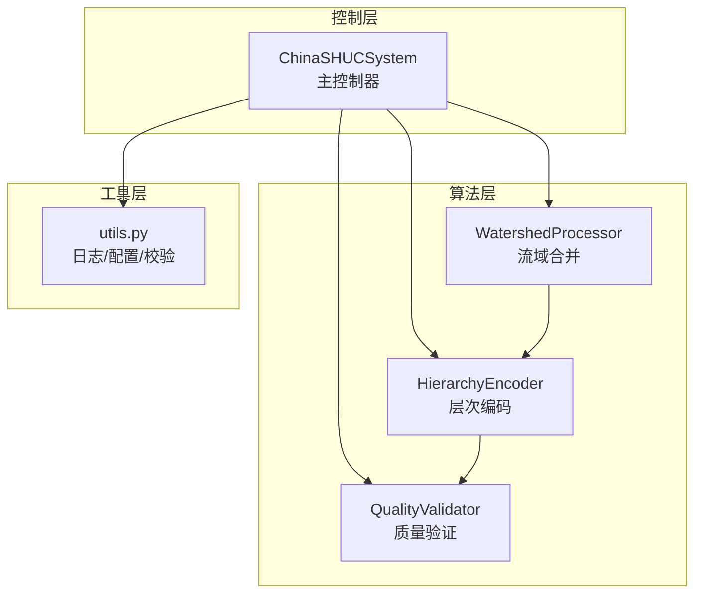
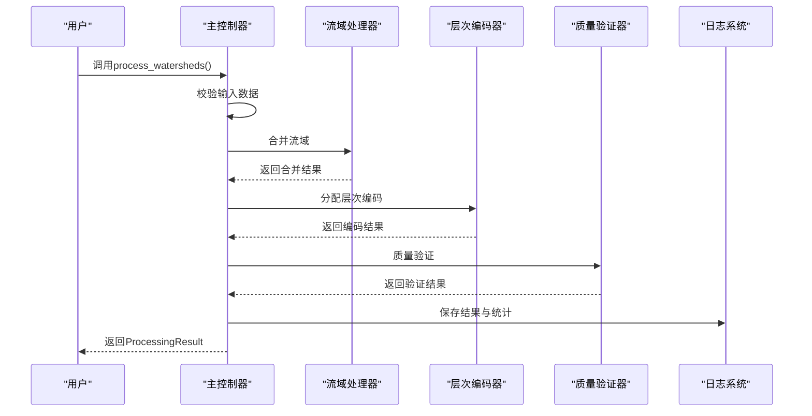
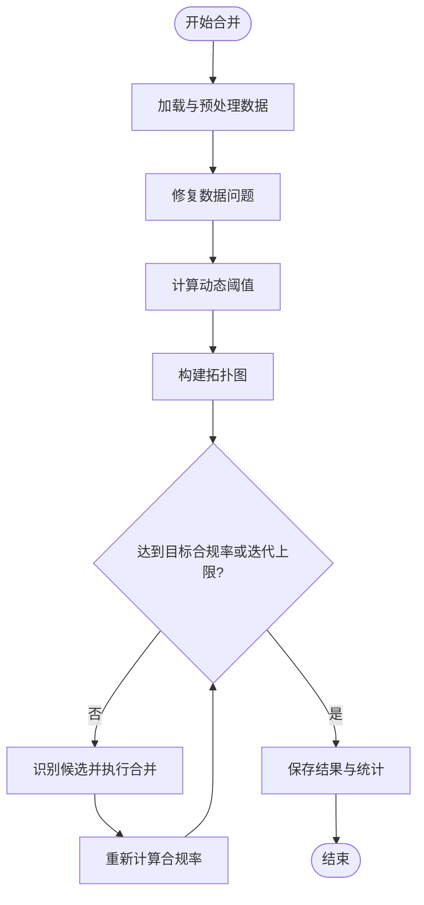
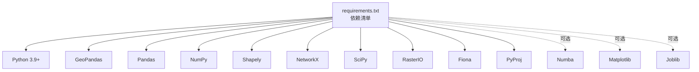

# 故障排除与常见问题

<cite>
**本文引用的文件**
- [README.md](file://README.md)
- [requirements.txt](file://01_CORE_SYSTEM/requirements.txt)
- [shuc_config.json](file://01_CORE_SYSTEM/config/shuc_config.json)
- [validation_config.json](file://01_CORE_SYSTEM/config/validation_config.json)
- [shuc_system.py](file://01_CORE_SYSTEM/src/shuc_system.py)
- [utils.py](file://01_CORE_SYSTEM/src/utils.py)
- [watershed_processor.py](file://01_CORE_SYSTEM/src/watershed_processor.py)
- [hierarchy_encoder.py](file://01_CORE_SYSTEM/src/hierarchy_encoder.py)
- [quality_validator.py](file://01_CORE_SYSTEM/src/quality_validator.py)
- [run_shuc_system.py](file://03_EXTENSIONS/run_shuc_system.py)
- [basic_usage.py](file://01_CORE_SYSTEM/examples/basic_usage.py)
- [batch_processing.py](file://01_CORE_SYSTEM/examples/batch_processing.py)
- [process_log.txt](file://04_EXPERIMENTS/results/final_output/process_log.txt)
- [system_validation.json](file://04_EXPERIMENTS/results/final_output/system_validation.json)
</cite>

## 目录
1. [简介](#简介)
2. [项目结构](#项目结构)
3. [核心组件](#核心组件)
4. [架构总览](#架构总览)
5. [详细组件分析](#详细组件分析)
6. [依赖分析](#依赖分析)
7. [性能考虑](#性能考虑)
8. [故障排除指南](#故障排除指南)
9. [结论](#结论)
10. [附录](#附录)

## 简介
本文件面向SHUC（中国流域分级统一编码）系统的使用者与维护者，提供系统性的故障排除与常见问题解答。内容涵盖安装与环境配置、数据准备与格式要求、运行时错误诊断、性能问题排查、日志分析技巧、环境兼容性与替代方案，以及社区支持与问题反馈流程。文档同时给出针对核心组件的调试方法与工具使用建议，帮助用户快速定位并解决问题。

## 项目结构
SHUC系统采用模块化设计，核心逻辑分为“流域处理”“层次编码”“质量验证”三大模块，并通过统一入口进行编排。配置文件与示例脚本位于核心系统目录；扩展脚本与实验结果位于扩展与实验目录。

```mermaid
graph TB
A["README.md<br/>项目概览与快速开始"] --> B["01_CORE_SYSTEM/<br/>核心系统"]
B --> C["config/<br/>配置文件"]
B --> D["src/<br/>核心算法模块"]
B --> E["examples/<br/>使用示例"]
F["03_EXTENSIONS/<br/>扩展脚本"] --> G["run_shuc_system.py<br/>一键运行脚本"]
H["04_EXPERIMENTS/<br/>实验结果"] --> I["final_output/<br/>处理日志与验证报告"]
```

**图表来源**
- [README.md:19-46](file://README.md#L19-L46)
- [run_shuc_system.py:104-166](file://03_EXTENSIONS/run_shuc_system.py#L104-L166)

**章节来源**
- [README.md:19-46](file://README.md#L19-L46)

## 核心组件
- 中国SHUC系统主类：负责整体流程编排、日志与配置管理、结果保存与统计输出。
- 流域处理器：实现动态阈值计算、拓扑图构建与激进合并策略。
- 层次编码器：按面积分配层级并生成SHUC编码，支持配额优化。
- 质量验证器：多维质量评估（面积合规、编码唯一性、拓扑完整性、几何有效性）与综合评分。
- 工具函数：日志设置、配置加载、数据校验、文件操作等通用能力。

**章节来源**
- [shuc_system.py:43-91](file://01_CORE_SYSTEM/src/shuc_system.py#L43-L91)
- [watershed_processor.py:24-53](file://01_CORE_SYSTEM/src/watershed_processor.py#L24-L53)
- [hierarchy_encoder.py:22-67](file://01_CORE_SYSTEM/src/hierarchy_encoder.py#L22-L67)
- [quality_validator.py:24-60](file://01_CORE_SYSTEM/src/quality_validator.py#L24-L60)
- [utils.py:24-100](file://01_CORE_SYSTEM/src/utils.py#L24-L100)

## 架构总览
SHUC系统采用“主控制器 + 三个核心模块 + 工具层”的分层架构。主控制器协调各模块执行顺序，模块之间通过中间结果（如合并后的流域数据、编码后的数据、验证结果）传递。

**图表来源**
- [shuc_system.py:92-164](file://01_CORE_SYSTEM/src/shuc_system.py#L92-L164)
- [watershed_processor.py:54-81](file://01_CORE_SYSTEM/src/watershed_processor.py#L54-L81)
- [hierarchy_encoder.py:69-95](file://01_CORE_SYSTEM/src/hierarchy_encoder.py#L69-L95)
- [quality_validator.py:61-86](file://01_CORE_SYSTEM/src/quality_validator.py#L61-L86)

## 详细组件分析

### 中国SHUC系统主类（流程编排与日志）
- 职责：初始化配置与输出目录、设置日志、实例化各核心模块、编排处理流程、保存结果与统计。
- 关键点：输入数据验证、异常捕获与日志记录、处理摘要输出。
- 常见问题：配置文件路径错误、输出目录权限不足、输入数据格式不正确。

**图表来源**
- [shuc_system.py:92-164](file://01_CORE_SYSTEM/src/shuc_system.py#L92-L164)
- [shuc_system.py:198-237](file://01_CORE_SYSTEM/src/shuc_system.py#L198-L237)

**章节来源**
- [shuc_system.py:92-164](file://01_CORE_SYSTEM/src/shuc_system.py#L92-L164)
- [shuc_system.py:165-196](file://01_CORE_SYSTEM/src/shuc_system.py#L165-L196)
- [shuc_system.py:198-237](file://01_CORE_SYSTEM/src/shuc_system.py#L198-L237)

### 流域处理器（动态阈值与合并策略）
- 职责：加载数据、修复问题、计算动态阈值、构建拓扑图、执行合并迭代、记录合并历史。
- 关键点：动态阈值公式、合并优先级（下游>上游>相邻>最近）、拓扑更新。
- 常见问题：阈值过高导致合并不足、拓扑字段缺失、几何无效引发合并失败。

**图表来源**
- [watershed_processor.py:54-81](file://01_CORE_SYSTEM/src/watershed_processor.py#L54-L81)
- [watershed_processor.py:164-220](file://01_CORE_SYSTEM/src/watershed_processor.py#L164-L220)

**章节来源**
- [watershed_processor.py:54-81](file://01_CORE_SYSTEM/src/watershed_processor.py#L54-L81)
- [watershed_processor.py:117-141](file://01_CORE_SYSTEM/src/watershed_processor.py#L117-L141)
- [watershed_processor.py:164-220](file://01_CORE_SYSTEM/src/watershed_processor.py#L164-L220)

### 层次编码器（层级分配与编码生成）
- 职责：基于面积分配初始层级、应用配额优化、生成SHUC编码、统计分析。
- 关键点：各级别最小面积阈值、配额限制、编码位数与格式。
- 常见问题：编码溢出、配额超限导致降级、面积分布不均影响层级分布。

**章节来源**
- [hierarchy_encoder.py:69-95](file://01_CORE_SYSTEM/src/hierarchy_encoder.py#L69-L95)
- [hierarchy_encoder.py:113-138](file://01_CORE_SYSTEM/src/hierarchy_encoder.py#L113-L138)
- [hierarchy_encoder.py:140-169](file://01_CORE_SYSTEM/src/hierarchy_encoder.py#L140-L169)

### 质量验证器（多维质量评估）
- 职责：面积合规性、编码唯一性、拓扑完整性、几何有效性评估，综合评分与等级判定。
- 关键点：权重配置、阈值设定、问题识别与建议。
- 常见问题：拓扑字段缺失、几何无效、编码重复或格式错误。

**章节来源**
- [quality_validator.py:61-86](file://01_CORE_SYSTEM/src/quality_validator.py#L61-L86)
- [quality_validator.py:100-122](file://01_CORE_SYSTEM/src/quality_validator.py#L100-L122)
- [quality_validator.py:142-168](file://01_CORE_SYSTEM/src/quality_validator.py#L142-L168)
- [quality_validator.py:191-223](file://01_CORE_SYSTEM/src/quality_validator.py#L191-L223)
- [quality_validator.py:255-284](file://01_CORE_SYSTEM/src/quality_validator.py#L255-L284)

### 工具函数（日志、配置、校验）
- 职责：日志系统初始化、配置文件加载与默认值合并、Shapefile校验、文件大小格式化、系统信息打印、参数校验。
- 常见问题：Python版本过低、依赖包缺失、配置文件损坏、日志文件写入失败。

**章节来源**
- [utils.py:24-62](file://01_CORE_SYSTEM/src/utils.py#L24-L62)
- [utils.py:64-99](file://01_CORE_SYSTEM/src/utils.py#L64-L99)
- [utils.py:159-221](file://01_CORE_SYSTEM/src/utils.py#L159-L221)
- [utils.py:322-346](file://01_CORE_SYSTEM/src/utils.py#L322-L346)

## 依赖分析
- Python版本：建议3.9+，最低3.8。
- 核心依赖：GeoPandas、Pandas、NumPy、Shapely、NetworkX、SciPy、RasterIO、Fiona、PyProj。
- 可选依赖：Numba（JIT加速）、Matplotlib、Seaborn、Pytest、TQDM、PsUtil、Joblib。

**图表来源**
- [requirements.txt:4-46](file://01_CORE_SYSTEM/requirements.txt#L4-L46)

**章节来源**
- [requirements.txt:4-46](file://01_CORE_SYSTEM/requirements.txt#L4-L46)
- [README.md:60-66](file://README.md#L60-L66)

## 性能考虑
- 合并策略与阈值：动态阈值与合并策略直接影响处理速度与结果质量。可通过降低最大迭代次数、调整目标合规率或采用保守合并策略提升速度。
- 并行处理：配置中提供并行开关与内存上限，可根据硬件资源启用并行与内存限制。
- 数据规模：大规模数据建议先进行数据清洗与几何修复，减少无效几何带来的计算开销。
- I/O优化：合理设置输出目录与日志级别，避免频繁磁盘写入影响性能。

**章节来源**
- [shuc_config.json:38-42](file://01_CORE_SYSTEM/config/shuc_config.json#L38-L42)
- [watershed_processor.py:48-53](file://01_CORE_SYSTEM/src/watershed_processor.py#L48-L53)
- [utils.py:322-346](file://01_CORE_SYSTEM/src/utils.py#L322-L346)

## 故障排除指南

### 1. 安装与环境问题
- 症状：运行时报“缺少依赖包”或“Python版本过低”。
- 排查步骤：
  - 检查Python版本是否满足要求。
  - 使用依赖清单安装所需包。
  - 如需加速，可安装可选依赖（如Numba）。
- 解决方案：
  - 升级Python至3.9+。
  - 在项目根目录执行安装命令。
  - 若虚拟环境未激活，先激活再安装。

**章节来源**
- [requirements.txt:44-46](file://01_CORE_SYSTEM/requirements.txt#L44-L46)
- [utils.py:322-346](file://01_CORE_SYSTEM/src/utils.py#L322-L346)

### 2. 数据准备与格式问题
- 症状：输入数据验证失败、空数据、缺少几何字段、几何无效。
- 排查步骤：
  - 使用工具函数对Shapefile进行验证。
  - 检查必需字段是否存在（如拓扑字段）。
  - 修复无效几何与自引用问题。
- 解决方案：
  - 确保输入文件包含几何字段与必要拓扑字段。
  - 使用修复函数处理无效几何与自引用。
  - 提供正确的坐标系与投影文件。

**章节来源**
- [shuc_system.py:165-196](file://01_CORE_SYSTEM/src/shuc_system.py#L165-L196)
- [utils.py:159-221](file://01_CORE_SYSTEM/src/utils.py#L159-L221)
- [watershed_processor.py:97-115](file://01_CORE_SYSTEM/src/watershed_processor.py#L97-L115)

### 3. 运行时错误与异常
- 症状：处理过程中抛出异常、日志中出现错误信息。
- 排查步骤：
  - 查看处理日志文件，定位错误发生阶段。
  - 检查配置文件是否正确加载与合并。
  - 确认输出目录可写且磁盘空间充足。
- 解决方案：
  - 根据日志提示修正配置或数据。
  - 重试运行并观察后续阶段是否继续报错。
  - 适当降低合并迭代次数或放宽阈值。

**章节来源**
- [shuc_system.py:161-163](file://01_CORE_SYSTEM/src/shuc_system.py#L161-L163)
- [process_log.txt:1-58](file://04_EXPERIMENTS/results/final_output/process_log.txt#L1-L58)

### 4. 验证结果异常
- 症状：面积合规率低、编码唯一性失败、拓扑完整性不足、几何有效性差。
- 排查步骤：
  - 查看验证报告中的各项指标与分布统计。
  - 检查是否存在大量小流域或无效几何。
  - 核对拓扑字段是否齐全且有效。
- 解决方案：
  - 调整层级阈值或合并策略以提高合规率。
  - 修复重复编码或格式错误。
  - 补充缺失的拓扑字段或清理无效引用。

**章节来源**
- [system_validation.json:1-40](file://04_EXPERIMENTS/results/final_output/system_validation.json#L1-L40)
- [quality_validator.py:100-122](file://01_CORE_SYSTEM/src/quality_validator.py#L100-L122)
- [quality_validator.py:142-168](file://01_CORE_SYSTEM/src/quality_validator.py#L142-L168)
- [quality_validator.py:191-223](file://01_CORE_SYSTEM/src/quality_validator.py#L191-L223)
- [quality_validator.py:255-284](file://01_CORE_SYSTEM/src/quality_validator.py#L255-L284)

### 5. 性能问题
- 症状：处理时间过长、内存占用过高、CPU使用率异常。
- 排查步骤：
  - 检查是否启用了并行处理与内存限制。
  - 观察合并轮次与每次合并数量。
  - 分析数据规模与阈值设置。
- 解决方案：
  - 启用并行处理（如硬件允许）。
  - 降低最大迭代次数或提高阈值以减少合并次数。
  - 对大数据集进行预处理（裁剪、简化几何）。

**章节来源**
- [shuc_config.json:38-42](file://01_CORE_SYSTEM/config/shuc_config.json#L38-L42)
- [process_log.txt:16-47](file://04_EXPERIMENTS/results/final_output/process_log.txt#L16-L47)

### 6. 日志分析与关键信息定位
- 常用日志位置：处理日志文件与验证报告。
- 关键信息：
  - 合并轮次与每次合并数量。
  - 动态阈值与合规率变化。
  - 层级分布与面积统计。
  - 修复的问题类型与数量。
- 分析技巧：
  - 从日志开头到合并完成段落逐段查看。
  - 对照验证报告中的指标核对结果质量。
  - 关注异常峰值（如某轮合并数量异常增多）。

**章节来源**
- [process_log.txt:1-58](file://04_EXPERIMENTS/results/final_output/process_log.txt#L1-L58)
- [system_validation.json:1-40](file://04_EXPERIMENTS/results/final_output/system_validation.json#L1-L40)

### 7. 环境兼容性与替代方案
- Python版本：建议3.9+，若使用较低版本，注意部分依赖的兼容性。
- 操作系统：Linux/MacOS/Windows均可，注意路径分隔符与权限。
- 替代方案：
  - 若Numba不可用，系统仍可正常运行但性能下降。
  - 若RaterIO/Fiona等栅格/矢量读写库缺失，仅影响相关功能模块。
  - 若并发库缺失，可禁用并行处理。

**章节来源**
- [requirements.txt:44-46](file://01_CORE_SYSTEM/requirements.txt#L44-L46)
- [README.md:60-66](file://README.md#L60-L66)

### 8. 社区支持与问题反馈
- 快速开始与导航：参考项目README中的快速开始与快速导航。
- 文档与示例：核心算法与实现指南位于核心系统与文档目录。
- 一键运行脚本：扩展目录提供一键运行脚本，便于快速验证环境与流程。

**章节来源**
- [README.md:34-84](file://README.md#L34-L84)
- [run_shuc_system.py:104-166](file://03_EXTENSIONS/run_shuc_system.py#L104-L166)

## 结论
通过系统化的故障排除流程与工具使用指南，用户可以高效定位并解决SHUC系统在安装、配置与运行中遇到的典型问题。建议在首次运行前完成环境检查与数据准备，在处理过程中关注日志与验证报告的关键指标，并根据性能需求调整配置参数。对于复杂问题，可结合示例脚本与扩展脚本进行对比测试与问题复现。

## 附录

### A. 常见错误与对应处理
- 缺少依赖包：使用依赖清单安装。
- Python版本过低：升级至3.9+。
- 输入数据为空或无几何：检查数据完整性与字段。
- 合并失败或阈值异常：调整合并策略与阈值。
- 验证不通过：修复编码、拓扑与几何问题。

**章节来源**
- [utils.py:322-346](file://01_CORE_SYSTEM/src/utils.py#L322-L346)
- [shuc_system.py:165-196](file://01_CORE_SYSTEM/src/shuc_system.py#L165-L196)
- [quality_validator.py:100-122](file://01_CORE_SYSTEM/src/quality_validator.py#L100-L122)

### B. 配置文件说明与调优建议
- 处理配置：目标合规率、合并策略、最大迭代次数、早停开关、动态阈值模式。
- 层次配置：各级别最小面积、是否启用配额、配额数值。
- 验证配置：各项阈值、权重、规则与报告设置。
- 性能配置：并行开关、内存上限、进度显示。

**章节来源**
- [shuc_config.json:1-43](file://01_CORE_SYSTEM/config/shuc_config.json#L1-L43)
- [validation_config.json:1-46](file://01_CORE_SYSTEM/config/validation_config.json#L1-L46)

### C. 示例与脚本使用
- 基础示例：展示单次处理流程与结果分析。
- 批处理示例：多配置对比、性能基准测试与报告生成。
- 一键运行脚本：环境检查、数据准备与结果输出指引。

**章节来源**
- [basic_usage.py:25-73](file://01_CORE_SYSTEM/examples/basic_usage.py#L25-L73)
- [batch_processing.py:227-323](file://01_CORE_SYSTEM/examples/batch_processing.py#L227-L323)
- [run_shuc_system.py:167-210](file://03_EXTENSIONS/run_shuc_system.py#L167-L210)