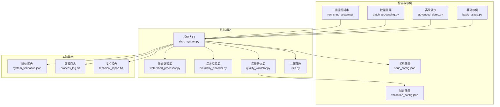
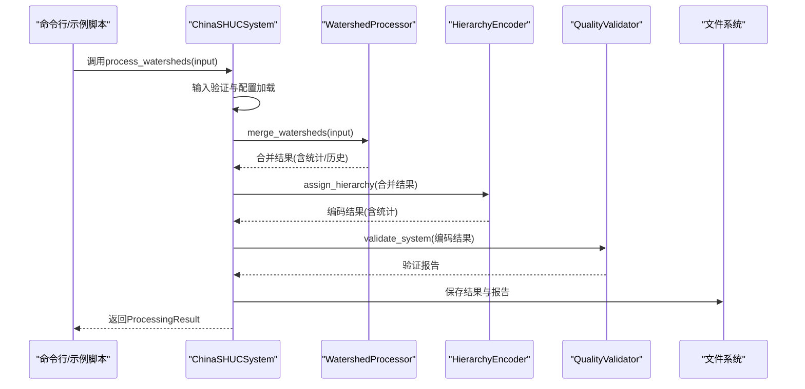
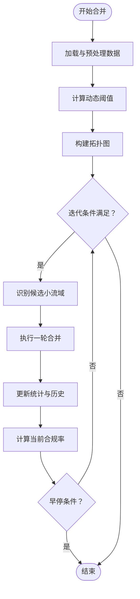
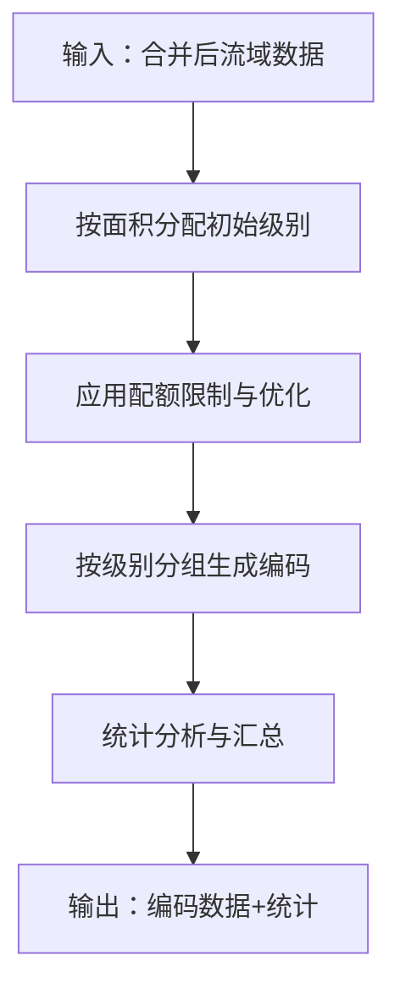
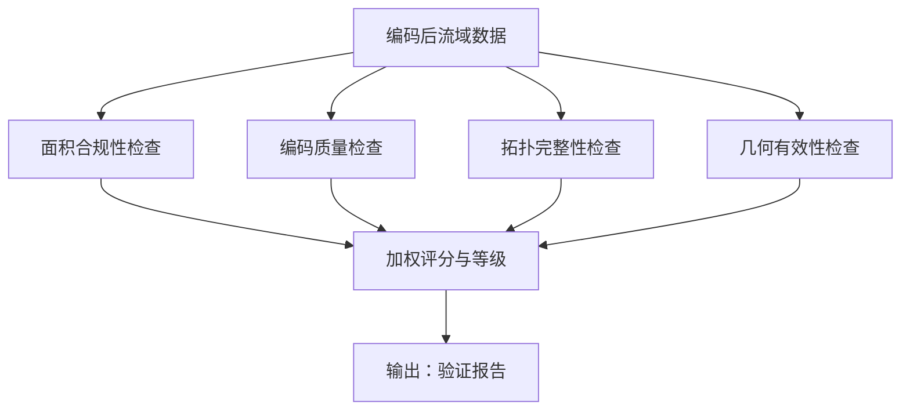
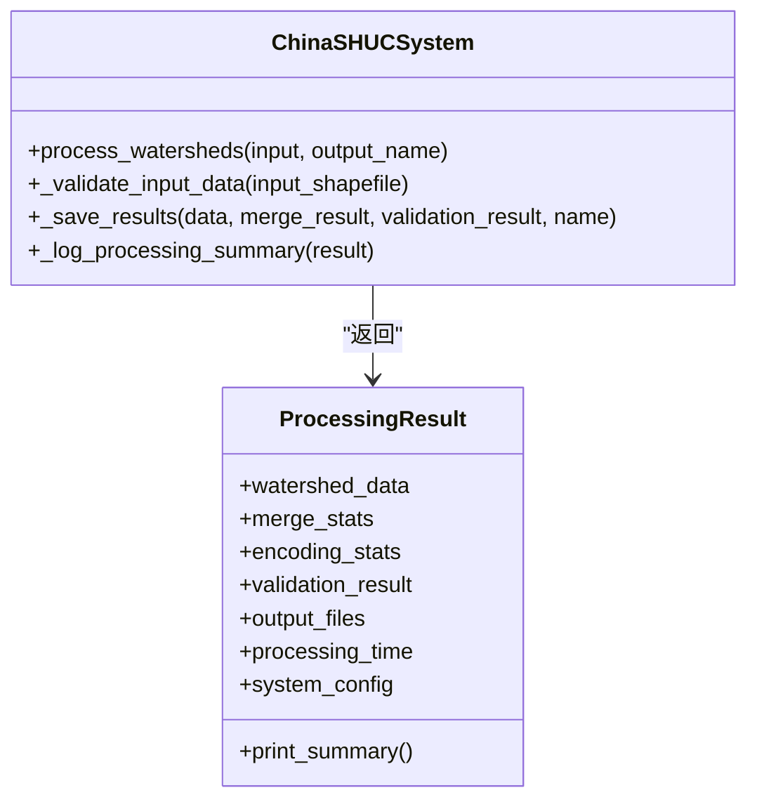
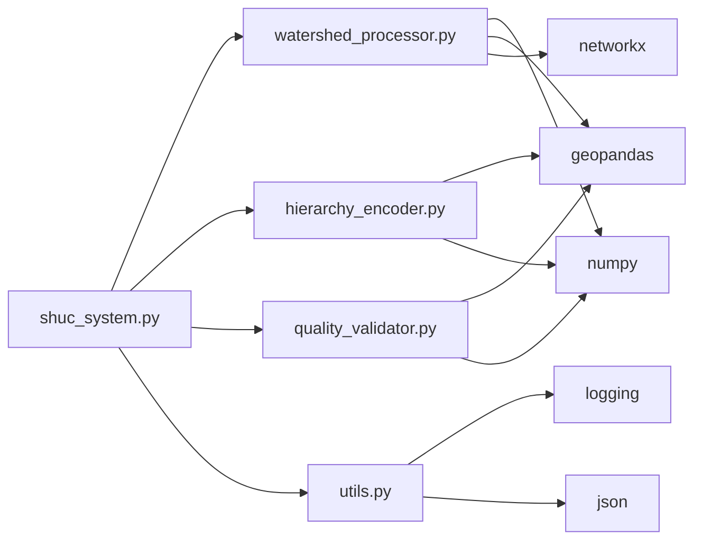

# 数据处理流程

<cite>
**本文引用的文件**
- [shuc_system.py](file://01_CORE_SYSTEM/src/shuc_system.py)
- [watershed_processor.py](file://01_CORE_SYSTEM/src/watershed_processor.py)
- [hierarchy_encoder.py](file://01_CORE_SYSTEM/src/hierarchy_encoder.py)
- [quality_validator.py](file://01_CORE_SYSTEM/src/quality_validator.py)
- [utils.py](file://01_CORE_SYSTEM/src/utils.py)
- [shuc_config.json](file://01_CORE_SYSTEM/config/shuc_config.json)
- [validation_config.json](file://01_CORE_SYSTEM/config/validation_config.json)
- [basic_usage.py](file://01_CORE_SYSTEM/examples/basic_usage.py)
- [advanced_demo.py](file://01_CORE_SYSTEM/examples/advanced_demo.py)
- [batch_processing.py](file://01_CORE_SYSTEM/examples/batch_processing.py)
- [run_shuc_system.py](file://03_EXTENSIONS/run_shuc_system.py)
- [system_validation.json](file://04_EXPERIMENTS/results/final_output/system_validation.json)
- [process_log.txt](file://04_EXPERIMENTS/results/final_output/process_log.txt)
- [technical_report.txt](file://04_EXPERIMENTS/results/final_output/technical_report.txt)
</cite>

## 目录
1. [简介](#简介)
2. [项目结构](#项目结构)
3. [核心组件](#核心组件)
4. [架构总览](#架构总览)
5. [详细组件分析](#详细组件分析)
6. [依赖关系分析](#依赖关系分析)
7. [性能考量](#性能考量)
8. [故障排除指南](#故障排除指南)
9. [结论](#结论)
10. [附录](#附录)

## 简介
本文件系统化阐述中国SHUC（System Hydrologic Unit Code）流域分级编码系统的完整数据处理流程，覆盖从输入数据到输出结果的全链路：数据预处理、智能合并、层次编码、质量验证与输出。文档面向不同技术背景的读者，既提供高层概览，也给出代码级细节、参数配置、使用示例与最佳实践，并包含质量控制与性能优化建议。

## 项目结构
系统采用模块化设计，核心逻辑分为四大模块：流域处理器、层次编码器、质量验证器与系统入口；配合工具函数与配置文件，形成可扩展、可配置、可验证的处理流水线。

**图表来源**
- [shuc_system.py:43-164](file://01_CORE_SYSTEM/src/shuc_system.py#L43-L164)
- [watershed_processor.py:24-81](file://01_CORE_SYSTEM/src/watershed_processor.py#L24-L81)
- [hierarchy_encoder.py:22-95](file://01_CORE_SYSTEM/src/hierarchy_encoder.py#L22-L95)
- [quality_validator.py:24-86](file://01_CORE_SYSTEM/src/quality_validator.py#L24-L86)
- [utils.py:64-126](file://01_CORE_SYSTEM/src/utils.py#L64-L126)
- [shuc_config.json:1-43](file://01_CORE_SYSTEM/config/shuc_config.json#L1-L43)
- [validation_config.json:1-46](file://01_CORE_SYSTEM/config/validation_config.json#L1-L46)
- [basic_usage.py:25-73](file://01_CORE_SYSTEM/examples/basic_usage.py#L25-L73)
- [advanced_demo.py:31-60](file://01_CORE_SYSTEM/examples/advanced_demo.py#L31-L60)
- [batch_processing.py:31-104](file://01_CORE_SYSTEM/examples/batch_processing.py#L31-L104)
- [run_shuc_system.py:167-210](file://03_EXTENSIONS/run_shuc_system.py#L167-L210)
- [system_validation.json:1-40](file://04_EXPERIMENTS/results/final_output/system_validation.json#L1-L40)
- [process_log.txt:1-58](file://04_EXPERIMENTS/results/final_output/process_log.txt#L1-L58)
- [technical_report.txt:1-34](file://04_EXPERIMENTS/results/final_output/technical_report.txt#L1-L34)

**章节来源**
- [shuc_system.py:43-164](file://01_CORE_SYSTEM/src/shuc_system.py#L43-L164)
- [watershed_processor.py:24-81](file://01_CORE_SYSTEM/src/watershed_processor.py#L24-L81)
- [hierarchy_encoder.py:22-95](file://01_CORE_SYSTEM/src/hierarchy_encoder.py#L22-L95)
- [quality_validator.py:24-86](file://01_CORE_SYSTEM/src/quality_validator.py#L24-L86)
- [utils.py:64-126](file://01_CORE_SYSTEM/src/utils.py#L64-L126)
- [shuc_config.json:1-43](file://01_CORE_SYSTEM/config/shuc_config.json#L1-L43)
- [validation_config.json:1-46](file://01_CORE_SYSTEM/config/validation_config.json#L1-L46)
- [basic_usage.py:25-73](file://01_CORE_SYSTEM/examples/basic_usage.py#L25-L73)
- [advanced_demo.py:31-60](file://01_CORE_SYSTEM/examples/advanced_demo.py#L31-L60)
- [batch_processing.py:31-104](file://01_CORE_SYSTEM/examples/batch_processing.py#L31-L104)
- [run_shuc_system.py:167-210](file://03_EXTENSIONS/run_shuc_system.py#L167-L210)
- [system_validation.json:1-40](file://04_EXPERIMENTS/results/final_output/system_validation.json#L1-L40)
- [process_log.txt:1-58](file://04_EXPERIMENTS/results/final_output/process_log.txt#L1-L58)
- [technical_report.txt:1-34](file://04_EXPERIMENTS/results/final_output/technical_report.txt#L1-L34)

## 核心组件
- 系统入口与编排：负责加载配置、调用各模块、保存结果与生成摘要。
- 流域处理器：实现智能合并，支持动态阈值、拓扑图构建与合并历史追踪。
- 层次编码器：基于面积的智能分级与编码生成，支持配额优化与统计分析。
- 质量验证器：多维度质量评估，包含面积合规、编码质量、拓扑完整性与几何有效性。
- 工具函数：日志、配置加载、文件校验、时间计算等通用能力。

**章节来源**
- [shuc_system.py:43-164](file://01_CORE_SYSTEM/src/shuc_system.py#L43-L164)
- [watershed_processor.py:24-81](file://01_CORE_SYSTEM/src/watershed_processor.py#L24-L81)
- [hierarchy_encoder.py:22-95](file://01_CORE_SYSTEM/src/hierarchy_encoder.py#L22-L95)
- [quality_validator.py:24-86](file://01_CORE_SYSTEM/src/quality_validator.py#L24-L86)
- [utils.py:24-126](file://01_CORE_SYSTEM/src/utils.py#L24-L126)

## 架构总览
系统以“数据驱动”的流水线为核心，按顺序执行：输入验证 → 智能合并 → 层次编码 → 质量验证 → 结果保存。各模块通过统一的配置文件进行参数化控制，便于在不同场景下灵活切换策略。

**图表来源**
- [shuc_system.py:92-159](file://01_CORE_SYSTEM/src/shuc_system.py#L92-L159)
- [watershed_processor.py:54-81](file://01_CORE_SYSTEM/src/watershed_processor.py#L54-L81)
- [hierarchy_encoder.py:69-95](file://01_CORE_SYSTEM/src/hierarchy_encoder.py#L69-L95)
- [quality_validator.py:61-86](file://01_CORE_SYSTEM/src/quality_validator.py#L61-L86)

## 详细组件分析

### 流域处理器（智能合并）
- 动态阈值计算：基于面积分位数的自适应阈值，约束在合理区间内，提升合并的稳健性。
- 拓扑图构建：利用上下游关系构建有向图，保证合并过程中的拓扑一致性。
- 合并策略：优先下游合并，其次上游、相邻与最近，迭代执行直至达到目标合规率或收敛。
- 统计与追踪：记录每轮合并数量、剩余流域数、合规率与动态阈值，支持早停与进度监控。

**图表来源**
- [watershed_processor.py:117-220](file://01_CORE_SYSTEM/src/watershed_processor.py#L117-L220)

**章节来源**
- [watershed_processor.py:54-220](file://01_CORE_SYSTEM/src/watershed_processor.py#L54-L220)

### 层次编码器（4-6级编码体系）
- 初始分级：依据面积阈值从高级别向下分配，支持对各级别的最小面积阈值进行配置。
- 配额优化：对高级别（如4、5级）施加配额限制，超配额自动降级，确保层级分布均衡。
- 编码生成：按级别与面积排序分配固定位数编码，溢出时采用安全回退策略。
- 统计输出：提供各级别数量、面积统计、唯一编码率与层级范围等指标。

**图表来源**
- [hierarchy_encoder.py:69-95](file://01_CORE_SYSTEM/src/hierarchy_encoder.py#L69-L95)

**章节来源**
- [hierarchy_encoder.py:69-219](file://01_CORE_SYSTEM/src/hierarchy_encoder.py#L69-L219)

### 质量验证器（多维评估）
- 面积合规性：动态阈值一致性校验，统计合规率与分布。
- 编码质量：唯一性、格式合法性与重复检测。
- 拓扑完整性：字段完整性、有效引用比例、孤立与环形引用检测。
- 几何有效性：空几何、无效几何与类型分布。
- 综合评分：加权计算总体评分并给出质量等级。

**图表来源**
- [quality_validator.py:61-86](file://01_CORE_SYSTEM/src/quality_validator.py#L61-L86)

**章节来源**
- [quality_validator.py:61-411](file://01_CORE_SYSTEM/src/quality_validator.py#L61-L411)

### 系统入口与结果封装
- 初始化：加载配置、设置日志、创建输出目录。
- 主流程：依次调用处理器、编码器与验证器，组装ProcessingResult。
- 结果保存：输出编码数据、验证报告与处理统计，并打印摘要。

**图表来源**
- [shuc_system.py:92-286](file://01_CORE_SYSTEM/src/shuc_system.py#L92-L286)

**章节来源**
- [shuc_system.py:92-286](file://01_CORE_SYSTEM/src/shuc_system.py#L92-L286)

## 依赖关系分析
- 模块耦合：系统入口聚合三大核心模块，彼此低耦合、高内聚；验证器依赖编码器输出；处理器独立完成几何与拓扑处理。
- 外部依赖：依赖geopandas、pandas、numpy、networkx、shapely等，工具函数提供日志与配置管理。
- 配置驱动：processing、hierarchy、validation三类配置分别控制合并策略、编码规则与验证权重。

**图表来源**
- [shuc_system.py:38-41](file://01_CORE_SYSTEM/src/shuc_system.py#L38-L41)
- [watershed_processor.py:15-22](file://01_CORE_SYSTEM/src/watershed_processor.py#L15-L22)
- [hierarchy_encoder.py:15-20](file://01_CORE_SYSTEM/src/hierarchy_encoder.py#L15-L20)
- [quality_validator.py:17-22](file://01_CORE_SYSTEM/src/quality_validator.py#L17-L22)
- [utils.py:16-22](file://01_CORE_SYSTEM/src/utils.py#L16-L22)

**章节来源**
- [shuc_system.py:38-41](file://01_CORE_SYSTEM/src/shuc_system.py#L38-L41)
- [watershed_processor.py:15-22](file://01_CORE_SYSTEM/src/watershed_processor.py#L15-L22)
- [hierarchy_encoder.py:15-20](file://01_CORE_SYSTEM/src/hierarchy_encoder.py#L15-L20)
- [quality_validator.py:17-22](file://01_CORE_SYSTEM/src/quality_validator.py#L17-L22)
- [utils.py:16-22](file://01_CORE_SYSTEM/src/utils.py#L16-L22)

## 性能考量
- 动态阈值：避免固定阈值导致的过度或不足合并，提高整体合规率与压缩效率。
- 早停机制：当合规率达到目标或无进展时提前结束，减少不必要计算。
- 拓扑图优化：利用有向图快速定位上下游关系，降低合并搜索复杂度。
- 批量处理：通过示例脚本展示多配置对比与性能基准测试，便于选择最优策略。
- I/O与内存：建议控制最大内存使用与启用进度显示，避免大规模数据时的资源瓶颈。

[本节为通用性能建议，无需特定文件引用]

## 故障排除指南
- 输入数据问题
  - 缺失字段：检查是否存在必需字段（如LINKNO、DSLINKNO1、USLINKNO2），缺失会触发警告或验证失败。
  - 几何无效：系统会尝试修复无效几何，若仍失败，需人工检查原始数据。
  - 文件不存在：确认输入路径与文件扩展名完整。
- 合并不收敛
  - 调整目标合规率、最大迭代次数或合并策略；检查拓扑图是否形成环或大量孤立节点。
- 编码冲突
  - 若编码空间不足，系统采用回退策略；可通过降低级别或放宽阈值缓解。
- 验证未通过
  - 关注面积合规率、编码唯一性与拓扑完整性三项关键指标，逐项排查并修正数据。
- 日志与报告
  - 查看处理日志与验证报告，定位具体阶段与问题类型；结合技术报告进行宏观评估。

**章节来源**
- [shuc_system.py:165-196](file://01_CORE_SYSTEM/src/shuc_system.py#L165-L196)
- [watershed_processor.py:97-115](file://01_CORE_SYSTEM/src/watershed_processor.py#L97-L115)
- [quality_validator.py:334-366](file://01_CORE_SYSTEM/src/quality_validator.py#L334-L366)
- [process_log.txt:1-58](file://04_EXPERIMENTS/results/final_output/process_log.txt#L1-L58)
- [system_validation.json:1-40](file://04_EXPERIMENTS/results/final_output/system_validation.json#L1-L40)
- [technical_report.txt:1-34](file://04_EXPERIMENTS/results/final_output/technical_report.txt#L1-L34)

## 结论
本系统以“动态阈值自适应 + 智能拓扑合并 + 分层编码 + 全面质量验证”为核心，形成稳定、可扩展且可配置的SHUC数据处理流水线。通过示例脚本与一键运行脚本，用户可快速上手；通过配置文件与工具函数，可实现高级定制与批量处理。建议在实际应用中结合数据特点调整参数，并持续关注验证报告以保障质量。

[本节为总结性内容，无需特定文件引用]

## 附录

### 使用示例与最佳实践
- 基础用法
  - 直接运行示例脚本，查看处理摘要与输出文件信息。
- 高级功能
  - 自定义配置：在示例中演示保守/激进策略对比与数据质量分析。
  - 批量处理：通过批处理器对比多配置，生成统计报表与推荐配置。
- 一键运行
  - 使用扩展脚本自动准备数据、检查环境并运行完整流程，输出可视化与报告。

**章节来源**
- [basic_usage.py:25-73](file://01_CORE_SYSTEM/examples/basic_usage.py#L25-L73)
- [advanced_demo.py:31-60](file://01_CORE_SYSTEM/examples/advanced_demo.py#L31-L60)
- [batch_processing.py:227-327](file://01_CORE_SYSTEM/examples/batch_processing.py#L227-L327)
- [run_shuc_system.py:167-210](file://03_EXTENSIONS/run_shuc_system.py#L167-L210)

### 数据格式与输入输出规范
- 输入
  - Shapefile：包含几何字段与拓扑字段（LINKNO、DSLINKNO1、USLINKNO2等），面积字段可选（系统自动计算）。
- 中间结果
  - 合并后流域数据（含面积与拓扑）、合并统计与历史。
- 输出
  - 编码后的流域Shapefile、验证报告JSON、处理统计JSON、技术报告文本与处理日志。

**章节来源**
- [shuc_system.py:198-237](file://01_CORE_SYSTEM/src/shuc_system.py#L198-L237)
- [system_validation.json:1-40](file://04_EXPERIMENTS/results/final_output/system_validation.json#L1-L40)
- [technical_report.txt:1-34](file://04_EXPERIMENTS/results/final_output/technical_report.txt#L1-L34)
- [process_log.txt:1-58](file://04_EXPERIMENTS/results/final_output/process_log.txt#L1-L58)

### 关键决策点与质量控制
- 动态阈值：基于数据分布自适应调整，兼顾全局与局部特征。
- 合并策略：优先下游，其次上游、相邻与最近，平衡拓扑与几何一致性。
- 层级配额：防止高级别过度集中，提升层级分布均衡性。
- 质量权重：面积合规（40%）、编码质量（30%）、拓扑完整性（20%）、几何有效性（10%）。

**章节来源**
- [watershed_processor.py:117-141](file://01_CORE_SYSTEM/src/watershed_processor.py#L117-L141)
- [hierarchy_encoder.py:113-138](file://01_CORE_SYSTEM/src/hierarchy_encoder.py#L113-L138)
- [quality_validator.py:49-60](file://01_CORE_SYSTEM/src/quality_validator.py#L49-L60)

### 配置参数说明
- processing：目标合规率、合并策略、最大迭代次数、早停开关与阈值模式。
- hierarchy：各级别最小面积阈值与配额策略。
- validation：各项阈值与权重，支持导出验证报告与统计。
- output/performance：中间结果保存、日志详细程度、内存上限与进度显示。

**章节来源**
- [shuc_config.json:1-43](file://01_CORE_SYSTEM/config/shuc_config.json#L1-L43)
- [validation_config.json:1-46](file://01_CORE_SYSTEM/config/validation_config.json#L1-L46)