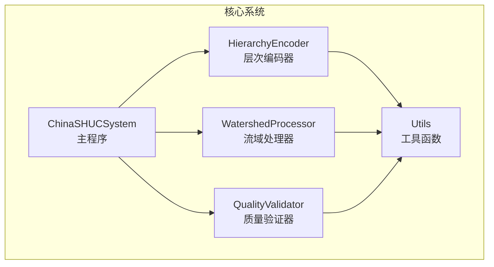
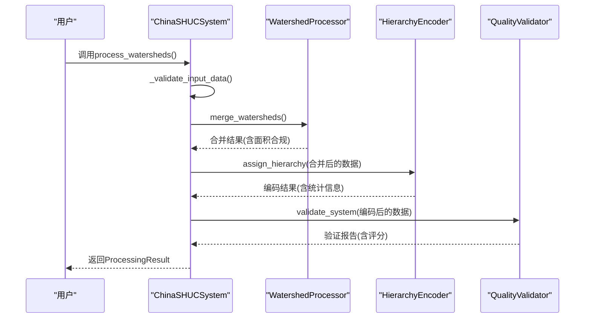
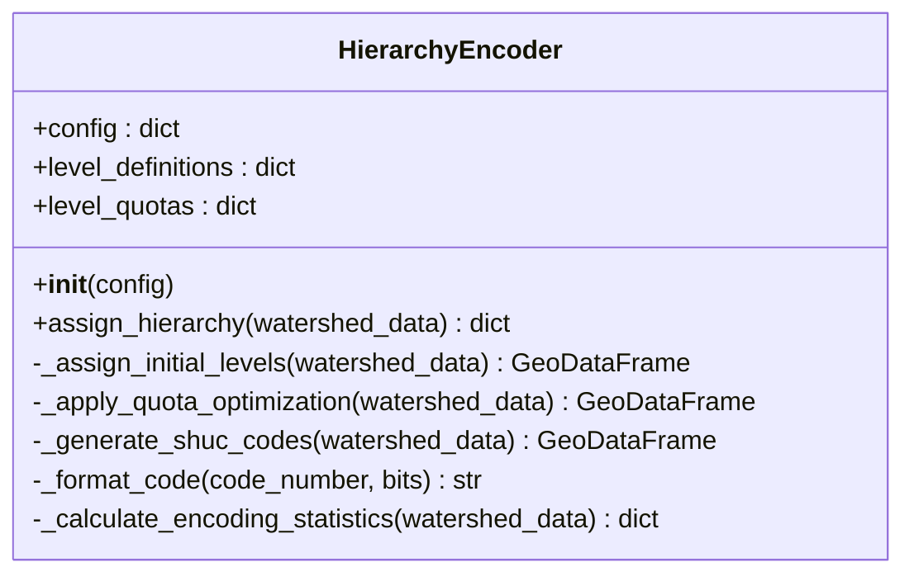
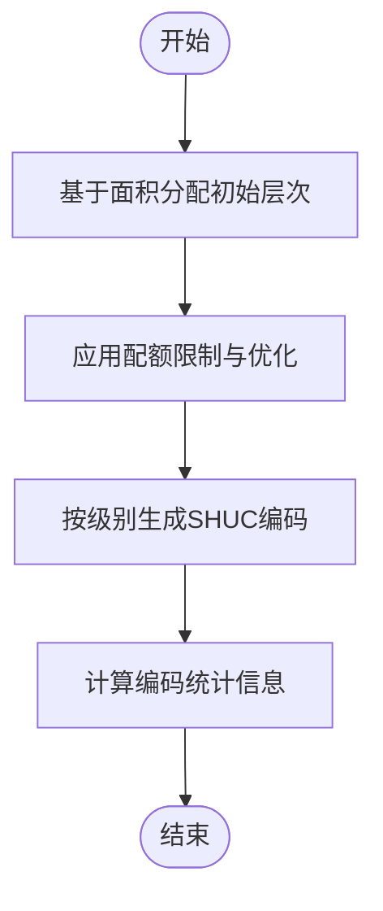
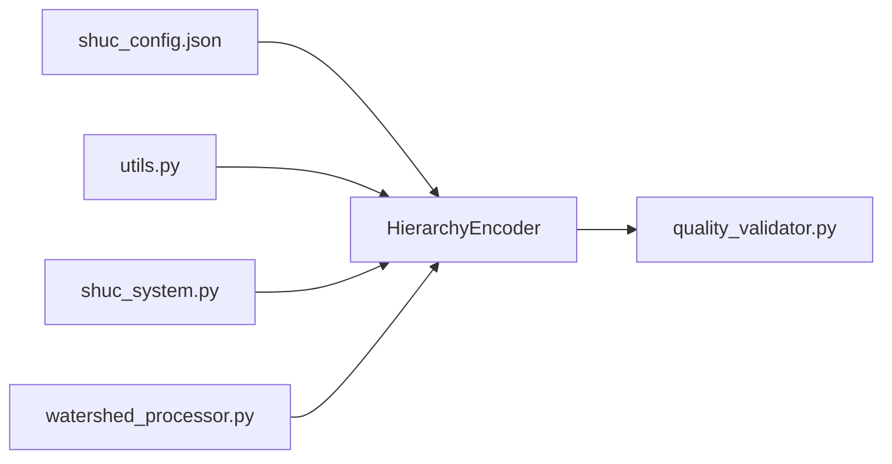

# 层次编码器

<cite>
**本文引用的文件**   
- [hierarchy_encoder.py](file://01_CORE_SYSTEM/src/hierarchy_encoder.py)
- [shuc_system.py](file://01_CORE_SYSTEM/src/shuc_system.py)
- [watershed_processor.py](file://01_CORE_SYSTEM/src/watershed_processor.py)
- [quality_validator.py](file://01_CORE_SYSTEM/src/quality_validator.py)
- [utils.py](file://01_CORE_SYSTEM/src/utils.py)
- [shuc_config.json](file://01_CORE_SYSTEM/config/shuc_config.json)
- [basic_usage.py](file://01_CORE_SYSTEM/examples/basic_usage.py)
- [advanced_demo.py](file://01_CORE_SYSTEM/examples/advanced_demo.py)
- [huc_standards.json](file://05_DATA/reference/huc_standards.json)
- [README.md](file://README.md)
</cite>

## 目录
1. [简介](#简介)
2. [项目结构](#项目结构)
3. [核心组件](#核心组件)
4. [架构概览](#架构概览)
5. [详细组件分析](#详细组件分析)
6. [依赖分析](#依赖分析)
7. [性能考量](#性能考量)
8. [故障排查指南](#故障排查指南)
9. [结论](#结论)
10. [附录](#附录)

## 简介
本文件针对层次编码器组件（HierarchyEncoder）进行深入技术文档编写，重点阐述其编码算法实现、6级12位完整编码体系的设计原理、层级分配策略与配额管理机制、基于面积的智能分级算法、编码生成规则与冲突解决策略、编码唯一性保证机制、层次结构维护方法与数据一致性检查，并提供配置参数说明、使用示例与最佳实践指南。同时，解释该编码标准与国际HUC系统的兼容性与差异。

## 项目结构
层次编码器位于核心系统模块中，作为中国SHUC系统的一个独立组件，负责将经过智能合并后的流域数据分配到合适的层次并生成唯一的SHUC编码。系统整体流程由主程序协调，依次完成数据预处理、智能合并、层次编码、质量验证与结果保存。

**图表来源**
- [shuc_system.py:43-91](file://01_CORE_SYSTEM/src/shuc_system.py#L43-L91)
- [hierarchy_encoder.py:22-30](file://01_CORE_SYSTEM/src/hierarchy_encoder.py#L22-L30)
- [watershed_processor.py:24-33](file://01_CORE_SYSTEM/src/watershed_processor.py#L24-L33)
- [quality_validator.py:24-33](file://01_CORE_SYSTEM/src/quality_validator.py#L24-L33)
- [utils.py:16-23](file://01_CORE_SYSTEM/src/utils.py#L16-L23)

**章节来源**
- [shuc_system.py:43-91](file://01_CORE_SYSTEM/src/shuc_system.py#L43-L91)
- [README.md:1-88](file://README.md#L1-L88)

## 核心组件
- 层次编码器（HierarchyEncoder）：实现基于面积的智能分级、配额管理与编码生成，负责为每个流域分配合适的层次并生成唯一编码。
- 流域处理器（WatershedProcessor）：在编码前完成智能合并，确保面积合规率达标，为编码提供高质量输入。
- 质量验证器（QualityValidator）：对编码结果进行全面质量评估，包括面积合规性、编码唯一性、拓扑完整性与几何有效性。
- 工具函数（Utils）：提供日志、配置加载、文件操作等通用能力，支撑各组件运行。

**章节来源**
- [hierarchy_encoder.py:22-30](file://01_CORE_SYSTEM/src/hierarchy_encoder.py#L22-L30)
- [watershed_processor.py:24-33](file://01_CORE_SYSTEM/src/watershed_processor.py#L24-L33)
- [quality_validator.py:24-33](file://01_CORE_SYSTEM/src/quality_validator.py#L24-L33)
- [utils.py:16-23](file://01_CORE_SYSTEM/src/utils.py#L16-L23)

## 架构概览
层次编码器在系统中的调用顺序如下：主程序先完成数据验证与智能合并，再调用层次编码器进行层次分配与编码生成，最后由质量验证器进行综合评估。

**图表来源**
- [shuc_system.py:92-163](file://01_CORE_SYSTEM/src/shuc_system.py#L92-L163)
- [watershed_processor.py:54-81](file://01_CORE_SYSTEM/src/watershed_processor.py#L54-L81)
- [hierarchy_encoder.py:69-95](file://01_CORE_SYSTEM/src/hierarchy_encoder.py#L69-L95)
- [quality_validator.py:61-86](file://01_CORE_SYSTEM/src/quality_validator.py#L61-L86)

## 详细组件分析

### HierarchyEncoder 类分析
HierarchyEncoder 是层次编码器的核心实现，负责：
- 基于面积的初始层次分配
- 配额限制下的优化调整
- 生成固定位宽的SHUC编码
- 计算编码统计信息

**图表来源**
- [hierarchy_encoder.py:22-219](file://01_CORE_SYSTEM/src/hierarchy_encoder.py#L22-L219)

#### 算法流程（基于面积的智能分级与配额优化）

**图表来源**
- [hierarchy_encoder.py:69-95](file://01_CORE_SYSTEM/src/hierarchy_encoder.py#L69-L95)
- [hierarchy_encoder.py:97-138](file://01_CORE_SYSTEM/src/hierarchy_encoder.py#L97-L138)
- [hierarchy_encoder.py:140-169](file://01_CORE_SYSTEM/src/hierarchy_encoder.py#L140-L169)
- [hierarchy_encoder.py:177-219](file://01_CORE_SYSTEM/src/hierarchy_encoder.py#L177-L219)

#### 编码生成规则与冲突解决策略
- 编码位宽与级别映射：每个级别对应固定位宽，确保编码长度一致且具备层级语义。
- 编码分配策略：同一级别内按面积降序排序后依次分配编码，保证面积较大的流域优先获得较小的编码值。
- 编码溢出处理：当同一级别的编码空间不足时，采用后缀标识以避免冲突。
- 配额冲突解决：若某级别超出配额，系统自动将部分面积较小的流域降级至下一级，以满足配额限制。

**章节来源**
- [hierarchy_encoder.py:42-67](file://01_CORE_SYSTEM/src/hierarchy_encoder.py#L42-L67)
- [hierarchy_encoder.py:97-138](file://01_CORE_SYSTEM/src/hierarchy_encoder.py#L97-L138)
- [hierarchy_encoder.py:140-169](file://01_CORE_SYSTEM/src/hierarchy_encoder.py#L140-L169)

#### 编码唯一性保证机制
- 同级别内严格按面积排序分配，避免重复编码。
- 不同级别之间编码空间完全独立，天然避免跨级冲突。
- 若发生溢出，采用后缀标识，确保最终编码唯一。

**章节来源**
- [hierarchy_encoder.py:140-169](file://01_CORE_SYSTEM/src/hierarchy_encoder.py#L140-L169)

#### 层次结构维护与数据一致性检查
- 层级范围统计：记录最小与最大层级，确保层次结构连续性。
- 面积统计：提供各级别的面积分布统计，便于一致性检查。
- 编码唯一性率：用于衡量编码质量，确保系统输出的编码具备唯一性。

**章节来源**
- [hierarchy_encoder.py:177-219](file://01_CORE_SYSTEM/src/hierarchy_encoder.py#L177-L219)

### 配置参数说明
- 层级面积阈值（来自配置文件）：level_4_min_area、level_5_min_area、level_6_min_area，分别控制第4、5、6级的最小面积阈值。
- 配额开关与配额限制：enable_level_quotas 与 level_quotas，控制是否启用配额以及各级别的配额上限。
- 其他配置：processing、validation、output、performance 等，影响系统整体行为。

**章节来源**
- [shuc_config.json:9-19](file://01_CORE_SYSTEM/config/shuc_config.json#L9-L19)
- [hierarchy_encoder.py:32-67](file://01_CORE_SYSTEM/src/hierarchy_encoder.py#L32-L67)

### 使用示例与最佳实践
- 基础使用：通过 examples/basic_usage.py 展示如何初始化系统、处理数据并查看结果摘要。
- 高级功能：examples/advanced_demo.py 展示自定义配置、数据质量分析、批量处理与结果对比分析。
- 最佳实践建议：
  - 在不同区域部署时，根据数据分布调整层级面积阈值，以提升编码质量与层次平衡。
  - 合理设置配额，避免某一级别过度集中导致层次失衡。
  - 使用质量验证器的输出指标（如面积合规率、编码唯一性率、层次范围）进行持续监控。

**章节来源**
- [basic_usage.py:25-74](file://01_CORE_SYSTEM/examples/basic_usage.py#L25-L74)
- [advanced_demo.py:31-61](file://01_CORE_SYSTEM/examples/advanced_demo.py#L31-L61)
- [advanced_demo.py:169-228](file://01_CORE_SYSTEM/examples/advanced_demo.py#L169-L228)

### 编码规则图表与算法伪代码
- 编码规则图表（示意）
  - 级别与位宽映射：第4级2位、第5级4位、第6级6位；第7级及以上扩展至12位。
  - 面积阈值：随级别递增而增大，确保编码粒度与空间尺度匹配。
  - 配额限制：第4级最多3个、第5级最多8个，第6级无限制。
- 算法伪代码（简化版）
  - 输入：合并后的流域数据（含面积字段）
  - 步骤：
    1) 基于面积阈值分配初始层次
    2) 统计各级别数量，应用配额限制，必要时将超配额的最小面积流域降级
    3) 按级别分组，按面积降序分配编码，处理溢出情况
    4) 计算统计信息并返回结果

**章节来源**
- [hierarchy_encoder.py:42-67](file://01_CORE_SYSTEM/src/hierarchy_encoder.py#L42-L67)
- [hierarchy_encoder.py:97-138](file://01_CORE_SYSTEM/src/hierarchy_encoder.py#L97-L138)
- [hierarchy_encoder.py:140-169](file://01_CORE_SYSTEM/src/hierarchy_encoder.py#L140-L169)
- [hierarchy_encoder.py:177-219](file://01_CORE_SYSTEM/src/hierarchy_encoder.py#L177-L219)

### 与国际HUC系统的兼容性与差异
- 兼容性：中国SHUC系统在6级编码基础上，借鉴HUC的层级思想，形成“4-6级完整层次结构”，并进一步细化到12位编码，以满足更细粒度的空间管理需求。
- 差异点：
  - 面积阈值与典型面积范围：中国SHUC基于国内地理环境进行了调整，例如第6级（基本单元）的典型面积范围与HUC-12一致，但阈值更贴合中国实际。
  - 层级映射：中国SHUC将1级到6级与HUC的区域、子区域、水文盆地、子流域等概念进行适配，形成适合中国水系特征的分级体系。
  - 配额与平衡：中国SHUC在编码层面引入配额管理，以维持层次结构的均衡性，这在HUC标准中并不直接体现。

**章节来源**
- [huc_standards.json:7-127](file://05_DATA/reference/huc_standards.json#L7-L127)
- [hierarchy_encoder.py:42-49](file://01_CORE_SYSTEM/src/hierarchy_encoder.py#L42-L49)

## 依赖分析
- HierarchyEncoder 依赖：
  - 配置参数（来自 shuc_config.json），用于定义层级面积阈值与配额策略。
  - 工具函数（utils.py），用于日志与配置加载等辅助功能。
  - 主程序（shuc_system.py）在处理流程中调用 HierarchyEncoder 的 assign_hierarchy 方法。
- 与其他组件的关系：
  - 在主流程中，WatershedProcessor 提供合并后的数据，HierarchyEncoder 在此基础上进行层次分配与编码生成。
  - QualityValidator 在编码完成后进行质量评估，确保编码唯一性、层次完整性与几何有效性。

**图表来源**
- [shuc_config.json:1-43](file://01_CORE_SYSTEM/config/shuc_config.json#L1-L43)
- [hierarchy_encoder.py:32-67](file://01_CORE_SYSTEM/src/hierarchy_encoder.py#L32-L67)
- [shuc_system.py:76-80](file://01_CORE_SYSTEM/src/shuc_system.py#L76-L80)
- [watershed_processor.py:76-81](file://01_CORE_SYSTEM/src/watershed_processor.py#L76-L81)
- [quality_validator.py:78-86](file://01_CORE_SYSTEM/src/quality_validator.py#L78-L86)

**章节来源**
- [shuc_system.py:76-80](file://01_CORE_SYSTEM/src/shuc_system.py#L76-L80)
- [hierarchy_encoder.py:32-67](file://01_CORE_SYSTEM/src/hierarchy_encoder.py#L32-L67)

## 性能考量
- 时间复杂度：
  - 初始层次分配：O(N)，遍历一次数据按面积阈值赋值。
  - 配额优化：对超配额级别进行排序与降级，整体约 O(K log K)，K 为该级别流域数量。
  - 编码生成：按级别分组后排序分配，整体约 O(N log N)。
- 空间复杂度：O(N)，存储中间结果与统计信息。
- 优化建议：
  - 合理设置层级面积阈值，减少不必要的降级与重排。
  - 在大规模数据场景下，可考虑分批处理或并行化（若启用并行处理）。

[本节为一般性性能讨论，无需特定文件引用]

## 故障排查指南
- 输入数据问题：
  - 确认输入Shapefile存在且可读，字段包含必要的拓扑与几何信息。
  - 使用工具函数 validate_shapefile 进行初步验证。
- 编码异常：
  - 检查是否存在编码溢出（同一级别编码空间不足），可通过调整配额或扩大位宽解决。
  - 确认编码唯一性率是否达标，必要时重新生成编码。
- 层次不平衡：
  - 若某级别过度集中，适当提高该级别的面积阈值或降低配额上限，促使更多流域向更低级别迁移。
- 质量验证不通过：
  - 关注面积合规率、编码唯一性、拓扑完整性与几何有效性等指标，逐项排查问题并调整配置。

**章节来源**
- [utils.py:159-221](file://01_CORE_SYSTEM/src/utils.py#L159-L221)
- [quality_validator.py:100-122](file://01_CORE_SYSTEM/src/quality_validator.py#L100-L122)
- [quality_validator.py:142-168](file://01_CORE_SYSTEM/src/quality_validator.py#L142-L168)
- [quality_validator.py:191-223](file://01_CORE_SYSTEM/src/quality_validator.py#L191-L223)
- [quality_validator.py:255-284](file://01_CORE_SYSTEM/src/quality_validator.py#L255-L284)

## 结论
HierarchyEncoder 通过基于面积的智能分级与配额管理，实现了从4级到6级的完整层次编码体系，并以固定位宽编码确保编码唯一性与层级语义清晰。结合质量验证器的多维评估，系统能够稳定输出高质量的编码结果，满足中国流域精细化管理的需求。与国际HUC标准相比，中国SHUC在阈值设定与配额策略上进行了本土化适配，既保持了与HUC的兼容性，又提升了对国内地理环境的适用性。

[本节为总结性内容，无需特定文件引用]

## 附录
- 使用示例路径：
  - 基础使用：[basic_usage.py:25-74](file://01_CORE_SYSTEM/examples/basic_usage.py#L25-L74)
  - 高级功能：[advanced_demo.py:31-61](file://01_CORE_SYSTEM/examples/advanced_demo.py#L31-L61)
- 配置文件路径：
  - [shuc_config.json:1-43](file://01_CORE_SYSTEM/config/shuc_config.json#L1-L43)
- 参考标准：
  - [huc_standards.json:1-151](file://05_DATA/reference/huc_standards.json#L1-L151)