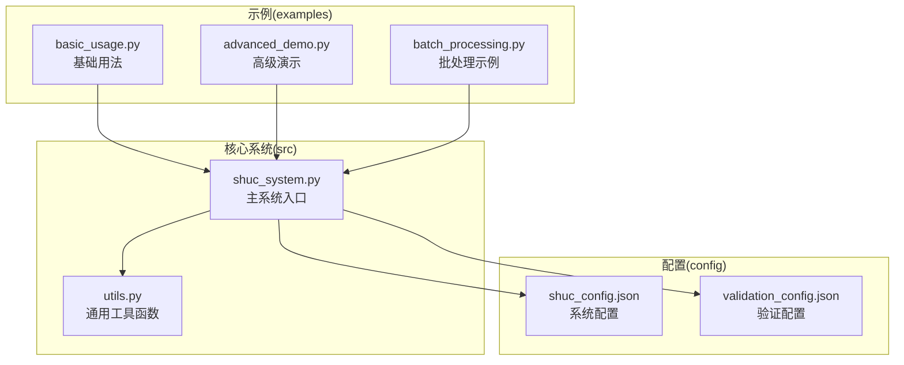
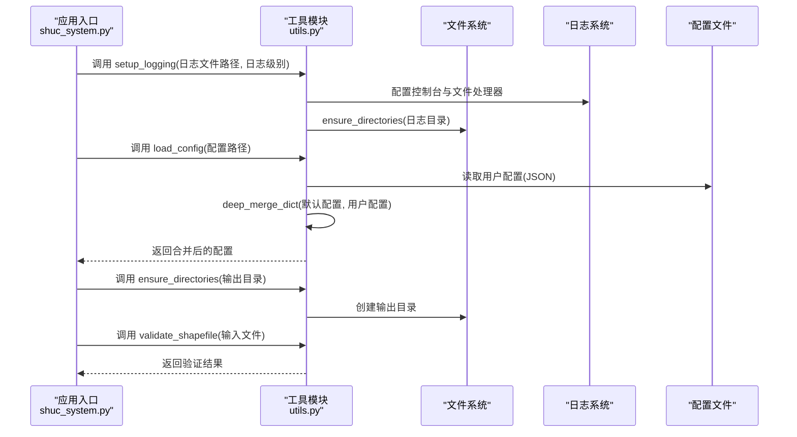
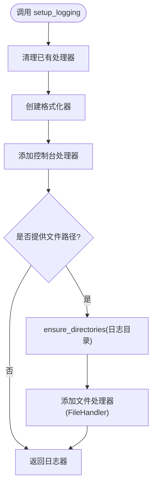
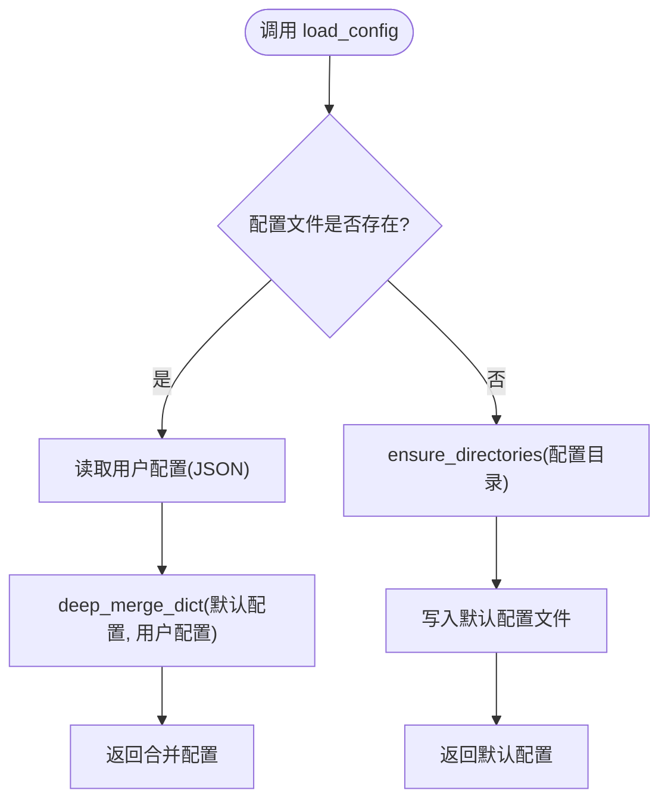
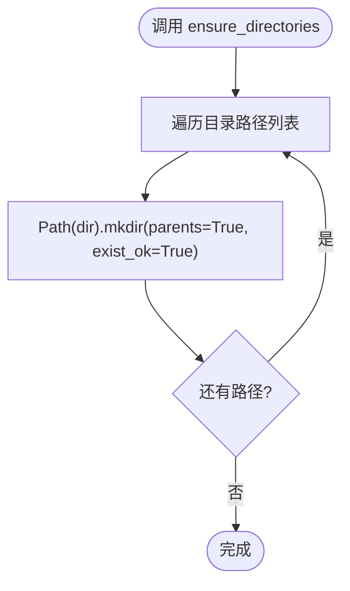
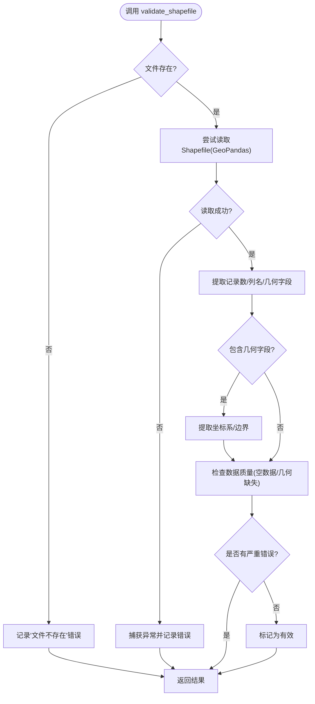
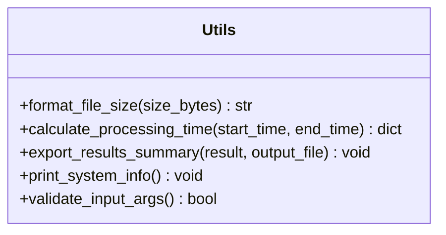
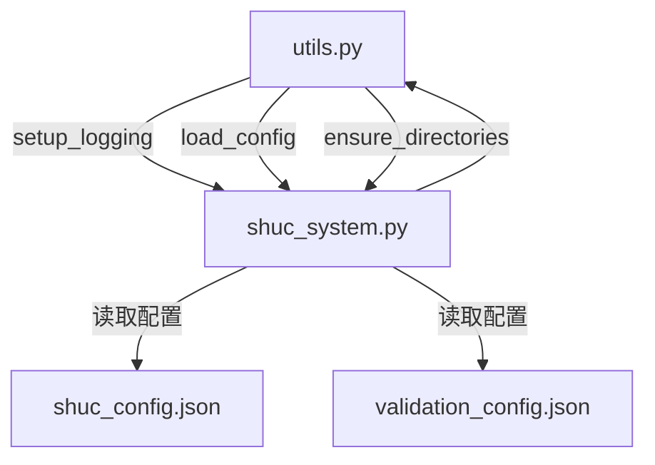

# 工具组件

<cite>
**本文引用的文件**
- [utils.py](file://01_CORE_SYSTEM/src/utils.py)
- [shuc_system.py](file://01_CORE_SYSTEM/src/shuc_system.py)
- [shuc_config.json](file://01_CORE_SYSTEM/config/shuc_config.json)
- [validation_config.json](file://01_CORE_SYSTEM/config/validation_config.json)
- [basic_usage.py](file://01_CORE_SYSTEM/examples/basic_usage.py)
- [advanced_demo.py](file://01_CORE_SYSTEM/examples/advanced_demo.py)
- [batch_processing.py](file://01_CORE_SYSTEM/examples/batch_processing.py)
</cite>

## 目录
1. [简介](#简介)
2. [项目结构](#项目结构)
3. [核心组件](#核心组件)
4. [架构总览](#架构总览)
5. [详细组件分析](#详细组件分析)
6. [依赖关系分析](#依赖关系分析)
7. [性能考量](#性能考量)
8. [故障排查指南](#故障排查指南)
9. [结论](#结论)
10. [附录](#附录)

## 简介
本文件面向工具组件模块，系统性梳理并说明 utils.py 中的通用工具函数与辅助能力，重点覆盖以下方面：
- 日志配置：setup_logging 的日志级别控制、文件轮转机制与格式化配置
- 配置管理：load_config 的配置加载流程、参数验证与默认值处理
- 路径与目录：ensure_directories 的目录创建策略、权限管理与错误处理
- 数据验证：validate_shapefile 的数据完整性与几何校验
- 其他实用工具：文件大小格式化、处理时间计算、结果摘要导出、系统信息打印、输入参数校验等
- 组合使用模式：工具函数之间的依赖关系与在系统中的协同工作方式

## 项目结构
工具组件位于核心系统 src 目录下，配合 config 目录中的配置文件与 examples 目录中的使用示例共同构成完整的工具链。

**图示来源**
- [utils.py:1-360](file://01_CORE_SYSTEM/src/utils.py#L1-L360)
- [shuc_system.py:1-200](file://01_CORE_SYSTEM/src/shuc_system.py#L1-L200)
- [shuc_config.json:1-43](file://01_CORE_SYSTEM/config/shuc_config.json#L1-L43)
- [validation_config.json:1-46](file://01_CORE_SYSTEM/config/validation_config.json#L1-L46)
- [basic_usage.py:1-106](file://01_CORE_SYSTEM/examples/basic_usage.py#L1-L106)
- [advanced_demo.py:1-272](file://01_CORE_SYSTEM/examples/advanced_demo.py#L1-L272)
- [batch_processing.py:1-327](file://01_CORE_SYSTEM/examples/batch_processing.py#L1-L327)

**章节来源**
- [utils.py:1-360](file://01_CORE_SYSTEM/src/utils.py#L1-L360)
- [shuc_system.py:1-200](file://01_CORE_SYSTEM/src/shuc_system.py#L1-L200)

## 核心组件
本节对工具函数进行分类与要点说明，便于快速定位与理解。

- 日志配置
  - setup_logging：统一配置控制台与文件日志，支持指定日志级别与输出路径
- 配置管理
  - load_config：按需加载用户配置，缺失时自动创建默认配置文件，并与默认配置深度合并
  - get_default_config：提供系统默认配置模板
  - deep_merge_dict：递归合并字典，保证嵌套配置的完整性
- 目录与路径
  - ensure_directories：批量创建目录，支持多层级父目录自动创建
- 数据验证
  - validate_shapefile：对 Shapefile 文件进行存在性、可读性、几何字段、坐标系、边界等检查
- 实用工具
  - format_file_size：人类可读的文件大小格式化
  - calculate_processing_time：处理时长计算与格式化
  - export_results_summary：导出处理结果摘要至 JSON
  - print_system_info：打印系统环境与依赖版本信息
  - validate_input_args：检查运行环境与依赖包

**章节来源**
- [utils.py:24-360](file://01_CORE_SYSTEM/src/utils.py#L24-L360)

## 架构总览
工具组件在系统中的位置与交互如下：

**图示来源**
- [shuc_system.py:70-75](file://01_CORE_SYSTEM/src/shuc_system.py#L70-L75)
- [utils.py:24-157](file://01_CORE_SYSTEM/src/utils.py#L24-L157)

## 详细组件分析

### 日志配置：setup_logging
- 功能概述
  - 统一配置日志器，支持控制台输出与可选的文件输出
  - 支持传入日志级别与日志文件路径
  - 清理已有处理器，避免重复输出
- 日志级别控制
  - 接收日志级别参数，应用于控制台与文件处理器
- 文件轮转机制
  - 当前实现使用标准库 FileHandler，未内置轮转策略；如需轮转，建议结合外部轮转方案或第三方库
- 格式化配置
  - 时间格式为小时:分钟:秒
  - 输出格式包含时间戳、级别与消息
- 目录创建
  - 若提供日志文件路径，则自动创建其父目录

**图示来源**
- [utils.py:24-62](file://01_CORE_SYSTEM/src/utils.py#L24-L62)

**章节来源**
- [utils.py:24-62](file://01_CORE_SYSTEM/src/utils.py#L24-L62)

### 配置管理：load_config 与默认配置
- 配置加载流程
  - 若配置文件存在：读取用户配置，与默认配置进行深度合并
  - 若配置文件不存在：自动创建默认配置文件，并返回默认配置
- 参数验证与默认值处理
  - 默认配置由 get_default_config 提供
  - 深度合并保证嵌套字典的逐层覆盖
- 与系统集成
  - 主系统在初始化阶段调用 load_config 加载配置，并据此初始化各子系统组件

**图示来源**
- [utils.py:64-99](file://01_CORE_SYSTEM/src/utils.py#L64-L99)
- [utils.py:101-126](file://01_CORE_SYSTEM/src/utils.py#L101-L126)
- [utils.py:128-147](file://01_CORE_SYSTEM/src/utils.py#L128-L147)

**章节来源**
- [utils.py:64-147](file://01_CORE_SYSTEM/src/utils.py#L64-L147)
- [shuc_system.py:74-74](file://01_CORE_SYSTEM/src/shuc_system.py#L74-L74)

### 目录与路径：ensure_directories
- 目录创建策略
  - 支持批量创建目录
  - 自动创建多层级父目录（parents=True）
  - 已存在时不报错（exist_ok=True）
- 权限管理
  - 依赖系统默认权限策略；若需特定权限，可在上层逻辑中显式设置
- 错误处理
  - 该函数不抛出异常，适合在工具链中安全调用

**图示来源**
- [utils.py:149-157](file://01_CORE_SYSTEM/src/utils.py#L149-L157)

**章节来源**
- [utils.py:149-157](file://01_CORE_SYSTEM/src/utils.py#L149-L157)

### 数据验证：validate_shapefile
- 验证维度
  - 文件存在性、可读性、记录数量、几何字段、坐标系、边界、列名等
- 错误收集
  - 将各类错误累积到 errors 列表，便于后续处理
- 结果结构
  - 返回包含布尔标志、计数、元信息与错误列表的字典

**图示来源**
- [utils.py:159-221](file://01_CORE_SYSTEM/src/utils.py#L159-L221)

**章节来源**
- [utils.py:159-221](file://01_CORE_SYSTEM/src/utils.py#L159-L221)

### 实用工具：文件大小、处理时间、结果导出、系统信息与输入校验
- 文件大小格式化：将字节数转换为 B/KB/MB/GB/TB 的人类可读格式
- 处理时间计算：支持起止时间差计算与格式化输出
- 结果摘要导出：将处理统计、输出文件、系统配置与验证详情导出为 JSON
- 系统信息打印：打印 Python 版本与关键依赖版本
- 输入参数校验：检查 Python 版本与必需依赖包

**图示来源**
- [utils.py:223-346](file://01_CORE_SYSTEM/src/utils.py#L223-L346)

**章节来源**
- [utils.py:223-346](file://01_CORE_SYSTEM/src/utils.py#L223-L346)

## 依赖关系分析
工具函数之间的耦合与协作如下：

- 直接依赖
  - shuc_system.py 直接导入并使用 utils.py 中的 setup_logging、load_config、ensure_directories
- 间接依赖
  - 配置文件作为外部资源被 load_config 读取与写入
- 循环依赖
  - 未发现循环依赖，模块职责清晰

**图示来源**
- [shuc_system.py:41-80](file://01_CORE_SYSTEM/src/shuc_system.py#L41-L80)
- [utils.py:16-22](file://01_CORE_SYSTEM/src/utils.py#L16-L22)

**章节来源**
- [shuc_system.py:41-80](file://01_CORE_SYSTEM/src/shuc_system.py#L41-L80)

## 性能考量
- 日志性能
  - 控制台输出与文件输出同时启用时，注意磁盘写入开销；在高并发或大批量处理时可考虑仅启用控制台或降低日志级别
- 配置加载
  - JSON 解析与深度合并为 O(n+m) 级别（n、m 为配置项数量），通常可忽略
- 目录创建
  - ensure_directories 为幂等操作，多次调用成本低
- 数据验证
  - validate_shapefile 会读取整个文件，建议在批量处理前先进行轻量级存在性检查以减少 IO

[本节为通用指导，无需具体文件来源]

## 故障排查指南
- 日志未输出或重复输出
  - 检查是否正确调用 setup_logging 并传入了日志级别与文件路径
  - 确认未在其他地方重复添加处理器
- 配置文件读取失败
  - 检查配置路径是否正确、文件是否可读
  - 若文件损坏，系统会回退到默认配置并提示警告
- 目录创建失败
  - 检查权限与磁盘空间；确保父目录可写
- Shapefile 验证失败
  - 检查文件是否存在、几何字段是否存在、坐标系是否有效
  - 若读取异常，查看错误列表定位问题

**章节来源**
- [utils.py:24-62](file://01_CORE_SYSTEM/src/utils.py#L24-L62)
- [utils.py:64-99](file://01_CORE_SYSTEM/src/utils.py#L64-L99)
- [utils.py:149-157](file://01_CORE_SYSTEM/src/utils.py#L149-L157)
- [utils.py:159-221](file://01_CORE_SYSTEM/src/utils.py#L159-L221)

## 结论
工具组件模块提供了系统运行所需的日志、配置、路径与数据验证等基础能力，具备良好的可复用性与扩展性。通过合理的组合使用，可以在不同场景下灵活地进行参数化配置、批量处理与结果导出，满足从开发调试到生产部署的多样化需求。

[本节为总结性内容，无需具体文件来源]

## 附录

### 使用示例与最佳实践
- 基础用法
  - 在主系统初始化时调用 setup_logging 与 load_config，并确保输出目录存在
  - 使用 validate_shapefile 对输入数据进行预检
- 配置模板
  - 系统默认配置模板见默认配置函数；用户可通过 shuc_config.json 覆盖关键参数
  - 验证配置模板见 validation_config.json
- 组合使用模式
  - 日志：在系统启动时一次性配置，贯穿整个生命周期
  - 配置：在系统初始化阶段加载一次，后续按需读取
  - 目录：在需要写入文件前统一创建
  - 数据验证：在处理前对输入数据进行严格校验
- 批处理与结果导出
  - 批处理示例展示了多配置对比与结果汇总流程，可参考其模式组织大规模实验

**章节来源**
- [basic_usage.py:25-74](file://01_CORE_SYSTEM/examples/basic_usage.py#L25-L74)
- [advanced_demo.py:31-61](file://01_CORE_SYSTEM/examples/advanced_demo.py#L31-L61)
- [batch_processing.py:31-104](file://01_CORE_SYSTEM/examples/batch_processing.py#L31-L104)
- [shuc_config.json:1-43](file://01_CORE_SYSTEM/config/shuc_config.json#L1-L43)
- [validation_config.json:1-46](file://01_CORE_SYSTEM/config/validation_config.json#L1-L46)