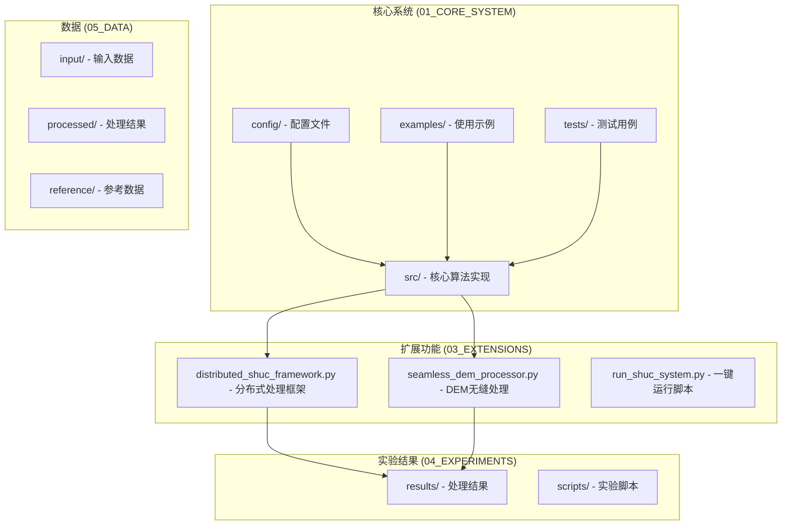
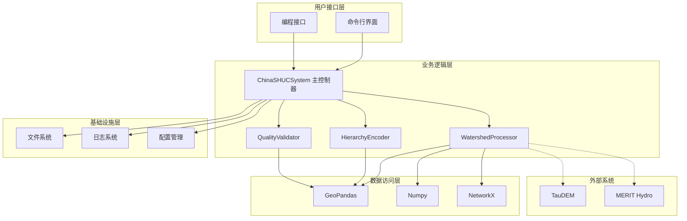
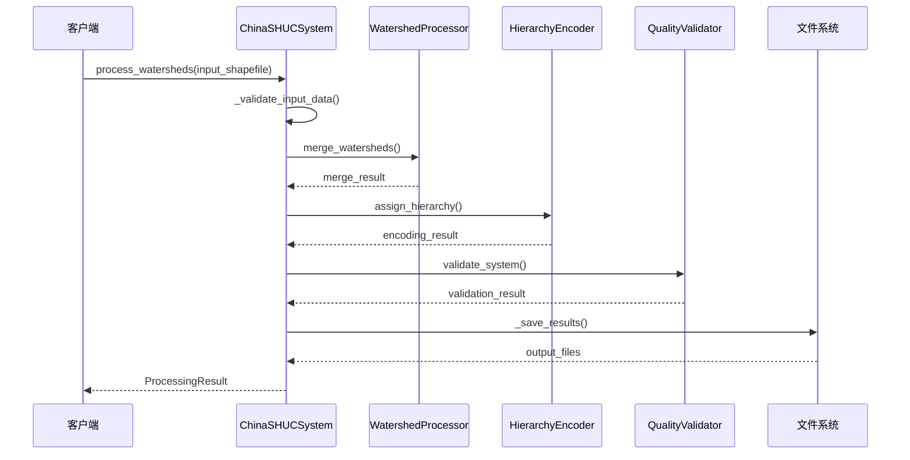
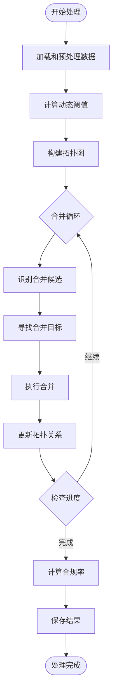
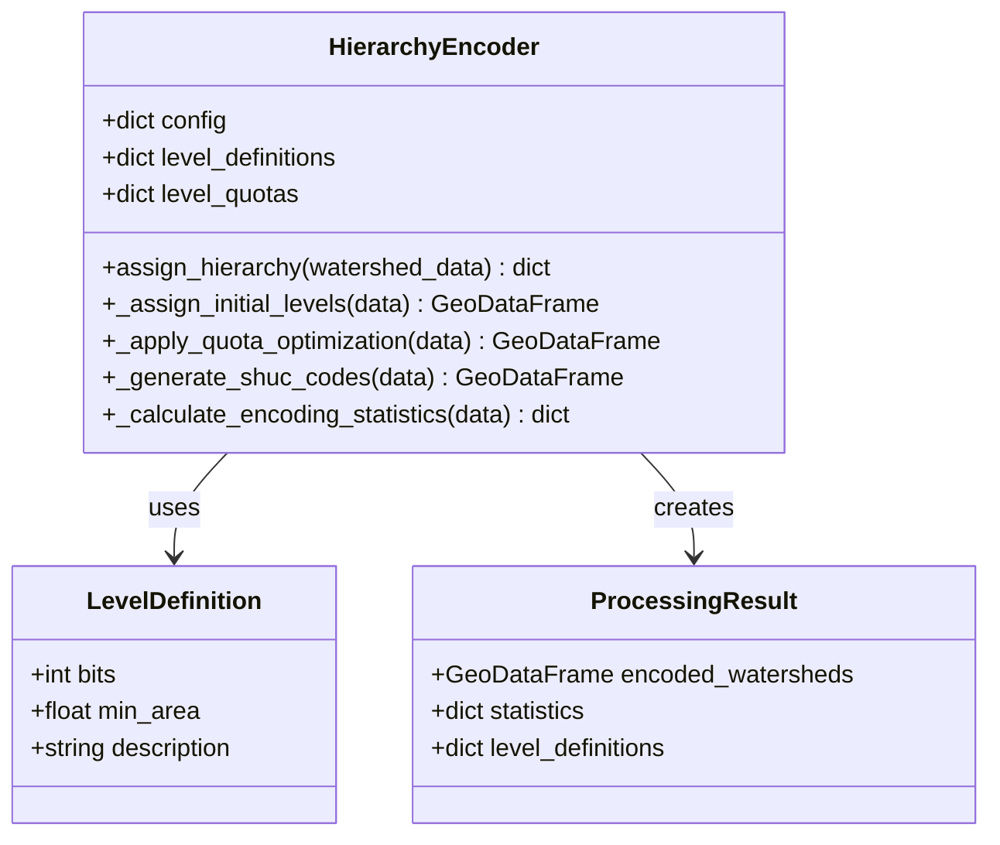
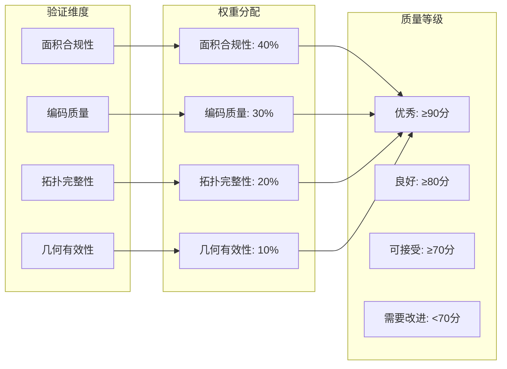
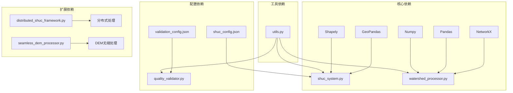

# 核心系统架构

<cite>
**本文档引用的文件**
- [shuc_system.py](file://01_CORE_SYSTEM/src/shuc_system.py)
- [watershed_processor.py](file://01_CORE_SYSTEM/src/watershed_processor.py)
- [hierarchy_encoder.py](file://01_CORE_SYSTEM/src/hierarchy_encoder.py)
- [quality_validator.py](file://01_CORE_SYSTEM/src/quality_validator.py)
- [utils.py](file://01_CORE_SYSTEM/src/utils.py)
- [shuc_config.json](file://01_CORE_SYSTEM/config/shuc_config.json)
- [validation_config.json](file://01_CORE_SYSTEM/config/validation_config.json)
- [basic_usage.py](file://01_CORE_SYSTEM/examples/basic_usage.py)
- [advanced_demo.py](file://01_CORE_SYSTEM/examples/advanced_demo.py)
- [batch_processing.py](file://01_CORE_SYSTEM/examples/batch_processing.py)
- [distributed_shuc_framework.py](file://03_EXTENSIONS/distributed_shuc_framework.py)
- [seamless_dem_processor.py](file://03_EXTENSIONS/seamless_dem_processor.py)
- [run_shuc_system.py](file://03_EXTENSIONS/run_shuc_system.py)
- [README.md](file://README.md)
</cite>

## 目录
1. [简介](#简介)
2. [项目结构](#项目结构)
3. [核心组件](#核心组件)
4. [架构概览](#架构概览)
5. [详细组件分析](#详细组件分析)
6. [依赖关系分析](#依赖关系分析)
7. [性能考虑](#性能考虑)
8. [故障排除指南](#故障排除指南)
9. [结论](#结论)

## 简介

中国SHUC（Standardized Hydrological Unit Code）系统是一个面向中国流域管理的智能化分级编码系统。该系统基于美国HUC（Hydrologic Unit Code）标准，结合中国地理环境特点，实现了完整的6级12位流域编码体系。系统的核心创新包括动态阈值自适应算法、拓扑保持的智能流域合并框架，以及50km缓冲区DEM无缝融合技术。

本系统旨在为中国流域管理提供标准化、层次化的空间单元编码解决方案，支持从源头到出口的全流域层级追溯，为水资源管理和流域治理提供可靠的数据基础。

## 项目结构

项目采用模块化设计，按照功能职责清晰分离各个组件：



**图表来源**
- [README.md:19-30](file://README.md#L19-L30)

**章节来源**
- [README.md:19-30](file://README.md#L19-L30)

## 核心组件

SHUC系统由四个核心组件构成，每个组件都有明确的职责分工：

### ChinaSHUCSystem 主控制器

作为系统的中央协调器，ChinaSHUCSystem负责整个处理流程的编排和管理。它整合了数据预处理、智能合并、层次编码和质量验证四大核心功能模块。

### WatershedProcessor 流域处理器

实现智能流域合并算法，支持动态阈值计算、激进合并策略和拓扑关系维护。该组件是系统性能的关键瓶颈，直接影响处理效率和结果质量。

### HierarchyEncoder 层次编码器

负责流域层次分配和SHUC编码生成，实现基于面积的智能分级和2-bit到12-bit的编码体系。支持层次配额管理和编码唯一性保证。

### QualityValidator 质量验证器

提供多维度质量验证，包括面积合规性检查、编码唯一性验证、拓扑完整性检查和几何有效性验证。实现综合评分系统和质量等级评定。

**章节来源**
- [shuc_system.py:43-89](file://01_CORE_SYSTEM/src/shuc_system.py#L43-L89)
- [watershed_processor.py:24-53](file://01_CORE_SYSTEM/src/watershed_processor.py#L24-L53)
- [hierarchy_encoder.py:22-67](file://01_CORE_SYSTEM/src/hierarchy_encoder.py#L22-L67)
- [quality_validator.py:24-60](file://01_CORE_SYSTEM/src/quality_validator.py#L24-L60)

## 架构概览

系统采用分层架构设计，实现了高度的模块化和可扩展性：



**图表来源**
- [shuc_system.py:38-79](file://01_CORE_SYSTEM/src/shuc_system.py#L38-L79)
- [utils.py:16-23](file://01_CORE_SYSTEM/src/utils.py#L16-L23)

系统架构遵循以下设计原则：

1. **单一职责原则**：每个组件专注于特定的功能领域
2. **开闭原则**：对扩展开放，对修改关闭
3. **依赖倒置原则**：高层模块不依赖低层模块
4. **接口隔离原则**：客户端不应该依赖不需要的接口

**章节来源**
- [shuc_system.py:92-164](file://01_CORE_SYSTEM/src/shuc_system.py#L92-L164)

## 详细组件分析

### ChinaSHUCSystem 主控制器详细分析

ChinaSHUCSystem作为系统的中枢，实现了完整的处理流水线：



**图表来源**
- [shuc_system.py:92-159](file://01_CORE_SYSTEM/src/shuc_system.py#L92-L159)

#### 核心职责

1. **流程编排**：协调各组件的执行顺序和数据传递
2. **配置管理**：加载和管理系统配置参数
3. **错误处理**：统一的异常捕获和错误报告
4. **结果输出**：标准化的输出格式和文件管理

#### 处理流程

系统采用五步处理流程：
1. **数据验证**：检查输入数据的有效性和完整性
2. **智能合并**：基于动态阈值的流域合并
3. **层次编码**：生成SHUC编码和层次结构
4. **质量验证**：全面的质量检查和评分
5. **结果保存**：标准化的输出文件生成

**章节来源**
- [shuc_system.py:92-248](file://01_CORE_SYSTEM/src/shuc_system.py#L92-L248)

### WatershedProcessor 流域处理器深度分析

WatershedProcessor实现了复杂的智能合并算法：



**图表来源**
- [watershed_processor.py:54-221](file://01_CORE_SYSTEM/src/watershed_processor.py#L54-L221)

#### 动态阈值算法

系统采用自适应阈值计算公式：
```
threshold = Q75 + (Q90-Q75)/2
```

其中Q75和Q90分别表示面积分布的第75百分位和第90百分位。这种算法能够自动适应不同区域的流域特征，避免固定阈值带来的偏差。

#### 合并策略

合并策略遵循以下优先级：
1. **下游优先**：优先合并到下游流域
2. **上游选择**：在没有下游时选择上游最大流域
3. **邻接合并**：寻找几何相邻的流域
4. **距离最近**：最后考虑距离最近的流域

**章节来源**
- [watershed_processor.py:117-221](file://01_CORE_SYSTEM/src/watershed_processor.py#L117-L221)

### HierarchyEncoder 层次编码器详细分析

层次编码器实现了完整的6级编码体系：



**图表来源**
- [hierarchy_encoder.py:22-95](file://01_CORE_SYSTEM/src/hierarchy_encoder.py#L22-L95)

#### 编码体系设计

系统采用2-bit到12-bit的可变长度编码体系：

| 级别 | 位数 | 最小面积(km²) | 描述 |
|------|------|---------------|------|
| 1级 | 2位 | ≥50000 | 大区流域 |
| 2级 | 4位 | ≥10000 | 区域流域 |
| 3级 | 6位 | ≥2000 | 大流域 |
| 4级 | 8位 | ≥500 | 中流域 |
| 5级 | 10位 | ≥100 | 小流域 |
| 6级 | 12位 | ≥50 | 基本单元 |

#### 配额管理

系统实施层次配额管理，防止某些级别的流域数量过多：
- 4级：最多3个
- 5级：最多8个  
- 6级：无限制

**章节来源**
- [hierarchy_encoder.py:42-138](file://01_CORE_SYSTEM/src/hierarchy_encoder.py#L42-L138)

### QualityValidator 质量验证器深入分析

质量验证器提供了全面的质量评估体系：



**图表来源**
- [quality_validator.py:50-60](file://01_CORE_SYSTEM/src/quality_validator.py#L50-L60)

#### 质量评估指标

系统采用多维度评估指标：

1. **面积合规性**：评估流域面积是否达到阈值要求
2. **编码质量**：检查编码的唯一性和格式正确性
3. **拓扑完整性**：验证流域间的逻辑关系
4. **几何有效性**：确保几何数据的正确性

#### 综合评分算法

总体评分 = Σ(各维度得分 × 权重)

**章节来源**
- [quality_validator.py:61-86](file://01_CORE_SYSTEM/src/quality_validator.py#L61-L86)

## 依赖关系分析

系统采用松耦合的设计，通过清晰的接口实现组件间的通信：



**图表来源**
- [utils.py:16-23](file://01_CORE_SYSTEM/src/utils.py#L16-L23)
- [shuc_config.json:1-43](file://01_CORE_SYSTEM/config/shuc_config.json#L1-L43)

### 外部依赖管理

系统对外部依赖进行了严格的版本控制和兼容性管理：

| 依赖包 | 版本要求 | 用途 |
|--------|----------|------|
| GeoPandas | ≥0.12.0 | 空间数据处理 |
| Shapely | ≥2.0.0 | 几何运算 |
| NetworkX | ≥3.0.0 | 图论算法 |
| Pandas | ≥1.5.0 | 数据分析 |
| Numpy | ≥1.21.0 | 数值计算 |
| RasterIO | ≥1.3.0 | 栅格数据处理 |

**章节来源**
- [utils.py:310-346](file://01_CORE_SYSTEM/src/utils.py#L310-L346)

## 性能考虑

### 并行处理优化

系统支持多种并行处理策略：

1. **多进程处理**：利用多核CPU进行并行计算
2. **内存映射**：大文件处理时使用内存映射减少内存占用
3. **增量处理**：支持大数据集的分块处理

### 内存管理

系统实现了智能的内存管理策略：
- 使用生成器模式处理大数据集
- 及时释放中间结果和临时变量
- 实施内存使用监控和预警机制

### I/O优化

针对I/O密集型操作，系统采用了以下优化策略：
- 批量文件写入操作
- 异步文件读取
- 缓存机制减少重复计算

## 故障排除指南

### 常见问题及解决方案

#### 数据格式问题

**问题**：输入数据格式不正确
**解决方案**：
1. 检查Shapefile文件的完整性
2. 验证必需字段的存在性
3. 确认坐标系统的一致性

#### 内存不足问题

**问题**：处理大型数据集时内存溢出
**解决方案**：
1. 调整批处理大小
2. 启用内存映射模式
3. 增加系统虚拟内存

#### 性能问题

**问题**：处理速度过慢
**解决方案**：
1. 优化配置参数
2. 启用并行处理
3. 升级硬件配置

**章节来源**
- [utils.py:322-346](file://01_CORE_SYSTEM/src/utils.py#L322-L346)

## 结论

中国SHUC系统通过模块化设计和插件化架构，成功实现了复杂流域分级编码的自动化处理。系统的核心优势包括：

1. **技术创新**：动态阈值自适应算法和拓扑保持的智能合并框架
2. **标准化**：完整的6级12位编码体系，符合国际标准
3. **可扩展性**：模块化设计支持功能扩展和定制化开发
4. **可靠性**：全面的质量验证和错误处理机制
5. **易用性**：简洁的API接口和丰富的示例代码

系统为中国的流域管理提供了强有力的技术支撑，不仅满足了当前的应用需求，也为未来的扩展和升级奠定了坚实的基础。随着技术的不断发展和完善，SHUC系统将在流域管理和水资源保护中发挥越来越重要的作用。