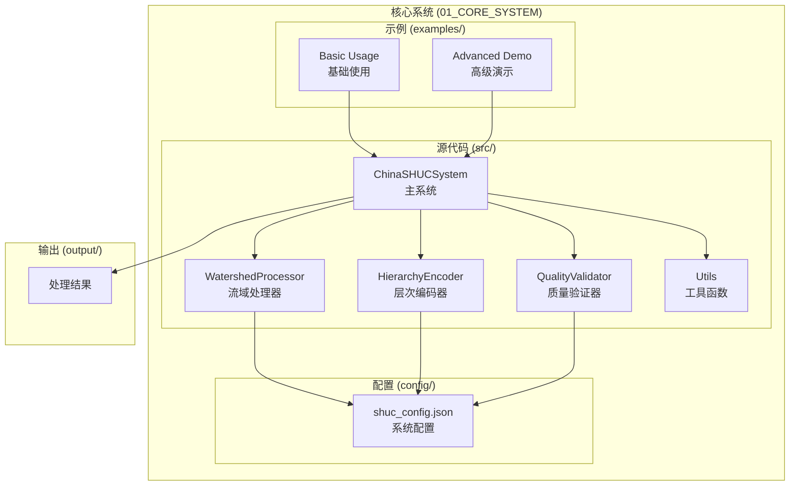
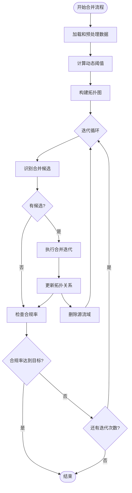
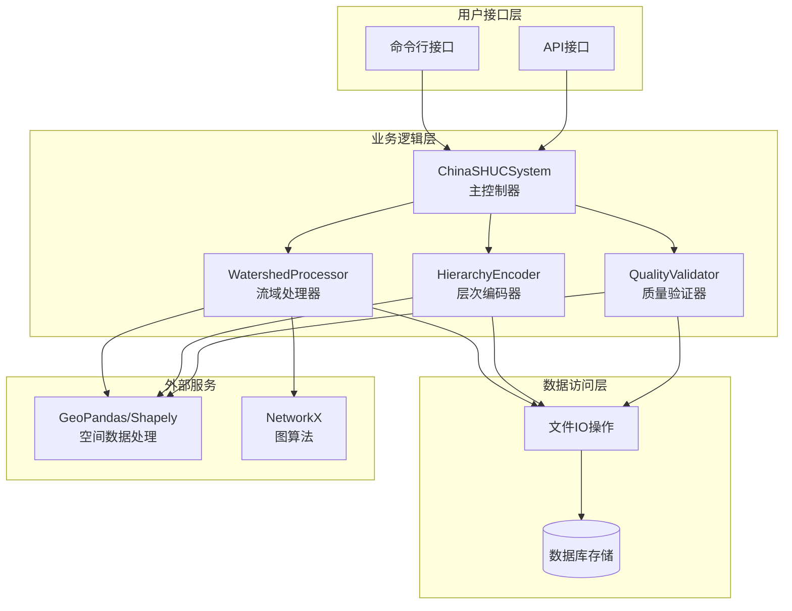
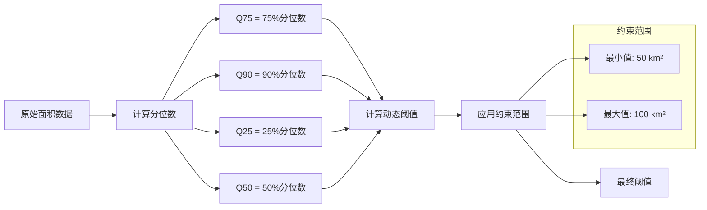
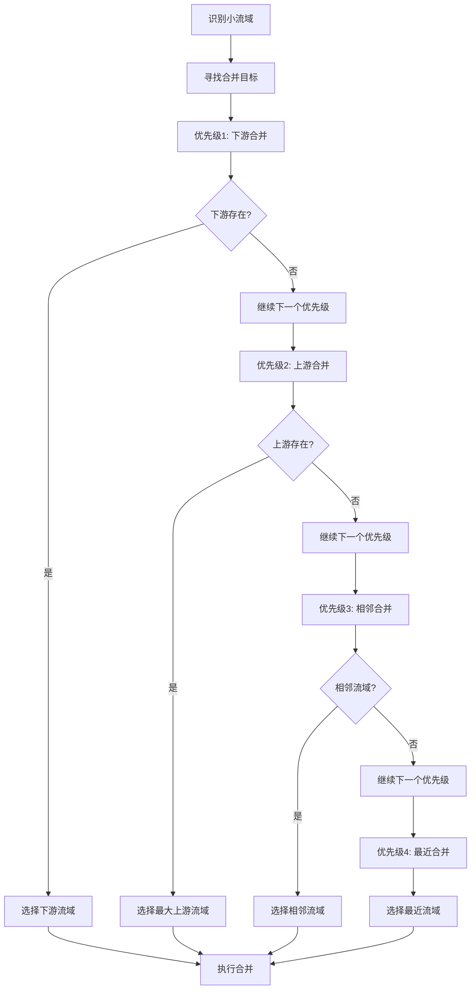
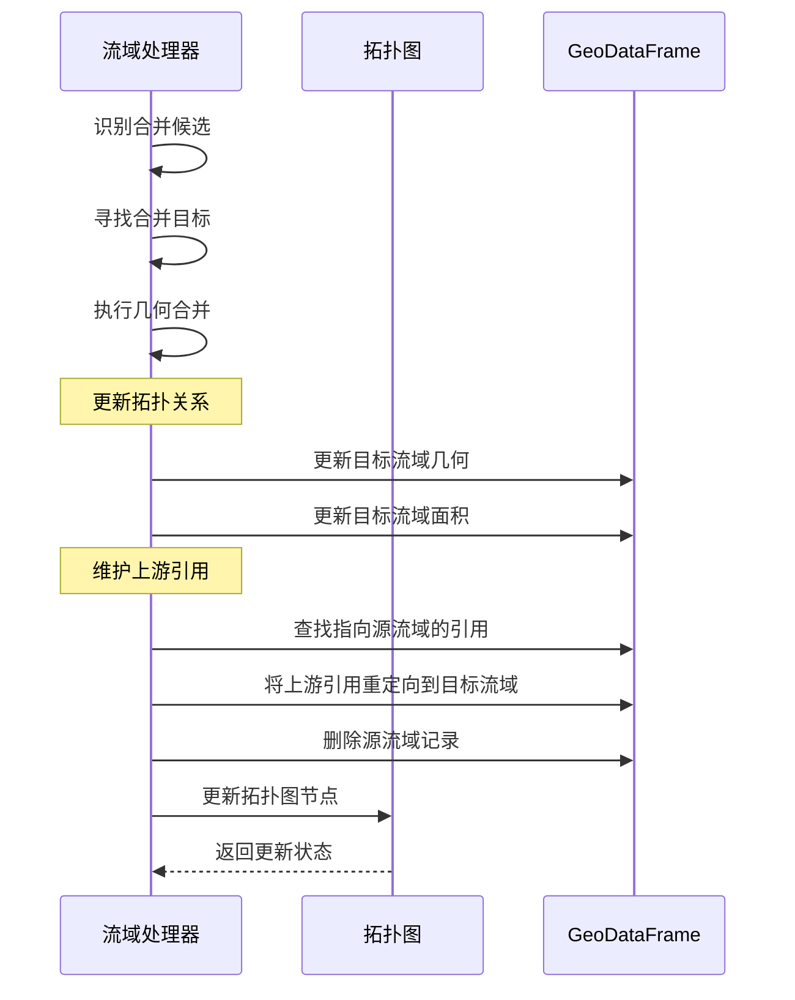
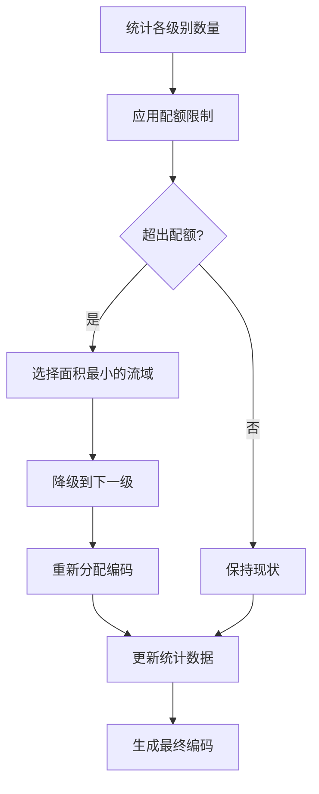
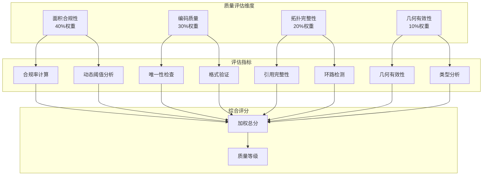
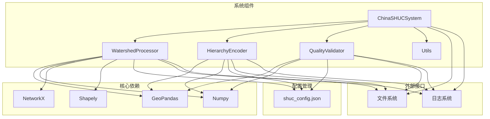
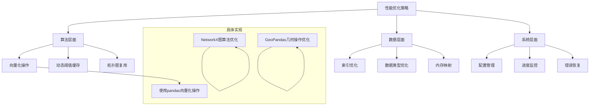

# 流域处理器

<cite>
**本文档引用的文件**
- [watershed_processor.py](file://01_CORE_SYSTEM/src/watershed_processor.py)
- [shuc_system.py](file://01_CORE_SYSTEM/src/shuc_system.py)
- [hierarchy_encoder.py](file://01_CORE_SYSTEM/src/hierarchy_encoder.py)
- [quality_validator.py](file://01_CORE_SYSTEM/src/quality_validator.py)
- [utils.py](file://01_CORE_SYSTEM/src/utils.py)
- [shuc_config.json](file://01_CORE_SYSTEM/config/shuc_config.json)
- [basic_usage.py](file://01_CORE_SYSTEM/examples/basic_usage.py)
- [advanced_demo.py](file://01_CORE_SYSTEM/examples/advanced_demo.py)
- [README.md](file://README.md)
</cite>

## 目录
1. [简介](#简介)
2. [项目结构](#项目结构)
3. [核心组件](#核心组件)
4. [架构概览](#架构概览)
5. [详细组件分析](#详细组件分析)
6. [依赖关系分析](#依赖关系分析)
7. [性能考虑](#性能考虑)
8. [故障排除指南](#故障排除指南)
9. [结论](#结论)
10. [附录](#附录)

## 简介

中国SHUC流域处理器是整个中国流域分级统一编码系统的核心组件，负责实现智能流域合并算法。该系统采用创新的动态阈值自适应算法和拓扑保持的多目标优化合并框架，为中国的流域管理提供标准化、层次化的空间单元编码解决方案。

本系统的核心创新包括：
- **动态阈值自适应算法** — 采用 Q75 + (Q90-Q75)/2 公式智能计算合并阈值，自适应不同区域的流域特征
- **拓扑保持的多目标优化合并框架** — 在图约束优化下实现面积-形状-拓扑三方权衡，确保流域空间关系一致性
- **6级12位层级编码体系** — 完整覆盖从一级流域到子流域的精细分级，支持层级追溯与空间聚合

## 项目结构

中国SHUC系统采用模块化架构设计，核心组件清晰分离，便于维护和扩展：



**图表来源**
- [shuc_system.py:43-91](file://01_CORE_SYSTEM/src/shuc_system.py#L43-L91)
- [watershed_processor.py:24-53](file://01_CORE_SYSTEM/src/watershed_processor.py#L24-L53)

**章节来源**
- [README.md:19-30](file://README.md#L19-L30)
- [shuc_system.py:43-91](file://01_CORE_SYSTEM/src/shuc_system.py#L43-L91)

## 核心组件

### 流域处理器 (WatershedProcessor)

WatershedProcessor是系统的核心算法引擎，实现了智能流域合并的所有关键功能：

#### 主要功能特性
- **动态阈值计算** — 基于数据分布的自适应阈值计算
- **激进合并策略** — 高效的流域合并算法
- **拓扑关系维护** — 保持流域间的空间关系
- **合并历史追踪** — 记录合并过程和统计信息

#### 核心算法实现



**图表来源**
- [watershed_processor.py:54-81](file://01_CORE_SYSTEM/src/watershed_processor.py#L54-L81)
- [watershed_processor.py:164-220](file://01_CORE_SYSTEM/src/watershed_processor.py#L164-L220)

**章节来源**
- [watershed_processor.py:24-53](file://01_CORE_SYSTEM/src/watershed_processor.py#L24-L53)
- [watershed_processor.py:54-81](file://01_CORE_SYSTEM/src/watershed_processor.py#L54-L81)

### 中国SHUC系统 (ChinaSHUCSystem)

ChinaSHUCSystem作为主控制器，协调各个组件的协同工作：

#### 处理流程
1. **数据预处理和验证** — 验证输入数据的有效性
2. **流域智能合并** — 执行WatershedProcessor的合并算法
3. **层次编码分配** — 为合并后的流域分配SHUC编码
4. **质量验证** — 全面的质量检查和评估
5. **结果保存** — 保存处理结果和统计信息

**章节来源**
- [shuc_system.py:92-164](file://01_CORE_SYSTEM/src/shuc_system.py#L92-L164)
- [shuc_system.py:251-286](file://01_CORE_SYSTEM/src/shuc_system.py#L251-L286)

## 架构概览

系统采用分层架构设计，各组件职责明确，耦合度低：



**图表来源**
- [shuc_system.py:37-41](file://01_CORE_SYSTEM/src/shuc_system.py#L37-L41)
- [watershed_processor.py:15-22](file://01_CORE_SYSTEM/src/watershed_processor.py#L15-L22)

**章节来源**
- [shuc_system.py:37-41](file://01_CORE_SYSTEM/src/shuc_system.py#L37-L41)
- [watershed_processor.py:15-22](file://01_CORE_SYSTEM/src/watershed_processor.py#L15-L22)

## 详细组件分析

### 流域处理器深度分析

#### 动态阈值计算机制

动态阈值计算是系统的核心创新之一，采用统计学方法自适应不同区域的流域特征：



**图表来源**
- [watershed_processor.py:117-141](file://01_CORE_SYSTEM/src/watershed_processor.py#L117-L141)

动态阈值计算公式：`threshold = max(50, min(100, Q75 + (Q90-Q75)/2))`

这个公式的优势在于：
- **自适应性强** — 能够根据数据分布自动调整阈值
- **稳定性好** — 通过约束范围避免极端值影响
- **鲁棒性高** — 使用分位数而非均值，减少异常值干扰

**章节来源**
- [watershed_processor.py:117-141](file://01_CORE_SYSTEM/src/watershed_processor.py#L117-L141)

#### 激进合并策略

合并策略采用多层次优先级决策机制：



**图表来源**
- [watershed_processor.py:249-280](file://01_CORE_SYSTEM/src/watershed_processor.py#L249-L280)

合并策略的决策逻辑体现了以下原则：
- **优先保持拓扑关系** — 优先选择下游和上游关系
- **最大化合并效果** — 选择面积较大的目标以提高效率
- **地理合理性** — 优先选择相邻或最近的流域
- **渐进式优化** — 逐步改善整体质量

**章节来源**
- [watershed_processor.py:249-280](file://01_CORE_SYSTEM/src/watershed_processor.py#L249-L280)

#### 拓扑关系维护

拓扑关系维护是确保合并后数据质量的关键机制：



**图表来源**
- [watershed_processor.py:326-366](file://01_CORE_SYSTEM/src/watershed_processor.py#L326-L366)

拓扑关系维护的关键点：
- **上游引用更新** — 自动更新所有指向源流域的上游引用
- **拓扑完整性** — 确保合并后的拓扑关系保持一致
- **错误容忍性** — 拓扑更新失败不影响几何合并的基本功能

**章节来源**
- [watershed_processor.py:326-366](file://01_CORE_SYSTEM/src/watershed_processor.py#L326-L366)

### 层次编码器分析

层次编码器负责将合并后的流域分配到合适的SHUC层级：

#### 分级标准体系

| 层级 | 位数 | 最小面积(km²) | 描述 |
|------|------|---------------|------|
| 1级 | 2位 | ≥50,000 | 大区流域 |
| 2级 | 4位 | ≥10,000 | 区域流域 |
| 3级 | 6位 | ≥2,000 | 大流域 |
| 4级 | 8位 | ≥1,000 | 中流域 |
| 5级 | 10位 | ≥200 | 小流域 |
| 6级 | 12位 | ≥50 | 基本单元 |

**章节来源**
- [hierarchy_encoder.py:42-49](file://01_CORE_SYSTEM/src/hierarchy_encoder.py#L42-L49)

#### 配额管理系统

层次编码器实现了智能的配额管理，确保各级别的平衡分布：



**图表来源**
- [hierarchy_encoder.py:113-138](file://01_CORE_SYSTEM/src/hierarchy_encoder.py#L113-L138)

**章节来源**
- [hierarchy_encoder.py:113-138](file://01_CORE_SYSTEM/src/hierarchy_encoder.py#L113-L138)

### 质量验证器分析

质量验证器提供了全面的质量评估体系：

#### 多维度质量评估



**图表来源**
- [quality_validator.py:24-60](file://01_CORE_SYSTEM/src/quality_validator.py#L24-L60)

**章节来源**
- [quality_validator.py:24-60](file://01_CORE_SYSTEM/src/quality_validator.py#L24-L60)

## 依赖关系分析

系统采用松耦合的设计，各组件之间的依赖关系清晰明确：



**图表来源**
- [watershed_processor.py:15-22](file://01_CORE_SYSTEM/src/watershed_processor.py#L15-L22)
- [shuc_system.py:37-41](file://01_CORE_SYSTEM/src/shuc_system.py#L37-L41)

**章节来源**
- [watershed_processor.py:15-22](file://01_CORE_SYSTEM/src/watershed_processor.py#L15-L22)
- [shuc_system.py:37-41](file://01_CORE_SYSTEM/src/shuc_system.py#L37-L41)

## 性能考虑

### 内存管理策略

系统采用了多种内存管理策略来优化大规模数据处理：

1. **增量处理** — 逐批处理数据，避免一次性加载所有数据
2. **几何修复** — 自动修复无效几何，减少后续处理开销
3. **拓扑图优化** — 使用NetworkX的高效图算法
4. **配置驱动** — 通过配置文件控制内存使用上限

### 性能优化技术



**章节来源**
- [shuc_config.json:38-42](file://01_CORE_SYSTEM/config/shuc_config.json#L38-L42)
- [utils.py:64-99](file://01_CORE_SYSTEM/src/utils.py#L64-L99)

### 并行处理能力

虽然当前版本未启用并行处理，但系统架构已经为未来的并行化扩展做好了准备：

- **模块化设计** — 各组件独立，便于并行化改造
- **无状态操作** — 大部分操作都是纯函数式，易于并行化
- **配置驱动** — 通过配置文件控制并行化参数

## 故障排除指南

### 常见问题及解决方案

#### 数据加载问题
- **问题**：Shapefile文件无法读取
- **原因**：文件损坏或编码问题
- **解决方案**：使用工具函数验证文件完整性

#### 几何有效性问题
- **问题**：几何对象无效
- **原因**：数据质量问题
- **解决方案**：自动修复无效几何，必要时手动清理

#### 拓扑关系问题
- **问题**：上游引用不完整
- **原因**：数据缺失或错误
- **解决方案**：自动更新引用关系，检测环路引用

**章节来源**
- [utils.py:159-221](file://01_CORE_SYSTEM/src/utils.py#L159-L221)
- [watershed_processor.py:97-115](file://01_CORE_SYSTEM/src/watershed_processor.py#L97-L115)

### 调试和监控

系统提供了完善的调试和监控机制：

1. **详细日志记录** — 记录每个处理步骤的详细信息
2. **进度监控** — 实时显示处理进度和统计信息
3. **错误恢复** — 自动处理常见错误并继续执行
4. **结果验证** — 自动验证处理结果的正确性

**章节来源**
- [utils.py:24-62](file://01_CORE_SYSTEM/src/utils.py#L24-L62)
- [shuc_system.py:103-164](file://01_CORE_SYSTEM/src/shuc_system.py#L103-L164)

## 结论

中国SHUC流域处理器是一个高度模块化、功能完备的智能系统。其核心优势体现在：

### 技术创新
- **动态阈值算法** — 自适应不同区域的流域特征
- **多目标优化** — 在面积、形状、拓扑之间实现平衡
- **智能合并策略** — 基于地理和拓扑关系的优先级决策

### 系统特点
- **模块化设计** — 各组件职责明确，易于维护和扩展
- **配置驱动** — 通过配置文件灵活调整系统行为
- **质量保证** — 全面的质量验证和错误处理机制

### 应用价值
- **标准化编码** — 为中国的流域管理提供统一的编码标准
- **自动化处理** — 大幅提高流域数据处理的效率和质量
- **可扩展性** — 支持大规模数据处理和未来功能扩展

该系统为中国的流域管理提供了强有力的技术支撑，具有重要的科学意义和实用价值。

## 附录

### 配置参数说明

#### 处理配置 (processing)
| 参数名 | 类型 | 默认值 | 描述 |
|--------|------|--------|------|
| target_compliance_rate | float | 0.90 | 目标合规率 |
| merge_strategy | string | "aggressive" | 合并策略 |
| max_iterations | int | 50 | 最大迭代次数 |
| enable_early_stopping | bool | True | 是否启用早停机制 |

#### 层次配置 (hierarchy)
| 参数名 | 类型 | 默认值 | 描述 |
|--------|------|--------|------|
| level_4_min_area | int | 1000 | 4级最小面积 |
| level_5_min_area | int | 200 | 5级最小面积 |
| level_6_min_area | int | 50 | 6级最小面积 |

#### 验证配置 (validation)
| 参数名 | 类型 | 默认值 | 描述 |
|--------|------|--------|------|
| area_compliance_threshold | float | 0.80 | 面积合规阈值 |
| coding_uniqueness_threshold | float | 1.00 | 编码唯一性阈值 |
| topology_completeness_threshold | float | 0.95 | 拓扑完整性阈值 |

**章节来源**
- [shuc_config.json:1-43](file://01_CORE_SYSTEM/config/shuc_config.json#L1-L43)
- [utils.py:101-126](file://01_CORE_SYSTEM/src/utils.py#L101-L126)

### 使用示例

#### 基础使用
```python
from shuc_system import ChinaSHUCSystem

# 创建系统实例
shuc = ChinaSHUCSystem()

# 处理流域数据
result = shuc.process_watersheds("data/input/demo_watersheds.shp")

# 查看结果
result.print_summary()
```

#### 高级配置
```python
# 自定义配置
custom_config = {
    "processing": {
        "target_compliance_rate": 0.95,
        "max_iterations": 100
    }
}

# 使用自定义配置
shuc = ChinaSHUCSystem(config_path="custom_config.json")
```

**章节来源**
- [basic_usage.py:25-73](file://01_CORE_SYSTEM/examples/basic_usage.py#L25-L73)
- [advanced_demo.py:62-98](file://01_CORE_SYSTEM/examples/advanced_demo.py#L62-L98)