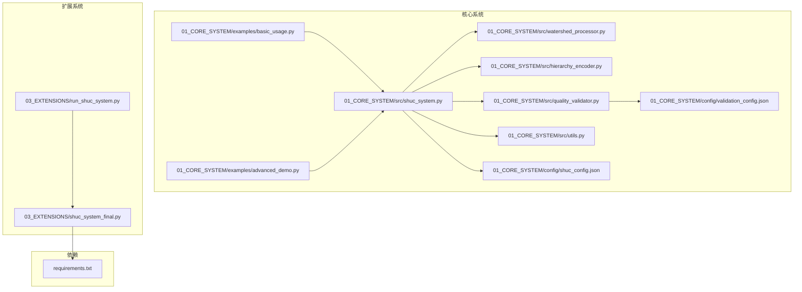
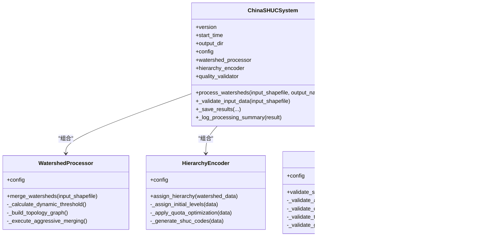
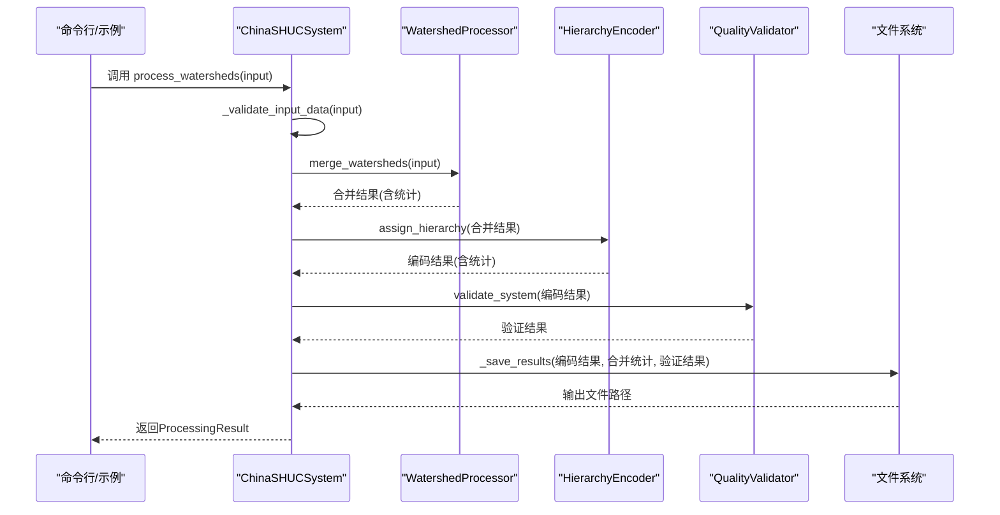
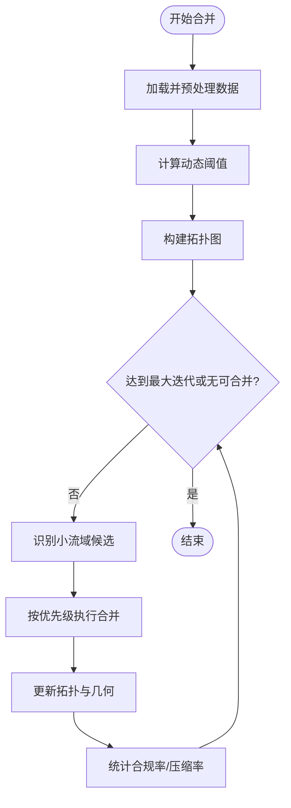
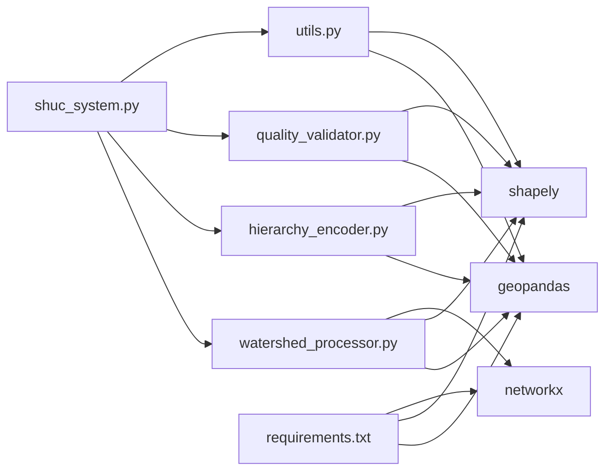

# 系统总体设计

<cite>
**本文引用的文件**
- [shuc_system.py](file://01_CORE_SYSTEM/src/shuc_system.py)
- [watershed_processor.py](file://01_CORE_SYSTEM/src/watershed_processor.py)
- [hierarchy_encoder.py](file://01_CORE_SYSTEM/src/hierarchy_encoder.py)
- [quality_validator.py](file://01_CORE_SYSTEM/src/quality_validator.py)
- [utils.py](file://01_CORE_SYSTEM/src/utils.py)
- [shuc_config.json](file://01_CORE_SYSTEM/config/shuc_config.json)
- [validation_config.json](file://01_CORE_SYSTEM/config/validation_config.json)
- [run_shuc_system.py](file://03_EXTENSIONS/run_shuc_system.py)
- [shuc_system_final.py](file://03_EXTENSIONS/shuc_system_final.py)
- [requirements.txt](file://01_CORE_SYSTEM/requirements.txt)
- [basic_usage.py](file://01_CORE_SYSTEM/examples/basic_usage.py)
- [advanced_demo.py](file://01_CORE_SYSTEM/examples/advanced_demo.py)
- [README.md](file://README.md)
</cite>

## 目录
1. [简介](#简介)
2. [项目结构](#项目结构)
3. [核心组件](#核心组件)
4. [架构总览](#架构总览)
5. [详细组件分析](#详细组件分析)
6. [依赖关系分析](#依赖关系分析)
7. [性能考量](#性能考量)
8. [故障排查指南](#故障排查指南)
9. [结论](#结论)
10. [附录](#附录)

## 简介
本文件面向SHUC系统总体设计，聚焦ChinaSHUCSystem主控制器的设计理念与核心职责，系统化阐述：
- 系统初始化流程、组件协调机制与生命周期管理
- 模块化架构设计原则（依赖注入、配置管理、错误处理策略）
- 系统边界定义、外部接口设计与扩展点规划
- 系统架构图与组件交互序列图
- 技术选型决策与架构权衡
- 性能考量、可扩展性设计与维护性原则

## 项目结构
系统采用“核心模块 + 配置 + 示例 + 扩展”的分层组织方式，核心算法模块位于src目录，配置文件位于config目录，示例脚本位于examples目录，扩展功能位于03_EXTENSIONS目录。

**图表来源**
- [shuc_system.py:43-91](file://01_CORE_SYSTEM/src/shuc_system.py#L43-L91)
- [watershed_processor.py:24-53](file://01_CORE_SYSTEM/src/watershed_processor.py#L24-L53)
- [hierarchy_encoder.py:22-67](file://01_CORE_SYSTEM/src/hierarchy_encoder.py#L22-L67)
- [quality_validator.py:24-60](file://01_CORE_SYSTEM/src/quality_validator.py#L24-L60)
- [utils.py:64-99](file://01_CORE_SYSTEM/src/utils.py#L64-L99)
- [shuc_config.json:1-43](file://01_CORE_SYSTEM/config/shuc_config.json#L1-L43)
- [validation_config.json:1-46](file://01_CORE_SYSTEM/config/validation_config.json#L1-L46)
- [basic_usage.py:23-48](file://01_CORE_SYSTEM/examples/basic_usage.py#L23-L48)
- [advanced_demo.py:28-48](file://01_CORE_SYSTEM/examples/advanced_demo.py#L28-L48)
- [run_shuc_system.py:18-188](file://03_EXTENSIONS/run_shuc_system.py#L18-L188)
- [shuc_system_final.py:31-104](file://03_EXTENSIONS/shuc_system_final.py#L31-L104)
- [requirements.txt:1-46](file://01_CORE_SYSTEM/requirements.txt#L1-L46)

**章节来源**
- [README.md:19-30](file://README.md#L19-L30)
- [requirements.txt:1-46](file://01_CORE_SYSTEM/requirements.txt#L1-L46)

## 核心组件
- ChinaSHUCSystem主控制器：负责系统初始化、组件装配、流程编排、结果汇总与日志输出。
- WatershedProcessor：实现智能流域合并，支持动态阈值、拓扑图构建与迭代合并。
- HierarchyEncoder：实现基于面积的6级层次分配与SHUC编码生成。
- QualityValidator：实现多维度质量验证（面积合规、编码唯一性、拓扑完整性、几何有效性）与综合评分。
- 工具模块utils：提供日志、配置加载、文件校验、环境检查等通用能力。
- 配置模块：shuc_config.json与validation_config.json分别承载系统处理参数与验证权重。

**章节来源**
- [shuc_system.py:43-91](file://01_CORE_SYSTEM/src/shuc_system.py#L43-L91)
- [watershed_processor.py:24-53](file://01_CORE_SYSTEM/src/watershed_processor.py#L24-L53)
- [hierarchy_encoder.py:22-67](file://01_CORE_SYSTEM/src/hierarchy_encoder.py#L22-L67)
- [quality_validator.py:24-60](file://01_CORE_SYSTEM/src/quality_validator.py#L24-L60)
- [utils.py:64-99](file://01_CORE_SYSTEM/src/utils.py#L64-L99)
- [shuc_config.json:1-43](file://01_CORE_SYSTEM/config/shuc_config.json#L1-L43)
- [validation_config.json:1-46](file://01_CORE_SYSTEM/config/validation_config.json#L1-L46)

## 架构总览
系统采用“主控制器 + 三大核心模块 + 工具层 + 配置层”的模块化架构，遵循“关注点分离”和“依赖倒置”原则。主控制器通过组合模式装配各子模块，子模块之间低耦合、高内聚；配置通过JSON文件集中管理，支持默认值与增量合并；工具层提供横切能力（日志、配置、校验），避免在业务逻辑中重复实现。

**图表来源**
- [shuc_system.py:43-91](file://01_CORE_SYSTEM/src/shuc_system.py#L43-L91)
- [watershed_processor.py:24-53](file://01_CORE_SYSTEM/src/watershed_processor.py#L24-L53)
- [hierarchy_encoder.py:22-67](file://01_CORE_SYSTEM/src/hierarchy_encoder.py#L22-L67)
- [quality_validator.py:24-60](file://01_CORE_SYSTEM/src/quality_validator.py#L24-L60)
- [utils.py:24-62](file://01_CORE_SYSTEM/src/utils.py#L24-L62)

## 详细组件分析

### ChinaSHUCSystem主控制器
- 设计理念：以“流程编排者”角色，将数据预处理、智能合并、层次编码、质量验证与结果落盘解耦为独立步骤，便于观测与调试。
- 生命周期管理：构造时加载配置、创建日志、初始化子模块；process_watersheds执行一次完整流水线；异常捕获与日志记录贯穿始终。
- 组件协调：通过组合装配三大核心模块，统一调度其方法调用顺序，并在每个阶段进行必要的数据传递与统计收集。
- 错误处理：输入数据校验失败直接抛出异常；保存阶段异常同样向上抛出，保证上层感知失败并终止后续流程。

**图表来源**
- [shuc_system.py:92-159](file://01_CORE_SYSTEM/src/shuc_system.py#L92-L159)
- [watershed_processor.py:54-81](file://01_CORE_SYSTEM/src/watershed_processor.py#L54-L81)
- [hierarchy_encoder.py:69-95](file://01_CORE_SYSTEM/src/hierarchy_encoder.py#L69-L95)
- [quality_validator.py:61-86](file://01_CORE_SYSTEM/src/quality_validator.py#L61-L86)

**章节来源**
- [shuc_system.py:51-91](file://01_CORE_SYSTEM/src/shuc_system.py#L51-L91)
- [shuc_system.py:92-159](file://01_CORE_SYSTEM/src/shuc_system.py#L92-L159)

### WatershedProcessor智能合并
- 动态阈值：基于面积分位数计算阈值，兼顾区域差异，提升合并稳健性。
- 拓扑图：构建有向图表示上下游关系，维护合并历史，便于回溯与审计。
- 合并策略：优先下游、其次上游、再邻接、最后最近，结合早停条件控制迭代次数。
- 合并后处理：更新拓扑引用、修复几何、统计合规率与压缩率。

**图表来源**
- [watershed_processor.py:54-81](file://01_CORE_SYSTEM/src/watershed_processor.py#L54-L81)
- [watershed_processor.py:164-220](file://01_CORE_SYSTEM/src/watershed_processor.py#L164-L220)

**章节来源**
- [watershed_processor.py:117-141](file://01_CORE_SYSTEM/src/watershed_processor.py#L117-L141)
- [watershed_processor.py:164-220](file://01_CORE_SYSTEM/src/watershed_processor.py#L164-L220)

### HierarchyEncoder层次编码
- 初始分配：按面积阈值从高到低分配级别，满足6级完整结构。
- 配额优化：对4/5级施加配额限制，将超配额小面积单元降级，保证结构均衡。
- 编码生成：按级别与面积排序分配固定位宽编码，确保唯一性与可读性。
- 统计输出：提供各级别数量、面积统计与范围信息。

**章节来源**
- [hierarchy_encoder.py:69-95](file://01_CORE_SYSTEM/src/hierarchy_encoder.py#L69-L95)
- [hierarchy_encoder.py:113-138](file://01_CORE_SYSTEM/src/hierarchy_encoder.py#L113-L138)
- [hierarchy_encoder.py:140-169](file://01_CORE_SYSTEM/src/hierarchy_encoder.py#L140-L169)
- [hierarchy_encoder.py:177-219](file://01_CORE_SYSTEM/src/hierarchy_encoder.py#L177-L219)

### QualityValidator质量验证
- 多维验证：面积合规、编码唯一性、拓扑完整性、几何有效性。
- 权重评分：按配置权重计算综合得分，并给出质量等级。
- 问题识别：汇总小流域、空编码、无效几何等问题，便于修复与改进。

**章节来源**
- [quality_validator.py:61-86](file://01_CORE_SYSTEM/src/quality_validator.py#L61-L86)
- [quality_validator.py:368-401](file://01_CORE_SYSTEM/src/quality_validator.py#L368-L401)
- [validation_config.json:1-46](file://01_CORE_SYSTEM/config/validation_config.json#L1-L46)

### 工具模块与配置管理
- 日志：统一格式化输出至控制台与文件，支持级别控制。
- 配置：默认配置与用户配置深度合并，缺失项自动补齐。
- 文件校验：对shapefile进行存在性、可读性、几何完整性检查。
- 环境检查：在扩展脚本中进行依赖包与Python版本检查。

**章节来源**
- [utils.py:24-62](file://01_CORE_SYSTEM/src/utils.py#L24-L62)
- [utils.py:64-99](file://01_CORE_SYSTEM/src/utils.py#L64-L99)
- [utils.py:159-221](file://01_CORE_SYSTEM/src/utils.py#L159-L221)
- [run_shuc_system.py:20-41](file://03_EXTENSIONS/run_shuc_system.py#L20-L41)

## 依赖关系分析
- 核心依赖：GeoPandas/Shapely用于空间数据与几何运算；NetworkX用于拓扑图构建；NumPy/Pandas用于数值与表格处理；SciPy用于科学计算。
- 可选依赖：Matplotlib/Seaborn用于可视化；Numba/Joblib用于性能优化与并行；PyYAML用于配置扩展；TQDM用于进度显示；PSUtil用于资源监控。
- 版本要求：Python 3.8+，建议3.9+；核心库版本见requirements.txt。

**图表来源**
- [shuc_system.py:38-41](file://01_CORE_SYSTEM/src/shuc_system.py#L38-L41)
- [watershed_processor.py:15-22](file://01_CORE_SYSTEM/src/watershed_processor.py#L15-L22)
- [hierarchy_encoder.py:15-20](file://01_CORE_SYSTEM/src/hierarchy_encoder.py#L15-L20)
- [quality_validator.py:17-22](file://01_CORE_SYSTEM/src/quality_validator.py#L17-L22)
- [requirements.txt:5-23](file://01_CORE_SYSTEM/requirements.txt#L5-L23)

**章节来源**
- [requirements.txt:1-46](file://01_CORE_SYSTEM/requirements.txt#L1-L46)

## 性能考量
- 时间复杂度
  - 合并阶段：每次迭代对候选集合排序与遍历，整体复杂度受候选数量与拓扑查询影响；早停与阈值控制有助于减少迭代次数。
  - 编码阶段：按级别分组排序后分配编码，复杂度近似O(N log N)。
  - 验证阶段：多维扫描与统计，复杂度近似O(N)。
- 空间复杂度
  - 拓扑图存储与合并历史列表占用额外内存；可通过增量处理与分批落盘缓解。
- 优化建议
  - 并行化：利用Joblib对独立候选对的合并评分进行并行计算（需谨慎处理共享状态）。
  - 内存优化：对大型数据集采用分块读取与延迟计算；及时释放中间变量。
  - I/O优化：批量写入与压缩输出；避免重复落盘。
  - 算法优化：对拓扑查询使用索引或缓存；合并策略可引入启发式剪枝。

[本节为通用性能讨论，无需特定文件引用]

## 故障排查指南
- 输入数据问题
  - 文件不存在或不可读：检查路径与权限；使用工具函数validate_shapefile进行诊断。
  - 缺失字段或几何无效：修复自引用、无效几何后重试。
- 配置问题
  - 配置文件缺失：工具函数会自动创建默认配置；检查输出目录权限。
  - 参数不合理：调整目标合规率、阈值与迭代次数，观察合并效果。
- 运行时异常
  - 合并失败：检查拓扑图构建是否成功，合并目标是否存在；查看合并历史定位问题。
  - 编码冲突：检查配额与排序规则，必要时放宽阈值或调整配额。
  - 验证不通过：根据验证报告中的问题清单逐项修复。

**章节来源**
- [utils.py:159-221](file://01_CORE_SYSTEM/src/utils.py#L159-L221)
- [shuc_system.py:165-196](file://01_CORE_SYSTEM/src/shuc_system.py#L165-L196)
- [quality_validator.py:334-366](file://01_CORE_SYSTEM/src/quality_validator.py#L334-L366)

## 结论
ChinaSHUCSystem以“主控制器 + 三大核心模块 + 工具层 + 配置层”的架构实现了从数据到编码的端到端自动化处理。通过动态阈值、拓扑保持与多维验证，系统在保证质量的同时具备良好的可扩展性与可维护性。建议在生产环境中结合并行化与内存优化策略，持续完善配置与监控体系，以支撑更大规模的数据处理与更复杂的业务场景。

[本节为总结性内容，无需特定文件引用]

## 附录

### 系统边界与外部接口
- 系统边界
  - 输入：shapefile矢量数据（含几何与拓扑字段）。
  - 输出：编码后的流域数据、验证报告、处理统计与日志。
- 外部接口
  - 命令行入口：examples与扩展脚本提供便捷运行方式。
  - 配置接口：JSON配置文件集中管理参数与权重。
  - 第三方依赖：GeoPandas/Shapely/NetworkX等库提供的API。

**章节来源**
- [basic_usage.py:30-52](file://01_CORE_SYSTEM/examples/basic_usage.py#L30-L52)
- [advanced_demo.py:31-54](file://01_CORE_SYSTEM/examples/advanced_demo.py#L31-L54)
- [run_shuc_system.py:167-210](file://03_EXTENSIONS/run_shuc_system.py#L167-L210)

### 扩展点规划
- 算法扩展
  - 新增合并策略：在WatershedProcessor中新增策略枚举与分支。
  - 新增编码规则：在HierarchyEncoder中扩展级别定义与编码格式。
- 配置扩展
  - 引入YAML配置：在utils中增加YAML加载逻辑，保持向后兼容。
  - 动态权重：允许运行时调整质量权重与阈值。
- 性能扩展
  - 分布式处理：在扩展脚本中引入分布式框架（如Dask/Spark）。
  - 缓存与索引：对拓扑查询与几何运算引入缓存与索引优化。

**章节来源**
- [shuc_system.py:76-79](file://01_CORE_SYSTEM/src/shuc_system.py#L76-L79)
- [watershed_processor.py:35-53](file://01_CORE_SYSTEM/src/watershed_processor.py#L35-L53)
- [hierarchy_encoder.py:32-67](file://01_CORE_SYSTEM/src/hierarchy_encoder.py#L32-L67)
- [utils.py:64-99](file://01_CORE_SYSTEM/src/utils.py#L64-L99)