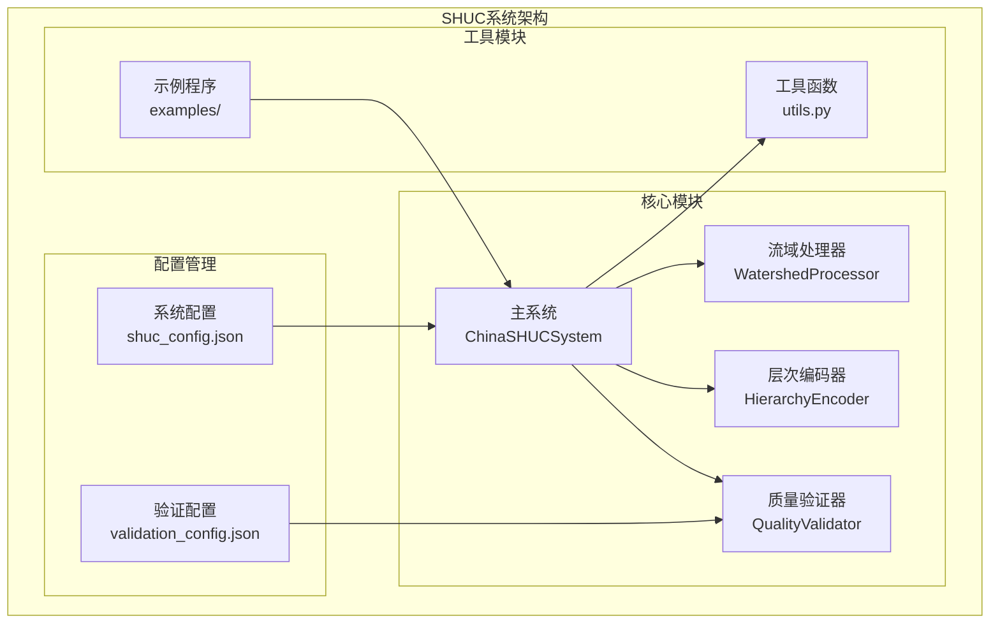
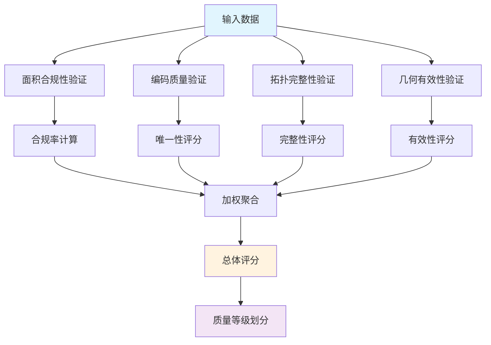
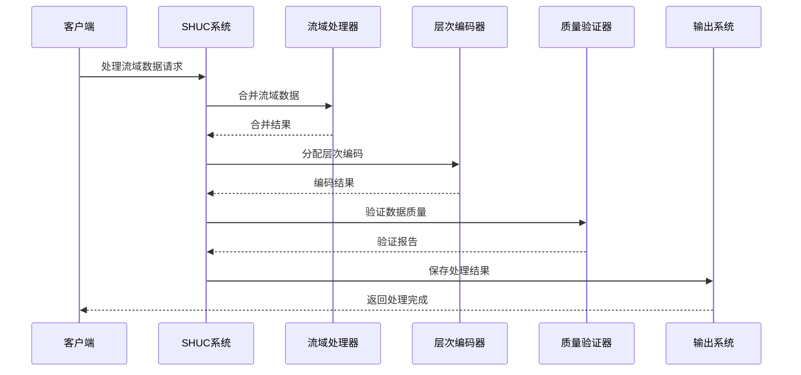
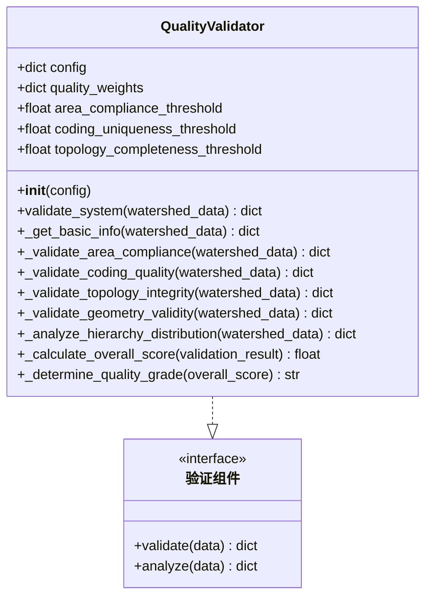
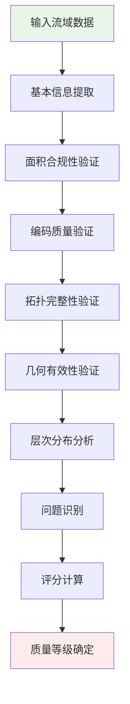
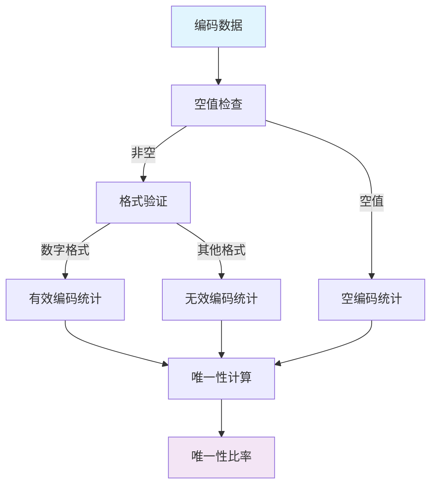
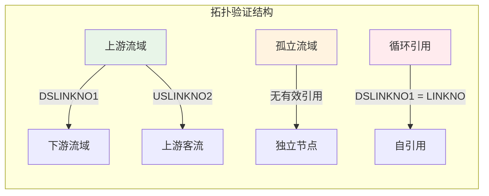
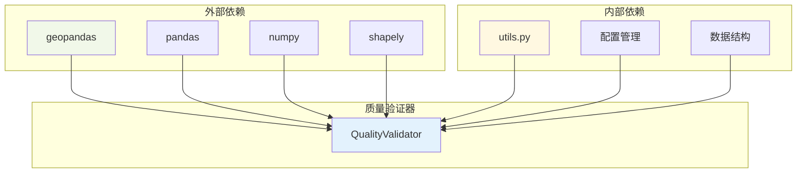
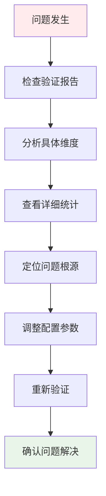

# 质量验证器

<cite>
**本文档引用的文件**
- [quality_validator.py](file://01_CORE_SYSTEM/src/quality_validator.py)
- [validation_config.json](file://01_CORE_SYSTEM/config/validation_config.json)
- [shuc_system.py](file://01_CORE_SYSTEM/src/shuc_system.py)
- [utils.py](file://01_CORE_SYSTEM/src/utils.py)
- [watershed_processor.py](file://01_CORE_SYSTEM/src/watershed_processor.py)
- [hierarchy_encoder.py](file://01_CORE_SYSTEM/src/hierarchy_encoder.py)
- [shuc_config.json](file://01_CORE_SYSTEM/config/shuc_config.json)
- [basic_usage.py](file://01_CORE_SYSTEM/examples/basic_usage.py)
- [advanced_demo.py](file://01_CORE_SYSTEM/examples/advanced_demo.py)
- [batch_processing.py](file://01_CORE_SYSTEM/examples/batch_processing.py)
- [validation_report.json](file://00_ARCHIVE/legacy_versions/SHUC_FINAL_VERSION/data/validation_report.json)
</cite>

## 目录
1. [简介](#简介)
2. [项目结构](#项目结构)
3. [核心组件](#核心组件)
4. [架构概览](#架构概览)
5. [详细组件分析](#详细组件分析)
6. [依赖关系分析](#依赖关系分析)
7. [性能考虑](#性能考虑)
8. [故障排除指南](#故障排除指南)
9. [结论](#结论)
10. [附录](#附录)

## 简介
质量验证器是SHUC（中国流域层次编码系统）中的核心质量控制组件，负责对经过智能合并和层次编码的流域数据进行全面的质量评估。该组件实现了多维度验证体系，包括面积合规性检查、编码唯一性验证、几何有效性评估和拓扑完整性分析，并通过加权评分系统生成质量等级。

SHUC系统基于美国HUC标准，专门适配中国地理环境的流域分级编码解决方案，支持4-6级完整层次结构，实现90%面积合规率的智能合并算法。质量验证器在整个处理流程中发挥着至关重要的作用，确保最终输出的流域数据满足严格的质量标准。

## 项目结构
SHUC系统采用模块化设计，质量验证器作为独立组件集成在核心系统中：



**图表来源**
- [shuc_system.py:43-91](file://01_CORE_SYSTEM/src/shuc_system.py#L43-L91)
- [quality_validator.py:24-60](file://01_CORE_SYSTEM/src/quality_validator.py#L24-L60)

系统采用分层架构设计，各模块职责明确：
- **主系统层**：协调各个子系统的运行
- **处理层**：执行具体的流域处理任务
- **验证层**：提供质量保证和评估
- **配置层**：管理系统的参数设置
- **工具层**：提供辅助功能和实用工具

**章节来源**
- [shuc_system.py:1-200](file://01_CORE_SYSTEM/src/shuc_system.py#L1-L200)
- [quality_validator.py:1-411](file://01_CORE_SYSTEM/src/quality_validator.py#L1-L411)

## 核心组件
质量验证器的核心功能围绕四个主要验证维度展开：

### 验证维度概述
1. **面积合规性验证**（40%权重）
   - 动态阈值计算
   - 面积分布统计分析
   - 合规率评估

2. **编码质量验证**（30%权重）
   - 编码唯一性检查
   - 编码格式验证
   - 编码完整性评估

3. **拓扑完整性验证**（20%权重）
   - 上下游关系检查
   - 循环引用检测
   - 孤立流域识别

4. **几何有效性验证**（10%权重）
   - 几何有效性检查
   - 几何类型分析
   - 空几何检测

### 质量评分机制
质量验证器采用加权综合评分系统，每个验证维度都有相应的权重和评分标准：



**图表来源**
- [quality_validator.py:368-411](file://01_CORE_SYSTEM/src/quality_validator.py#L368-L411)

**章节来源**
- [quality_validator.py:24-60](file://01_CORE_SYSTEM/src/quality_validator.py#L24-L60)
- [quality_validator.py:368-411](file://01_CORE_SYSTEM/src/quality_validator.py#L368-L411)

## 架构概览
质量验证器在整个SHUC系统中的位置和交互关系如下：



**图表来源**
- [shuc_system.py:92-163](file://01_CORE_SYSTEM/src/shuc_system.py#L92-L163)
- [quality_validator.py:61-86](file://01_CORE_SYSTEM/src/quality_validator.py#L61-L86)

质量验证器作为独立的验证组件，接收经过处理的流域数据，执行多维度验证，并返回详细的验证报告。该设计确保了验证过程的独立性和可重用性。

**章节来源**
- [shuc_system.py:126-130](file://01_CORE_SYSTEM/src/shuc_system.py#L126-L130)
- [quality_validator.py:61-86](file://01_CORE_SYSTEM/src/quality_validator.py#L61-L86)

## 详细组件分析

### QualityValidator类分析
QualityValidator类是质量验证器的核心实现，采用了面向对象的设计模式，提供了清晰的接口和完整的验证功能。

#### 类结构设计


**图表来源**
- [quality_validator.py:24-411](file://01_CORE_SYSTEM/src/quality_validator.py#L24-L411)

#### 初始化配置管理
QualityValidator类通过构造函数接收配置参数，支持灵活的配置管理：

1. **阈值配置**：从配置文件读取各种验证阈值
2. **权重配置**：支持自定义权重分配
3. **动态参数**：根据数据特征自动调整验证标准

#### 验证流程设计
质量验证器采用流水线式的验证流程，确保每个验证步骤都有明确的输入输出：



**图表来源**
- [quality_validator.py:61-86](file://01_CORE_SYSTEM/src/quality_validator.py#L61-L86)

**章节来源**
- [quality_validator.py:35-60](file://01_CORE_SYSTEM/src/quality_validator.py#L35-L60)
- [quality_validator.py:61-86](file://01_CORE_SYSTEM/src/quality_validator.py#L61-L86)

### 面积合规性验证算法
面积合规性验证是质量验证的重要组成部分，采用了动态阈值计算算法：

#### 动态阈值计算
```mermaid
flowchart TD
A[获取面积数据] --> B[计算分位数]
B --> C[Q75 = 75分位数]
B --> D[Q90 = 90分位数]
C --> E[计算差值]
D --> E
E --> F[动态阈值 = Q75 + (Q90-Q75)/2]
F --> G[约束范围调整]
G --> H[最小值50km²]
G --> I[最大值100km²]
H --> J[最终阈值]
I --> J
style A fill:#fff3e0
style J fill:#e8f5e8
```

**图表来源**
- [quality_validator.py:100-122](file://01_CORE_SYSTEM/src/quality_validator.py#L100-L122)
- [watershed_processor.py:117-141](file://01_CORE_SYSTEM/src/watershed_processor.py#L117-L141)

#### 面积分布统计分析
面积合规性验证不仅计算合规率，还提供详细的面积分布统计：

| 面积区间 | 描述 | 统计指标 |
|---------|------|----------|
| < 50 km² | 小流域 | 小流域数量统计 |
| 50-200 km² | 中等流域 | 中等流域数量统计 |
| ≥ 200 km² | 大流域 | 大流域数量统计 |
| 分位数统计 | 分布特征 | Q25, Q50, Q75, Q90 |

**章节来源**
- [quality_validator.py:124-140](file://01_CORE_SYSTEM/src/quality_validator.py#L124-L140)
- [quality_validator.py:100-122](file://01_CORE_SYSTEM/src/quality_validator.py#L100-L122)

### 编码唯一性验证机制
编码质量验证确保SHUC编码的唯一性和正确性：

#### 编码格式分析
编码验证器对编码格式进行严格检查：



**图表来源**
- [quality_validator.py:142-168](file://01_CORE_SYSTEM/src/quality_validator.py#L142-L168)
- [quality_validator.py:170-189](file://01_CORE_SYSTEM/src/quality_validator.py#L170-L189)

#### 编码唯一性评估
编码唯一性验证采用以下算法：
1. 统计总编码数量
2. 计算唯一编码数量
3. 计算唯一性比率
4. 与阈值比较得出结论

**章节来源**
- [quality_validator.py:142-168](file://01_CORE_SYSTEM/src/quality_validator.py#L142-L168)

### 拓扑完整性分析
拓扑完整性验证确保流域数据的逻辑正确性和完整性：

#### 拓扑关系分析


**图表来源**
- [quality_validator.py:191-223](file://01_CORE_SYSTEM/src/quality_validator.py#L191-L223)
- [quality_validator.py:225-253](file://01_CORE_SYSTEM/src/quality_validator.py#L225-L253)

#### 拓扑完整性评分
拓扑完整性评分基于以下指标：
- 有效引用比例
- 孤立流域数量
- 循环引用检测
- 完整性阈值比较

**章节来源**
- [quality_validator.py:191-223](file://01_CORE_SYSTEM/src/quality_validator.py#L191-L223)

### 几何有效性评估
几何有效性验证确保流域几何数据的正确性和可用性：

#### 几何类型分析
几何验证器支持多种几何类型的检测和统计：

| 几何类型 | 描述 | 统计用途 |
|---------|------|----------|
| Polygon | 多边形 | 主要流域类型 |
| MultiPolygon | 多部分多边形 | 复杂流域边界 |
| Point | 点 | 特殊标注点 |
| LineString | 线 | 河流轮廓 |
| MultiLineString | 多部分线 | 复杂河流网络 |

#### 几何有效性检查
几何有效性验证包括：
1. 空几何检测
2. 几何有效性验证
3. 几何类型分类统计
4. 有效性比率计算

**章节来源**
- [quality_validator.py:255-284](file://01_CORE_SYSTEM/src/quality_validator.py#L255-L284)

### 质量等级划分标准
质量验证器采用四等级质量评估体系：

| 质量等级 | 分数范围 | 描述 | 等级标识 |
|---------|----------|------|----------|
| 优秀 | 90-100 | 质量卓越，符合所有标准 | Excellent |
| 良好 | 80-89 | 质量良好，基本符合标准 | Good |
| 可接受 | 70-79 | 质量可接受，存在轻微问题 | Acceptable |
| 需要改进 | 0-69 | 质量需要改进，存在严重问题 | Needs Improvement |

#### 等级确定算法
质量等级通过以下算法确定：
1. 计算加权综合评分
2. 与等级阈值比较
3. 分配相应质量等级
4. 生成质量等级描述

**章节来源**
- [quality_validator.py:402-411](file://01_CORE_SYSTEM/src/quality_validator.py#L402-L411)

## 依赖关系分析
质量验证器与其他系统组件的依赖关系如下：



**图表来源**
- [quality_validator.py:17-22](file://01_CORE_SYSTEM/src/quality_validator.py#L17-L22)
- [utils.py:16-23](file://01_CORE_SYSTEM/src/utils.py#L16-L23)

### 外部库依赖
质量验证器依赖以下核心库：
- **geopandas**：地理空间数据处理
- **pandas**：数据结构和分析
- **numpy**：数值计算支持
- **shapely**：几何对象操作

### 内部模块依赖
质量验证器与系统其他模块的集成关系：
- **配置管理**：从配置文件读取验证参数
- **工具函数**：使用通用工具函数
- **数据处理**：与流域处理器协作

**章节来源**
- [quality_validator.py:17-22](file://01_CORE_SYSTEM/src/quality_validator.py#L17-L22)
- [shuc_system.py:38-41](file://01_CORE_SYSTEM/src/shuc_system.py#L38-L41)

## 性能考虑
质量验证器在设计时充分考虑了性能优化：

### 算法复杂度分析
1. **面积合规性验证**：O(n) 时间复杂度，单次遍历
2. **编码质量验证**：O(n) 时间复杂度，哈希表操作
3. **拓扑完整性验证**：O(n) 时间复杂度，集合查找
4. **几何有效性验证**：O(n) 时间复杂度，几何对象检查

### 内存使用优化
- **延迟计算**：按需计算统计数据
- **内存复用**：重用中间结果
- **数据类型优化**：使用高效的数据类型

### 并行处理支持
虽然当前版本未实现并行处理，但架构设计支持未来的并行优化：
- **独立验证**：各验证维度相互独立
- **数据分割**：支持大数据集的分块处理
- **结果合并**：支持多进程结果合并

## 故障排除指南
质量验证器提供了完善的错误检测和诊断功能：

### 常见问题诊断
1. **输入数据问题**
   - 缺失必要字段
   - 几何数据无效
   - 编码格式错误

2. **配置参数问题**
   - 阈值设置不合理
   - 权重分配不当
   - 验证规则冲突

3. **性能问题**
   - 大数据集处理缓慢
   - 内存使用过高
   - 计算资源不足

### 调试工具使用
系统提供了多种调试和诊断工具：



**图表来源**
- [quality_validator.py:334-366](file://01_CORE_SYSTEM/src/quality_validator.py#L334-L366)

### 问题识别机制
质量验证器通过以下方式识别潜在问题：
- **统计异常检测**：识别异常值和离群点
- **格式验证**：检查数据格式正确性
- **逻辑一致性**：验证数据间的逻辑关系
- **完整性检查**：确保数据完整性

**章节来源**
- [quality_validator.py:334-366](file://01_CORE_SYSTEM/src/quality_validator.py#L334-L366)

## 结论
质量验证器作为SHUC系统的核心组件，实现了全面、多维度的质量评估体系。通过面积合规性、编码质量、拓扑完整性和几何有效性四个维度的综合验证，确保了流域数据的高质量输出。

### 主要优势
1. **多维度验证**：覆盖数据质量的各个方面
2. **动态阈值**：适应不同数据特征的自适应验证
3. **加权评分**：灵活的质量评估和等级划分
4. **详细报告**：提供全面的问题诊断和改进建议

### 技术创新
1. **动态阈值算法**：基于数据分布的自适应阈值计算
2. **层次分析**：支持SHUC编码层次结构的专门验证
3. **综合评分系统**：平衡各验证维度的权重分配
4. **问题诊断**：提供具体的问题定位和解决方案

质量验证器为SHUC系统的可靠性和准确性提供了坚实保障，是整个系统质量管理体系的重要组成部分。

## 附录

### 验证配置示例
系统提供了多种配置选项来定制验证行为：

#### 基础配置结构
```json
{
  "thresholds": {
    "area_compliance_threshold": 0.80,
    "coding_uniqueness_threshold": 1.00,
    "topology_completeness_threshold": 0.95
  },
  "quality_weights": {
    "area_compliance": 0.40,
    "coding_quality": 0.30,
    "topology_integrity": 0.20,
    "geometry_validity": 0.10
  }
}
```

#### 高级配置选项
- **自定义权重**：根据具体需求调整各验证维度的重要性
- **阈值调优**：针对不同数据集调整验证标准
- **验证规则**：启用或禁用特定的验证规则

### 自定义验证规则
用户可以通过以下方式扩展验证功能：
1. **添加新的验证维度**：如水文特征验证
2. **修改现有规则**：调整验证算法和阈值
3. **集成外部数据源**：结合其他数据进行交叉验证

### 质量报告生成
质量验证器生成的报告包含以下信息：
- **基本统计信息**：数据集概况和基本统计
- **各维度详细结果**：每个验证维度的具体结果
- **问题识别**：发现的问题和建议的改进措施
- **总体评分**：加权综合评分和质量等级

### 使用示例
系统提供了多种使用示例来演示质量验证器的功能：

#### 基础使用
```python
# 创建质量验证器实例
validator = QualityValidator(config)

# 执行验证
result = validator.validate_system(watershed_data)

# 查看结果
print(f"总体评分: {result['overall_score']}")
print(f"质量等级: {result['quality_grade']}")
```

#### 高级分析
```python
# 获取详细验证结果
area_result = result['area_compliance']
coding_result = result['coding_quality']
topology_result = result['topology_integrity']
geometry_result = result['geometry_validity']

# 分析面积分布
area_dist = area_result['area_distribution']
print(f"小流域数量: {area_dist['small_watersheds_0_50']}")
```

**章节来源**
- [validation_config.json:1-46](file://01_CORE_SYSTEM/config/validation_config.json#L1-L46)
- [shuc_config.json:20-31](file://01_CORE_SYSTEM/config/shuc_config.json#L20-L31)
- [basic_usage.py:75-103](file://01_CORE_SYSTEM/examples/basic_usage.py#L75-L103)
- [advanced_demo.py:31-60](file://01_CORE_SYSTEM/examples/advanced_demo.py#L31-L60)
- [batch_processing.py:227-327](file://01_CORE_SYSTEM/examples/batch_processing.py#L227-L327)