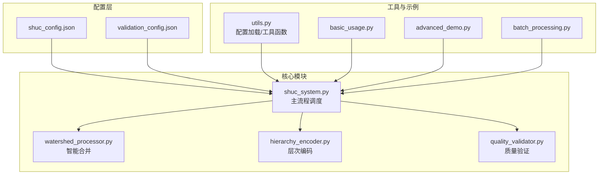
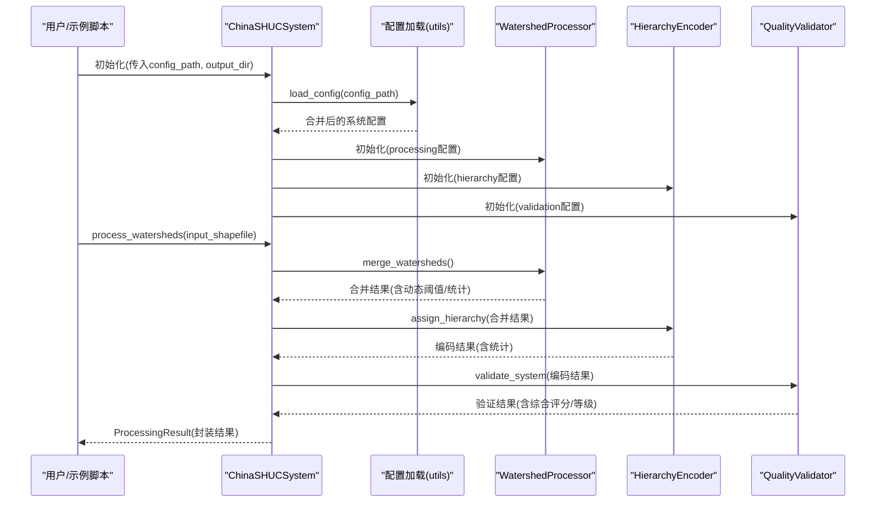
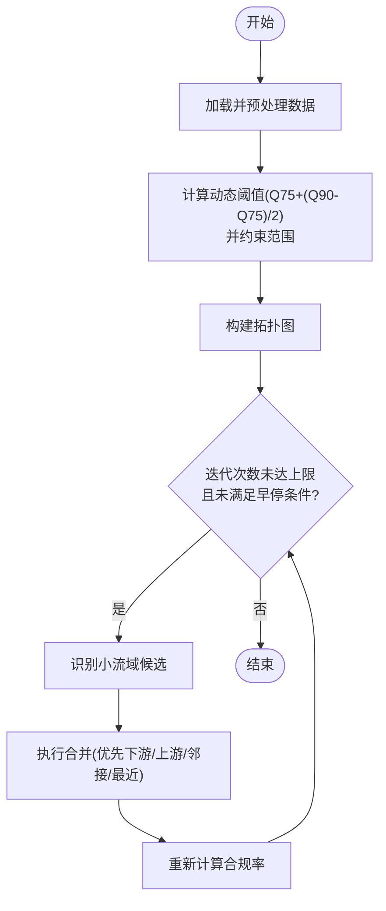
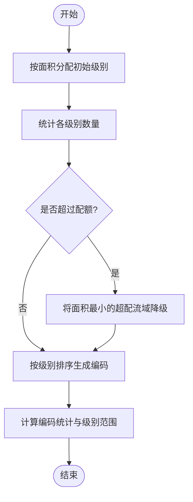
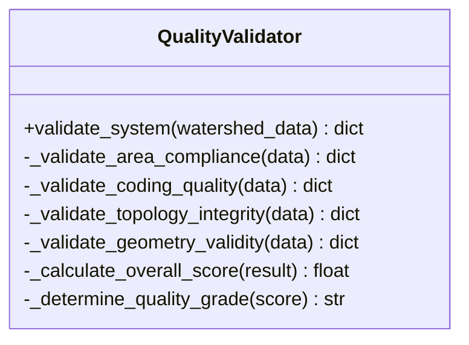
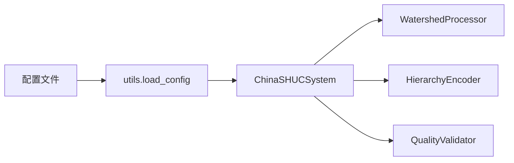

# 配置管理

<cite>
**本文引用的文件**
- [shuc_config.json](file://01_CORE_SYSTEM/config/shuc_config.json)
- [validation_config.json](file://01_CORE_SYSTEM/config/validation_config.json)
- [shuc_system.py](file://01_CORE_SYSTEM/src/shuc_system.py)
- [watershed_processor.py](file://01_CORE_SYSTEM/src/watershed_processor.py)
- [hierarchy_encoder.py](file://01_CORE_SYSTEM/src/hierarchy_encoder.py)
- [quality_validator.py](file://01_CORE_SYSTEM/src/quality_validator.py)
- [utils.py](file://01_CORE_SYSTEM/src/utils.py)
- [basic_usage.py](file://01_CORE_SYSTEM/examples/basic_usage.py)
- [advanced_demo.py](file://01_CORE_SYSTEM/examples/advanced_demo.py)
- [batch_processing.py](file://01_CORE_SYSTEM/examples/batch_processing.py)
</cite>

## 目录
1. [简介](#简介)
2. [项目结构](#项目结构)
3. [核心组件](#核心组件)
4. [架构总览](#架构总览)
5. [详细组件分析](#详细组件分析)
6. [依赖分析](#依赖分析)
7. [性能考量](#性能考量)
8. [故障排查指南](#故障排查指南)
9. [结论](#结论)
10. [附录](#附录)

## 简介
本文件面向SHUC系统配置管理，围绕shuc_config.json与validation_config.json两大配置文件，系统阐述各参数的含义、默认值、可选范围及其对算法行为的影响；并结合核心模块（流域处理器、层次编码器、质量验证器）的实现逻辑，给出性能调优建议、最佳实践与常见错误规避方法，最后提供配置模板与示例，帮助用户按需定制。

## 项目结构
SHUC系统采用“配置文件 + 核心模块”的解耦设计：
- 配置文件位于config目录，分别定义处理策略、层次标准、验证规则与输出选项。
- 核心模块在初始化时读取配置，并在各自处理阶段应用相应参数。
- 示例脚本展示了基础使用、高级配置与批处理对比分析。

图表来源
- [shuc_config.json:1-43](file://01_CORE_SYSTEM/config/shuc_config.json#L1-L43)
- [validation_config.json:1-46](file://01_CORE_SYSTEM/config/validation_config.json#L1-L46)
- [shuc_system.py:51-80](file://01_CORE_SYSTEM/src/shuc_system.py#L51-L80)
- [watershed_processor.py:35-53](file://01_CORE_SYSTEM/src/watershed_processor.py#L35-L53)
- [hierarchy_encoder.py:32-68](file://01_CORE_SYSTEM/src/hierarchy_encoder.py#L32-L68)
- [quality_validator.py:35-60](file://01_CORE_SYSTEM/src/quality_validator.py#L35-L60)
- [utils.py:64-100](file://01_CORE_SYSTEM/src/utils.py#L64-L100)
- [basic_usage.py:25-52](file://01_CORE_SYSTEM/examples/basic_usage.py#L25-L52)
- [advanced_demo.py:31-60](file://01_CORE_SYSTEM/examples/advanced_demo.py#L31-L60)
- [batch_processing.py:41-70](file://01_CORE_SYSTEM/examples/batch_processing.py#L41-L70)

章节来源
- [shuc_config.json:1-43](file://01_CORE_SYSTEM/config/shuc_config.json#L1-L43)
- [validation_config.json:1-46](file://01_CORE_SYSTEM/config/validation_config.json#L1-L46)
- [shuc_system.py:51-80](file://01_CORE_SYSTEM/src/shuc_system.py#L51-L80)
- [utils.py:64-100](file://01_CORE_SYSTEM/src/utils.py#L64-L100)

## 核心组件
- 流域处理器（WatershedProcessor）
  - 动态阈值计算、拓扑图构建、激进合并策略、早停机制与迭代统计。
- 层次编码器（HierarchyEncoder）
  - 基于面积的智能分级、配额优化、编码生成与统计。
- 质量验证器（QualityValidator）
  - 面积合规性、编码唯一性、拓扑完整性、几何有效性与综合评分。
- 配置加载（utils.load_config）
  - 默认配置与用户配置深度合并，缺失项自动回退到默认值。

章节来源
- [watershed_processor.py:35-53](file://01_CORE_SYSTEM/src/watershed_processor.py#L35-L53)
- [hierarchy_encoder.py:32-68](file://01_CORE_SYSTEM/src/hierarchy_encoder.py#L32-L68)
- [quality_validator.py:35-60](file://01_CORE_SYSTEM/src/quality_validator.py#L35-L60)
- [utils.py:64-100](file://01_CORE_SYSTEM/src/utils.py#L64-L100)

## 架构总览
SHUC系统通过配置驱动核心算法的行为，形成“配置→模块→结果”的清晰流水线。

图表来源
- [shuc_system.py:51-80](file://01_CORE_SYSTEM/src/shuc_system.py#L51-L80)
- [shuc_system.py:92-160](file://01_CORE_SYSTEM/src/shuc_system.py#L92-L160)
- [watershed_processor.py:54-81](file://01_CORE_SYSTEM/src/watershed_processor.py#L54-L81)
- [hierarchy_encoder.py:69-95](file://01_CORE_SYSTEM/src/hierarchy_encoder.py#L69-L95)
- [quality_validator.py:61-86](file://01_CORE_SYSTEM/src/quality_validator.py#L61-L86)
- [utils.py:64-100](file://01_CORE_SYSTEM/src/utils.py#L64-L100)

## 详细组件分析

### 配置文件参数详解与影响

#### shuc_config.json（系统级配置）
- processing
  - target_compliance_rate: 目标面积合规率阈值，决定早停条件与合并强度。数值越高，合并越激进，但可能导致拓扑/几何代价增加。
  - merge_strategy: 合并策略（如aggressive）。不同策略会影响候选识别与合并顺序，进而影响拓扑保持与压缩率。
  - max_iterations: 最大迭代次数，控制合并过程上限，防止无限循环。
  - enable_early_stopping: 启用早停后，一旦达到目标合规率即停止迭代。
  - dynamic_threshold_mode: 动态阈值模式（如auto），与watershed_processor的动态阈值计算逻辑联动。
- hierarchy
  - level_4_min_area / level_5_min_area / level_6_min_area: 各级别的最小面积阈值，直接影响初始分级与配额优化。
  - enable_level_quotas: 是否启用配额限制，控制4/5级流域数量上限，避免过度细分。
  - level_quotas: 各级别的配额映射，超出配额的低面积流域会被降级到下一级。
- validation
  - area_compliance_threshold: 验证阶段的面积合规阈值，用于判断整体系统是否达标。
  - coding_uniqueness_threshold: 编码唯一性阈值，用于验证编码质量。
  - topology_completeness_threshold: 拓扑完整性阈值，衡量上下游引用的有效性。
  - enable_geometry_validation: 是否启用几何有效性验证。
  - quality_weights: 面积合规、编码质量、拓扑完整性、几何有效性在综合评分中的权重。
- output
  - save_intermediate_results / enable_detailed_logging / export_validation_report / export_statistics: 控制中间结果与报告导出。
- performance
  - enable_parallel_processing / max_memory_usage_gb / enable_progress_display: 性能相关开关与资源限制。

章节来源
- [shuc_config.json:2-42](file://01_CORE_SYSTEM/config/shuc_config.json#L2-L42)
- [watershed_processor.py:48-53](file://01_CORE_SYSTEM/src/watershed_processor.py#L48-L53)
- [hierarchy_encoder.py:51-67](file://01_CORE_SYSTEM/src/hierarchy_encoder.py#L51-L67)
- [quality_validator.py:44-59](file://01_CORE_SYSTEM/src/quality_validator.py#L44-L59)

#### validation_config.json（验证规则配置）
- thresholds
  - area_compliance_threshold / coding_uniqueness_threshold / topology_completeness_threshold / geometry_validity_threshold / hierarchy_balance_threshold: 各维度的阈值，用于验证与评分。
- quality_weights
  - 与shuc_config.json中的validation.weights一致，用于加权计算总体评分。
- validation_rules
  - require_unique_codes / require_valid_topology / require_valid_geometry / require_area_above_threshold / allow_empty_upstream: 规则开关，决定验证严格程度。
- quality_grades
  - 各等级的最低分数区间与描述，用于将总体评分映射为质量等级。
- report_settings
  - include_detailed_analysis / include_issue_suggestions / include_performance_metrics / export_format: 报告内容与导出格式。

章节来源
- [validation_config.json:2-45](file://01_CORE_SYSTEM/config/validation_config.json#L2-L45)
- [quality_validator.py:44-59](file://01_CORE_SYSTEM/src/quality_validator.py#L44-L59)

### 动态阈值计算与合并策略
- 动态阈值
  - 基于面积分布的分位数计算，公式与范围约束在watershed_processor中实现，确保阈值随数据分布自适应调整。
  - 该阈值直接影响“小流域”识别与合并候选集合，从而影响合规率与压缩率。
- 合并策略
  - 激进策略优先合并面积最小的流域，倾向高压缩率；保守策略更注重拓扑与几何稳定性。
  - 早停机制与最大迭代次数共同控制处理时长与结果收敛性。

图表来源
- [watershed_processor.py:117-141](file://01_CORE_SYSTEM/src/watershed_processor.py#L117-L141)
- [watershed_processor.py:164-220](file://01_CORE_SYSTEM/src/watershed_processor.py#L164-L220)

章节来源
- [watershed_processor.py:117-141](file://01_CORE_SYSTEM/src/watershed_processor.py#L117-L141)
- [watershed_processor.py:164-220](file://01_CORE_SYSTEM/src/watershed_processor.py#L164-L220)

### 层次编码与配额优化
- 初始分级
  - 基于level_4/5/6的最小面积阈值，将流域按面积分配到相应级别。
- 配额优化
  - 若某级别超配额，则将面积最小的多余流域降级到下一级，保证整体结构均衡。
- 编码生成
  - 按级别与面积排序生成固定位数编码，确保唯一性与可读性。

图表来源
- [hierarchy_encoder.py:97-111](file://01_CORE_SYSTEM/src/hierarchy_encoder.py#L97-L111)
- [hierarchy_encoder.py:113-138](file://01_CORE_SYSTEM/src/hierarchy_encoder.py#L113-L138)
- [hierarchy_encoder.py:140-169](file://01_CORE_SYSTEM/src/hierarchy_encoder.py#L140-L169)
- [hierarchy_encoder.py:177-219](file://01_CORE_SYSTEM/src/hierarchy_encoder.py#L177-L219)

章节来源
- [hierarchy_encoder.py:51-67](file://01_CORE_SYSTEM/src/hierarchy_encoder.py#L51-L67)
- [hierarchy_encoder.py:97-138](file://01_CORE_SYSTEM/src/hierarchy_encoder.py#L97-L138)
- [hierarchy_encoder.py:140-169](file://01_CORE_SYSTEM/src/hierarchy_encoder.py#L140-L169)
- [hierarchy_encoder.py:177-219](file://01_CORE_SYSTEM/src/hierarchy_encoder.py#L177-L219)

### 质量验证与综合评分
- 面积合规性
  - 动态阈值与合规率计算与处理器一致，用于衡量系统整体面积分布质量。
- 编码质量
  - 唯一性比率与重复编码数量，用于评估编码体系的可区分度。
- 拓扑完整性
  - 有效/无效引用、孤立流域、循环引用统计，完整性评分用于判断拓扑保持效果。
- 几何有效性
  - 有效/无效/空几何统计与类型分布，用于评估几何质量。
- 综合评分
  - 基于质量权重的加权总分，并映射到质量等级。

图表来源
- [quality_validator.py:61-86](file://01_CORE_SYSTEM/src/quality_validator.py#L61-L86)
- [quality_validator.py:368-411](file://01_CORE_SYSTEM/src/quality_validator.py#L368-L411)

章节来源
- [quality_validator.py:61-86](file://01_CORE_SYSTEM/src/quality_validator.py#L61-L86)
- [quality_validator.py:368-411](file://01_CORE_SYSTEM/src/quality_validator.py#L368-L411)

## 依赖分析
- 配置加载
  - utils.load_config会将默认配置与用户配置深度合并，缺失项自动回退到默认值，确保系统稳定运行。
- 模块耦合
  - ChinaSHUCSystem在初始化时将配置注入到各核心模块，模块之间通过数据结构（GeoDataFrame）传递，耦合度低、职责清晰。
- 外部依赖
  - 核心依赖包括geopandas、pandas、numpy、shapely、networkx等，示例脚本与工具函数中均有版本与依赖检查。

图表来源
- [utils.py:64-100](file://01_CORE_SYSTEM/src/utils.py#L64-L100)
- [shuc_system.py:51-80](file://01_CORE_SYSTEM/src/shuc_system.py#L51-L80)

章节来源
- [utils.py:64-100](file://01_CORE_SYSTEM/src/utils.py#L64-L100)
- [shuc_system.py:51-80](file://01_CORE_SYSTEM/src/shuc_system.py#L51-L80)

## 性能考量
- 处理速度
  - 合并策略与早停机制对速度影响显著：激进策略通常更快达到目标合规率，但可能牺牲拓扑/几何质量；保守策略更稳健但耗时较长。
  - 动态阈值随数据分布变化，可能减少无效合并尝试，提高收敛速度。
- 内存与资源
  - max_memory_usage_gb可用于限制内存占用，避免大规模数据导致OOM。
  - enable_parallel_processing在某些场景下可提升吞吐，但需结合数据规模与I/O瓶颈评估。
- 压缩率与结果质量
  - 高目标合规率与低最小面积阈值可提升压缩率，但可能增加拓扑断裂与几何退化风险。
  - 建议在保证拓扑完整性与几何有效性的前提下，适度提高目标合规率。

章节来源
- [shuc_config.json:38-42](file://01_CORE_SYSTEM/config/shuc_config.json#L38-L42)
- [watershed_processor.py:198-207](file://01_CORE_SYSTEM/src/watershed_processor.py#L198-L207)
- [hierarchy_encoder.py:113-138](file://01_CORE_SYSTEM/src/hierarchy_encoder.py#L113-L138)

## 故障排查指南
- 配置文件加载失败
  - 现象：系统使用默认配置或报错。
  - 排查：检查配置文件路径、JSON语法与字段拼写；确认默认配置回退逻辑是否生效。
- 合并停滞或无进展
  - 现象：合规率长时间不变或下降。
  - 排查：检查动态阈值是否过高、候选识别是否受限、拓扑图是否存在孤岛或环路。
- 编码冲突或唯一性不足
  - 现象：编码重复或唯一性低于阈值。
  - 排查：检查配额优化是否过度降级、编码位数是否足够、是否存在异常面积导致排序异常。
- 几何或拓扑错误
  - 现象：几何无效、拓扑引用缺失或循环引用。
  - 排查：启用几何有效性验证与拓扑完整性验证，修复无效几何与自引用问题。

章节来源
- [utils.py:78-99](file://01_CORE_SYSTEM/src/utils.py#L78-L99)
- [watershed_processor.py:97-115](file://01_CORE_SYSTEM/src/watershed_processor.py#L97-L115)
- [quality_validator.py:255-284](file://01_CORE_SYSTEM/src/quality_validator.py#L255-L284)
- [quality_validator.py:191-223](file://01_CORE_SYSTEM/src/quality_validator.py#L191-L223)

## 结论
SHUC系统的配置管理通过shuc_config.json与validation_config.json实现“目标驱动”的自动化处理。合理设置目标合规率、合并策略、层次阈值与验证权重，可在处理速度与结果质量之间取得平衡。建议以“先验证、再优化”的思路，逐步微调参数，结合批处理对比分析，选择最适合业务场景的配置组合。

## 附录

### 配置模板与示例
- 基础模板（shuc_config.json）
  - 可参考默认配置与示例脚本中的自定义配置片段，按需调整目标合规率、合并策略、层级阈值与验证权重。
- 验证模板（validation_config.json）
  - 可参考默认验证配置，按业务需求调整阈值与权重，确保验证严格度与报告粒度满足要求。
- 示例脚本
  - basic_usage.py：展示基础使用与结果摘要。
  - advanced_demo.py：演示自定义配置与数据质量分析。
  - batch_processing.py：演示多配置对比与综合推荐。

章节来源
- [basic_usage.py:25-60](file://01_CORE_SYSTEM/examples/basic_usage.py#L25-L60)
- [advanced_demo.py:62-98](file://01_CORE_SYSTEM/examples/advanced_demo.py#L62-L98)
- [batch_processing.py:241-302](file://01_CORE_SYSTEM/examples/batch_processing.py#L241-L302)