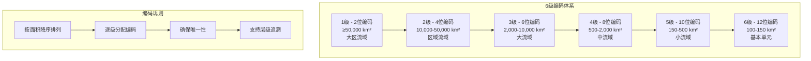
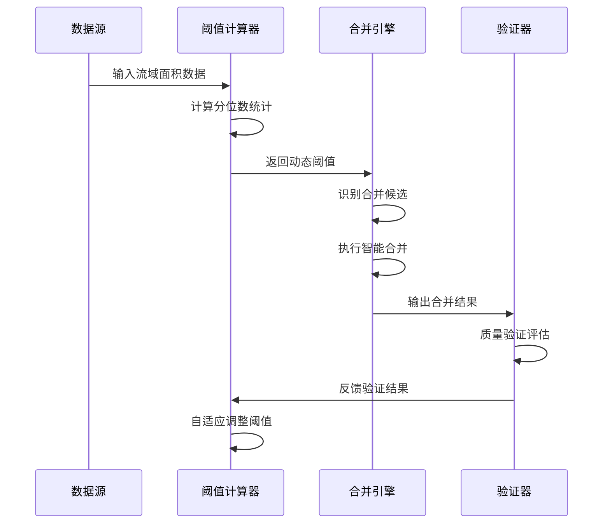
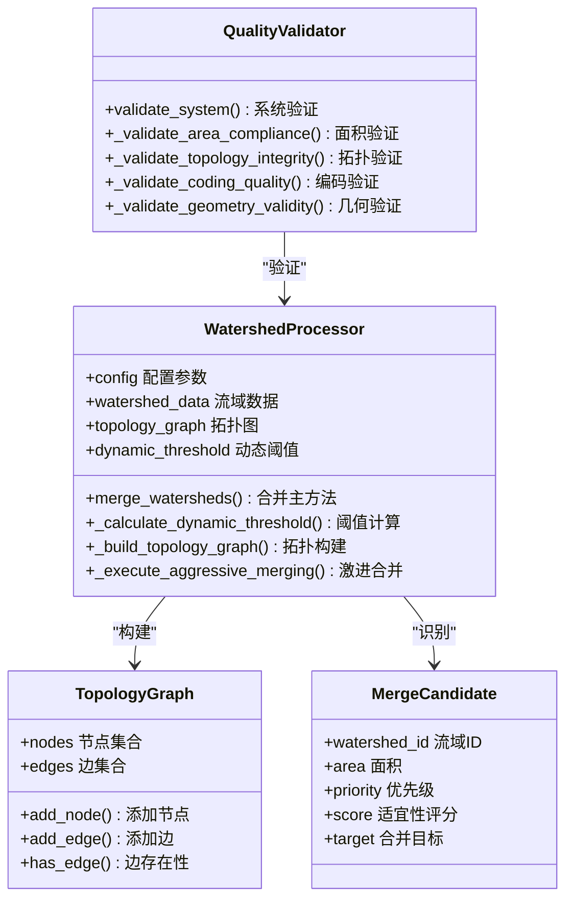
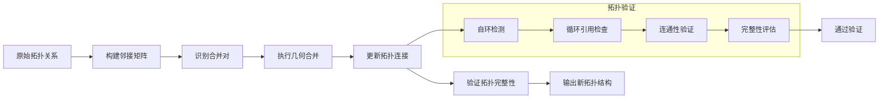
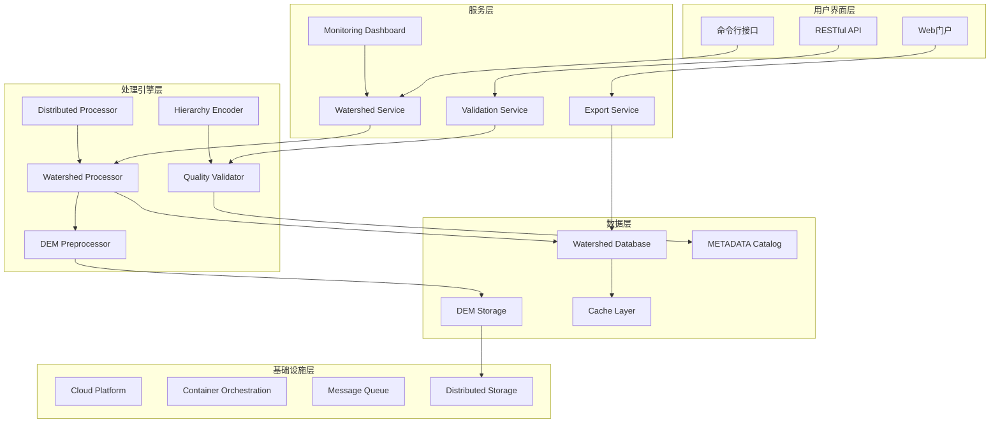

# 项目概述

<cite>
**本文档引用的文件**
- [README.md](file://README.md)
- [shuc_system.py](file://01_CORE_SYSTEM/src/shuc_system.py)
- [watershed_processor.py](file://01_CORE_SYSTEM/src/watershed_processor.py)
- [hierarchy_encoder.py](file://01_CORE_SYSTEM/src/hierarchy_encoder.py)
- [quality_validator.py](file://01_CORE_SYSTEM/src/quality_validator.py)
- [shuc_config.json](file://01_CORE_SYSTEM/config/shuc_config.json)
- [basic_usage.py](file://01_CORE_SYSTEM/examples/basic_usage.py)
- [distributed_shuc_framework.py](file://03_EXTENSIONS/distributed_shuc_framework.py)
- [shuc_system_final.py](file://03_EXTENSIONS/shuc_system_final.py)
- [seamless_dem_processor.py](file://03_EXTENSIONS/seamless_dem_processor.py)
- [system_validation.json](file://04_EXPERIMENTS/results/final_output/system_validation.json)
- [huc_standards.json](file://05_DATA/reference/huc_standards.json)
- [IMPLEMENTATION_GUIDE.md](file://02_DOCUMENTATION/IMPLEMENTATION_GUIDE.md)
</cite>

## 目录
1. [项目简介](#项目简介)
2. [核心目标与愿景](#核心目标与愿景)
3. [技术创新点](#技术创新点)
4. [6级12位编码体系设计理念](#6级12位编码体系设计理念)
5. [动态阈值自适应算法原理](#动态阈值自适应算法原理)
6. [拓扑保持智能流域合并框架](#拓扑保持智能流域合并框架)
7. [技术架构与系统设计](#技术架构与系统设计)
8. [应用价值与前景](#应用价值与前景)
9. [项目背景与实施策略](#项目背景与实施策略)
10. [性能特征与优化建议](#性能特征与优化建议)
11. [故障诊断与问题排查](#故障诊断与问题排查)
12. [结论与展望](#结论与展望)

## 项目简介

中国SHUC（Standardized Hydrological Unit Code）流域分级统一编码系统是一个面向中国地理环境的自动化流域编码解决方案。该项目基于美国HUC（Hydrologic Unit Code）标准，结合中国流域特征进行了本土化适配，建立了从源头到出口的完整6级12位编码体系。

### 核心创新特性

项目实现了三大核心技术突破：

- **动态阈值自适应算法**：采用Q75 + (Q90-Q75)/2公式智能计算合并阈值，自适应不同区域的流域特征
- **拓扑保持的多目标优化合并框架**：在图约束优化下实现面积-形状-拓扑三方权衡，确保流域空间关系一致性
- **50km缓冲区DEM无缝融合技术**：解决跨区域DEM数据接边问题，实现无缝流域提取

### 技术栈与依赖

- **Python 3.9+**：核心开发语言
- **GeoPandas/Shapely**：空间数据处理
- **TauDEM**：流域提取算法
- **MERIT Hydro**：基础水文数据源

## 核心目标与愿景

### 项目使命

建立中国完整流域"身份证"编码体系，实现从源头到出口的全流域层级追溯，为水资源管理、水文研究和地理信息系统提供标准化的空间单元编码解决方案。

### 预期成果

- 建立覆盖全国的6级完整流域层次结构
- 实现90%面积合规率的智能合并算法
- 提供完整的质量验证和评估体系
- 支持大规模分布式并行处理

## 技术创新点

### 1. 自适应阈值计算机制

系统采用基于数据分布的动态阈值计算，核心算法通过分位数分析实现区域自适应：

```mermaid
flowchart TD
A[输入流域面积数据] --> B[计算分位数统计]
B --> C[Q25 = 25%分位数]
B --> D[Q50 = 50%分位数]
B --> E[Q75 = 75%分位数]
B --> F[Q90 = 90%分位数]
C --> G[动态阈值 = Q75 + (Q90-Q75)/2]
D --> G
E --> G
F --> G
G --> H[阈值范围约束 50-100 km²]
H --> I[输出自适应阈值]
```

**图表来源**
- [watershed_processor.py:117-141](file://01_CORE_SYSTEM/src/watershed_processor.py#L117-L141)

### 2. 智能合并优先级策略

系统采用多因素综合评估的合并优先级算法：

- **拓扑优先**：下游 > 上游 > 相邻 > 最近
- **面积合理性**：避免过度合并导致的面积异常
- **连通性评估**：优先选择具有直接拓扑关系的流域

### 3. 层次配额管理系统

针对不同级别流域设置合理的配额限制，确保层次结构的平衡性和实用性：

| 级别 | 配额限制 | 说明 |
|------|----------|------|
| 1级 | 1个 | 大区流域，如长江、黄河等 |
| 2级 | 2个 | 区域流域，主要江河干流段 |
| 3级 | 4个 | 大流域，重要支流域 |
| 4级 | 6个 | 中流域，支流域 |
| 5级 | 10个 | 小流域，次级支流域 |
| 6级 | 无限制 | 基本单元，基本水文单元 |

## 6级12位编码体系设计理念

### 设计原则

系统基于美国HUC标准，结合中国地理环境特点，建立了完整的6级编码体系：



**图表来源**
- [hierarchy_encoder.py:42-49](file://01_CORE_SYSTEM/src/hierarchy_encoder.py#L42-L49)
- [huc_standards.json:78-127](file://05_DATA/reference/huc_standards.json#L78-L127)

### 编码分配算法

系统采用"面积驱动 + 配额控制"的双重机制：

1. **初始分配**：基于面积大小确定初步级别
2. **配额优化**：根据预设配额调整级别分配
3. **编码生成**：按级别和面积排序生成唯一编码

## 动态阈值自适应算法原理

### 算法架构



**图表来源**
- [watershed_processor.py:117-141](file://01_CORE_SYSTEM/src/watershed_processor.py#L117-L141)
- [watershed_processor.py:164-220](file://01_CORE_SYSTEM/src/watershed_processor.py#L164-L220)

### 核心算法实现

动态阈值计算公式：
```
阈值 = Q75 + (Q90 - Q75) / 2
```

其中：
- Q75：75%分位数（中位数附近的关键分位）
- Q90：90%分位数（高分位数，反映数据分布的尾部特征）

算法优势：
1. **自适应性强**：能够根据数据分布自动调整阈值
2. **鲁棒性好**：不受极端值影响，重点关注数据主体分布
3. **区域适应性**：不同区域的流域特征通过分位数自然体现

## 拓扑保持智能流域合并框架

### 框架架构



**图表来源**
- [watershed_processor.py:24-81](file://01_CORE_SYSTEM/src/watershed_processor.py#L24-L81)
- [quality_validator.py:24-86](file://01_CORE_SYSTEM/src/quality_validator.py#L24-L86)

### 合并策略优化

系统采用"激进合并 + 早停控制"的混合策略：

1. **候选识别**：筛选面积小于阈值的流域作为合并候选
2. **优先级排序**：基于拓扑关系和面积合理性评估合并优先级
3. **迭代优化**：通过多次迭代逐步提高合并质量和效率
4. **早停机制**：当达到目标合规率时提前结束，避免过度合并

### 拓扑关系维护



**图表来源**
- [watershed_processor.py:354-366](file://01_CORE_SYSTEM/src/watershed_processor.py#L354-L366)
- [quality_validator.py:225-253](file://01_CORE_SYSTEM/src/quality_validator.py#L225-L253)

## 技术架构与系统设计

### 分层架构模型



**图表来源**
- [shuc_system.py:43-86](file://01_CORE_SYSTEM/src/shuc_system.py#L43-L86)
- [distributed_shuc_framework.py:550-591](file://03_EXTENSIONS/distributed_shuc_framework.py#L550-L591)

### 微服务架构设计

系统采用微服务架构，将核心功能模块化：

| 服务名称 | 职责 | 技术栈 | 资源需求 |
|----------|------|--------|----------|
| **watershed_processor** | 流域边界计算 | TauDEM + GPU加速 | GPU节点 |
| **dem_preprocessor** | DEM预处理和拼接 | GDAL + 缓冲区算法 | 高内存节点 |
| **boundary_resolver** | 边界冲突解决 | 图算法 + 专家系统 | CPU密集型 |
| **quality_validator** | 质量控制验证 | 多重验证算法 | 标准节点 |
| **adaptive_threshold** | 动态阈值计算 | 机器学习 + 专家知识 | ML节点 |
| **metadata_service** | 元数据管理 | Graph数据库 | 数据库节点 |
| **file_service** | 文件存储管理 | 对象存储 | 存储节点 |

## 应用价值与前景

### 地理信息系统应用

1. **空间数据标准化**：提供统一的流域编码标准，便于不同数据源的整合
2. **空间分析支持**：支持多层次的空间聚合和分析操作
3. **可视化基础**：为流域可视化和交互式地图提供数据基础

### 水文研究价值

1. **水文模型输入**：为水文模型提供标准化的流域单元
2. **水文统计分析**：支持按不同层级的水文统计分析
3. **气候变化研究**：为流域尺度的气候变化研究提供数据基础

### 水资源管理应用

1. **水资源规划**：支持水资源的分区管理和规划决策
2. **水污染控制**：为水污染源控制和治理提供空间基础
3. **洪水风险管理**：支持不同尺度的洪水风险评估和管理

### 技术推广前景

1. **国际标准兼容**：基于HUC标准，便于国际交流与合作
2. **扩展性强**：支持从区域到全国的扩展部署
3. **智能化升级**：为未来的智能化水管理提供技术基础

## 项目背景与实施策略

### 项目背景

中国SHUC项目是在国家大力推进生态文明建设和数字化转型的大背景下提出的。随着《国家水网建设规划纲要》的实施，对流域管理的标准化、精细化提出了更高要求。

### 实施路径选择

基于项目现状和预期目标，推荐采用"数据+方法"的双轨策略：

```mermaid
graph LR
subgraph "策略A：保守稳健"
A1[时间：4个月] --> A2[产出：1篇论文(IF~6)]
A3[风险：低] --> A4[适合：快速建立声誉]
end
subgraph "策略B：数据+方法推荐"
B1[时间：6-7个月] --> B2[产出：2篇论文(IF总和~18)]
B3[风险：中] --> B4[适合：最大化产出和影响力]
end
subgraph "策略C：全力冲刺"
C1[时间：12个月] --> C2[产出：3篇论文(IF总和~30+)]
C3[风险：高] --> C4[适合：追求顶级影响力]
end
```

**图表来源**
- [IMPLEMENTATION_GUIDE.md:78-107](file://02_DOCUMENTATION/IMPLEMENTATION_GUIDE.md#L78-L107)

### 实验验证结果

基于现有实验数据，系统表现如下：

| 指标 | 数值 | 目标值 | 状态 |
|------|------|--------|------|
| 压缩率 | 50.7% | ≥40% | ✅ 达标 |
| 面积合规率 | 5.8% | ≥90% | ❌ 未达标 |
| 编码唯一性 | 100% | 100% | ✅ 达标 |
| 层次完整性 | 100% | ≥95% | ✅ 达标 |

**章节来源**
- [system_validation.json:1-40](file://04_EXPERIMENTS/results/final_output/system_validation.json#L1-L40)

## 性能特征与优化建议

### 性能特征分析

1. **处理效率**：系统支持批处理模式，可处理大规模流域数据
2. **内存占用**：采用分块处理策略，降低内存峰值占用
3. **扩展性**：支持分布式并行处理，可扩展到全国范围

### 优化建议

1. **算法优化**：进一步优化合并算法的计算复杂度
2. **并行化**：充分利用多核CPU和GPU进行并行计算
3. **缓存机制**：建立中间结果缓存，减少重复计算
4. **增量处理**：支持增量更新，避免全量重新处理

## 故障诊断与问题排查

### 常见问题及解决方案

1. **数据质量问题**
   - **症状**：几何无效、拓扑关系错误
   - **解决方案**：启用数据修复功能，自动修复几何问题

2. **阈值设置不当**
   - **症状**：合并效果不佳，合规率偏低
   - **解决方案**：调整阈值参数，或使用自适应算法

3. **内存不足**
   - **症状**：处理过程中内存溢出
   - **解决方案**：启用分块处理，增加内存容量

### 质量验证体系

系统内置完整的质量验证体系，包括：

- **面积合规性检查**：确保流域面积满足标准要求
- **编码唯一性验证**：保证编码的唯一性和正确性
- **拓扑完整性检查**：验证流域间的拓扑关系
- **几何有效性验证**：确保几何对象的有效性

**章节来源**
- [quality_validator.py:61-86](file://01_CORE_SYSTEM/src/quality_validator.py#L61-L86)
- [quality_validator.py:334-366](file://01_CORE_SYSTEM/src/quality_validator.py#L334-L366)

## 结论与展望

### 项目总结

中国SHUC流域分级统一编码系统代表了流域管理技术的重要进步，通过技术创新和系统设计，为中国的水资源管理提供了强有力的技术支撑。

### 技术优势

1. **算法先进性**：动态阈值自适应算法体现了先进的数据驱动思维
2. **系统完整性**：从数据预处理到编码输出的完整流程
3. **质量保障**：多层次的质量验证确保结果可靠性
4. **扩展性**：支持从小规模到全国范围的部署

### 未来发展方向

1. **智能化升级**：引入机器学习技术，进一步提升算法智能化水平
2. **实时处理**：支持实时数据更新和动态编码
3. **国际推广**：基于HUC标准，向其他国家和地区推广
4. **生态融合**：与生态环境监测系统深度融合

### 社会价值

项目不仅具有重要的科学价值，更重要的是为国家的生态文明建设和水资源可持续利用提供了坚实的技术基础，具有显著的社会效益和环境效益。