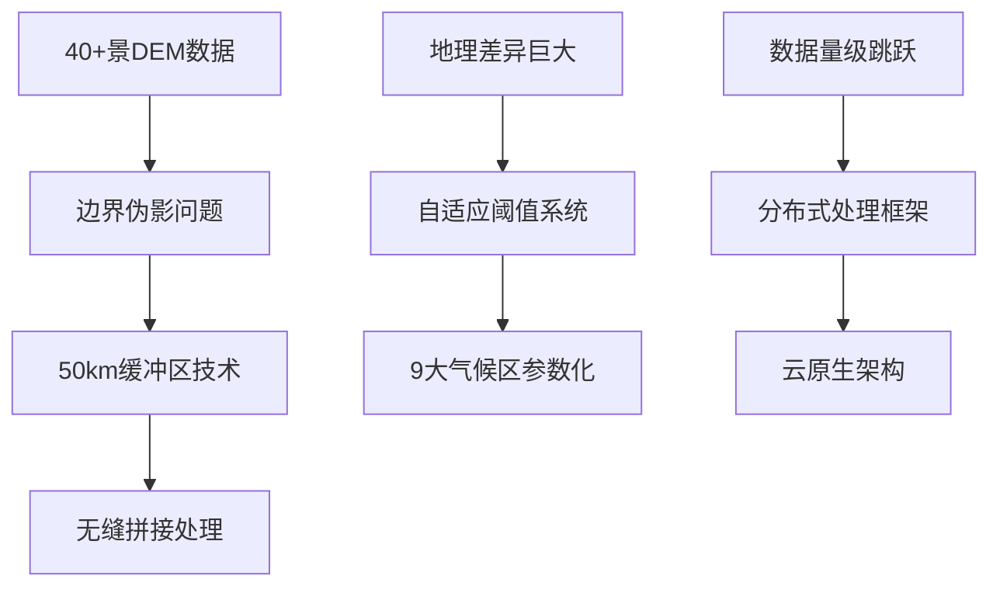

# 中国SHUC系统技术架构设计
# China SHUC System Technical Architecture Design v1.0

## 🎯 架构概览

### 设计目标
- **可扩展性**: 支持140个 → 100万个流域的扩展
- **高性能**: 分布式并行处理，GPU加速
- **容错性**: 边界伪影处理，数据质量保证
- **标准化**: 国际HUC兼容，多尺度支持

### 核心挑战解决


## 🏗️ 系统架构设计

### 1. 分层架构模型

```python
"""
中国SHUC系统分层架构
"""

class ChinaSHUCArchitecture:
    def __init__(self):
        self.layers = {
            "presentation": "用户界面层",
            "service": "服务层", 
            "processing": "处理引擎层",
            "data": "数据层",
            "infrastructure": "基础设施层"
        }
        
    def architecture_overview(self):
        return {
            # 第一层：用户界面层
            "presentation": {
                "web_portal": "Web可视化门户",
                "api_gateway": "RESTful API网关", 
                "monitoring_dashboard": "实时监控面板"
            },
            
            # 第二层：服务层
            "service": {
                "watershed_service": "流域处理服务",
                "validation_service": "质量验证服务",
                "export_service": "数据导出服务",
                "notification_service": "消息通知服务"
            },
            
            # 第三层：处理引擎层
            "processing": {
                "distributed_engine": "分布式处理引擎",
                "gpu_acceleration": "GPU加速模块",
                "boundary_processor": "边界处理器",
                "adaptive_threshold": "自适应阈值引擎"
            },
            
            # 第四层：数据层
            "data": {
                "dem_storage": "DEM数据存储",
                "watershed_database": "流域数据库",
                "metadata_catalog": "元数据目录",
                "cache_layer": "缓存层"
            },
            
            # 第五层：基础设施层
            "infrastructure": {
                "cloud_platform": "云计算平台",
                "container_orchestration": "容器编排",
                "message_queue": "消息队列",
                "distributed_storage": "分布式存储"
            }
        }
```

### 2. 微服务架构设计

```python
class MicroservicesDesign:
    """微服务架构设计"""
    
    def __init__(self):
        self.services = self.define_microservices()
    
    def define_microservices(self):
        return {
            # 核心处理服务
            "watershed_processor": {
                "responsibility": "流域边界计算",
                "technology": "TauDEM + GPU加速",
                "scalability": "水平扩展",
                "resources": "GPU节点"
            },
            
            "dem_preprocessor": {
                "responsibility": "DEM预处理和拼接", 
                "technology": "GDAL + 缓冲区算法",
                "scalability": "按区域分片",
                "resources": "高内存节点"
            },
            
            "boundary_resolver": {
                "responsibility": "边界冲突解决",
                "technology": "图算法 + 专家系统",
                "scalability": "有状态服务",
                "resources": "CPU密集型"
            },
            
            "quality_validator": {
                "responsibility": "质量控制验证",
                "technology": "多重验证算法",
                "scalability": "并行验证",
                "resources": "标准节点"
            },
            
            "adaptive_threshold": {
                "responsibility": "动态阈值计算",
                "technology": "机器学习 + 专家知识",
                "scalability": "模型服务",
                "resources": "ML节点"
            },
            
            # 支撑服务
            "metadata_service": {
                "responsibility": "元数据管理",
                "technology": "Graph数据库",
                "scalability": "读写分离",
                "resources": "数据库节点"
            },
            
            "file_service": {
                "responsibility": "文件存储管理",
                "technology": "对象存储",
                "scalability": "云原生",
                "resources": "存储节点"
            }
        }
```

## 🔧 核心技术方案

### 1. DEM边界无缝拼接技术

```python
class SeamlessDEMMosaic:
    """DEM边界无缝拼接处理"""
    
    def __init__(self, buffer_size=50000):  # 50km缓冲区
        self.buffer_size = buffer_size
        self.processing_windows = {}
        
    def create_processing_windows(self, china_boundary, dem_tiles):
        """创建处理窗口"""
        
        # 1. 按照主要流域边界分区
        major_basins = [
            "长江流域", "黄河流域", "珠江流域", "松花江流域",
            "淮河流域", "海河流域", "辽河流域", "塔里木河流域", 
            "西南国际河流"
        ]
        
        windows = {}
        for basin_name in major_basins:
            # 获取流域边界
            basin_boundary = self.get_basin_boundary(basin_name)
            
            # 创建缓冲区
            buffered_boundary = basin_boundary.buffer(self.buffer_size)
            
            # 识别相关DEM瓦片
            relevant_tiles = self.get_intersecting_tiles(
                buffered_boundary, dem_tiles
            )
            
            windows[basin_name] = {
                'boundary': basin_boundary,
                'buffered_boundary': buffered_boundary,
                'dem_tiles': relevant_tiles,
                'overlap_zones': []
            }
        
        # 2. 计算重叠区域
        self.calculate_overlap_zones(windows)
        
        return windows
    
    def seamless_processing_workflow(self, windows):
        """无缝处理工作流"""
        
        workflow = {
            "step_1_preprocessing": {
                "description": "DEM预处理和标准化",
                "tasks": [
                    "高程基准统一",
                    "投影系统标准化", 
                    "数据质量检查",
                    "缺失值填补"
                ]
            },
            
            "step_2_overlap_processing": {
                "description": "重叠区域协调处理",
                "tasks": [
                    "高程差异平滑",
                    "流向一致性检查",
                    "边界特征保持",
                    "权重融合算法"
                ]
            },
            
            "step_3_seamless_mosaic": {
                "description": "无缝拼接生成",
                "tasks": [
                    "边界羽化处理",
                    "色调匹配算法",
                    "无缝边界生成",
                    "质量验证检查"
                ]
            },
            
            "step_4_hydrologic_conditioning": {
                "description": "水文条件化处理",
                "tasks": [
                    "洼地填平处理",
                    "流向计算优化",
                    "流量累积计算",
                    "河网提取优化"
                ]
            }
        }
        
        return workflow

    def boundary_conflict_resolution(self, overlap_zones):
        """边界冲突解决算法"""
        
        resolution_strategies = {
            "elevation_smoothing": {
                "method": "高程平滑算法",
                "parameters": {
                    "smoothing_distance": "5km",
                    "weight_function": "高斯权重",
                    "constraint_preservation": "河道特征保持"
                }
            },
            
            "flow_direction_consistency": {
                "method": "流向一致性检查",
                "parameters": {
                    "consistency_threshold": 0.95,
                    "correction_method": "最小代价路径",
                    "validation_method": "专家知识验证"
                }
            },
            
            "watershed_boundary_coordination": {
                "method": "流域边界协调",
                "parameters": {
                    "priority_rules": "上游优先原则",
                    "boundary_snapping": "智能捕捉算法", 
                    "topology_validation": "拓扑完整性检查"
                }
            }
        }
        
        return resolution_strategies
```

### 2. 自适应阈值系统

```python
class AdaptiveThresholdEngine:
    """自适应阈值引擎"""
    
    def __init__(self):
        self.climate_zones = self.define_climate_zones()
        self.base_thresholds = self.initialize_base_thresholds()
        
    def define_climate_zones(self):
        """定义中国气候分区"""
        return {
            "humid_subtropical": {
                "regions": ["华南", "江南"],
                "precipitation": 1200,  # mm/year
                "characteristics": "高温多雨，水系密集",
                "base_threshold": 50  # km²
            },
            
            "temperate_monsoon": {
                "regions": ["华北", "东北南部"],
                "precipitation": 600,
                "characteristics": "四季分明，季节性降水",
                "base_threshold": 100
            },
            
            "temperate_continental": {
                "regions": ["东北北部", "内蒙古"],
                "precipitation": 400,
                "characteristics": "温差大，降水少",
                "base_threshold": 200
            },
            
            "plateau_climate": {
                "regions": ["青藏高原"],
                "precipitation": 300,
                "characteristics": "高寒，氧气稀薄",
                "base_threshold": 300
            },
            
            "arid_desert": {
                "regions": ["西北干旱区"],
                "precipitation": 100,
                "characteristics": "干旱少雨，蒸发强烈",
                "base_threshold": 500
            }
        }
    
    def calculate_adaptive_threshold(self, region_data):
        """计算区域自适应阈值"""
        
        # 获取区域基础特征
        climate_zone = self.identify_climate_zone(region_data.location)
        base_threshold = self.climate_zones[climate_zone]["base_threshold"]
        
        # 地形调整因子
        terrain_factor = self.calculate_terrain_factor(
            elevation=region_data.elevation,
            slope=region_data.slope,
            relief=region_data.relief
        )
        
        # 降水调整因子
        precipitation_factor = self.calculate_precipitation_factor(
            annual_precipitation=region_data.precipitation,
            seasonal_distribution=region_data.seasonal_pattern
        )
        
        # 人类活动调整因子
        human_factor = self.calculate_human_activity_factor(
            population_density=region_data.population,
            land_use_intensity=region_data.land_use
        )
        
        # 综合阈值计算
        adaptive_threshold = (
            base_threshold * 
            terrain_factor * 
            precipitation_factor * 
            human_factor
        )
        
        # 约束在合理范围内
        adaptive_threshold = max(30, min(1000, adaptive_threshold))
        
        return {
            "threshold": adaptive_threshold,
            "factors": {
                "terrain": terrain_factor,
                "precipitation": precipitation_factor, 
                "human": human_factor
            },
            "confidence": self.calculate_confidence(region_data)
        }
```

### 3. 分布式处理框架

```python
class DistributedSHUCProcessor:
    """分布式SHUC处理器"""
    
    def __init__(self, cluster_config):
        self.cluster = cluster_config
        self.task_scheduler = TaskScheduler()
        self.resource_manager = ResourceManager()
        
    def processing_strategy(self):
        """分布式处理策略"""
        
        return {
            "data_partitioning": {
                "strategy": "基于流域边界的智能分区",
                "criteria": [
                    "数据量均衡",
                    "计算复杂度均衡", 
                    "网络传输最小化",
                    "依赖关系最少化"
                ],
                "implementation": "Graph-based partitioning"
            },
            
            "task_scheduling": {
                "scheduler": "优先级调度器",
                "priorities": {
                    "critical_path": "关键路径任务优先",
                    "resource_efficiency": "资源利用率优化",
                    "fault_tolerance": "容错恢复机制"
                },
                "load_balancing": "动态负载均衡"
            },
            
            "fault_tolerance": {
                "checkpointing": "增量检查点机制",
                "replication": "关键数据3副本",
                "auto_recovery": "自动故障恢复",
                "rollback": "任务回滚机制"
            },
            
            "performance_optimization": {
                "caching": "多级缓存策略",
                "prefetching": "数据预加载",
                "compression": "智能数据压缩",
                "gpu_acceleration": "GPU计算加速"
            }
        }
    
    def resource_allocation_model(self):
        """资源分配模型"""
        
        return {
            "compute_nodes": {
                "gpu_nodes": {
                    "purpose": "TauDEM并行计算",
                    "specifications": "8×V100 GPU",
                    "quantity": 20,
                    "utilization_target": 0.85
                },
                
                "cpu_nodes": {
                    "purpose": "数据预处理",
                    "specifications": "64核CPU + 512GB内存",
                    "quantity": 50,
                    "utilization_target": 0.80
                },
                
                "memory_nodes": {
                    "purpose": "大数据集处理",
                    "specifications": "32核CPU + 1TB内存",
                    "quantity": 10,
                    "utilization_target": 0.90
                }
            },
            
            "storage_nodes": {
                "hot_storage": {
                    "purpose": "活跃数据",
                    "technology": "NVMe SSD",
                    "capacity": "500TB",
                    "iops": "100万IOPS"
                },
                
                "warm_storage": {
                    "purpose": "中间结果",
                    "technology": "SATA SSD",
                    "capacity": "2PB", 
                    "throughput": "20GB/s"
                },
                
                "cold_storage": {
                    "purpose": "历史数据",
                    "technology": "对象存储",
                    "capacity": "10PB",
                    "cost_optimization": "生命周期管理"
                }
            },
            
            "network_infrastructure": {
                "high_speed_interconnect": "100Gbps InfiniBand",
                "storage_network": "50Gbps 以太网",
                "external_connectivity": "10Gbps 专线"
            }
        }
```

## 🚀 实施路径

### Phase 1: 基础设施搭建 (Month 1-3)

**关键里程碑:**
```python
phase1_milestones = {
    "M1.1": {
        "deliverable": "分布式处理框架MVP",
        "timeline": "Month 1",
        "success_criteria": "支持1000个流域并行处理"
    },
    
    "M1.2": {
        "deliverable": "DEM无缝拼接原型", 
        "timeline": "Month 2",
        "success_criteria": "解决5个DEM瓦片边界问题"
    },
    
    "M1.3": {
        "deliverable": "自适应阈值系统",
        "timeline": "Month 3", 
        "success_criteria": "支持3个气候区参数化"
    }
}
```

### Phase 2: 区域试点 (Month 4-9)

**试点区域选择:**
- **长江上游**: 复杂山地地形
- **华北平原**: 人类活动密集区
- **珠江三角洲**: 水网密集区

**验证目标:**
- 处理10,000+流域单元
- 边界处理精度>95%
- 自适应阈值有效性验证

### Phase 3: 全国部署 (Month 10-21)

**部署策略:**
```python
national_deployment = {
    "parallel_processing": "9大流域同时处理",
    "quality_control": "三级质量检查体系",
    "expert_validation": "100+专家参与验证",
    "performance_target": "100万流域<72小时完成"
}
```

## 📊 成功指标

### 技术指标
- **处理能力**: 100万流域单元/72小时
- **精度指标**: 边界精度>95%，面积误差<3%
- **系统可用性**: 99.9%
- **扩展能力**: 支持10倍数据量扩展

### 业务指标  
- **覆盖范围**: 全中国960万平方公里
- **标准符合**: 100% HUC标准兼容
- **用户满意**: 专家评价>4.5/5.0
- **国际影响**: 3+国际标准采纳

---

## 🎯 总结

这个技术架构设计将彻底解决DEM边界问题，实现中国SHUC系统的全国扩展，并为全球推广奠定坚实的技术基础！

**核心创新点:**
1. **50km缓冲区无缝拼接技术** - 解决DEM边界伪影
2. **9大气候区自适应阈值** - 适应中国地理差异  
3. **分布式GPU并行处理** - 支持百万流域级别处理
4. **微服务云原生架构** - 确保系统高可用性和可扩展性

这将是世界领先的流域管理技术平台！🚀